# AI Daily Headlines｜2026-08-26

- Language: English
- Time zone: Asia/Singapore
- News window: 2026-08-25 07:30 to 2026-08-26 07:30
- Research cutoff: 2026-08-26 09:58
- Core stories: 8
- Other notable items: 3

## A. The 3 Most Important Things Today

**1. Agent orchestration is clearly moving from scheduled execution toward event-driven triggering.** OpenAI connected new Gmail messages, Slack channel messages, and GitHub Pull Request activity to Scheduled Tasks in ChatGPT Work, while also allowing task templates to be shared within a workspace. For production agents, this matters far more than another chat feature: triggers, identity propagation, idempotency, retries, and auditability become core Harness concerns. citeturn185652view0

**2. The enterprise AI control plane itself is becoming agentic.** OpenAI’s Admin plugin lets administrators query adoption, members, permissions, usage limits, and spending in ChatGPT Work and Codex, while performing write actions within existing RBAC boundaries. OpenAI also says its internal IT agent was resolving about 45% of ticket volume at the time of reporting. The next phase of enterprise AI competition is not just about how many business tools an agent can call, but whether governance tools themselves can be safely exposed to agents. citeturn684598view1

**3. Inference competition is becoming a coordinated model-software-silicon race.** OpenAI published the first measured results for its Jalapeño custom inference chip and plans to begin internal deployment by the end of 2026. It is also explicitly framing chips, serving, routing, context management, and product experience as one full-stack optimization problem. For model buyers, the implication is straightforward: compare total cost and latency per successful task, not just list price per million tokens. citeturn469079news14turn469079news15

## B. Core Stories

### 1. OpenAI adds webhook-triggered Scheduled Tasks, moving agents from polling toward event-driven execution

- Category: Agent / Infrastructure
- Information status: Official product update
- Published: 2026-08-25; exact time not published
- Availability: Publicly available for ChatGPT Business; Enterprise/Edu and other workspaces depend on admin policy

**Fact summary**: On August 25, OpenAI updated the ChatGPT Business Release Notes to allow Scheduled Tasks in ChatGPT Work to respond to connected-app events through webhooks. The first officially supported triggers include new Gmail messages, Slack channel messages, and GitHub Pull Request activity. Tasks can also be shared within the same workspace; recipients create an independent copy that runs with their own connected apps and permissions rather than inheriting the creator’s credentials. citeturn185652view0

**What changed versus before**: Scheduled Tasks could already run once, repeat on a schedule, or monitor for changes, but this release elevates external application events into a first-class trigger and adds reusable workspace sharing. The architectural shift is from “the agent periodically checks” to “the business system wakes the agent when state changes.”

**Why it matters**: Event-driven execution cuts idle polling and improves response latency, but it also imports classic distributed-systems problems into agent platforms: duplicate delivery, out-of-order events, re-entrancy, partial completion, tool side effects, and identity propagation across systems. A demo that says “review a PR when it changes” is not the same thing as a production system that can safely handle retries and concurrency.

**Practical impact**: AI Builders should decouple the trigger layer from the reasoning layer. Tech Leads need explicit event schemas, idempotency keys, retry/backoff rules, and dead-letter handling. Enterprise platform teams should log the actor, tenant, source event, downstream tool calls, and final side effects in one trace. For workflows that currently scan mailboxes, ticket queues, or repositories every few minutes, this is a direct architecture-upgrade signal.

**Role perspective**:
- AI Builder: prioritize migrating high-frequency but sparse polling PoCs to event-driven flows.
- Product owner: reassess whether lower event-to-action latency creates new product value.
- Tech Lead: treat idempotency, state machines, and replay as runtime requirements.
- Department manager: shared task templates improve reuse, but each executor still owns their permission boundary.

**Action to borrow**: Add a standard trigger envelope to one existing internal agent: `event_id`, `actor`, `tenant`, `source`, `timestamp`, `idempotency_key`, and authorization context. Only after policy checks should the event enter a tool chain capable of external side effects.

**Risks and uncertainty**: The official webhook set is still limited, and availability depends on plan, connected apps, and admin policy. Event triggering does not automatically solve bad authorization, duplicate execution, or eventual-consistency issues in downstream systems.

**Next signals to watch**:
1. Whether OpenAI exposes generic custom webhooks;
2. Whether retries, dead-letter queues, execution history, and idempotency APIs become explicit;
3. Whether Codex gains more repository-native event automation.

**Mermaid diagram A: event-driven agent call chain**

**Mermaid diagram B: migration decision**

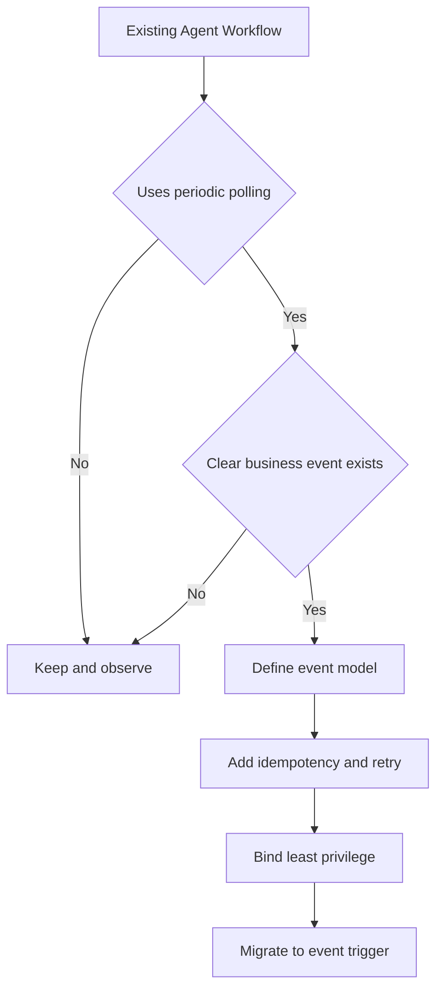

**Source**: OpenAI ChatGPT Business Release Notes. citeturn185652view0

---

### 2. OpenAI launches Admin plugin, turning the enterprise AI control plane into agent-callable tools

- Category: Agent / Security / Infrastructure
- Information status: Official product update
- Published: 2026-08-25; exact time not published
- Availability: ChatGPT Work / Codex; must be enabled and installed in the workspace

**Fact summary**: OpenAI released the Admin plugin, allowing administrators to inspect workspace usage and credits, add or remove members and groups, review and modify access, adjust usage limits, and process spending requests from ChatGPT Work and Codex. OpenAI says the plugin respects each user’s existing role, permissions, workspace policies, and approval requirements and does not grant broader access. It also disclosed that a ChatGPT Work IT agent in Slack was resolving about 45% of ticket volume at the time of reporting. citeturn684598view1

**What changed versus before**: The Admin Console is designed for humans and Admin APIs for scripts and programs. This release packages control-plane actions as permission-aware tools that an agent can invoke inside a conversation or workflow. Governance is moving from a separate back-office surface into the agent execution path.

**Why it matters**: Once enterprise agents move into production, the hard problem is usually not whether the model can reason, but who is allowed to do what, who approves it, how it can be reversed, and how the organization proves no boundary was crossed. The Admin plugin demonstrates an important pattern: do not give the agent a universal admin token; instead, map existing RBAC into constrained, structured, auditable tool actions.

**Practical impact**: Internal Harness, model-gateway, and AI-platform teams should redesign management APIs as agent tools with explicit input schemas, identity, risk levels, approval conditions, and structured results. Models will change frequently, but a policy-controlled action runtime is likely to persist longer.

**Role perspective**:
- AI Builder: tool schemas should explicitly describe side effects.
- Product owner: make permission visibility and execution confirmation part of the user experience.
- Tech Lead: do not expose high-privilege tokens directly to the model.
- Department manager: automate low-risk admin requests while retaining approval for high-impact actions.

**Action to borrow**: Split internal management capabilities into three tiers: read-only, low-risk writes, and high-risk writes. Auto-execute reads, policy-check low-risk writes, require approval for high-risk writes, and generate a structured audit event after every mutation.

**Risks and uncertainty**: OpenAI has not demonstrated that every complex multi-level enterprise role and exception policy maps cleanly to this model at scale. Correct permissions do not guarantee correct decisions; prompt injection or misleading context can still cause a legitimate identity to perform the wrong action.

**Next signals to watch**:
1. Action-level policy and programmable approval rules;
2. Unified audit-event or SIEM integration;
3. Expansion of agentic administration to broader SaaS and infrastructure control planes.

**Mermaid diagram A: agentic admin control plane**

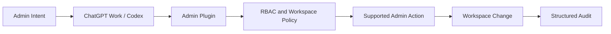

**Mermaid diagram B: risk-tiered execution**

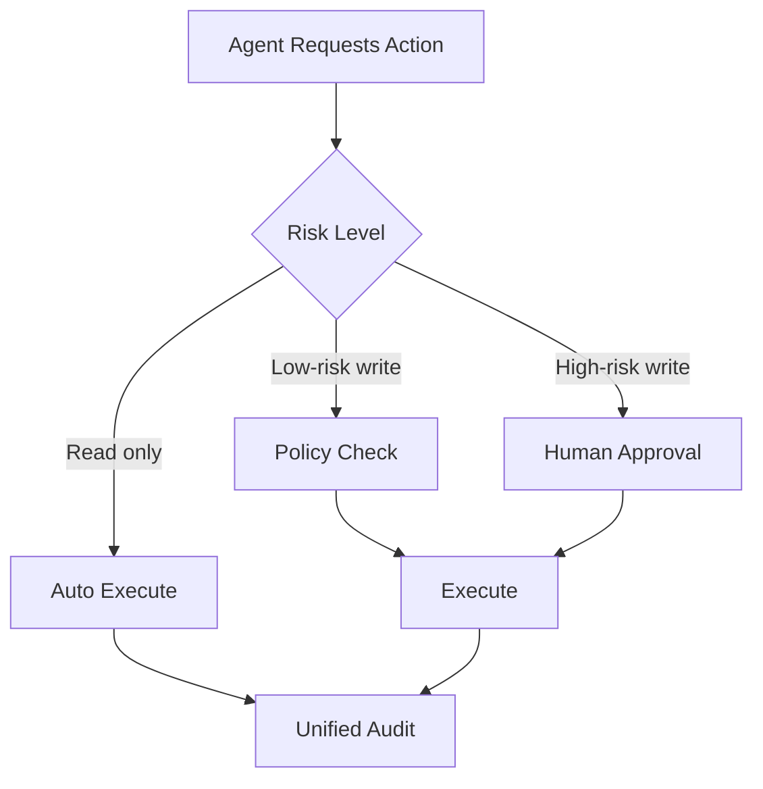

**Source**: OpenAI, “Introducing the Admin plugin for ChatGPT Work and Codex.” citeturn800174view0turn684598view1

---

### 3. OpenAI publishes first Jalapeño measurements, pushing inference competition toward chip + serving + context + routing co-optimization

- Category: Infrastructure / Model deployment
- Information status: Officially confirmed
- Published: 2026-08-25; exact time not published
- Availability: Not sold externally; planned for OpenAI infrastructure deployment by the end of 2026

**Fact summary**: OpenAI published the first detailed measurements for its custom Jalapeño inference chip and says it delivered a stronger throughput-latency-efficiency combination across GPT-OSS 120B, DeepSeek R1 670B, and Kimi K2.5 1T. One specific example from OpenAI’s testing says that on Kimi, Jalapeño achieved about 1.5 times higher peak performance per watt and about 3.4 times lower end-to-end latency than the comparison system. OpenAI plans to begin internal deployment by year-end while continuing to use accelerators from NVIDIA and other partners at large scale. citeturn469079news14

**What changed versus before**: Jalapeño had already been unveiled in June, but the earlier disclosure focused on architecture and engineering samples. The August 25 update adds broader cross-model measured results and deployment progress. At the same time, OpenAI is explicitly describing data centers, chips, models, the developer platform, routing, context management, and end-user products as one full-stack optimization loop. citeturn469079news15turn469079news16

**Why it matters**: Agent workloads are especially sensitive to low latency and sustained inference because one task may include dozens of model calls, tool calls, context operations, and retries. Hardware and serving improvements that reduce token latency while increasing throughput per watt can materially lower the true cost of completing a task, not just the cost of one generation.

**Practical impact**: Enterprise model selection should move from static price sheets toward workload benchmarks. At minimum, track success rate, time to first token, generation latency, context size, total tokens, tool calls, retries, and wall-clock duration. Model gateways should also preserve the option to route by live capacity, workload class, and SLO rather than only by model name or list price.

**Role perspective**:
- AI Builder: optimize end-to-end task latency, not one-call latency.
- Product owner: lower response time can unlock new agent use cases.
- Tech Lead: maintain cross-provider workload benchmarks.
- Department manager: budget around successful-task TCO, not token price alone.

**Action to borrow**: Select 3–5 production or near-production agent workflows and run the same evaluation set across models/providers. Track an approximate “successful-task cost” that includes API spend, retries, timeouts, and human remediation.

**Risks and uncertainty**: The current benchmark is largely OpenAI self-testing. Batch configuration, KV cache behavior, network topology, and implementation details can all affect results. Internal deployment does not imply immediate external API price cuts.

**Next signals to watch**:
1. Independent third-party reproduction;
2. Peak-capacity and tail-latency changes in OpenAI APIs after deployment;
3. Whether Gen 2 / Gen 3 further blur training and inference hardware boundaries.

**Mermaid diagram A: full-stack inference economics**

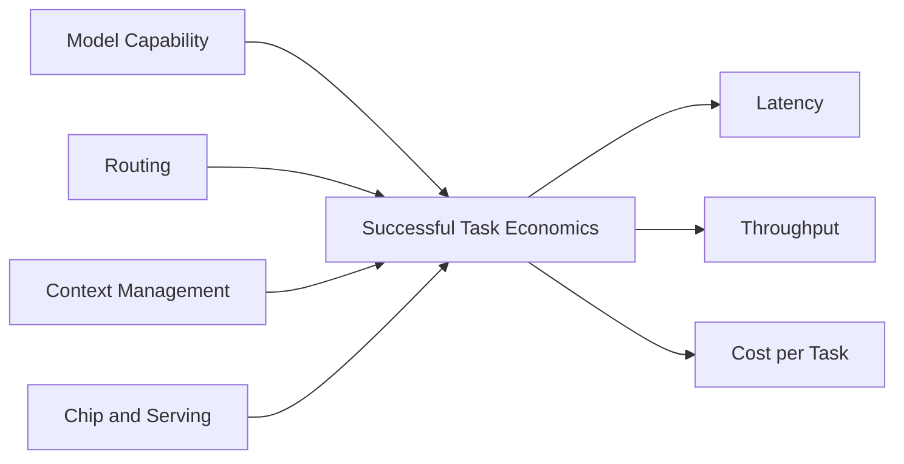

**Mermaid diagram B: metric migration**

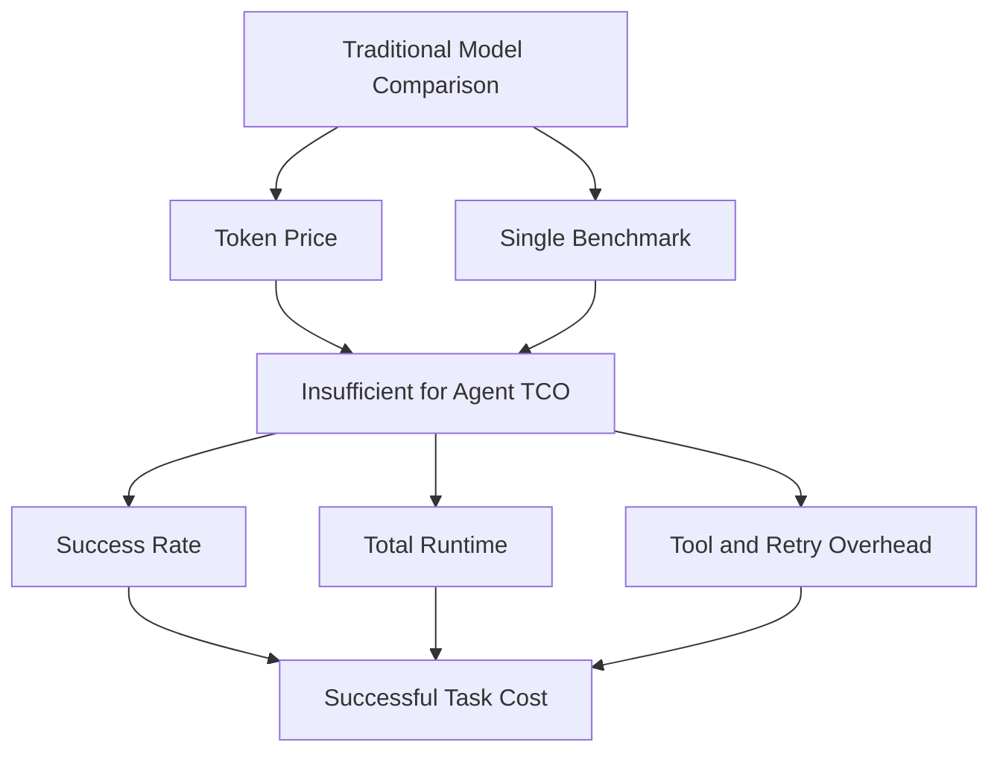

**Source**: OpenAI Jalapeño measurement report and full-stack compute article. citeturn469079news14turn469079news15

---

### 4. Google Cloud launches financial and legal Gemini Enterprise editions, packaging MCP, Skills, agents, and governance into industry platforms

- Category: Agent / MCP / Infrastructure
- Information status: Official product update
- Published: 2026-08-25; exact time not published
- Availability: Limited preview

**Fact summary**: On August 25, Google Cloud launched Gemini Enterprise for Financial Services and Gemini Enterprise for Legal. The financial edition includes a Google-managed Financial Research agent, more than 50 foundational skills, MCP-based enterprise and licensed-data connectors, and A2A APIs. The legal edition centers on legal skills, MCP connectors, prebuilt agents, and a governed control plane. Both entered preview that day. citeturn800174view3turn684598view0turn953127news5turn800174view4

**What changed versus before**: This is not a generic Gemini model with industry prompts layered on top. Google is defining the product boundary around domain skills, authorized data, agents, partner ecosystems, and governance. Importantly, MCP is used to connect licensed and enterprise data, while A2A is used to integrate the Research agent into broader multi-agent workflows.

**Why it matters**: Foundation-model differentiation is increasingly being diluted by the system around the model. In regulated sectors such as finance and legal, production readiness is often determined by entitlement, data lineage, citations, private-data isolation, auditability, and approvals rather than a few benchmark points.

**Practical impact**: Internal enterprise AI platforms that remain at “model gateway + prompt templates + chat UI” will become less competitive against domain suites. More durable investments include skill registries, connector/MCP registries, domain evals, provenance, approval systems, and a unified policy plane.

**Role perspective**:
- AI Builder: encode institutional expertise as reusable skills rather than scattered prompts.
- Product owner: design around full workflows, not single-turn answers.
- Tech Lead: MCP entitlements must mirror underlying data permissions.
- Department manager: PoC success criteria should include auditability and labor savings, not just answer quality.

**Action to borrow**: Pick one high-value internal domain and build a minimum domain pack: 10–20 core skills, controlled connector/MCP access, a standard eval set, provenance, and approval policy. Compare task completion with a generic agent baseline.

**Risks and uncertainty**: Both products are still in preview. Partner announcements and connector catalogs do not mean every customer automatically gets access to every capability. Financial-product claims around explainability and efficiency still need validation on each customer’s own data and workflow.

**Next signals to watch**:
1. Whether MCP becomes Google’s default industry-connector interface;
2. Whether skills are reusable across different Gemini agents;
3. Whether A2A + MCP becomes a stable enterprise multi-agent composition pattern.

**Mermaid diagram**

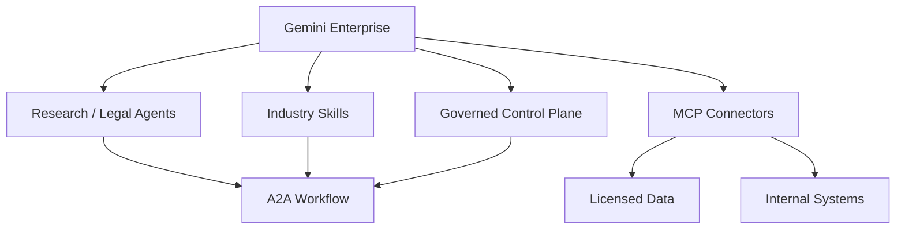

**Source**: Google Cloud official launches for Gemini Enterprise for Financial Services and Gemini Enterprise for Legal. citeturn953127news4turn953127news5

---

### 5. Linux Foundation takes in TRACE, pushing AI-agent runtime evidence toward standardization

- Category: Security / Agent / Infrastructure
- Information status: Officially confirmed
- Published: 2026-08-25; exact time not published
- Availability: Open specification and reference implementations available

**Fact summary**: The Linux Foundation announced the contribution of TRACE, or Trust, Runtime Attestation and Compliance Evidence, backed by AMD, Intel, Microsoft, OPAQUE, and TII. TRACE is designed to bind runtime environment, software, policy, data classification, and tool usage into portable, cryptographically verifiable evidence. It builds on existing standards including RATS, EAT, SLSA, SCITT, SPIFFE, and EAR, and its technical work will be hosted by the Coalition for Secure AI. citeturn185652view2

**What changed versus before**: TRACE existed before this week, but moving under Linux Foundation vendor-neutral governance increases its chances of becoming a cross-cloud, cross-hardware standard. The Foundation also says TRACE recorded nearly 135,000 PyPI downloads within about 10 weeks of its initial introduction. citeturn185652view2

**Why it matters**: Most agent audit logs today prove only what the application claims happened. They often cannot independently prove which trusted environment was running, what software was loaded, what identity was used, or whether a policy was actually enforced. For agents handling sensitive data, money, or production systems, that evidence gap can become a procurement and compliance blocker.

**Practical impact**: A future enterprise agent trust chain may combine workload identity, software supply-chain evidence, hardware/runtime attestation, and agent action traces. Even if TRACE does not become the eventual winner, those fields are worth adding to platform telemetry now.

**Role perspective**:
- AI Builder: sensitive tool calls should carry verifiable execution context.
- Product owner: compliance evidence can become a differentiated enterprise feature.
- Tech Lead: runtime evidence should be modeled separately from ordinary application logs.
- Department manager: high-risk agent go-live criteria should include traceable evidence, not just functional acceptance.

**Action to borrow**: Reserve fields such as `workload_identity`, `runtime_image`, `policy_decision`, `tool_provenance`, `data_classification`, and `execution_environment` in the internal agent execution record.

**Risks and uncertainty**: Linux Foundation governance does not guarantee adoption by major clouds or regulators. Cross-hardware consistency, performance overhead, and verifier tooling still need to mature.

**Next signals to watch**:
1. Native TRACE-compatible evidence from AWS, Azure, or Google Cloud;
2. Alignment with MCP or broader agent audit schemas;
3. Inclusion in large-enterprise security procurement requirements.

**Mermaid diagram**

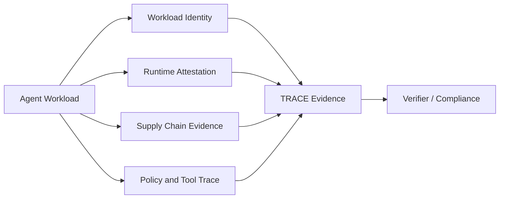

**Source**: Linux Foundation TRACE announcement. citeturn185652view2

---

### 6. GitHub Copilot Customize reaches GA, consolidating MCP, plugins, skills, and canvases into one agent-extension surface

- Category: AI Coding / MCP / Agent
- Information status: Official product update
- Published: 2026-08-25; exact time not published
- Availability: Publicly available

**Fact summary**: GitHub announced general availability of the Customize tab in the Copilot app. The surface brings MCP servers, plugins, skills, and canvases into one discovery and configuration experience, with featured customizations, browsing by type, and trending/category discovery for MCP servers. GitHub also highlights workflows such as delegating Azure DevOps backlog work as examples of discoverable agentic workflows. citeturn185652view1

**What changed versus before**: GitHub had already been shipping MCP, plugins, skills, and canvases separately. The new step is consolidating them into a single discovery surface. For users, this starts to look like an “agent capability catalog” rather than a set of configuration features scattered through documentation.

**Why it matters**: AI coding competition is moving from pure code-generation quality toward the Harness and extension ecosystem. When teams can discover tools, skills, context, and visual workflows from one place, internal best practices become easier to reuse, but ecosystem lock-in also grows stronger.

**Practical impact**: Enterprises comparing Codex, Claude Code, Copilot, and other tools should not evaluate only coding benchmarks. They should compare plugin governance, MCP security, skill distribution, team templates, auditability, and visual workflow support. Internal platform teams increasingly need a governed extension registry.

**Action to borrow**: Inventory internal MCP servers, skills, and coding workflows and classify them as allowed, restricted, or blocked. Track an owner, data access, network access, secret requirements, and update provenance for each item.

**Risks and uncertainty**: Easier discovery also increases supply-chain risk. The easier it becomes to install community extensions, the more important signing, permission prompts, isolation, and organization-wide allowlists become.

**Next signals to watch**:
1. Enterprise extension approval and provenance controls;
2. Signing or verification for MCP servers;
3. Unified governance across Copilot app, CLI, and IDE.

**Mermaid diagram**

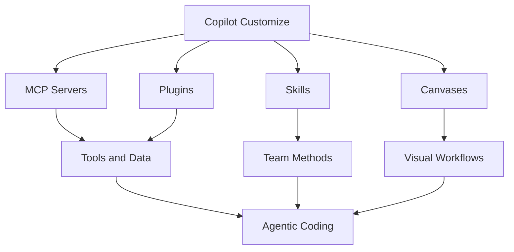

**Source**: GitHub Changelog. citeturn185652view1

---

### 7. Accelerated Understanding launches Neural Operator physics AI, a reminder that Transformer is not the default core for every problem

- Category: Model / Research
- Information status: Authoritative media report
- Published: 2026-08-25 18:02 Asia/Singapore, converted from Reuters 10:02 UTC
- Availability: Enterprise engagement; public API / weights not confirmed

**Fact summary**: Reuters reports that Accelerated Understanding, founded by Anima Anandkumar and Benedikt Jenik, launched an AI model for physical phenomena across space and time using neural operators rather than Transformer architecture. The company says the system handled 5 trillion data points in a single prompt during testing and is targeting enterprise applications including chip design, robotics, extreme weather, and energy exploration. The company is initially focused on enterprise deals rather than a consumer product. citeturn800174view2

**What changed versus before**: Neural Operators are not new, but this launch pushes the approach from academic and specialized physics/weather models toward a more general enterprise physics-modeling product. The important change is its direct challenge to the engineering habit of defaulting every hard intelligence problem to a language model.

**Why it matters**: If the core task involves PDEs, continuous fields, fluids, materials, or spatiotemporal dynamics, asking an LLM to be the numerical engine is often the wrong abstraction. A more likely production architecture is an LLM for intent, planning, and explanation, with an operator model or conventional solver handling physical prediction and constraints.

**Practical impact**: Future model routing may not just choose among GPT, Claude, and Gemini. It may choose among language models, vision models, graph models, neural operators, and simulators. Industrial AI platforms that only support LLM endpoints may eventually be too narrow.

**Role perspective**:
- AI Builder: separate natural-language orchestration from the numerical core.
- Product owner: define value using domain metrics rather than conversational quality.
- Tech Lead: design heterogeneous model routing.
- Department manager: reserve budget for domain models and simulation, not only LLMs.

**Action to borrow**: For industrial or scientific agents, use a two-layer architecture: LLM planner + domain solver/model, with separate metrics for language-task success and numerical error.

**Risks and uncertainty**: The 5-trillion-data-point scale figure comes from the company. Public benchmarks, training data, APIs, model weights, and independent replication remain limited, so scale should not be interpreted as proven business accuracy. citeturn800174view2

**Next signals to watch**:
1. A paper, code release, or standard benchmark;
2. Real accuracy/speed/extrapolation boundaries versus classical PDE solvers;
3. An API suitable for agent tool use.

**Mermaid diagram**

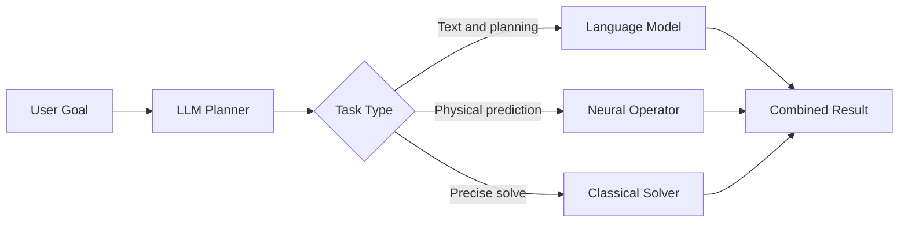

**Source**: Reuters. citeturn800174view2

---

### 8. OpenAI bans accounts tied to a Russia-origin influence operation, expanding agent-security concerns from code and permissions to source trust and content distribution

- Category: Security / Policy & Industry
- Information status: Officially confirmed
- Published: 2026-08-25; exact time not published
- Availability: Not applicable

**Fact summary**: OpenAI disclosed and banned a cluster of ChatGPT accounts it says very likely originated in Russia. The accounts were used to generate social-media content, obscure linguistic origin, and promote the International Burke Institute. OpenAI says the operation reached relatively small audiences but combined AI-generated content, identity masking, website packaging, copied or misattributed academic material, and distribution across X, LinkedIn, Facebook, Substack, and Telegram. citeturn684598view2

**What changed versus before**: AI-generated influence content is not new. The more important pattern is that the attack chain is evolving from “generate text” into a system of generation + identity packaging + fake provenance + cross-platform operations. The model is only one component.

**Why it matters**: Enterprise agent security cannot stop at prompt injection, code execution, and data leakage. If an agent can publish content, conduct research, operate social channels, or cite external material automatically, source reputation, content provenance, identity assurance, and publication approval all become part of the security boundary.

**Practical impact**: RAG and research agents should not rank sources only by semantic relevance; they should incorporate source trust and primary-source verification. External publishing agents should retain actor identity, original sources, approver, generation version, and destination.

**Role perspective**:
- AI Builder: add source-trust signals to retrieval.
- Product owner: make approvals and provenance visible in publishing flows.
- Tech Lead: retain content provenance and full publication logs.
- Department manager: include brand and compliance exposure in agent ROI.

**Action to borrow**: Add two hard rules to external research/publishing agents: reduce confidence when primary provenance cannot be traced, and require at least one human approval or explicit allowlist policy before public publication.

**Risks and uncertainty**: Attribution is based on OpenAI’s platform evidence, and the company uses probabilistic language such as “very likely originated in Russia.” Platform disclosure does not prove every relationship among external participants. citeturn684598view2

**Next signals to watch**:
1. Threat-intelligence sharing among AI platforms;
2. Provenance standards entering mainstream enterprise-agent products;
3. Source-trust scoring becoming default in enterprise search/RAG.

**Mermaid diagram**

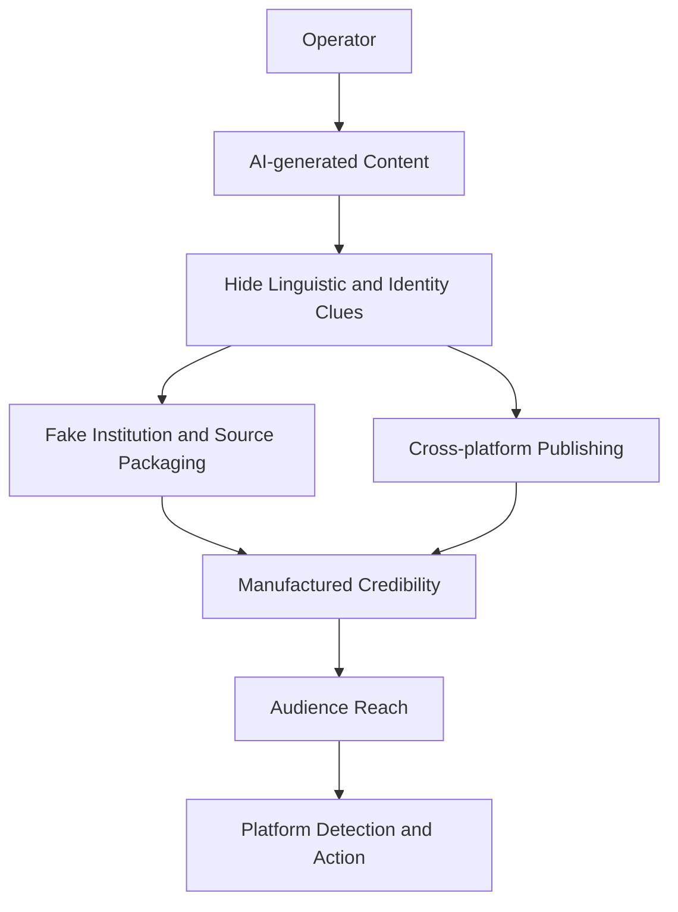

**Source**: OpenAI Global Affairs disclosure. citeturn800174view1turn684598view2

## C. Other Notable Items

**1. Google has explicitly put more industry editions of Gemini Enterprise on the roadmap.** Alongside the financial and legal launches, Google said Healthcare, Life Sciences, and other Professional Services solutions are on the horizon. This makes the industry-agent suite look like a platform strategy rather than a one-off experiment. citeturn684598view0turn800174view4

**2. GitHub’s agent-extension ecosystem is moving from configurability to discoverability.** Customize GA is not merely UI cleanup; it makes MCP, plugins, skills, and canvases easier for teams to discover and reuse, raising productivity and supply-chain governance requirements at the same time. citeturn185652view1

**3. Jalapeño does not mean OpenAI is exiting the NVIDIA ecosystem.** OpenAI explicitly says it will continue to deploy accelerators from NVIDIA and other partners broadly. Jalapeño should be read as a multi-source compute strategy and workload-specific optimization effort, not a single-chip replacement strategy. citeturn469079news14

## D. AI Trend Summary

### Trends supported by current facts

**Trend 1: Agent runtimes are becoming event-driven.** The Scheduled Tasks webhook update shows major platforms extending beyond schedule/polling toward application events. citeturn185652view0

**Trend 2: Governance is becoming both tool-like and provable.** Admin plugin addresses permission-aware actions, while TRACE addresses runtime evidence; together they show governance moving into the agent execution path as callable and verifiable components. citeturn684598view1turn185652view2

**Trend 3: The industry-agent product unit is converging on Skills + MCP + Agent + Control Plane.** Google’s financial and legal offerings make that pattern explicit. citeturn953127news4turn953127news5

**Trend 4: AI coding competition continues to shift from models toward Harness and ecosystem.** GitHub’s consolidation of MCP, plugins, skills, and canvases into one surface is a direct example of productizing “capability around the model.” citeturn185652view1

### Analytical inference

**Inference 1: Over the next 1–2 quarters, the most durable enterprise-agent asset may be a policy-controlled action runtime rather than a fixed model.** Identity, triggers, tools, approvals, audit, runtime evidence, and domain skills are likely to outlive individual model versions.

**Inference 2: Model Routers will gradually become Workload Routers.** As language models, operator models, solvers, and different inference hardware coexist, routing will shift from “which LLM is stronger?” toward “which model/hardware combination best fits this task and SLO?”

**Trend overview**

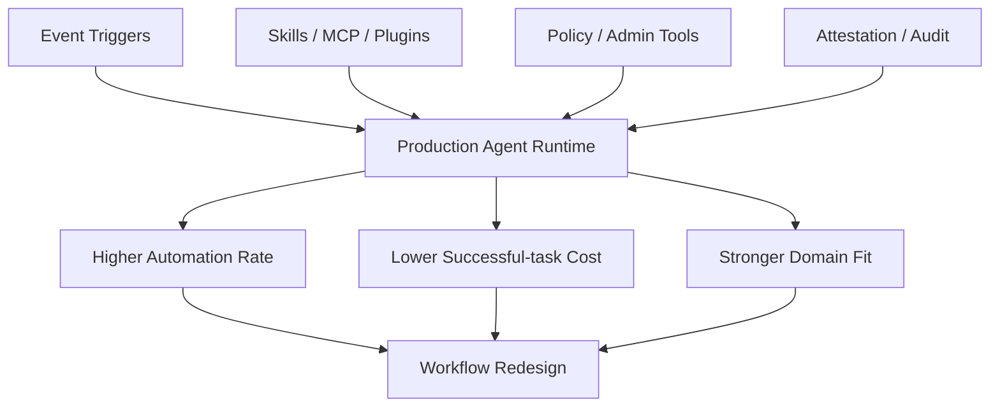

## E. Actions to Consider Today

1. **Role: Tech Lead / AI Platform | Action: define a standard event-trigger protocol.** Include event id, actor, tenant, source, timestamp, idempotency key, and authorization context. **Why now**: event-driven agents are entering mainstream products. **Action type: Add to roadmap.**

2. **Role: AI Builder | Action: move cost measurement to successful-task level.** Track success rate, total tokens, wall-clock, tool calls, and retries together. **Why now**: vendors are optimizing from silicon through routing, making token price less explanatory. **Action type: Execute now.**

3. **Role: Security / Tech Lead | Action: establish agent evidence-chain fields.** Cover identity, runtime, policy decision, tool provenance, data classification, and external side effects. **Why now**: TRACE-like runtime evidence is moving toward standardization. **Action type: Risk review.**

4. **Role: Product owner / Department manager | Action: build one minimum viable “industry-agent pack.”** Replace a prompt-only library with skills + MCP + domain evals + approvals + provenance. **Why now**: Google has now productized this architecture. **Action type: Schedule a test.**
