# AI 今日头条｜2026 年 08 月 26 日

- 语言：中文
- 时区：Asia/Singapore
- 新闻窗口：2026-08-25 07:30 至 2026-08-26 07:30
- 实际检索截止时间：2026-08-26 09:58
- 本期核心新闻：8 条
- 其他值得关注：3 条

## A. 今日最重要的 3 件事

**1. Agent 编排从“按时间运行”明显向“按事件触发”推进。** OpenAI 把 Gmail 新邮件、Slack 频道消息和 GitHub Pull Request 活动接入 ChatGPT Work 的 Scheduled Tasks，并允许同一工作区共享任务模板。对生产级 Agent 来说，这比新增一个聊天功能重要得多：触发器、身份继承、幂等、重试和审计将成为 Harness 的核心能力。citeturn185652view0

**2. 企业 AI 的管理控制面本身开始 Agent 化。** OpenAI Admin plugin 允许管理员在 ChatGPT Work 和 Codex 中查询采用率、成员、权限、额度与支出，并执行受现有 RBAC 约束的写操作；OpenAI 还称其内部 IT Agent 已解决约 45% 的 ticket volume。企业平台下一阶段的竞争，不只是“Agent 能调用多少业务工具”，而是“治理工具能否安全地被 Agent 调用”。citeturn684598view1

**3. 推理成本竞争进入模型、软件和自研芯片协同阶段。** OpenAI 首次公布 Jalapeño 自研推理芯片的实测结果，并计划在 2026 年底前开始内部部署；官方同时明确把芯片、serving、routing、context management 与产品体验放在同一个 full-stack 优化框架中。对模型采购方的含义是：未来更应该比较“每个成功任务的总成本和延迟”，而不是只比较每百万 token 标价。citeturn469079news14turn469079news15

## B. 新闻正文

### 1. OpenAI Scheduled Tasks 正式加入 webhook 事件触发，Agent 从轮询走向事件驱动

- 类别：Agent / 基础设施
- 信息状态：官方产品更新
- 发布时间：2026-08-25；未公布准确时间
- 可用状态：ChatGPT Business 已公开可用；Enterprise/Edu 等工作区按管理员策略开放

**事实摘要**：OpenAI 8 月 25 日更新 ChatGPT Business Release Notes，允许 ChatGPT Work 中的 Scheduled Tasks 通过 webhook 响应连接应用的事件。首批官方明确支持 Gmail 新邮件、Slack 频道消息和 GitHub Pull Request 活动。任务还可以在同一 workspace 内共享；接收者复制后使用自己的应用连接和权限执行，而不是继承创建者凭据。citeturn185652view0

**相较此前的变化**：此前 Scheduled Tasks 已能一次性运行、周期运行或监控变化，但本次把外部应用事件明确提升为一等触发方式，并加入可共享模板。变化的本质是从“Agent 定时去查”转成“业务系统在状态变化时叫醒 Agent”。

**为什么重要**：事件驱动能减少无效轮询、降低平均响应延迟，也更贴近真实业务系统的工作方式。但它同时把传统分布式系统问题带进 Agent：重复事件、乱序、任务重入、部分成功、工具副作用以及授权身份跨系统传播。一个能在 demo 里“收到 PR 后自动 review”的 Agent，不等于一个能安全处理重试和并发的生产系统。

**实际影响**：AI Builder 应把 trigger 层与 Agent reasoning 层解耦；Tech Lead 需要定义 event schema、idempotency key、retry/backoff 与 dead-letter 机制；企业平台团队则应统一记录 actor、tenant、source event、工具调用和最终副作用。对于已经用 5 分钟或 1 小时轮询来扫描邮箱、工单和代码仓库的工作流，这是直接的架构升级信号。

**角色视角**：
- AI Builder：优先把高频但稀疏事件的轮询型 PoC 改成事件驱动。
- 产品负责人：重新评估“实时性”是否能成为现有 Agent 功能的新价值点。
- Tech Lead：把幂等、状态机和重放策略纳入 Agent runtime。
- 部门经理：共享任务模板可提高复用率，但权限责任仍由每个执行者承担。

**可借鉴动作**：选一个现有内部 Agent，增加统一 trigger envelope：`event_id`、`actor`、`tenant`、`source`、`timestamp`、`idempotency_key`、授权上下文。只有通过风险检查后才允许进入可产生外部副作用的工具链。

**风险与不确定性**：当前官方 webhook 类型仍有限，且可用范围受计划、应用连接和管理员策略约束。事件触发并不自动解决错误授权、重复执行或外部系统最终一致性问题。

**下一步观察**：
1. 是否开放通用自定义 webhook；
2. 是否公开失败重试、死信、执行历史和幂等相关 API；
3. Codex 是否进一步出现 repository-native 的事件自动化。

**Mermaid 图示 A：事件驱动 Agent 调用链**

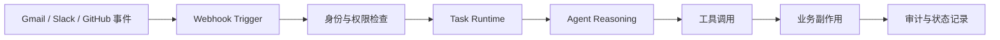

**Mermaid 图示 B：迁移决策**

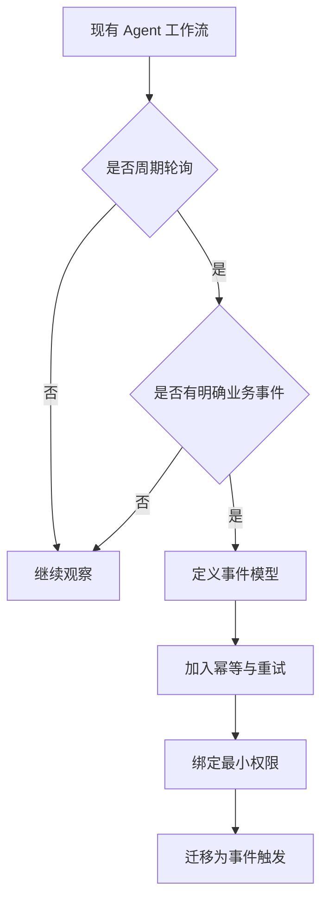

**来源**：OpenAI ChatGPT Business Release Notes。citeturn185652view0

---

### 2. OpenAI Admin plugin 上线：企业 AI 控制面开始变成 Agent 可调用工具

- 类别：Agent / 安全 / 基础设施
- 信息状态：官方产品更新
- 发布时间：2026-08-25；未公布准确时间
- 可用状态：ChatGPT Work / Codex；需 workspace 中启用并安装

**事实摘要**：OpenAI 发布 Admin plugin，使管理员能在 ChatGPT Work 和 Codex 中查询 workspace 使用与 credit、增删成员与组、检查和修改访问权限、调整 usage limits，以及处理支出请求。官方强调插件遵守每个用户已有角色、权限、workspace policy 和审批要求，不额外扩大权限。OpenAI 还披露，其 Slack 中的 ChatGPT Work IT Agent 在当时已解决约 45% 的 ticket volume。citeturn684598view1

**相较此前的变化**：传统 Admin Console 是面向人的后台，Admin API 是面向脚本和程序的接口；本次则把控制面动作包装成 permission-aware tools，让 Agent 可以在对话与工作流中调用。治理从“单独后台”进入 Agent 执行链。

**为什么重要**：企业 Agent 真正进入生产后，最难的通常不是模型会不会推理，而是谁有权做什么、谁批准、怎样回滚、如何证明没有越权。Admin plugin 给出了一个值得借鉴的产品方向：不让 Agent 拿一个全能管理员 token，而是把既有 RBAC 映射成受控、结构化、可审计的工具动作。

**实际影响**：对内部 Harness、模型网关和 AI 平台团队来说，管理 API 也应该按 Agent tool 的方式重新设计：明确输入 schema、权限主体、风险等级、审批条件和结构化返回。模型本身可替换，但“政策控制的动作运行时”会成为更稳定的平台资产。

**角色视角**：
- AI Builder：tool schema 要明确副作用，而不是只写自然语言描述。
- 产品负责人：把权限可见性和执行确认做成产品体验，而非隐藏在后台。
- Tech Lead：高权限 token 不应直接暴露给 Agent。
- 部门经理：低风险管理请求可自动化，高风险变更继续保留审批。

**可借鉴动作**：把内部管理能力分为三层：只读、低风险写、高风险写。只读可自动；低风险写需策略校验；高风险写必须审批，并在执行后产生结构化 audit event。

**风险与不确定性**：官方尚未证明在大规模复杂组织下，所有多级角色和例外策略都能自然映射到 Agent；权限正确不等于决策正确，误操作和提示注入仍可能诱导合法权限做出错误动作。

**下一步观察**：
1. 是否增加动作级 policy 和可编程审批；
2. 是否提供统一 audit event / SIEM 接口；
3. Admin plugin 是否扩展到更广的 SaaS 与基础设施控制面。

**Mermaid 图示 A：Agent 化管理控制面**

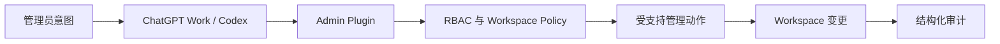

**Mermaid 图示 B：风险分层执行**

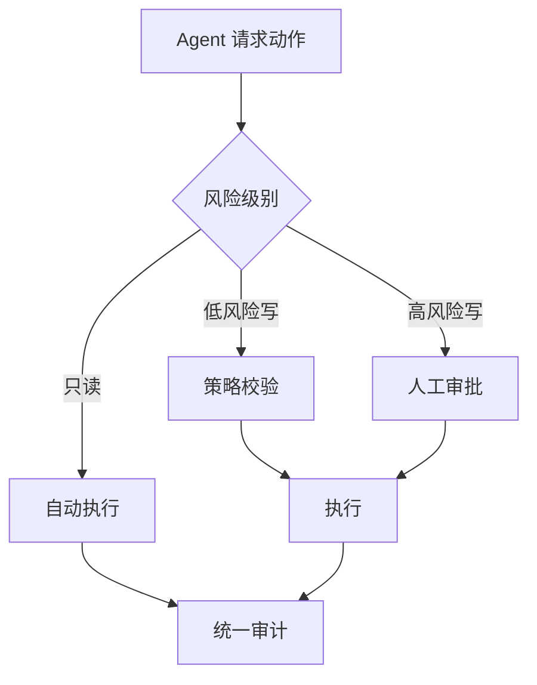

**来源**：OpenAI《Introducing the Admin plugin for ChatGPT Work and Codex》。citeturn800174view0turn684598view1

---

### 3. OpenAI 公布 Jalapeño 首批实测，推理竞争进入“芯片 + Serving + Context + Routing”全栈优化

- 类别：基础设施 / 模型部署
- 信息状态：官方已确认
- 发布时间：2026-08-25；未公布准确时间
- 可用状态：尚未对外销售；计划 2026 年底前进入 OpenAI 自身基础设施

**事实摘要**：OpenAI 首次发布自研推理芯片 Jalapeño 的详细测量结果，并称其在 GPT-OSS 120B、DeepSeek R1 670B 和 Kimi K2.5 1T 等公开模型上实现更优的吞吐、延迟和能效组合。官方给出的一个具体例子是：在 Kimi 测试中，其峰值每瓦性能约为对比系统的 1.5 倍，端到端延迟低约 3.4 倍。OpenAI 计划在年底前开始内部部署，同时继续大规模使用 NVIDIA 等合作伙伴的加速器。citeturn469079news14

**相较此前的变化**：Jalapeño 已在 6 月公开，但此前主要是架构与早期样片信息；8 月 25 日首次给出更系统的跨模型实测和部署进展。与此同时，OpenAI 将数据中心、芯片、模型、开发者平台、routing、context management 与最终产品明确描述为一个协同优化的 full stack。citeturn469079news15turn469079news16

**为什么重要**：Agent 工作负载对低延迟和持续推理特别敏感：一次任务可能包含几十次模型调用、工具调用、上下文压缩和重试。硬件与 serving 如果能同时降低 token latency 和提高每瓦吞吐，就可能显著降低“完成一个任务”的真实成本，而不是只降低单次生成成本。

**实际影响**：企业模型选型应该从静态价格表迁移到 workload benchmark。至少同时记录成功率、首 token 延迟、持续生成延迟、上下文长度、总 token、工具调用次数、重试次数和 wall-clock。模型网关也应预留按实时容量、任务类型和 SLO 路由的能力，而不是只按模型名或价格路由。

**角色视角**：
- AI Builder：关注 end-to-end task latency，不只看单调用 latency。
- 产品负责人：响应时间改善可能直接扩大可接受的 Agent 场景。
- Tech Lead：建立跨供应商真实 workload benchmark。
- 部门经理：采购与预算应看成功任务 TCO，而不是 token 单价。

**可借鉴动作**：选择 3–5 个生产或准生产 Agent 工作流，用同一评测集跑不同模型与供应商，记录“成功任务成本 = API 成本 + 重试 + 超时 + 人工补救成本”的近似指标。

**风险与不确定性**：当前 benchmark 主要由 OpenAI 自测，部署环境、batch、KV cache、网络和模型实现都会影响结果；内部芯片部署也不意味着外部 API 价格会立刻下降。

**下一步观察**：
1. 是否有独立第三方复现；
2. Jalapeño 上线后 OpenAI API 的峰值容量与尾延迟是否改善；
3. Gen 2 / Gen 3 是否进一步改变训练和推理的硬件边界。

**Mermaid 图示 A：全栈推理经济性**

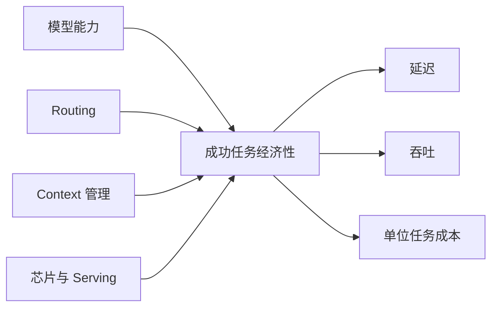

**Mermaid 图示 B：评测指标迁移**

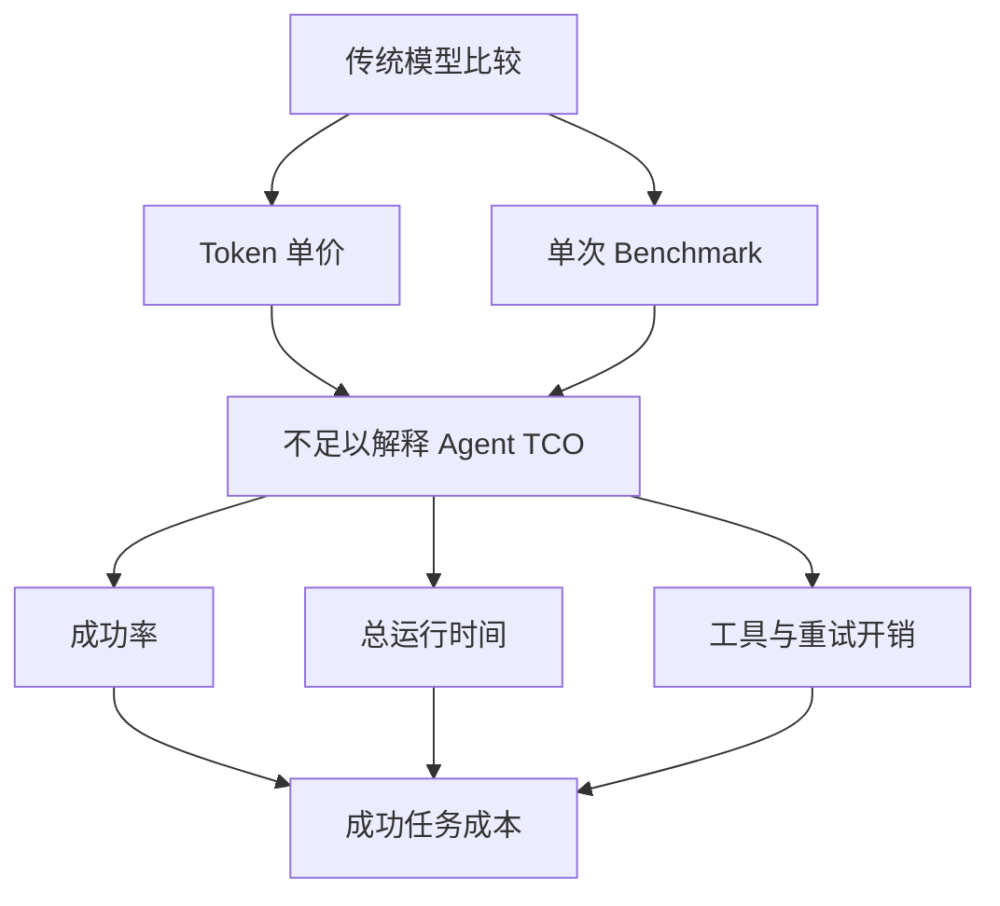

**来源**：OpenAI Jalapeño 实测报告与 full-stack compute 文章。citeturn469079news14turn469079news15

---

### 4. Google Cloud 同时推出金融与法律行业版 Gemini Enterprise，MCP、Skills 与治理控制面被打包成行业 Agent 平台

- 类别：Agent / MCP / 基础设施
- 信息状态：官方产品更新
- 发布时间：2026-08-25；未公布准确时间
- 可用状态：有限预览

**事实摘要**：Google Cloud 在 8 月 25 日同时发布 Gemini Enterprise for Financial Services 与 Gemini Enterprise for Legal。金融版包含 Google 管理的 Financial Research agent、50 多个 foundational skills、基于 MCP 的企业/许可数据连接，以及 A2A API；法律版则以法律 skills、MCP 连接器、预构建 Agent 与 governed control plane 为核心。两者均在当日进入 preview。citeturn800174view3turn684598view0turn953127news5turn800174view4

**相较此前的变化**：这不是把通用 Gemini 换成行业提示词，而是把领域技能、授权数据、Agent、第三方生态和治理放到一个产品边界里。更关键的是，MCP 被用于接入许可数据和企业系统，A2A 则用于把 Research agent 纳入其他 Agent 工作流。

**为什么重要**：大模型的差异化正在被“模型周边系统”稀释。对于金融和法律这类强监管行业，真正决定生产可用性的往往是 entitlement、数据 lineage、citation、private data isolation、审计与审批，而不是基础模型在通用 benchmark 上领先几个百分点。

**实际影响**：自建企业 AI 平台如果仍停留在“模型网关 + Prompt 模板 + Chat UI”，会越来越难与行业套件竞争。更值得投资的是 skills registry、connector/MCP registry、领域评测集、来源追踪、审批和统一 policy plane。

**角色视角**：
- AI Builder：把行业知识固化为可复用 skill，而不是散落 prompt。
- 产品负责人：行业产品应围绕完整工作流而非单轮问答设计。
- Tech Lead：MCP entitlement 必须映射底层真实数据权限。
- 部门经理：PoC 成功标准应包含可审计性和人工节省，不只是回答质量。

**可借鉴动作**：挑一个内部高价值领域，构建最小行业包：10–20 个核心 skills、受控 connector/MCP、标准评测集、来源追踪和审批策略，然后比较它与通用 Agent 的真实任务完成率。

**风险与不确定性**：目前仍是 Preview；合作伙伴、连接器和数据授权不等于每个客户都自动获得全部能力。金融版宣称的可解释性和效率收益也需要在客户自身数据和流程中验证。

**下一步观察**：
1. MCP 是否成为 Google 行业连接器的默认接口；
2. Skills 是否可跨不同 Gemini Agent 复用；
3. A2A + MCP 是否形成稳定的企业多 Agent 组合模式。

**Mermaid 图示**

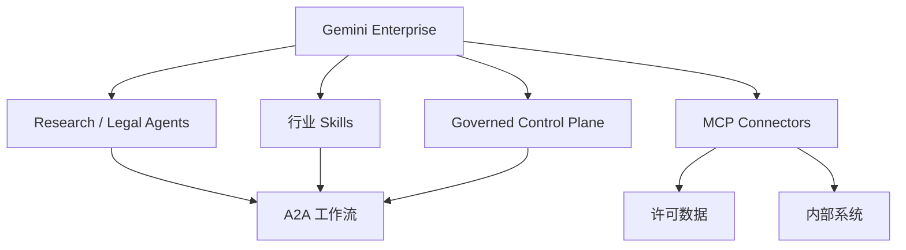

**来源**：Google Cloud Gemini Enterprise for Financial Services 与 Gemini Enterprise for Legal 官方发布。citeturn953127news4turn953127news5

---

### 5. Linux Foundation 接管 TRACE：AI Agent 的“运行时证明”开始进入标准化阶段

- 类别：安全 / Agent / 基础设施
- 信息状态：官方已确认
- 发布时间：2026-08-25；未公布准确时间
- 可用状态：开放规范与参考实现已公开

**事实摘要**：Linux Foundation 宣布接收 TRACE（Trust, Runtime Attestation and Compliance Evidence）规范，由 AMD、Intel、Microsoft、OPAQUE 和 TII 等共同推动。TRACE 试图把运行环境、软件、policy、数据分类和工具使用绑定成可移植、可加密验证的 runtime evidence，并建立在 RATS、EAT、SLSA、SCITT、SPIFFE、EAR 等现有标准之上。技术工作将由 Coalition for Secure AI 承载。citeturn185652view2

**相较此前的变化**：TRACE 并非本周才诞生，但此次进入 Linux Foundation 的厂商中立治理，使它从单个项目向跨云、跨硬件标准迈进。官方还称其在初次发布后的约 10 周内累计近 135,000 次 PyPI 下载。citeturn185652view2

**为什么重要**：今天大多数 Agent audit log 只能证明“应用说自己做了什么”，却难以证明当时究竟运行在哪个受信环境、加载了什么软件、使用了什么身份、policy 是否真的执行。对处理敏感数据、资金或生产系统的 Agent，这种证据缺口会逐渐变成采购和合规障碍。

**实际影响**：未来企业 Agent 的信任链可能由四部分共同组成：workload identity、软件供应链、hardware/runtime attestation、Agent action trace。即使最终不是 TRACE 胜出，这类字段也值得现在就进入平台日志模型。

**角色视角**：
- AI Builder：敏感工具调用应携带可验证执行上下文。
- 产品负责人：合规能力可能成为企业产品的可售卖特性。
- Tech Lead：运行时证据应与普通应用日志分层设计。
- 部门经理：高风险 Agent 上线标准要包含可追溯证据，而非只看功能验收。

**可借鉴动作**：在内部 Agent execution record 中预留 `workload_identity`、`runtime_image`、`policy_decision`、`tool_provenance`、`data_classification`、`execution_environment` 字段。

**风险与不确定性**：进入 Linux Foundation 不代表会被主流云和监管机构采用；跨硬件实现一致性、性能成本和证据验证工具链仍需成熟。

**下一步观察**：
1. AWS、Azure、Google Cloud 是否原生输出 TRACE-compatible evidence；
2. 是否与 MCP/Agent audit schema 接轨；
3. 是否进入大型企业安全采购清单。

**Mermaid 图示**

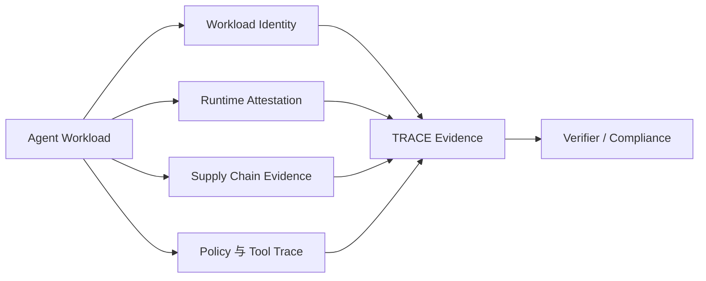

**来源**：Linux Foundation TRACE 官方公告。citeturn185652view2

---

### 6. GitHub Copilot Customize 正式 GA：MCP、Plugins、Skills、Canvases 被收拢成统一的 Agent 扩展入口

- 类别：AI 编程 / MCP / Agent
- 信息状态：官方产品更新
- 发布时间：2026-08-25；未公布准确时间
- 可用状态：已公开可用

**事实摘要**：GitHub 宣布 Copilot app 的 Customize tab 正式 GA。该入口把 MCP servers、plugins、skills 和 canvases 汇总到一个发现与配置界面，支持 featured customizations、按类型浏览，以及按趋势和类别发现 MCP server。GitHub 还把 Azure DevOps backlog 委派等场景作为可发现的 Agent 工作流示例。citeturn185652view1

**相较此前的变化**：GitHub 过去已经分别推进 MCP、plugins、skills 和 canvases，本次变化在于把这些扩展机制统一到一个可发现的产品入口。对于用户而言，它更像“Agent 能力目录”，而不是一组散落在文档里的配置项。

**为什么重要**：AI 编程工具的竞争正从“模型写代码能力”扩展到“Harness + Extension Ecosystem”。当团队可以在一个入口发现工具、skills、上下文和可视化工作流时，组织内最佳实践更容易复用，也更容易形成平台锁定。

**实际影响**：企业在评估 Codex、Claude Code、Copilot 等工具时，不能只比单次 coding benchmark；还要比较插件治理、MCP 安全、skills 分发、团队模板、审计和可视化工作流。对内部平台团队而言，也需要一个受管控的 extension registry。

**可借鉴动作**：整理内部常用 MCP server、skill 和 coding workflow，建立“允许 / 受限 / 禁止”三级目录，并给每项记录 owner、数据权限、网络访问、secret 需求和更新来源。

**风险与不确定性**：统一发现入口也会放大供应链风险。用户越容易安装社区扩展，越需要签名、权限提示、隔离和组织级 allowlist。

**下一步观察**：
1. GitHub 是否增加企业级扩展审批与 provenance；
2. MCP server 是否出现签名/验证机制；
3. Customize 是否扩展到 Copilot CLI 和 IDE 的统一治理。

**Mermaid 图示**

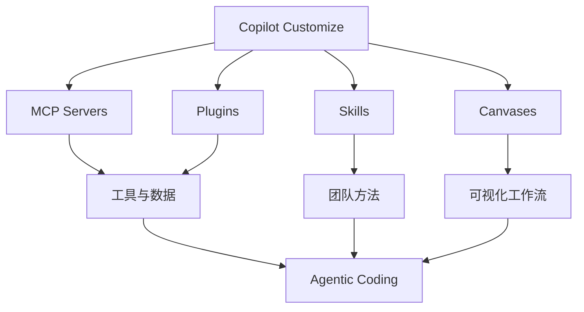

**来源**：GitHub Changelog。citeturn185652view1

---

### 7. Accelerated Understanding 推出 Neural Operator 物理 AI，提醒企业不要把 Transformer 当成所有问题的默认核心

- 类别：模型 / 研究
- 信息状态：权威媒体报道
- 发布时间：2026-08-25 18:02（Asia/Singapore，由 Reuters 10:02 UTC 换算）
- 可用状态：面向企业合作；公开 API / 权重状态未确认

**事实摘要**：Reuters 报道，Anima Anandkumar 与 Benedikt Jenik 创办的 Accelerated Understanding 推出面向物理时空现象的 AI 模型，其核心采用 neural operators，而不是 Transformer。公司称模型在测试中单次 prompt 可处理 5 万亿个数据点，并瞄准芯片设计、机器人、极端天气和能源勘探等企业场景；公司当前优先做 enterprise deals，而非消费产品。citeturn800174view2

**相较此前的变化**：Neural Operator 本身不是新技术，但这次把它从学术和专项天气/物理模型路线推向更通用的企业物理建模产品。重要变化在于它公开挑战了“复杂智能任务默认用语言模型”的工程惯性。

**为什么重要**：如果问题核心是 PDE、连续场、流体、材料或时空演化，让 LLM 直接承担数值核心通常并不合理。更可能的生产结构是：LLM 负责意图理解、计划和解释，专业 operator model 或传统 solver 负责物理预测和约束。

**实际影响**：未来 model routing 不只是在 GPT、Claude、Gemini 之间切换，而可能在语言模型、视觉模型、图模型、neural operator 和 simulator 之间进行任务级路由。工业 AI 平台若只支持 LLM endpoint，会限制可扩展性。

**角色视角**：
- AI Builder：把自然语言 orchestration 与数值核心解耦。
- 产品负责人：用领域指标定义产品价值，不用聊天体验替代准确率。
- Tech Lead：设计 heterogeneous model router。
- 部门经理：工业 AI 预算应留给领域模型与仿真，而不是全部投向 LLM。

**可借鉴动作**：对工业/科学 Agent 建立两层架构：LLM planner + domain solver/model，并分别定义语言任务成功率和领域数值误差。

**风险与不确定性**：5 万亿数据点等核心规模数据来自公司自身陈述，公开 benchmark、训练数据、API、权重和第三方复现仍不足，不能直接等价为更高业务准确率。citeturn800174view2

**下一步观察**：
1. 是否发布论文、代码或标准 benchmark；
2. 与传统 PDE solver 在精度、速度和外推上的真实边界；
3. 是否提供适合 Agent 调用的 API。

**Mermaid 图示**

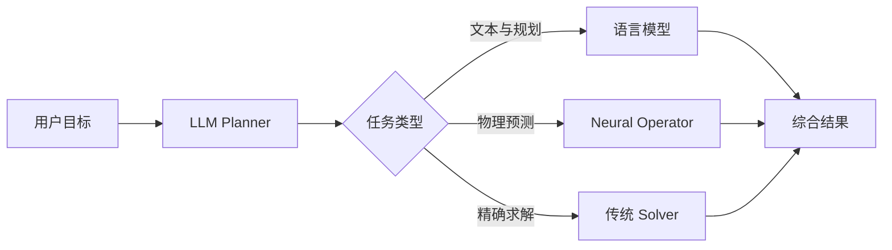

**来源**：Reuters。citeturn800174view2

---

### 8. OpenAI 封禁俄罗斯来源影响行动账户：Agent 安全边界继续从“代码与权限”扩展到来源可信与内容传播

- 类别：安全 / 政策与产业
- 信息状态：官方已确认
- 发布时间：2026-08-25；未公布准确时间
- 可用状态：不适用

**事实摘要**：OpenAI 披露并封禁一组“很可能来自俄罗斯”的 ChatGPT 账户，这些账户用于生成社交媒体内容、隐藏语言来源并推广 International Burke Institute。OpenAI 表示，该行动实际触达受众相对有限，但其组合了 AI 生成内容、伪装身份、网站包装、复制或错误署名的学术内容，以及跨 X、LinkedIn、Facebook、Substack、Telegram 等平台传播。citeturn684598view2

**相较此前的变化**：AI 生成宣传内容并不新；更值得关注的是攻击链逐渐从“生成文本”升级为“生成 + 身份包装 + 伪来源 + 跨平台运营”的系统化工作流。模型只是链条中的一个组件。

**为什么重要**：企业 Agent 安全不能只关注 prompt injection、代码执行和数据泄露。只要 Agent 能发布内容、做研究、操作社媒或自动引用外部材料，source reputation、content provenance、identity assurance 和发布审批都会进入安全边界。

**实际影响**：RAG 和 research Agent 不应只做语义相关性排序，还应引入来源信誉与原始出处校验。外部发布 Agent 则应默认保存 actor、原始来源、审批人、生成版本与发布目标。

**角色视角**：
- AI Builder：检索层增加 source trust 信号。
- 产品负责人：外部发布功能默认设计审批和来源提示。
- Tech Lead：保留内容 provenance 与完整发布日志。
- 部门经理：品牌与合规风险应进入 Agent ROI 评估。

**可借鉴动作**：对外部研究/发布 Agent 增加两项硬规则：无法追溯原始来源时降低置信度；涉及外部公开发布时至少保留一次人工审批或明确的白名单策略。

**风险与不确定性**：归因基于 OpenAI 平台侧证据，官方采用“very likely originated in Russia”等概率措辞；平台披露不能证明所有外部参与者之间的关系。citeturn684598view2

**下一步观察**：
1. AI 平台之间是否形成滥用 threat intelligence 共享机制；
2. provenance 标准是否进入主流 enterprise Agent；
3. 企业搜索/RAG 是否默认增加 source trust scoring。

**Mermaid 图示**

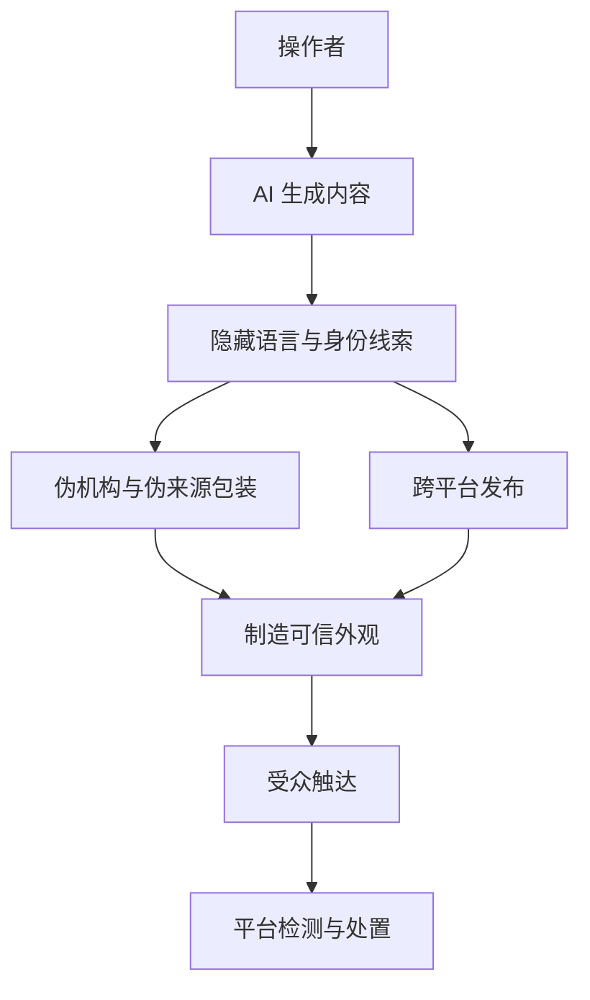

**来源**：OpenAI Global Affairs 安全披露。citeturn800174view1turn684598view2

## C. 其他值得关注

**1. Google 已明确把更多行业版 Gemini Enterprise 放入路线图。** 金融与法律版发布时，Google 同时预告 Healthcare、Life Sciences 与其他 Professional Services 方向，说明“行业 Agent 套件”不是一次性试验，而更像平台化战略。citeturn684598view0turn800174view4

**2. GitHub 的 Agent 扩展生态正在从“配置能力”进入“发现能力”。** Customize GA 的意义不只是 UI 整理，而是让 MCP、Plugins、Skills 和 Canvases 更容易被团队发现与复用；这会提高生产力，也同步放大扩展供应链治理需求。citeturn185652view1

**3. Jalapeño 并不意味着 OpenAI 准备退出 NVIDIA 生态。** 官方明确表示仍会广泛使用 NVIDIA 和其他伙伴的加速器，Jalapeño 更应理解为多源 compute strategy 与 workload-specific optimization，而不是单一芯片替代。citeturn469079news14

## D. 今日 AI 趋势总结

### 已有事实支持的趋势

**趋势 1：Agent 运行时正在事件化。** Scheduled Tasks 的 webhook 更新表明，主流平台正把触发器从 schedule/polling 扩展为应用事件。citeturn185652view0

**趋势 2：治理正在“工具化 + 可证明化”。** Admin plugin 负责权限内动作，TRACE 负责运行时证据，两者从不同层面把治理变成 Agent 执行链的可调用、可验证组件。citeturn684598view1turn185652view2

**趋势 3：行业 Agent 的基本产品单位正在变成 Skills + MCP + Agent + Control Plane。** Google 的金融与法律方案把这一组合清晰产品化。citeturn953127news4turn953127news5

**趋势 4：AI 编程工具的竞争重心继续从模型走向 Harness 与生态。** GitHub 把 MCP、plugins、skills、canvases 收进统一入口，就是“模型之外能力”产品化的例子。citeturn185652view1

### 分析推断

**推断 1：未来 1–2 个季度，企业 Agent 平台最值得沉淀的资产可能不是固定模型，而是 Policy-controlled Action Runtime。** 身份、trigger、工具、审批、审计、运行时证明和领域 skills 会比单个模型生命周期更长。

**推断 2：Model Router 会逐步演变为 Workload Router。** 当语言模型、operator model、solver 和不同推理硬件共同存在时，路由依据将从“哪个 LLM 更强”变成“哪种模型/硬件组合最适合这个任务和 SLO”。

**今日趋势总览**

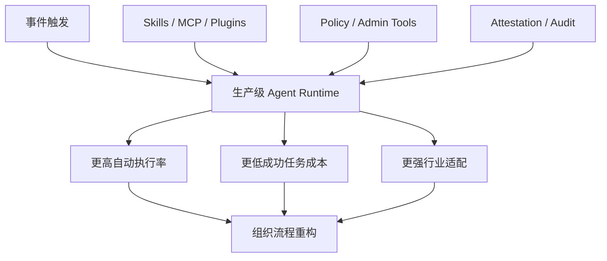

## E. 今日建议关注或采取的动作

1. **角色：Tech Lead / AI Platform｜建议动作：定义统一事件触发协议。** 把 event id、actor、tenant、source、timestamp、idempotency key 和授权上下文纳入标准输入。**为什么现在做**：事件驱动 Agent 已进入主流产品。**动作类型：纳入路线图。**

2. **角色：AI Builder｜建议动作：把成本指标升级到成功任务级。** 同时记录成功率、总 token、wall-clock、工具调用和重试。**为什么现在做**：供应商正在从芯片到 routing 做全栈优化，token 单价解释力下降。**动作类型：立即执行。**

3. **角色：安全 / Tech Lead｜建议动作：建立 Agent 证据链字段。** 至少覆盖 identity、runtime、policy decision、tool provenance、data classification 和外部副作用。**为什么现在做**：TRACE 等规范开始进入标准化治理。**动作类型：检查风险。**

4. **角色：产品负责人 / 部门经理｜建议动作：选一个业务域构建“行业 Agent 最小套件”。** 用 skills + MCP + 领域评测 + 审批 + 来源追踪替代单纯 prompt library。**为什么现在做**：Google 已把这一结构产品化。**动作类型：安排测试。**
