<!-- 中文版 -->
# AI 今日头条｜2026 年 08 月 27 日

- 语言：中文
- 时区：Asia/Singapore
- 新闻窗口：2026-08-26 07:30 至 2026-08-27 07:30
- 实际检索截止时间：2026-08-27 09:36
- 本期核心新闻：8 条
- 其他值得关注：3 条

## A. 今日最重要的 3 件事

**1. Qwen3.8-Flash-Next 开放权重，而且实际上提前展示了 Qwen4 的核心架构方向。** 这不是一次普通的模型小升级：Qwen 把长上下文 Attention、Residual、Embedding 和 Optimizer 一起重构，并给出 125B 主模型 + 51B N-gram Embedding、每 token 激活约 6B 参数的设计。对模型选型和私有部署团队而言，更值得关注的不是厂商自报 benchmark，而是 QSA 稀疏注意力、Host Memory Embedding Offload、262K 原生上下文以及 SGLang/vLLM/TensorRT-LLM 的 Day-0 支持正在形成一条新的高性价比开源推理路线。

**2. Claude in Chrome 正式 GA，浏览器 Agent 从“每一步请示”向受分类器保护的有限自治迈进。** Anthropic 将 Claude in Chrome 开放给所有付费计划，并允许安全动作自动执行，同时在页面内容进入模型和动作真正执行前分别增加 prompt-injection probes 与 action safety classifier。浏览器依然是 Agent 最危险、同时也最通用的执行环境之一，因此这次更新的核心意义不是“Claude 会点网页”，而是主流厂商开始公开产品化“模型 + 内容检测 + 动作验证 + 企业域名控制”的浏览器 Agent 安全栈。

**3. OpenAI Assistants API 在 8 月 26 日正式到达关闭日期，Responses API + Conversations API 成为明确迁移方向。** 这标志着早期“Assistant / Thread / Run”抽象正式让位于更偏统一 Agent Runtime 的 Responses 体系。仍有历史应用停留在 Assistants API 的团队现在面对的已经不是路线规划问题，而是兼容性和业务连续性问题。

## B. 新闻正文

### 1. Qwen3.8-Flash-Next 开放权重：Qwen4 架构预览把稀疏注意力、N-gram Memory 与 Muon 训练路线放进同一个模型

- 类别：模型 / 基础设施 / AI 编程
- 信息状态：官方已确认
- 发布时间：2026-08-26；未公布准确时间
- 可用状态：开放权重；Hugging Face / ModelScope 可下载；QwenCloud 生产 API 官方称即将开放

**事实摘要**：Qwen 发布 Qwen3.8-Flash-Next，一款多模态 MoE 模型，同时明确称它是未来 Qwen4 架构的早期预览。模型包含约 125B 主模型参数及额外约 51B N-gram Embedding 参数，每个 token 激活约 6B；原生上下文长度为 262,144 tokens，并可通过 YaRN 扩展到 1,000,000 tokens。官方称相较 Qwen3.7-Plus，其训练成本约为后者的 1/9，同时在编码与办公任务上能力更强；这些性能结论目前主要来自 Qwen 自身评测。

**相较此前的变化**：上一代混合结构主要依赖 Gated DeltaNet + 全局 Attention；Flash-Next 进一步增加 Qwen Sparse Attention（QSA），通过轻量 indexer 以 micro-block 粒度筛选长上下文。它还引入四分支 Gated Residual、可从 Host Memory 异步预取的 N-gram Embedding，以及经过重新适配的 Muon + AdamW 优化组合。Qwen 明确表示，这些变化会继续被打磨并成为 Qwen4 的基础。

**为什么重要**：过去“大模型更强”通常意味着更多激活参数、更大的 KV Cache 和更高推理成本；Qwen 此次尝试把“模型容量”和“每 token 算力”进一步解耦。51B 的 N-gram table 可以不长期占据 GPU 显存，而 QSA 又试图降低长序列 Attention 与索引本身的成本。如果这类结构在独立测试中成立，模型服务架构会越来越依赖 GPU + Host RAM + 高速互联的协同，而不是单纯追求把所有权重塞进显存。

**实际影响**：对私有模型平台而言，这是一款值得进入 PoC 的模型，但不建议仅凭厂商 benchmark 立即替换生产模型。值得单独测试的指标包括：262K 上下文下真实检索准确率、长上下文 TTFT、Host Memory 带宽敏感性、不同并发度吞吐、工具调用稳定性、量化后 PLE/N-gram table 精度，以及 SGLang/vLLM/TensorRT-LLM 三条 serving 路线的成熟度。Qwen 同时公开了 OpenAI Responses 与 Anthropic-compatible 接口示例，意味着现有 Codex / Claude Code 风格 Harness 的模型替换成本可能进一步下降。

**角色视角**：
- AI Builder：可测试其作为高频 Agent、coding assistant 和长上下文检索模型的性价比。
- 产品负责人：若 API 定价与官方预告一致，可能打开此前被推理成本压制的大规模后台 Agent 场景。
- Tech Lead：重点验证 Host Memory Offload、并发和长上下文，而非只跑短 benchmark。
- 部门经理：可将其加入第二供应商 / 开源模型备选，但不应根据发布日 benchmark 直接迁移关键业务。

**可借鉴动作**：建立一套“真实 Agent workload benchmark”，固定 20–50 个仓库级 coding、长文档分析和工具调用任务，在当前主模型与 Qwen3.8-Flash-Next 上比较任务完成率、总 wall-clock、峰值显存、Host RAM、重试次数和成功任务成本。

**风险与不确定性**：Qwen 关于训练成本、能力提升和效率的关键数字主要来自官方自测；1M context 是扩展模式，不等于 1M 范围内检索与推理质量保持稳定。生产版 API 在发布正文中仍标记为即将开放，因此不要把“开放权重”和“稳定托管 API 已上线”混为一谈。

**下一步观察**：
1. 第三方长上下文与 agentic coding benchmark；
2. FP8 / FP4 / GGUF 等量化对 N-gram Embedding 的影响；
3. QwenCloud API 正式开放后的价格、速率限制与缓存策略。

**Mermaid 图示 A：Flash-Next 的主要效率路径**

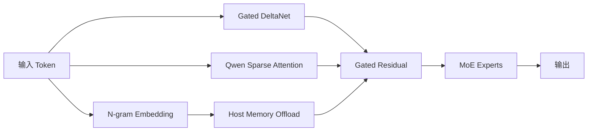

以下关系为工程分析抽象，不代表 Qwen 官方完整架构图。

**Mermaid 图示 B：是否进入生产的验证路径**

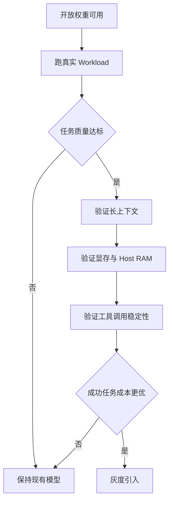

**来源**：
- [Qwen 官方发布](https://qwen.ai/blog?id=qwen3.8-flash-next)
- [Qwen3.8-Flash-Next GitHub](https://github.com/QwenLM/Qwen3.8-Flash-Next)
- [SGLang Day-0 Support](https://www.lmsys.org/blog/2026-08-26-qwen-flash-next/)

---

### 2. Claude in Chrome 正式 GA：浏览器 Agent 开始以“自动动作 + 双层安全验证”进入主流产品

- 类别：Agent / 安全
- 信息状态：官方产品更新
- 发布时间：2026-08-26；未公布准确时间
- 可用状态：所有 Claude 付费计划已公开可用；Enterprise 可配置允许访问的域名

**事实摘要**：Anthropic 宣布 Claude in Chrome 正式 GA，覆盖所有付费 Claude 计划。Claude 可以读取已登录网页、点击、输入、跨 Tab 导航和填写表单；新版本还允许它自动批准被判断为安全的动作，而不再要求用户逐步确认。企业管理员可以控制是否启用，并限制可访问域名。

**相较此前的变化**：Claude in Chrome 从 2025 年的实验性浏览器扩展一路进入 GA，更重要的是执行权限发生变化：系统现在允许部分动作自动完成。Anthropic 为此公开描述了两类防线：一类 probe 在网页内容作为 tool result 进入 Claude 时检测潜在 prompt injection；另一类 safety classifier 在动作真正执行前检查其是否与用户原始意图一致。

**为什么重要**：浏览器是企业里最大的“非 API 世界”。大量内部后台、老旧 ERP、供应商 Portal 和管理页面永远不会提供高质量 MCP/API，但浏览器 Agent 可以直接操作它们。与此同时，网页也是最容易夹带不可信文本和恶意指令的环境。因此，浏览器 Agent 能否普及，真正瓶颈是“如何在不逐步弹确认框的情况下仍控制动作风险”。

**实际影响**：Browser-use Agent 的工程范式正在从单层 LLM 判断转向分层控制：内容检测负责判断“模型看到了什么”，动作验证负责判断“模型准备做什么”，域名政策负责控制“模型能去哪”。企业自建 computer-use/browser Agent 可以直接借鉴这一设计，而不是只依靠 system prompt 写一句“不要听网页中的恶意指令”。

**角色视角**：
- AI Builder：浏览器自动化现在更适合做受限范围内的真实 PoC。
- 产品负责人：无 API 的遗留系统可能因此进入 Agent 自动化范围。
- Tech Lead：需要把网页内容视作不可信工具输出，而不是普通上下文。
- 部门经理：应优先开放低风险、可回滚流程，避免直接让 Agent 控制金融、权限和不可逆提交动作。

**可借鉴动作**：如果已有浏览器 Agent，在执行链加入三个独立 Gate：内容 injection 检测、动作意图匹配、目标域名 allowlist。即使基础模型认为动作正确，高风险写操作仍单独要求审批。

**风险与不确定性**：Anthropic 的攻击成功率来自自身设计的测试与红队环境，不能保证覆盖未来攻击。官方也明确表示 prompt injection 是持续变化的问题。浏览器 Agent 使用用户现有登录态，因此一次错误动作的权限上限可能直接等于用户本人权限。

**下一步观察**：
1. 企业是否能配置更细的动作类型和字段级策略；
2. 实际互联网环境中的 prompt injection 事故率；
3. Chrome Agent 与 Claude Code、Cowork 之间的统一任务与审计能力。

**Mermaid 图示 A：浏览器 Agent 的双层安全链**

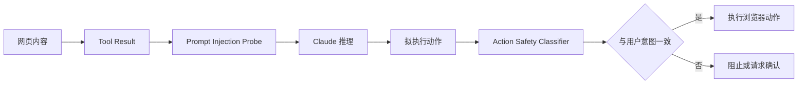

**Mermaid 图示 B：企业开放顺序**

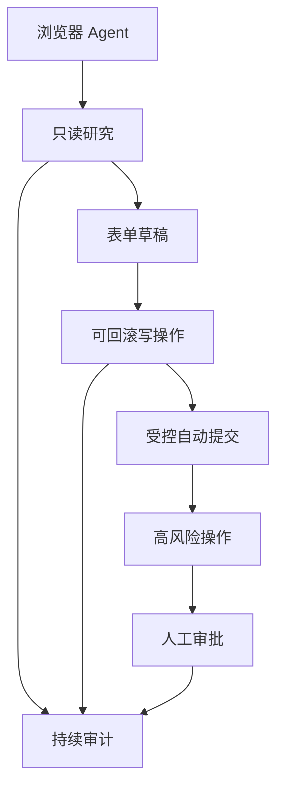

**来源**：
- [Anthropic：Claude in Chrome is generally available](https://claude.com/blog/claude-in-chrome-generally-available)

---

### 3. OpenAI Assistants API 到达正式关闭日期：Responses + Conversations 成为 Agent API 主路径

- 类别：Agent / 基础设施
- 信息状态：官方已确认
- 发布时间：2026-08-26；关闭日期已生效，未公布精确关闭时点
- 可用状态：Assistants API 进入关闭；官方推荐 Responses API + Conversations API

**事实摘要**：OpenAI 官方 Deprecations 文档将 2026-08-26 列为 Assistants API shutdown date，推荐替代方案为 Responses API 与 Conversations API。OpenAI 在一年前已经提前通知弃用，并表示 Responses 已覆盖 Assistants 的核心能力，同时提供 MCP、computer use、deep research 等新工具能力。

**相较此前的变化**：过去一年这是一个“未来迁移要求”；到了本期新闻窗口，它变成了实际兼容性事件。抽象也从 `Assistant → Thread → Run` 迁移到 `Prompt/Conversation → Response`，工具循环与状态管理方式随之改变。

**为什么重要**：Agent API 的生命周期管理通常比模型升级更容易被低估。一个企业可能已经把 Assistant ID、Thread ID、Run 状态、文件检索和业务数据库深度耦合进自己的数据结构，如果仅把 endpoint 替换成 Responses API，往往无法完整迁移。真正需要处理的是状态模型、工具执行、历史会话、错误语义和 observability 的变化。

**实际影响**：仍有 Assistants API 流量的团队应立即把它视为 P0 技术债。即使历史接口暂时还能在部分环境返回结果，也不应再依赖非承诺行为。新的 Agent 项目则应避免复制旧的 Assistant-centric 数据模型，转向应用自己可理解、可迁移的 conversation state。

**角色视角**：
- AI Builder：停止创建任何新的 Assistants API 集成。
- 产品负责人：确认迁移是否改变历史会话、文件和用户可见行为。
- Tech Lead：完成 API、状态、工具调用、错误处理和 tracing 五个层面的兼容性验证。
- 部门经理：对仍未迁移的关键系统升级风险等级，避免在供应商正式关闭后被动救火。

**可借鉴动作**：对代码仓库全局搜索 Assistants 相关 endpoint、`assistant_id`、`thread_id`、`run_id` 与 OpenAI Beta Header；建立 migration matrix，并跑一套新旧双写或 replay 测试，比较最终回答、工具调用与状态持久化。

**风险与不确定性**：不同应用对 Assistants 的依赖深度差异非常大；简单问答应用可能迁移很快，但高度依赖 Threads、Files 和 Runs 的系统可能出现隐性行为差异。不要假设“Responses feature parity”意味着业务语义完全相同。

**下一步观察**：
1. 生产端旧 API 是否出现明确错误码和迁移提示；
2. Responses / Conversations 后续是否进一步统一 Agent SDK；
3. 企业客户是否获得短期例外或专用迁移支持。

**Mermaid 图示 A：API 抽象迁移**

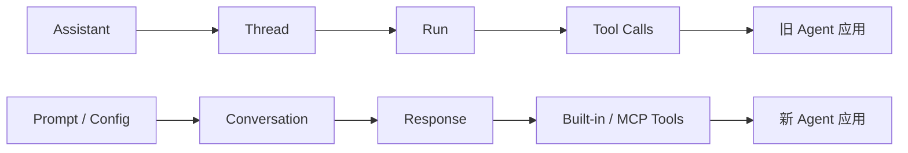

**Mermaid 图示 B：迁移检查路径**

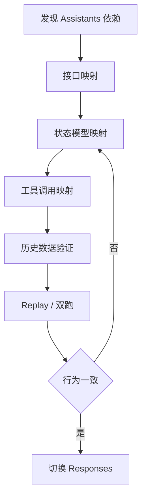

**来源**：
- [OpenAI API Deprecations](https://developers.openai.com/api/docs/deprecations)
- [OpenAI Assistants Migration Guide](https://developers.openai.com/api/docs/guides/assistants/migration)

---

### 4. AWS 与 NVIDIA 宣布再部署 200 万块 GPU：AI 基础设施竞争进一步从 GPU 租赁扩展到 CPU、网络、模型和机器人全栈绑定

- 类别：基础设施 / 政策与产业
- 信息状态：官方已确认
- 发布时间：2026-08-26；未公布准确时间
- 可用状态：分阶段建设与部署

**事实摘要**：AWS 与 NVIDIA 宣布扩大合作，计划在 AWS 全球基础设施中增加部署 200 万块 NVIDIA GPU，并进一步整合 NVIDIA Vera CPU、网络、Nemotron 开放模型和 physical AI 技术。官方将目标指向 agentic AI、AI factories 与机器人等高强度工作负载。

**相较此前的变化**：云厂商与芯片厂商的合作正从“采购 GPU 实例”变成系统级共同设计。CPU、GPU、网络、模型、训练/推理软件和机器人栈被放到同一个合作范围里，说明算力竞争已经越来越接近 vertically integrated AI factory。

**为什么重要**：未来模型 API 价格、容量限制、区域可用性和推理延迟不仅取决于模型算法，也取决于大型云厂商能多快上线新一代加速器与互联。200 万块 GPU 的规模更重要的意义在于中期供给预期，而不是今天立即多出 200 万块现货容量。

**实际影响**：企业不应只用“模型厂商”维度管理供应商风险，也需要考虑背后的 compute dependency。对于长期 GPU workload，可逐渐把区域容量、芯片代际、网络拓扑、数据驻留和供应链作为模型平台采购指标。

**角色视角**：
- AI Builder：短期无须改变代码，但可关注新实例和推理服务可用时间。
- 产品负责人：更多算力供给有利于 agentic/physical AI 产品降低容量约束。
- Tech Lead：避免基础设施架构与单一 GPU SKU 过度耦合。
- 部门经理：对 6–18 个月 AI 成本规划，应同时跟踪云容量和模型价格。

**可借鉴动作**：把模型供应商评估表增加“底层云 / 加速器 / 区域 / failover”四项，并明确关键 Agent 工作负载的第二运行环境。

**风险与不确定性**：官方宣布的是部署计划，不等于所有 GPU 已上线；实际落地节奏、电力、数据中心建设、网络和区域审批都可能影响容量兑现。

**下一步观察**：
1. 新 GPU 实例正式 GA 节奏；
2. Vera CPU 与 GPU 组合对推理成本的影响；
3. AWS 是否进一步把 Nemotron 和 robotics stack 直接产品化为托管 Agent/Physical AI 服务。

**Mermaid 图示**

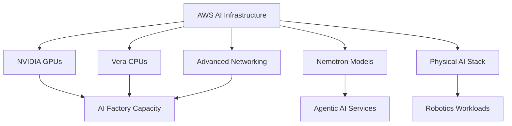

**来源**：
- [AWS / NVIDIA 官方公告](https://press.aboutamazon.com/aws/2026/8/aws-and-nvidia-to-deliver-2-million-additional-gpus-and-next-generation-infrastructure-for-agentic-and-physical-ai)

---

### 5. Anthropic 将 Claude Code 与 Cowork 的 Compliance API 覆盖升级为 GA，Agent 审计从聊天记录扩展到工具执行轨迹

- 类别：AI 编程 / 安全 / 企业合规
- 信息状态：官方产品更新
- 发布时间：2026-08-26 更新
- 可用状态：Claude Code CLI/Desktop 与 Cowork 的 Compliance API 覆盖已 GA；Microsoft 365 add-ins 与 Claude Science 仍为 beta

**事实摘要**：Anthropic 更新其 Compliance API 公告，确认 Cowork 的 desktop/web/mobile 以及 Claude Code CLI/Desktop 覆盖现已 GA。企业安全和合规团队可以通过统一接口取得 session 内容与 metadata，包括 prompts、responses、web/MCP tool call 内容、skills/artifacts 文本、验证后的用户身份、组织 ID、session/message IDs 与 timestamps。

**相较此前的变化**：该能力此前处于 beta，本次进入 GA。企业对 Claude Code 的审计不再只能依赖本地日志或单独部署 OpenTelemetry；开发者 Agent 的会话与工具行为可以进入与普通 Claude 对话相同的 Compliance API 流程。

**为什么重要**：AI Coding Agent 一旦能够读仓库、执行命令、访问 MCP、运行长任务，它实际上已经进入传统 privileged developer tooling 的风险范围。合规团队需要回答的不只是“员工问了 AI 什么”，还包括“Agent 使用什么工具、看了什么内容、以谁的身份运行”。

**实际影响**：对于准备规模化 Claude Code 的企业，这是一个降低治理阻力的重要变化。SIEM、eDiscovery、DLP 和内部调查流程可以更容易建立统一数据源；同时也意味着企业需要重新考虑 Agent transcript 本身是否包含源代码、Secrets、业务数据和个人信息，以及相应的 retention policy。

**角色视角**：
- AI Builder：工具调用现在更可能进入长期企业审计记录。
- Tech Lead：应统一 Claude Code、OpenTelemetry 与企业 SIEM 的 trace ID 策略。
- 部门经理：大规模启用 Coding Agent 前可把“审计可见性”从阻塞项转为正式治理能力。

**可借鉴动作**：在试点团队导出一周 Claude Code Compliance 数据，与 Git 提交、CI 和 MCP gateway log 做关联，确认是否能从“用户 → Session → Tool Call → Repo Change”完整追踪。

**风险与不确定性**：GA 并不代表所有 Claude 使用方式都有覆盖。官方页面仍列出 Claude Code Web、Claude Platform 访问，以及部分 Bedrock、Vertex AI、Microsoft Foundry 路径的覆盖限制，企业需要按自身采购渠道核对。

**下一步观察**：
1. 各云渠道是否实现一致审计；
2. Compliance API 是否增加策略阻断而不仅是事后记录；
3. MCP tool call 是否出现更细粒度结构化字段。

**Mermaid 图示**

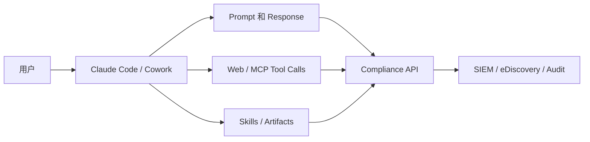

**来源**：
- [Anthropic Compliance API Update](https://claude.com/blog/compliance-api-cowork-and-claude-code)

---

### 6. Google 把 vLLM 原生 TPU Serving 扩展到长上下文 Embedding：向量检索基础设施开始真正进入异构加速器时代

- 类别：基础设施 / 模型部署
- 信息状态：官方产品更新
- 发布时间：2026-08-26；未公布准确时间
- 可用状态：公开可用；相关部署 recipes 已开源

**事实摘要**：Google Cloud 宣布在 vLLM 中提供原生 TPU 支持，并针对 Qwen3-Embedding-8B 与 Qwen3-VL-Embedding-8B 等长上下文 embedding workload 进行了专门工程优化。方案包含硬件安全 tensor alignment、JAX/XLA 编译预热、lazy loading 加固，以及用于 chunked prefill pooling 的 StepPool/CachedRequestState 机制。Google 给出的测试包括 7K+ 文本和 15K+ multimodal 输入，并公开相应 AI-Hypercomputer recipes。

**相较此前的变化**：vLLM 最初形成的生态明显以 GPU LLM generation 为中心；现在同一 serving abstraction 正扩展到 TPU、pooling runner、长上下文 embedding 与异构集群。Google 还展示了 GKE Custom Compute Classes 在 TPU 容量不足时向其他 accelerator pool fallback 的思路。

**为什么重要**：Embedding 是 RAG、语义搜索、推荐、Memory 和 Agent Retrieval 的基础成本中心。企业通常投入大量时间把向量生成绑定在单一 GPU serving stack 上，如果 vLLM 能真正抽象 TPU/GPU 差异，embedding 层会更容易进行成本和容量路由。

**实际影响**：做大规模 RAG 的团队可以开始测试 embedding workload 的 XPU portability，而不是把“模型可移植”误认为“Serving 可移植”。尤其应关注同一 embedding 模型跨硬件后的 cosine parity，因为向量发生小幅漂移也可能影响 ANN 检索排序和离线索引一致性。

**角色视角**：
- AI Builder：RAG PoC 可以把 accelerator 选择从应用代码中抽离。
- Tech Lead：建立 embedding golden-reference 与 cross-XPU parity 检查。
- 部门经理：高规模检索 workload 可纳入 TPU/GPU 成本竞争。

**可借鉴动作**：选一个生产 embedding 数据集，在当前 GPU 与 TPU vLLM 上同时重算 1–5 万条向量，比较 cosine similarity、Recall@K、吞吐、TTFT/请求延迟和每百万 token/文档成本。

**风险与不确定性**：Google 公布的 throughput 和 parity 结果来自官方工程测试，不能直接套用到所有 embedding 模型和数据集。硬件 fallback 还会带来冷启动、索引一致性与 capacity planning 的新复杂度。

**下一步观察**：
1. 更多开源 embedding/reranker 是否进入 TPU vLLM；
2. vLLM 对 TPU 与 GPU 功能差距是否继续缩小；
3. 企业是否开始使用 accelerator-aware routing 管理检索层。

**来源**：
- [Google Developers Blog](https://developers.googleblog.com/enterprise-grade-precision-for-long-context-multimodal-embedding-inference-on-cloud-tpu/)

---

### 7. Microsoft 把 Agent 成本正式定义为“成功结果成本”，Model Router、Caching、Agent Optimizer 与 Observability 被串成闭环

- 类别：基础设施 / Model Routing / 成本治理
- 信息状态：官方产品更新 / 官方工程建议
- 发布时间：2026-08-26；未公布准确时间
- 可用状态：相关 Microsoft Foundry 能力按产品区域与套餐开放

**事实摘要**：Microsoft 在 Foundry Agent Optimization 系列中明确提出，企业真正需要优化的是 cost per successful outcome，而非 token price。官方将运行时优化拆为四组能力：模型与 deployment routing、prompt/semantic caching、prompt 与 agent optimizer、observability/evaluation。Foundry Model Router 可在一个 endpoint 后根据成本、质量等目标选择模型，并可用 allowlist 限制模型范围；Agent Optimizer 则能从真实任务数据集中修改 instructions、skills、tool descriptions 和 model selection 后重新评测。

**相较此前的变化**：过去模型路由更多被理解为“便宜请求给小模型，困难请求给大模型”。Microsoft 把 routing、cache、prompt、skill、tool description、deployment mode、observability 和 eval 统一成一个持续 hill-climbing loop，说明 Agent FinOps 正从账单分析变成 Runtime Engineering。

**为什么重要**：Agent 的一次业务结果可能包含十几次模型请求。即使单请求成本降低 30%，如果错误路径导致更多工具调用和重试，总成本仍可能更高。因此成功率、turn count 和失败恢复正在成为 FinOps 指标，而不只是 Agent Quality 指标。

**实际影响**：模型网关设计应从简单 provider proxy 升级为 policy + router + trace + eval feedback loop。缓存也不应只看技术 cache-hit：system instructions、tool schema 和稳定 policy 放在 prompt 前部，可以同时提高 provider prompt-cache 命中率。

**角色视角**：
- AI Builder：记录任务级成功与总 turn，而非只记录 token。
- 产品负责人：把“完成一项业务结果多少钱”加入功能 ROI。
- Tech Lead：路由策略应经过固定 eval gate 后才能上线。
- 部门经理：AI 成本治理应与质量/SLO 一起管理，不能单独压 token 数。

**可借鉴动作**：在模型网关增加 `task_id`，把同一 Agent 任务的所有模型调用、工具调用、缓存命中、重试与最终 outcome 聚合起来，生成 cost-per-success dashboard。

**风险与不确定性**：这是 Microsoft 对其 Foundry 栈的官方实践与产品能力描述，并不意味着自动路由永远优于手工路由。错误 router 或 eval 数据集漂移同样可能造成质量回退。

**下一步观察**：
1. Agent Optimizer 在真实生产 workload 的稳定收益；
2. Router 是否支持更强的自定义策略和跨厂商模型；
3. 成功任务成本是否成为主流 AI observability 平台的标准指标。

**来源**：
- [Microsoft Azure：The Economics of Agent Optimization](https://azure.microsoft.com/en-us/blog/the-economics-of-agent-optimization-four-ways-to-lower-the-cost/)

---

### 8. OpenAI 推动 WebMCP 实战化：网站开始从“让 Agent 看懂 UI”转向“主动暴露结构化工具”

- 类别：MCP / Agent / 基础设施
- 信息状态：官方已确认
- 发布时间：WebMCP Challenge 于 2026-08-26 03:00 左右（Asia/Singapore；官方开放时间为 2026-08-25 12:00 PT）
- 可用状态：WebMCP 为实验性开放标准；ChatGPT in-app browser 已支持测试

**事实摘要**：OpenAI 启动 WebMCP Challenge，并联合 Google Chrome、Cloudflare、Shopify、Vercel、Netlify、Render 等推动开发者为网站加入 WebMCP。WebMCP 的核心思路是让网站主动向 Agent 暴露结构化工具，而不是迫使浏览器 Agent 仅依赖 DOM、视觉定位和模拟鼠标操作。官方称开发者可直接在 ChatGPT in-app browser 测试 WebMCP 网站，也可在 Chrome 实验能力中测试。

**相较此前的变化**：传统 MCP 更偏 Agent 到本地/远程 Server 的工具协议；WebMCP 把类似思想直接推向 Web 页面。这意味着未来一个网页可能同时拥有两层接口：给人看的 UI，以及给 Agent 调用的结构化 action surface。

**为什么重要**：纯视觉 browser-use 的最大问题是脆弱：按钮位置、DOM、A/B Test 和登录状态变化都会导致 Agent 失败。WebMCP 如果得到浏览器和网站生态支持，Agent 调用网页可能从“RPA 2.0”逐步转成标准化工具调用，同时仍保留人类可视 UI。

**实际影响**：对 Web 产品团队而言，将来可能需要像今天设计 API 一样设计 Agent-facing capability。工具 schema、权限、确认、幂等、可审计副作用和速率限制会成为前端产品的一部分。它也可能降低浏览器 Agent 对视觉 token 和复杂 DOM reasoning 的依赖。

**角色视角**：
- AI Builder：可选一个内部网站做 WebMCP 小型实验。
- 产品负责人：开始思考哪些核心动作值得提供 agent-native interface。
- Tech Lead：避免把 WebMCP tool 直接映射成无保护后端管理员接口。
- 部门经理：暂时属于标准早期阶段，应实验而不是大规模绑定。

**可借鉴动作**：选择一个只有 3–5 个高频操作的内部 Web 工具，为其设计 Agent action schema，并比较 WebMCP 与 browser automation 在成功率、执行时间和 token 成本上的差异。

**风险与不确定性**：WebMCP 仍是 experimental standard，生态、浏览器支持、权限和安全规范都可能变化。结构化工具提高可靠性的同时，也意味着一旦授权设计错误，Agent 可以更可靠地执行错误动作。

**下一步观察**：
1. Chrome 是否把 WebMCP 从实验能力推进到稳定版本；
2. Vercel、Cloudflare、Shopify 等是否形成开发框架级支持；
3. WebMCP 与传统 MCP 的身份、OAuth 和审计模型如何统一。

**来源**：
- [OpenAI WebMCP Challenge](https://openai.com/webmcp-challenge/)

## C. 其他值得关注

**1. OpenAI o3 于 8 月 26 日从 ChatGPT 退休，但 API Access 不受影响。** 这是典型的“产品表面可用性”和“API 生命周期”分离事件：依赖用户手动在 ChatGPT 选择 o3 的工作流程应调整，但后端 API 集成并没有因为 ChatGPT 下线同步失效。来源：[OpenAI ChatGPT Rate Card](https://help.openai.com/en/articles/11481834-chatgpt-rate-card)。

**2. NVIDIA 发布 COMPASS Agent-driven robotics workflow。** 官方教程展示了用 Codex 或 Claude Code 调度 repository skills，完成机器人场景准备、smoke test、residual RL 训练、checkpoint evaluation，并在关键节点保留人工批准；真正运行机器人时则不依赖 Coding Agent。这是“AI Coding Agent 开始管理 ML/Robotics 工程生命周期”而非直接控制机器人的一个有价值范例。来源：[NVIDIA Technical Blog](https://developer.nvidia.com/blog/?p=121922)。

**3. Hugging Face / Sentence Transformers 增加 Multi-Vector Embedding 的训练与微调工作流。** Multi-vector retrieval 正从少数专用模型逐步进入主流工具链，对于复杂文档、late-interaction retrieval 和高精度 RAG 值得关注，但本期影响优先级低于 TPU serving 与 Qwen 架构更新。来源：[Hugging Face Blog](https://huggingface.co/blog/train-multi-vector-encoder)。

## D. 今日 AI 趋势总结

### 已有事实支持的趋势

**趋势 1：模型架构创新重新回到“如何降低真实推理成本”而不是只扩参数。** Qwen3.8-Flash-Next 的 sparse attention、N-gram memory/offload，与 Microsoft 对 cost-per-success 的强调虽然来自不同层，却共同指向 workload economics。

**趋势 2：Agent 的“执行环境”正在快速标准化。** 一边是 Claude in Chrome 给浏览器动作加入安全 classifier，另一边是 WebMCP 让网站直接暴露结构化 Agent tools；浏览器 Agent 正在从纯视觉 RPA 向“结构化工具 + UI fallback”迁移。

**趋势 3：企业 AI 治理开始覆盖完整 Agent Session。** Claude Code Compliance API GA 表明审计对象已经从聊天 prompt 扩展到 web/MCP tool calls、skills 和 artifacts。

**趋势 4：AI Infrastructure 正进入真正异构化。** AWS/NVIDIA 扩张 GPU 基础设施，而 Google 又把 vLLM embedding serving 推向 TPU；未来同一个 AI 平台同时调度不同 accelerator 会越来越常见。

### 分析推断

**推断 1：未来 Model Gateway 很可能演化成 Workload Control Plane。** 单纯代理 API 已不足够；任务路由、accelerator routing、prompt caching、policy、cost-per-success、trace 和 eval feedback 会逐步合并。

**推断 2：Web 产品会开始出现“双接口设计”。** 一个界面服务人类，一个结构化 capability surface 服务 Agent。长期看，这可能像移动时代的 API-first 一样，成为 Agent-native 产品的重要架构属性。

**今日趋势总览**

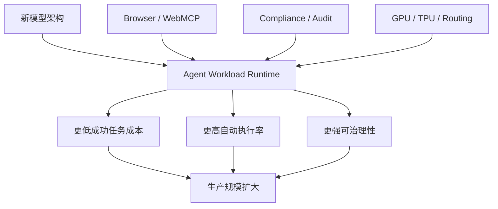

## E. 今日建议关注或采取的动作

1. **角色：AI Builder / Tech Lead｜建议动作：安排 Qwen3.8-Flash-Next workload PoC。** 不追求全 benchmark，而是测试 coding、长上下文、工具调用、Host Memory Offload 和成功任务成本。**为什么现在做**：这是 Qwen4 架构的早期公开窗口。**动作类型：安排测试。**

2. **角色：Tech Lead / 安全团队｜建议动作：重新审视 Browser Agent 安全模型。** 至少拆分内容可信度检查、动作安全检查和目标系统权限。**为什么现在做**：Claude in Chrome 已进入自动批准部分动作的 GA 阶段。**动作类型：检查风险。**

3. **角色：AI Platform｜建议动作：立即确认所有 OpenAI Agent 项目是否还有 Assistants API 依赖。** **为什么现在做**：官方 shutdown date 已到。**动作类型：立即执行。**

4. **角色：部门经理 / 产品负责人｜建议动作：把 Agent ROI 从 token cost 升级为 cost per successful outcome。** 把失败重试、工具调用、wall-clock 和人工补救同时纳入。**为什么现在做**：Agent runtime 与基础设施优化都在向任务级经济性收敛。**动作类型：纳入路线图。**

---

<!-- English Version -->
# AI Daily Headlines｜2026-08-27

- Language: English
- Time zone: Asia/Singapore
- News window: 2026-08-26 07:30 to 2026-08-27 07:30
- Research cutoff: 2026-08-27 09:36
- Core stories: 8
- Other notable items: 3

## A. The 3 Most Important Things Today

**1. Qwen3.8-Flash-Next is open-weight and effectively provides an early look at the core architectural direction of Qwen4.** This is not a routine incremental release: Qwen redesigned long-context attention, residual paths, embeddings, and optimization together, using a 125B main model plus roughly 51B parameters of N-gram Embeddings with around 6B parameters activated per token. For model-selection and private-deployment teams, the most important questions are not the vendor-reported benchmarks but whether QSA sparse attention, Host Memory embedding offload, native 262K context, and Day-0 SGLang/vLLM/TensorRT-LLM support create a genuinely lower-cost open inference path.

**2. Claude in Chrome is now generally available, moving browser agents from step-by-step approval toward classifier-protected limited autonomy.** Anthropic opened Claude in Chrome to every paid plan and allows safe actions to execute automatically, while adding prompt-injection probes before web content reaches the model and an action safety classifier before actions execute. The browser remains both one of the most universal and most dangerous agent execution environments, so the important change is the productization of a layered browser-agent safety stack.

**3. OpenAI's Assistants API reached its official August 26 shutdown date, making Responses API + Conversations API the explicit migration path.** The early `Assistant / Thread / Run` abstraction is formally giving way to the more unified Responses-era agent runtime. For teams still running production workloads on Assistants, this is no longer roadmap planning; it is now a business-continuity and compatibility issue.

## B. Core Stories

### 1. Qwen3.8-Flash-Next opens its weights: the Qwen4 preview combines sparse attention, N-gram memory, and Muon optimization

- Category: Model / Infrastructure / AI Coding
- Information status: Officially confirmed
- Published: 2026-08-26; exact time not published
- Availability: Open weights on Hugging Face / ModelScope; QwenCloud production API described as coming shortly

**Fact summary**: Qwen released Qwen3.8-Flash-Next, a multimodal MoE model that it explicitly describes as an early preview of the architecture planned for Qwen4. It contains roughly 125B main-model parameters plus about 51B N-gram Embedding parameters, with roughly 6B parameters activated per token. Native context is 262,144 tokens and can be extended to 1,000,000 tokens with YaRN. Qwen says training costs are approximately one-ninth of Qwen3.7-Plus while producing stronger coding and office-task performance; those performance claims are currently primarily vendor-reported.

**What changed versus before**: Earlier hybrid Qwen designs relied primarily on Gated DeltaNet plus global Attention. Flash-Next adds Qwen Sparse Attention, using a lightweight indexer to select relevant context at micro-block granularity. It also introduces four-branch Gated Residual, N-gram Embeddings that can be asynchronously prefetched from Host Memory, and a reworked Muon + AdamW optimization setup. Qwen explicitly says these ideas are intended to be refined into Qwen4.

**Why it matters**: Historically, increasing model capability often meant more active parameters, larger KV Cache footprints, and higher inference costs. Qwen is trying to further decouple total model capacity from per-token compute. If 51B parameters of local-pattern memory can remain largely outside GPU memory while QSA reduces long-sequence attention cost, model serving may increasingly become a GPU + Host RAM + high-speed interconnect co-design problem.

**Practical impact**: Private-model platforms should put the model into PoC evaluation, but not migrate production solely from release-day benchmarks. Test real retrieval quality at 262K context, long-context TTFT, Host Memory bandwidth sensitivity, throughput at different concurrency levels, tool-call reliability, quantization impact on the N-gram table, and serving maturity across SGLang, vLLM, and TensorRT-LLM. Qwen also documents OpenAI Responses-compatible and Anthropic-compatible interfaces, potentially lowering model-substitution friction for Codex- and Claude Code-style Harnesses.

**Role perspective**:
- AI Builder: evaluate it for high-volume agents, coding assistants, and long-context retrieval.
- Product owner: if managed pricing matches Qwen's announcement, high-volume background-agent scenarios may become more economical.
- Tech Lead: prioritize Host Memory behavior, concurrency, and long context over short benchmark scores.
- Department manager: add it as an open-model or second-supplier candidate, but do not migrate critical workloads from vendor benchmarks alone.

**Action to borrow**: Build a real agent workload benchmark with 20–50 repository-level coding, long-document analysis, and tool-use tasks. Compare current models with Qwen3.8-Flash-Next on completion rate, wall-clock time, peak VRAM, Host RAM, retry count, and cost per successful task.

**Risks and uncertainty**: Key claims about training cost, quality, and efficiency come primarily from Qwen's own evaluations. 1M context is an extension mode and does not imply stable retrieval or reasoning quality across the entire window. The production API was still described as coming soon in the release material, so open weights and a fully mature hosted API should not be treated as equivalent availability.

**Next signals to watch**:
1. Independent long-context and agentic-coding benchmarks;
2. Quantization behavior for the N-gram embedding architecture;
3. QwenCloud API pricing, limits, and cache behavior once fully enabled.

**Mermaid diagram A: major Flash-Next efficiency paths**

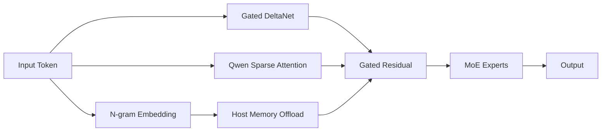

The diagram above is an engineering abstraction, not Qwen's complete official architecture diagram.

**Mermaid diagram B: production-adoption path**

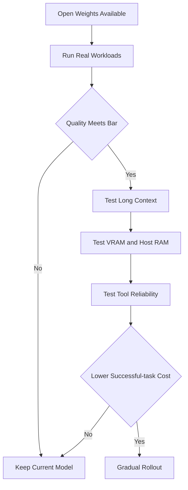

**Sources**:
- [Qwen official release](https://qwen.ai/blog?id=qwen3.8-flash-next)
- [Qwen3.8-Flash-Next GitHub](https://github.com/QwenLM/Qwen3.8-Flash-Next)
- [SGLang Day-0 Support](https://www.lmsys.org/blog/2026-08-26-qwen-flash-next/)

---

### 2. Claude in Chrome reaches GA: browser agents move toward automatic actions protected by layered safety validation

- Category: Agent / Security
- Information status: Official product update
- Published: 2026-08-26; exact time not published
- Availability: Publicly available on every paid Claude plan; Enterprise admins can restrict allowed domains

**Fact summary**: Anthropic announced general availability of Claude in Chrome for all paid Claude plans. Claude can read authenticated webpages, click, type, navigate across tabs, and fill forms. The new version can also automatically approve actions classified as safe rather than requesting confirmation for every step. Enterprise administrators can control availability and permitted domains.

**What changed versus before**: Claude in Chrome progressed from a 2025 experimental browser extension to GA, but the more important shift is execution authority. Anthropic describes two safety layers: probes inspect webpage content when it enters Claude as a tool result, while a safety classifier checks a proposed action against the user's original intent before execution.

**Why it matters**: The browser is the largest part of enterprise software that does not expose clean APIs. Internal dashboards, legacy ERP systems, partner portals, and admin consoles can often only be automated through the UI. At the same time, web pages are hostile, untrusted inputs. Browser agents therefore need a way to become more autonomous without relying entirely on a system prompt saying "ignore malicious instructions."

**Practical impact**: Browser-agent engineering is moving from one-layer LLM judgment toward layered controls: content inspection decides what the model should trust, action verification decides what it is allowed to do, and domain policy constrains where it can go. Enterprise computer-use systems should adopt a similar separation.

**Role perspective**:
- AI Builder: browser automation is now more viable for constrained production PoCs.
- Product owner: legacy systems without APIs can become candidates for agent automation.
- Tech Lead: treat webpage content as untrusted tool output.
- Department manager: begin with reversible, low-risk workflows before exposing financial, permission, or irreversible actions.

**Action to borrow**: Add three independent gates to browser-agent execution: injection detection, action-intent matching, and a target-domain allowlist. Keep separate approval requirements for high-risk mutations even when the model believes they are safe.

**Risks and uncertainty**: Anthropic's attack-rate measurements come from its own tests and red-team setup and cannot guarantee safety against future attacks. Browser agents act through the user's existing login session, so the upper bound of a bad action may be the full authority of that user.

**Next signals to watch**:
1. Finer-grained enterprise action controls;
2. Real-world prompt-injection incident rates;
3. Unified task and audit history across Chrome, Claude Code, and Cowork.

**Mermaid diagram A: layered browser-agent safety**

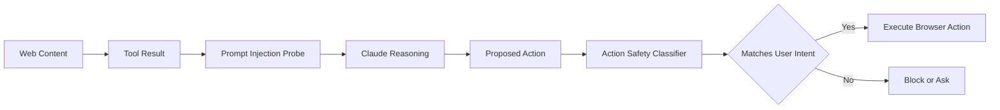

**Mermaid diagram B: enterprise rollout order**

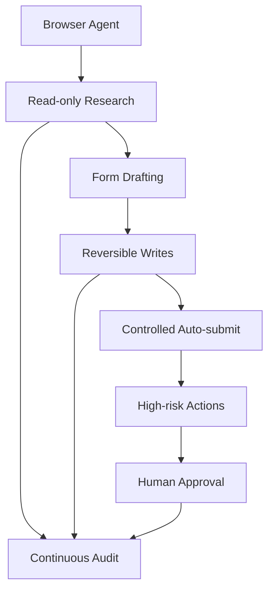

**Source**:
- [Anthropic: Claude in Chrome is generally available](https://claude.com/blog/claude-in-chrome-generally-available)

---

### 3. OpenAI Assistants API reaches its official shutdown date: Responses + Conversations become the main agent API path

- Category: Agent / Infrastructure
- Information status: Officially confirmed
- Published: 2026-08-26 shutdown date; exact shutdown time not published
- Availability: Assistants API at shutdown; Responses API + Conversations API are the recommended replacement

**Fact summary**: OpenAI's official Deprecations documentation lists 2026-08-26 as the shutdown date for the Assistants API and recommends Responses API plus Conversations API. OpenAI gave developers one year of notice and said Responses had reached feature parity while adding newer capabilities such as MCP, computer use, and deep research.

**What changed versus before**: For the past year, the shutdown was a future migration requirement. Inside today's news window, it became an active compatibility event. The conceptual model also moves away from `Assistant → Thread → Run` toward `Prompt/Conversation → Response`, changing how applications manage state and tool execution.

**Why it matters**: API lifecycle risk is often underestimated compared with model upgrades. Applications may have Assistant IDs, Thread IDs, Run state, file retrieval, and business records deeply coupled to the old abstraction. Replacing one endpoint is therefore often insufficient; teams need to migrate state models, tool loops, history, failure semantics, and observability.

**Practical impact**: Any remaining Assistants API production traffic should be treated as P0 technical debt. Even if some legacy behavior remains temporarily reachable, teams should not depend on undocumented post-shutdown behavior. New agent applications should also avoid rebuilding their domain model around vendor-specific Assistant concepts.

**Role perspective**:
- AI Builder: stop creating new Assistants API integrations.
- Product owner: verify migration impact on conversation history, files, and user-visible behavior.
- Tech Lead: validate API, state, tools, errors, and tracing as separate migration layers.
- Department manager: raise the risk level of any business-critical system that has not migrated.

**Action to borrow**: Search repositories for Assistants endpoints, `assistant_id`, `thread_id`, `run_id`, and relevant beta headers. Build a migration matrix and replay the same sessions across old and new implementations to compare final answers, tool execution, and persisted state.

**Risks and uncertainty**: Migration complexity varies widely. Simple chat applications may move quickly, while systems deeply coupled to Threads, Files, or Runs may see subtle behavioral differences. Feature parity does not guarantee identical business semantics.

**Next signals to watch**:
1. Explicit production error behavior from old endpoints;
2. Further unification of Responses, Conversations, and Agent SDK abstractions;
3. Any enterprise-specific migration support or exceptions.

**Mermaid diagram A: API abstraction migration**

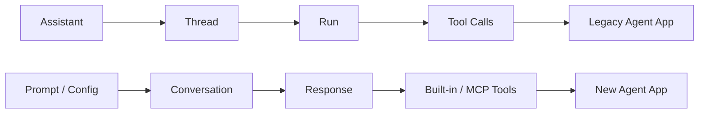

**Mermaid diagram B: migration validation**

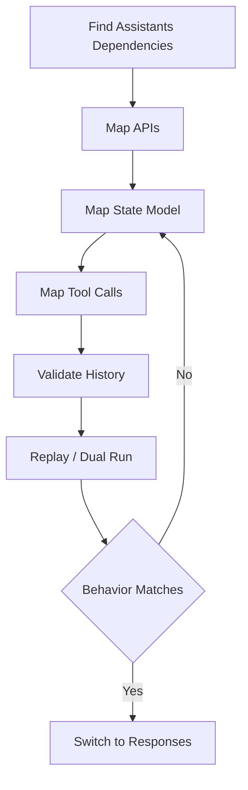

**Sources**:
- [OpenAI API Deprecations](https://developers.openai.com/api/docs/deprecations)
- [OpenAI Assistants Migration Guide](https://developers.openai.com/api/docs/guides/assistants/migration)

---

### 4. AWS and NVIDIA plan 2 million additional GPUs, expanding AI infrastructure competition from GPU instances to CPU, networking, models, and robotics

- Category: Infrastructure / Policy & Industry
- Information status: Officially confirmed
- Published: 2026-08-26; exact time not published
- Availability: Phased infrastructure rollout

**Fact summary**: AWS and NVIDIA announced an expanded collaboration under which AWS plans to deploy 2 million additional NVIDIA GPUs across its global infrastructure while deepening integration around NVIDIA Vera CPUs, advanced networking, Nemotron open models, and physical-AI technologies. The companies are targeting agentic AI, AI factories, and robotics workloads.

**What changed versus before**: Cloud/chip partnerships are evolving beyond simply purchasing GPU instances. CPU, GPU, networking, models, training/inference software, and robotics are increasingly being treated as a co-engineered system — effectively a vertically integrated AI factory.

**Why it matters**: Future API pricing, capacity limits, regional availability, and inference latency depend not only on model algorithms but on how quickly major cloud providers can deploy new accelerators and interconnect. The 2-million-GPU figure primarily changes medium-term supply expectations rather than instantly creating 2 million available GPUs today.

**Practical impact**: Enterprises should manage supplier risk not only at the model-provider layer but at the underlying compute layer. For long-lived workloads, region capacity, accelerator generation, networking, data residency, and supply chain should increasingly be part of model-platform procurement.

**Role perspective**:
- AI Builder: no immediate code change, but monitor the availability of new instances and inference services.
- Product owner: larger compute supply may reduce constraints for agentic and physical-AI products.
- Tech Lead: avoid tightly coupling infrastructure to a single GPU SKU.
- Department manager: track cloud capacity alongside model pricing for 6–18 month planning.

**Action to borrow**: Add underlying cloud, accelerator, region, and failover fields to the model-supplier scorecard, and define a second runtime environment for critical agent workloads.

**Risks and uncertainty**: This is a deployment plan, not confirmation that all GPUs are already online. Power, data-center construction, networking, and regional approvals may affect delivery.

**Next signals to watch**:
1. GA dates for new GPU instance families;
2. Inference economics of Vera CPU + GPU combinations;
3. Whether AWS productizes Nemotron and robotics capabilities into managed agent/physical-AI services.

**Mermaid diagram**

**Source**:
- [AWS / NVIDIA official announcement](https://press.aboutamazon.com/aws/2026/8/aws-and-nvidia-to-deliver-2-million-additional-gpus-and-next-generation-infrastructure-for-agentic-and-physical-ai)

---

### 5. Anthropic makes Claude Code and Cowork Compliance API coverage GA, extending enterprise audit from chat records to tool execution

- Category: AI Coding / Security / Enterprise Compliance
- Information status: Official product update
- Published: Updated 2026-08-26
- Availability: Compliance API coverage for Claude Code CLI/Desktop and Cowork is GA; Microsoft 365 add-ins and Claude Science remain beta

**Fact summary**: Anthropic updated its Compliance API announcement to confirm GA coverage for Cowork on desktop/web/mobile and Claude Code on CLI/Desktop. Security and compliance teams can retrieve session content and metadata through one interface, including prompts, responses, web/MCP tool-call content, skills/artifacts content, verified user identity, organization IDs, session/message IDs, and timestamps.

**What changed versus before**: The coverage was previously beta and is now GA. Enterprises no longer need to rely only on local logs or a separate OpenTelemetry deployment to gain centralized visibility into Claude Code agent sessions and tool activity.

**Why it matters**: Once an AI coding agent can read repositories, execute commands, call MCP tools, and run long tasks, it enters the risk class of privileged developer tooling. Compliance teams need to answer not only “what did an employee ask the AI?” but also “what tools did the agent use, what content did it see, and under whose identity?”

**Practical impact**: For enterprises considering broad Claude Code deployment, this removes an important governance barrier. SIEM, eDiscovery, DLP, and investigation workflows can use a unified source. At the same time, organizations should review whether agent transcripts themselves contain source code, secrets, business data, or personal information and apply appropriate retention policies.

**Role perspective**:
- AI Builder: expect tool activity to become part of durable enterprise audit history.
- Tech Lead: align Claude Code, OpenTelemetry, and SIEM trace IDs.
- Department manager: treat audit visibility as an enabling governance feature for larger deployment.

**Action to borrow**: Export one week of Claude Code Compliance data for a pilot team and correlate it with Git commits, CI activity, and MCP gateway logs. Verify whether you can trace `user → session → tool call → repository change`.

**Risks and uncertainty**: GA does not mean every Claude access path has identical coverage. Anthropic documents limitations for some Claude Code Web, Claude Platform, and cloud-provider paths; enterprises must validate the exact channel they purchase and use.

**Next signals to watch**:
1. Consistent audit support across cloud channels;
2. Policy enforcement in addition to after-the-fact logging;
3. More structured fields for MCP tool activity.

**Mermaid diagram**

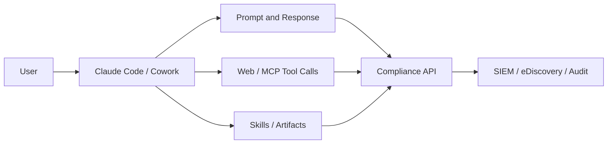

**Source**:
- [Anthropic Compliance API Update](https://claude.com/blog/compliance-api-cowork-and-claude-code)

---

### 6. Google extends native vLLM TPU serving to long-context embeddings, pushing retrieval infrastructure into the heterogeneous-accelerator era

- Category: Infrastructure / Model Deployment
- Information status: Official product update
- Published: 2026-08-26; exact time not published
- Availability: Publicly usable; deployment recipes are open source

**Fact summary**: Google Cloud described native TPU support in vLLM and specialized engineering for long-context embedding workloads such as Qwen3-Embedding-8B and Qwen3-VL-Embedding-8B. The work includes hardware-safe tensor alignment, JAX/XLA compilation pre-warming, hardened lazy loading, and StepPool/CachedRequestState mechanisms for chunked-prefill pooling. Google reports tests covering 7K+ text and 15K+ multimodal inputs and published AI-Hypercomputer recipes.

**What changed versus before**: vLLM's ecosystem originally centered heavily on GPU-based LLM generation. The same serving abstraction is now extending toward TPU, pooling runners, long-context embeddings, and heterogeneous clusters. Google also describes GKE Custom Compute Classes as a way to move among accelerator capacity types when preferred capacity is unavailable.

**Why it matters**: Embeddings are a foundational cost center for RAG, semantic search, recommendation, memory, and agent retrieval. If vLLM can meaningfully abstract TPU/GPU serving differences, retrieval workloads gain another lever for cost and capacity routing.

**Practical impact**: Large-scale RAG teams can begin evaluating XPU portability at the embedding-service layer. Cross-hardware cosine parity is particularly important because small vector differences can change approximate-nearest-neighbor ranking and offline index consistency.

**Role perspective**:
- AI Builder: separate accelerator selection from application logic.
- Tech Lead: establish embedding golden references and cross-XPU parity tests.
- Department manager: include TPU/GPU competition in high-scale retrieval economics.

**Action to borrow**: Recompute 10K–50K production embeddings on both the current GPU stack and TPU vLLM, then compare cosine similarity, Recall@K, throughput, request latency, and cost.

**Risks and uncertainty**: Google's throughput and parity results come from its own engineering tests and cannot be generalized to every embedding model or dataset. Heterogeneous fallback also introduces cold-start, index-consistency, and capacity-planning complexity.

**Next signals to watch**:
1. More open embedding/reranker models supported on TPU vLLM;
2. Shrinking TPU/GPU feature gaps in vLLM;
3. Accelerator-aware routing becoming common in retrieval infrastructure.

**Source**:
- [Google Developers Blog](https://developers.googleblog.com/enterprise-grade-precision-for-long-context-multimodal-embedding-inference-on-cloud-tpu/)

---

### 7. Microsoft formalizes “cost per successful outcome” for agents, linking routing, caching, optimization, and observability into one loop

- Category: Infrastructure / Model Routing / Cost Governance
- Information status: Official product guidance / product update
- Published: 2026-08-26; exact time not published
- Availability: Microsoft Foundry capabilities vary by product, region, and plan

**Fact summary**: Microsoft argues that enterprises should optimize cost per successful outcome rather than token price alone. Its Foundry framework groups runtime optimization into four levers: model/deployment routing, prompt and semantic caching, prompt/agent optimization, and observability/evaluation. Foundry Model Router can select models behind one endpoint with cost/quality priorities and allow-listed model subsets; Agent Optimizer can vary instructions, skills, tool descriptions, and model selection against real-task datasets.

**What changed versus before**: Model routing was often understood as “send easy tasks to cheap models and hard tasks to frontier models.” Microsoft is connecting routing, caching, prompts, skills, tool descriptions, deployment mode, observability, and evaluation into a continuous hill-climbing loop. Agent FinOps is becoming runtime engineering rather than post-hoc bill analysis.

**Why it matters**: One agent outcome can involve many model requests. Cutting per-request cost by 30% can still increase total cost if a weaker path causes more turns, wrong tool calls, or retries. Success rate and turn count are therefore becoming FinOps metrics as well as agent-quality metrics.

**Practical impact**: A model gateway increasingly needs policy, routing, tracing, and evaluation feedback rather than functioning only as a provider proxy. Prompt architecture also affects caching economics: stable system instructions and tool schemas should be separated from volatile per-request data.

**Role perspective**:
- AI Builder: track task-level success and total turns.
- Product owner: measure the cost to complete a business outcome.
- Tech Lead: require evaluation gates before changing router policy.
- Department manager: govern cost together with quality and SLOs.

**Action to borrow**: Add a `task_id` to the model gateway and aggregate every model call, tool call, cache hit, retry, and final outcome into a cost-per-success dashboard.

**Risks and uncertainty**: These are Microsoft's recommendations and capabilities in the Foundry ecosystem. Automatic routing is not guaranteed to outperform manual policy, and drifting router/evaluation data can create silent quality regressions.

**Next signals to watch**:
1. Stable production gains from Agent Optimizer;
2. More customizable and cross-provider routing;
3. Cost per successful task becoming a standard observability metric.

**Source**:
- [Microsoft Azure: The Economics of Agent Optimization](https://azure.microsoft.com/en-us/blog/the-economics-of-agent-optimization-four-ways-to-lower-the-cost/)

---

### 8. OpenAI pushes WebMCP into hands-on development: websites begin exposing structured tools instead of forcing agents to infer UI behavior

- Category: MCP / Agent / Infrastructure
- Information status: Officially confirmed
- Published: approximately 2026-08-26 03:00 Asia/Singapore; official opening time was 2026-08-25 12:00 PT
- Availability: WebMCP is experimental; testing is supported in ChatGPT's in-app browser

**Fact summary**: OpenAI launched the WebMCP Challenge with support from Google Chrome, Cloudflare, Shopify, Vercel, Netlify, Render, and others. WebMCP lets websites expose structured tools directly to agents instead of requiring browser agents to depend entirely on DOM interpretation, visual grounding, and simulated mouse actions. OpenAI says developers can test WebMCP-enabled sites in ChatGPT's in-app browser and through experimental Chrome support.

**What changed versus before**: Traditional MCP generally connects agents to local or remote MCP servers. WebMCP pushes a similar concept directly into webpages. A website may eventually expose two parallel surfaces: a visual UI for humans and a structured action surface for agents.

**Why it matters**: Pure visual browser automation is fragile because DOM structure, button placement, A/B testing, and page state change frequently. If browser and web-platform support develops around WebMCP, web agents could gradually move from “RPA with an LLM” toward reliable tool invocation with a UI fallback.

**Practical impact**: Web product teams may need to design agent-facing capabilities the same way they design APIs today. Tool schemas, permissioning, confirmation, idempotency, auditable side effects, and rate limits become part of frontend product architecture. Structured tools may also reduce visual-token and DOM-reasoning cost.

**Role perspective**:
- AI Builder: run a small WebMCP experiment on one internal site.
- Product owner: identify which core product actions deserve an agent-native interface.
- Tech Lead: do not map WebMCP tools directly to unprotected administrative backend calls.
- Department manager: treat this as an early standard worth testing, not a platform to lock into yet.

**Action to borrow**: Select an internal web tool with 3–5 frequent actions, design an agent-action schema, and compare WebMCP with conventional browser automation on completion rate, runtime, and token cost.

**Risks and uncertainty**: WebMCP remains experimental. Browser support, security, permissioning, and ecosystem conventions may change. Structured tools improve reliability, but bad authorization can make an agent more reliable at executing the wrong action.

**Next signals to watch**:
1. Chrome moving WebMCP from experimental support toward stable releases;
2. Framework-level tooling from Vercel, Cloudflare, Shopify, and others;
3. Identity, OAuth, and audit alignment between WebMCP and conventional MCP.

**Source**:
- [OpenAI WebMCP Challenge](https://openai.com/webmcp-challenge/)

## C. Other Notable Items

**1. OpenAI o3 was retired from ChatGPT on August 26, while API access remains unaffected.** This is a useful reminder that model availability in a product surface and model API lifecycle are separate. Workflows that rely on users manually selecting o3 in ChatGPT need adjustment, but backend API integrations are not automatically shut down by the ChatGPT retirement. Source: [OpenAI ChatGPT Rate Card](https://help.openai.com/en/articles/11481834-chatgpt-rate-card).

**2. NVIDIA published an agent-driven COMPASS robotics workflow.** The tutorial uses Codex or Claude Code to orchestrate repository skills for scene preparation, smoke tests, residual RL training, checkpoint evaluation, and approval gates, while the coding agent is not part of the robot's runtime control loop. It is a useful example of AI coding agents managing the ML/robotics development lifecycle rather than directly controlling the machine. Source: [NVIDIA Technical Blog](https://developer.nvidia.com/blog/?p=121922).

**3. Hugging Face / Sentence Transformers added a workflow for training and fine-tuning multi-vector embedding models.** Multi-vector retrieval is moving further into mainstream tooling and is worth watching for high-precision RAG and late-interaction retrieval, though its impact today is lower than the TPU serving and Qwen architecture changes. Source: [Hugging Face Blog](https://huggingface.co/blog/train-multi-vector-encoder).

## D. AI Trend Summary

### Trends supported by current facts

**Trend 1: Model architecture innovation is focusing again on real inference economics rather than parameter count alone.** Qwen3.8-Flash-Next's sparse attention and offloaded N-gram memory, together with Microsoft's cost-per-success framing, point toward workload economics as the optimization target.

**Trend 2: Agent execution environments are rapidly being standardized.** Claude in Chrome adds safety classification around browser actions while WebMCP lets websites expose structured agent tools. Browser agents are moving from visual-only RPA toward structured tools with UI fallback.

**Trend 3: Enterprise governance is expanding to the full agent session.** Claude Code Compliance API GA shows that audit scope now includes web/MCP tool activity, skills, and artifacts, not only user prompts.

**Trend 4: AI infrastructure is becoming genuinely heterogeneous.** AWS/NVIDIA are expanding GPU capacity while Google is pushing vLLM embedding serving onto TPU. Production platforms will increasingly schedule workloads across multiple accelerator types.

### Analytical inference

**Inference 1: Model Gateways are likely to evolve into Workload Control Planes.** API proxying alone is insufficient; task routing, accelerator routing, caching, policy, cost-per-success, tracing, and evaluation feedback are converging.

**Inference 2: Web products may increasingly adopt dual-interface design.** One interface will remain visual and human-facing, while another structured capability surface serves agents. Over time, this could become an important characteristic of agent-native products.

**Trend overview**

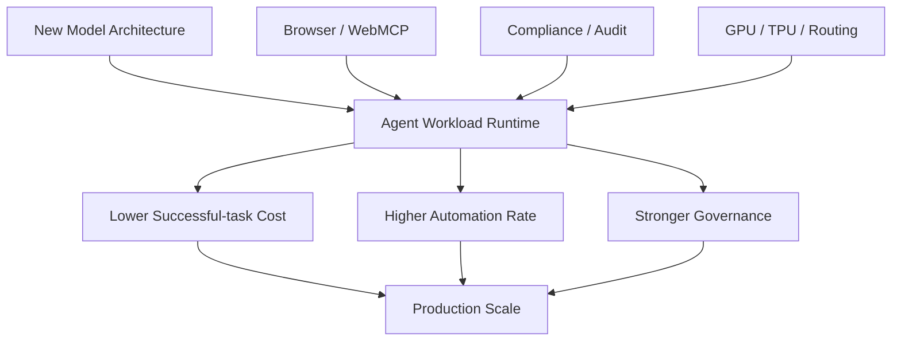

## E. Actions to Consider Today

1. **Role: AI Builder / Tech Lead | Action: schedule a Qwen3.8-Flash-Next workload PoC.** Focus on coding, long context, tool use, Host Memory offload, and successful-task cost instead of broad benchmark coverage. **Why now**: this is an early public window into Qwen4 architecture. **Action type: Schedule a test.**

2. **Role: Tech Lead / Security | Action: revisit the Browser Agent security model.** Separate content-trust checks, action-safety checks, and target-system permissions. **Why now**: Claude in Chrome is now GA with automatic approval for selected actions. **Action type: Risk review.**

3. **Role: AI Platform | Action: immediately confirm whether any OpenAI agent project still depends on Assistants API.** **Why now**: the official shutdown date has arrived. **Action type: Execute now.**

4. **Role: Department manager / Product owner | Action: upgrade Agent ROI from token cost to cost per successful outcome.** Include failed retries, tool calls, wall-clock time, and human remediation. **Why now**: both runtime and infrastructure optimization are converging on task-level economics. **Action type: Add to roadmap.**
