<!-- 中文版 -->
# AI 今日头条｜2026 年 08 月 27 日

- 语言：中文
- 时区：Asia/Singapore
- 新闻窗口：2026-08-26 07:30 至 2026-08-27 07:30
- 实际检索截止时间：2026-08-27 10:18
- 本期核心新闻：8 条
- 其他值得关注：3 条

## A. 今日最重要的 3 件事

**1. GLM-5.3-Flash 正式发布，把“Flash 模型”推进到原生多模态、Coding/Agent 与开放权重同时成立的层级。** Z.ai 发布 320B 总参数、18B 激活参数的 GLM-5.3-Flash，首次在 GLM-5 系列采用原生多模态和 Sparse + Linear Attention 混合结构，并以 MIT License 开放权重。它值得进入今天第一梯队，不是因为厂商 benchmark 本身，而是因为“较低激活参数 + 长上下文优化 + 多模态 + Coding Agent + 可自部署”开始同时出现在一个模型里。

**2. Qwen3.8-Flash-Next 同一天开放权重，并公开了未来 Qwen4 的关键架构方向。** Qwen 把 Attention、Residual、Embedding 和 Optimizer 四层同时重构：125B 主模型之外加入约 51B N-gram Embedding，每 token 仅激活约 6B 参数，并把部分 Embedding 容量设计为可从 Host Memory 异步取用。GLM 与 Qwen 在同一天都把“更大容量但更低每-token计算”作为核心方向，是比单个 benchmark 更值得关注的结构性信号。

**3. Claude in Chrome 正式 GA，浏览器 Agent 开始从“每一步人工确认”转向受安全分类器保护的有限自治。** Anthropic 将其开放到全部付费 Claude 计划，并在网页内容进入模型和动作真正执行之前分别加入 prompt-injection probe 与 action safety classifier。浏览器是大量无 API 企业系统唯一现实的自动化入口，因此这一变化直接影响 browser agent 的工程与安全架构。

## B. 新闻正文

### 1. GLM-5.3-Flash 正式发布：320B-A18B、原生多模态、开放权重，Flash 模型开始进入 Coding/Agent 主战场

- 类别：模型 / AI 编程 / Agent
- 信息状态：官方已确认
- 发布时间：2026-08-26；未公布准确时间
- 可用状态：已公开可用；开放权重；Z.ai API / Coding Plan 可用

**事实摘要**：Z.ai 发布 GLM-5.3-Flash，这是 GLM-5 系列首个原生多模态模型。模型总参数约 320B、每 token 激活约 18B，采用 Sparse Attention + Linear Attention 混合架构，并加入 Manifold-Constrained Hyper-Connections（mHC）；官方模型权重已在 Hugging Face 以 MIT License 发布，并支持 SGLang、vLLM、TokenSpeed 等推理路径。Z.ai 同时确认，此前在 OpenCode 与 OpenRouter 匿名运行的 `ox-alpha` 即 GLM-5.3-Flash。

**相较此前的变化**：相较 GLM-5.2，GLM-5.3-Flash 不只是一个低价衍生版本，而是重新训练的原生多模态基础模型。它把激活参数压到 18B，并首次在 GLM 系列引入 Linear + Sparse Attention 混合结构；Z.ai 还使用 IndexPool 压缩长上下文索引器的 Key，以降低 1M 级上下文的 Attention、KV Cache 与索引成本。官方还将它开放给全部 GLM Coding Plan 用户，并称其可用 quota 是 GLM-5.3 的 3 倍。

**为什么重要**：Flash 模型过去通常意味着“以明显能力折扣换成本”，但 GLM-5.3-Flash 的定位明显在尝试打破这个边界：让低激活参数模型直接覆盖 Coding Agent、工具使用、视觉浏览器和长期任务。如果独立 workload 评测能验证这一点，那么企业模型路由里的“默认模型”可能越来越从旗舰模型切到 Flash 级模型，仅将复杂尾部请求升级到旗舰。

**实际影响**：对 Coding Agent 和 Harness 团队，GLM-5.3-Flash 值得立即进入真实仓库 PoC。重点不应该复制 Z.ai 的 benchmark，而是测试 repository-level coding、CLI 工具调用、browser/computer use、长任务稳定性和失败恢复。对于自部署团队，320B 总参数依然意味着较高存储和系统复杂度，但 18B active + 混合 Attention 可能显著改变吞吐和显存/内存设计。

**角色视角**：
- AI Builder：可作为 Coding/Agent 的低成本默认模型候选。
- 产品负责人：若实际价格与任务完成率成立，高频后台 Agent 的单位经济性会明显改善。
- Tech Lead：重点验证 serving 成熟度、长上下文与工具调用，而不是只跑静态问答。
- 部门经理：适合作为模型供应商多元化和开放权重路线的重要候选。

**可借鉴动作**：用 30–50 个真实 Coding/Agent 任务比较 GLM-5.3-Flash 与当前默认模型，统一记录成功率、turn 数、工具错误率、wall-clock、总 token、人工介入率和 cost per successful task。

**风险与不确定性**：Z.ai 公布的 DeepSWE、AutomationBench、Terminal Bench 等结果属于厂商评测；例如 DeepSWE v1.1 63.4、AutomationBench 48.8 等数字应视为待第三方复现的数据，而不是独立结论。“约 GLM-5.2 十分之一价格”同样需要按真实任务和供应渠道验证。

**下一步观察**：
1. 第三方 Coding/Agent 与视觉工具使用 benchmark；
2. vLLM/SGLang 在长上下文、高并发下的真实吞吐；
3. 量化模型对 multimodal、tool use 与 Agent 长任务的损失。

**Mermaid 图示 A：GLM-5.3-Flash 的效率路线**

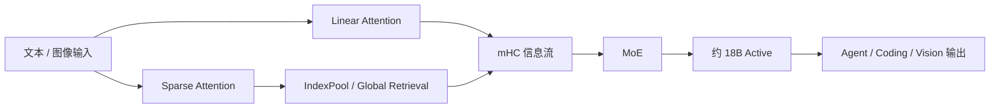

以上为基于公开信息的工程抽象，不代表 Z.ai 官方完整架构图。

**Mermaid 图示 B：是否升级为默认 Agent 模型**

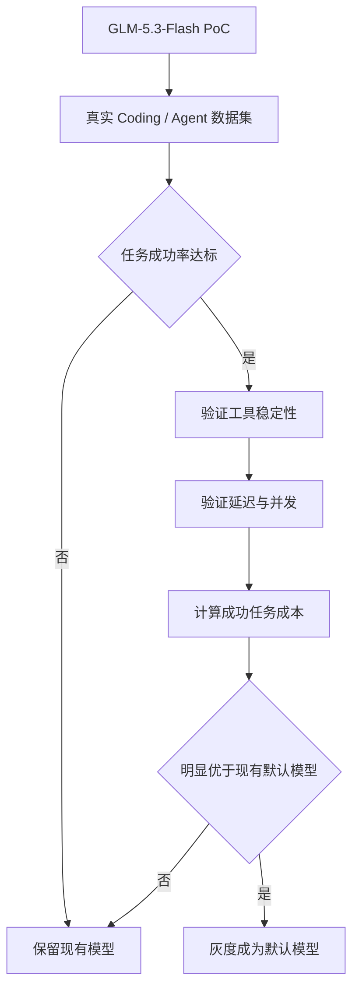

**来源**：
- [Z.ai：GLM-5.3-Flash](https://z.ai/blog/glm-5.3-flash)
- [Z.ai 官方 Hugging Face 模型页](https://huggingface.co/zai-org/GLM-5.3-Flash)
- [GLM-5.3-Flash MIT License](https://huggingface.co/zai-org/GLM-5.3-Flash/blob/main/LICENSE)

---

### 2. Qwen3.8-Flash-Next 开放权重：Qwen4 预览把稀疏 Attention、N-gram Memory 与 Host Offload 放进一个模型

- 类别：模型 / 基础设施 / AI 编程
- 信息状态：官方已确认
- 发布时间：2026-08-26；未公布准确时间
- 可用状态：开放权重；Hugging Face / ModelScope 可用；QwenCloud 托管版按官方计划开放

**事实摘要**：Qwen 开放 Qwen3.8-Flash-Next 权重，并明确将其描述为未来 Qwen4 架构的早期预览。模型主干约 125B 参数、每 token 激活约 6B，同时加入约 51B N-gram Embedding 和约 4B MTP 参数；原生上下文长度 262,144 tokens，可通过 YaRN 扩展至 1,000,000 tokens。Qwen 称其相较 Qwen3.7-Plus 的训练成本约为 1/9，同时提升 Coding 与办公任务能力。

**相较此前的变化**：核心创新集中在四层。Attention 采用 Gated DeltaNet + Qwen Sparse Attention；Residual 扩展为四路 Gated Residual；Embedding 用 Bigram/Trigram 对本地上下文进行确定性查询，并可将大表放在 Host Memory 通过异步预取参与推理；训练则进一步使用和调整 Muon + AdamW 的分工。

**为什么重要**：Qwen 的设计体现出一种与 GLM-5.3-Flash相似但实现不同的方向：增加模型“容量”不一定需要同比增加每 token GEMM 计算。特别是将 N-gram Embedding 从 GPU 显存压力中剥离，会使 CPU Host RAM、PCIe/NVLink 带宽和预取策略重新进入 LLM serving 的性能关键路径。

**实际影响**：对于已有 GPU 集群，评测不应只看模型是否“放得进去”，还要看 Host Memory 与 GPU 协同是否造成 TTFT 或并发抖动。Qwen 官方还提供 vLLM、SGLang 等运行路径，第三方也快速增加 TensorRT-LLM 支持，使它很适合拿来测试异构内存和长上下文 serving。

**角色视角**：
- AI Builder：适合 Coding、Cowork 与长上下文 Agent PoC。
- 产品负责人：可观察 Flash 模型是否开始承担过去必须使用旗舰模型的工作。
- Tech Lead：需要测 Host RAM 带宽、并发、TTFT 与 Cache 行为。
- 部门经理：可以把它视为 Qwen4 正式推出前的重要技术路线信号。

**可借鉴动作**：同一套 Agent workload 同时测试 GLM-5.3-Flash 与 Qwen3.8-Flash-Next，重点比较成功任务成本，而不是仅对比 benchmark 分数。

**风险与不确定性**：Qwen 的 1/9 训练成本和 benchmark 结论来自官方测试；1M context 是 YaRN 扩展能力，不意味着 1M 范围内信息召回和推理质量完全稳定。Host Memory Offload 的收益高度依赖硬件拓扑。

**下一步观察**：
1. QSA 在真实长上下文 Agent 上的有效 Attention 精度；
2. N-gram Embedding 量化与 Host Memory 的带宽瓶颈；
3. Qwen4 是否完整继承这一架构。

**Mermaid 图示 A：Qwen Flash-Next 的容量 / 计算解耦**

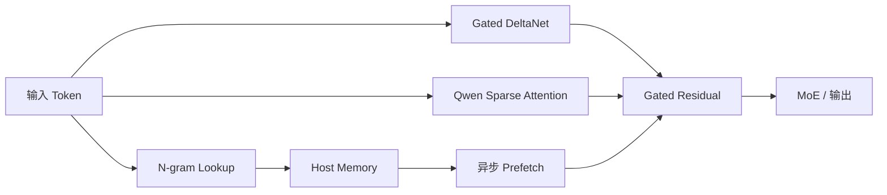

以上为基于公开信息的工程抽象，不代表 Qwen 官方完整架构图。

**Mermaid 图示 B：Flash 模型评测框架**

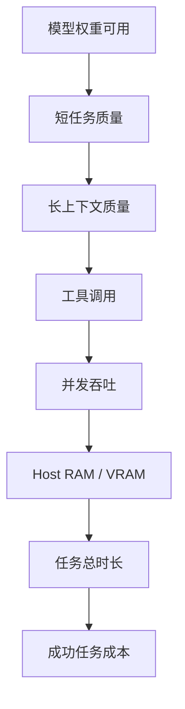

**来源**：
- [Qwen3.8-Flash-Next 官方发布](https://qwen.ai/blog?id=qwen3.8-flash-next)
- [Qwen3.8-Flash-Next GitHub](https://github.com/QwenLM/Qwen3.8-Flash-Next)
- [Qwen Hugging Face](https://huggingface.co/Qwen/Qwen3.8-Flash-Next)

---

### 3. Claude in Chrome 正式 GA：Browser Agent 进入“网页内容检测 + 动作安全分类器”的有限自治阶段

- 类别：Agent / 安全
- 信息状态：官方产品更新
- 发布时间：2026-08-26
- 可用状态：全部 Claude 付费计划已公开可用；Enterprise 可配置域名访问

**事实摘要**：Anthropic 宣布 Claude in Chrome 正式 GA，覆盖所有 Claude 付费计划。Claude 可以使用用户现有登录态读取页面、跨 Tab 导航、点击、输入和填写表单；本次更新允许被系统判断为安全的动作自动执行，而无需每一步获得人工批准。

**相较此前的变化**：关键升级不只是 GA，而是授权模式变化。Anthropic 在 web tool result 进入 Claude 时使用 probe 检测潜在 prompt injection；在真正执行导航、输入等动作之前，又用独立 safety classifier 将动作与用户原始请求比对。如果动作与原始请求不匹配，可以被阻断。

**为什么重要**：浏览器 Agent 的安全问题与普通 API Agent 不同：页面文本由第三方控制，恶意指令与真实业务数据混在同一上下文里，而执行权限又来自用户已经登录的账户。仅靠基础模型判断或 system prompt 无法构成足够安全边界。Anthropic 将“读入安全”和“执行安全”拆成两个阶段，是一个值得借鉴的生产架构。

**实际影响**：没有 MCP/API 的 ERP、供应商 Portal、内部后台和 SaaS 管理页面可以更现实地进入 Agent 自动化范围。与此同时，企业自建 browser agent 需要把 DOM/页面内容视作 hostile tool output，并对动作做独立策略检查。

**角色视角**：
- AI Builder：可以优先自动化只读、草稿和可回滚浏览器任务。
- 产品负责人：大量“没有 API”的流程现在有了可行 Agent 路径。
- Tech Lead：内容检测与动作授权必须分层。
- 部门经理：不要直接从“可浏览”跳到“可自动提交高风险操作”。

**可借鉴动作**：在任何 Browser Agent 中至少加入三层控制：网页 injection 检测、动作与用户意图匹配、域名/系统 allowlist；金融、权限、删除、发布等高风险动作继续保留独立审批。

**风险与不确定性**：Anthropic 的安全测试和攻击成功率数据来自自身测试集与红队环境；prompt injection 会持续变化。由于 Agent 使用用户登录态，一次错误操作的潜在权限范围可能等于用户本人。

**下一步观察**：
1. 是否支持动作级而不仅是域名级 Enterprise policy；
2. 浏览器 Agent 真实生产环境的 injection incident rate；
3. Chrome、Cowork 与 Claude Code 的统一审计和任务状态。

**Mermaid 图示 A：Browser Agent 双层安全链**

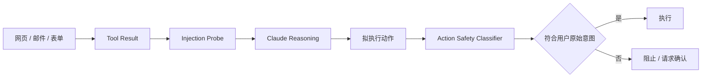

**Mermaid 图示 B：企业 Browser Agent 权限阶梯**

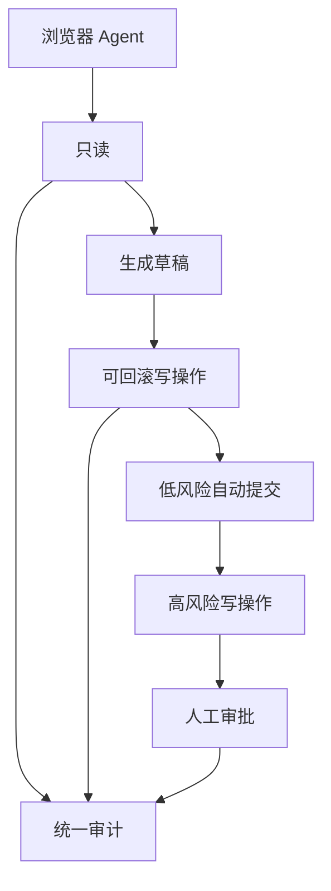

**来源**：
- [Anthropic：Claude in Chrome is generally available](https://claude.com/blog/claude-in-chrome-generally-available)

---

### 4. OpenAI Assistants API 到达正式关闭日期：Assistant / Thread / Run 抽象正式让位于 Responses / Conversations

- 类别：Agent / 基础设施
- 信息状态：官方已确认
- 发布时间：官方 shutdown date 为 2026-08-26
- 可用状态：Assistants API 关闭；官方推荐 Responses API + Conversations API

**事实摘要**：OpenAI 官方 Deprecations 文档确认 Assistants API 的 shutdown date 为 2026-08-26，推荐迁移到 Responses API 与 Conversations API。官方 Migration Guide 将核心抽象映射为 `Assistants → Prompts`、`Threads → Conversations`、`Runs → Responses`、`Run steps → Items`。

**相较此前的变化**：过去一年这一事件只是迁移计划；本期窗口内它正式成为生命周期事件。Responses 的结构把 orchestration、tool loop、conversation state 与 prompt configuration 分得更开，同时加入 MCP、computer use、deep research 等 Assistants 时代没有的原生能力。

**为什么重要**：API 下线风险通常比“新模型 benchmark”更直接。大量旧项目会把 `assistant_id`、`thread_id`、`run_id`、Files、Vector Stores 和数据库对象绑定在一起。真正的迁移并不是替换 URL，而是重新映射状态、工具循环、错误处理和 observability。

**实际影响**：仍有 Assistants API 依赖的团队应该把它视为业务连续性问题。对于新 Agent 系统，则应减少对供应商持久对象的深度业务耦合，把领域状态保留在自己可控制的数据模型中。

**角色视角**：
- AI Builder：不再新增 Assistants API 集成。
- 产品负责人：验证历史会话与文件迁移是否改变用户体验。
- Tech Lead：检查状态、tool call、retries 与 tracing 的行为差异。
- 部门经理：未迁移的生产项目应提升风险等级。

**可借鉴动作**：全仓搜索 `assistant_id`、`thread_id`、`run_id` 与 `/v1/assistants`；针对关键会话执行旧实现 replay 到 Responses/Conversations 的一致性测试。

**风险与不确定性**：官方所谓 feature parity 不等于业务语义完全相同；高度依赖 Threads、Runs 和 Files 的系统可能需要额外迁移工程。

**下一步观察**：
1. 旧 API 在不同账号上的实际错误行为；
2. Conversations 与 Agents SDK 的进一步统一；
3. 企业迁移工具与兼容层是否继续完善。

**Mermaid 图示**

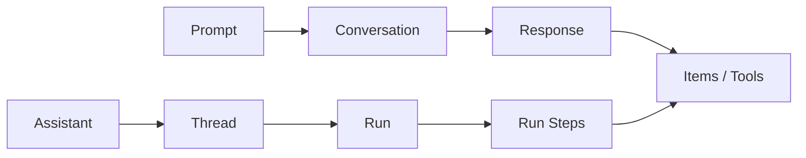

**来源**：
- [OpenAI API Deprecations](https://developers.openai.com/api/docs/deprecations)
- [OpenAI Assistants Migration Guide](https://developers.openai.com/api/docs/assistants/migration)

---

### 5. AWS 与 NVIDIA 再加码 200 万 GPU：AI 基础设施合作从“卖 GPU 实例”升级为完整 AI Factory 联合栈

- 类别：基础设施 / 政策与产业
- 信息状态：官方已确认
- 发布时间：2026-08-26
- 可用状态：未来部署计划；主要计划在 2027–2028 分阶段落地

**事实摘要**：AWS 与 NVIDIA 宣布扩大合作，计划在 AWS 全球基础设施中额外部署 200 万块 NVIDIA GPU，包括 Blackwell Ultra、Rubin 与 Rubin Ultra，并引入 Vera CPU、Spectrum 网络、NVLink Fusion、Nemotron、GPU 加速数据处理和 Physical AI 技术。双方还计划面向美国政府建设包含 10 万 GPU 的安全 AI Factory。

**相较此前的变化**：此前 AWS 已公布新增超过 100 万 NVIDIA GPU 的计划；此次追加 200 万，而且合作范围从 GPU 进一步扩展到 CPU、互联、数据处理、模型、向量索引和机器人。这体现出云厂商和芯片厂商正在共同设计整个 AI workload stack。

**为什么重要**：Agent 的价格、容量、尾延迟与可用区域最终都受算力供给约束。模型厂商发布更便宜的 Flash 模型，与云厂商扩张几百万 GPU 实际上是同一条成本曲线的两端：软件减少每任务计算，基础设施增加总供应。

**实际影响**：模型供应商风险评估不应只看 API SLA，还应考虑底层云与 accelerator dependency。需要长期保证容量的团队应记录区域、芯片代际、故障切换和数据驻留。

**角色视角**：
- AI Builder：短期影响有限，但新实例会持续影响可用 serving 方案。
- Tech Lead：避免系统绑定单一 accelerator SKU。
- 部门经理：6–18 个月 AI 成本预算需同时考虑模型和 compute supply。

**可借鉴动作**：在模型/基础设施供应商表中新增“底层加速器、区域容量、第二运行环境、数据驻留”字段。

**风险与不确定性**：200 万 GPU 是部署承诺而非今天即可消费的容量；数据中心、电力、网络和交付节奏都会影响最终上线速度。

**下一步观察**：
1. Rubin 系列 AWS 实例实际 GA 节奏；
2. Vera CPU + GPU 对 Agent serving TCO 的影响；
3. Nemotron 与 Physical AI 是否更深进入 Bedrock 托管产品。

**Mermaid 图示**

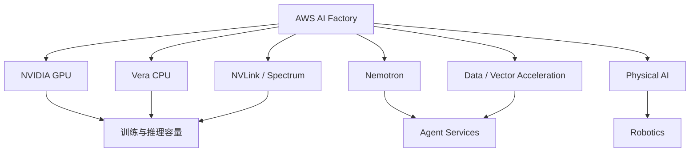

**来源**：
- [AWS 官方公告](https://press.aboutamazon.com/aws/2026/8/aws-and-nvidia-to-deliver-2-million-additional-gpus-and-next-generation-infrastructure-for-agentic-and-physical-ai)
- [NVIDIA 官方公告](https://nvidianews.nvidia.com/news/aws-and-nvidia-to-deliver-2-million-additional-gpus-and-next-generation-infrastructure-for-agentic-and-physical-ai)

---

### 6. Claude Code / Cowork Compliance API 覆盖升级 GA：企业开始能统一审计 Prompt、MCP Tool Call 与 Agent Session

- 类别：AI 编程 / 安全
- 信息状态：官方产品更新
- 发布时间：2026-08-26 更新
- 可用状态：Claude Code CLI/Desktop 与 Cowork 覆盖已 GA；部分其他渠道仍有限制

**事实摘要**：Anthropic 将 Claude Code CLI/Desktop 和 Cowork desktop/web/mobile 的 Compliance API 覆盖从 beta 升级为 GA。企业可以通过统一接口拉取 session transcript 与 metadata，包括 prompts、responses、Web/MCP tool calls、skills/artifacts 文本、用户身份、组织 ID、session/message IDs 与 timestamps。

**相较此前的变化**：过去企业通常需要分别处理普通 Claude 对话审计、Coding Agent 日志和 OpenTelemetry。现在 Claude Code 的 tool activity 可以进入与企业 Claude 对话相同的 Compliance 数据流。

**为什么重要**：Coding Agent 读取仓库、执行 shell、连接 MCP 并修改代码后，已经等同于高权限开发工具。企业需要能够回答“谁让 Agent 做了什么、Agent 调用了什么工具、最后产生什么代码变化”。

**实际影响**：Claude Code 的规模化部署门槛进一步下降，SIEM、eDiscovery、调查与 DLP 流程更容易统一。但 transcript 本身可能包含源代码、Secrets 和业务数据，因此 retention 和访问权限也需要重新设计。

**角色视角**：
- AI Builder：Agent tool call 将越来越多地进入正式审计记录。
- Tech Lead：应打通 session ID、Git commit、CI run 和 MCP gateway trace。
- 部门经理：审计可见性不再是阻挡 Coding Agent 扩大的主要缺口之一。

**可借鉴动作**：选一个 Claude Code 团队做一周 trace correlation，验证是否能完整追踪 `User → Session → MCP/Shell → Repo Change → CI`。

**风险与不确定性**：不同使用渠道覆盖范围并不完全一致，尤其 Claude Code Web、云平台代理路径需要分别核对。

**下一步观察**：
1. Compliance API 是否加入 policy enforcement；
2. MCP tool call 是否产生更细粒度字段；
3. Bedrock / Vertex / Foundry 渠道是否获得一致覆盖。

**Mermaid 图示**

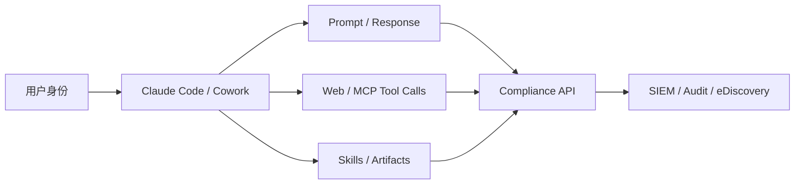

**来源**：
- [Anthropic Compliance API Update](https://claude.com/blog/compliance-api-cowork-and-claude-code)

---

### 7. Google 将 vLLM 原生 TPU Serving 推向长上下文 Embedding，RAG 基础设施开始进入 XPU 可移植阶段

- 类别：基础设施 / 模型部署
- 信息状态：官方产品更新
- 发布时间：2026-08-26
- 可用状态：公开可用；相关 recipes 已开源

**事实摘要**：Google Cloud 公开介绍 vLLM 在 TPU 上的原生支持，并针对 Qwen3-Embedding-8B、Qwen3-VL-Embedding-8B 等长上下文 embedding workload 做了专门优化。相关工程包括 tensor alignment、JAX/XLA compilation pre-warming、lazy loading 加固和用于 chunked-prefill pooling 的 StepPool / CachedRequestState。

**相较此前的变化**：vLLM 的主流认知一直集中在 GPU 文本生成 serving；Google 正把相同 abstraction 推向 TPU、Embedding、多模态和 GKE 异构 accelerator fallback。官方还提供在 TPU 不可用时切换到 GPU capacity pool 的架构。

**为什么重要**：Embedding 是 RAG、Agent Memory、推荐与语义搜索的长期成本中心。只要 serving 层可以跨 TPU/GPU 保持向量数值一致性，企业就能像模型路由一样对 Embedding 做 accelerator routing，而不是长期锁定一种 GPU。

**实际影响**：大规模 RAG 团队应该开始建立 cross-XPU embedding parity 测试。Google 给出的 text cosine pass threshold ≥0.999、多模态 ≥0.995 是其测试口径，企业仍应使用自己的 Recall@K 与业务数据验证，因为微小 vector drift 也可能改变 ANN 排序。

**角色视角**：
- AI Builder：应用逻辑可以进一步与 accelerator 解耦。
- Tech Lead：需要 embedding golden set 和 parity gate。
- 部门经理：检索成本可以纳入 TPU/GPU 竞争。

**可借鉴动作**：抽取 1–5 万生产文档，分别在 GPU 和 TPU vLLM 重算 Embedding，对比 cosine、Recall@K、throughput、P95 latency 与总体成本。

**风险与不确定性**：官方 throughput 和 parity 数据来自 Google 测试环境；不同模型、量化、batch 和实际流量可能产生显著差异。

**下一步观察**：
1. 更多 embedding/reranker 在 TPU vLLM 的支持情况；
2. GKE accelerator fallback 的生产冷启动代价；
3. 是否出现真正通用的 XPU-aware inference router。

**来源**：
- [Google Developers Blog](https://developers.googleblog.com/enterprise-grade-precision-for-long-context-multimodal-embedding-inference-on-cloud-tpu/)

---

### 8. OpenAI 推动 WebMCP 实战化：网页开始从“被 Browser Agent 猜 UI”转向“主动暴露结构化 Agent Tool”

- 类别：MCP / Agent / 基础设施
- 信息状态：官方已确认
- 发布时间：2026-08-26 03:00 左右（Asia/Singapore；官方开放时间为 2026-08-25 12:00 PT）
- 可用状态：实验性开放标准；ChatGPT in-app browser 可测试

**事实摘要**：OpenAI 启动 WebMCP Challenge，并与 Chrome、Cloudflare、Shopify、Vercel、Netlify、Render 等生态参与者推动 WebMCP。WebMCP 允许网站直接声明可供 Agent 使用的结构化 tools，而不是完全依靠 DOM 解析、视觉 grounding 和鼠标模拟。OpenAI 的 ChatGPT in-app browser 已支持 WebMCP 测试，Chrome 也提供 experimental flag / origin trial 路径。

**相较此前的变化**：传统 MCP 更多是 Agent 调远程 Server；WebMCP 将类似 tool contract 直接放到网页。这让一个产品未来可能同时维护“Human UI”和“Agent Action Surface”。

**为什么重要**：Browser Agent 纯靠视觉操作非常脆弱，而网页拥有结构化工具后，Agent 成功率和 token 效率都有机会改善。长期看，Agent-native Web 可能类似当年的 API-first：高价值操作会主动设计 machine-consumable interface。

**实际影响**：Web 产品团队可以开始把工具 schema、权限、幂等、确认、审计和 rate limit 当成前端产品设计的一部分，而不仅属于后端 API。

**角色视角**：
- AI Builder：适合从内部工具做小型 WebMCP 实验。
- 产品负责人：识别哪些高频动作值得提供 Agent-native interface。
- Tech Lead：WebMCP tool 不应绕过后端真实权限模型。
- 部门经理：仍属于早期标准，适合实验而不宜绑定。

**可借鉴动作**：选择只有 3–5 个核心操作的内部 Web 应用，同时实现 browser-use 和 WebMCP 两种路径，对比成功率、token、P95 时长和错误恢复。

**风险与不确定性**：WebMCP 仍为 experimental standard；浏览器支持、身份模型与权限规范都可能变化。结构化接口提高可靠性，也可能让错误授权变成更可靠的错误执行。

**下一步观察**：
1. Chrome 是否将 WebMCP 推进稳定渠道；
2. Vercel/Cloudflare/Shopify 是否提供框架级工具；
3. WebMCP 与传统 MCP 的 OAuth / Identity / Audit 是否统一。

**Mermaid 图示**

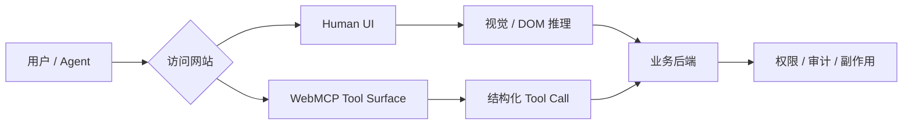

**来源**：
- [OpenAI WebMCP Challenge](https://openai.com/webmcp-challenge/)

## C. 其他值得关注

**1. Microsoft 将 Agent 成本进一步定义为“cost per successful outcome”。** Foundry 的最新工程文章把 Model Router、prompt/semantic caching、Prompt/Agent Optimizer 与 Observability 放进同一个优化闭环。对企业模型网关而言，这比单纯比较 token price 更值得借鉴：一次任务的错误路由会增加 turns、工具调用和重试，因此应按成功业务结果计价。[Microsoft Azure Blog](https://azure.microsoft.com/en-us/blog/the-economics-of-agent-optimization-four-ways-to-lower-the-cost/)

**2. NVIDIA Q2 FY2027 收入达到 962 亿美元。** 财务数字本身不是本报告重点，但它与 AWS 同日宣布的 200 万 GPU 扩张共同说明大型 AI 基础设施需求仍未明显转弱，短期 compute supply 和数据中心资本开支仍会继续影响模型成本曲线。[NVIDIA Q2 FY2027 Results](https://nvidianews.nvidia.com/news/nvidia-announces-financial-results-for-second-quarter-fiscal-2027)

**3. Hugging Face / Sentence Transformers 推出 Multi-Vector Embedding 的训练与微调工作流。** 这使 ColBERT/late-interaction 类检索思路进一步进入通用工具链，对高精度 RAG、复杂文档与 Agent Retrieval 值得观察，但当前生产成熟度与成本仍需实际评估。[Hugging Face Blog](https://huggingface.co/blog/train-multi-vector-encoder)

## D. 今日 AI 趋势总结

### 已有事实支持的趋势

**趋势 1：Flash 模型已经从“廉价备选”转成下一轮主战场。** GLM-5.3-Flash 和 Qwen3.8-Flash-Next 同日发布，都在尝试通过 MoE、Sparse/Linear Attention、Memory/Embedding 结构和更低 active params，把 Coding/Agent 能力压到更低成本区间。

**趋势 2：Agent 安全开始从 Prompt Policy 走向独立 Runtime Control。** Claude in Chrome 把 content probe 和 action classifier 分开，Compliance API 又把 MCP/tool session 纳入企业审计。安全正在成为 runtime 的独立层，而非一句 system prompt。

**趋势 3：Human UI 与 Agent Interface 正在分化。** Claude in Chrome代表“Agent 学会操作 UI”，WebMCP代表“UI 主动给 Agent 结构化接口”；两条路线最终很可能组合，而不是二选一。

**趋势 4：AI Infra 正从模型多供应商发展到 Accelerator 多供应商。** AWS/NVIDIA 的规模扩容和 Google/vLLM 的 TPU serving 都在推动 workload 从“选哪个模型”扩展为“选模型 + accelerator + region + serving stack”。

### 分析推断

**推断 1：未来模型网关更像 Workload Control Plane。** 它需要同时决定模型、硬件、上下文策略、缓存、权限、安全 gate、trace 与 cost-per-success，而不仅仅做代理转发。

**推断 2：旗舰模型未来可能更多处理“困难尾部”，Flash 模型承担默认流量。** 如果 GLM/Qwen 这类模型在真实 Agent workload 上能达到足够高的完成率，企业最经济的结构会是 Flash-first + frontier escalation，而不是所有请求默认旗舰。

**今日趋势总览**

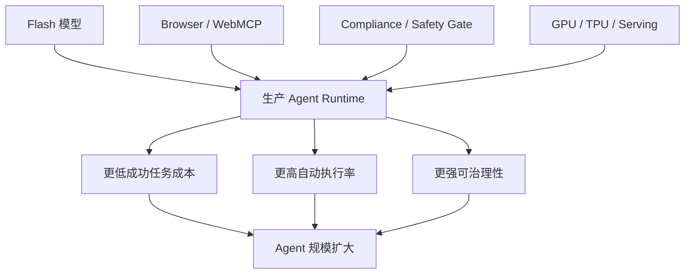

## E. 今日建议关注或采取的动作

1. **角色：AI Builder / Tech Lead｜建议动作：安排 GLM-5.3-Flash 与 Qwen3.8-Flash-Next 的同场 workload PoC。** **为什么现在做**：两款模型同时把 Flash 路线推进到 Coding/Agent 和长上下文。**动作类型：安排测试。**

2. **角色：AI Platform｜建议动作：立即确认是否仍有 Assistants API 生产依赖。** 不只检查 endpoint，也检查 `assistant_id/thread_id/run_id` 数据耦合。**为什么现在做**：官方 shutdown date 已到。**动作类型：立即执行。**

3. **角色：安全 / Tech Lead｜建议动作：为 Browser/Computer Agent 拆出独立 content gate 与 action gate。** **为什么现在做**：Claude in Chrome GA 已把这种设计正式产品化。**动作类型：检查风险。**

4. **角色：产品负责人 / 部门经理｜建议动作：把模型成本指标从 token price 升级到 cost per successful task。** 同时纳入重试、工具调用、人工补救和 wall-clock。**为什么现在做**：模型和基础设施都在围绕任务级经济性优化。**动作类型：纳入路线图。**

---

<!-- English Version -->
# AI Daily Headlines｜2026-08-27

- Language: English
- Time zone: Asia/Singapore
- News window: 2026-08-26 07:30 to 2026-08-27 07:30
- Research cutoff: 2026-08-27 10:18
- Core stories: 8
- Other notable items: 3

## A. The 3 Most Important Things Today

**1. GLM-5.3-Flash officially launched, pushing the “Flash model” category into native multimodality, Coding/Agent workloads, and open weights at the same time.** Z.ai released GLM-5.3-Flash with 320B total parameters and 18B active parameters, introducing native multimodality and a hybrid Sparse + Linear Attention architecture to the GLM-5 family, while releasing weights under the MIT License. What matters most is not Z.ai’s own benchmark claims, but the convergence of low active-parameter compute, long-context optimization, multimodality, Coding Agents, and self-deployment in one model.

**2. Qwen3.8-Flash-Next opened its weights on the same day and exposed important architectural ideas intended for Qwen4.** Qwen redesigned Attention, Residual, Embedding, and optimization together: a 125B main model is supplemented by roughly 51B of N-gram Embeddings while activating only about 6B parameters per token, and the embedding memory can be asynchronously fetched from Host Memory. GLM and Qwen independently moving toward “larger effective capacity with lower per-token compute” on the same day is a more important structural signal than any single benchmark.

**3. Claude in Chrome is now GA, moving browser agents from step-by-step human approval toward classifier-protected limited autonomy.** Anthropic opened it to every paid Claude plan and separated prompt-injection probes from an action safety classifier that checks proposed actions before execution. Because browsers remain the practical automation layer for many enterprise systems without APIs, this directly affects browser-agent architecture and security.

## B. Core Stories

### 1. GLM-5.3-Flash launches: 320B-A18B, native multimodality, open weights, and a Flash model aimed directly at Coding and Agents

- Category: Model / AI Coding / Agent
- Information status: Officially confirmed
- Published: 2026-08-26; exact time not published
- Availability: Publicly available; open weights; Z.ai API / Coding Plan available

**Fact summary**: Z.ai released GLM-5.3-Flash, the first natively multimodal model in the GLM-5 family. It has roughly 320B total parameters with about 18B activated per token, uses a hybrid Sparse Attention + Linear Attention architecture, and incorporates Manifold-Constrained Hyper-Connections (mHC). Official weights are available on Hugging Face under the MIT License with support for serving paths including SGLang, vLLM, and TokenSpeed. Z.ai also confirmed that the anonymously tested `ox-alpha` on OpenCode and OpenRouter was GLM-5.3-Flash.

**What changed versus before**: Compared with GLM-5.2, this is not merely a cheaper derivative. It is a newly trained native multimodal base model with only 18B active parameters and the first hybrid Linear + Sparse Attention design in the GLM family. Z.ai also describes IndexPool, which compresses indexer keys to reduce attention, KV-cache, and indexing overhead at very long context lengths. GLM Coding Plan users now have access, with Z.ai claiming three times the usable quota of GLM-5.3.

**Why it matters**: Flash models historically meant trading meaningful capability for cost. GLM-5.3-Flash is explicitly trying to move the boundary by targeting coding agents, tool use, visual browser work, and long-running tasks at much lower active compute. If independent workloads confirm the positioning, enterprise routing could increasingly use Flash-tier models by default and escalate only the difficult tail to frontier models.

**Practical impact**: Coding-agent and Harness teams should put GLM-5.3-Flash into repository-level PoCs immediately. Do not simply rerun Z.ai’s benchmark set; test repository coding, CLI tool use, browser/computer interaction, long-task stability, and failure recovery. Self-hosting a 320B-total-parameter model remains operationally substantial, but the 18B active footprint plus hybrid attention could materially change serving economics.

**Role perspective**:
- AI Builder: a candidate low-cost default model for Coding and Agent workloads.
- Product owner: strong task completion at this cost level could expand high-volume background agents.
- Tech Lead: validate serving maturity, long-context behavior, and tool reliability.
- Department manager: a meaningful open-weight and second-supplier candidate.

**Action to borrow**: Run 30–50 real Coding/Agent tasks against GLM-5.3-Flash and the current default model. Track task completion, number of turns, tool errors, wall-clock time, tokens, human intervention, and cost per successful task.

**Risks and uncertainty**: DeepSWE, AutomationBench, Terminal Bench, and other headline numbers are Z.ai-reported results. Scores such as 63.4 on DeepSWE v1.1 and 48.8 on AutomationBench should be treated as claims awaiting independent reproduction. The “roughly one-tenth the price of GLM-5.2” framing also needs validation against real workloads and distribution channels.

**Next signals to watch**:
1. Independent Coding/Agent and visual tool-use benchmarks;
2. Real SGLang/vLLM throughput under long context and concurrency;
3. Quantization impact on multimodality, tool use, and long-running agents.

**Mermaid diagram A: GLM-5.3-Flash efficiency path**

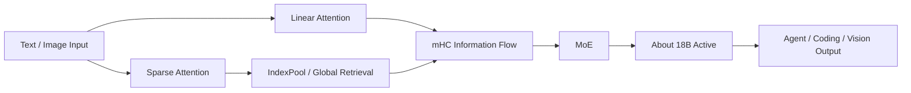

This is an engineering abstraction based on public information, not Z.ai’s complete official architecture diagram.

**Mermaid diagram B: deciding whether to make it a default Agent model**

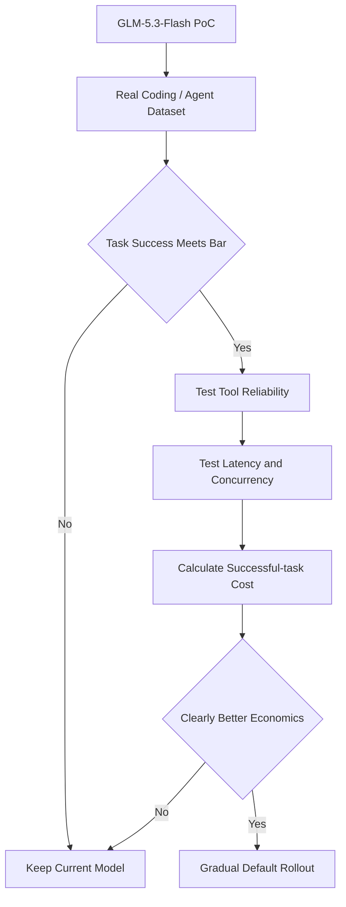

**Sources**:
- [Z.ai: GLM-5.3-Flash](https://z.ai/blog/glm-5.3-flash)
- [Official Z.ai Hugging Face model](https://huggingface.co/zai-org/GLM-5.3-Flash)
- [GLM-5.3-Flash MIT License](https://huggingface.co/zai-org/GLM-5.3-Flash/blob/main/LICENSE)

---

### 2. Qwen3.8-Flash-Next opens its weights: the Qwen4 preview combines sparse attention, N-gram memory, and Host Memory offload

- Category: Model / Infrastructure / AI Coding
- Information status: Officially confirmed
- Published: 2026-08-26; exact time not published
- Availability: Open weights on Hugging Face / ModelScope; managed QwenCloud version rolling out according to Qwen

**Fact summary**: Qwen opened Qwen3.8-Flash-Next and explicitly described it as an early architectural preview for Qwen4. The main model has roughly 125B parameters with about 6B activated per token, plus approximately 51B N-gram Embedding parameters and roughly 4B MTP parameters. Native context is 262,144 tokens and can be extended to 1,000,000 with YaRN. Qwen says its training cost is around one-ninth of Qwen3.7-Plus while improving coding and office-task capability.

**What changed versus before**: The architecture changes four layers at once. Attention combines Gated DeltaNet and Qwen Sparse Attention; Residual becomes a four-branch Gated Residual; N-gram Embedding deterministically looks up local bigram/trigram context and can live in Host Memory with asynchronous prefetching; optimization further refines Muon and AdamW roles.

**Why it matters**: Qwen shows a direction similar to GLM-5.3-Flash in objective but different in implementation: effective model capacity does not need to rise in lockstep with per-token matrix compute. Host-memory-backed N-gram Embeddings also make CPU memory, PCIe/NVLink bandwidth, and prefetch strategy first-class serving variables again.

**Practical impact**: GPU-cluster evaluations should measure more than “does the model fit?” Host Memory cooperation may affect TTFT, concurrency variance, and throughput. Qwen provides vLLM and SGLang paths, while ecosystem support is rapidly expanding around TensorRT-LLM, making the model useful for heterogeneous-memory and long-context serving experiments.

**Role perspective**:
- AI Builder: useful for coding, cowork, and long-context Agent PoCs.
- Product owner: watch whether Flash models start replacing frontier models in default flows.
- Tech Lead: benchmark Host RAM bandwidth, concurrency, TTFT, and caching behavior.
- Department manager: an important architectural signal ahead of the broader Qwen4 family.

**Action to borrow**: Test GLM-5.3-Flash and Qwen3.8-Flash-Next against the same Agent workload and compare cost per successful task rather than headline benchmark scores.

**Risks and uncertainty**: The one-ninth training-cost claim and benchmark results come from Qwen’s own testing. A 1M YaRN extension does not guarantee stable retrieval or reasoning quality over the full range, and Host Memory Offload economics depend heavily on hardware topology.

**Next signals to watch**:
1. QSA quality on real long-context agents;
2. N-gram quantization and Host Memory bandwidth;
3. How much of this architecture ships unchanged in Qwen4.

**Mermaid diagram A: capacity / compute decoupling**

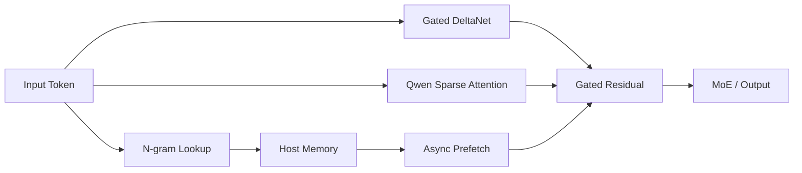

This is an engineering abstraction based on public information, not Qwen’s complete official architecture diagram.

**Mermaid diagram B: Flash-model evaluation path**

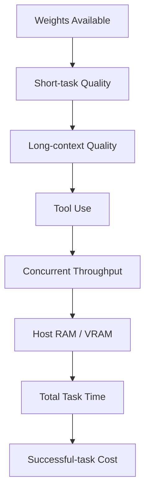

**Sources**:
- [Official Qwen3.8-Flash-Next release](https://qwen.ai/blog?id=qwen3.8-flash-next)
- [Qwen3.8-Flash-Next GitHub](https://github.com/QwenLM/Qwen3.8-Flash-Next)
- [Qwen Hugging Face](https://huggingface.co/Qwen/Qwen3.8-Flash-Next)

---

### 3. Claude in Chrome reaches GA: browser agents enter a limited-autonomy phase with web-content probes and action classifiers

- Category: Agent / Security
- Information status: Official product update
- Published: 2026-08-26
- Availability: Available on all paid Claude plans; Enterprise admins can restrict domains

**Fact summary**: Anthropic announced general availability of Claude in Chrome for every paid Claude plan. Claude can use the user’s existing login session to read pages, navigate tabs, click, type, and fill forms. The new release allows actions classified as safe to proceed automatically instead of requiring approval at every step.

**What changed versus before**: The key change is not only GA but the authorization model. Anthropic uses probes to inspect web tool results for possible prompt injection before Claude acts on them, and a separate safety classifier compares proposed actions such as navigation or entering text with the user’s original request.

**Why it matters**: Browser agents face a different security model from API agents: third parties control page content, malicious instructions coexist with real business data, and execution rights inherit the user’s authenticated permissions. Foundation-model judgment or a system prompt alone is not a sufficient security boundary. Separating “what the model reads” from “what the agent is allowed to execute” is an important production pattern.

**Practical impact**: ERP systems, vendor portals, internal dashboards, and SaaS administration surfaces without MCP or APIs become more realistic automation targets. Enterprise browser agents should treat DOM/page content as hostile tool output and independently authorize actions.

**Role perspective**:
- AI Builder: begin with read-only, drafting, and reversible browser workflows.
- Product owner: many no-API workflows now have a practical agent route.
- Tech Lead: content inspection and action authorization should be separate layers.
- Department manager: do not jump directly from browsing to autonomous high-risk submission.

**Action to borrow**: Add at least three controls to any Browser Agent: injection detection, action-to-user-intent matching, and a domain/system allowlist. Keep separate approval for financial, permission, deletion, or publishing actions.

**Risks and uncertainty**: Anthropic’s attack metrics come from its own evaluations and red-team environments. Prompt injection will continue evolving, and because the agent runs inside a user-authenticated browser, a bad action may inherit the user’s full authority.

**Next signals to watch**:
1. Action-level rather than domain-level enterprise policy;
2. Prompt-injection incident rates in real deployments;
3. Unified audit and task state across Chrome, Cowork, and Claude Code.

**Mermaid diagram A: layered browser-agent safety**

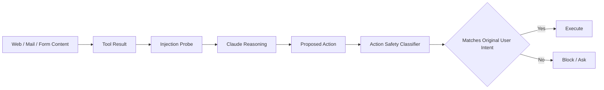

**Mermaid diagram B: enterprise browser-agent permission ladder**

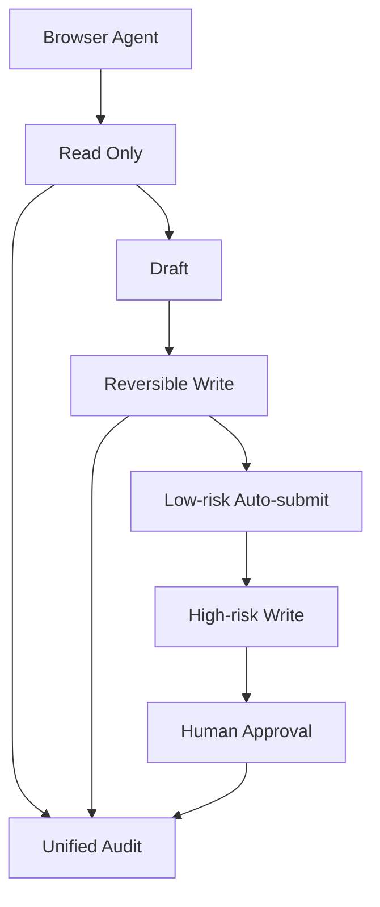

**Source**:
- [Anthropic: Claude in Chrome is generally available](https://claude.com/blog/claude-in-chrome-generally-available)

---

### 4. OpenAI Assistants API reaches its shutdown date: Assistant / Thread / Run gives way to Responses / Conversations

- Category: Agent / Infrastructure
- Information status: Officially confirmed
- Published: Official shutdown date 2026-08-26
- Availability: Assistants API shut down; Responses API + Conversations API are the recommended replacement

**Fact summary**: OpenAI’s Deprecations documentation lists 2026-08-26 as the shutdown date for the Assistants API and recommends Responses API plus Conversations API. The official Migration Guide maps `Assistants → Prompts`, `Threads → Conversations`, `Runs → Responses`, and `Run steps → Items`.

**What changed versus before**: For the past year this was a future migration requirement; within this news window it became an active lifecycle event. Responses separates orchestration, tool loops, conversation state, and prompt configuration more explicitly, while supporting newer capabilities such as MCP, computer use, and deep research.

**Why it matters**: API shutdown risk is more immediate than most benchmark news. Existing systems may deeply couple `assistant_id`, `thread_id`, `run_id`, files, vector stores, and business records. Migration is therefore not merely replacing an endpoint but remapping state, tool loops, error handling, and observability.

**Practical impact**: Any remaining Assistants API dependency should be treated as a business-continuity risk. New agent systems should minimize deep domain coupling to provider-specific persistent objects and retain business state in application-controlled models.

**Role perspective**:
- AI Builder: stop creating new Assistants integrations.
- Product owner: verify history and file migration behavior.
- Tech Lead: validate state, tool calls, retries, and tracing separately.
- Department manager: raise the risk level of production systems that have not migrated.

**Action to borrow**: Search repositories for `assistant_id`, `thread_id`, `run_id`, and `/v1/assistants`, then replay critical sessions through Responses/Conversations and compare behavior.

**Risks and uncertainty**: Feature parity does not guarantee identical business semantics; systems deeply coupled to Threads, Runs, or Files may need additional migration engineering.

**Next signals to watch**:
1. Actual error behavior from legacy endpoints;
2. Further convergence of Conversations and Agents SDK;
3. Additional enterprise migration tooling.

**Mermaid diagram**


**Sources**:
- [OpenAI API Deprecations](https://developers.openai.com/api/docs/deprecations)
- [OpenAI Assistants Migration Guide](https://developers.openai.com/api/docs/assistants/migration)

---

### 5. AWS and NVIDIA add another 2 million GPUs: infrastructure collaboration expands from GPU instances into a full AI Factory stack

- Category: Infrastructure / Policy & Industry
- Information status: Officially confirmed
- Published: 2026-08-26
- Availability: Future deployment plan, mainly phased across 2027–2028

**Fact summary**: AWS and NVIDIA announced plans for 2 million additional NVIDIA GPUs across AWS infrastructure, including Blackwell Ultra, Rubin, and Rubin Ultra, while expanding work around Vera CPU, Spectrum networking, NVLink Fusion, Nemotron, GPU-accelerated data processing, vector indexing, and physical AI. The companies also plan a secure U.S. government AI Factory involving 100,000 GPUs.

**What changed versus before**: AWS had previously announced plans for more than 1 million additional NVIDIA GPUs. The new commitment adds another 2 million and broadens the collaboration from accelerators into CPUs, interconnects, data processing, models, vector indexing, and robotics.

**Why it matters**: Agent pricing, capacity, tail latency, and regional availability ultimately depend on compute supply. Lower-cost Flash models and million-GPU cloud expansion are two sides of the same cost curve: software reduces compute per successful task while infrastructure increases total supply.

**Practical impact**: Supplier risk should include underlying cloud and accelerator dependencies, not only API SLA. Long-lived workloads should track region, accelerator generation, failover, and data-residency choices.

**Role perspective**:
- AI Builder: near-term code impact is limited, but serving options will expand.
- Tech Lead: avoid over-coupling to one accelerator SKU.
- Department manager: 6–18 month AI budgets should track compute supply as well as model pricing.

**Action to borrow**: Add underlying accelerator, region capacity, secondary runtime, and data-residency fields to model/infrastructure supplier scorecards.

**Risks and uncertainty**: Two million GPUs is a deployment commitment, not currently consumable capacity. Data-center construction, power, networking, and delivery schedules can change rollout timing.

**Next signals to watch**:
1. AWS GA timing for Rubin instances;
2. Agent-serving TCO for Vera CPU + GPU systems;
3. Further Bedrock integration of Nemotron and physical-AI tooling.

**Mermaid diagram**

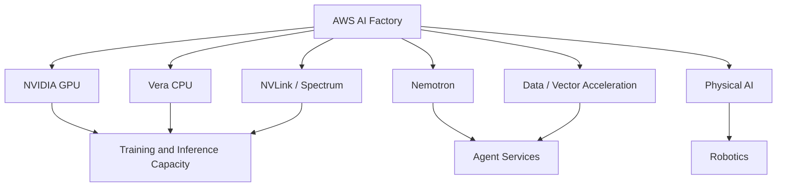

**Sources**:
- [AWS official announcement](https://press.aboutamazon.com/aws/2026/8/aws-and-nvidia-to-deliver-2-million-additional-gpus-and-next-generation-infrastructure-for-agentic-and-physical-ai)
- [NVIDIA official announcement](https://nvidianews.nvidia.com/news/aws-and-nvidia-to-deliver-2-million-additional-gpus-and-next-generation-infrastructure-for-agentic-and-physical-ai)

---

### 6. Claude Code / Cowork Compliance API coverage becomes GA, extending enterprise audit to prompts, MCP tool calls, and complete agent sessions

- Category: AI Coding / Security
- Information status: Official product update
- Published: Updated 2026-08-26
- Availability: Claude Code CLI/Desktop and Cowork coverage are GA; some other channels remain limited

**Fact summary**: Anthropic upgraded Compliance API coverage for Claude Code CLI/Desktop and Cowork desktop/web/mobile from beta to GA. Enterprises can retrieve session transcripts and metadata including prompts, responses, web/MCP tool calls, skills/artifacts content, user identity, organization IDs, session/message IDs, and timestamps.

**What changed versus before**: Enterprises previously had to combine ordinary Claude compliance records, Coding Agent logs, and OpenTelemetry separately. Claude Code tool activity can now enter the same enterprise Compliance data path as regular Claude sessions.

**Why it matters**: A coding agent that reads repositories, runs shell commands, connects to MCP, and changes code functions like privileged developer tooling. Enterprises need to answer not only “what did the user ask?” but “what tools did the agent invoke, and what code change did it produce?”

**Practical impact**: Governance friction for broad Claude Code deployment is reduced. SIEM, eDiscovery, investigation, and DLP pipelines can gain a unified source, though transcript data itself may contain source code, secrets, and business data and therefore needs its own retention policy.

**Role perspective**:
- AI Builder: tool calls will increasingly become durable enterprise audit records.
- Tech Lead: connect session IDs to Git commits, CI runs, and MCP gateway traces.
- Department manager: audit visibility is becoming an enabling control rather than a missing blocker.

**Action to borrow**: Run a one-week trace-correlation exercise and verify whether `User → Session → MCP/Shell → Repo Change → CI` can be reconstructed end-to-end.

**Risks and uncertainty**: Coverage is not identical across all access channels, especially some web and cloud-provider routes.

**Next signals to watch**:
1. Policy enforcement beyond after-the-fact logging;
2. More structured MCP tool-call fields;
3. Consistent support across Bedrock / Vertex / Foundry paths.

**Mermaid diagram**

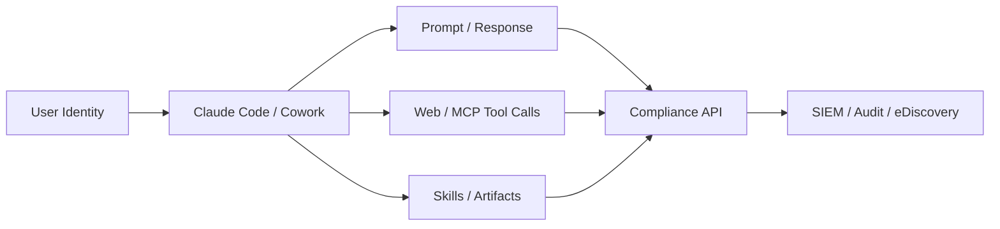

**Source**:
- [Anthropic Compliance API Update](https://claude.com/blog/compliance-api-cowork-and-claude-code)

---

### 7. Google pushes native vLLM TPU serving into long-context embeddings, moving RAG infrastructure toward XPU portability

- Category: Infrastructure / Model Deployment
- Information status: Official product update
- Published: 2026-08-26
- Availability: Publicly usable; recipes are open source

**Fact summary**: Google Cloud described native vLLM TPU support and specialized engineering for long-context embedding workloads including Qwen3-Embedding-8B and Qwen3-VL-Embedding-8B. The work includes tensor alignment, JAX/XLA compilation pre-warming, hardened lazy loading, and StepPool / CachedRequestState for chunked-prefill pooling.

**What changed versus before**: vLLM is widely associated with GPU text generation. Google is extending the same serving abstraction toward TPU, embeddings, multimodality, and GKE accelerator fallback.

**Why it matters**: Embeddings remain a major cost layer for RAG, Agent Memory, recommendations, and semantic search. If serving can preserve vector parity across TPU/GPU, enterprises gain accelerator routing as another cost and capacity lever.

**Practical impact**: Large-scale RAG teams should create cross-XPU embedding parity tests. Google uses ≥0.999 cosine similarity for text and ≥0.995 for multimodal as its validation thresholds, but enterprises should still validate Recall@K against their own ANN indexes.

**Role perspective**:
- AI Builder: accelerator selection can move further out of application logic.
- Tech Lead: establish an embedding golden set and parity gate.
- Department manager: include TPU/GPU competition in retrieval economics.

**Action to borrow**: Recompute 10K–50K production embeddings on GPU and TPU vLLM, comparing cosine similarity, Recall@K, throughput, P95 latency, and total cost.

**Risks and uncertainty**: Google’s throughput and parity results are specific to its test setup; models, batching, quantization, and real traffic can change the outcome materially.

**Next signals to watch**:
1. More embedding/reranker support on TPU vLLM;
2. Production cold-start cost of accelerator fallback;
3. General-purpose XPU-aware inference routing.

**Source**:
- [Google Developers Blog](https://developers.googleblog.com/enterprise-grade-precision-for-long-context-multimodal-embedding-inference-on-cloud-tpu/)

---

### 8. OpenAI pushes WebMCP into hands-on development: websites begin exposing structured Agent tools instead of forcing Browser Agents to guess the UI

- Category: MCP / Agent / Infrastructure
- Information status: Officially confirmed
- Published: approximately 2026-08-26 03:00 Asia/Singapore; official opening time was 2026-08-25 12:00 PT
- Availability: Experimental open standard; supported for testing in ChatGPT’s in-app browser

**Fact summary**: OpenAI launched the WebMCP Challenge with ecosystem participation from Chrome, Cloudflare, Shopify, Vercel, Netlify, Render, and others. WebMCP lets websites expose structured tools directly to agents rather than relying exclusively on DOM reasoning, visual grounding, and mouse simulation. ChatGPT’s in-app browser supports WebMCP testing, and Chrome offers experimental paths.

**What changed versus before**: Traditional MCP is largely an Agent-to-server tool protocol. WebMCP brings a similar tool contract directly into the webpage. A product may eventually maintain both a Human UI and an Agent Action Surface.

**Why it matters**: Pure visual browser automation is fragile. Structured web tools could improve agent reliability and token efficiency. Over time, agent-native web design may resemble API-first design: high-value actions become explicitly machine-consumable.

**Practical impact**: Web product teams can start treating tool schemas, permissions, idempotency, confirmation, auditability, and rate limits as part of frontend product architecture rather than only backend API design.

**Role perspective**:
- AI Builder: good candidate for small internal WebMCP experiments.
- Product owner: identify product actions that deserve an agent-native interface.
- Tech Lead: WebMCP tools must not bypass backend authorization.
- Department manager: early standard—experiment, but do not lock in yet.

**Action to borrow**: Pick an internal web app with only 3–5 major operations and implement both Browser Use and WebMCP paths. Compare completion rate, token usage, P95 duration, and recovery behavior.

**Risks and uncertainty**: WebMCP remains experimental. Browser support, identity, and permission conventions may change. Structured tools make agents more reliable, including at reliably executing a wrongly authorized action.

**Next signals to watch**:
1. Chrome stable-channel adoption;
2. Framework-level support from Vercel/Cloudflare/Shopify;
3. OAuth, identity, and audit alignment with conventional MCP.

**Mermaid diagram**

```mermaid
flowchart LR
    W1[User / Agent] --> W2{Open Website}
    W2 --> W3[Human UI]
    W2 --> W4[WebMCP Tool Surface]
    W3 --> W5[Visual / DOM Reasoning]
    W4 --> W6[Structured Tool Call]
    W5 --> W7[Business Backend]
    W6 --> W7
    W7 --> W8[Permission / Audit / Side Effect]
```

**Source**:
- [OpenAI WebMCP Challenge](https://openai.com/webmcp-challenge/)

## C. Other Notable Items

**1. Microsoft is explicitly defining Agent economics around “cost per successful outcome.”** Its latest Foundry guidance connects Model Router, prompt/semantic caching, Prompt/Agent Optimizer, and Observability in one optimization loop. For enterprise gateways, the important lesson is that bad routing increases turns, tool calls, and retries, so token price alone is insufficient. Source: [Microsoft Azure Blog](https://azure.microsoft.com/en-us/blog/the-economics-of-agent-optimization-four-ways-to-lower-the-cost/).

**2. NVIDIA reported Q2 FY2027 revenue of $96.2 billion.** The financial number itself is not the central topic here, but combined with the same-day AWS plan for another 2 million GPUs, it suggests that large-scale AI infrastructure demand remains strong enough to sustain very high capital expenditure. Source: [NVIDIA Q2 FY2027 Results](https://nvidianews.nvidia.com/news/nvidia-announces-financial-results-for-second-quarter-fiscal-2027).

**3. Hugging Face / Sentence Transformers added training and fine-tuning workflows for multi-vector embedding models.** This moves late-interaction retrieval further into mainstream tooling and is worth watching for complex-document and high-precision Agent Retrieval, though deployment cost and maturity still need practical validation. Source: [Hugging Face Blog](https://huggingface.co/blog/train-multi-vector-encoder).

## D. AI Trend Summary

### Trends supported by current facts

**Trend 1: Flash models have moved from “cheap alternatives” into the main frontier competition.** GLM-5.3-Flash and Qwen3.8-Flash-Next both aim to bring Coding/Agent and long-context capability into a much lower active-compute regime.

**Trend 2: Agent security is moving from prompt policy to independent runtime controls.** Claude in Chrome separates content probes from action classifiers, while the Compliance API brings MCP/tool sessions into enterprise audit.

**Trend 3: Human UI and Agent interfaces are beginning to diverge.** Claude in Chrome represents the “agent learns the UI” route; WebMCP represents the “UI exposes structured tools” route. The two are more likely to converge than to remain competing alternatives.

**Trend 4: AI infrastructure is moving from model multi-sourcing toward accelerator multi-sourcing.** AWS/NVIDIA expansion and Google/vLLM TPU serving both push platforms toward choosing not just a model, but a model + accelerator + region + serving stack.

### Analytical inference

**Inference 1: Model gateways are likely to become Workload Control Planes.** They will increasingly decide model, hardware, context strategy, caching, permissions, safety gates, traces, and cost-per-success rather than simply proxying APIs.

**Inference 2: Frontier models may increasingly serve only the “hard tail,” while Flash models absorb default traffic.** If GLM/Qwen-style models maintain sufficient completion rates on real agent workloads, the economically rational architecture becomes Flash-first with frontier escalation.

**Trend overview**

```mermaid
flowchart TD
    T1[Flash Models] --> T5[Production Agent Runtime]
    T2[Browser / WebMCP] --> T5
    T3[Compliance / Safety Gate] --> T5
    T4[GPU / TPU / Serving] --> T5
    T5 --> T6[Lower Successful-task Cost]
    T5 --> T7[Higher Automation Rate]
    T5 --> T8[Stronger Governance]
    T6 --> T9[Agent Scale]
    T7 --> T9
    T8 --> T9
```

## E. Actions to Consider Today

1. **Role: AI Builder / Tech Lead | Action: schedule a head-to-head GLM-5.3-Flash vs Qwen3.8-Flash-Next workload PoC.** **Why now**: both models push Flash architecture into Coding/Agent and long-context territory. **Action type: Schedule a test.**

2. **Role: AI Platform | Action: immediately confirm whether any production system still depends on Assistants API.** Check not only endpoints but data coupling around `assistant_id`, `thread_id`, and `run_id`. **Why now**: the official shutdown date has arrived. **Action type: Execute now.**

3. **Role: Security / Tech Lead | Action: split Browser/Computer Agent security into separate content and action gates.** **Why now**: Claude in Chrome GA has productized this architecture. **Action type: Risk review.**

4. **Role: Product owner / Department manager | Action: upgrade model cost metrics from token price to cost per successful task.** Include retries, tool calls, human remediation, and wall-clock time. **Why now**: both model architecture and infrastructure optimization are converging on task-level economics. **Action type: Add to roadmap.**
