<!-- 中文版 -->
# AI 今日头条｜2026 年 08 月 29 日

- 语言：中文
- 时区：Asia/Singapore
- 新闻窗口：2026-08-28 07:30 至 2026-08-29 07:30
- 实际检索截止时间：2026-08-29 08:00
- 本期核心新闻：8 条
- 其他值得关注：3 条

## A. 今日最重要的 3 件事

**1. GLM-5.3 正式开放权重，8 月 14 日发布时承诺的“两周安全评估后开放”已经兑现。** 这次的新增不是模型本身首次亮相，而是 744B 总参数、约 40B 激活参数的旗舰 Coding / Agent 模型现在可以真正下载、自部署、量化和定制；官方同时给出了 vLLM、SGLang、Transformers、KTransformers、Unsloth 与 Ascend 等部署路线。对于模型网关和企业 Harness 来说，GLM-5.3 从“可调用的供应商模型”变成了“可以进入内部模型供应链的开放权重模型”。

**2. 腾讯发布并开源 Hy4 preview：770B 总参数、49B 激活、1M 上下文，直接瞄准 Coding、办公、研究与 Agent 工作流。** 它采用 Gated DeepSeek Sparse Attention、IndexCache、iHC 和大规模 MoE，并以 Apache 2.0 发布，API 价格也已同步公布。GLM-5.3 权重开放与 Hy4 preview 同一天出现，意味着高能力中国开放模型在“旗舰能力 + 长上下文 + Agent + 可私有部署”这一层的竞争明显升温。

**3. Claude Code 2.1.251 同一天强化模型切换、Prompt Cache 成本可观测性，并一次修复多项权限边界漏洞。** 新增的 `PreModelSwitch` / `PostModelSwitch` Hooks 使 Harness 可以阻止、确认或标注模型切换，同时 `/cost` 开始暴露每 Session 的 Prompt Cache 命中、Miss 和重新缓存 token；更重要的是，本次还修复 symlink 权限竞态、插件路径穿越、受管 tracing 绕过等问题。Coding Agent 的治理正在从“允许哪些工具”推进到“哪个模型、什么缓存状态、什么路径、什么数据出口都可被 Runtime Policy 控制”。

## B. 新闻正文

### 1. GLM-5.3 正式开放权重：旗舰 Coding / Cyber Agent 模型从 API 服务进入可自部署阶段

- 类别：模型 / AI 编程 / Agent / 安全
- 信息状态：官方已确认
- 发布时间：2026-08-28；官方未公布准确时间，权重在本期新闻窗口内上线
- 可用状态：已公开可用；开放权重；支持本地及私有部署

**事实摘要**：Z.ai 已在官方 Hugging Face 组织下正式开放 `zai-org/GLM-5.3` 权重。GLM-5.3 于 8 月 14 日首次发布，当时 Z.ai 明确表示由于模型出现超出预期的网络安全能力，需要增加约两周安全评估后再开放权重；本期这一状态发生实质变化——模型现在可以下载、部署和定制。GLM-5.3 使用与 GLM-5.2 相同的基础模型，属于约 744B 总参数、40B 激活参数的 MoE 路线，核心能力提升来自扩大 Post-training。

官方模型页已经给出 Transformers、vLLM、SGLang、TokenSpeed、KTransformers、Unsloth 等部署路径，并列出 Ascend NPU 的 vLLM-Ascend、xLLM、SGLang 支持。模型采用独立的 `GLM-5.3 License`，不应与 GLM-5.3-Flash 的 MIT License 混淆。

**相较此前的变化**：8 月 14 日 GLM-5.3 已经可通过 Z.ai、Coding Plan 和 API 使用，因此“模型发布”本身不是今天的新事件。**此前已知**：GLM-5.3 在复杂 Coding、Long-horizon Agent 和 Cyber benchmark 上相较 GLM-5.2 显著提升。**今日新增**：权重正式开放，企业和社区可以自行运行、量化、修改 Serving 栈并将其接入自有 Harness。

这一区别很重要。API 可用意味着模型仍受供应商容量、价格、日志和服务政策约束；开放权重则允许企业把模型放进自己的安全域、推理基础设施和模型网关，并自主决定缓存、量化、路由、审计和升级节奏。

**为什么重要**：GLM-5.3 最值得关注的并不只是 Coding benchmark，而是它同时拥有长任务、工具使用和较强 Cyber 能力。Z.ai 自报其 CyberGym 达到 84.5，并公开说明模型在扩大 Post-training 后出现了比预期更快增长的漏洞发现与 exploitation 能力，因此才延后开放权重。

这意味着模型治理不能再简单分成“闭源模型安全 / 开源模型不安全”。真正需要回答的是：一个拥有高权限 Shell、网络和代码仓库访问的高能力开放模型，在你的 Harness 中究竟拥有哪些 Capability。

**实际影响**：对于已有多模型网关或内部 Coding Agent 的团队，GLM-5.3 值得加入 PoC，但建议将“模型能力测试”和“运行安全测试”并行进行。不要只跑 SWE / Terminal benchmark；还应测试 Repo 权限、Shell 命令、网络出口、Package 安装、Secret Access、MCP Tool Use 和长任务偏航。

从部署角度看，744B 级总参数仍意味着完整精度部署成本很高，但 Day-0 的 vLLM / SGLang / Unsloth 路线会迅速降低试验门槛。对于无法承载旗舰权重的团队，API 或 GLM-5.3-Flash 仍可能是更经济的默认路线。

**角色视角**：
- AI Builder：可把 GLM-5.3 纳入 Coding Agent / Long-horizon Agent 对比测试。
- 产品负责人：开放权重降低供应商锁定，但不会自动降低完整 TCO。
- Tech Lead：必须同时验证 Model Quality、Serving TCO 和 Capability Security。
- 部门经理：如果内部有数据驻留或模型可控性要求，这是一个重要新候选。

**可借鉴动作**：建立一个独立的“高能力开放模型准入测试”。除普通 Agent benchmark 外，再加入网络访问、文件系统越界、权限升级、恶意仓库内容、Prompt Injection、Secret Retrieval 和 Package Supply Chain 测试；通过后才进入内部模型目录。

**风险与不确定性**：Z.ai 的大部分 Coding / Cyber benchmark 仍属于厂商提供或厂商配置的评测，即使部分 benchmark 有独立 verifier，也不能直接等同于你的生产 workload。开放权重后还会快速出现各种量化和衍生版本，量化模型的工具使用、长上下文和安全行为可能与官方权重不同。

**下一步观察**：
1. GLM-5.3 在独立 Agentic Coding benchmark 上的复现情况；
2. FP8 / GGUF / 低比特量化后的任务成功率和 Cyber 能力变化；
3. 企业对 `GLM-5.3 License` 的法务和商业使用解读。

**Mermaid 图示 A：从 API 模型变成开放权重模型后的控制边界**

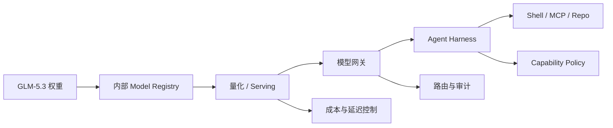

以上为企业部署分析抽象，不代表 Z.ai 官方架构。

**Mermaid 图示 B：开放模型准入流程**

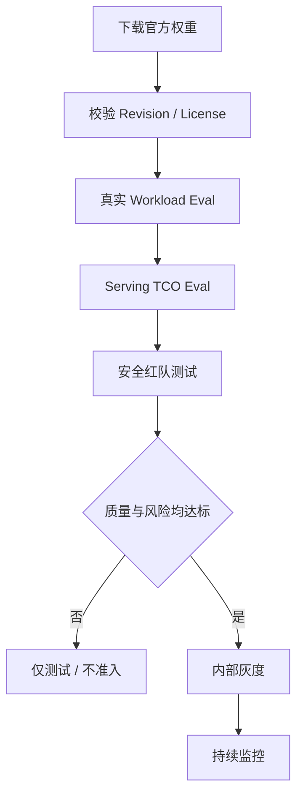

**来源**：
- [Z.ai：GLM-5.3 技术发布](https://z.ai/blog/glm-5.3)
- [Z.ai 官方 GLM-5.3 Hugging Face 模型页](https://huggingface.co/zai-org/GLM-5.3)

---

### 2. 腾讯发布 Hy4 preview：770B-A49B、1M 上下文与 Apache 2.0，开放旗舰模型竞争再升一级

- 类别：模型 / AI 编程 / Agent / 基础设施
- 信息状态：官方已确认
- 发布时间：2026-08-28；未公布准确时间
- 可用状态：已公开可用；开放权重；API / WorkBuddy / CodeBuddy 等渠道可用

**事实摘要**：腾讯发布并开源 Hy4 preview。官方参数为 770B 总参数、49B 每 token 激活参数、78 层、1M 上下文。第一层使用 Dense FFN，其余 77 层使用 MoE；每个 MoE 层包含 256 个 Routed Experts 和 1 个 Shared Expert，每 token 选择 Top-8 Routed Experts。模型另带 1 个 Native MTP 层用于 Speculative Decoding。

Attention 使用 Gated DeepSeek Sparse Attention，并以 IndexCache 在层间复用 Sparse Index；Residual 路线使用 iHC。完整和 FP8 权重已经在 Hugging Face、ModelScope 等发布，License 为 Apache 2.0，并支持 vLLM、SGLang 与 OpenAI-compatible API。

**相较此前的变化**：Hy3 已经证明腾讯正在把 Hunyuan 系列转向更明确的开放 Agent / Coding 路线，而 Hy4 preview 将规模、长上下文和 Post-training 再明显提升。今天的新变化不是一个实验 checkpoint，而是完整权重、FP8 权重、API、Coding 产品接入和价格同时给出。

腾讯还公布 API 价格：每百万输入 token 0.834 美元、输出 token 2.501 美元、Cache Hit 0.042 美元。WorkBuddy 与 CodeBuddy 在发布后提供两周免费体验。

**为什么重要**：过去开放模型竞争经常分成两类：较小模型追求低成本，旗舰模型追求能力。Hy4 与 GLM-5.3 同一天进入开放权重状态，让“旗舰 Agent 模型也应该可自部署”这一选择变得更现实。

从架构上看，Hy4 继续强化一个越来越清晰的趋势：MoE 解决 Dense Compute，Sparse Attention 解决 Long Context，而 MTP / Speculative Decoding 解决 Decode Throughput。这三个层面正在同时优化，而不是单纯扩参数。

**实际影响**：对企业平台来说，Hy4 preview 可以进入与 GLM-5.3、Qwen、DeepSeek、Kimi 的统一 Agent workload benchmark。建议特别测试长仓库 Coding、多文件办公、跨文档分析和 Research Agent，因为这正是腾讯重点优化的场景。

腾讯还称 Hy4 曾参与自身训练策略、数据、评测和低层 Operator 的自动优化，并将推理系统端到端吞吐相对基线提高 31.8%。这是很有意思的 AI-native Engineering 信号，但目前仍属于腾讯自报结果，应视作需要独立复现的工程案例，而不是通用“自我改进”结论。

**角色视角**：
- AI Builder：值得测试 Coding、Research 和复杂 Office Agent。
- 产品负责人：公开 API 定价使成功任务成本可以直接与现有供应商比较。
- Tech Lead：可测试 Apache 2.0 权重、自部署和多推理引擎支持。
- 部门经理：开放旗舰供应商数量增加，有利于降低单一模型依赖。

**可借鉴动作**：不要再按“模型品牌”做 PoC，而是建立一个供应商无关的 Agent Eval Harness，将 GLM-5.3、Hy4、Qwen、DeepSeek、Kimi 与当前闭源主模型统一跑在同一个任务、工具和成功标准上。

**风险与不确定性**：Hy4 仍明确标记为 preview，腾讯官方也承认存在 reasoning 时间过长、过度验证等已知问题。腾讯内部 163 名专家、203 个工程任务的盲测属于内部评测；31.8% 推理吞吐提升同样是内部基线结果。

**下一步观察**：
1. Hy4 正式版相较 preview 的模型与 License 变化；
2. SGLang / vLLM 在 1M 上下文上的真实并发成本；
3. 第三方 Coding / Research / Office Agent workload 结果。

**Mermaid 图示 A：Hy4 主要架构路径**

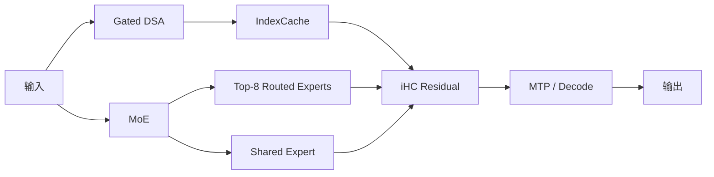

以上为基于公开规格的简化解释，不代表腾讯完整官方计算图。

**Mermaid 图示 B：开放模型横向评测**

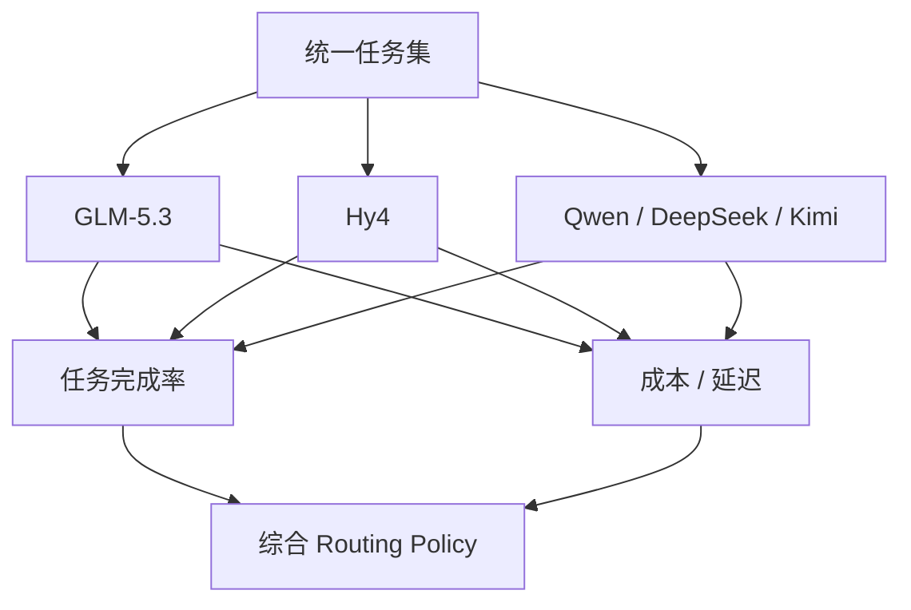

**来源**：
- [Tencent 官方发布](https://www.tencent.com/tencent-releases-and-open-sources-tencent-hy4-preview/)
- [Tencent Hy4 preview 官方 GitHub](https://github.com/Tencent-Hunyuan/Hy4-preview)

---

### 3. Claude Code 2.1.251：模型切换 Hooks、Prompt Cache 成本指标与多项权限边界安全修复同时落地

- 类别：AI 编程 / Harness / 安全 / 成本治理
- 信息状态：官方产品更新
- 发布时间：2026-08-28；未公布准确时间
- 可用状态：已公开可用；CLI 更新

**事实摘要**：Claude Code 2.1.251 新增 `PreModelSwitch` 与 `PostModelSwitch` Hook。Harness 可以在模型切换发生前阻止、请求确认或添加上下文，并在切换后响应；Resume Session 的 `SessionStart` Hook 还会收到 Session Staleness 和预计 Prompt Re-cache 成本。

成本可观测性也明显增强：`/usage` 新增 Spend Limit Bar，`/cost` 增加 Session 级 Prompt Cache 信息，包括 Hit Ratio、Miss、重新缓存 token、Warm / Cold 状态，同时向 Status Line Script 暴露对应结构化对象。

**相较此前的变化**：以往模型切换更多是用户 / CLI 自己的 UI 行为，本次开始成为可由 Harness 拦截的事件。这对多模型企业环境很重要：例如一个组织可以在高价模型切换前检查 Budget、Data Classification 或任务类型，而不是只依赖用户手动选择。

更值得关注的是此次安全修复。官方列出了多项权限边界问题，包括：
- 文件工具在权限检查后若工作目录内 symlink 被交换，可能读取或写入批准目录之外；
- Plugin Marketplace 中声明的命令路径可能指向插件目录之外，现已阻止路径穿越；
- Project Settings 曾可能开启详细 Beta Tracing / Raw API Body Logging，并绕过 Managed Settings 固定的 OTLP Collector；
- Workflow 的 `scriptPath` 曾可能在权限校验前读取；
- Grep / Glob 通过 symlink 搜索路径时没有正确应用 `Read(...)` Deny Rules。

**为什么重要**：这些不是“普通 CLI Bug”。它们都指向 Agent Harness 最困难的一层：模型权限并不是一个静态 Allow/Deny 表，而是文件路径、symlink、Plugin、Telemetry、Model Switch 和 Session Resume 共同组成的动态系统。

同时，Prompt Cache 正逐渐从供应商内部优化变成 Agent FinOps 指标。如果切换模型、恢复旧 Session 或改变 Context 会导致大规模重新缓存，模型价格相同的两个工作流也可能有完全不同的实际 TCO。

**实际影响**：运行 Claude Code 的企业应该尽快升级，并重新检查自己的 Hooks 和 Managed Settings。拥有 Model Gateway 的团队则可以利用 `PreModelSwitch` 建立集中 Policy，例如限制特定仓库只能使用企业批准模型，或者在高成本模型前要求业务原因。

**角色视角**：
- AI Builder：Prompt Cache 终于可以在任务级成本分析中直接看到。
- Tech Lead：本次安全修复值得作为升级优先项，而非普通功能升级。
- 产品负责人：模型自动路由与成本控制可以有更清晰 UX。
- 部门经理：可以把“用户选了什么模型”纳入治理和预算审计。

**可借鉴动作**：升级后在 `PreModelSwitch` Hook 中记录 `task/session → source model → target model → reason → estimated recache cost`，并将 `/cost` 的 Cache 指标与最终任务成功率一起送入 Observability。

**风险与不确定性**：Hook 能控制 Claude Code 内发生的模型切换，但不代表所有外部 Gateway / SDK 行为都会经过同一 Hook。安全修复也说明过去版本确实存在边界问题，因此受影响版本较旧的高权限开发环境应优先升级。

**下一步观察**：
1. Model Switch Hooks 是否进一步支持组织级 centrally managed policy；
2. Prompt Cache 指标是否进入 OpenTelemetry；
3. Claude Code 是否提供更正式的 per-task Cost / Quality Routing。

**Mermaid 图示 A：模型切换变成 Policy Event**

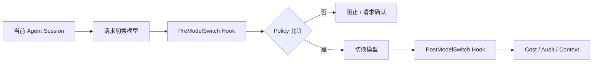

**Mermaid 图示 B：Claude Code 成本链**

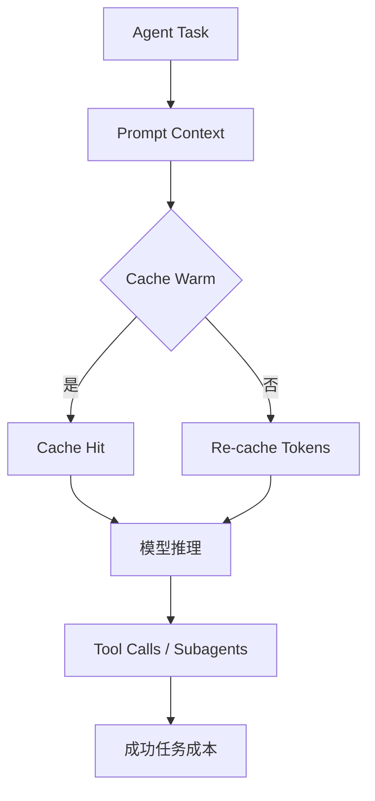

**来源**：
- [Claude Code 官方 Changelog](https://code.claude.com/docs/en/changelog)

---

### 4. GitHub Copilot 调整企业 Billing 与统一 Agent Policy：github.com Chat 数据保留期将从 28 天变为账户生命周期

- 类别：AI 编程 / Agent / 安全 / 成本治理
- 信息状态：官方产品更新
- 发布时间：2026-08-28；未公布准确时间
- 可用状态：已公告；不同变化将在 2026-09-01、2026-09-28 及 2026-10-01 起生效

**事实摘要**：GitHub 公布三组即将生效的 Copilot 变化。9 月 1 日起，将逐步恢复信用卡 / PayPal 支付的新 Copilot Business 和 Enterprise 注册，并强化 Account Vetting；新增企业 Seat 必须先支付后获得访问。现有此类客户的 Assigned Seat Upfront Billing 将从 10 月 1 日起生效，Copilot Business / Enterprise 单价本身不变。

不早于 9 月 28 日，Copilot Chat on github.com、GitHub Mobile 和 Copilot Cloud Agent 将统一成一套 Copilot Experience 和 Policy，并默认开启。

**相较此前的变化**：最值得注意的不是界面合并，而是数据与治理边界变化。github.com 上 Copilot 将全面迁移到 Agent Sessions Experience，Chat Data 的保留期从 **28 天**调整为**账户生命周期**，与 Cloud Agent 对齐。如果企业主动退出统一 Experience，则 github.com 与 Mobile 上的 Copilot 将不可用。

GitHub 还会在 9 月 28 日将 Copilot Code Review 的默认 Effort 从 Lite 改为 Balanced；希望保留 Lite 的组织需要显式设置。

**为什么重要**：Coding Agent 产品正在从多个独立功能整合成“持续 Session Runtime”，而数据保留、权限与 Billing 也随之统一。对于受监管组织而言，“同一个 Copilot”在改版前后可能拥有完全不同的 Retention 和 Agent Execution 语义。

这也是一个典型例子：AI 产品升级并不只发生在模型层。Retention Policy、Seat Billing 和 Default Review Effort 都可能影响合规、成本和组织使用模式。

**实际影响**：企业管理员应在 9 月 28 日前完成 Policy Review，尤其检查数据留存要求。如果内部政策要求短期 Chat Retention，不能假设旧的 28 天机制继续有效。预算团队还应确认 Seat Billing 与 Additional Usage Spend Controls。

**角色视角**：
- AI Builder：功能行为基本不会马上破坏代码，但 Agent Session 会更统一。
- Tech Lead：需重新检查数据治理和默认 Code Review Effort。
- 部门经理：Seat 成本和额外 Usage 需要纳入预算控制。
- 安全 / 合规负责人：Chat Retention 是必须主动复核的配置变化。

**可借鉴动作**：在 9 月 28 日之前建立一张 Copilot Policy Checklist：Unified Experience、Chat Retention、Cloud Agent、Code Review Effort、Seat Assignment、Additional Usage、Spend Limit，并由 Engineering + Security + Procurement 联合确认。

**风险与不确定性**：这些是未来生效时间，不是所有行为今天已经改变。GitHub 明确使用“不早于 9 月 28 日”的措辞，因此具体上线日仍可能变化。

**下一步观察**：
1. Unified Copilot Experience 的最终 GA 日期；
2. 企业是否获得更细粒度 Retention 控制；
3. Balanced Code Review 对 Premium Usage / 成本的实际影响。

**Mermaid 图示**


**来源**：
- [GitHub：Upcoming changes to GitHub Copilot policies and billing](https://github.blog/changelog/2026-08-28-upcoming-changes-to-github-copilot-policies-and-billing/)

---

### 5. 美国法官阻止五角大楼将 Anthropic 列为供应链风险：AI Safety 条款正式成为政府采购与供应商治理问题

- 类别：政策与产业 / 安全
- 信息状态：权威媒体报道 / 法院裁决
- 发布时间：2026-08-28 09:27（Asia/Singapore，由 Reuters 01:27 UTC 换算）
- 可用状态：不适用

**事实摘要**：美国联邦地区法院法官 Rita Lin 阻止美国国防部对 Anthropic 的“Supply-chain Risk”认定，并在 59 页裁决中称该决定“illegal and baseless”。此前国防部因 Anthropic 坚持不允许 Claude 用于大规模美国国内监控和全自主武器，而将其列为供应链风险；该认定会限制部分军事合同中对 Claude 的使用。

这是美国政府首次公开以该供应链风险法规指定美国公司。Anthropic 此前主张该决定侵犯其第一修正案言论权利和第五修正案 Due Process。

**相较此前的变化**：此前的事实状态是“Anthropic 已被指定为供应链风险并正在诉讼”；今日新增的是法院实质阻止该认定。法律和商业风险并未完全消失，因为政府仍可能采取后续法律行动，但 Anthropic 在这条诉讼线上取得了重要阶段性结果。

**为什么重要**：这场争议把一个原本属于模型 Safety Policy 的问题转成了企业采购问题：模型供应商对特定用途施加的安全限制，究竟能否成为政府将其判定为供应链风险的理由。

对于企业来说，这说明供应商风险已经不只是 Uptime、价格和数据驻留。模型开发商与政府、监管机构或客户在“哪些用途可以拒绝”上的冲突，也可能影响长期可用性。

**实际影响**：政府、国防、关键基础设施和高度监管行业在多模型策略中应纳入“Policy Continuity Risk”。即使两个模型能力相同，一家供应商可能因为用途政策与采购方发生冲突，从而影响部署连续性。

**角色视角**：
- 产品负责人：高监管场景要识别供应商政策边界。
- Tech Lead：关键系统应保留 Provider Failover。
- 部门经理：采购评估需要加入监管 / 合同持续性。
- 安全负责人：安全限制既是风险控制，也可能转化成商业与政策风险。

**可借鉴动作**：在 Model Supplier Scorecard 中增加 `Usage-policy compatibility`、`Government / Regulatory exposure`、`Contract continuity` 和 `Fallback provider` 四项，不只比较 Benchmark 与价格。

**风险与不确定性**：这是美国联邦地区法院的一项裁决，不代表整个政策争议已经最终终结，也不代表法院认定 Anthropic 的所有安全立场正确。后续政府行动、其他诉讼和上诉都可能改变状态。

**下一步观察**：
1. 美国政府是否上诉；
2. 另一条相关 Anthropic 诉讼的结果；
3. 国防 AI 合同是否出现新的统一模型 Safety 条款。

**Mermaid 图示**

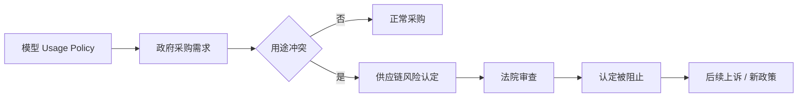

**来源**：
- [Reuters：US judge blocks Pentagon's Anthropic blacklisting](https://www.reuters.com/legal/government/us-judge-blocks-pentagons-anthropic-blacklisting-2026-08-28/)
- [Anthropic：Where things stand with the Department of War](https://www.anthropic.com/news/where-stand-department-war)

---

### 6. NVIDIA TensorRT Model Connect：从 Hugging Face Checkpoint 到无 Python 的 Native C++ 推理缩成两阶段工作流

- 类别：基础设施 / 模型部署 / AI-native SDLC
- 信息状态：官方产品更新
- 发布时间：2026-08-28；未公布准确时间
- 可用状态：已公开可用；开放参考实现

**事实摘要**：NVIDIA 发布 TensorRT Model Connect 的完整开发工作流。它是一组开放的模型参考实现，用于把支持的 Hugging Face 或本地 Checkpoint 转换为 TensorRT 可直接加载的 Deployment Bundle。

流程被压缩为两阶段：首先通过 Python CLI 执行类似 `trtmc build <model-id>` 生成 `.bundle`；生产环境的 C++ 应用随后直接加载 Bundle 运行，不需要 PyTorch，也不需要 Python Interpreter。

**相较此前的变化**：传统 Open Model → Native TensorRT 的路径往往涉及 Model-specific Export、ONNX / TorchScript、Unsupported Operator、Custom Plugin、Pre/Post-processing 和 C++ Runtime Glue。Model Connect 尝试把这些差异封装在可检查、可修改的模型参考实现中。

官方还提供两个 API Level：Semantic API 面向文本、视觉、音频等任务级输入输出；Module-level API 允许开发者直接控制 Tensor 和组件。TVM FFI 可以将自定义 GPU Kernel 插入局部模型路径，其余部分仍由 TensorRT 执行。

**为什么重要**：开放模型迭代速度已经远快于传统生产推理集成速度。企业可能今天评测一个模型，下周又出现新的 Attention、Multimodal Encoder 或 Operator。如果每个模型都要重新做一次 C++ / TensorRT 集成，模型选择自由度会被 Deployment Cost 抵消。

Model Connect 的价值是把“模型支持”从项目工程变成标准化实现。更有意思的是，NVIDIA 明确表示该项目自身采用 AI-native Development：Coding Agent 在人工指导和审核下生成 Model Implementation、Tests、Integration 和 Documentation，并以 Nightly Release 跟进开放模型生态。

**实际影响**：边缘设备、机器人、游戏、桌面应用和高性能 Native Backend 可以更容易采用新开放模型，而无需把 Python Runtime 带进生产环境。对于模型平台，这也提供了一个值得借鉴的模式：以统一 Artifact Bundle 隔离“模型准备”和“在线 Runtime”。

**角色视角**：
- AI Builder：更容易把开放模型嵌入 Native Application。
- Tech Lead：可以减少模型特定 C++ Glue Code。
- 产品负责人：新模型从评测到上线的周期有机会缩短。
- 部门经理：Serving Engineering 的维护成本可能下降。

**可借鉴动作**：选择一个当前由 Python / PyTorch Serving 的低延迟模型做 PoC，比较 TensorRT Model Connect Bundle 在启动依赖、P95 延迟、吞吐、镜像大小、升级复杂度和 Debug 可见性上的差异。

**风险与不确定性**：Model Connect 不是 TensorRT 的替代品，也不是所有 Hugging Face 模型都自动支持。模型 Reference Implementation 仍然需要验证 Accuracy 与 Operator Coverage；Native C++ Runtime 带来的性能优势也取决于具体模型和硬件。

**下一步观察**：
1. 新旗舰开放模型获得 Model Connect 支持的平均时间；
2. 社区是否开始提交大量第三方架构实现；
3. TensorRT Model Connect 与 vLLM / SGLang 的使用边界是否逐渐清晰。

**Mermaid 图示**

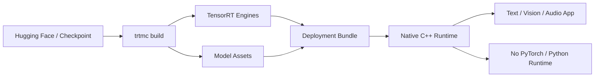

**来源**：
- [NVIDIA：TensorRT Model Connect](https://developer.nvidia.com/blog/deploy-an-open-model-from-checkpoint-to-inference-in-two-commands-with-nvidia-tensorrt-model-connect/)
- [TensorRT Model Connect GitHub](https://github.com/NVIDIA/TensorRT-Model-Connect)

---

### 7. OpenAI 发布 Rosalind Workbench：科学 Agent 从聊天助手变成“问题—数据—工具—证据”统一工作台

- 类别：Agent / 研究 / Harness
- 信息状态：官方产品更新
- 发布时间：2026-08-28；未公布准确时间
- 可用状态：Research Preview；通过 ChatGPT App 提供

**事实摘要**：OpenAI 发布 Rosalind Workbench Research Preview，为生命科学研究提供一个统一的 ChatGPT 工作环境。Workbench 将 Guided Scientific Tasks、专业 Viewer、NGS Analysis 和 GPT-Rosalind 的工具编排放在同一任务上下文中。

目前 Viewer 包括 Molecular Structure、Biological Sequence & Alignment 和 Slide Viewer。NGS Workbench 可以从 FASTQ 输入开始组织 Quality Control、Bulk RNA-seq 或 Single-cell 分析，并生成可供研究者审查的 Plan 和 Traceable Output。

**相较此前的变化**：GPT-Rosalind 此前已经作为生命科学模型存在，今天新增的重点不是再训练一个模型，而是 Domain Harness。它把 Scientific Question、数据、计划、中间结果、专业工具和 Provenance 放进同一个 Workbench，让研究者不需要在对话、Notebook、Bioinformatics Tool 和 Viewer 之间不断重新建立上下文。

Workbench 包含 Explore Mode 与 Research Mode。Research Mode 面向更复杂生物问题和高级 Workflow，Verified Organization 成员可以代表机构申请；Individual Access 官方称将稍后开放。

**为什么重要**：这代表企业 Agent 产品的价值重心正在从“拥有更聪明的模型”转向“拥有更合适的工作环境”。科学研究尤其典型：模型输出如果离开数据、文件格式、分析工具和证据链，就很难成为真正的研究生产力。

这和 Coding Harness 的演进高度相似。IDE Agent 不是因为模型会写代码就成功，而是因为它能看到 Repo、执行 Shell、运行 Test；Scientific Agent 同样需要理解 PDB、Sequence、Slide、FASTQ 和分析 Pipeline。

**实际影响**：做专业领域 Agent 的团队应该少做通用 Chat Wrapper，多做 Domain-native Artifact、Viewer、Tool 和 Eval。对企业研发平台来说，`Artifact + Tool + Provenance + Approval` 可能比 Prompt Template 更值得沉淀。

**角色视角**：
- AI Builder：专业 Viewer 和 Artifact 应成为 Agent Context 的一部分。
- 产品负责人：垂直 Agent 应围绕真实 Workflow，而非领域聊天机器人。
- Tech Lead：Provenance、可重复分析和工具版本必须可追踪。
- 部门经理：PoC 应衡量 Research Cycle Time，而非回答满意度。

**可借鉴动作**：选择一个内部专业领域，列出用户每天需要在 5–10 个工具之间搬运的 Artifact，然后优先统一 Artifact 和 Tool Context，再决定需要哪一个模型。

**风险与不确定性**：目前仍是 Research Preview，GPT-Rosalind 高级访问也受到资格和组织审核限制。生命科学任务具有高风险，模型给出的实验设计、分析和解释仍需要领域专家审核。

**下一步观察**：
1. Workbench 是否开放 API / SDK；
2. 是否支持更多科学 Artifact 和第三方工具；
3. Domain Workbench 模式是否扩展到材料、金融、工程等其他领域。

**Mermaid 图示**

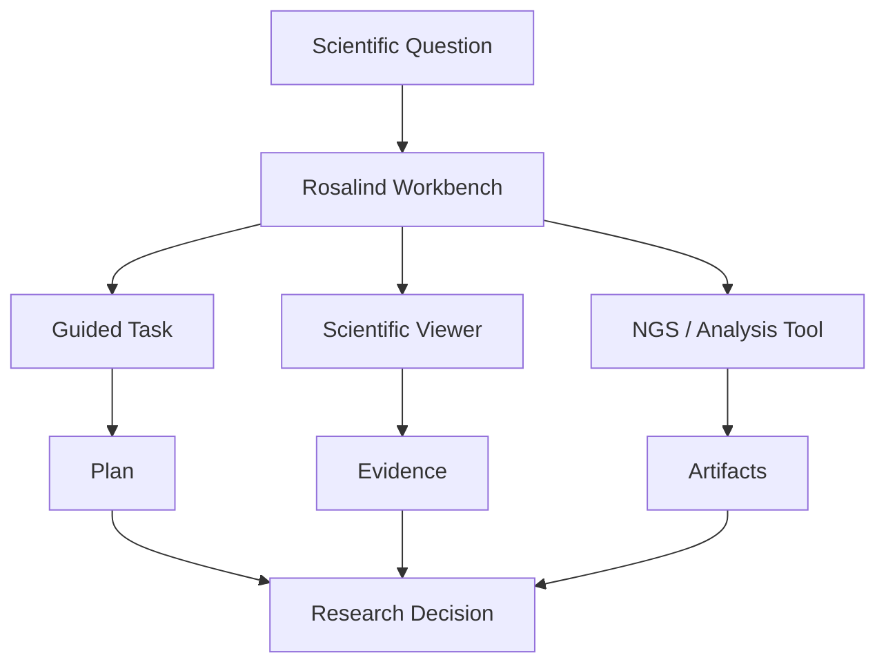

**来源**：
- [OpenAI Developers：Rosalind Workbench](https://developers.openai.com/blog/rosalind-workbench)
- [OpenAI：GPT-Rosalind](https://openai.com/index/introducing-new-capabilities-to-gpt-rosalind/)

---

### 8. GitHub Copilot in Visual Studio 更新：组织级 Custom Agents、Thinking Effort、模型成本和 Git Review 全部进入 IDE

- 类别：AI 编程 / Agent / Harness
- 信息状态：官方产品更新
- 发布时间：2026-08-28；未公布准确时间
- 可用状态：已公开可用；覆盖所有 GitHub Copilot Plans

**事实摘要**：GitHub 发布 Visual Studio 2026 的 Copilot August Update。GitHub Organization / Enterprise Owner 现在可以发布组织级 Custom Agents，Visual Studio 会在 Agent Picker 中自动识别这些 Agent，并显示描述和组织来源。

用户还可以为支持的模型选择 Low / Medium / High Thinking Effort；Model Management 页面会展示模型能力、Context Window、Cost 等信息，并允许 Favorite / Pin 模型。

**相较此前的变化**：IDE 内模型选择正从一个简单下拉菜单变成可治理的 Model Catalog。开发者不仅看到“模型名”，还可以看到能力、上下文和成本，并针对任务控制 Reasoning Effort。

Git Agent 也可以在 PR 之前审查 Uncommitted Changes 或单个 Commit，Review Finding 直接显示在 IDE 中，并同时支持 GitHub 与 Azure DevOps Repository。

**为什么重要**：这进一步说明 AI Coding 的关键单位不再是“一个 Copilot”。真实企业环境会有组织 Custom Agent、多个模型、不同 Effort、不同 Repo Policy 和不同 Review Agent。IDE 正逐渐变成 Harness Frontend。

同时，组织发布 Custom Agents 会改变内部 AI 工程标准化方式。过去团队把最佳实践写在 README、Prompt 或 Wiki；现在可以把 Tool、Instruction 和 Workflow 包装为组织级 Agent，由 IDE 自动发现。

**实际影响**：平台团队可以开始建立“组织 Agent Catalog”，例如 Security Review Agent、Migration Agent、Internal Framework Agent、Release Agent，而不是要求每位开发者复制 Prompt。

模型成本和 Thinking Effort 也使开发者侧 FinOps 更透明：简单任务可以 Low Effort，复杂 Debug / Architecture 才使用 High Effort。

**角色视角**：
- AI Builder：可把重复工程流程封装为组织 Custom Agent。
- Tech Lead：组织 Agent 需要 Owner、Version 和 Policy。
- 产品负责人：IDE 内模型/Agent 发现降低推广摩擦。
- 部门经理：模型 Usage 与 Cost 更容易直接暴露给开发团队。

**可借鉴动作**：挑选一个团队重复度最高的工程流程，封装成 Organization Custom Agent；同时定义 Owner、版本、Allowed Tools、Model Policy 和 Eval Set，而不是仅发布一个 Prompt。

**风险与不确定性**：组织 Agent 的复用也意味着错误配置会规模化传播。Thinking Effort 更高也不保证任务完成率更高，因此不能把 High 当作默认“更好”。

**下一步观察**：
1. Organization Custom Agent 是否增加签名 / 版本锁；
2. Visual Studio 与 Copilot CLI / App 是否共享同一 Agent Registry；
3. 模型成本和 Usage 是否能进入企业统一 Dashboard。

**Mermaid 图示**

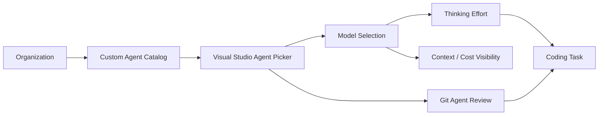

**来源**：
- [GitHub：Copilot in Visual Studio — August update](https://github.blog/changelog/2026-08-28-github-copilot-in-visual-studio-august-update-2/)

## C. 其他值得关注

**1. Google 将 Gemini Notebook 的 Usage Limit 改成按 Compute 类型动态消耗，并从每日刷新改为每 5 小时刷新。** Prompt Complexity、Chat Length、Source 数量和功能类型都会进入 Usage 计算；超过限制时，Video Overview、Slide Deck 等高算力任务可以延后并自动生成。新机制从 9 月 2 日开始面向 Consumer Web / Mobile 推出。对 AI 产品设计的启示是：复杂 Agent 功能的额度体系正在从“次数”转向“实际 Compute Budget”。来源：[Google：Flexible usage limits for Gemini Notebook](https://blog.google/innovation-and-ai/products/gemini-notebook/new-flexible-usage-limits/)

**2. GLM-5.3 权重开放后，Unsloth 已同步建立 GLM-5.3 GGUF 路线。** 官方模型体量依然需要数据中心级基础设施，但量化生态正在极快跟进，使大内存 Mac / CPU+GPU Hybrid 等非传统部署方式开始具备实验可能。这里的重点不是把 744B 模型包装成“普通电脑可轻松运行”，而是 Open Weight → Quantization → Local Harness 的时间差已经缩到非常短。来源：[Unsloth GLM-5.3 GGUF](https://huggingface.co/unsloth/GLM-5.3-GGUF)

**3. GitHub 的本周 Copilot 汇总显示 CLI、IDE、Slack/Teams 与 App 正在共享同一种 Agent Session 思路。** Copilot CLI 增加默认 Execution / Permission Mode、Plugin/MCP/Skill 管理与异常退出 Session 恢复，并迁移到 Native Rust Runtime；VS Code 则可以继续其他应用中的 Copilot 或 Claude Agent Session，并让第二个模型提供“Second Opinion”。这强化了一个趋势：Coding Agent Session 正从单一 IDE 私有状态变成跨客户端工作对象。来源：[GitHub Copilot weekly releases — August 24](https://github.blog/changelog/2026-08-28-github-copilot-weekly-releases-august-24/)

## D. 今日 AI 趋势总结

### 已有事实支持的趋势

**趋势 1：开放模型竞争正在从“模型可下载”升级为“Day-0 生产生态是否齐全”。** GLM-5.3 和 Hy4 一开放，就同时出现 vLLM、SGLang、量化和 OpenAI-compatible 路线。模型发布与 Serving 支持之间的时间差正在快速缩短。

**趋势 2：Coding Harness 正在成为真正的 Runtime Control Plane。** Claude Code 的 Model Switch Hook、Cache Cost、权限修复，以及 GitHub 的 Organization Agent、Thinking Effort、Retention Policy 都表明，模型只是 Harness 中的一个变量；Policy、Cost、Session 和 Tools 才是长期平台层。

**趋势 3：Agent FinOps 开始进入用户可见产品。** Claude Code 暴露 Prompt Cache 与 Spend Limit，GitHub 展示模型 Cost 和 Usage，Gemini Notebook 根据实际 Compute 重新设计额度。这意味着未来“每百万 Token 单价”会越来越不足以描述产品成本。

**趋势 4：垂直 Agent 正从领域模型转向领域 Workbench。** Rosalind Workbench 说明真正专业的 Agent 产品需要专业 Artifact、Viewer、Tool 和 Provenance，而不仅是一个“懂生物的模型”。

### 分析推断

**推断 1：2026 年下半年开放模型平台的关键竞争指标会从 Benchmark 转向 Deployment Friction。** 当多个开放模型能力进入相近区间，谁能够最快进入 vLLM/SGLang、量化、模型网关、IDE 和企业权限体系，谁更容易获得实际流量。

**推断 2：企业 Harness 最终会同时管理 Model、Tool、Context、Cache、Identity、Cost 和 Policy。** 今天这些功能还分散在 Claude Code、Copilot、模型网关和 Observability 平台中，但它们正在明显向统一 Runtime Control Plane 收敛。

**今日趋势总览**

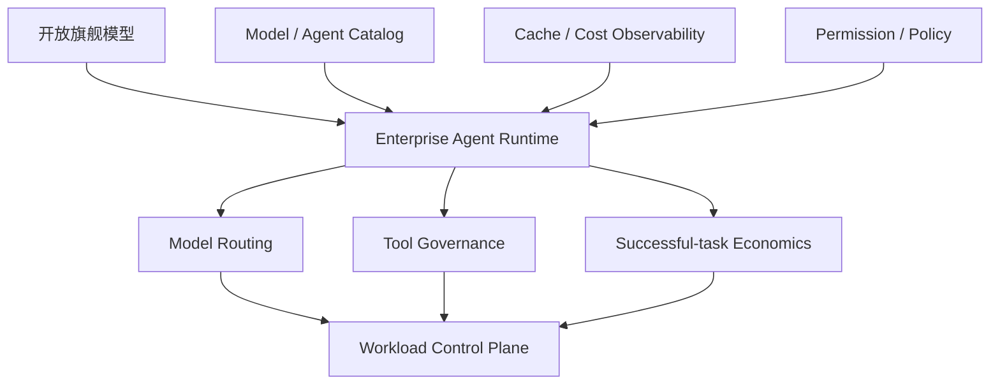

## E. 今日建议关注或采取的动作

1. **角色：AI Builder / Tech Lead｜建议动作：把 GLM-5.3 与 Hy4 加入同一套真实 Agent Eval。** 不要重跑厂商榜单，重点测仓库 Coding、长任务、Tool Use、并发和成功任务成本。**为什么现在做**：两款旗舰开放权重在同一窗口正式可用。**动作类型：安排测试。**

2. **角色：Tech Lead / 安全团队｜建议动作：优先升级 Claude Code 2.1.251，并复查 Symlink、Plugin、Telemetry 与 Workflow 权限。** **为什么现在做**：此次修复包含明确的权限边界问题。**动作类型：立即执行。**

3. **角色：AI Platform｜建议动作：将 Model Switch、Prompt Cache 和 Spend Limit 纳入统一 Trace。** **为什么现在做**：Harness 已经开始原生暴露这些事件，正是建立任务级 FinOps 的合适时间。**动作类型：纳入路线图。**

4. **角色：部门经理 / 产品负责人｜建议动作：复核 GitHub Copilot 9 月的 Unified Policy、Retention 和 Billing 变化。** **为什么现在做**：Chat Retention 将发生实质变化，且管理员需要在正式切换前决定策略。**动作类型：检查风险。**

---

<!-- English Version -->
# AI Daily Headlines｜2026-08-29

- Language: English
- Time zone: Asia/Singapore
- News window: 2026-08-28 07:30 to 2026-08-29 07:30
- Research cutoff: 2026-08-29 08:00
- Core stories: 8
- Other notable items: 3

## A. The 3 Most Important Things Today

**1. GLM-5.3 is now officially open-weight, fulfilling the promise made at its August 14 launch to release weights after roughly two additional weeks of safety evaluation.** The new development is not the model's first launch, but the fact that the roughly 744B-total / 40B-active flagship Coding and Agent model can now actually be downloaded, self-hosted, quantized, and customized. Official deployment paths now cover vLLM, SGLang, Transformers, KTransformers, Unsloth, and Ascend. For enterprise Harness and model-gateway teams, GLM-5.3 has moved from a vendor-served model into a model that can enter the internal supply chain.

**2. Tencent launched and open-sourced Hy4 preview: 770B total parameters, 49B active, 1M context, directly targeting coding, office, research, and Agent workloads.** It combines Gated DeepSeek Sparse Attention, IndexCache, iHC, and large-scale MoE, ships under Apache 2.0, and already has published API pricing. GLM-5.3 weights and Hy4 preview becoming available in the same window materially raises competition among high-capability Chinese open models at the intersection of frontier capability, long context, Agents, and private deployment.

**3. Claude Code 2.1.251 simultaneously strengthens model switching, prompt-cache cost observability, and several permission boundaries.** `PreModelSwitch` / `PostModelSwitch` Hooks can now block, confirm, or annotate model changes, while `/cost` exposes per-session prompt-cache hits, misses, and re-cached tokens. More importantly, the release fixes symlink permission races, plugin path traversal, managed-tracing bypasses, and related issues. Coding-Agent governance is moving beyond “which tools are allowed” toward runtime policy over models, cache state, paths, and data egress.

## B. Core Stories

### 1. GLM-5.3 officially opens its weights: a flagship Coding / Cyber Agent model moves from API service into self-hosted deployment

- Category: Model / AI Coding / Agent / Security
- Information status: Officially confirmed
- Published: 2026-08-28; exact official time not published, with weights becoming available inside this news window
- Availability: Publicly available; open weights; local and private deployment supported

**Fact summary**: Z.ai has officially published `zai-org/GLM-5.3` under its Hugging Face organization. GLM-5.3 first launched on August 14, when Z.ai said its unexpectedly strong cybersecurity capability required roughly two additional weeks of safety evaluation before releasing weights. That status materially changed in this window: the model can now be downloaded, deployed, and customized. GLM-5.3 uses the same base model as GLM-5.2, following a roughly 744B-total / 40B-active MoE architecture, with its main gains coming from scaled post-training.

The official model page lists deployment through Transformers, vLLM, SGLang, TokenSpeed, KTransformers, and Unsloth, along with Ascend NPU paths including vLLM-Ascend, xLLM, and SGLang. The model uses a dedicated `GLM-5.3 License`, which should not be confused with the MIT license used by GLM-5.3-Flash.

**What changed versus before**: On August 14, GLM-5.3 was already usable through Z.ai, Coding Plan, and APIs, so the model launch itself is not today's event. **Previously known**: GLM-5.3 materially improves complex coding, long-horizon Agent work, and vendor-reported cyber performance over GLM-5.2. **New today**: the weights are actually available, allowing enterprises and the community to run the model, quantize it, modify the serving stack, and connect it to their own Harness.

That distinction matters. API access leaves capacity, pricing, logging, and service policy under the provider. Open weights let an enterprise control inference infrastructure, caching, routing, audit, upgrades, and data boundaries.

**Why it matters**: GLM-5.3 is notable not only for Coding benchmarks but because it combines long-horizon tool use with unusually strong cyber capability. Z.ai reports an 84.5 score on CyberGym and explicitly said vulnerability-discovery and exploitation capabilities scaled faster than expected during post-training, which is why the open-weight release was delayed.

This means model governance should not be framed simply as “closed models are safe, open models are unsafe.” The more useful question is which capabilities a powerful open model receives inside your Harness when it has access to Shell, networking, repositories, and tools.

**Practical impact**: Teams with multi-model gateways or internal Coding Agents should add GLM-5.3 to PoCs, but run capability testing and security testing in parallel. Do not stop at SWE or Terminal benchmarks; test repository permissions, shell execution, network egress, package installation, secret access, MCP tool use, and long-task drift.

The roughly 744B total parameter footprint still makes full-precision deployment infrastructure-heavy, although Day-0 vLLM / SGLang / Unsloth support will quickly reduce experimentation friction. Teams unable to carry that footprint may still find the hosted API or GLM-5.3-Flash more economical.

**Role perspective**:
- AI Builder: add GLM-5.3 to Coding-Agent and long-horizon Agent evaluations.
- Product owner: open weights reduce provider lock-in but do not automatically reduce total TCO.
- Tech Lead: evaluate model quality, serving economics, and capability security together.
- Department manager: a significant new option where data residency or model control matters.

**Action to borrow**: Create a dedicated admission test for high-capability open models. In addition to normal Agent benchmarks, include network access, filesystem escape, privilege escalation, hostile repository content, prompt injection, secret retrieval, and package supply-chain scenarios before allowing a model into the internal catalog.

**Risks and uncertainty**: Most Z.ai Coding and Cyber benchmarks are vendor-provided or vendor-configured. Even when official benchmark verifiers are used, they should not be treated as a substitute for production workloads. Open weights will also produce many quantized derivatives whose long-context, tool-use, and safety behavior may differ from the official release.

**Next signals to watch**:
1. Independent reproduction on Agentic Coding benchmarks;
2. Task-quality and Cyber capability changes under FP8 / GGUF / low-bit quantization;
3. Enterprise legal interpretation of the `GLM-5.3 License`.

**Mermaid diagram A: control boundaries after moving from API-only access to open weights**

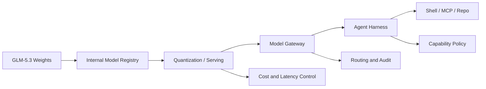

This is an enterprise deployment abstraction, not Z.ai's official architecture.

**Mermaid diagram B: open-model admission process**

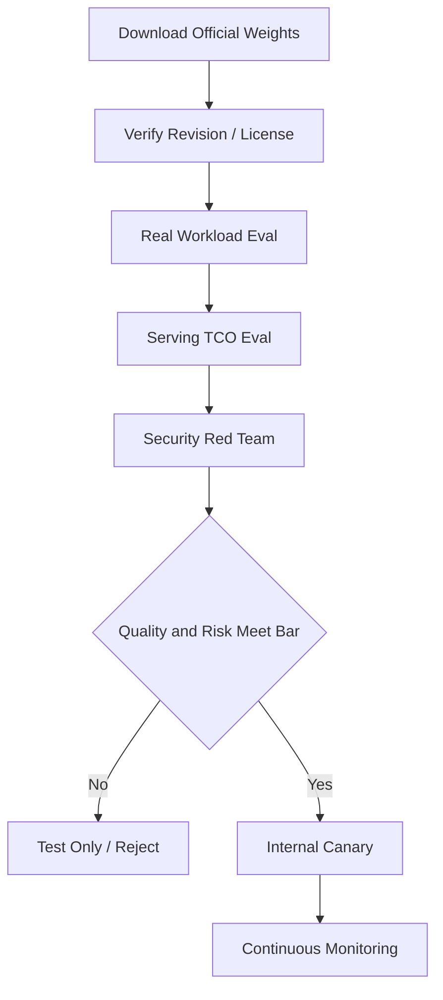

**Sources**:
- [Z.ai: GLM-5.3 technical release](https://z.ai/blog/glm-5.3)
- [Official Z.ai GLM-5.3 Hugging Face model](https://huggingface.co/zai-org/GLM-5.3)

---

### 2. Tencent launches Hy4 preview: 770B-A49B, 1M context, and Apache 2.0 raise the stakes in open flagship models

- Category: Model / AI Coding / Agent / Infrastructure
- Information status: Officially confirmed
- Published: 2026-08-28; exact time not published
- Availability: Publicly available; open weights; API / WorkBuddy / CodeBuddy and other channels available

**Fact summary**: Tencent released and open-sourced Hy4 preview. Official specifications list 770B total parameters, 49B activated per token, 78 layers, and a 1M context window. The first layer uses a dense FFN while the other 77 use MoE; each MoE layer contains 256 routed experts plus one shared expert, selecting the top eight routed experts per token. The model also includes a native MTP layer for speculative decoding.

Attention uses Gated DeepSeek Sparse Attention with IndexCache for cross-layer sparse-index reuse, while the residual path uses iHC. Full and FP8 weights are published on Hugging Face, ModelScope, and other repositories under Apache 2.0, with vLLM, SGLang, and OpenAI-compatible serving paths.

**What changed versus before**: Hy3 had already signaled Tencent's move toward open Coding / Agent models. Hy4 preview raises scale, context, and post-training substantially. Today's change is not just an experimental checkpoint: full weights, FP8 weights, APIs, Coding-product integrations, and pricing arrive together.

Tencent lists API pricing at $0.834 per million input tokens, $2.501 per million output tokens, and $0.042 per million cache-hit tokens. WorkBuddy and CodeBuddy include two weeks of free Hy4 preview access at launch.

**Why it matters**: Open-model competition previously split between smaller low-cost models and capability-focused flagships. Hy4 and GLM-5.3 becoming open-weight in the same window makes “self-hostable flagship Agent model” a much more practical category.

Architecturally, Hy4 reinforces a clear direction: MoE addresses dense compute, sparse attention addresses long context, and MTP / speculative decoding addresses decode throughput. These layers are being optimized together rather than scaling parameters alone.

**Practical impact**: Enterprise platforms can place Hy4 preview into the same Agent workload benchmark as GLM-5.3, Qwen, DeepSeek, Kimi, and closed frontier models. Long-repository coding, multi-file office work, cross-document analysis, and research agents are especially relevant because Tencent explicitly optimized those workflows.

Tencent also says Hy4 participated in optimizing its own training methods, data strategy, evaluation frameworks, and low-level operators, and that model-driven inference optimization improved end-to-end throughput by 31.8% versus its baseline. This is an interesting AI-native engineering example, but remains vendor-reported evidence rather than a general result about recursive self-improvement.

**Role perspective**:
- AI Builder: worth testing for coding, research, and complex office Agents.
- Product owner: published API prices make successful-task economics directly comparable.
- Tech Lead: Apache 2.0 weights and multiple inference engines make private evaluation easier.
- Department manager: more open flagship suppliers reduce single-model dependence.

**Action to borrow**: Stop organizing PoCs by model brand. Build a provider-neutral Agent Eval Harness that runs GLM-5.3, Hy4, Qwen, DeepSeek, Kimi, and your current closed model through identical tasks, tools, and success criteria.

**Risks and uncertainty**: Hy4 is explicitly a preview. Tencent acknowledges issues including over-reasoning and over-verification. The internal blind evaluation involving 163 experts and 203 engineering tasks, as well as the 31.8% throughput improvement, are Tencent's own measurements.

**Next signals to watch**:
1. Architecture and license changes between Hy4 preview and the final Hy4 release;
2. Real vLLM / SGLang concurrency cost at 1M context;
3. Independent Coding / Research / Office Agent workloads.

**Mermaid diagram A: major Hy4 architecture paths**

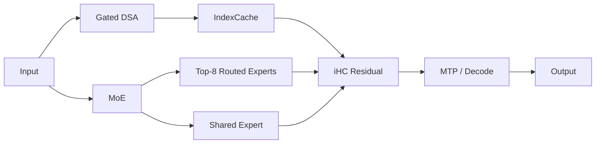

This is a simplified explanation based on public specifications, not Tencent's full computation graph.

**Mermaid diagram B: cross-model open-weight evaluation**

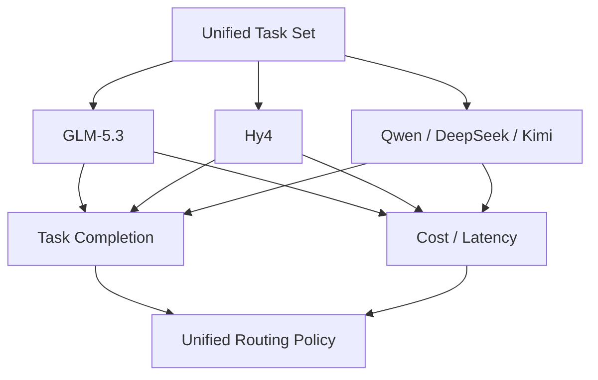

**Sources**:
- [Tencent official release](https://www.tencent.com/tencent-releases-and-open-sources-tencent-hy4-preview/)
- [Tencent Hy4 preview official GitHub](https://github.com/Tencent-Hunyuan/Hy4-preview)

---

### 3. Claude Code 2.1.251 adds model-switch hooks, prompt-cache economics, and multiple permission-boundary security fixes

- Category: AI Coding / Harness / Security / Cost Governance
- Information status: Official product update
- Published: 2026-08-28; exact time not published
- Availability: Publicly available CLI update

**Fact summary**: Claude Code 2.1.251 adds `PreModelSwitch` and `PostModelSwitch` Hooks. A Harness can block, confirm, or annotate a model change before it occurs and react afterward; `SessionStart` resume Hooks now receive session staleness and estimated prompt re-cache cost.

Cost observability also improves: `/usage` gains a spend-limit bar, while `/cost` adds per-session prompt-cache data including hit ratio, misses, re-cached tokens, and warm/cold state, with a structured object exposed to status-line scripts.

**What changed versus before**: Model switching used to be largely a user / CLI UI behavior. It is now a policy-interceptable event. That matters in multi-model enterprise environments where high-cost or restricted model switches may need budget, data-classification, or task checks.

More importantly, the release fixes several permission-boundary issues:
- File tools could follow a symlink swapped after a permission check and reach outside an approved location;
- Marketplace plugin command paths could point outside the plugin directory;
- Project settings could enable detailed beta tracing or raw API-body logging and bypass a managed OTLP collector;
- Workflow `scriptPath` could be read before permission validation;
- Grep / Glob did not correctly apply `Read(...)` deny rules through symlinked search paths.

**Why it matters**: These are not routine CLI bugs. They expose the hardest part of Agent Harness security: permissions are not a static allow/deny list. File paths, symlinks, plugins, telemetry, model switching, and session resume all interact dynamically.

Prompt Cache is also moving from an internal provider optimization into an Agent FinOps metric. If switching a model or resuming a stale session forces large re-caching costs, two workflows using the same listed model price can have very different TCO.

**Practical impact**: Enterprises running Claude Code should upgrade promptly and revisit Hooks and Managed Settings. Teams with a model gateway can use `PreModelSwitch` for centralized controls, such as limiting repositories to approved models or requiring justification before expensive model transitions.

**Role perspective**:
- AI Builder: prompt-cache economics are now visible at the task level.
- Tech Lead: the security fixes justify treating this as a priority upgrade.
- Product owner: automatic routing and cost controls can gain clearer UX.
- Department manager: model choice can become part of budget and governance audit.

**Action to borrow**: After upgrading, record `task/session → source model → target model → reason → estimated recache cost` in `PreModelSwitch`, and combine `/cost` cache metrics with final task success in observability.

**Risks and uncertainty**: Claude Code Hooks control model switching inside Claude Code, not necessarily every external gateway or SDK transition. The security fixes also indicate real boundary problems in older versions, making upgrades more urgent for high-permission development environments.

**Next signals to watch**:
1. Organization-managed model-switch policies;
2. Prompt-cache metrics flowing into OpenTelemetry;
3. More explicit per-task cost/quality routing.

**Mermaid diagram A: model switching becomes a policy event**

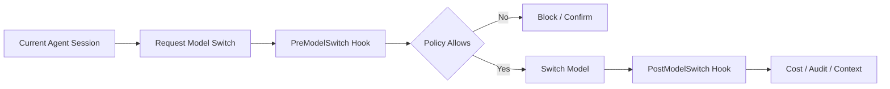

**Mermaid diagram B: Claude Code cost chain**

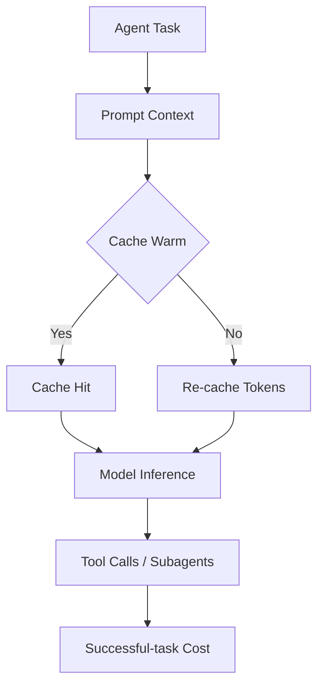

**Source**:
- [Claude Code official Changelog](https://code.claude.com/docs/en/changelog)

---

### 4. GitHub changes Copilot enterprise billing and unified Agent policy; github.com Chat retention will move from 28 days to account lifetime

- Category: AI Coding / Agent / Security / Cost Governance
- Information status: Official product update
- Published: 2026-08-28; exact time not published
- Availability: Announced; changes begin on 2026-09-01, 2026-09-28 or later, and 2026-10-01 depending on feature

**Fact summary**: GitHub announced three sets of upcoming Copilot changes. Starting September 1, it will begin re-enabling credit-card / PayPal signups for new Copilot Business and Enterprise customers with stronger account vetting. New enterprise seats will require payment before access. Upfront billing for assigned seats starts for existing affected customers on October 1, while Business and Enterprise list prices themselves remain unchanged.

No earlier than September 28, Copilot Chat on github.com, GitHub Mobile, and Copilot Cloud Agent will converge into one unified Copilot experience and policy, enabled by default.

**What changed versus before**: The most consequential change is not UI consolidation but data and governance boundaries. Copilot on github.com will fully migrate to the Agent Sessions experience, and chat-data retention will move from **28 days** to the **lifetime of the account**, aligning it with Cloud Agent. Organizations opting out of the unified experience will lose Copilot access on github.com and Mobile after launch.

GitHub will also change the default Copilot Code Review effort from Lite to Balanced on September 28 unless an organization or repository explicitly selects Lite.

**Why it matters**: Coding-Agent products are becoming persistent session runtimes rather than isolated features, and retention, permission, and billing policies are converging around that runtime. For regulated organizations, the same product name can therefore have materially different retention and execution semantics after an upgrade.

This is also a reminder that AI platform changes are not limited to models. Data retention, seat billing, and default review effort can all change compliance and cost.

**Practical impact**: Enterprise administrators should complete policy review before September 28, especially where internal rules require short chat retention. Budget owners should also validate seat billing, additional usage, and spend-control settings.

**Role perspective**:
- AI Builder: feature behavior should remain broadly compatible, but session semantics become more unified.
- Tech Lead: revisit data governance and default review effort.
- Department manager: seat cost and additional usage need explicit budget controls.
- Security / Compliance: chat retention is a material policy change.

**Action to borrow**: Before September 28, create a Copilot policy checklist covering Unified Experience, Chat Retention, Cloud Agent, Code Review Effort, Seat Assignment, Additional Usage, and Spend Limits, with joint review by Engineering, Security, and Procurement.

**Risks and uncertainty**: These are announced future changes, not all current behavior. GitHub explicitly says “no earlier than September 28,” so the exact rollout date may move.

**Next signals to watch**:
1. Final GA date for the unified Copilot experience;
2. More granular enterprise retention controls;
3. Real usage/cost impact from Balanced Code Review.

**Mermaid diagram**

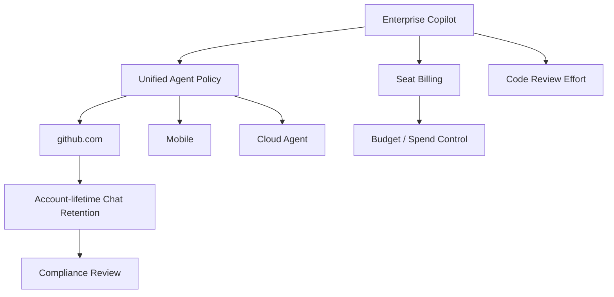

**Source**:
- [GitHub: Upcoming changes to GitHub Copilot policies and billing](https://github.blog/changelog/2026-08-28-upcoming-changes-to-github-copilot-policies-and-billing/)

---

### 5. U.S. judge blocks the Pentagon's Anthropic supply-chain-risk designation, turning AI safety terms into a government procurement issue

- Category: Policy & Industry / Security
- Information status: Authoritative media report / court ruling
- Published: 2026-08-28 09:27 Asia/Singapore, converted from Reuters 01:27 UTC
- Availability: Not applicable

**Fact summary**: U.S. District Judge Rita Lin blocked the Department of Defense's supply-chain-risk designation of Anthropic and called the decision “illegal and baseless” in a 59-page ruling. The Pentagon had designated Anthropic after the company refused to allow Claude to be used for mass domestic surveillance of Americans or fully autonomous weapons.

It was the first public use of this supply-chain-risk statute against a U.S. company. Anthropic had argued that the action retaliated against its AI-safety views and violated First Amendment speech rights and Fifth Amendment due process.

**What changed versus before**: The prior state was that Anthropic had been designated a supply-chain risk and was challenging it in court. **New today**: a federal court has substantively blocked that designation. Legal and commercial uncertainty is not completely resolved because further government action or appeals remain possible.

**Why it matters**: The dispute turns what looks like a model safety policy into a procurement issue: can a model provider's refusal to support certain technically lawful use cases become grounds for government supply-chain exclusion?

For enterprises, it demonstrates that provider risk is broader than uptime, price, and data residency. Conflict between a model provider and government or customers over acceptable uses can affect long-term availability.

**Practical impact**: Government, defense, critical-infrastructure, and regulated industries should include “policy continuity risk” in multi-model architecture. Two technically equivalent models may have very different continuity profiles if their providers draw different usage boundaries.

**Role perspective**:
- Product owner: identify provider policy boundaries in regulated use cases.
- Tech Lead: maintain provider failover for critical systems.
- Department manager: add regulatory / contract continuity to procurement reviews.
- Security lead: safety constraints can reduce technical risk while increasing policy or commercial exposure.

**Action to borrow**: Add `Usage-policy compatibility`, `Government / Regulatory exposure`, `Contract continuity`, and `Fallback provider` to the model-supplier scorecard rather than comparing only benchmark and price.

**Risks and uncertainty**: This is a U.S. federal district-court ruling, not the final end of the broader dispute. It also does not mean the court endorsed every Anthropic safety position. Appeals and other cases may change the situation.

**Next signals to watch**:
1. Whether the U.S. government appeals;
2. Outcome of related Anthropic litigation;
3. Whether defense AI contracts converge on standardized model-safety clauses.

**Mermaid diagram**

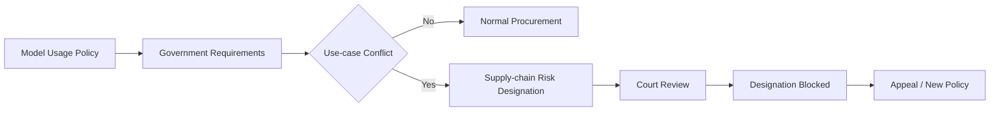

**Sources**:
- [Reuters: US judge blocks Pentagon's Anthropic blacklisting](https://www.reuters.com/legal/government/us-judge-blocks-pentagons-anthropic-blacklisting-2026-08-28/)
- [Anthropic: Where things stand with the Department of War](https://www.anthropic.com/news/where-stand-department-war)

---

### 6. NVIDIA TensorRT Model Connect reduces Hugging Face checkpoint → Python-free native C++ inference to a two-stage workflow

- Category: Infrastructure / Model Deployment / AI-native SDLC
- Information status: Official product update
- Published: 2026-08-28; exact time not published
- Availability: Publicly available open reference implementations

**Fact summary**: NVIDIA published the full TensorRT Model Connect workflow, an open collection of model reference implementations that converts supported Hugging Face or local checkpoints into deployment bundles that TensorRT-enabled applications can load directly.

The workflow has two phases: a Python CLI command such as `trtmc build <model-id>` creates a `.bundle`; production C++ then loads that bundle without requiring PyTorch or a Python interpreter.

**What changed versus before**: Traditional open-model → native TensorRT deployment often involves model-specific export, ONNX / TorchScript, unsupported operators, custom plugins, preprocessing, postprocessing, and C++ runtime glue. Model Connect packages those differences into inspectable and extensible reference implementations.

It exposes two API layers: a semantic API for task-level text, vision, and audio inputs/outputs, plus a module-level API for direct tensor/component control. TVM FFI can insert custom GPU kernels while TensorRT executes the rest of the graph.

**Why it matters**: Open models now evolve faster than traditional production-inference integrations. A team may benchmark one architecture today and receive a completely new attention mechanism or multimodal encoder next week. If every model requires a new C++ integration project, deployment friction cancels much of the benefit of model choice.

Model Connect turns model support into a more standardized implementation layer. NVIDIA also explicitly says the project is built AI-natively: coding agents generate implementation code, tests, integrations, and documentation under human direction and review, with nightly releases to keep pace with new models.

**Practical impact**: Edge devices, robotics, games, desktop applications, and high-performance native backends can adopt open models without carrying a Python runtime into production. It also suggests a useful platform pattern: use one deployment artifact to isolate model preparation from online runtime.

**Role perspective**:
- AI Builder: easier embedding of open models into native applications.
- Tech Lead: less model-specific C++ glue.
- Product owner: potentially shorter evaluation-to-production cycles.
- Department manager: lower serving-engineering maintenance.

**Action to borrow**: Choose one latency-sensitive model currently served through Python/PyTorch and compare Model Connect on startup dependencies, P95 latency, throughput, container size, upgrade complexity, and debugging visibility.

**Risks and uncertainty**: Model Connect is not a replacement for TensorRT and does not automatically support every Hugging Face architecture. Accuracy and operator coverage still require validation, and native-C++ performance benefits depend on model and hardware.

**Next signals to watch**:
1. Time from new open-model release to Model Connect support;
2. Volume of community-contributed architectures;
3. How deployment boundaries settle between Model Connect and vLLM / SGLang.

**Mermaid diagram**

```mermaid
flowchart LR
    N1[Hugging Face / Checkpoint] --> N2[trtmc build]
    N2 --> N3[TensorRT Engines]
    N2 --> N4[Model Assets]
    N3 --> N5[Deployment Bundle]
    N4 --> N5
    N5 --> N6[Native C++ Runtime]
    N6 --> N7[Text / Vision / Audio App]
    N6 --> N8[No PyTorch / Python Runtime]
```

**Sources**:
- [NVIDIA: TensorRT Model Connect](https://developer.nvidia.com/blog/deploy-an-open-model-from-checkpoint-to-inference-in-two-commands-with-nvidia-tensorrt-model-connect/)
- [TensorRT Model Connect GitHub](https://github.com/NVIDIA/TensorRT-Model-Connect)

---

### 7. OpenAI launches Rosalind Workbench, turning a scientific Agent from a chatbot into a unified question-data-tool-evidence workspace

- Category: Agent / Research / Harness
- Information status: Official product update
- Published: 2026-08-28; exact time not published
- Availability: Research Preview through the ChatGPT app

**Fact summary**: OpenAI launched Rosalind Workbench in research preview, providing life-sciences researchers with a unified ChatGPT workspace around guided scientific tasks, specialized viewers, NGS analysis, and GPT-Rosalind tool orchestration.

Current viewers include Molecular Structure, Biological Sequence & Alignment, and Slide Viewer. NGS Workbench can organize workflows from FASTQ input through quality control, bulk RNA-seq, or single-cell analysis and produce plans and traceable outputs for researcher review.

**What changed versus before**: GPT-Rosalind already existed as a life-sciences model. Today's major addition is the domain Harness, not another model checkpoint. Scientific questions, data, plans, intermediate results, specialized tools, and provenance are kept inside one Workbench rather than repeatedly rebuilding context across chat, notebooks, bioinformatics tools, and viewers.

The Workbench has Explore and Research modes. Research mode supports more advanced biological questions and workflows; verified organization members can request access on behalf of their organization, while individual access is planned later.

**Why it matters**: The value of vertical Agents is shifting from “a smarter domain model” toward “a better working environment.” This is particularly true in science: an answer disconnected from data formats, analysis tools, and evidence trails is difficult to turn into real research productivity.

The pattern mirrors Coding Harnesses. IDE Agents succeed not merely because a model writes code, but because the Agent can see repositories, execute shell commands, and run tests. Scientific Agents similarly need native understanding of PDB, sequences, slides, FASTQ, and analysis pipelines.

**Practical impact**: Teams building professional Agents should invest less in generic chat wrappers and more in domain-native artifacts, viewers, tools, and evaluations. For enterprise R&D platforms, `Artifact + Tool + Provenance + Approval` may be more durable than prompt libraries.

**Role perspective**:
- AI Builder: professional viewers and artifacts should be part of Agent context.
- Product owner: vertical Agents should be designed around workflows, not domain chat.
- Tech Lead: provenance, reproducibility, and tool versions must remain traceable.
- Department manager: PoCs should measure research-cycle time rather than answer satisfaction.

**Action to borrow**: Pick one internal professional domain and list the 5–10 tools and artifacts users manually move between each day. Unify artifact and tool context first, then decide which model should power the workflow.

**Risks and uncertainty**: Rosalind Workbench remains a research preview, and advanced GPT-Rosalind access is eligibility-controlled. Life-sciences workflows are high-stakes; experimental design, analysis, and interpretation still require domain-expert review.

**Next signals to watch**:
1. API / SDK access for Workbench;
2. More scientific artifact types and third-party tools;
3. Whether the domain-workbench pattern expands into materials, finance, and engineering.

**Mermaid diagram**

```mermaid
flowchart TD
    R1[Scientific Question] --> R2[Rosalind Workbench]
    R2 --> R3[Guided Task]
    R2 --> R4[Scientific Viewer]
    R2 --> R5[NGS / Analysis Tool]
    R3 --> R6[Plan]
    R4 --> R7[Evidence]
    R5 --> R8[Artifacts]
    R6 --> R9[Research Decision]
    R7 --> R9
    R8 --> R9
```

**Sources**:
- [OpenAI Developers: Rosalind Workbench](https://developers.openai.com/blog/rosalind-workbench)
- [OpenAI: GPT-Rosalind](https://openai.com/index/introducing-new-capabilities-to-gpt-rosalind/)

---

### 8. GitHub Copilot in Visual Studio adds organization-level Custom Agents, reasoning effort, model-cost visibility, and Git review

- Category: AI Coding / Agent / Harness
- Information status: Official product update
- Published: 2026-08-28; exact time not published
- Availability: Publicly available across all GitHub Copilot plans

**Fact summary**: GitHub released the Visual Studio 2026 Copilot August update. GitHub organization and enterprise owners can now publish organization-level Custom Agents, which Visual Studio automatically discovers in the Agent Picker and labels with their descriptions and organizational source.

Supported models now expose Low / Medium / High thinking effort. Model management surfaces capabilities, context-window size, cost information, and favorite/pinning controls.

**What changed versus before**: Model selection inside the IDE is moving from a simple dropdown toward a governable model catalog. Developers can see more than the model name and choose reasoning effort for each task.

The Git Agent can also review uncommitted changes or individual commits before a pull request, surfacing findings directly inside the editor, with support for both GitHub and Azure DevOps repositories.

**Why it matters**: Enterprise AI Coding is no longer represented by “one Copilot.” Real environments increasingly contain organization-level Agents, multiple models, reasoning effort, repository policy, and separate review Agents. The IDE is becoming a Harness frontend.

Organization-level Custom Agents also change how engineering best practices are distributed. Instead of documenting workflows in wikis or copied prompts, organizations can package tools, instructions, and workflows as discoverable Agents.

**Practical impact**: Platform teams can begin maintaining an organization Agent catalog — for example Security Review, Migration, Internal Framework, or Release Agents — rather than asking each developer to copy prompt templates.

Cost visibility and thinking-effort controls also make developer-side FinOps more explicit: straightforward work can use low effort, while complex debugging or architecture decisions can reserve higher effort.

**Role perspective**:
- AI Builder: package repeated engineering workflows as organization Custom Agents.
- Tech Lead: every organization Agent needs ownership, versioning, and policy.
- Product owner: in-IDE Agent discovery lowers adoption friction.
- Department manager: usage and cost become more visible to development teams.

**Action to borrow**: Pick one high-frequency engineering workflow and publish it as an organization Custom Agent with an owner, version, allowed tools, model policy, and evaluation set — not just a prompt.

**Risks and uncertainty**: Organization-wide reuse also scales configuration mistakes. Higher thinking effort does not guarantee higher task completion, so High should not automatically become the default.

**Next signals to watch**:
1. Signing or version pinning for organization Custom Agents;
2. A shared Agent registry across Visual Studio, Copilot CLI, and Copilot App;
3. Model cost and usage flowing into unified enterprise dashboards.

**Mermaid diagram**

```mermaid
flowchart LR
    VS1[Organization] --> VS2[Custom Agent Catalog]
    VS2 --> VS3[Visual Studio Agent Picker]
    VS3 --> VS4[Model Selection]
    VS4 --> VS5[Thinking Effort]
    VS3 --> VS6[Git Agent Review]
    VS4 --> VS7[Context / Cost Visibility]
    VS5 --> VS8[Coding Task]
    VS6 --> VS8
```

**Source**:
- [GitHub: Copilot in Visual Studio — August update](https://github.blog/changelog/2026-08-28-github-copilot-in-visual-studio-august-update-2/)

## C. Other Notable Items

**1. Google is changing Gemini Notebook usage limits from daily quotas toward compute-specific budgets that refresh every five hours.** Prompt complexity, conversation length, number of sources, and feature choice contribute to usage, while high-compute outputs such as Video Overviews and Slide Decks can be deferred and generated automatically later. The rollout starts September 2 for consumer web/mobile accounts. The broader product-design signal is that complex AI usage is moving from “number of requests” toward actual compute budgeting. Source: [Google: Flexible usage limits for Gemini Notebook](https://blog.google/innovation-and-ai/products/gemini-notebook/new-flexible-usage-limits/)

**2. Unsloth already has a GLM-5.3 GGUF path following the open-weight release.** The official model remains a data-center-scale model, but quantization tooling is moving almost immediately, making large-memory Mac and CPU+GPU hybrid experimentation possible. The important point is not that a 744B model suddenly becomes “easy to run on a laptop,” but that the delay from Open Weight → Quantization → Local Harness has compressed dramatically. Source: [Unsloth GLM-5.3 GGUF](https://huggingface.co/unsloth/GLM-5.3-GGUF)

**3. GitHub's weekly Copilot roundup shows CLI, IDE, Slack/Teams, and App converging around a shared Agent-session concept.** Copilot CLI adds default execution/permission modes, improved plugin/MCP/skill management, recovery of interrupted sessions, and a native Rust runtime; VS Code can continue Copilot or Claude Agent sessions from other applications and ask a complementary model for a second opinion. Coding-Agent sessions are moving from private IDE state toward cross-client work objects. Source: [GitHub Copilot weekly releases — August 24](https://github.blog/changelog/2026-08-28-github-copilot-weekly-releases-august-24/)

## D. AI Trend Summary

### Trends supported by current facts

**Trend 1: Open-model competition is moving from “can I download the model?” to “is the Day-0 production ecosystem complete?”** GLM-5.3 and Hy4 are accompanied almost immediately by vLLM, SGLang, quantization, and OpenAI-compatible routes. The delay between model release and production serving is shrinking quickly.

**Trend 2: Coding Harnesses are becoming true Runtime Control Planes.** Claude Code's model-switch Hooks, cache economics, and permission fixes, together with GitHub's organization Agents, reasoning effort, and retention policy, show that the model is only one runtime variable; policy, cost, sessions, and tools are becoming the durable platform layer.

**Trend 3: Agent FinOps is becoming visible in end-user products.** Claude Code exposes prompt-cache and spend data, GitHub exposes model cost and usage, and Gemini Notebook is redesigning limits around actual compute. Per-million-token price is becoming insufficient to describe product economics.

**Trend 4: Vertical Agents are shifting from domain models toward domain Workbenches.** Rosalind Workbench shows that serious professional Agents need domain-native artifacts, viewers, tools, and provenance rather than simply a model that “knows biology.”

### Analytical inference

**Inference 1: In the second half of 2026, deployment friction may become a more important open-model competitive metric than benchmark position.** As capability clusters tighten, the model that enters vLLM/SGLang, quantization, gateways, IDEs, and enterprise policy fastest is more likely to win real traffic.

**Inference 2: Enterprise Harnesses will ultimately govern model, tool, context, cache, identity, cost, and policy together.** These features are still distributed across Claude Code, Copilot, gateways, and observability products, but they are visibly converging toward a common Runtime Control Plane.

**Trend overview**

```mermaid
flowchart TD
    T1[Open Flagship Models] --> T5[Enterprise Agent Runtime]
    T2[Model / Agent Catalog] --> T5
    T3[Cache / Cost Observability] --> T5
    T4[Permission / Policy] --> T5
    T5 --> T6[Model Routing]
    T5 --> T7[Tool Governance]
    T5 --> T8[Successful-task Economics]
    T6 --> T9[Workload Control Plane]
    T7 --> T9
    T8 --> T9
```

## E. Actions to Consider Today

1. **Role: AI Builder / Tech Lead | Action: add GLM-5.3 and Hy4 to the same real Agent evaluation suite.** Do not reproduce vendor leaderboards; focus on repository coding, long tasks, tool use, concurrency, and cost per successful task. **Why now**: both flagship open-weight models became usable in the same window. **Action type: Schedule a test.**

2. **Role: Tech Lead / Security | Action: prioritize upgrading Claude Code to 2.1.251 and review symlink, plugin, telemetry, and workflow permissions.** **Why now**: this release fixes concrete permission-boundary issues. **Action type: Execute now.**

3. **Role: AI Platform | Action: put model switching, prompt cache, and spend limits into the unified trace.** **Why now**: Harnesses now expose these events natively, creating a good entry point for task-level FinOps. **Action type: Add to roadmap.**

4. **Role: Department manager / Product owner | Action: review GitHub Copilot's September unified policy, retention, and billing changes.** **Why now**: chat-retention semantics will materially change and administrators need to choose policy before rollout. **Action type: Risk review.**
