<!-- 中文版 -->
# AI 今日头条｜2026 年 08 月 29 日

- 语言：中文
- 时区：Asia/Singapore
- 新闻窗口：2026-08-28 07:30 至 2026-08-29 07:30
- 实际检索截止时间：2026-08-29 09:36
- 本期核心新闻：7 条
- 其他值得关注：2 条

## A. 今日最重要的 3 件事

**1. GLM-5.3 正式开放权重，8 月中旬的“旗舰模型发布”今天真正进入可自部署阶段。** GLM-5.3 此前已经通过 Z.ai API 提供，但官方权重现在已经落到 Hugging Face，并提供 Transformers、vLLM、SGLang、KTransformers、Unsloth 和 Ascend 等部署路线。对企业来说，关键变化不是又多了一个模型，而是高能力 Coding / Long-horizon Agent 模型从“供应商托管能力”变成了可以纳入内部模型供应链、私有推理和安全治理的资产。

**2. 腾讯发布并以 Apache 2.0 开放 Hy4 preview：770B 总参数、49B 激活、1M 上下文，直接争夺旗舰开放 Agent 模型位置。** 它同时提供 FP8 权重、vLLM / SGLang Day-0 Serving、OpenAI-compatible API、WorkBuddy / CodeBuddy 接入和明确 API 价格。GLM-5.3 与 Hy4 在同一新闻窗口进入开放权重状态，是比单一 benchmark 更重要的信号：高能力开放模型正在把竞争焦点从“能不能下载”推进到“能否快速进入企业 Harness 与生产 Serving”。

**3. Claude Code 2.1.251 是一次值得优先升级的 Harness 更新：模型切换开始受 Hook 控制，Prompt Cache 开始成为可观测成本，同时修补了多个权限边界问题。** `PreModelSwitch` / `PostModelSwitch` 让企业可以对模型变化执行阻止、确认和审计；`/cost` 增加 Cache Hit / Miss / Re-cache 数据；官方 Changelog 同时修复 symlink 竞态、插件路径穿越、Tracing 配置越权等问题。Coding Agent 的治理对象已经从 Tool Allowlist 扩展到 Model、Path、Cache、Telemetry 和 Session 生命周期。

## B. 新闻正文

### 1. GLM-5.3 正式开放权重：旗舰 Coding / Agent 模型进入企业可控部署阶段

- 类别：模型 / AI 编程 / Agent / 安全
- 信息状态：官方已确认
- 发布时间：2026-08-28；官方未公布准确时间
- 可用状态：已公开可用；开放权重；支持本地 / 私有部署

**事实摘要**：Z.ai 已正式在官方 Hugging Face 组织发布 `zai-org/GLM-5.3` 权重。GLM-5.3 使用与 GLM-5.2 相同的基础模型，官方明确表示本轮能力提升主要来自 Post-training；官方模型卡给出了 Coding、Agent、Tool-use 与 Cyber 等评测，并提供 Transformers、vLLM、SGLang、TokenSpeed、KTransformers、Unsloth 等本地部署路线，同时覆盖 Ascend NPU 上的 vLLM-Ascend、xLLM 和 SGLang。

GLM-5.3 使用独立的 `GLM-5.3 License`。这与此前 GLM-5.3-Flash 的 MIT License 不同，企业在正式纳入模型目录前应单独做 License Review。

**相较此前的变化**：**此前已知**：GLM-5.3 已于 8 月中旬通过 Z.ai 服务和 API 发布，Z.ai 当时表示由于扩大 Post-training 后模型出现超出预期的漏洞发现和 Exploitation 能力，需要额外进行安全评估，因此暂缓开放权重。**今日新增**：官方权重已经实际可获取，并且主流开源 Serving 路线同步可用。

从工程角度，这是一条非常实质的状态变化。API-only 模型的 Routing、Logging、Cache、量化、版本升级和数据边界主要由供应商决定；Open Weight 则允许企业把这些能力迁回自己的 Model Gateway、推理集群和安全控制面。

**为什么重要**：GLM-5.3 的特殊之处在于其能力重点明显落在 Coding、Long-horizon Agent 与 Cyber。Z.ai 官方模型卡给出的 CyberGym、ExploitGym、DeepSWE 等结果相当高，但这些首先应该被理解成厂商评测，而不是“可以安全开放所有工具权限”的证明。

对企业而言，更关键的问题变成：**模型能力越强之后，Harness 能否有效约束它的 Capability？** 一个拥有 Shell、Repo、Network、MCP 和 Package Manager 的模型，其风险远高于一个只输出文本的模型，即使二者底层权重完全相同。

**实际影响**：已有多模型网关的团队应该把 GLM-5.3 加入真实 Agent workload benchmark，但同时增加 Capability Security Eval。除了代码生成，应测试 Repository 边界、Shell、网络访问、Package 安装、恶意 README / Prompt Injection、Secrets、MCP 工具权限和长任务偏航。

部署层面，旗舰级总参数仍意味着很高的存储和计算要求，不能因为“Open Weight”就误解为普通工作站即可高效运行。更现实的路径可能是数据中心 FP8 / 多 GPU Serving，或者在较低成本需求中继续使用 GLM-5.3-Flash。

**角色视角**：
- AI Builder：可纳入 Coding Agent、Research Agent 和长任务测试。
- 产品负责人：开放权重降低供应商绑定，但不会自动降低总 TCO。
- Tech Lead：质量、Serving TCO 与安全能力必须同时做准入评测。
- 部门经理：对数据驻留、私有化和模型自主可控有要求的团队获得了一个重要新选项。

**可借鉴动作**：建立“高能力开放模型准入门槛”，在普通质量 Eval 之外固定加入 Network Egress、Filesystem Boundary、Prompt Injection、Secret Access、Package Supply Chain、Tool Permission 和长任务异常行为测试，通过后再进入内部 Model Catalog。

**风险与不确定性**：官方 benchmark 的配置、Harness、Context Budget 与你的生产环境可能完全不同。开放后出现的各种 GGUF、FP8 或低比特量化衍生版，也可能在工具调用、长上下文甚至安全行为上与原始权重产生差异。

**下一步观察**：
1. 第三方 Agentic Coding / Cyber Eval 的独立复现；
2. 低比特量化后的 Tool-use 与 Long-context 退化；
3. 企业对 GLM-5.3 License 的法务解读与商业使用边界。

**Mermaid 图示 A：Open Weight 后企业获得的新控制面**

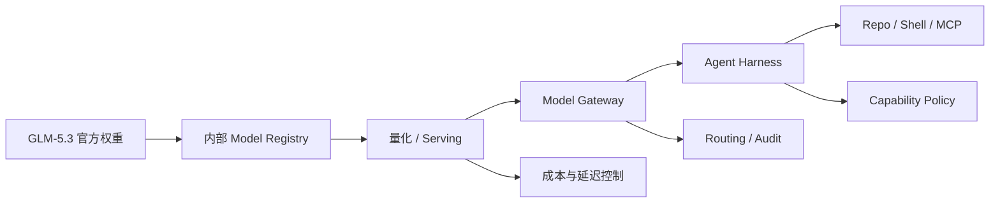

以上为企业部署分析抽象，不代表 Z.ai 官方架构。

**Mermaid 图示 B：开放旗舰模型准入流程**

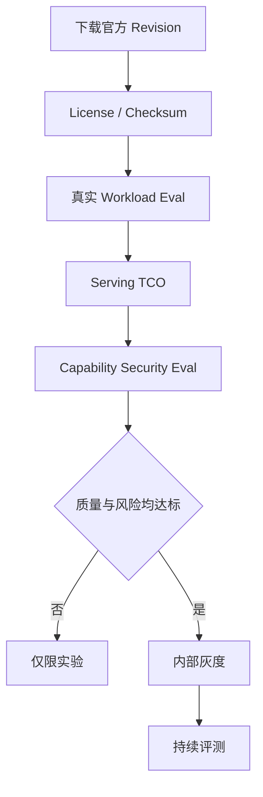

**来源**：
- [Z.ai GLM-5.3 官方模型页](https://huggingface.co/zai-org/GLM-5.3)
- [Z.ai GLM-5.3 发布说明](https://z.ai/blog/glm-5.3)

---

### 2. 腾讯 Hy4 preview 开放：770B-A49B、1M Context、Apache 2.0 与 Day-0 Serving 同时到位

- 类别：模型 / AI 编程 / Agent / 基础设施
- 信息状态：官方已确认
- 发布时间：2026-08-28
- 可用状态：已公开可用；开放权重；API / WorkBuddy / CodeBuddy 可用

**事实摘要**：腾讯发布并开放 Hy4 preview。官方参数为 770B 总参数、每 token 激活 49B，主干共 78 层：第一层为 Dense FFN，其余 77 层采用 MoE；每层包含 256 个 Routed Experts 与 1 个 Shared Expert，每 token 激活 Top-8 Routed Experts。模型另带原生 MTP 层用于 Speculative Decoding，上下文长度为 1M。

Attention 使用 Gated DeepSeek Sparse Attention，并引入 IndexCache 跨层复用稀疏索引；Residual 路径使用 iHC。官方已同步开放完整权重和 FP8 权重，License 为 Apache 2.0，并给出 vLLM 与 SGLang 的直接部署 Recipe 和 OpenAI-compatible API 示例。

**相较此前的变化**：这不是只公布技术报告，而是**模型、FP8 权重、Serving、产品入口和 API 价格同步上线**。腾讯 Cloud TokenHub 目前列出的 Hy4 preview 价格为每百万 Token 输入 6 元、输出 18 元、Cache Hit 0.3 元；发布同时进入 WorkBuddy、CodeBuddy 等产品。

相较 Hy3，Hy4 明显扩大了模型规模、Context 和 Post-training，并把目标场景进一步集中到 Coding、Office、Research 和复杂生产力任务。

**为什么重要**：今天最重要的结构性信号并不是“GLM 和 Hy4 谁 benchmark 高一点”，而是旗舰开放模型的生产生态已经开始 Day-0 完整化：Open Weight、FP8、vLLM、SGLang、Tool Parser、Reasoning Parser、API 和产品 Harness 几乎同时出现。

过去开放模型常见的问题是“模型发了，但要几周才能真正部署”；现在 Deployment Friction 正快速下降。这会直接增强企业多模型策略的可行性。

**实际影响**：企业模型选型应该逐步从品牌比较转向统一 workload。特别适合 Hy4 的测试包括长仓库 Coding、多文件 Office、Research Agent、长 Context Retrieval 和复杂 Tool Use。

腾讯还披露，Hy4 曾参与优化自身训练数据、评测、训练策略和低层 Operator，并称模型参与的推理优化使内部端到端吞吐相较基线提高 31.8%。这是值得关注的 AI-native Engineering 路线，但目前应标为厂商内部结果。

**角色视角**：
- AI Builder：可直接进入 Coding / Research / Office Agent PoC。
- 产品负责人：公开 API 价格使真实成功任务成本更容易比较。
- Tech Lead：Apache 2.0 + FP8 + vLLM/SGLang 显著降低实验阻力。
- 部门经理：开放旗舰供应商增加，对降低模型单点依赖有价值。

**可借鉴动作**：建立供应商无关 Agent Eval Harness，把 Hy4、GLM-5.3、Qwen、DeepSeek、Kimi 及当前闭源主模型放进同一个任务集，用统一 Tool Schema、Timeout 和 Pass Criteria 比较。

**风险与不确定性**：腾讯明确称其仍是 `preview`，并公开承认模型存在 reasoning 时间偏长、过度验证等问题。内部专家盲测和吞吐提升均属于腾讯自测，不应直接转化成生产结论。

**下一步观察**：
1. Hy4 正式版是否改变模型规格、License 或 Serving 要求；
2. 1M Context 在真实并发下的 KV / Sparse Attention 成本；
3. 独立 Coding / Office / Research Agent 任务表现。

**Mermaid 图示 A：Hy4 的主要计算路线**

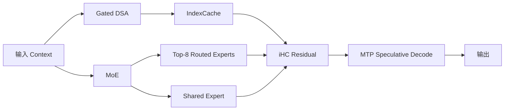

以上为基于腾讯公开规格的简化解释，不代表完整官方计算图。

**Mermaid 图示 B：从模型榜单转向 Workload Eval**

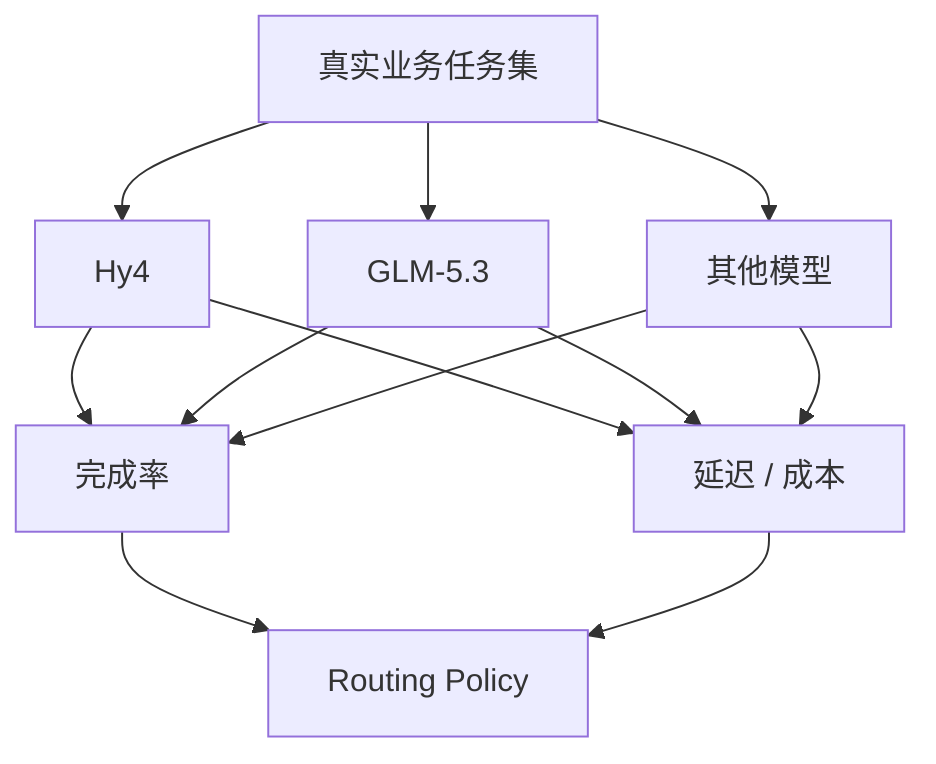

**来源**：
- [Tencent：Tencent Releases and Open-Sources Tencent Hy4 preview](https://www.tencent.com/tencent-releases-and-open-sources-tencent-hy4-preview/)
- [Tencent Hy4 preview 官方 GitHub](https://github.com/Tencent-Hunyuan/Hy4-preview)
- [Tencent Cloud TokenHub 模型价格](https://cloud.tencent.com/document/product/1823/130055)

---

### 3. Claude Code 2.1.251：模型切换正式成为 Hook 事件，Prompt Cache 成本进入可观测层，同时修复权限边界问题

- 类别：AI 编程 / Harness / 安全 / 成本治理
- 信息状态：官方产品更新
- 发布时间：2026-08-28
- 可用状态：已公开可用；CLI 更新

**事实摘要**：Anthropic 发布 Claude Code 2.1.251。版本新增 `PreModelSwitch` 和 `PostModelSwitch` Hook，可在模型切换前阻止、确认或加入上下文，并在切换后触发后续逻辑。Resume Session 的 `SessionStart` Hook 还会收到 Session Staleness 与预计 Re-cache Cost。

成本方面，`/usage` 新增 Spend Limit Bar，`/cost` 增加每 Session Prompt Cache 信息，包括 Hit Ratio、Miss、Re-cached Tokens 和 Warm / Cold 状态，同时提供结构化 `prompt_cache` 字段供 Status Line Script 使用。

**相较此前的变化**：过去选择 Claude 模型主要是用户操作或 Harness 内部行为；现在模型切换被提升为**可由 Runtime Policy 拦截的显式事件**。这意味着企业可以根据 Repo、数据敏感度、Budget 或任务类型决定某次模型切换是否允许。

此次版本同时包含值得重视的安全修复，包括文件工具在权限检查后遭遇 Symlink Swap 时可能读写批准目录之外、Plugin Marketplace 路径可能越出插件目录、部分 Project Settings 可以改变详细 Tracing / Raw API Body Logging，以及 Grep / Glob 对 Symlink 路径应用 Deny Rules 不完整等问题。

**为什么重要**：这些安全问题共同说明：Coding Agent 的权限边界已经无法用一个简单的 Allow/Deny Tool List 表达。文件系统路径会变化、Plugin 会加载代码、Telemetry 可能外发内容、Model Switch 会改变成本甚至数据政策，而 Session Resume 又改变 Context Cache 状态。

Prompt Cache 也越来越不只是供应商优化，而是 Agent FinOps 的直接变量。一个长 Session 如果因为切模型或长时间休眠发生 Cache Cold，真实任务成本可能远高于单看 Model Token Price 得出的结论。

**实际影响**：高权限环境中的 Claude Code 应优先升级。企业 Harness 可以利用 `PreModelSwitch` 实现模型治理，例如：机密 Repo 只能切换到特定模型；高价模型需要确认；Cache 重建成本过高时避免无意义切换。

**角色视角**：
- AI Builder：可以直接看到 Prompt Cache 对任务成本的影响。
- Tech Lead：本次 Symlink / Plugin / Telemetry 修复值得作为安全升级处理。
- 产品负责人：自动模型路由可以有明确的用户确认与成本 UX。
- 部门经理：模型使用和 Spend Limit 可以更直接进入预算治理。

**可借鉴动作**：升级到 2.1.251 后，在 `PreModelSwitch` 记录 `session_id → source_model → target_model → reason → estimated_recache_cost`，并将 Cache Hit、Tool Calls、总 Token 和最终 Outcome 汇总到同一个 task trace。

**风险与不确定性**：Claude Code Hook 只能治理 Claude Code 自身发生的模型切换，不能自动覆盖所有外部 Model Gateway。安全补丁也意味着旧版本的高权限环境可能确实存在风险，因此不能只把此版本当普通功能升级。

**下一步观察**：
1. Model Switch 是否进一步支持 centrally managed enterprise policy；
2. Prompt Cache 指标是否正式进入 OpenTelemetry；
3. Claude Code 是否出现基于 Cost / Quality 的自动 Model Routing。

**Mermaid 图示 A：Model Switch 成为 Policy Event**

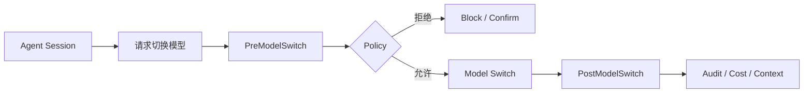

**Mermaid 图示 B：Prompt Cache 如何进入任务经济性**

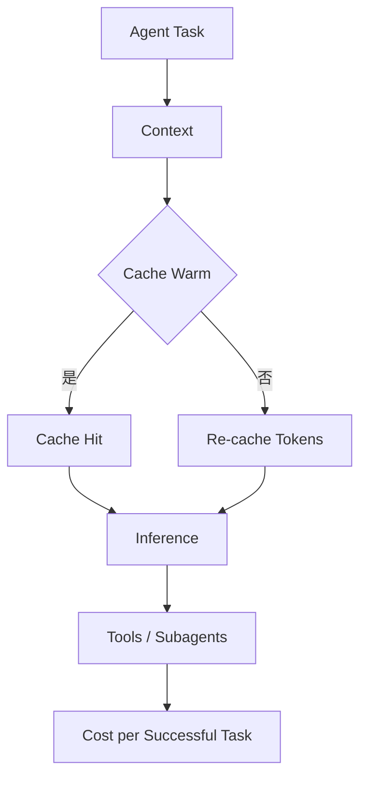

**来源**：
- [Anthropic Claude Code 官方 CHANGELOG](https://github.com/anthropics/claude-code/blob/main/CHANGELOG.md)
- [Claude Code npm Package](https://www.npmjs.com/package/@anthropic-ai/claude-code)

---

### 4. GitHub Copilot 公布企业 Policy 与 Billing 重构：Chat Retention 将从 28 天延长到账号生命周期

- 类别：AI 编程 / Agent / 安全 / 成本治理
- 信息状态：官方产品更新
- 发布时间：2026-08-28
- 可用状态：已公告；具体变化将在 9 月和 10 月陆续生效

**事实摘要**：GitHub 公布三组 Copilot 企业变化。9 月 1 日起逐步恢复部分 Copilot Business / Enterprise 新注册并强化 Account Vetting；新增 Seat 需要先支付后获得访问。对现有信用卡 / PayPal 企业客户，Assigned Seat Upfront Billing 将从 10 月 1 日开始生效，但 Business / Enterprise Seat 单价本身不变。

不早于 9 月 28 日，Copilot Chat on github.com、GitHub Mobile 与 Copilot Cloud Agent 将统一成同一 Experience 与 Policy，并默认启用。

**相较此前的变化**：最值得企业注意的是 Data Retention：github.com 上 Copilot 会全面迁移到 Agent Sessions Experience，**Chat Data 保留期将由 28 天变成 Account Lifetime**，与 Cloud Agent 对齐。若企业退出新的 Unified Experience，则新的 github.com / Mobile Copilot 将不可用。

GitHub 同时计划把 Copilot Code Review 的默认 Effort 从 Lite 改为 Balanced。希望继续使用 Lite 的组织需要显式配置。

**为什么重要**：AI Coding 产品正在从“Chat 功能”升级成持久 Agent Session，而 Retention、Billing、Cloud Execution 与 Code Review Policy 也开始围绕同一 Runtime 收敛。

对受监管企业而言，这是比普通 UI 更新重要得多的变化：同一产品升级后，数据保存期限可能从 28 天变成账号生命周期，直接影响 Legal Hold、Privacy、DLP 和内部数据治理。

**实际影响**：Enterprise Admin 应在 9 月 28 日之前主动复核 Copilot Policy，而不是等待默认迁移。采购 / FinOps 团队同时应确认 Seat Billing、Included Usage、Additional Usage 与 Spend Controls 的组合效果。

**角色视角**：
- Tech Lead：重新检查 Cloud Agent 与 Code Review 默认策略。
- 部门经理：Seat Assignment 现在更直接影响提前计费。
- 安全 / 合规：Retention 从 28 天到 Account Lifetime 是实质治理变化。
- 产品负责人：Agent Session 持久化会提升连续体验，但也扩大数据生命周期。

**可借鉴动作**：建立一张 Copilot Enterprise Migration Checklist，至少覆盖 Unified Experience、Chat Retention、Cloud Agent、Code Review Effort、Seat Assignment、Additional Usage、Spend Controls，并由 Engineering、Security 和 Procurement 联合确认。

**风险与不确定性**：这些是即将生效的规则，而不是今天所有账户都已变化。GitHub 明确使用“不早于 9 月 28 日”，实际 rollout 仍可能调整。

**下一步观察**：
1. Unified Experience 的最终生效日期；
2. 是否增加更细的企业 Retention Controls；
3. Balanced Code Review 对 Premium Usage 的实际成本。

**Mermaid 图示**

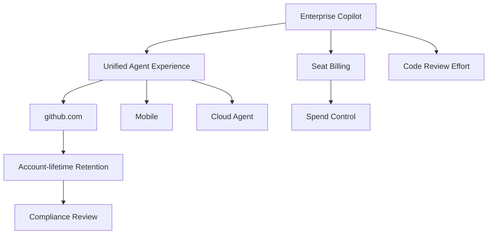

**来源**：
- [GitHub：Upcoming changes to GitHub Copilot policies and billing](https://github.blog/changelog/2026-08-28-upcoming-changes-to-github-copilot-policies-and-billing/)

---

### 5. 美国联邦法院阻止五角大楼将 Anthropic 列为供应链风险：模型 Usage Policy 已经成为供应商连续性问题

- 类别：政策与产业 / 安全
- 信息状态：权威媒体报道 / 法院裁决
- 发布时间：2026-08-28 09:27（Asia/Singapore）
- 可用状态：不适用

**事实摘要**：Reuters 报道，美国联邦地区法官 Rita Lin 阻止五角大楼将 Anthropic 指定为国家安全供应链风险，并在裁决中称该决定“illegal and baseless”。此前五角大楼与 Anthropic 的冲突涉及 Claude 是否可被用于美国国内大规模监控和全自主武器等用途。

该指定此前可能限制 Anthropic 参与部分军事合同；Reuters 指出，这是美国首次公开使用相关供应链风险法规指定一家美国公司。

**相较此前的变化**：**此前已知**：Anthropic 已遭供应链风险指定并提起诉讼。**今日新增**：法院实质阻止该指定，使 Anthropic 在这条诉讼线上获得重要阶段性结果。不过另一相关诉讼仍在进行，政府也可能继续采取法律行动。

**为什么重要**：这件事把“AI Safety Policy”从模型层问题变成供应商治理问题。企业通常评估模型供应商时关注 Uptime、Cost、Security 和 Data Residency，但现在还必须加入：**供应商是否可能因为自身 Usage Policy 与政府或大型客户产生冲突，从而影响业务连续性？**

这对国防、政府、关键基础设施和高度监管行业尤其重要。

**实际影响**：多模型策略不应该只做技术 Failover，也应评估 Policy Continuity。即使两个 Provider 的模型能力非常接近，其 Usage Policy、政府关系和合同边界也可能不同。

**角色视角**：
- 产品负责人：高监管用途需要提前识别供应商 Usage Restrictions。
- Tech Lead：关键业务应保留 Provider Failover。
- 部门经理：采购 Scorecard 应加入政策和合同连续性。
- 安全团队：安全限制既可以降低技术风险，也可能引入新的供应链风险。

**可借鉴动作**：在 Model Supplier Scorecard 中加入四列：`Usage-policy compatibility`、`Government / Regulatory exposure`、`Contract continuity`、`Fallback provider`。

**风险与不确定性**：这是地区法院裁决，不代表所有相关争议终结，也不代表法院对 Anthropic 所有安全观点做出肯定。后续上诉或另一诉讼仍可能改变状态。

**下一步观察**：
1. 美国政府是否提出上诉；
2. Anthropic 第二起相关案件的结果；
3. 美国政府 AI 合同是否逐渐形成标准化 Usage Policy 条款。

**来源**：
- [Reuters：US judge blocks Pentagon's Anthropic blacklisting](https://www.reuters.com/legal/government/us-judge-blocks-pentagons-anthropic-blacklisting-2026-08-28/)

---

### 6. NVIDIA TensorRT Model Connect：开放模型从 Checkpoint 到 Native C++ 推理被压缩成标准化两阶段流程

- 类别：基础设施 / 模型部署 / AI-native SDLC
- 信息状态：官方产品更新
- 发布时间：2026-08-28
- 可用状态：已公开可用；开放参考实现

**事实摘要**：NVIDIA 发布 TensorRT Model Connect 开发流程，用于将受支持的 Hugging Face 或本地模型 Checkpoint 转换为 TensorRT 可直接使用的 Deployment Bundle。模型准备阶段可通过类似 `trtmc build <model-id>` 的 CLI 构建 Bundle；生产 C++ 应用随后直接加载 Bundle，不要求 PyTorch 或 Python Interpreter 存在于 Runtime 中。

Model Connect 提供 Semantic API 与更低层 Module API，并允许通过 TVM FFI 插入自定义 GPU Kernel。

**相较此前的变化**：传统 Open Model → TensorRT Native App 通常需要逐模型处理 Export、Operator、Pre/Post-processing、Custom Plugin 和 C++ Glue。Model Connect 尝试把这些差异收敛成模型级 Reference Implementation 与标准 Bundle。

NVIDIA 还明确表示，该项目本身采用 AI-native Development：Coding Agents 在人工指导和审核下参与 Model Implementation、Integration、Test 和 Documentation，并以较快 Release 节奏追随开放模型。

**为什么重要**：开放模型更新越来越快，但 Production Serving Integration 往往仍需要数周。随着模型能力逐渐接近，**Deployment Friction 很可能成为模型实际采用率的重要决定因素**。

对于桌面、游戏、机器人、边缘设备和高性能后端，“不需要 Python Runtime”也有现实的部署和维护价值。

**实际影响**：企业可以把“模型构建”和“在线执行”进一步分开：CI 生成经过验证的 Bundle，生产 Runtime 只加载受批准 Artifact。这种模式也有利于版本 pin、Checksum、Rollback 和供应链审计。

**角色视角**：
- AI Builder：新的开放模型更容易进入 Native App。
- Tech Lead：减少模型特定 C++ Glue Code。
- 产品负责人：模型从实验到上线的时间可能缩短。
- 部门经理：Serving Engineering 的持续维护成本有机会下降。

**可借鉴动作**：选一个当前通过 Python / PyTorch Serving 的低延迟模型做对照 PoC，比较 Model Connect 在 P95 latency、启动依赖、镜像体积、升级复杂度、Debug 和版本管理上的真实差异。

**风险与不确定性**：它不是“所有 Hugging Face 模型自动变 TensorRT”。每种模型仍需要 Reference Implementation 与 Operator Coverage，且实际性能收益高度依赖模型结构和 GPU。

**下一步观察**：
1. 新模型发布到 Model Connect 支持之间的平均时间；
2. 社区是否贡献大量第三方 Model Implementations；
3. Model Connect 与 vLLM / SGLang 在 Native / Server 场景中的边界。

**Mermaid 图示**

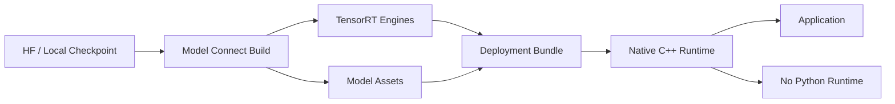

**来源**：
- [NVIDIA：Deploy an Open Model from Checkpoint to Inference in Two Commands](https://developer.nvidia.com/blog/deploy-an-open-model-from-checkpoint-to-inference-in-two-commands-with-nvidia-tensorrt-model-connect/)
- [TensorRT Model Connect GitHub](https://github.com/NVIDIA/TensorRT-Model-Connect)

---

### 7. OpenAI 发布 Rosalind Workbench：垂直 Agent 的竞争从“领域模型”推进到“领域工作环境”

- 类别：Agent / Harness / 研究
- 信息状态：官方产品更新
- 发布时间：2026-08-28
- 可用状态：Research Preview；通过 ChatGPT App 提供

**事实摘要**：OpenAI 发布 Rosalind Workbench Research Preview，为生命科学研究者提供统一 ChatGPT 工作环境。Workbench 集成 Guided Scientific Tasks、专业 Viewer、Sequencing / NGS 分析和科学工具，让研究问题、数据、Plan、中间 Artifact 与 Evidence 保持在同一个上下文中。

当前包括 Molecular Structure Viewer、Biological Sequence & Alignment、Slide Viewer 等工具，并支持从 FASTQ 数据开始组织 Quality Control、Bulk RNA-seq 和 Single-cell 等工作流。

**相较此前的变化**：GPT-Rosalind 模型此前已经发布，因此今天真正新增的是**Domain Harness / Workbench**。科学研究者过去需要在 Chat、Notebook、Viewer、Bioinformatics Tool 和原始数据之间反复搬运上下文；Workbench 尝试把这些元素组织成持续任务空间。

**为什么重要**：这是垂直 Agent 产品设计的一个典型信号：模型本身往往不是最重要的产品壁垒。专业工作真正需要的是特定 Artifact、Tool、Viewer、Provenance、Workflow 与 Approval。

Coding Agent 已经证明了同样的事情：一个模型在普通 Chat 中会写代码，并不等于一个可以读取 Repo、运行 Test、执行 Shell 的 Coding Harness。

**实际影响**：做法律、金融、研发、设计或工业 Agent 的团队应该少做“领域 Chatbot”，更多设计领域原生 Artifact 和 Tool Runtime。产品路线的核心问题应该变成“这个专家今天在哪些工具之间搬数据”，而不仅是“Prompt 应怎么写”。

**角色视角**：
- AI Builder：Domain Artifact 应成为一等 Context。
- 产品负责人：垂直 AI 产品应围绕完整 Workflow 构建。
- Tech Lead：Tool Version、Data Lineage 与 Provenance 要可追踪。
- 部门经理：衡量 Research Cycle Time，而不是聊天满意度。

**可借鉴动作**：选择一个内部专业工作流，列出用户每天要在 5–10 个工具之间移动的 Artifact；优先统一这些 Artifact、权限和上下文，再决定应该调用哪一个模型。

**风险与不确定性**：Rosalind Workbench 仍是 Research Preview，生命科学本身属于高风险专业领域；实验设计、数据分析和科学解释仍需要专家审核。

**下一步观察**：
1. 是否提供 Workbench API / SDK；
2. 第三方 scientific tools 和 Artifact 类型是否开放扩展；
3. 这种 Domain Workbench 模式是否快速复制到其他专业行业。

**Mermaid 图示**

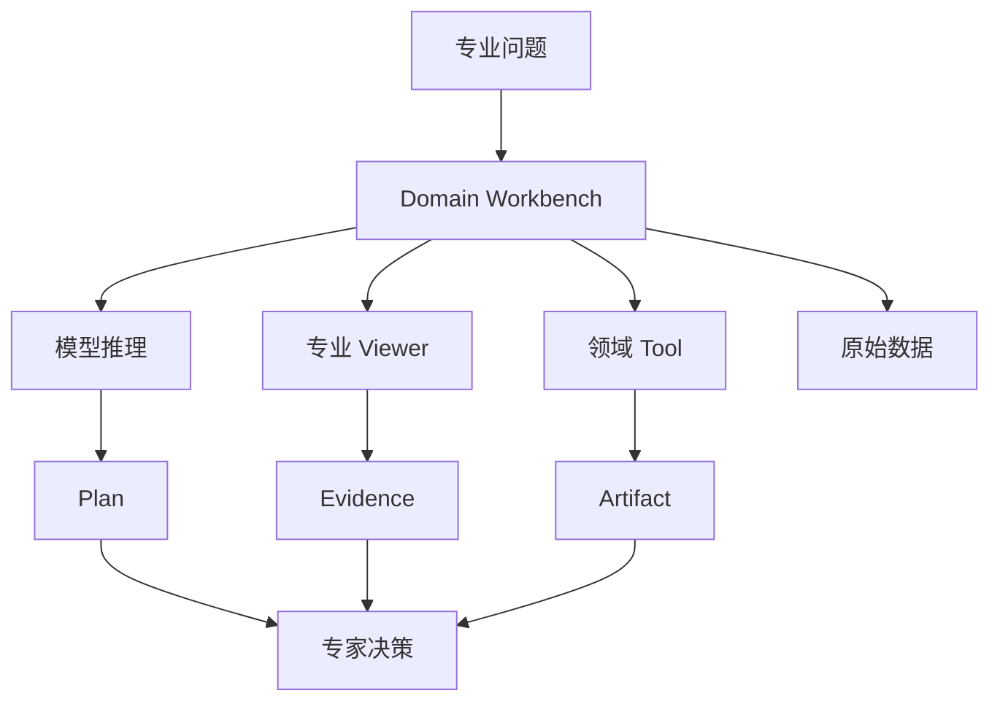

**来源**：
- [OpenAI Developers：Rosalind Workbench](https://developers.openai.com/blog/rosalind-workbench)
- [OpenAI：Introducing GPT-Rosalind](https://openai.com/index/introducing-gpt-rosalind/)

## C. 其他值得关注

**1. GitHub Copilot in Visual Studio 把组织级 Custom Agents、Thinking Effort 和模型 Cost 信息直接带进 IDE。** GitHub Organization / Enterprise Owner 可以发布可被 Visual Studio 自动发现的 Custom Agents；支持的模型可选择 Low / Medium / High Thinking Effort，并展示 Context Window 与 Cost 信息。它没有达到今天核心新闻前 7 条的影响级别，但进一步证明 IDE 正从“Copilot UI”演化成企业 Harness Frontend。来源：[GitHub Copilot in Visual Studio — August update](https://github.blog/changelog/2026-08-28-github-copilot-in-visual-studio-august-update-2/)

**2. GitHub 本周 Copilot 汇总显示 Agent Session 正快速跨客户端统一。** Copilot CLI 新增默认 Execution / Permission Mode、改进 Plugin / MCP / Skill 管理以及异常退出后的 Session 恢复；Slack / Teams 可以把团队对话变成共享 Agent Session。相较今天的企业 Policy 和 Claude Code 更新，这些更适合作为趋势观察，而非单独核心新闻。来源：[GitHub Copilot weekly releases — August 24](https://github.blog/changelog/2026-08-28-github-copilot-weekly-releases-august-24/)

## D. 今日 AI 趋势总结

### 已有事实支持的趋势

**趋势 1：开放模型的竞争指标正在从 Benchmark 转向 Deployment Friction。** GLM-5.3 和 Hy4 一开放，就已经拥有 vLLM、SGLang、量化 / FP8、OpenAI-compatible API 等生产路线。未来“模型多强”与“模型多快能进入你的 Harness”会同样重要。

**趋势 2：Coding Harness 正成为真正的 Runtime Control Plane。** Claude Code 的 Model Switch Hooks、Prompt Cache 与权限边界修复，GitHub 的 Persistent Agent Sessions、Retention 与 Spend Policy，都说明长期平台资产是 Model + Tool + Context + Identity + Cost + Policy，而不是固定某一个模型。

**趋势 3：Agent FinOps 正从 Token 单价进入 Session / Task 经济性。** Cache Hit、Re-cache、Model Switch、Thinking Effort、Seat Billing 和 Additional Usage 都开始被产品直接暴露。未来更合理的指标是 Cost per Successful Task。

**趋势 4：垂直 Agent 的壁垒正在从领域知识转向领域 Workbench。** Rosalind Workbench 表明专业领域真正需要的是 Artifact、Viewer、Tool、Data Lineage 和可重复 Workflow。

### 分析推断

**推断 1：2026 下半年，“高能力开放模型 + 企业 Harness”会成为闭源旗舰 API 的更现实替代路线。** 不是所有任务都值得自部署，但在 Data Residency、成本、模型可控性和供应商冗余要求高的场景，开放旗舰的吸引力会越来越高。

**推断 2：模型网关最终会演化成 Workload Control Plane。** Gateway 不再只决定“调用 Claude 还是 GLM”，还需要决定 Model、Reasoning Effort、Cache、Tool Permission、数据边界、成本和 Failover。

**今日趋势总览**

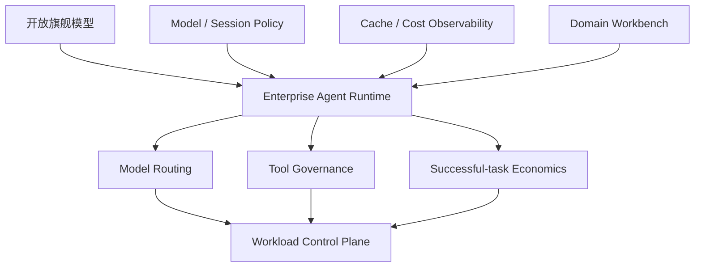

## E. 今日建议关注或采取的动作

1. **角色：AI Builder / Tech Lead｜建议动作：把 GLM-5.3 与 Hy4 放进同一套真实 Agent Eval。** 不重跑厂商榜单，重点测仓库 Coding、长任务、Tool Use、并发和成功任务成本。**为什么现在做**：两款旗舰开放模型在同一窗口进入实际可部署状态。**动作类型：安排测试。**

2. **角色：Tech Lead / Security｜建议动作：优先升级 Claude Code 2.1.251。** 同时检查 Symlink、Plugin Path、Telemetry / Raw Body Logging 与现有 Hook Policy。**为什么现在做**：此次包含明确权限边界安全修复。**动作类型：立即执行。**

3. **角色：AI Platform｜建议动作：把 Model Switch、Prompt Cache、Reasoning Effort 和最终 Outcome 纳入统一 Task Trace。** **为什么现在做**：Harness 已经开始原生暴露这些 FinOps 信号。**动作类型：纳入路线图。**

4. **角色：部门经理 / Security / Procurement｜建议动作：在 9 月前完成 GitHub Copilot Enterprise Policy Review。** 重点确认 Chat Retention、Cloud Agent、Seat Billing 和 Code Review Effort。**为什么现在做**：默认策略将在未来数周发生实质变化。**动作类型：检查风险。**

---

<!-- English Version -->
# AI Daily Headlines｜2026-08-29

- Language: English
- Time zone: Asia/Singapore
- News window: 2026-08-28 07:30 to 2026-08-29 07:30
- Research cutoff: 2026-08-29 09:36
- Core stories: 7
- Other notable items: 2

## A. The 3 Most Important Things Today

**1. GLM-5.3 officially opened its weights, turning the mid-August flagship launch into a genuinely self-deployable model today.** GLM-5.3 had already been available through Z.ai APIs, but the official weights are now on Hugging Face with deployment paths for Transformers, vLLM, SGLang, KTransformers, Unsloth, Ascend, and others. For enterprises, the key change is not simply another model release: a high-capability Coding / long-horizon Agent model has moved from a provider-hosted service into an asset that can enter internal model supply chains, private inference, and security governance.

**2. Tencent launched Hy4 preview under Apache 2.0: 770B total parameters, 49B active, 1M context, directly competing for the open flagship Agent-model tier.** FP8 weights, Day-0 vLLM / SGLang serving, an OpenAI-compatible API, WorkBuddy / CodeBuddy integration, and explicit API pricing all arrived together. GLM-5.3 and Hy4 entering open-weight status in the same news window is a stronger signal than any individual benchmark: the open-model frontier is shifting from “can I download it?” toward “how quickly can it enter an enterprise Harness and production serving stack?”

**3. Claude Code 2.1.251 is a priority Harness update: model switching becomes policy-interceptable, prompt caching becomes a visible cost variable, and multiple permission-boundary issues are fixed.** `PreModelSwitch` / `PostModelSwitch` Hooks allow organizations to block, confirm, and audit model changes; `/cost` adds cache hit/miss/re-cache information; and the official changelog also fixes symlink races, plugin path traversal, tracing-policy bypasses, and related issues. Coding-Agent governance is expanding from tool allowlists toward model, path, cache, telemetry, and session-lifecycle control.

## B. Core Stories

### 1. GLM-5.3 officially opens its weights: a flagship Coding / Agent model enters enterprise-controlled deployment

- Category: Model / AI Coding / Agent / Security
- Information status: Officially confirmed
- Published: 2026-08-28; exact time not published
- Availability: Publicly available; open weights; local / private deployment supported

**Fact summary**: Z.ai has officially published `zai-org/GLM-5.3` in its Hugging Face organization. GLM-5.3 uses the same base model as GLM-5.2, with Z.ai explicitly attributing its capability gains primarily to post-training. The official model card includes Coding, Agent, Tool-use, and Cyber evaluations and provides local deployment through Transformers, vLLM, SGLang, TokenSpeed, KTransformers, and Unsloth, plus Ascend NPU support through vLLM-Ascend, xLLM, and SGLang.

GLM-5.3 uses a dedicated `GLM-5.3 License`, which differs from the MIT license used by GLM-5.3-Flash. Enterprises should therefore perform a separate license review before adding it to a production catalog.

**What changed versus before**: **Previously known**: GLM-5.3 launched in mid-August through Z.ai services and APIs, and Z.ai said expanded post-training produced unexpectedly strong vulnerability discovery and exploitation capabilities, requiring additional safety evaluation before open-weight release. **New today**: the official weights are actually obtainable and mainstream open serving stacks support them.

This is a material engineering state change. With an API-only model, routing, logging, caching, quantization, upgrade cadence, and data boundaries are mainly controlled by the provider. Open weights let enterprises move those controls into their own model gateway, inference cluster, and security plane.

**Why it matters**: GLM-5.3 is especially notable because its capability emphasis includes Coding, long-horizon Agents, and Cyber. Z.ai reports strong CyberGym, ExploitGym, DeepSWE, and related scores, but these should be treated first as vendor evaluations rather than evidence that the model can safely receive unrestricted tool permissions.

The more useful enterprise question is: **as model capability rises, can the Harness constrain its capabilities effectively?** A model with Shell, repository, network, MCP, and package-manager access has a very different risk profile from the same model used only for text generation.

**Practical impact**: Teams with multi-model gateways should add GLM-5.3 to real Agent workload benchmarks while adding a parallel capability-security evaluation. Beyond code generation, test repository boundaries, shell commands, network egress, package installation, hostile README / prompt injection, secrets, MCP permissions, and long-task drift.

The flagship total-parameter footprint still implies substantial storage and compute requirements. “Open weight” should not be confused with “cheap to run on an ordinary workstation.” Data-center FP8 / multi-GPU serving is more realistic, while GLM-5.3-Flash may remain the more economical default for many workloads.

**Role perspective**:
- AI Builder: add it to Coding, Research, and long-horizon Agent testing.
- Product owner: open weights reduce provider lock-in but not automatically total TCO.
- Tech Lead: quality, serving TCO, and capability security should be evaluated together.
- Department manager: an important new option for data residency, private deployment, and model control.

**Action to borrow**: Create an admission standard for high-capability open models. In addition to quality evals, require network-egress, filesystem-boundary, prompt-injection, secret-access, package-supply-chain, tool-permission, and long-task abnormal-behavior tests before adding a model to the internal catalog.

**Risks and uncertainty**: Official benchmark configuration, Harness choice, and context budgets may differ substantially from production. GGUF, FP8, and low-bit derivatives may also behave differently from official weights on tool use, long context, and safety.

**Next signals to watch**:
1. Independent Agentic Coding / Cyber evaluations;
2. Tool-use and long-context degradation after quantization;
3. Enterprise legal interpretation of the GLM-5.3 License.

**Mermaid diagram A: new enterprise control surfaces after open-weight availability**

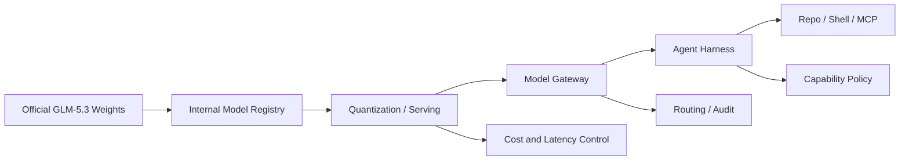

This is an enterprise deployment abstraction, not Z.ai's official architecture.

**Mermaid diagram B: flagship open-model admission process**

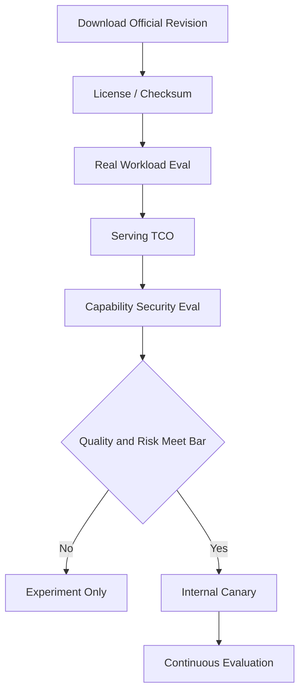

**Sources**:
- [Official Z.ai GLM-5.3 model](https://huggingface.co/zai-org/GLM-5.3)
- [Z.ai GLM-5.3 release](https://z.ai/blog/glm-5.3)

---

### 2. Tencent opens Hy4 preview: 770B-A49B, 1M context, Apache 2.0, and Day-0 production serving

- Category: Model / AI Coding / Agent / Infrastructure
- Information status: Officially confirmed
- Published: 2026-08-28
- Availability: Publicly available; open weights; API / WorkBuddy / CodeBuddy available

**Fact summary**: Tencent released Hy4 preview with 770B total parameters and 49B activated per token. Its 78-layer backbone uses one dense FFN layer followed by 77 MoE layers, each with 256 routed experts and one shared expert, activating the top eight routed experts per token. A native MTP layer supports speculative decoding, and the context window is 1M.

Attention uses Gated DeepSeek Sparse Attention with IndexCache for cross-layer sparse-index reuse, while the residual path uses iHC. Tencent has released full and FP8 weights under Apache 2.0, with direct vLLM and SGLang recipes and an OpenAI-compatible API.

**What changed versus before**: This is not merely a technical report. **The model, FP8 weights, serving stack, product access, and API pricing launched together.** Tencent Cloud TokenHub currently lists Hy4 preview at RMB 6 per million input tokens, RMB 18 per million output tokens, and RMB 0.3 per million cache-hit tokens. It also enters WorkBuddy and CodeBuddy.

Compared with Hy3, Tencent has materially increased model scale, context, and post-training, with stronger emphasis on Coding, Office, Research, and complex productivity tasks.

**Why it matters**: The structural signal is more important than whether GLM or Hy4 scores slightly higher on one benchmark. Open flagship models are gaining complete Day-0 production ecosystems: open weights, FP8, vLLM, SGLang, tool parsers, reasoning parsers, APIs, and product Harnesses appear almost simultaneously.

Historically, open models often launched weeks before they became operationally convenient. Deployment friction is falling quickly, making multi-model enterprise architectures substantially more practical.

**Practical impact**: Enterprises should move from brand-based comparisons to a unified workload suite. Useful Hy4 tests include long-repository coding, multi-file office work, research agents, long-context retrieval, and complex tool use.

Tencent also says Hy4 contributed to optimization of its own data strategy, evaluation, training processes, and low-level operators, with model-assisted inference optimization improving end-to-end throughput by 31.8% versus an internal baseline. This is an interesting AI-native engineering direction but remains vendor-reported evidence.

**Role perspective**:
- AI Builder: direct candidate for Coding / Research / Office Agent PoCs.
- Product owner: explicit API pricing enables successful-task-cost comparison.
- Tech Lead: Apache 2.0 + FP8 + vLLM/SGLang lowers experimentation friction.
- Department manager: more open flagship suppliers reduce single-model dependency.

**Action to borrow**: Build a provider-neutral Agent Eval Harness and run Hy4, GLM-5.3, Qwen, DeepSeek, Kimi, and your closed flagship through identical tasks, tool schemas, timeouts, and pass criteria.

**Risks and uncertainty**: Tencent explicitly labels Hy4 a `preview` and acknowledges over-reasoning and over-verification. Its internal blind tests and 31.8% throughput improvement remain internal measurements.

**Next signals to watch**:
1. Final Hy4 specifications, license, and serving requirements;
2. Real concurrency cost at 1M context;
3. Independent Coding / Office / Research Agent workloads.

**Mermaid diagram A: major Hy4 computation path**

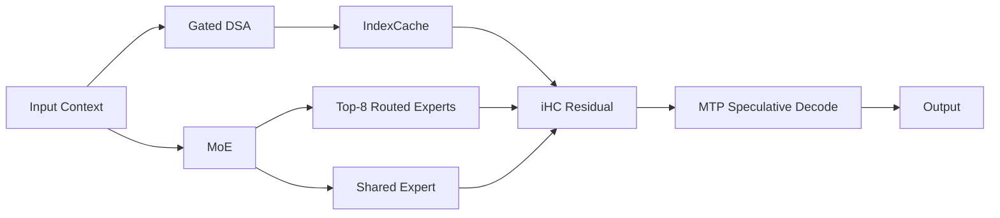

This is a simplified explanation based on Tencent's public specifications, not the full official computation graph.

**Mermaid diagram B: move from model leaderboards to workload evaluation**

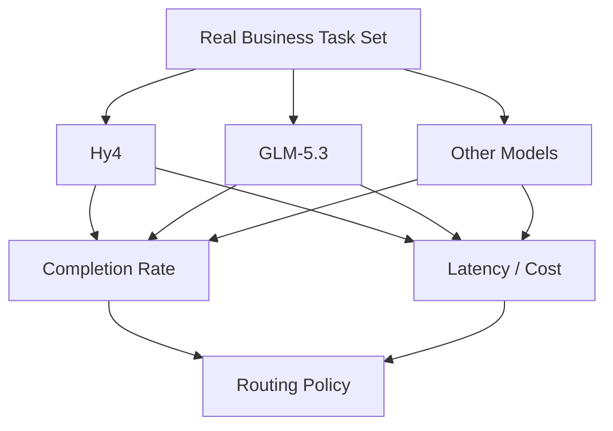

**Sources**:
- [Tencent: Tencent Releases and Open-Sources Tencent Hy4 preview](https://www.tencent.com/tencent-releases-and-open-sources-tencent-hy4-preview/)
- [Tencent Hy4 preview official GitHub](https://github.com/Tencent-Hunyuan/Hy4-preview)
- [Tencent Cloud TokenHub model pricing](https://cloud.tencent.com/document/product/1823/130055)

---

### 3. Claude Code 2.1.251 makes model switching a Hook event, exposes prompt-cache economics, and fixes permission-boundary issues

- Category: AI Coding / Harness / Security / Cost Governance
- Information status: Official product update
- Published: 2026-08-28
- Availability: Publicly available CLI update

**Fact summary**: Anthropic released Claude Code 2.1.251 with `PreModelSwitch` and `PostModelSwitch` Hooks. A Harness can block, confirm, or add context before a switch and react afterward. Resume-session `SessionStart` Hooks also receive session staleness and estimated re-cache cost.

Cost observability improves through a spend-limit bar in `/usage` and per-session prompt-cache information in `/cost`, including hit ratio, misses, re-cached tokens, and warm/cold state, with structured `prompt_cache` data available to status-line scripts.

**What changed versus before**: Model selection used to be mostly a user action or an internal Harness decision. It is now an **explicit runtime event that enterprise policy can intercept**. That allows model switches to depend on repository, data sensitivity, budget, or workload.

The release also fixes security issues including file tools following a symlink swapped after permission validation, plugin paths escaping their plugin directory, some project settings changing detailed tracing / raw API-body logging, and incomplete deny-rule enforcement through symlinked search paths.

**Why it matters**: These issues demonstrate that Coding-Agent permission boundaries cannot be represented by a simple tool allow/deny list. File paths change, plugins execute code, telemetry can exfiltrate content, model switching changes policy and cost, and resumed sessions alter cache state.

Prompt Cache is also becoming an Agent-FinOps variable rather than merely a provider optimization. A stale session or model switch can create large re-cache costs even when model list prices remain unchanged.

**Practical impact**: High-permission Claude Code environments should prioritize the upgrade. Enterprise Harnesses can use `PreModelSwitch` to enforce rules such as approved-model requirements for sensitive repositories or confirmation before switching to higher-cost models.

**Role perspective**:
- AI Builder: prompt-cache impact is visible at task level.
- Tech Lead: symlink, plugin, and telemetry fixes justify a security-priority upgrade.
- Product owner: model routing can gain explicit cost and confirmation UX.
- Department manager: model selection and spend limits can enter formal budget governance.

**Action to borrow**: After upgrading, log `session_id → source_model → target_model → reason → estimated_recache_cost` in `PreModelSwitch`, then correlate cache hits, tool calls, tokens, and final outcome in one task trace.

**Risks and uncertainty**: Claude Code Hooks govern model switches inside Claude Code, not every external gateway. The security fixes also imply that older high-permission installations may have meaningful exposure.

**Next signals to watch**:
1. Centrally managed enterprise model-switch policy;
2. Prompt-cache metrics entering OpenTelemetry;
3. Automatic cost/quality model routing in Claude Code.

**Mermaid diagram A: model switching becomes a policy event**

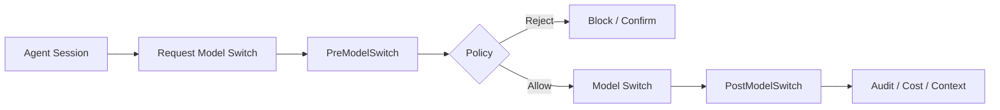

**Mermaid diagram B: prompt cache enters task economics**

**Sources**:
- [Anthropic Claude Code official CHANGELOG](https://github.com/anthropics/claude-code/blob/main/CHANGELOG.md)
- [Claude Code npm package](https://www.npmjs.com/package/@anthropic-ai/claude-code)

---

### 4. GitHub announces major Copilot enterprise policy and billing changes; github.com chat retention will move from 28 days to account lifetime

- Category: AI Coding / Agent / Security / Cost Governance
- Information status: Official product update
- Published: 2026-08-28
- Availability: Announced; changes roll out through September and October

**Fact summary**: GitHub announced three upcoming Copilot enterprise changes. Beginning September 1, it will gradually re-enable certain Copilot Business / Enterprise signups while strengthening account vetting. New seat assignments must be paid before access, and assigned-seat upfront billing begins for affected existing credit-card / PayPal customers on October 1, while Business / Enterprise list prices remain unchanged.

No earlier than September 28, Copilot Chat on github.com, GitHub Mobile, and Copilot Cloud Agent will converge into one experience and policy, enabled by default.

**What changed versus before**: The most important enterprise change is retention. Copilot on github.com will fully move to the Agent Sessions experience, and **chat-data retention changes from 28 days to the lifetime of the account**, aligning with Cloud Agent. Organizations that opt out of the unified experience will lose the new github.com / Mobile Copilot experience.

GitHub will also change the default Copilot Code Review effort from Lite to Balanced unless an organization explicitly configures otherwise.

**Why it matters**: AI Coding products are evolving from “chat features” into persistent Agent-session runtimes, with retention, billing, cloud execution, and review policy converging around the same runtime.

For regulated enterprises, a shift from 28-day retention to account-lifetime retention has direct implications for legal hold, privacy, DLP, and governance.

**Practical impact**: Enterprise administrators should review Copilot policy before September 28 rather than accept defaults. Procurement and FinOps teams should also validate seat billing, included usage, additional usage, and spend controls.

**Role perspective**:
- Tech Lead: revisit Cloud Agent and Code Review defaults.
- Department manager: seat assignments more directly affect upfront spend.
- Security / Compliance: retention is a material governance change.
- Product owner: persistent Agent sessions improve continuity but enlarge the data lifecycle.

**Action to borrow**: Create a Copilot Enterprise migration checklist covering Unified Experience, Chat Retention, Cloud Agent, Code Review Effort, Seat Assignment, Additional Usage, and Spend Controls, reviewed jointly by Engineering, Security, and Procurement.

**Risks and uncertainty**: These are future changes, not current behavior for every account. GitHub explicitly says “no earlier than September 28,” so rollout timing may move.

**Next signals to watch**:
1. Final unified-experience activation date;
2. More granular enterprise retention controls;
3. Real premium-usage impact from Balanced Code Review.

**Mermaid diagram**

**Source**:
- [GitHub: Upcoming changes to GitHub Copilot policies and billing](https://github.blog/changelog/2026-08-28-upcoming-changes-to-github-copilot-policies-and-billing/)

---

### 5. U.S. federal court blocks Pentagon's Anthropic supply-chain-risk designation, making model usage policy a supplier-continuity issue

- Category: Policy & Industry / Security
- Information status: Authoritative media report / court ruling
- Published: 2026-08-28 09:27 Asia/Singapore
- Availability: Not applicable

**Fact summary**: Reuters reports that U.S. District Judge Rita Lin blocked the Pentagon's designation of Anthropic as a national-security supply-chain risk and described the decision as “illegal and baseless.” The underlying dispute concerned whether Claude could be used for applications including mass domestic U.S. surveillance and fully autonomous weapons.

The designation could have restricted Anthropic from parts of the military-contract market. Reuters notes that it was the first public use of this supply-chain-risk mechanism against a U.S. company.

**What changed versus before**: **Previously known**: Anthropic had been designated a supply-chain risk and challenged the designation. **New today**: the court substantively blocked it, giving Anthropic an important interim legal victory. A related case remains active, and further government action remains possible.

**Why it matters**: This turns “AI safety policy” into a supplier-governance question. Enterprises usually compare providers on uptime, cost, security, and data residency, but they now also need to ask whether a provider's usage policy could conflict with governments or major customers and affect continuity.

This is especially relevant in defense, government, critical infrastructure, and highly regulated sectors.

**Practical impact**: Multi-model strategies should include policy continuity, not merely technical failover. Two providers with similar model quality can still have very different continuity risks because of usage restrictions, government relationships, or contractual boundaries.

**Role perspective**:
- Product owner: identify provider usage-policy boundaries for regulated applications.
- Tech Lead: maintain provider failover for critical systems.
- Department manager: add policy and contract continuity to procurement scoring.
- Security team: safety restrictions can lower technical risk while introducing supply-chain risk.

**Action to borrow**: Add `Usage-policy compatibility`, `Government / Regulatory exposure`, `Contract continuity`, and `Fallback provider` to model-supplier scorecards.

**Risks and uncertainty**: This is a district-court decision, not necessarily the final resolution of all related disputes. Appeals and separate litigation could change the status.

**Next signals to watch**:
1. Whether the U.S. government appeals;
2. The outcome of Anthropic's related litigation;
3. Standardized usage-policy clauses in government AI contracts.

**Source**:
- [Reuters: US judge blocks Pentagon's Anthropic blacklisting](https://www.reuters.com/legal/government/us-judge-blocks-pentagons-anthropic-blacklisting-2026-08-28/)

---

### 6. NVIDIA TensorRT Model Connect standardizes checkpoint-to-native-C++ deployment into a two-stage workflow

- Category: Infrastructure / Model Deployment / AI-native SDLC
- Information status: Official product update
- Published: 2026-08-28
- Availability: Publicly available open reference implementations

**Fact summary**: NVIDIA published the TensorRT Model Connect workflow for converting supported Hugging Face or local model checkpoints into deployment bundles that TensorRT applications can load directly. A CLI command such as `trtmc build <model-id>` creates the bundle; production C++ can then load it without PyTorch or a Python interpreter.

Model Connect provides semantic and lower-level module APIs and allows custom GPU kernels through TVM FFI.

**What changed versus before**: Traditional open-model → native TensorRT deployment can require model-specific export, operators, preprocessing/postprocessing, custom plugins, and C++ glue. Model Connect attempts to move those differences into reusable model reference implementations and a standardized deployment artifact.

NVIDIA also says the project itself uses AI-native development, with coding agents helping generate implementations, tests, integrations, and documentation under human review.

**Why it matters**: Open models are evolving faster than production inference integration. If every architecture requires a custom C++ project, deployment friction cancels much of the benefit of model choice.

For desktop, games, robotics, edge devices, and performance-sensitive backends, eliminating a Python runtime can also simplify deployment.

**Practical impact**: Teams can separate model preparation from online execution: CI produces a verified bundle, while production loads only approved artifacts. That improves pinning, checksums, rollback, and supply-chain auditability.

**Role perspective**:
- AI Builder: faster path for open models into native applications.
- Tech Lead: less model-specific C++ glue.
- Product owner: shorter model-evaluation-to-production cycles.
- Department manager: potentially lower serving-engineering maintenance cost.

**Action to borrow**: Choose a latency-sensitive model currently running through Python / PyTorch and compare Model Connect on P95 latency, startup dependencies, container size, upgrade complexity, debugging, and version management.

**Risks and uncertainty**: It does not automatically support every Hugging Face model. Every architecture still requires a reference implementation and operator coverage, while performance gains depend on model and hardware.

**Next signals to watch**:
1. Time from new model launch to Model Connect support;
2. Community-contributed model implementations;
3. Deployment boundaries between Model Connect and vLLM / SGLang.

**Mermaid diagram**

**Sources**:
- [NVIDIA: Deploy an Open Model from Checkpoint to Inference in Two Commands](https://developer.nvidia.com/blog/deploy-an-open-model-from-checkpoint-to-inference-in-two-commands-with-nvidia-tensorrt-model-connect/)
- [TensorRT Model Connect GitHub](https://github.com/NVIDIA/TensorRT-Model-Connect)

---

### 7. OpenAI launches Rosalind Workbench, shifting vertical-Agent competition from domain models toward domain work environments

- Category: Agent / Harness / Research
- Information status: Official product update
- Published: 2026-08-28
- Availability: Research Preview through the ChatGPT app

**Fact summary**: OpenAI launched Rosalind Workbench in research preview for life-sciences researchers. The environment brings together guided scientific tasks, specialized viewers, sequencing / NGS analysis, and scientific tools so that research questions, data, plans, intermediate artifacts, and evidence remain in one context.

Current capabilities include Molecular Structure Viewer, Biological Sequence & Alignment, Slide Viewer, and workflows beginning from FASTQ inputs for quality control, bulk RNA-seq, and single-cell analysis.

**What changed versus before**: GPT-Rosalind already existed. The major new element today is the **domain Harness / Workbench**. Instead of repeatedly moving context among chat, notebooks, viewers, bioinformatics tools, and raw datasets, researchers can work in one persistent task environment.

**Why it matters**: This is a strong signal for vertical-Agent product design: the model itself is often not the main product moat. Professional work requires domain-specific artifacts, tools, viewers, provenance, workflows, and approvals.

Coding Agents already demonstrated the same pattern: a model that can write code in chat is not equivalent to a Harness that can inspect a repository, execute shell commands, and run tests.

**Practical impact**: Teams building legal, financial, R&D, design, or industrial Agents should spend less effort on generic domain-chat wrappers and more on domain-native artifacts and tool runtimes. The core product question becomes “which tools and artifacts does the expert move among each day?” rather than only “what prompt should we use?”

**Role perspective**:
- AI Builder: domain artifacts should become first-class context.
- Product owner: vertical AI should be designed around complete workflows.
- Tech Lead: tool versions, lineage, and provenance should be traceable.
- Department manager: measure cycle time rather than chat satisfaction.

**Action to borrow**: Pick one internal professional workflow and inventory the 5–10 tools and artifacts users manually move among every day. Unify artifact, permission, and context handling first, then decide which model should power it.

**Risks and uncertainty**: Rosalind Workbench remains a research preview, and life sciences is a high-stakes domain. Experimental design, analysis, and scientific interpretation still require expert review.

**Next signals to watch**:
1. Workbench API / SDK access;
2. Third-party scientific tools and extensible artifact types;
3. Replication of the domain-workbench pattern into other professional sectors.

**Mermaid diagram**

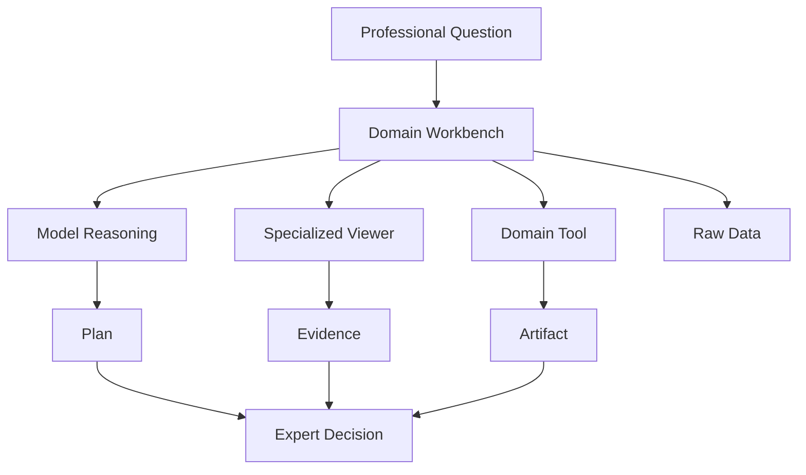

**Sources**:
- [OpenAI Developers: Rosalind Workbench](https://developers.openai.com/blog/rosalind-workbench)
- [OpenAI: Introducing GPT-Rosalind](https://openai.com/index/introducing-gpt-rosalind/)

## C. Other Notable Items

**1. GitHub Copilot in Visual Studio brings organization-level Custom Agents, Thinking Effort, and model-cost information directly into the IDE.** GitHub organization / enterprise owners can publish Custom Agents that Visual Studio automatically discovers; supported models expose Low / Medium / High thinking effort and display context-window and cost information. It falls below today's seven core stories in impact, but reinforces the idea that the IDE is becoming an enterprise Harness frontend. Source: [GitHub Copilot in Visual Studio — August update](https://github.blog/changelog/2026-08-28-github-copilot-in-visual-studio-august-update-2/)

**2. GitHub's weekly Copilot release roundup shows Agent sessions converging across clients.** Copilot CLI adds default execution / permission modes, improved plugin / MCP / skill management, and recovery for sessions that exited unexpectedly, while Slack / Teams can turn team conversations into shared Agent sessions. Compared with today's enterprise-policy and Claude Code changes, these are more useful as trend signals than standalone core stories. Source: [GitHub Copilot weekly releases — August 24](https://github.blog/changelog/2026-08-28-github-copilot-weekly-releases-august-24/)

## D. AI Trend Summary

### Trends supported by current facts

**Trend 1: Open-model competition is moving from benchmark position toward deployment friction.** GLM-5.3 and Hy4 arrive with vLLM, SGLang, quantization / FP8, and OpenAI-compatible production paths. “How strong is the model?” and “how quickly can it enter your Harness?” are becoming equally important.

**Trend 2: Coding Harnesses are becoming true Runtime Control Planes.** Claude Code model-switch Hooks, prompt-cache observability, and permission fixes, together with GitHub persistent Agent sessions, retention, and spend policy, show that the durable platform layer is Model + Tool + Context + Identity + Cost + Policy rather than one fixed model.

**Trend 3: Agent FinOps is moving beyond token price into session and task economics.** Cache hits, re-caching, model switching, thinking effort, seat billing, and additional usage are increasingly exposed directly in products. Cost per successful task is becoming the more meaningful metric.

**Trend 4: Vertical-Agent differentiation is shifting from domain knowledge toward domain Workbenches.** Rosalind Workbench shows that serious professional systems require artifacts, viewers, tools, data lineage, and repeatable workflows.

### Analytical inference

**Inference 1: In the second half of 2026, “high-capability open model + enterprise Harness” will become a more realistic alternative to closed frontier APIs.** It will not be appropriate for every workload, but data residency, cost control, model control, and provider redundancy increasingly favor this architecture in selected use cases.

**Inference 2: Model gateways will evolve into Workload Control Planes.** The gateway will increasingly decide model, reasoning effort, caching, tool permissions, data boundaries, cost, and failover rather than simply “Claude or GLM.”

**Trend overview**

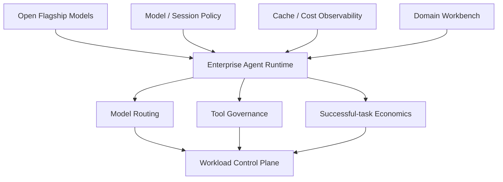

## E. Actions to Consider Today

1. **Role: AI Builder / Tech Lead | Action: put GLM-5.3 and Hy4 into the same real Agent evaluation suite.** Do not reproduce vendor leaderboards; focus on repository coding, long-running tasks, tool use, concurrency, and cost per successful task. **Why now**: both flagship open models entered genuinely deployable states in the same window. **Action type: Schedule a test.**

2. **Role: Tech Lead / Security | Action: prioritize upgrading Claude Code to 2.1.251.** Review symlink, plugin path, telemetry / raw-body logging, and existing Hook policies at the same time. **Why now**: the release includes concrete permission-boundary security fixes. **Action type: Execute now.**

3. **Role: AI Platform | Action: add model switching, prompt cache, reasoning effort, and final outcome to one task trace.** **Why now**: Harnesses are exposing these FinOps signals natively. **Action type: Add to roadmap.**

4. **Role: Department manager / Security / Procurement | Action: complete GitHub Copilot enterprise-policy review before September.** Focus on chat retention, Cloud Agent, seat billing, and Code Review effort. **Why now**: default policies will materially change over the coming weeks. **Action type: Risk review.**
