<!-- 中文版 -->
# AI 今日头条｜2026 年 08 月 30 日

- 语言：中文
- 时区：Asia/Singapore
- 新闻窗口：2026-08-29 07:30 至 2026-08-30 07:30
- 实际检索截止时间：2026-08-30 06:59
- 本期核心新闻：4 条
- 其他值得关注：0 条
- **今日高价值事件较少**
- 注：本次手动运行早于固定新闻窗口结束约 31 分钟，因此实际检索覆盖至 06:59；06:59–07:30 之间若出现新事件，将留待下一次复核。

## A. 今日最重要的 3 件事

**1. OpenAI 决定终止向 SpaceX 旗下 Cursor 直接提供模型，拟于 11 月 12 日切断；这是一条会直接改变 Coding Harness 模型供应链的新闻。** OpenAI 明确表示，不仅现有合同拟结束，**未来模型也不会继续提供给 Cursor**，并在公告中直接提到即将推出的 `Astra`。与此同时，Anthropic 联合创始人 Tom Brown 表示会继续增加支持 Cursor 中 Claude 模型的算力。这意味着 Harness 厂商的“多模型能力”第一次如此清晰地暴露出上游模型供应商的商业和政策依赖。

**2. Claude Code 周额度将重新基线化：9 月 14 日后永久标准额度比旧标准高 25%，但比目前临时 +50% 的额度低约 17%。** 这一变化覆盖 Pro、Max、Team 和按 Seat 计费的 Enterprise 计划。真正值得关注的不是“涨 25%”这个标题，而是对当前重度用户而言，9 月 14 日后实际可用量会下降；Anthropic 同时预告将推出更好的 Usage 可见性和控制能力。

**3. ChatGPT Business / Enterprise / Edu 开始支持从 GitHub 导入并每日自动同步 Plugin Marketplace。** 管理员可以把公共或私有 GitHub 仓库直接作为团队 Plugin Marketplace 的分发源，ChatGPT 每日自动同步版本，同时仍由 Workspace Policy 决定谁能安装、Plugin 能访问哪些 App、是否需要认证。Plugin 从“个人扩展包”进一步变成可由企业软件供应链统一管理的 Harness 组件。

## B. 新闻正文

### 1. OpenAI 将停止向 Cursor 直接提供模型：Harness 的上游模型供应开始成为战略风险

- 类别：AI 编程 / Harness / 模型 / 政策与产业
- 信息状态：官方已确认
- 发布时间：OpenAI 公告日期为 2026-08-28；Reuters 于 2026-08-29 02:01 UTC 报道，对应 2026-08-29 10:01 Asia/Singapore
- 可用状态：现阶段仍可使用；OpenAI 提议于 2026-11-12 终止 Cursor 的直接模型访问

**事实摘要**：OpenAI 正式宣布，已通知 SpaceX，计划终止与 Cursor 的模型供应合同，拟定关闭日期为 **2026 年 11 月 12 日**。OpenAI 给出的理由是，在 Cursor 被 SpaceX 收购后，无法确信 SpaceX 会持续按照 OpenAI 的服务条款使用其技术。OpenAI 表示，合同中存在 Change-of-Control 条款，允许其在 Cursor 控制权变化后的一定期限内取消合作。:contentReference[oaicite:0]{index=0}

更重要的是，OpenAI 明确写道，在保持当前服务到合同允许的最晚时间的同时，**不会继续向 Cursor 提供未来模型**；公告中特别提到即将推出的 `Astra`，但没有公开 Astra 的发布日期、价格或完整能力信息。Reuters 同时报道，Cursor 联合创始人 Michael Truell 表示双方仍在沟通；Anthropic 联合创始人 Tom Brown 则表示，将继续增加支持 Cursor 中 Claude 模型的 Compute。:contentReference[oaicite:1]{index=1}

**相较此前的变化**：此前 Cursor 的核心竞争力之一，是在同一个 Harness 中同时使用 OpenAI、Anthropic 等多家旗舰模型，用户可以把 IDE / Agent Workflow 与具体模型供应商解耦。今天的变化证明，这种解耦并不是完全由 Harness 自己控制：即使产品技术上支持某个 Provider，模型公司仍可以通过商业合同、Change-of-Control、Usage Policy 或竞争关系改变供应状态。

Cursor 方面据 The Information 引述 Truell 表示，OpenAI 模型目前仅占 Cursor 流量约 5%。这意味着本次变化未必会让 Cursor 的总体产品立即失去可用性，但对依赖特定 GPT / Codex 模型行为、Prompt、Tool Call 或质量特性的团队，影响可能远高于 5% 这个流量数字所暗示的程度。:contentReference[oaicite:2]{index=2}

**为什么重要**：这可能是 AI Coding 市场一个重要分水岭。过去企业谈“模型多供应商”时，通常认为只要 API 层做了 Adapter，就能自由替换 GPT、Claude、Gemini 或开放模型。但 Cursor 事件说明，**模型供应权本身也是依赖项**。

当 Harness、模型厂商和 Compute Provider 开始相互并购或形成竞争关系时，以下几种风险都会变得现实：

- Provider 可以因商业或政策原因停止向第三方 Harness 提供未来模型；
- 某个 Harness 即使支持 OpenAI-compatible API，也不代表能获得与官方合作相同的模型、额度或服务等级；
- 企业在第三方 Coding Tool 中构建的 Workflow，可能因为上游模型消失而产生 Behavior Drift；
- “支持 10 个模型”与“这些模型未来都能稳定获得”是两件不同的事。

**实际影响**：如果企业把 Cursor、Claude Code、Codex、Copilot 或其他 Harness 用作正式开发基础设施，就应该把 Model Availability 从“产品功能”升级成“供应链指标”。

例如，一个团队如果大量依赖 Cursor + OpenAI 模型，不应该只测试“换 Claude 后代码能力是否差不多”，而应该 Replay 真实 Agent Session，比较 Tool Call、Diff 风格、测试行为、Context 使用、任务完成率和 Cost。模型切换对 Agent 的影响远大于普通 Chatbot。

OpenAI 公告对 Astra 的提及也值得关注，但目前只能确认：它是 OpenAI 所称的 upcoming model，以及 OpenAI 不计划通过 Cursor 提供未来模型。没有足够官方信息支持对 Astra 的发布日期或性能做进一步推断。

**角色视角**：
- AI Builder：不要假设第三方 Harness 中的某个模型会永久存在。
- 产品负责人：Model Availability 应成为产品 Dependency Map 的一部分。
- Tech Lead：需要准备模型替换后的 Session Replay / Regression Eval。
- 部门经理：关键 Coding Harness 不宜把核心生产力绑定到单一 Harness × 单一 Model 组合。

**可借鉴动作**：为内部 Coding Agent 建立一个 **Harness × Model Compatibility Matrix**。至少记录：模型供应渠道、合同 / API 依赖、Fallback Model、Context 差异、Tool Compatibility、真实任务 Success Rate 和迁移成本。任何核心模型消失时，可以通过既有 Eval 决定替代方案，而不是临时凭感觉换模型。

**风险与不确定性**：11 月 12 日是 OpenAI 提出的终止日期，双方仍在沟通，最终安排仍可能改变；Cursor 也可能通过其他形式提供 OpenAI-compatible 模型，但这不能等同于 OpenAI 当前的直接供应关系。关于 Astra，目前公开资料不足，不应把其名称出现解读为即将立即发布。

**下一步观察**：
1. Cursor 与 OpenAI 是否达成新的合同安排；
2. Cursor 是否公布受影响的具体 OpenAI 模型清单；
3. Anthropic 向 Cursor 增加 Compute 后，Claude 是否成为 Cursor 的更明显默认模型；
4. Astra 最终发布时是否仅优先进入 OpenAI 自有 Harness / Codex。

**Mermaid 图示 A：Coding Harness 的隐藏供应链**

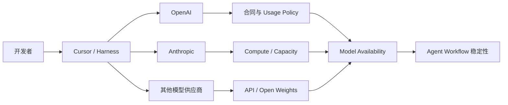

以上为供应链分析模型，不代表 Cursor 官方架构。

**Mermaid 图示 B：企业如何降低模型撤回风险**

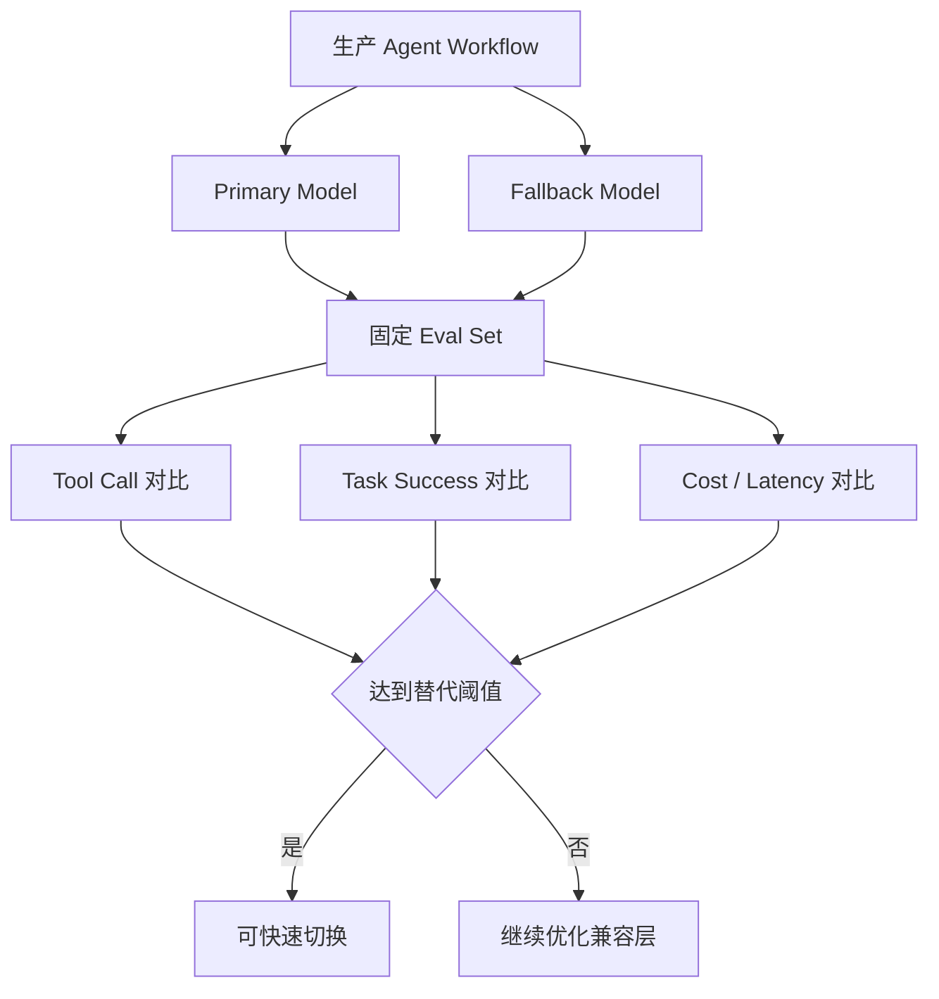

**来源**：
- [OpenAI：Our decision on Cursor following its acquisition by SpaceX](https://openai.com/index/our-decision-on-cursor-following-its-acquisition-by-spacex/)
- [Reuters：OpenAI to cut off AI models for SpaceX-owned Cursor](https://www.reuters.com/business/media-telecom/openai-end-partnership-with-spacexs-cursor-2026-08-29/)
- [Techmeme 汇总：OpenAI / Cursor / Anthropic 官方回应](https://www.techmeme.com/260829/p13)

---

### 2. Claude Code 调整周额度：9 月 14 日永久 +25%，但相对当前临时额度实际下降约 17%

- 类别：AI 编程 / Harness / 成本治理
- 信息状态：官方账号发布；官方 Help / Pricing 页面暂未发现同步的固定 Token 数字
- 发布时间：2026-08-30 00:47 左右 Asia/Singapore（ClaudeDevs 公布时间约为 2026-08-29 18:47 GMT+2）
- 可用状态：当前临时 +50% 额度继续有效至 9 月 14 日；之后切换到永久 +25% 标准

**事实摘要**：Anthropic 的 ClaudeDevs 官方账号宣布，从 **2026 年 9 月 14 日**开始，Claude Code 的标准 Weekly Limit 将永久提高 **25%**，适用于 **Pro、Max、Team 和按 Seat 计费的 Enterprise**。在此之前，目前临时生效的 **+50% Weekly Limit** 会继续维持。:contentReference[oaicite:3]{index=3}

因此有两个不同的比较基准：

| 比较基准 | Weekly Limit |
| --- | ---: |
| 原标准额度 | 100% |
| 当前临时额度 | 150% |
| 9 月 14 日后的永久额度 | 125% |
| 相对原标准 | +25% |
| 相对当前临时额度 | 约 -16.7% |

所以，“永久提高 25%”和“当前用户将减少约 17% 可用量”这两个说法同时成立，区别只是比较基准不同。Anthropic 目前没有公开统一的固定 Token 数，因为实际消耗仍取决于模型、Session 长度、上下文和任务复杂度。:contentReference[oaicite:4]{index=4}

**相较此前的变化**：此前的 +50% 是明确的临时提升；现在 Anthropic 给出了结束时间，并首次明确了长期基准——不会完全回退到旧标准，而是长期保持 125%。

对于已经习惯当前 150% 容量的重度 Claude Code 用户，这实际上意味着需要重新规划每周使用节奏。对原本以旧标准额度作为预算基线的用户，则仍然属于永久改善。

Anthropic 同时表示，正在开发让用户获得更多 **Usage Visibility 和 Control** 的变化，但尚未给出具体产品细节。这个信号值得继续跟踪，因为 Coding Agent 的用量控制已经成为模型能力之外影响 Harness 体验的核心变量。

**为什么重要**：AI Coding 工具的“价格”越来越难用订阅费本身表示。真正影响用户体验的是：

`订阅价格 × Session Limit × Weekly Limit × 模型消耗倍率 × Prompt Cache × Additional Usage`

同一个 Max / Team 计划，如果模型越来越强但平均一个 Agent Task 消耗的 Context 也更大，名义额度不变也可能产生更早触顶。

因此，Claude Code 本次调整实际上是 Agent FinOps 问题，而不仅是订阅福利变化。

**实际影响**：如果当前工作流已经依赖临时 +50% Weekly Limit 才能正常完成一周任务，那么 9 月 14 日以后应该预期约六分之一的 Capacity Reduction。更合理的应对方式不是机械减少调用，而是观察哪些任务真正应该使用高成本模型、哪些可以使用更轻量模型或独立 Subagent。

如果 Anthropic 后续提供更细的 Usage Dashboard、Session Cost 或 Model-level Consumption，企业可以进一步建立按成功任务计算的预算。

**角色视角**：
- AI Builder：9 月 14 日后需要重新评估每周 Agent 容量。
- Tech Lead：应该区分“高价值复杂任务”和“可由更便宜模型完成的任务”。
- 部门经理：Seat 价格不变并不意味着有效 Coding Capacity 不变。
- FinOps / Platform：应该从 Token 或消息次数升级到 Cost per Successful Task。

**可借鉴动作**：从现在开始连续记录两周：每个 Claude Code Session 的任务类型、模型、持续时间、是否触达 Weekly Limit、人工补救次数和最终完成状态。9 月 14 日后用同一指标重新测一次，就能计算真实 Capacity Change，而不是只看官方的 25% / 17% 数字。

**风险与不确定性**：Anthropic 尚未给出各 Plan 的统一硬 Token 数，因此不能把 125% 换算成固定 Token；不同用户、模型和 Session 类型的实际可用工作量可能不同。官方还预告 Usage 控制功能会改变，未来额度体验可能再次调整。

**下一步观察**：
1. 9 月 14 日前是否公布新的 Usage Dashboard；
2. Weekly Limit 是否开始按模型给出更透明消耗权重；
3. Additional Usage 与订阅额度能否配置企业级 Spend Cap；
4. 当前临时 150% 是否在部分计划继续延期。

**Mermaid 图示 A：Claude Code Weekly Limit 变化**

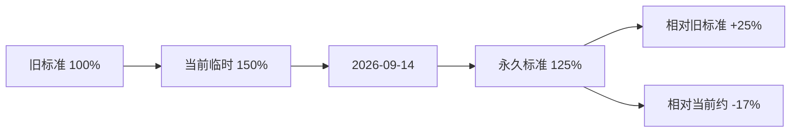

**Mermaid 图示 B：为什么额度不能只看百分比**

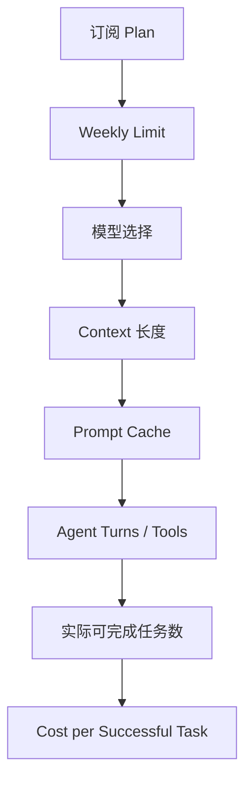

**来源**：
- [ClaudeDevs 公告的 Techmeme 存档](https://www.techmeme.com/260829/p13)
- [The Mac Observer：Anthropic raises Claude Code weekly limits by 25%](https://www.macobserver.com/news/anthropic-raises-claude-code-weekly-limits-by-25-for-paid-plans/)

---

### 3. ChatGPT 开始从 GitHub 导入并自动同步 Plugin Marketplace：企业 Plugin 分发进入正式软件供应链

- 类别：Harness / Agent / MCP / AI 编程 / 安全
- 信息状态：官方产品更新
- 发布时间：OpenAI Release Notes 标注 2026-08-28；页面在本期窗口内更新
- 可用状态：ChatGPT Business、Enterprise、Edu 已可用

**事实摘要**：OpenAI 在 ChatGPT Business 与 Enterprise / Edu Release Notes 中新增 **Import and sync plugin marketplaces from GitHub**。Workspace Admin / Owner 可以直接把一个公共或私有 GitHub Repository 导入为团队的 Plugin Marketplace，并通过每日自动同步保持 Plugin 更新，也可以手动执行 `Sync now`。:contentReference[oaicite:5]{index=5}

导入 Marketplace 并不会自动授予 App Access，也不会自动连接成员账号。新 Plugin 默认进入可安装状态，其需要的 App、认证和权限仍然受 Workspace Admin Policy 控制；Repository 自己声明的 Policy 不能覆盖 Workspace 层面的权限设置。:contentReference[oaicite:6]{index=6}

**相较此前的变化**：ChatGPT / Codex 的 Plugin 体系此前已经支持 Plugin Directory、Workspace Sharing、Skills、Apps 和 MCP 等扩展方式，但企业仍需要逐个发布或管理 Plugin。

现在 GitHub Repository 可以成为一个**持续同步的软件分发源**，这使 Plugin 管理方式更接近企业内部 Package Registry：

`Git Repository → Marketplace → Workspace Directory → Role / Permission → User Install`

这比“可以安装 Plugin”本身更重要，因为它解决的是生命周期管理。

**为什么重要**：企业 Harness 的真正规模化瓶颈往往不是“能否开发一个 Skill / Plugin”，而是：

- 如何发布；
- 如何升级；
- 谁批准；
- 谁可以使用；
- Plugin 依赖哪些 App；
- 新版本是否扩大权限；
- 出问题后如何回滚和审计。

GitHub 自动同步意味着企业今后可能直接采用 Git-based PluginOps：Plugin 的代码、Manifest、Skill、MCP 配置和版本变更都经过 PR / Code Review，再由 ChatGPT Workspace 自动同步。

这与传统 DevOps 的 IaC / GitOps 思路非常接近。

**实际影响**：对于已经维护内部 Harness 或安全审批流程的团队，可以把 Plugin Marketplace Repository 作为正式受控仓库。Security Reviewer 不需要进入 ChatGPT UI 手工检查每个改动，而可以在 GitHub PR 层先完成 Code Owner、静态检查、Manifest Diff 和权限审计。

不过，自动同步也放大了 Supply-chain Risk：一次错误 Merge 可能在下一次同步后传播给整个 Workspace，因此 Marketplace Repo 的保护级别不应该低于生产 CI/CD 配置仓库。

**角色视角**：
- AI Builder：内部 Skill / MCP / Plugin 的分发摩擦明显降低。
- Tech Lead：Plugin Marketplace 可以进入正式 GitOps 流程。
- 安全负责人：需要把 Plugin Manifest 和 App Permission 当成 Code Review 对象。
- 部门经理：组织可以建立统一的内部 Agent Capability Catalog。

**可借鉴动作**：建立一个受保护的 `ai-plugin-marketplace` Repository，并启用：
- Branch Protection；
- CODEOWNERS；
- Security / Platform 双人 Review；
- Plugin Manifest Diff；
- App / MCP Permission 检查；
- Release Tag 和 Rollback 规则。

然后再把该 Repository 接入 Workspace Marketplace，而不是直接同步普通开发仓库。

**风险与不确定性**：每日自动同步意味着错误版本的 Blast Radius 会扩大；Plugin 本身还可能依赖外部 App、MCP Server 和 OAuth Scope，因此 Git Repository 通过审查并不等于运行时权限自动安全。OpenAI 目前仍明确由 Workspace Policy 保留最终控制权。

**下一步观察**：
1. 是否支持锁定 Marketplace 到 Commit SHA / Release Tag；
2. Plugin 更新是否可以先进入 Staging Workspace；
3. 是否提供 Manifest / Permission Change 的审批 Gate；
4. Marketplace Sync 是否产生可导出的 Enterprise Audit Event。

**Mermaid 图示 A：GitHub Marketplace 分发链**

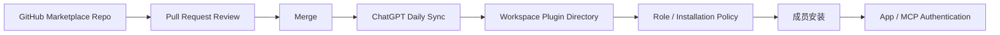

**Mermaid 图示 B：建议的 PluginOps 控制面**

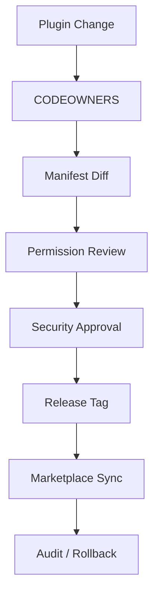

**来源**：
- [ChatGPT Business Release Notes](https://help.openai.com/en/articles/11391654-chatgpt-business-release-notes)
- [ChatGPT Enterprise & Edu Release Notes](https://help.openai.com/en/articles/10128477-chatgpt-enterprise-edu-release-notes)

---

### 4. Sony Music Publishing 与 Warner Chappell 起诉 Anthropic：训练数据 Provenance 再次成为 Frontier Model 的企业风险

- 类别：政策与产业 / 安全 / 模型治理
- 信息状态：权威媒体报道；诉讼已提交法院，相关指控尚未经法院裁定
- 发布时间：案件于 2026-08-28 晚间在美国加州北区联邦法院提交；媒体于 2026-08-29 披露
- 可用状态：不适用

**事实摘要**：Sony Music Publishing 和 Warner Chappell Music 已联合在美国加州北区联邦法院起诉 Anthropic，并把 CEO Dario Amodei 和联合创始人 Benjamin Mann 列为个人被告。原告指控 Anthropic 在训练 Claude 时非法获取、复制和使用大量受版权保护的音乐作品，并寻求每件故意侵权作品最高 15 万美元等法定赔偿。Anthropic 截至公开报道时尚未回应这些新指控。:contentReference[oaicite:7]{index=7}

案件属于原告指控，目前不能把“Anthropic 盗版训练”写成已经被法院认定的事实。值得注意的是，音乐出版行业此前已经围绕数千到数万首作品对 Anthropic 发起多起诉讼，因此这次 Sony 和 Warner 的加入显著扩大了潜在诉讼规模。:contentReference[oaicite:8]{index=8}

**相较此前的变化**：AI Copyright 诉讼并不是新鲜事件，但这次的变化有两点。

第一，三大音乐出版集团的主要实体正在逐步形成更广泛的法律战线，争议从少量特定输出是否侵权，扩大到**训练数据获取方式本身是否违法**。

第二，案件把公司创始人列为个人被告，使 Data Acquisition Decision、内部治理和管理层责任成为诉讼焦点，而不只是模型 Output。

**为什么重要**：对于 AI Builder 来说，这看似是法律新闻，但背后的技术问题其实是 **Training Data Provenance**。

当模型供应商无法清晰回答：

- 数据从哪里取得；
- 是否授权；
- 是否经过 Torrent / Scraping；
- 是否删除 Copyright Metadata；
- 数据是否可追踪到 Dataset Version；

企业客户就很难完成完整的供应链风险判断。

随着 Frontier Model 越来越嵌入企业生成内容、广告、设计和知识生产，Provider 的训练数据法律风险可能通过合同赔偿、模型下线、区域限制或输出政策间接影响客户。

**实际影响**：企业目前不需要因此停止使用 Claude，但在采购和模型治理中，应该把 Provider Legal / Data Provenance Risk 与普通技术 SLA 分开评估。

对自己训练或微调模型的团队，这件事更直接：Dataset Registry 应至少保留 Source、License、Acquisition Method、Version、Removal Request 与加工记录，避免几年后无法说明训练数据来源。

**角色视角**：
- AI Builder：自有训练数据必须具备可追踪 Provenance。
- Tech Lead：Dataset 应与 Model Artifact 一样做 Versioning。
- 产品负责人：生成音乐、广告、内容类产品需要更强 IP Review。
- 部门经理：模型供应商法律风险应进入长期 Vendor Scorecard。

**可借鉴动作**：给内部 Dataset 建立最小 Provenance Schema：

`dataset_id → source → license → acquisition_method → collected_at → processing → model_version`

如果无法填写这些字段的数据，不要直接进入长期生产训练集。

**风险与不确定性**：所有核心侵权指控目前仍是原告主张，尚未经过法院最终裁决。法定最高赔偿额也不是最终赔偿金额。案件可能通过驳回、和解、Fair Use 判决或其他程序显著改变。

**下一步观察**：
1. Anthropic 的正式答辩；
2. 法院如何处理“训练时复制”与 Fair Use；
3. 是否要求披露更详细训练数据来源；
4. AI 模型企业合同是否增加 Training-data Indemnity 条款。

**Mermaid 图示**

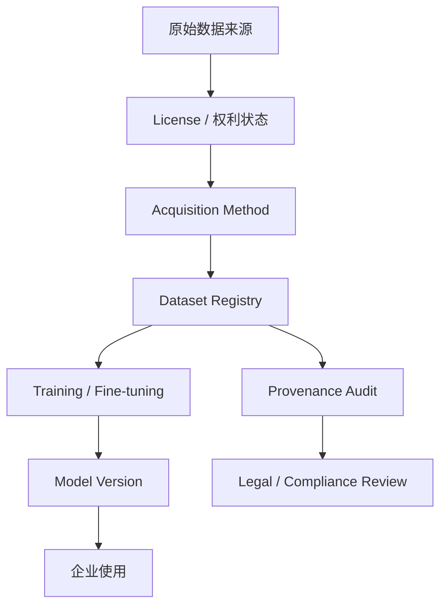

**来源**：
- [Axios：Sony, Warner sue Anthropic](https://www.axios.com/2026/08/29/anthropic-sony-warner-music-copyright)
- [Music Business Worldwide：Sony Music Publishing and Warner Chappell sue Anthropic](https://www.musicbusinessworldwide.com/now-sony-music-publishing-and-warner-chappell-sue-anthropic-in-multi-billion-dollar-lawsuit-one-of-the-largest-and-most-blatant-ongoing-thefts-of-intellectual-property-in-history/)

## D. 今日 AI 趋势总结

### 已有事实支持的趋势

**趋势 1：Harness 的“多模型”正在暴露真正的供应链属性。** Cursor 事件证明，API Adapter 并不能保证模型永久可用；Change-of-Control、合同、竞争关系和 Usage Policy 都可能改变模型供应。未来企业评估 Harness 时，需要问的不只是“支持哪些模型”，而是“这些模型通过什么关系获得、Fallback 是什么”。

**趋势 2：Agent 额度和成本治理正在成为核心产品能力。** Claude Code 的 Weekly Limit 调整再次表明，订阅价格不能代表真实 Agent Capacity。Session 长度、模型、Cache、Tool Turn 和 Weekly Limit 会共同决定每周能完成多少任务。

**趋势 3：Plugin / Skill / MCP 正从个人扩展走向企业软件供应链。** ChatGPT 从 GitHub 同步 Marketplace 后，Plugin 可以正式进入 PR Review、CODEOWNERS、版本控制和 Workspace Policy；Harness 的扩展生态开始越来越像 Package Manager + Enterprise App Store。

**趋势 4：模型治理的范围正在继续向 Training Data 上游扩展。** Sony / Warner 与 Anthropic 的诉讼说明，企业 AI 风险不仅发生在 Prompt、Output 和 Agent Action，也发生在模型训练数据的取得方式与法律 Provenance。

### 分析推断

**推断 1：企业 Harness 的长期核心资产不会是某个模型，而是“可替换模型的控制面”。** 真正稳定的平台需要管理 Model Availability、Fallback、Eval、Tool、Plugin、Identity、Cost 和 Audit。模型供应商变化时，业务 Workflow 仍然可以继续运行。

**推断 2：未来 Model Gateway 会与 Plugin Gateway 越来越像同一种基础设施。** 一个控制“哪个模型可以被调用”，另一个控制“哪些工具可以被调用”；最终二者都需要 Policy、Version、Identity、Cost、Telemetry 和 Supply-chain Governance。

**今日趋势总览**

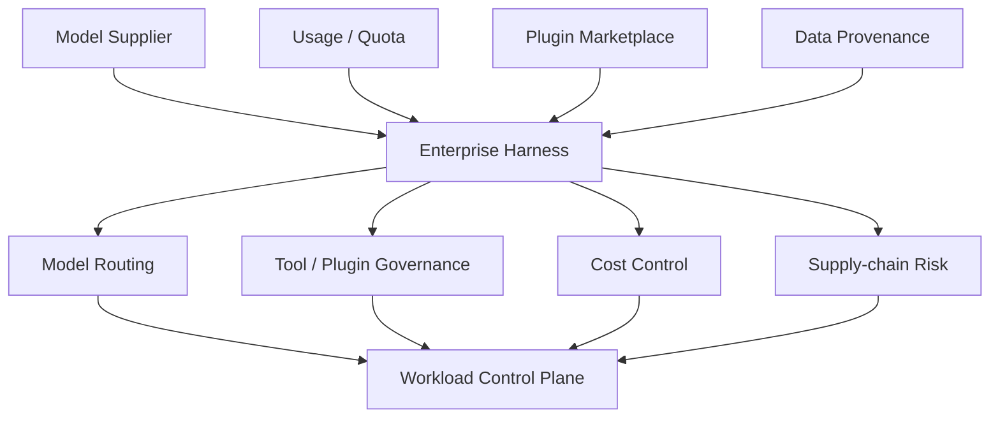

## E. 今日建议关注或采取的动作

1. **角色：AI Platform / Tech Lead｜建议动作：给所有正式使用的 Coding Harness 建立 Model Availability 与 Fallback Matrix。** **为什么现在做**：Cursor 事件证明模型供应可以因合同和控制权变化直接消失。**动作类型：立即执行。**

2. **角色：Claude Code 重度用户 / 部门经理｜建议动作：在 9 月 14 日前记录两周真实 Usage Baseline。** **为什么现在做**：永久额度相对当前临时额度将降低约 17%，需要知道实际影响的是哪些工作流。**动作类型：持续观察。**

3. **角色：AI Platform / Security｜建议动作：把内部 Plugin Marketplace 纳入 GitOps。** 使用受保护 GitHub Repo、CODEOWNERS、Manifest Diff、权限审查和 Release Tag，再开启 Workspace 自动同步。**为什么现在做**：ChatGPT 已支持 GitHub Marketplace 自动同步。**动作类型：纳入路线图。**

4. **角色：模型治理 / 法务 / Tech Lead｜建议动作：给内部训练数据建立最小 Data Provenance Registry。** **为什么现在做**：AI 版权争议正在从模型输出深入到数据取得方式本身。**动作类型：检查风险。**

---

<!-- English Version -->
# AI Daily Headlines｜2026-08-30

- Language: English
- Time zone: Asia/Singapore
- News window: 2026-08-29 07:30 to 2026-08-30 07:30
- Research cutoff: 2026-08-30 06:59
- Core stories: 4
- Other notable items: 0
- **There were fewer genuinely high-value events today.**
- Note: This manual run occurred roughly 31 minutes before the nominal news-window close. Research therefore covers events through 06:59; developments between 06:59 and 07:30 will be rechecked in the next run.

## A. The 3 Most Important Things Today

**1. OpenAI plans to terminate direct model supply to SpaceX-owned Cursor on November 12, a development that directly changes the model supply chain for Coding Harnesses.** OpenAI explicitly says it intends not only to wind down the current contract but also to withhold **future models from Cursor**, mentioning its upcoming `Astra` model by name. Meanwhile, Anthropic co-founder Tom Brown says Anthropic will continue increasing compute support for Claude models in Cursor. The episode makes the upstream dependency hidden inside “multi-model” Harnesses unusually visible.

**2. Claude Code is re-baselining weekly limits: beginning September 14, permanent standard capacity will be 25% above the old baseline, but roughly 17% below today's temporary +50% capacity.** The change applies to Pro, Max, Team, and seat-based Enterprise plans. The important point is not the “+25%” headline; heavy users operating against today's temporary allowance will actually have less weekly capacity after September 14. Anthropic also teased better usage visibility and control.

**3. ChatGPT Business / Enterprise / Edu can now import Plugin Marketplaces from GitHub and keep them automatically synchronized every day.** Public or private repositories can become centrally managed Plugin distribution sources while Workspace policies continue to determine installation, app access, and authentication. Plugins are moving from individual extensions toward enterprise-managed Harness software supply chains.

## B. Core Stories

### 1. OpenAI will stop directly supplying models to Cursor: upstream model availability becomes a strategic Harness risk

- Category: AI Coding / Harness / Model / Policy & Industry
- Information status: Officially confirmed
- Published: OpenAI announcement dated 2026-08-28; Reuters report at 2026-08-29 02:01 UTC, or 2026-08-29 10:01 Asia/Singapore
- Availability: Still available today; OpenAI proposes ending Cursor's direct model access on 2026-11-12

**Fact summary**: OpenAI formally announced that it notified SpaceX of its intention to wind down the contract supplying OpenAI models to Cursor, with a proposed shutoff date of **November 12, 2026**. OpenAI says the decision follows Cursor's acquisition by SpaceX and its inability to be confident that SpaceX will continue using OpenAI technology according to its terms of service. OpenAI says its Cursor agreement contains a change-of-control provision that provides a limited cancellation window. :contentReference[oaicite:9]{index=9}

More importantly, OpenAI says it will preserve current access until as late as the contract permits while **not supplying future models to Cursor**. The announcement specifically references the upcoming `Astra` model but gives no launch date, pricing, or full capability information. Reuters reports that Cursor co-founder Michael Truell says the companies are still talking, while Anthropic co-founder Tom Brown says Anthropic will continue increasing compute for Claude models in Cursor. :contentReference[oaicite:10]{index=10}

**What changed versus before**: One of Cursor's key advantages has been the ability to use OpenAI, Anthropic, and other frontier models inside one Harness, apparently decoupling the IDE / Agent workflow from any one provider. Today's development shows that the decoupling is not fully controlled by the Harness: even when an integration technically exists, model providers can change availability through commercial contracts, change-of-control clauses, usage policies, or competitive relationships.

The Information, as summarized by Techmeme, quotes Truell saying OpenAI currently represents only about 5% of Cursor traffic. That suggests the event may not cripple Cursor overall, but teams dependent on specific GPT / Codex behavior, prompts, tool calls, or quality characteristics can be affected far more than a 5% traffic statistic implies. :contentReference[oaicite:11]{index=11}

**Why it matters**: This may be a meaningful inflection point for AI Coding. Enterprise “multi-model” architecture has often been treated as an API adapter problem: support GPT, Claude, Gemini, and open models behind one interface and providers become interchangeable.

Cursor demonstrates that **the right to obtain the model itself is also a dependency**.

As Harness vendors, frontier labs, and compute companies merge or compete more directly, several risks become realistic:

- A provider may stop supplying future models to a third-party Harness for commercial or policy reasons.
- OpenAI-compatible API support does not guarantee identical model availability, quota, or service levels.
- Replacing an upstream model can materially change Agent behavior even when the API schema is unchanged.
- “Supports ten models” and “will reliably retain access to those ten models” are different claims.

**Practical impact**: Enterprises treating Cursor, Claude Code, Codex, Copilot, or other Harnesses as development infrastructure should promote Model Availability from a feature attribute to a supply-chain metric.

For example, a team heavily using Cursor + OpenAI should not merely verify that Claude can answer the same prompts. It should replay real Agent sessions and compare tool calls, diff behavior, testing strategy, context consumption, success rate, and cost. Model replacement is much more consequential for an Agent than for an ordinary chatbot.

OpenAI's reference to Astra is also notable, but only two facts are currently supported: OpenAI describes Astra as an upcoming model, and it says future models will not be supplied through Cursor under the proposed arrangement. There is not enough official information to infer an Astra release date or performance.

**Role perspective**:
- AI Builder: never assume a specific model inside a third-party Harness will remain available indefinitely.
- Product owner: Model Availability belongs in the product dependency map.
- Tech Lead: maintain session replay and regression evals for provider substitution.
- Department manager: critical developer productivity should not depend on one Harness × one Model pairing.

**Action to borrow**: Maintain a **Harness × Model Compatibility Matrix** recording supply channel, contractual/API dependency, fallback model, context differences, tool compatibility, real task success rate, and migration cost. When a core model disappears, the organization can select a fallback using existing evidence rather than emergency intuition.

**Risks and uncertainty**: November 12 is OpenAI's proposed termination date, and the parties remain in discussions. Cursor may also support OpenAI-compatible alternatives, but that should not be confused with today's direct OpenAI supply relationship. Public Astra information remains too limited for release-date or capability forecasts.

**Next signals to watch**:
1. Whether Cursor and OpenAI reach a new agreement;
2. Which specific OpenAI models Cursor says will be affected;
3. Whether increased Anthropic compute makes Claude an even more dominant Cursor default;
4. Whether Astra is initially prioritized for OpenAI-owned surfaces such as Codex.

**Mermaid diagram A: the hidden Coding-Harness supply chain**

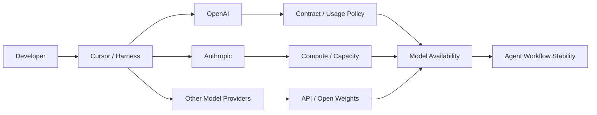

This is a supply-chain abstraction, not Cursor's official architecture.

**Mermaid diagram B: reducing model-withdrawal risk**

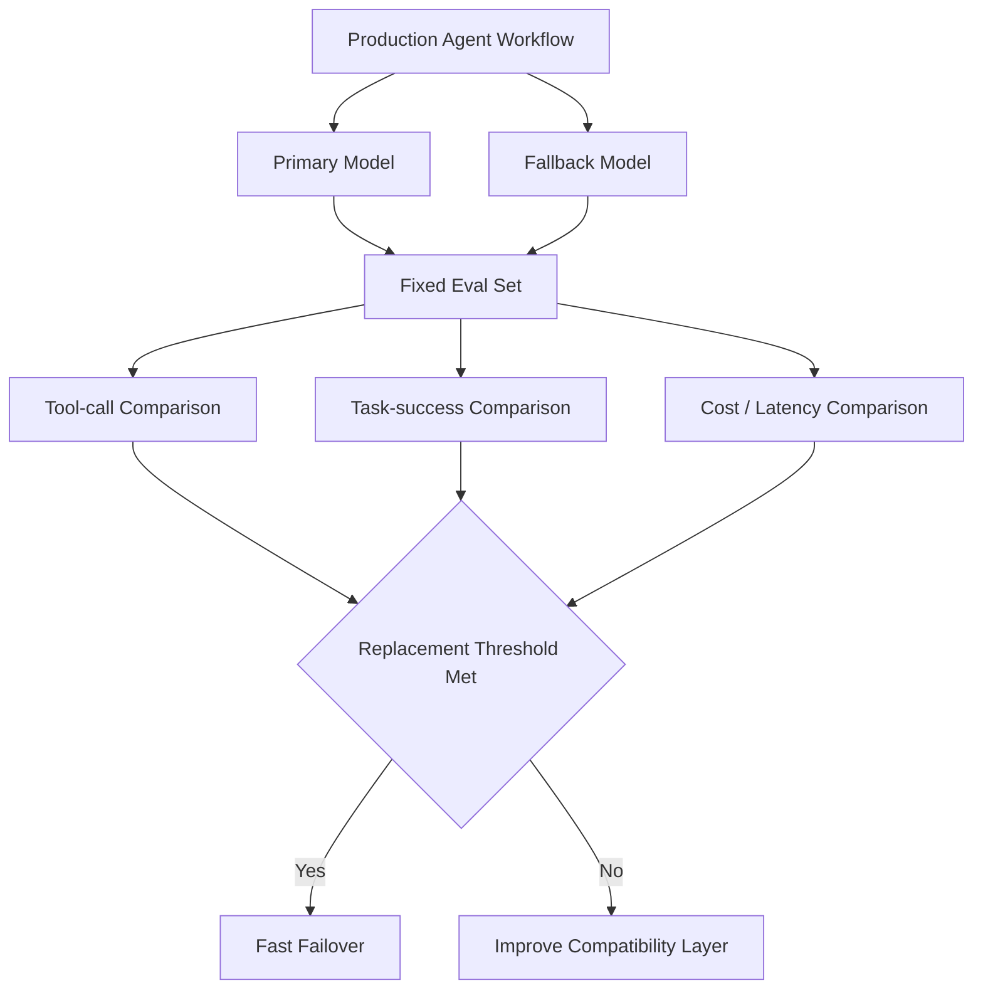

**Sources**:
- [OpenAI: Our decision on Cursor following its acquisition by SpaceX](https://openai.com/index/our-decision-on-cursor-following-its-acquisition-by-spacex/)
- [Reuters: OpenAI to cut off AI models for SpaceX-owned Cursor](https://www.reuters.com/business/media-telecom/openai-end-partnership-with-spacexs-cursor-2026-08-29/)
- [Techmeme archive of OpenAI / Cursor / Anthropic responses](https://www.techmeme.com/260829/p13)

---

### 2. Claude Code weekly limits change: permanent +25% from September 14, but roughly 17% less than today's temporary allowance

- Category: AI Coding / Harness / Cost Governance
- Information status: Official account announcement; no fixed token numbers found on Anthropic's official help/pricing pages yet
- Published: approximately 2026-08-30 00:47 Asia/Singapore
- Availability: Temporary +50% capacity remains through September 14; permanent +25% baseline begins afterward

**Fact summary**: Anthropic's official ClaudeDevs account announced that, beginning **September 14, 2026**, standard Claude Code weekly limits will be permanently increased by **25%** for **Pro, Max, Team, and seat-based Enterprise** plans. Until then, the current temporary **+50% weekly-limit increase** remains in place. :contentReference[oaicite:12]{index=12}

There are therefore two valid comparison baselines:

| Comparison | Weekly limit |
| --- | ---: |
| Original standard | 100% |
| Current temporary allowance | 150% |
| Permanent allowance after Sept. 14 | 125% |
| Versus original standard | +25% |
| Versus current temporary allowance | about -16.7% |

So “permanent limits increase 25%” and “current users lose about 17% capacity” are simultaneously true. Anthropic has not published universal fixed-token numbers; effective use still varies with models, context length, and workload complexity. :contentReference[oaicite:13]{index=13}

**What changed versus before**: The existing +50% allowance was explicitly temporary. Anthropic has now given it an end date and established a longer-term baseline: capacity will not fully return to the old standard but will settle at 125%.

Heavy users who have normalized around today's 150% capacity therefore need to recalibrate weekly usage. Users comparing against the historical baseline still receive a permanent improvement.

Anthropic also says it is working on changes that provide more **usage visibility and control**, though concrete product details have not yet been announced.

**Why it matters**: AI Coding “price” can no longer be represented by subscription price alone. Effective productivity depends on:

`Subscription × Session Limits × Weekly Limits × Model Consumption × Prompt Cache × Additional Usage`

As Agent tasks use more context and tools, nominally unchanged subscriptions can produce fewer completed tasks.

Claude Code's change is therefore an Agent FinOps event, not merely a subscription benefit adjustment.

**Practical impact**: Teams currently relying on the temporary +50% allowance to finish a normal work week should anticipate roughly one-sixth less weekly capacity after September 14. The correct response is not simply “use Claude less,” but to identify which jobs need the most expensive models and which can be routed to lighter models or smaller subagents.

If Anthropic's promised usage-control features eventually expose finer session or model consumption, enterprises can move toward task-level budgeting.

**Role perspective**:
- AI Builder: re-evaluate weekly Agent capacity after September 14.
- Tech Lead: separate high-value hard tasks from work that cheaper models can handle.
- Department manager: unchanged seat pricing does not imply unchanged effective Coding capacity.
- FinOps / Platform: move toward cost per successful task rather than message counts.

**Action to borrow**: Record two weeks of real Claude Code usage now: task type, model, duration, whether the weekly limit was reached, human remediation, and final completion. Repeat the same measurement after September 14 to quantify actual capacity change.

**Risks and uncertainty**: Anthropic has not published hard token allowances by plan, so the 125% figure cannot be converted into one universal token number. Actual productive capacity varies by model and session. Future usage-control changes may also alter the experience again.

**Next signals to watch**:
1. A new Usage Dashboard before September 14;
2. More transparent model-level consumption weighting;
3. Enterprise spend caps for Additional Usage;
4. Any extension of the temporary 150% allowance.

**Mermaid diagram A: Claude Code weekly-limit timeline**

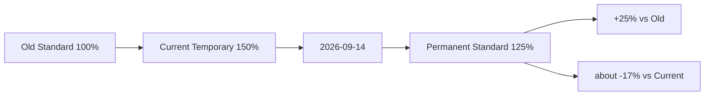

**Mermaid diagram B: why quota percentages are not enough**

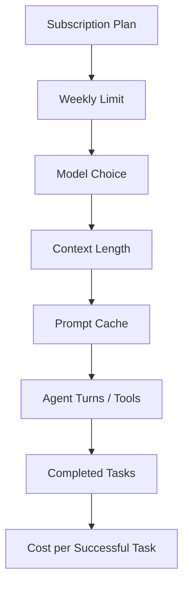

**Sources**:
- [ClaudeDevs announcement archived by Techmeme](https://www.techmeme.com/260829/p13)
- [The Mac Observer: Anthropic raises Claude Code weekly limits by 25%](https://www.macobserver.com/news/anthropic-raises-claude-code-weekly-limits-by-25-for-paid-plans/)

---

### 3. ChatGPT can import and automatically sync Plugin Marketplaces from GitHub, turning enterprise Plugins into a software supply chain

- Category: Harness / Agent / MCP / AI Coding / Security
- Information status: Official product update
- Published: OpenAI release notes dated 2026-08-28; page updated during this reporting window
- Availability: Available for ChatGPT Business, Enterprise, and Edu

**Fact summary**: OpenAI added **Import and sync plugin marketplaces from GitHub** to its ChatGPT Business and Enterprise / Edu release notes. Workspace admins and owners can import public or private GitHub repositories as organizational Plugin Marketplaces and keep them updated through automatic daily sync or trigger `Sync now` manually. :contentReference[oaicite:14]{index=14}

Importing a Marketplace does not automatically grant app access or connect member accounts. New Plugins remain subject to Workspace installation policy, required apps, authentication, and permissions; repository-level declarations cannot override Workspace controls. :contentReference[oaicite:15]{index=15}

**What changed versus before**: ChatGPT / Codex already supported Plugin directories, workspace sharing, Skills, Apps, and MCP integrations, but organizations still had to manage the distribution lifecycle more manually.

A GitHub repository can now function as a **continuously synchronized software distribution source**:

`Git Repository → Marketplace → Workspace Directory → Role / Permission → User Install`

The important change is lifecycle management, not simply Plugin installation.

**Why it matters**: Enterprise Harness scaling is rarely blocked by whether a developer can create one Skill or Plugin. The hard questions are:

- How is it distributed?
- How is it upgraded?
- Who approves it?
- Who is allowed to install it?
- Which Apps does it depend on?
- Does a new version expand permissions?
- How is it rolled back and audited?

GitHub synchronization enables a Git-based PluginOps model: code, manifests, Skills, MCP settings, and versions can pass through PR / Code Review before the Workspace automatically receives them.

This closely resembles GitOps and Infrastructure-as-Code practices.

**Practical impact**: Teams maintaining internal Harnesses or security approval workflows can treat the Plugin Marketplace repository as a production-controlled repository. Security reviewers can evaluate changes in GitHub using CODEOWNERS, static checks, manifest diffs, and permission review rather than manually inspecting every Plugin in the ChatGPT UI.

However, automatic synchronization increases supply-chain blast radius: one bad merge may propagate on the next sync, so the Marketplace repository deserves protections comparable to production CI/CD configuration.

**Role perspective**:
- AI Builder: dramatically lower friction for distributing internal Skills / MCP / Plugins.
- Tech Lead: Plugin Marketplaces can become formal GitOps assets.
- Security: Plugin manifests and app permissions become code-review objects.
- Department manager: organizations can build a curated internal Agent Capability Catalog.

**Action to borrow**: Create a protected `ai-plugin-marketplace` repository with:
- Branch protection;
- CODEOWNERS;
- Security + Platform dual review;
- Plugin-manifest diffing;
- App / MCP permission checks;
- Release tags and rollback rules.

Connect that repository to the Workspace Marketplace rather than synchronizing an ordinary development repository.

**Risks and uncertainty**: Daily synchronization expands the blast radius of a bad release. Plugins may also depend on external Apps, MCP servers, and OAuth scopes, so repository approval does not automatically make runtime permissions safe. OpenAI explicitly retains Workspace Policy as the final control layer.

**Next signals to watch**:
1. Pinning Marketplaces to commit SHA / release tags;
2. Staging Workspaces for Plugin upgrades;
3. Approval gates for permission changes;
4. Exportable Marketplace-sync audit events.

**Mermaid diagram A: GitHub Marketplace distribution**

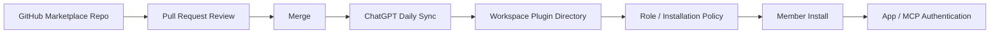

**Mermaid diagram B: recommended PluginOps control plane**

**Sources**:
- [ChatGPT Business Release Notes](https://help.openai.com/en/articles/11391654-chatgpt-business-release-notes)
- [ChatGPT Enterprise & Edu Release Notes](https://help.openai.com/en/articles/10128477-chatgpt-enterprise-edu-release-notes)

---

### 4. Sony Music Publishing and Warner Chappell sue Anthropic, pushing training-data provenance back into frontier-model risk management

- Category: Policy & Industry / Security / Model Governance
- Information status: Authoritative media reporting; complaint filed, allegations not adjudicated
- Published: Complaint filed late 2026-08-28 in the U.S. District Court for the Northern District of California; publicly reported on 2026-08-29
- Availability: Not applicable

**Fact summary**: Sony Music Publishing and Warner Chappell Music jointly sued Anthropic in the Northern District of California and named CEO Dario Amodei and co-founder Benjamin Mann as individual defendants. The publishers allege Anthropic unlawfully acquired, copied, and used large volumes of copyrighted musical compositions in training Claude and seek statutory damages of up to $150,000 for each work found willfully infringed. Anthropic had not publicly responded to the new allegations at the time of reporting. :contentReference[oaicite:16]{index=16}

These are plaintiffs' allegations and should not be presented as established judicial findings. The music-publishing industry has already brought several related cases against Anthropic involving thousands to tens of thousands of works, and Sony / Warner's participation materially expands the litigation front. :contentReference[oaicite:17]{index=17}

**What changed versus before**: AI copyright litigation is not new, but this case matters for two reasons.

First, the dispute increasingly concerns **how training data was acquired**, not merely whether a particular model output infringes.

Second, company founders are named individually, bringing data-acquisition decisions and executive governance into the litigation rather than treating the issue solely as model-output behavior.

**Why it matters**: For AI Builders, the underlying engineering concept is **Training Data Provenance**.

When a model provider cannot clearly answer:
- where data came from;
- whether it was licensed;
- whether it was torrented or scraped;
- whether copyright metadata was removed;
- which dataset version contained it;

enterprise customers have difficulty assessing the complete supply-chain risk.

As frontier models become embedded in content, advertising, design, and knowledge workflows, provider-side training-data exposure can indirectly affect customers through indemnification terms, model availability, regional restrictions, or output policies.

**Practical impact**: Enterprises do not need to stop using Claude because of a complaint, but procurement and model governance should evaluate provider legal / provenance risk separately from technical SLA.

Teams training or fine-tuning their own models face an even more direct lesson: dataset registries should retain source, license, acquisition method, version, removal requests, and processing history.

**Role perspective**:
- AI Builder: proprietary training data needs traceable provenance.
- Tech Lead: datasets require versioning just like model artifacts.
- Product owner: music, advertising, and content-generation products need stronger IP review.
- Department manager: provider legal exposure belongs in long-term vendor scorecards.

**Action to borrow**: Introduce a minimum provenance schema:

`dataset_id → source → license → acquisition_method → collected_at → processing → model_version`

Data that cannot populate these fields should not quietly enter a long-lived production training corpus.

**Risks and uncertainty**: The central infringement claims remain allegations and have not been finally adjudicated. Maximum statutory damages are not the same as an eventual award. Dismissal, settlement, fair-use rulings, or other procedures could materially alter the case.

**Next signals to watch**:
1. Anthropic's formal response;
2. How the court treats training-time copying and fair use;
3. Whether discovery forces more detailed training-data disclosure;
4. Whether enterprise model contracts add stronger training-data indemnities.

**Mermaid diagram**

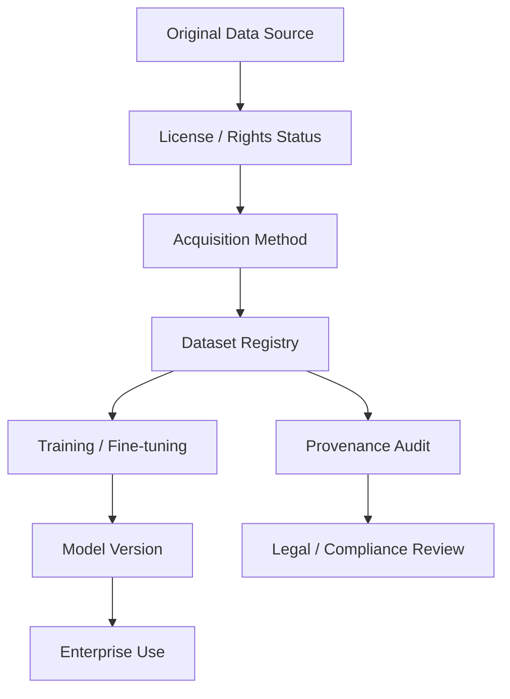

**Sources**:
- [Axios: Sony, Warner sue Anthropic](https://www.axios.com/2026/08/29/anthropic-sony-warner-music-copyright)
- [Music Business Worldwide: Sony Music Publishing and Warner Chappell sue Anthropic](https://www.musicbusinessworldwide.com/now-sony-music-publishing-and-warner-chappell-sue-anthropic-in-multi-billion-dollar-lawsuit-one-of-the-largest-and-most-blatant-ongoing-thefts-of-intellectual-property-in-history/)

## D. AI Trend Summary

### Trends supported by current facts

**Trend 1: “Multi-model” Harnesses are exposing their true supply-chain nature.** Cursor shows that an API adapter does not guarantee permanent model availability. Change-of-control clauses, contracts, competitive relationships, and usage policies can all change the upstream supply.

**Trend 2: Agent quota and cost governance are becoming core product capabilities.** Claude Code's weekly-limit change reinforces that subscription price is not a useful standalone measure of Agent capacity. Session length, model choice, caching, tool turns, and weekly limits jointly determine how many tasks actually get completed.

**Trend 3: Plugin / Skill / MCP ecosystems are moving from personal extensions into enterprise software supply chains.** Once ChatGPT can synchronize Marketplaces from GitHub, Plugins can enter PR review, CODEOWNERS, version control, and Workspace Policy — effectively becoming a combination of package manager and enterprise app store.

**Trend 4: Model governance is extending farther upstream into training data.** The Sony / Warner lawsuit against Anthropic illustrates that AI risk does not begin with prompts, outputs, or Agent actions; it also begins with how the underlying training corpus was acquired and governed.

### Analytical inference

**Inference 1: The durable enterprise Harness asset will not be one model, but the control plane that makes models replaceable.** A stable platform must manage availability, fallback, evals, tools, plugins, identity, cost, and audit so business workflows survive provider changes.

**Inference 2: Model gateways and Plugin gateways are converging conceptually.** One controls which intelligence can be invoked; the other controls which capabilities can be invoked. Both ultimately require policy, versioning, identity, cost, telemetry, and supply-chain governance.

**Trend overview**

## E. Actions to Consider Today

1. **Role: AI Platform / Tech Lead | Action: build a Model Availability and Fallback Matrix for every production Coding Harness.** **Why now**: the Cursor event proves model supply can disappear because of contracts and control changes. **Action type: Execute now.**

2. **Role: heavy Claude Code users / Department manager | Action: record a two-week usage baseline before September 14.** **Why now**: permanent capacity will be roughly 17% below today's temporary allowance, and you need to know which workflows are actually affected. **Action type: Continuous observation.**

3. **Role: AI Platform / Security | Action: move internal Plugin Marketplace management into GitOps.** Use a protected GitHub repository, CODEOWNERS, manifest diffs, permission review, and release tags before enabling Workspace sync. **Why now**: ChatGPT now supports automatic GitHub Marketplace synchronization. **Action type: Add to roadmap.**

4. **Role: Model Governance / Legal / Tech Lead | Action: establish a minimum Data Provenance Registry for internal training corpora.** **Why now**: AI copyright disputes are increasingly focused on acquisition of training data itself, not merely model outputs. **Action type: Risk review.**
