````markdown
<!-- 中文版 -->
# AI 今日头条｜2026 年 08 月 31 日

- 语言：中文
- 时区：Asia/Singapore
- 新闻窗口：2026-08-30 07:30 至 2026-08-31 07:30
- 实际检索截止时间：2026-08-31 07:16
- 本期核心新闻：3 条
- 其他值得关注：1 条
- **今日高价值事件较少**
- 注：本次执行早于固定新闻窗口结束约 14 分钟，因此实际检索覆盖至 07:16；07:16–07:30 之间若出现新事件，应在下一次运行中补检。

## A. 今日最重要的 3 件事

**1. Claude 活跃登录 Session 正成为 Infostealer 的直接变现目标。** Anthropic 已向受影响用户确认，Vidar、LummaC2、StealC、RedLine、Acreed，以及少量 macOS 上的 Atomic Stealer 等通用 Infostealer 会窃取已经完成认证的 Claude Session，再被攻击者拿来访问账号和消耗 Usage；今天的新变化不是攻击刚刚开始，而是这一 Campaign 的机制、涉及的 Malware Family 和 Anthropic 的处置方式被可信安全媒体系统性公开。它提醒企业：在 Agent / AI SaaS 时代，Session Token 已经和 API Key 一样是高价值机器凭证，2FA 本身无法阻止已认证 Session 被复制。 :contentReference[oaicite:0]{index=0}

**2. Cloudflare AI Search 正式加入 GLM-5.3 Flash，把这款 1M Context 模型从“可调用的 Workers AI 模型”进一步推进到托管 Retrieval / RAG 工作流。** GLM-5.3 Flash 本身并非今天发布；今天真正的新状态是 `@cf/zai-org/glm-5.3-flash` 已可直接作为 AI Search 的生成模型，运行于 Workers AI。对 AI Builder 来说，这是模型生态成熟度的重要信号：模型发布后的竞争不只看 API 和 Benchmark，还看它多久能进入 RAG、Gateway、Serving 和企业运行时。 :contentReference[oaicite:1]{index=1}

**3. OpenAI 在 8 月 30 日正式退休 ChatGPT 中的官方 DALL·E GPT，图像生成入口继续向 ChatGPT Images 收敛。** 这不是 OpenAI 停止图像生成，而是旧的独立 DALL·E GPT 产品面被撤下；用户创建的、启用了图像生成能力的 GPT 不受影响。对产品团队而言，这体现出一个持续趋势：模型品牌级入口逐渐让位于统一的多模态产品能力，应用不宜深度绑定某个历史 UI / GPT Surface。 :contentReference[oaicite:2]{index=2}

## B. 新闻正文

### 1. Anthropic 确认 Claude Session 被 Infostealer 窃取并用于消耗额度：2FA 之后的 Session Security 成为新边界

- 类别：安全 / Harness / AI 编程
- 信息状态：权威媒体报道 + Anthropic 向受影响用户发送的确认邮件
- 发布时间：2026-08-30 公开披露；攻击与用户通知早于本日已经存在
- 可用状态：不适用

**事实摘要**：BleepingComputer 披露，Anthropic 正在联系一批 Claude 用户，其设备上的通用 Infostealer Malware 窃取了已经登录的 Claude Session，攻击者随后直接复用这些 Session 访问账户并消耗 Claude Usage。Anthropic 已识别 Windows 上的 Vidar、LummaC2、StealC、RedLine、Acreed，以及少量 macOS 上的 Atomic Stealer（AMOS）。Anthropic 强调，这些 Malware 并非通过 Claude 安装，也不是 Claude 自身被植入恶意代码，而是用户终端先被通用 Infostealer 感染。 :contentReference[oaicite:3]{index=3}

Anthropic 对被识别的受害账户采取的措施包括撤销相关 Session、重新设置 Usage Limit，并退还被识别出的 Unauthorized Extra-usage Charge。Anthropic 还提醒用户，仅仅把 Claude 登出并不能清除本机 Malware；如果设备仍然被感染，用户重新登录后产生的新 Session 仍然可能再次被窃取。 :contentReference[oaicite:4]{index=4}

**相较此前的变化**：这一攻击活动本身并不是 8 月 30 日才开始。受影响用户此前已经收到 Anthropic 的个别通知。**今日新增**是：可信安全媒体首次较完整地公开了 Anthropic 对攻击机制、受影响 Malware Family、异常 Usage 症状以及补救方式的说明，因此它进入今天的信息窗口，而不是把此前的感染日期重新包装成新事件。 :contentReference[oaicite:5]{index=5}

这一区别很重要，因为它揭示的不是 Claude 特有漏洞，而是越来越普遍的 AI SaaS Credential Risk：攻击者不必获取密码，也不必再次突破 MFA，只需要取得浏览器或本地客户端已经认证的 Session。

**为什么重要**：传统企业身份安全经常把 MFA / SSO 当成认证完成后的主要安全边界。但 Session Theft 攻击发生在认证之后：

`Password + MFA → Valid Session → Endpoint Malware Copies Session → Attacker Replays Session`

因此 MFA 并没有被“破解”；它只是不会再次被触发。

对 Claude Code、ChatGPT、Cursor、GitHub Copilot、云控制台乃至 Browser Agent 来说，这个问题都会越来越重要，因为高价值 Session 可能同时代表：

- 模型 Usage / Credits；
- 已连接的企业 App；
- Repo 或 Workspace 上下文；
- Cloud / Browser 操作权限；
- 已经完成的 OAuth / SSO 授权。

一旦 AI Workspace 从“聊天工具”变成能够调用工具的 Agent Harness，Session Token 的实际 Capability 就会不断扩大。

**实际影响**：企业部署 Claude / Claude Code 时，Endpoint Security、Session Revocation、设备可信度与 Usage Anomaly Detection 应进入同一套治理体系。仅要求员工开启 MFA 不够。

特别值得监控的信号包括：

- 用户没有工作但 Usage 快速消耗；
- Session 的地理位置或网络 ASN 突然变化；
- 同一 Session 在多个设备指纹并行使用；
- 夜间出现高频模型调用；
- 用户重新登录后短时间内再次出现异常消耗。

对于 API / Harness 平台，也应避免把长期有效的 Browser Cookie、CLI Login State 或 OAuth Refresh Credential 暴露给不可信 Plugin、下载程序和高权限 Agent。

**角色视角**：
- AI Builder：AI 产品的 Session Token 应按 Secret 对待。
- Tech Lead：SSO + MFA 后还需要 Session Monitoring 和快速全局撤销。
- 部门经理：Usage 异常不一定是员工滥用，也可能是 Credential Theft。
- 安全负责人：Endpoint Detection 与 AI Usage Telemetry 应开始关联。

**可借鉴动作**：把 AI SaaS 纳入企业的 Session Incident Playbook。至少定义：

`异常 Usage → 强制 revoke all sessions → 隔离设备 → Malware Scan → 重置 Credentials → 再登录 → 监控新 Session`

不要在设备清理之前只做 Password Reset 后立即重新登录。

**风险与不确定性**：目前没有公开准确的受影响用户数量，也没有 Anthropic 的公开 Security Advisory 页面给出完整 Campaign IOC。现有详细信息主要来自 Anthropic 发给受影响用户的邮件，经安全媒体核实报道，因此不能据此推断 Claude 平台本身遭到服务器端入侵。 :contentReference[oaicite:6]{index=6}

**下一步观察**：
1. Anthropic 是否发布正式 Security Advisory / IOC；
2. Claude 是否增加 Session Device List、强制 Session Rotation 或设备绑定；
3. Claude Code / Claude Desktop 是否强化本地 Credential Storage；
4. 企业 Usage API 是否增加异常调用和 Session Risk Signal。

**Mermaid 图示 A：Session Theft 的攻击链**

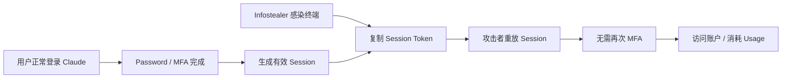

**Mermaid 图示 B：企业处置流程**

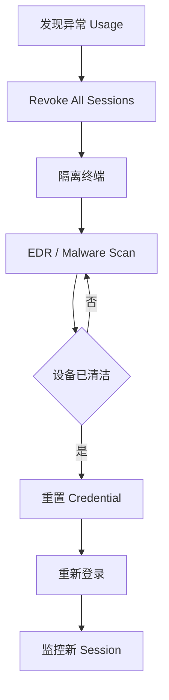

**来源**：
- BleepingComputer：Anthropic warns infostealer malware is hijacking Claude sessions to drain usage。 :contentReference[oaicite:7]{index=7}

---

### 2. Cloudflare AI Search 加入 GLM-5.3 Flash：1M Context 模型正式进入托管 RAG / Retrieval 工作流

- 类别：模型 / 基础设施 / Model Routing / RAG
- 信息状态：官方产品更新
- 发布时间：2026-08-30；未公布准确时间
- 可用状态：已公开可用；Cloudflare AI Search / Workers AI

**事实摘要**：Cloudflare 在 8 月 30 日更新 AI Search，新增 `@cf/zai-org/glm-5.3-flash` 作为 Text Generation Model。Cloudflare 标注该模型的 Context Window 为 1,048,576 Tokens，并确认它运行在 Workers AI 上。用户现在可以在创建或修改 AI Search Instance 时直接选择该模型。 :contentReference[oaicite:8]{index=8}

需要区分两个时间点：GLM-5.3 Flash 在 Workers AI 上可直接推理是 **8 月 26 日**已经发生的事情；**今日新增**的是 AI Search 正式把它纳入托管 Retrieval / Generation Pipeline。也就是说，这不是重复报道模型发布，而是新的产品可用性状态。 :contentReference[oaicite:9]{index=9}

**相较此前的变化**：此前使用 GLM-5.3 Flash on Workers AI，开发者需要自己组织 Retrieval、Prompt Assembly、Vector Search 和 Generation。AI Search 本身则负责文档索引、检索与生成链条。

加入 AI Search 后，GLM-5.3 Flash 开始从单纯的 Inference Model 进入一种更完整的 Cloud-native RAG 运行环境：

`Content → Index → Retrieval → Context Assembly → GLM-5.3 Flash → Answer`

对于企业平台团队，这比“又增加了一个 API Model ID”更值得关注。

**为什么重要**：模型真正进入生产，不仅依赖模型权重或 API，还依赖外围生态：

- Serving；
- Gateway；
- RAG；
- Observability；
- Auth；
- Cache；
- Regional Deployment；
- Cost Control。

Cloudflare 在模型发布后几天内把 GLM-5.3 Flash 从 Workers AI 进一步接入 AI Search，说明 Open-weight / Chinese Frontier Model 与主流云平台之间的 Integration Lag 正在快速缩短。

这也说明“开放模型 vs 闭源 API”的边界继续变模糊。企业即使不自己管理 GPU，也可以通过 Cloudflare 等平台消费开放权重模型，同时继续使用托管 Retrieval、Gateway 和边缘基础设施。

**实际影响**：已经使用 Cloudflare AI Search 的团队，现在可以把 GLM-5.3 Flash 纳入 RAG 模型 A/B Test，而无需自建完整 Serving。

建议重点评测的不是 1M Context 本身，而是：

- Recall@K；
- Answer Groundedness；
- Long-document Retrieval；
- Context Packing；
- Time-to-first-token；
- 每个成功答案成本；
- 大 Context 下的 Hallucination / Lost-in-the-middle。

1M Context 并不意味着可以放弃 Retrieval。恰恰相反，当输入越来越长，Retrieval Quality 和 Context Selection 往往变得更重要，因为发送更多 Token 仍然会增加延迟、成本和注意力噪声。

**角色视角**：
- AI Builder：可以低摩擦测试 GLM-5.3 Flash RAG。
- 产品负责人：开放模型更容易进入托管产品，不再意味着必须自运维 GPU。
- Tech Lead：可以统一比较 Cloudflare 上多个模型的 RAG 成功任务成本。
- 部门经理：多模型策略进一步从理论能力变成实际云服务能力。

**可借鉴动作**：用同一批真实企业文档，至少做三组对照：

`现有默认模型 / GLM-5.3 Flash / 更小低价模型`

固定 Retriever 和 Prompt，只替换 Generation Model；随后再固定 Generation Model、调整 Retrieval / Context Size。这样可以区分“模型能力提升”和“检索质量提升”究竟谁在影响最终答案。

**风险与不确定性**：Cloudflare 的 Changelog 只确认 AI Search 的模型可用性与 Context Window，并没有证明所有 1M Token 输入都能在真实 RAG 场景保持同样的质量、延迟或成本效率。GLM-5.3 Flash 的 Benchmark 也不能直接替代企业文档任务的评测。 :contentReference[oaicite:10]{index=10}

**下一步观察**：
1. Cloudflare 是否为 GLM-5.3 Flash 增加多模态 AI Search；
2. AI Search 是否开放更细的 Model Routing；
3. 1M Context 对 TTFT / Cost 的真实影响；
4. GLM / Qwen / DeepSeek / Kimi 在 AI Search 中的实际任务级比较。

**Mermaid 图示 A：从模型 Endpoint 到托管 RAG**

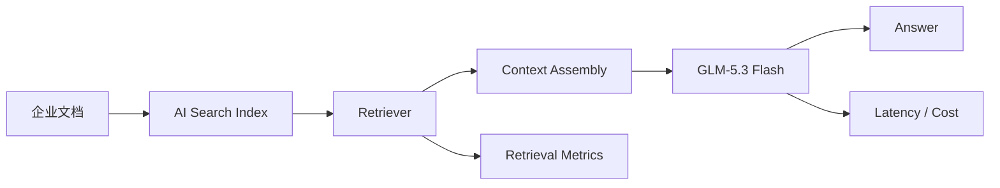

**Mermaid 图示 B：正确的评测方式**

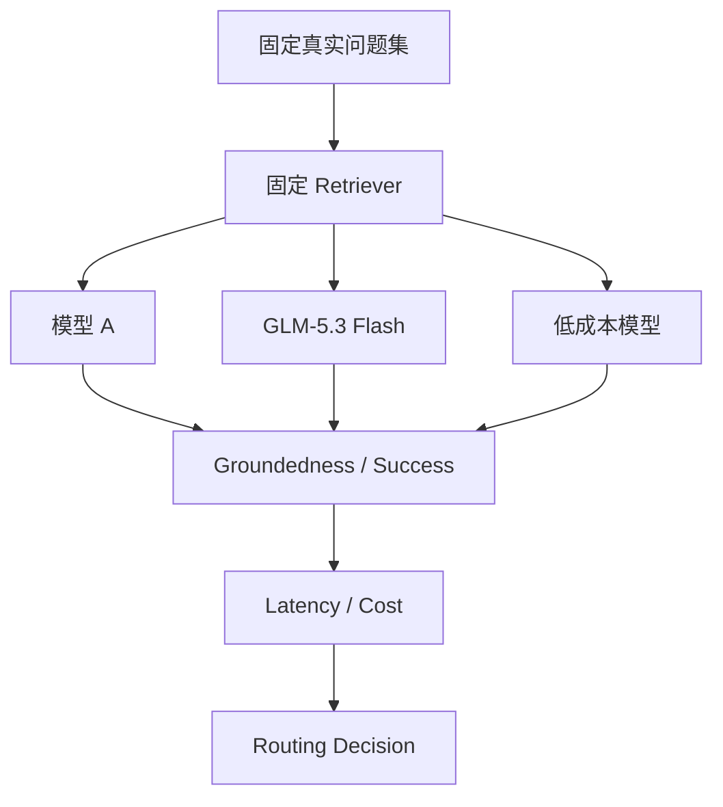

**来源**：
- Cloudflare Changelog：AI Search now supports GLM-5.3 Flash。 :contentReference[oaicite:11]{index=11}
- Cloudflare Workers AI：GLM-5.3 Flash earlier availability context。 :contentReference[oaicite:12]{index=12}

---

### 3. OpenAI 正式退休 ChatGPT 中的官方 DALL·E GPT：图像生成产品面继续向 ChatGPT Images 收敛

- 类别：模型可用性 / 产品 / 多模态
- 信息状态：官方产品更新
- 发布时间：2026-08-30
- 可用状态：官方 DALL·E GPT 已退休；ChatGPT Images 继续可用

**事实摘要**：OpenAI 此前在 ChatGPT Release Notes 中宣布，官方 DALL·E GPT 将于 **2026 年 8 月 30 日**退休，该日期现已到达。OpenAI 建议用户保存希望保留的 DALL·E 生成图片，并明确表示后续图像创建与编辑应使用 ChatGPT Images。用户自己创建、且启用了 Image Generation 的 GPT 不受此次变化影响。 :contentReference[oaicite:13]{index=13}

因此这不是“OpenAI 关闭图像生成”，也不是 DALL·E 技术整体突然停止服务，而是 ChatGPT 中官方独立 **DALL·E GPT Surface** 的生命周期结束。

**相较此前的变化**：此前这是一个已公告的未来 Deprecation；**今天是实际 Shutdown Date**。从产品状态来看，它已经从“将被退休”变成“已退休”。

这类变化对 AI 产品团队的意义通常比用户界面看起来更大，因为它提醒我们区分三个层次：

- Model / Capability；
- API；
- Product Surface。

某个 Surface 被下线，不一定代表底层能力消失；反过来，即使 API 仍存在，也不意味着特定 UI、GPT 或历史 Workflow 会永久存在。

**为什么重要**：AI 产品正在快速从“每个模型一个产品入口”走向统一的多模态体验。用户并不一定需要知道背后使用了哪一代 Image Model，只关心能否在同一个 Chat / Work / Agent Workflow 中生成和编辑图片。

这对于应用开发者也是一个重要架构原则：不要把长期 Workflow 绑定到某个临时 UI Surface 或产品别名。如果业务真正依赖能力，应尽可能绑定稳定 API / Capability Contract，而不是绑定“某个 GPT 名称存在”。

**实际影响**：对普通 ChatGPT 用户影响有限，主要是入口变化。对曾经把官方 DALL·E GPT 写进操作手册、培训材料或内部 SOP 的团队，应更新指引到 ChatGPT Images。

对于构建内部 Plugin / Automation 的团队，则值得重新检查是否存在对历史产品名称或 Surface 的硬编码依赖。

**角色视角**：
- AI Builder：区分 Model Capability 与 Product Surface 生命周期。
- 产品负责人：面向用户设计能力，而不是绑定模型品牌。
- Tech Lead：自动化尽量依赖稳定接口而非 UI。
- 部门经理：内部培训材料应同步更新。

**可借鉴动作**：对所有关键 AI Workflow 做一次简单 Dependency Review：

`依赖的是 API / Model ID / Plugin / GPT / UI Surface？`

如果关键流程依赖一个没有稳定兼容承诺的 UI Surface，应准备替代路径。

**风险与不确定性**：OpenAI 官方 Release Notes 明确的是“官方 DALL·E GPT”退休，并不是所有用户自建 Image GPT 都失效，也不意味着 ChatGPT Images 被撤下。不要把这次变化描述成“DALL·E 图像生成全面关闭”。 :contentReference[oaicite:14]{index=14}

**下一步观察**：
1. OpenAI 是否进一步收敛旧的 GPT / Image 入口；
2. ChatGPT Images 是否新增更统一的编辑 / Agent API；
3. 企业 Workspace 是否提供旧 DALL·E Workflow 迁移提示。

**Mermaid 图示 A：产品 Surface 收敛**

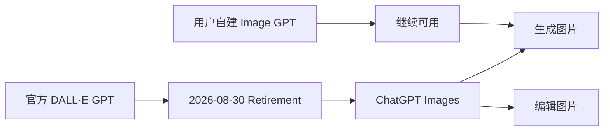

**Mermaid 图示 B：产品依赖层级**

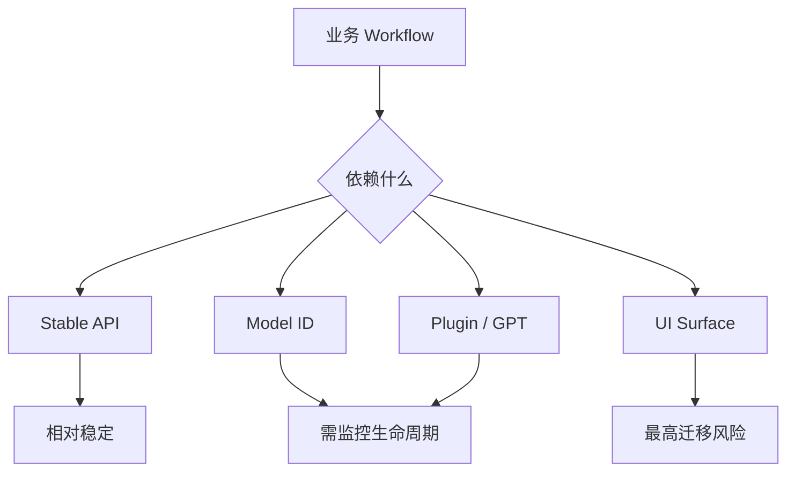

**来源**：
- OpenAI ChatGPT Release Notes：Retiring the DALL·E GPT。 :contentReference[oaicite:15]{index=15}

## C. 其他值得关注

**1. GitHub Copilot CLI 1.0.82 在本期窗口开始后约 9 分钟发布。** GitHub Release 记录显示 v1.0.82 于 8 月 29 日 23:39 发布，换算为 Asia/Singapore 约为 8 月 30 日 07:39。此版本主要修复 `/worktree` / `/move` 准备过程中输入消息会破坏切换的问题，允许 `Ctrl+E` 再次展开完整 Plan Approval Card，并把认证失败从泛化 `/login` 提示改为显示具体错误，例如 `401 Bad credentials`。这些属于实用修复，但不足以抬入今天核心新闻。 :contentReference[oaicite:16]{index=16}

## D. 今日 AI 趋势总结

### 已有事实支持的趋势

**趋势 1：AI SaaS 的 Credential Surface 正从 API Key 扩展到 Session Token。** Claude Infostealer Campaign 说明，模型 Usage、OAuth Connection 和 Agent Workspace 权限本身已经足够有价值，让攻击者专门复用已登录 Session。MFA 之后的 Session Lifecycle 会成为新的企业 AI 安全重点。

**趋势 2：开放模型竞争越来越依赖下游产品集成速度。** GLM-5.3 Flash 从模型发布到 Workers AI，再到 Cloudflare AI Search，只用了很短时间。未来模型能否快速进入 RAG、Gateway、Serving、IDE 和 Agent Harness，可能与 Benchmark 排名同样重要。

**趋势 3：模型产品面继续从“独立模型品牌入口”向统一多模态能力收敛。** DALL·E GPT 退休而 ChatGPT Images 保留，就是 Capability 持续存在、旧 Surface 消失的典型案例。

### 分析推断

**推断 1：企业 AI Control Plane 未来需要同时管理 Identity Session 与 Model / Tool。** 今天很多 Model Gateway 只管 API Key 和 Model Routing，但 Browser / Desktop / SaaS Agent 普及后，还必须理解 Session Identity、Device Trust、OAuth Scope 和 Runtime Capability。

**推断 2：Model Availability 的“最后一公里”正在云平台化。** 开放权重不一定意味着企业自己运 GPU；越来越多开放模型会通过 Workers AI、Cloud Platform、Gateway 和 Managed RAG 进入生产，这会进一步模糊 Open-weight 与 Managed API 的实际使用边界。

**今日趋势总览**

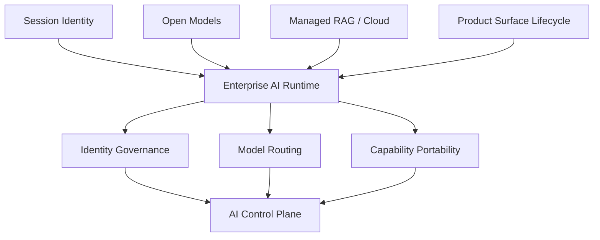

## E. 今日建议关注或采取的动作

1. **角色：Security / Tech Lead｜建议动作：把 Claude、ChatGPT、Cursor 等 AI SaaS 的 Session Theft 纳入 Credential Incident Response。** **为什么现在做**：Infostealer 已经开始把 Claude Session 直接用于消耗额度和账号访问。**动作类型：检查风险。**

2. **角色：AI Builder / AI Platform｜建议动作：如果正在使用 Cloudflare AI Search，安排 GLM-5.3 Flash 与当前模型做同 Retriever 的 A/B Test。** **为什么现在做**：新的模型可用性已经上线，迁移成本很低。**动作类型：安排测试。**

3. **角色：产品负责人 / Tech Lead｜建议动作：检查内部 AI SOP 是否仍依赖官方 DALL·E GPT 入口。** **为什么现在做**：该 Surface 已到正式退休日期，而能力已经迁移到 ChatGPT Images。**动作类型：立即执行。**

4. **角色：AI Platform｜建议动作：在模型与工具治理之外增加 Session / Device 层的可观测字段。** 至少记录 Provider、User、Session Age、Device、Network、Usage Pattern 与 Revocation State。**为什么现在做**：AI Workspace 的有效授权越来越集中在持久 Session 中。**动作类型：纳入路线图。**

---

<!-- English Version -->
# AI Daily Headlines｜2026-08-31

- Language: English
- Time zone: Asia/Singapore
- News window: 2026-08-30 07:30 to 2026-08-31 07:30
- Research cutoff: 2026-08-31 07:16
- Core stories: 3
- Other notable items: 1
- **There were fewer genuinely high-value events today.**
- Note: This run occurred roughly 14 minutes before the fixed news-window close, so research currently covers developments through 07:16. Anything material appearing from 07:16–07:30 should be rechecked in the next run.

## A. The 3 Most Important Things Today

**1. Active Claude login sessions are becoming a direct monetization target for infostealers.** Anthropic has confirmed to affected users that general-purpose malware including Vidar, LummaC2, StealC, RedLine, Acreed, and Atomic Stealer on a small number of Macs can steal already-authenticated Claude sessions, which attackers then reuse to access accounts and consume usage. The new development today is not that the campaign began today, but that a credible security publication has now documented the mechanics, malware families, symptoms, and Anthropic's response in detail. The enterprise lesson is broader: in the Agent / AI SaaS era, session tokens are becoming machine credentials as valuable as API keys, and 2FA does not protect an already-authenticated session that has been copied. :contentReference[oaicite:17]{index=17}

**2. Cloudflare AI Search officially added GLM-5.3 Flash, moving the 1M-context model from “available on Workers AI” into a managed retrieval / RAG workflow.** GLM-5.3 Flash itself is not a new model today. The actual state change is that `@cf/zai-org/glm-5.3-flash` can now be selected directly as the generation model in AI Search while running on Workers AI. For AI Builders, this is an ecosystem-maturity signal: competition after a model launch increasingly depends not only on APIs and benchmarks but also on how quickly a model enters RAG, gateways, serving stacks, and enterprise runtimes. :contentReference[oaicite:18]{index=18}

**3. OpenAI officially retired the DALL·E GPT in ChatGPT on August 30, continuing the consolidation of image generation into ChatGPT Images.** OpenAI is not ending image generation; it is retiring the legacy standalone DALL·E GPT product surface. User-created GPTs with image-generation capability remain unaffected. For product teams, this reinforces a persistent pattern: model-branded entry points are gradually giving way to unified multimodal capabilities, so applications should avoid deep dependencies on historical UI / GPT surfaces. :contentReference[oaicite:19]{index=19}

## B. Core Stories

### 1. Anthropic confirms Claude sessions are being stolen by infostealers and used to drain usage: post-MFA session security becomes a critical boundary

- Category: Security / Harness / AI Coding
- Information status: Authoritative media report + Anthropic confirmation emails sent to affected users
- Published: Publicly documented on 2026-08-30; the underlying campaign and user notifications began earlier
- Availability: Not applicable

**Fact summary**: BleepingComputer reports that Anthropic has been contacting Claude users whose machines were infected with general-purpose infostealer malware that copied authenticated Claude sessions. Attackers then reused those sessions to access accounts and consume Claude usage. Anthropic identified Vidar, LummaC2, StealC, RedLine, and Acreed on Windows, plus Atomic Stealer (AMOS) on a small number of Macs. Anthropic emphasized that the malware was not installed through Claude and does not represent malware embedded in Claude itself; the endpoints were compromised first. :contentReference[oaicite:20]{index=20}

Anthropic's mitigation for identified victims includes revoking affected sessions, resetting usage limits, and refunding unauthorized extra-usage charges it identifies. The company also warns that signing out of Claude only invalidates the stolen session — it does not remove malware from the endpoint. If the machine remains infected, the next session created after login can be stolen again. :contentReference[oaicite:21]{index=21}

**What changed versus before**: The campaign itself did not begin on August 30. Some affected users had already received direct Anthropic notifications. **What's new today** is the broader, detailed public disclosure by a credible security publication of Anthropic's explanation of the mechanism, affected malware families, usage symptoms, and remediation steps. That public disclosure is what places the story in today's information window rather than pretending the original infections are new. :contentReference[oaicite:22]{index=22}

The key lesson is not a Claude-specific server vulnerability but an increasingly important AI SaaS credential risk: an attacker does not need the password and does not need to defeat MFA again if they can copy an already-authenticated browser or client session.

**Why it matters**: Enterprise identity programs often treat MFA / SSO as the primary security boundary. Session theft happens after that boundary:

`Password + MFA → Valid Session → Endpoint Malware Copies Session → Attacker Replays Session`

MFA was not technically “bypassed”; it simply is not requested again.

For Claude Code, ChatGPT, Cursor, GitHub Copilot, cloud consoles, and Browser Agents, the issue becomes more important because a high-value session can increasingly represent:

- model usage / credits;
- connected enterprise apps;
- repository or workspace context;
- cloud / browser operating authority;
- completed OAuth / SSO grants.

As an AI workspace evolves from a chatbot into a tool-using Agent Harness, the effective capability represented by its session token grows.

**Practical impact**: Enterprises deploying Claude / Claude Code should treat endpoint security, session revocation, device trust, and usage anomaly detection as one governance problem. Requiring MFA alone is insufficient.

Useful monitoring signals include:

- usage increasing while the employee is inactive;
- abrupt geography or network-ASN changes;
- simultaneous use of one session across different device fingerprints;
- high-frequency inference activity during unusual hours;
- abnormal consumption returning shortly after the user signs in again.

API and Harness platforms should also avoid exposing long-lived browser cookies, CLI login state, or OAuth refresh credentials to untrusted plugins, downloaded applications, or highly privileged agents.

**Role perspective**:
- AI Builder: treat AI-product session tokens as secrets.
- Tech Lead: SSO + MFA still requires session monitoring and rapid global revocation.
- Department manager: abnormal usage can indicate credential theft, not employee abuse.
- Security lead: endpoint detection and AI usage telemetry should increasingly be correlated.

**Action to borrow**: Add AI SaaS to the enterprise Session Incident Playbook:

`Abnormal usage → Revoke all sessions → Isolate device → Malware scan → Reset credentials → Re-login → Monitor new session`

Do not simply reset the password and immediately log back in before the endpoint is clean.

**Risks and uncertainty**: No reliable public number of affected users is available, and Anthropic has not published a public security advisory containing full campaign IOCs. The detailed information currently comes primarily from Anthropic emails to affected users that were verified and reported by security media, so this should not be described as evidence of a server-side Claude breach. :contentReference[oaicite:23]{index=23}

**Next signals to watch**:
1. A formal Anthropic security advisory or IOC set;
2. Claude session device lists, forced session rotation, or device binding;
3. Stronger credential storage in Claude Code / Claude Desktop;
4. Enterprise usage APIs exposing abnormal-call or session-risk signals.

**Mermaid diagram A: session-theft attack chain**

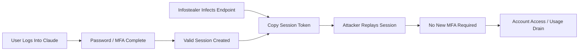

**Mermaid diagram B: enterprise response**

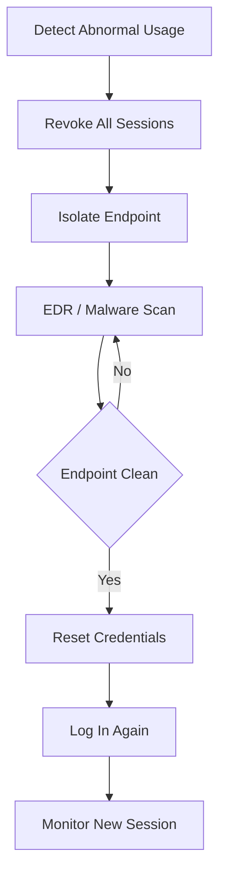

**Source**:
- BleepingComputer: Anthropic warns infostealer malware is hijacking Claude sessions to drain usage. :contentReference[oaicite:24]{index=24}

---

### 2. Cloudflare AI Search adds GLM-5.3 Flash: the 1M-context model enters a managed RAG / retrieval workflow

- Category: Model / Infrastructure / Model Routing / RAG
- Information status: Official product update
- Published: 2026-08-30; exact time not published
- Availability: Publicly available in Cloudflare AI Search / Workers AI

**Fact summary**: Cloudflare updated AI Search on August 30 to support `@cf/zai-org/glm-5.3-flash` as a text-generation model. Cloudflare lists a context window of 1,048,576 tokens and confirms that the model runs on Workers AI. Users can now select it while creating or updating an AI Search instance. :contentReference[oaicite:25]{index=25}

Two dates need to be distinguished. Direct GLM-5.3 Flash inference on Workers AI became available on **August 26**. **Today's new state** is the addition of GLM-5.3 Flash to AI Search's managed retrieval / generation pipeline. This is therefore not a duplicate of the model launch itself. :contentReference[oaicite:26]{index=26}

**What changed versus before**: Previously, using GLM-5.3 Flash on Workers AI meant that developers still had to assemble retrieval, prompt construction, vector search, and generation themselves. AI Search provides a managed indexing, retrieval, and generation chain.

With today's integration, GLM-5.3 Flash moves from a model endpoint into a more complete cloud-native RAG environment:

`Content → Index → Retrieval → Context Assembly → GLM-5.3 Flash → Answer`

For enterprise platform teams, this matters more than simply adding another model ID.

**Why it matters**: Production adoption of a model depends on more than weights and API availability. It also depends on:

- serving;
- gateways;
- RAG;
- observability;
- authentication;
- caching;
- regional deployment;
- cost controls.

Cloudflare moving GLM-5.3 Flash from Workers AI into AI Search only days after model availability shows that integration lag between open-weight / Chinese frontier models and mainstream cloud infrastructure is shrinking.

It also blurs the practical line between open weights and proprietary managed APIs. Enterprises can consume an open-weight model through a managed cloud service without operating GPUs themselves, while retaining managed retrieval, gateways, and edge infrastructure.

**Practical impact**: Existing Cloudflare AI Search users can now add GLM-5.3 Flash to RAG A/B tests without standing up a new inference stack.

The evaluation should focus less on “1M context” as a headline and more on:

- Recall@K;
- answer groundedness;
- long-document retrieval;
- context packing;
- time to first token;
- cost per successful answer;
- hallucination / lost-in-the-middle behavior under large context.

A 1M context window does not eliminate the need for retrieval. As prompts grow, retrieval quality and context selection may become more important because extra tokens still increase latency, cost, and attention noise.

**Role perspective**:
- AI Builder: low-friction path to evaluating GLM-5.3 Flash for RAG.
- Product owner: open models increasingly enter managed products without requiring self-operated GPUs.
- Tech Lead: compare RAG success economics across multiple Cloudflare-hosted models.
- Department manager: multi-model architecture becomes more operationally practical.

**Action to borrow**: Run three versions of the same production document workload:

`Current default model / GLM-5.3 Flash / Smaller low-cost model`

First hold the retriever and prompt constant while changing only the generation model. Then hold the generation model constant while changing retrieval and context size. This separates model improvements from retrieval improvements.

**Risks and uncertainty**: Cloudflare's changelog confirms availability and context size but does not establish that all 1M-token workloads retain equivalent quality, latency, or cost efficiency. Model benchmark results should not substitute for evaluations on the organization's real documents. :contentReference[oaicite:27]{index=27}

**Next signals to watch**:
1. Multimodal AI Search support for GLM-5.3 Flash;
2. Finer-grained routing inside AI Search;
3. Real TTFT / cost at very large context sizes;
4. Task-level comparisons among GLM, Qwen, DeepSeek, and Kimi inside managed retrieval.

**Mermaid diagram A: from model endpoint to managed RAG**

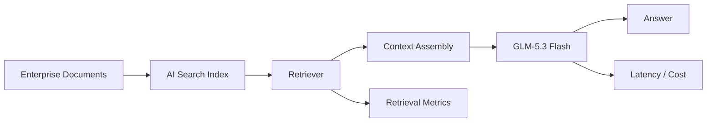

**Mermaid diagram B: correct evaluation structure**

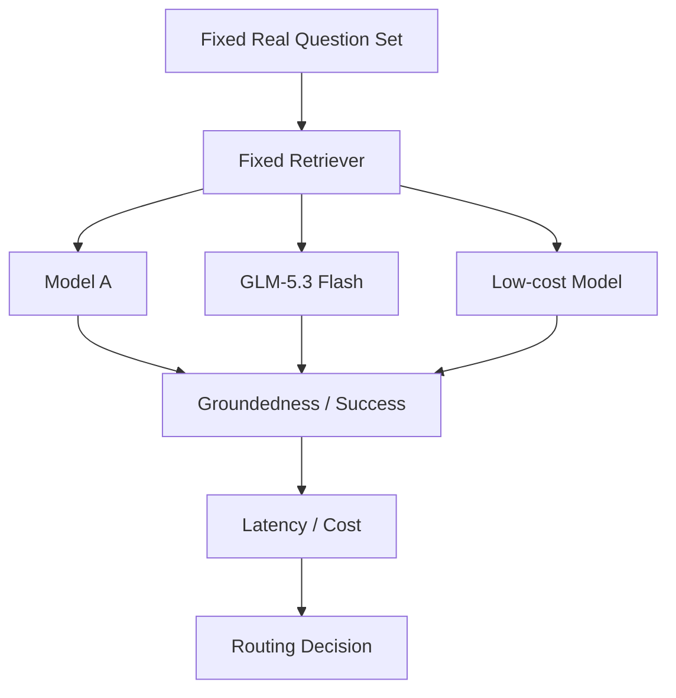

**Sources**:
- Cloudflare Changelog: AI Search now supports GLM-5.3 Flash. :contentReference[oaicite:28]{index=28}
- Cloudflare Workers AI: earlier GLM-5.3 Flash availability context. :contentReference[oaicite:29]{index=29}

---

### 3. OpenAI officially retires the DALL·E GPT in ChatGPT, continuing the consolidation of image generation into ChatGPT Images

- Category: Model Availability / Product / Multimodal
- Information status: Official product update
- Published: 2026-08-30
- Availability: Official DALL·E GPT retired; ChatGPT Images remains available

**Fact summary**: OpenAI previously announced in the ChatGPT release notes that the official DALL·E GPT would be retired on **August 30, 2026**, and that date has now arrived. OpenAI advised users to preserve DALL·E images they wanted to keep and directs future image creation and editing to ChatGPT Images. User-created GPTs with image-generation capability are not affected by this change. :contentReference[oaicite:30]{index=30}

This is therefore not “OpenAI shutting down image generation,” nor does it mean every DALL·E-related technical component instantly disappears. It is specifically the end of the standalone official **DALL·E GPT surface** inside ChatGPT.

**What changed versus before**: Previously this was an announced future deprecation. **Today is the actual shutdown date.** The product state has changed from “scheduled for retirement” to “retired.”

The event illustrates why teams should distinguish among:

- Model / Capability;
- API;
- Product Surface.

A surface can disappear while the underlying capability continues. Conversely, an API can remain available while a specific GPT, interface, or historical workflow is removed.

**Why it matters**: AI products continue moving from “one model brand, one entry point” toward unified multimodal experiences. Users increasingly care less about which generation model is behind the UI and more about whether the same Chat / Work / Agent workflow can create and edit images.

For application developers, the architecture lesson is similar: avoid making long-lived workflows depend on a temporary UI surface or product alias. Where the business depends on a capability, prefer a stable capability / API contract rather than the existence of a specific GPT name.

**Practical impact**: The impact on ordinary ChatGPT users is mostly an entry-point change. Organizations that put the official DALL·E GPT into internal SOPs, training material, or documentation should update those references to ChatGPT Images.

Teams building internal Plugins or automation should also check for any hardcoded assumptions around the legacy product name or surface.

**Role perspective**:
- AI Builder: separate capability lifecycle from product-surface lifecycle.
- Product owner: design around user capability rather than model branding.
- Tech Lead: automation should prefer stable interfaces over UI surfaces.
- Department manager: internal training materials should be updated.

**Action to borrow**: Perform a lightweight dependency review for important AI workflows:

`Does this depend on an API / Model ID / Plugin / GPT / UI Surface?`

If a critical flow depends on a UI surface without a compatibility guarantee, document a fallback.

**Risks and uncertainty**: OpenAI's release notes specifically retire the official DALL·E GPT. They do not say that all user-created image GPTs stop working or that ChatGPT Images is being removed. This event should therefore not be described as “DALL·E image generation shutting down entirely.” :contentReference[oaicite:31]{index=31}

**Next signals to watch**:
1. Further consolidation of legacy GPT / image surfaces;
2. More unified editing / Agent APIs for ChatGPT Images;
3. Enterprise Workspace migration guidance for legacy DALL·E workflows.

**Mermaid diagram A: product-surface consolidation**

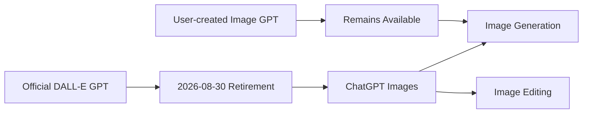

**Mermaid diagram B: dependency layers**

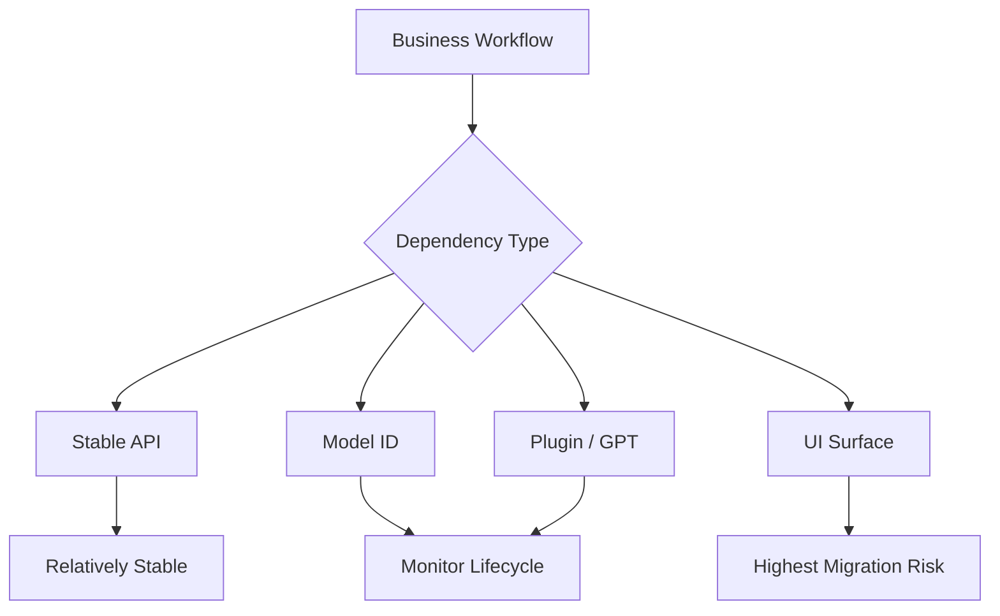

**Source**:
- OpenAI ChatGPT Release Notes: Retiring the DALL·E GPT. :contentReference[oaicite:32]{index=32}

## C. Other Notable Items

**1. GitHub Copilot CLI 1.0.82 was released roughly nine minutes after this reporting window opened.** GitHub's release record shows v1.0.82 at August 29 23:39, approximately August 30 07:39 in Asia/Singapore. The release mainly fixes a case where typing while `/worktree` or `/move` prepares a worktree could break the transition, lets `Ctrl+E` expand the full plan-approval card again, and improves authentication errors so users see specific failures such as `401 Bad credentials` instead of only a generic `/login` prompt. These are useful fixes but do not clear the bar for today's core stories. :contentReference[oaicite:33]{index=33}

## D. AI Trend Summary

### Trends supported by current facts

**Trend 1: The credential surface of AI SaaS is expanding from API keys to session tokens.** The Claude infostealer campaign shows that model usage, OAuth connections, and Agent-workspace authority make authenticated sessions valuable enough to monetize directly. Post-MFA session lifecycle is becoming a distinct enterprise AI security concern.

**Trend 2: Open-model competition increasingly depends on downstream integration speed.** GLM-5.3 Flash moved from model availability to Workers AI and then into Cloudflare AI Search within a short period. How quickly a model reaches RAG, gateways, serving, IDEs, and Agent Harnesses may matter almost as much as benchmark position.

**Trend 3: Model product surfaces continue consolidating from branded standalone experiences into unified multimodal capabilities.** The retirement of the DALL·E GPT while ChatGPT Images remains available is a clean example of a capability persisting while an older surface disappears.

### Analytical inference

**Inference 1: Enterprise AI Control Planes will increasingly need to govern identity sessions alongside models and tools.** Many model gateways today govern API keys and routing, but browser / desktop / SaaS Agents will also require awareness of session identity, device trust, OAuth scope, and runtime capability.

**Inference 2: The last mile of model availability is becoming cloud-managed.** Open weights do not necessarily mean running GPUs yourself. More open models will enter production through Workers AI, cloud platforms, gateways, and managed RAG, further blurring the practical boundary between open weights and managed APIs.

**Trend overview**


## E. Actions to Consider Today

1. **Role: Security / Tech Lead | Action: add session theft for Claude, ChatGPT, Cursor, and other AI SaaS products to credential incident response.** **Why now**: infostealers are already using Claude sessions directly for account access and usage consumption. **Action type: Risk review.**

2. **Role: AI Builder / AI Platform | Action: if you use Cloudflare AI Search, run GLM-5.3 Flash against the current model with the same retriever.** **Why now**: the new model availability is live and switching cost is low. **Action type: Schedule a test.**

3. **Role: Product owner / Tech Lead | Action: check whether internal AI SOPs still depend on the official DALL·E GPT surface.** **Why now**: that surface has reached its formal retirement date while the capability has moved to ChatGPT Images. **Action type: Execute now.**

4. **Role: AI Platform | Action: add session / device observability alongside model and tool governance.** At minimum track provider, user, session age, device, network, usage pattern, and revocation state. **Why now**: effective authorization in AI workspaces is increasingly concentrated in persistent sessions. **Action type: Add to roadmap.**
````
