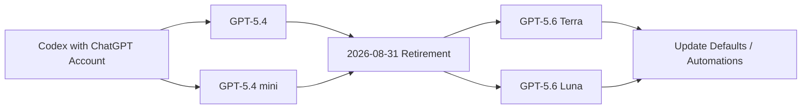
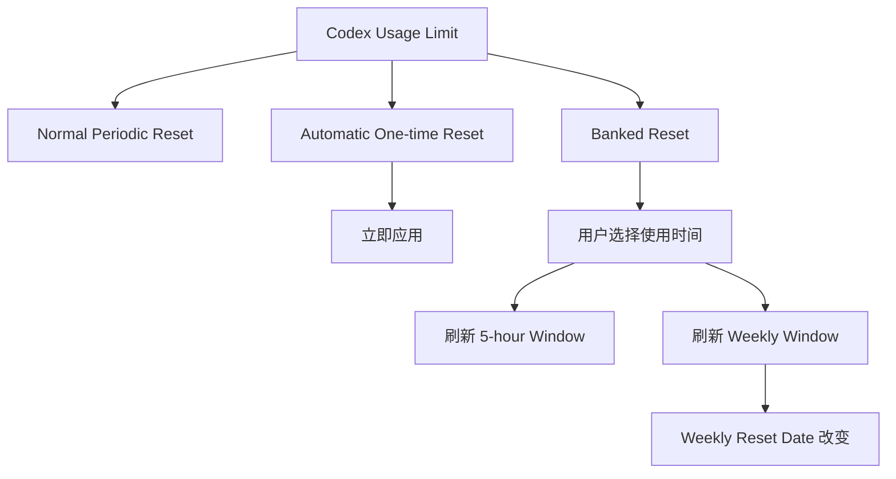
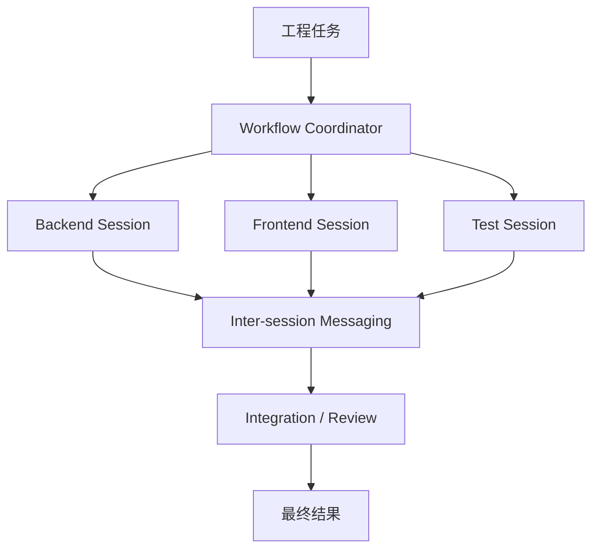
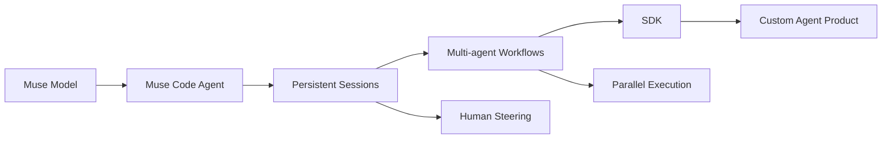
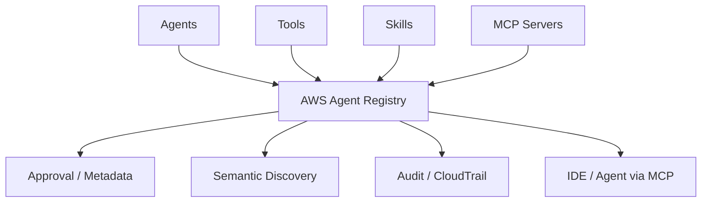
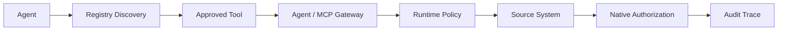
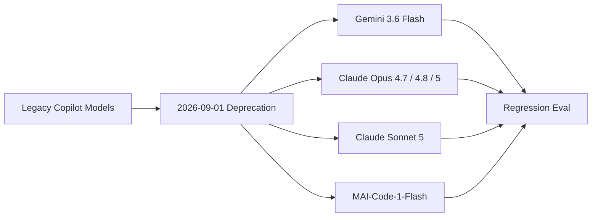
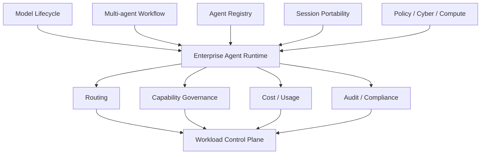
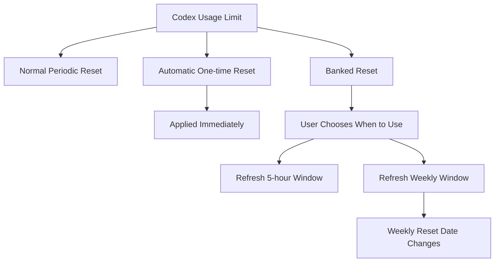
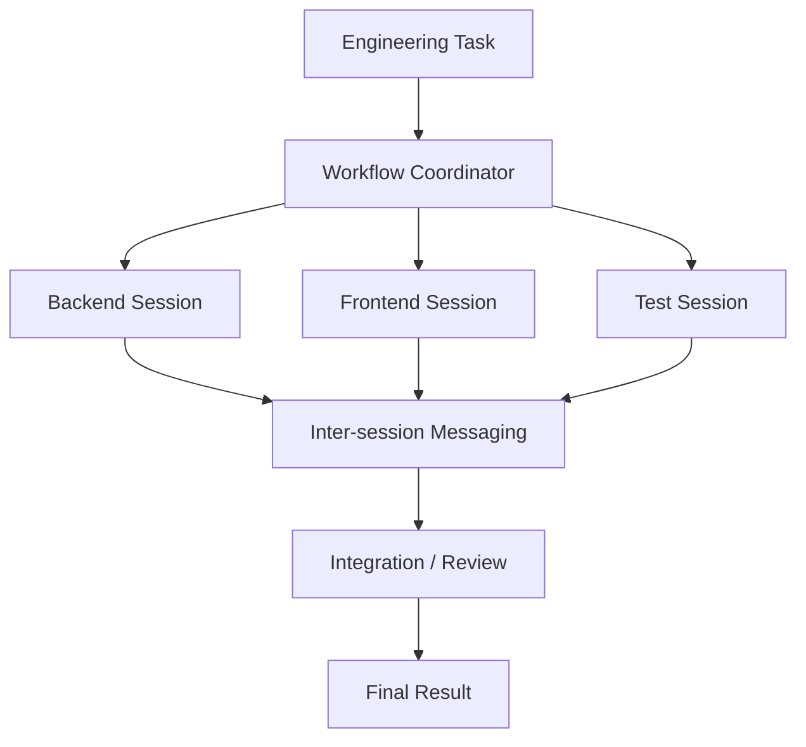

<!-- 中文版 -->
# AI 今日头条｜2026 年 09 月 01 日

- 语言：中文
- 时区：Asia/Singapore
- 新闻窗口：2026-08-31 07:30 至 2026-09-01 07:30
- 实际检索截止时间：2026-09-01 07:05
- 本期核心新闻：8 条
- 其他值得关注：1 条
- 注：本次执行早于固定新闻窗口结束约 25 分钟，因此实际检索覆盖至 07:05；07:05–07:30 之间出现的重大事件应在下一次运行中补检。

## A. 今日最重要的 3 件事

**1. Codex 到达一次实质性的模型与配置切换节点：GPT-5.4 / GPT-5.4 mini 在 ChatGPT 登录模式下退出，分别迁移到 GPT-5.6 Terra / Luna。** OpenAI 同一份最新帮助文档还明确了 Banked Reset / One-time Reset 的规则，并确认 `approval_policy = "untrusted"` 已在新版本中不再受支持。这不是单纯模型换名，而是同时涉及模型默认值、自动化配置、额度恢复机制与 CLI 启动兼容性的 Harness 生命周期事件。 :contentReference[oaicite:0]{index=0}

**2. Meta Muse Code 正式退出 Beta，并把 Coding Agent 从“单 Session + Subagent”升级到跨 Session 通信、Workflow 编排和可编程 SDK。** Meta 宣布 Muse Code 现已正式可用，新版本允许 Session 相互发送消息、Workflow 协调专门化 Subagent Team，并开放 SDK Developer Preview；新的月度方案也开始推出，起价 5 美元。这让 Muse Code 更像一个可以被二次开发的 Agent Runtime，而不仅是一款 CLI Coding Tool。 :contentReference[oaicite:1]{index=1}

**3. AWS Agent Registry 正式 GA：企业 Agent 治理开始出现类似“Package Registry + CMDB + App Store”的统一控制层。** Registry 不只登记 Agent，还统一管理 Tool、Skill、MCP Server 和自定义资源，并提供审批、语义搜索、IAM/OAuth、CloudTrail、IaC、跨账号共享和自动发现。对于正在建设企业 Harness / MCP Gateway 的团队，这种 Registry 很可能成为 Agent Sprawl 之后必需的基础设施。 :contentReference[oaicite:2]{index=2}

## B. 新闻正文

### 1. Codex 8 月 31 日切换节点：GPT-5.4 系列退出 ChatGPT 登录模式，Terra / Luna 接替，同时出现配置 Breaking Change

- 类别：AI 编程 / Harness / 模型 / 成本治理
- 信息状态：官方产品更新
- 发布时间：官方生效日期 2026-08-31；帮助文档于本期窗口附近更新
- 可用状态：GPT-5.4 / GPT-5.4 mini 在 ChatGPT Account 登录的 Codex 中退出；GPT-5.6 Terra / Luna 为官方迁移目标

**事实摘要**：OpenAI 最新 Codex 帮助文档明确写明：从 **2026 年 8 月 31 日**起，通过 ChatGPT Account 登录 Codex 时，GPT-5.4 与 GPT-5.4 mini 不再可用，官方要求分别迁移到 **GPT-5.6 Terra** 与 **GPT-5.6 Luna**。需要检查的不只是手动模型选择，还包括 Workspace Default、Saved Model Setting、Managed Configuration 和 Automation。该变化不影响 OpenAI API，也不影响使用自有 API Key 的 Codex。 :contentReference[oaicite:3]{index=3}

同一份当前帮助文档还进一步明确 Codex Reset 机制：部分 Plus / Pro Referral Promotion 可以获得可储存的 **Banked Codex Rate-limit Reset**；使用一个完整 Banked Reset 会同时刷新 5 小时与 Weekly Codex Usage Window，并改变新的 Weekly Reset Date。OpenAI 也可能向符合条件的用户直接发放 One-time Reset，但自动 Reset 不会被储存以供之后使用，未来是否再次发放也没有承诺。 :contentReference[oaicite:4]{index=4}

**相较此前的变化**：这次最明确的新状态是模型生命周期切换已经到达官方日期。此前任何仍把 `gpt-5.4` / `gpt-5.4-mini` 写进 Workspace Default、脚本或自动化任务的配置，现在都应该被视为需要迁移。

另一个容易遗漏的 Breaking Change 是 `approval_policy = "untrusted"`：OpenAI 已明确表示它不再被 Codex 支持。该变化适用于 Codex CLI **0.149.0+**，以及 Desktop / VS Code **26.818.31338+**。仍保留此配置时，Codex 可能直接启动失败。官方建议删除该值；若需要更严格环境，可以使用 `sandbox_mode = "read-only"` 配合 `approval_policy = "on-request"`。项目级 `trust_level = "untrusted"` 是另一套机制，仍然支持。 :contentReference[oaicite:5]{index=5}

**为什么重要**：这类事件比普通 Changelog 更容易破坏真实工作流。Codex 已经不仅是一个交互式 CLI：Model、Approval Policy、Workspace Default、Automation 和 Usage Reset 都属于 Harness Control Plane 的一部分。

一个企业如果允许员工在各自 Harness 中自由选择模型，同时中央网关又维护 Model Allowlist，那么模型下线可能同时造成三层问题：

- 用户保存的 Model Alias 失效；
- 自动化任务引用旧 Model ID；
- 中央 Policy 仍允许一个已经不可用的模型；
- Fallback 发生后任务质量、Cost 或 Tool Behavior 改变。

而 Reset 机制则说明“额度”也开始成为一种显式 Runtime Resource。尤其 Banked Reset 会改变 Weekly Reset Date，因此不能只把它理解成临时增加一点 Token。

**实际影响**：正在使用 Codex 的团队今天至少应搜索以下配置：

`gpt-5.4`、`gpt-5.4-mini`、`approval_policy = "untrusted"`、`--ask-for-approval untrusted`

然后分别迁移模型和 Approval Policy。

对额度监控，也不要把“正常周期恢复”“自动 One-time Reset”“Banked Reset”混在一起。Banked Reset 是用户可选择何时使用的资源；Automatic Reset 则由 OpenAI 直接应用，不能存下来。两种机制在容量规划上的意义完全不同。

**角色视角**：
- AI Builder：检查本机模型 Default 与旧 Approval Policy。
- Tech Lead：扫描 Repo、CI 和 Managed Config 中的旧 Model ID。
- AI Platform：Model Catalog 应有 Deprecation / Replacement 字段，而非只有 Allowlist。
- 部门经理：Reset 和模型切换会影响有效 Coding Capacity，应进入使用治理。

**可借鉴动作**：在内部 Model Gateway / Harness Registry 中加入生命周期字段：

`model_id → available_from → deprecated_at → replacement → affected_clients → migration_status`

同时把 Usage Reset 记录成单独事件，区分 `periodic / automatic_bonus / banked_user_triggered`。

**风险与不确定性**：OpenAI 文档明确给出了 8 月 31 日日期，但全球不同客户端的实际后台切换可能存在短时间 Rollout 差异。Banked Reset 只适用于特定 Promotion 和 Eligible User，并不是每个 Plus / Pro 用户固定拥有的权益。 :contentReference[oaicite:6]{index=6}

**下一步观察**：
1. Terra / Luna 是否出现新的 Default Routing 或 Usage Multiplier；
2. 旧 Model ID 在 CLI / Desktop / VS Code 中的具体 Error / Fallback 行为；
3. Banked Reset 是否从 Referral Promotion 扩展到更多套餐；
4. Approval Policy 是否进一步收敛成统一组织级 Policy。

**Mermaid 图示 A：Codex 模型迁移**



**Mermaid 图示 B：Codex Usage Reset 类型**



**来源**：
- [OpenAI：Using Codex with your ChatGPT plan](https://help.openai.com/en/articles/11369540-using-codex-with-your-chatgpt-plan)

---

### 2. Meta Muse Code 正式退出 Beta：跨 Session 消息、Subagent Workflow 和 SDK 把它推进到 Agent Runtime 层

- 类别：AI 编程 / Agent / Harness
- 信息状态：官方已确认
- 发布时间：2026-08-31
- 可用状态：已正式可用；SDK 为 Developer Preview；月度方案开始推出

**事实摘要**：Meta 宣布 Muse Code 已正式退出 Beta。此次更新的三个核心能力是：**不同 Session 可以相互发送消息**；新的 **Workflow** 可以协调由多个专门 Subagent 组成的团队；同时开放 **SDK Developer Preview**，让开发者能够直接在 Muse Code Runtime 之上构建自己的 Agentic Product。Meta 还开始推出月度订阅方案，起价 **5 美元/月**。 :contentReference[oaicite:7]{index=7}

Muse Code 原本在 8 月 5 日进入 Beta，已经具备长任务和并行 Subagent 能力。今天的变化不是简单把 `beta` 标签移除，而是把 Session、Workflow 和 SDK 提升为更加明确的产品抽象。Meta for Developers 对新 Workflow 的描述强调，可以把大任务交给一组专门化并行 Agent，并在控制界面中观察、引导或停止它们。 :contentReference[oaicite:8]{index=8}

**相较此前的变化**：过去多个 Muse Code Session 更像独立 Worker，开发者需要通过文件、Git 或人工复制信息协调它们。Inter-session Messaging 开始让 Session 之间拥有直接通信机制。

Workflow 的意义更大：Subagent 不再只是某个主 Agent 临时调用的内部实现细节，而变成显式的 Team Orchestration Unit。再加上 SDK，Muse Code 开始具备三层产品结构：

`Coding Agent → Multi-agent Workflow → Programmable Runtime`

这和 Codex / Claude Code 单纯竞争“谁更会写代码”已经不是完全相同的问题。

**为什么重要**：Coding Agent 的下一阶段竞争焦点正在从单次任务质量转向 **Harness Architecture**。

当任务持续几小时甚至几天之后，真正影响生产力的是：

- Session 能否恢复；
- Agent 是否可以并行；
- 子任务之间能否传递状态；
- 失败节点是否可以重新执行；
- 人能否中途 Steering；
- Runtime 是否能被二次开发和嵌入其他产品。

Muse Code 这次升级正好覆盖这些问题。尤其 SDK Developer Preview 表明 Meta 希望开发者不仅使用 Muse Code，而是基于它构建更高层 Agent 产品。

**实际影响**：对于已经测试 Codex、Claude Code、Copilot CLI 等工具的平台团队，Muse Code 的评测维度应该从“单 Agent Coding Benchmark”升级到 Multi-agent Coordination。

例如可以设计一个包含前端、后端、测试、迁移和文档的真实项目，把五个子任务交给不同 Worker，观察：

- Coordinator 是否正确拆解依赖；
- Session 间是否丢状态；
- 两个 Agent 修改相同文件时怎样冲突；
- Failed Agent 能否重新运行；
- Total Wall-clock 是否真的下降；
- 总 Token / Cost 是否因为 Coordination Overhead 反而上升。

**角色视角**：
- AI Builder：SDK 使 Muse Code 开始成为可嵌入 Runtime。
- Tech Lead：需要比较 Multi-agent Throughput，而不是只比较单模型 Benchmark。
- 产品负责人：Workflow 可以成为面向复杂工程项目的新交互单元。
- 部门经理：月度订阅降低试用门槛，但企业数据政策仍需单独核查。

**可借鉴动作**：建立一个固定 Multi-agent Eval：

`Planner → Backend Agent + Frontend Agent + Test Agent → Reviewer → Integration`

对 Muse Code、Claude Code Subagents、Codex 并行 Agent 使用完全相同的 Repo 和 Acceptance Test，比较完成率、冲突率、人工介入和最终 Wall-clock。

**风险与不确定性**：SDK 目前仍是 Developer Preview；跨 Session 与 Workflow 增加了新的共享状态和权限面，也可能使错误扩散范围更大。月度方案起价 5 美元并不等于复杂多 Agent 任务的实际总成本就是 5 美元。 :contentReference[oaicite:9]{index=9}

**下一步观察**：
1. Muse SDK 是否开放完整 Permission / Tool Policy；
2. Workflow 是否支持 Durable Retry、Checkpoint 与 Human Approval；
3. Inter-session Messaging 是否提供结构化 Audit Log；
4. Windows、IDE Integration 与企业管理能力是否继续扩展。

**Mermaid 图示 A：Muse Code 从 Session 到 Workflow**



**Mermaid 图示 B：Muse Code 产品层次**



**来源**：
- [Meta for Developers：Muse Code — New plans and features](https://developer.meta.com/ai/resources/blog/muse-code-new-plans-and-features/)
- [The Fly：Meta announces Muse Code out of beta](https://www.tipranks.com/news/the-fly/meta-platforms-announces-muse-code-out-of-beta-unveils-monthly-plans-thefly-news)

---

### 3. AWS Agent Registry 正式 GA：Agent、Tool、Skill、MCP Server 开始拥有企业级“系统目录”

- 类别：Agent / Harness / MCP / 基础设施 / 安全治理
- 信息状态：官方产品更新
- 发布时间：2026-08-31
- 可用状态：GA；目前覆盖 5 个 AWS Region

**事实摘要**：AWS 宣布 **AWS Agent Registry** 正式 GA。它提供一个私有、受治理、可搜索的 Catalog，用于登记和发现组织中的 **Agent、Tool、Skill、MCP Server 和 Custom Resource**。Registry 可以通过 AWS Console、CLI、SDK 使用，也可以自身作为 MCP Server 供 IDE / Agent 查询。它还可以被 Amazon Bedrock AgentCore、Amazon Quick 和 Kiro 等产品直接发现和使用。 :contentReference[oaicite:10]{index=10}

相比 4 月的 Preview，GA 新增了更多企业能力，包括通过 **CloudFormation、Terraform、AWS CDK** 管理 Registry，使用 Tag 做组织、成本分配和访问控制，通过 **AWS Resource Access Manager** 跨账号共享，还可以自动发现整个 Organization 中 AgentCore Runtime 与 Gateway 上的 Agent，并将它们汇总进中央 Registry。AWS CloudTrail 用于记录管理和访问事件。 :contentReference[oaicite:11]{index=11}

**相较此前的变化**：Preview 阶段已经具备登记、审批、Semantic Search、Keyword Search、URL-based Discovery 和 CloudTrail。GA 之后，它从一个“Agent Catalog 产品”开始变成可以进入正式企业 IaC / Multi-account Governance 的基础设施。

尤其值得关注的是 Auto-discovery。过去 Registry 需要开发者主动登记；现在 AgentCore Runtime / Gateway 中已经存在的 Agent 可以被组织级发现。这意味着平台团队终于有机会回答：

> “公司里到底运行了多少 Agent、谁拥有它们、哪些经过审批？”

**为什么重要**：企业开始遇到的不是 Agent 数量不够，而是 **Agent Sprawl**。

当组织里出现数百个：

- MCP Server；
- Internal Skill；
- Department Agent；
- Coding Agent；
- Workflow Agent；
- Tool Connector；

如果没有统一目录，就会出现大量重复开发、未知 Owner、过期 Credential、权限无法审计和工具重复建设。

AWS Agent Registry 的战略意义因此类似传统世界里的：

`Package Registry + Service Catalog + CMDB + Enterprise App Store`

并且它本身可以通过 MCP 被 Agent 查询，这意味着未来 Agent 可以在运行时发现“组织允许我使用什么能力”。

**实际影响**：建设 Model Gateway / MCP Gateway 的团队可以考虑把“注册”和“调用”分离：

- Registry 决定组织拥有哪些能力；
- Gateway 决定一次调用是否允许；
- Source System 决定调用者是否有最终数据权限；
- Observability 决定调用后发生了什么。

这比把所有工具列表硬编码进 Prompt 或每个 Harness 的本地配置更可维护。

**角色视角**：
- AI Builder：可以通过语义搜索复用已有 Agent / Tool。
- Tech Lead：Owner、Lifecycle、Risk Level 应成为资源元数据。
- 安全负责人：审批和 Audit 可以从单个 Harness 上升到组织目录。
- 部门经理：减少不同团队重复建设同一 Agent Capability。

**可借鉴动作**：即使不使用 AWS，也建议内部 Agent Registry 至少包含：

`resource_id / type / owner / version / endpoint / auth / permissions / data_classification / approved_status / last_reviewed / consumers`

并要求生产 MCP / Agent 必须登记后才允许进入 Gateway。

**风险与不确定性**：AWS Agent Registry 当前只在美国东部弗吉尼亚、美国西部俄勒冈、爱尔兰、东京和悉尼五个 Region 可用。它解决 Discovery / Governance，不等于自动验证 Agent 本身是安全或正确的；登记在 Registry 中的资源仍需要独立 Security Review 和 Runtime Policy。 :contentReference[oaicite:12]{index=12}

**下一步观察**：
1. 是否扩大 Region；
2. Agentic Resource Discovery（ARD）是否获得其他云 / Harness 支持；
3. Registry Record 是否增加更完整的 Security Attestation；
4. 是否形成跨 AWS / SaaS / On-prem 的 Federated Agent Catalog。

**Mermaid 图示 A：企业 Agent Registry 的位置**



**Mermaid 图示 B：Registry 与 Gateway 分工**



**来源**：
- [AWS：Agent Registry is now generally available](https://aws.amazon.com/about-aws/whats-new/2026/08/aws-agent-registry-generally-available/)
- [AWS Blog：Manage agents, tools and skills at scale with AWS Agent Registry](https://aws.amazon.com/blogs/machine-learning/manage-agents-tools-and-skills-at-scale-with-aws-agent-registry/)

---

### 4. GitHub Copilot 到达 6 个模型的统一退役日期：Agent / Chat / Completion 都受影响

- 类别：AI 编程 / 模型可用性 / Harness
- 信息状态：官方已确认
- 发布时间：官方退役日期 2026-09-01
- 可用状态：退役日期已经到达；具体后台 Rollout 可能分阶段

**事实摘要**：GitHub 官方此前宣布，从 **2026 年 9 月 1 日**起，在 Copilot Chat、Inline Edit、Ask / Agent Mode 和 Code Completion 等全部 Copilot Experience 中退役 6 个模型：Gemini 3.1 Pro、Claude Opus 4.5、Claude Opus 4.6、Claude Sonnet 4.5、Claude Sonnet 4.6 和 Raptor Mini。唯一明确例外是使用个人年度 Copilot Subscription 的用户仍可继续使用 Claude Sonnet 4.6。 :contentReference[oaicite:13]{index=13}

官方给出的主要替代路线如下：

| 退役模型 | GitHub 建议替代 |
| --- | --- |
| Gemini 3.1 Pro | Gemini 3.6 Flash |
| Claude Opus 4.5 | Claude Opus 4.7 / 4.8 / 5 |
| Claude Opus 4.6 | Claude Opus 4.7 / 4.8 / 5 |
| Claude Sonnet 4.5 | Claude Sonnet 5 |
| Claude Sonnet 4.6 | Claude Sonnet 5 |
| Raptor Mini | MAI-Code-1-Flash |

**相较此前的变化**：此前这还是一个“即将退役”的通知；当前 Asia/Singapore 日期已经进入 9 月 1 日，官方生命周期日期已经到达。企业管理员如果仍依赖旧模型，应把它当成现在需要执行的 Migration，而不是未来计划。

GitHub 还明确指出，Enterprise Admin 可能需要在 Model Policy 中主动启用替代模型。如果组织只删除旧模型，却没有启用新的替代模型，员工可能会出现 Model Selector 缺项或 Workflow 无法按照预期迁移的问题。 :contentReference[oaicite:14]{index=14}

**为什么重要**：这次是一次大范围同步退役，而且覆盖 Agent Mode 与 Code Completion。对 Coding Harness 来说，更换模型可能改变：

- Tool-call Style；
- Diff Size；
- Reasoning Latency；
- Context Consumption；
- Review Behavior；
- Premium Usage；
- 长任务稳定性。

因此模型替换不能只做“名称映射”。

**实际影响**：平台团队应将所有 Copilot Policy、团队文档、Agent Instruction 和 Model Routing 配置与 GitHub 当前 Model Catalog 对齐，并对重要 Agent Workflow 做一次 Regression Test。

特别是从 Opus / Sonnet 旧版本迁移到新版本时，应重新观察任务完成率和 Usage，而不能假设“更新模型一定完全向后兼容”。

**可借鉴动作**：维护一个自动化 Model Lifecycle Checker，每天把企业允许列表与供应商当前 Catalog / Deprecation Date 比较；进入 30 / 14 / 7 天窗口时自动创建迁移任务。

**风险与不确定性**：官方明确给出的是 9 月 1 日日期，但全球服务的具体 Backend Rollout 时刻可能并不完全以 Asia/Singapore 零点为界，因此部分用户短时间仍看到旧模型并不代表退役取消。

**下一步观察**：
1. 旧模型实际从 Selector 消失的时间；
2. Sonnet 5 / Opus 新系列的 Premium Request 成本；
3. Enterprise Model Policy 是否出现自动 Replacement 功能。

**Mermaid 图示**



**来源**：
- [GitHub Changelog：Upcoming August 2026 model deprecations in GitHub Copilot](https://github.blog/changelog/2026-07-31-upcoming-august-2026-model-deprecations-in-github-copilot/)

---

### 5. GitHub Copilot in VS Code 把 Agent Session 从“IDE Chat”推进到跨客户端、跨模型 Provider 的持续工作对象

- 类别：AI 编程 / Agent / Harness
- 信息状态：官方产品更新
- 发布时间：2026-08-31；该公告汇总 VS Code 1.132–1.135 在 8 月陆续交付的能力
- 可用状态：主体能力已随对应 VS Code 版本推出；部分功能仍为 Experimental

**事实摘要**：GitHub 在 8 月 31 日发布 Copilot in VS Code August Release 总结。Agent Workflow 方面，现在可以并排组织多个 Chat；通过 `/btw` 开启一个与主 Chat 共享 Context 和 Prompt Cache、但不打断主任务的 Side Conversation；支持 Portable **Agent Plugins 1.0**；Claude 配置 API Key 后可以在不登录 GitHub 的情况下打开 Agents Window；Claude Session 可以在 Anthropic Subscription 与 Copilot Subscription 的 Model Provider 之间切换。 :contentReference[oaicite:15]{index=15}

更关键的是 Session Portability：VS Code 可以继续在其他应用中创建的 Copilot / Claude Agent Session，同一个 Agent Session 还可以被多个 VS Code Window 同时连接。实验性的 `/rubber-duck` 可以调用一个补充模型给出 Second Opinion；Response Footer 则可以直接查看每个 Model 的 Input、Cached Input 和 Output Token。集成 Browser 还支持直接对网页 Element 做 Comment，由 Agent 批量处理 UI 反馈。 :contentReference[oaicite:16]{index=16}

**相较此前的变化**：需要注意，这篇 8 月 31 日公告是对 VS Code 1.132–1.135 的月度汇总，因此并非所有子能力都在 8 月 31 日首次上线。但它在今天正式把 GitHub 当前的 Agent Runtime 方向完整呈现出来：**Session 不再属于某一个 Chat Window。**

Agent Session 越来越像一个持久 Work Object，可以：

- 跨 Window；
- 跨客户端；
- 跨模型 Provider；
- 派生 Side Conversation；
- 加载 Portable Plugin；
- 记录模型级 Token Cost。

这和传统 IDE Assistant 已经是不同产品范式。

**为什么重要**：一旦 Session 变成独立对象，企业 Harness 架构也应该开始围绕 Session ID，而不是围绕 UI。

真正需要保存的是：

`Session → Context → Model → Tool Calls → Diffs → Review → Cost → Outcome`

而不是“员工在哪一个 IDE 窗口里聊了什么”。

`/btw` 共享主上下文与 Prompt Cache 也是一个有意思的设计：它允许用户在主 Agent 工作过程中提出临时问题，而不需要复制整个上下文，也减少重复 Cache Build。

**实际影响**：Agent Platform 团队可以开始要求所有 Coding Harness 将 Session / Task ID 与 Git Commit、PR、CI Run、MCP Trace 和 Model Usage 关联。

第二个值得测试的是 Provider Switching。同一个 Claude Session 可以选择 Anthropic Subscription 或 Copilot Subscription 后，Model Identity 看似相近，但 Runtime Policy、Rate Limit、Logging 和 Cost 可能完全不同，应避免把“同一个模型名称”等同为“同一个企业执行环境”。

**可借鉴动作**：选取一个 2–3 小时真实 Coding Task，依次测试：

1. 主 Session 持续执行；
2. `/btw` 插入临时咨询；
3. 第二个 Window 连接同一 Session；
4. 切换 Provider；
5. `/rubber-duck` 让第二模型 Review；
6. 最后把 Token / Diff / Test / Outcome 汇总成统一 Trace。

**风险与不确定性**：部分能力属于 Experimental；8 月 31 日文章是月度 Release 汇总，而不是所有 Feature 的首次发布时间。跨客户端 Session 和 Provider Switching 也会提高 Identity、Retention 和 Audit 的复杂度。 :contentReference[oaicite:17]{index=17}

**下一步观察**：
1. Agent Session 是否形成跨 Copilot CLI / VS Code / Web 的统一 ID；
2. Portable Agent Plugins 1.0 是否获得其他 Harness 支持；
3. `/rubber-duck` 是否演化为正式 Multi-model Reviewer；
4. Model-level Token Data 是否进入企业 Usage API。

**Mermaid 图示**

```mermaid
flowchart TD
    VS1[Persistent Agent Session] --> VS2[VS Code Window A]
    VS1 --> VS3[VS Code Window B]
    VS1 --> VS4[External Agent Client]
    VS1 --> VS5[/btw Side Chat]
    VS1 --> VS6[Provider Switch]
    VS6 --> VS7[Anthropic]
    VS6 --> VS8[Copilot]
    VS1 --> VS9[Token / Diff / Outcome Trace]
```

**来源**：
- [GitHub Changelog：GitHub Copilot in VS Code, August 2026 releases](https://github.blog/changelog/2026-08-31-github-copilot-in-vs-code-august-2026-releases/)

---

### 6. 欧盟正式将 ChatGPT 指定为 DSA 下的 VLOSE：ChatGPT 开始进入“超大型搜索服务”监管框架

- 类别：政策与产业 / 安全 / 合规
- 信息状态：官方已确认
- 发布时间：2026-08-31
- 可用状态：监管指定已生效；额外 DSA 义务需在 4 个月内完成

**事实摘要**：欧盟委员会在 8 月 31 日正式将 **ChatGPT 指定为 Very Large Online Search Engine（VLOSE）**。ChatGPT 向欧盟申报的平均月度用户达到至少 **4500 万**，达到 DSA 对 VLOP / VLOSE 的规模门槛。委员会同时将 Reddit、Roblox 指定为 VLOP。 :contentReference[oaicite:18]{index=18}

ChatGPT 获得指定后有四个月时间，即到 **2026 年 11 月底**之前，满足 VLOSE 的额外 DSA 义务。欧盟列出的系统性风险范围包括非法内容传播、未成年人影响、身体和心理健康、基本权利、选举过程以及公共安全。 :contentReference[oaicite:19]{index=19}

**相较此前的变化**：此前 ChatGPT 已受欧盟 AI Act、GDPR 等制度影响，但 DSA VLOSE 是另一条监管轨道，重点不是模型训练本身，而是平台规模、信息分发和系统性风险。

这是一个重要的产品定位信号：监管机构开始把 ChatGPT 的一部分功能视为“搜索与信息中介基础设施”，而不仅是 Chatbot / AI Model。

**为什么重要**：对 OpenAI 来说，未来 Search、Recommendation、Content Ranking、Safety、Election Integrity 和 Minor Protection 都会面临更完整的平台级治理要求。

对其他 AI 产品而言，这也提供了一个方向性信号：当 Agent / AI Search 达到大规模用户后，监管不会只看底层模型是否符合 AI Act，还会看这个产品作为信息平台产生什么系统性效果。

**实际影响**：普通企业用户今天无需修改配置，但开发 ChatGPT App、Search、Publisher Integration 或面向欧盟消费者的 AI 产品团队，应该关注 OpenAI 后续是否调整数据透明度、搜索结果标识、风险控制、研究者访问和内容治理接口。

**可借鉴动作**：面向大规模消费者的 AI Search / Agent 产品应提前建立 Platform Risk Register，把 `model risk` 与 `distribution risk` 分开：即模型可能没有直接生成违法内容，但 Ranking / Search / Recommendation 仍可能产生系统性风险。

**风险与不确定性**：当前是正式 Designation，不等于欧盟已经认定 ChatGPT 存在任何具体 DSA 违规。后续真正影响产品设计的细节要看 OpenAI 的合规措施与欧盟监督实践。 :contentReference[oaicite:20]{index=20}

**下一步观察**：
1. OpenAI 在 11 月底前公布的 DSA 风险评估措施；
2. Search / Recommendation 是否增加欧盟专属控制；
3. 其他通用 AI Assistant 是否达到 VLOSE / VLOP 门槛。

**来源**：
- [European Commission：Commission designates ChatGPT, Reddit, Roblox under Digital Services Act](https://digital-strategy.ec.europa.eu/en/news/commission-designates-chatgpt-reddit-roblox-under-digital-services-act)

---

### 7. FSB 将 Frontier AI Cyber Risk 定为金融系统最直接的 AI 风险：安全讨论正式进入 G20 金融稳定议程

- 类别：安全 / 政策与产业 / Agent
- 信息状态：官方政策信号
- 发布时间：2026-08-31
- 可用状态：不适用；并非新监管规则

**事实摘要**：Financial Stability Board 主席 Andrew Bailey 在提交 G20 财长与央行行长会议的信中表示，对金融系统而言，Frontier AI 当前最直接的担忧是其对 **Cyber Risk** 的影响。FSB 指出，Frontier Model 正表现出越来越强的 Autonomy、Problem-solving 和 Threat Capability，可能实质改变网络攻击的速度、规模和经济成本，并在极端情况下影响整个市场信心。 :contentReference[oaicite:21]{index=21}

FSB 强调金融机构自身的 Resilience，也强调关键 Third-party Provider 的恢复能力，并呼吁监管机构支持全球范围内安全、负责任的模型发布和部署。该信提交给 8 月 31 日至 9 月 1 日举行的 G20 Finance Ministers and Central Bank Governors 会议。 :contentReference[oaicite:22]{index=22}

**相较此前的变化**：FSB 此前已经研究 AI 对金融稳定的影响，但这次主席级 G20 信函把 Frontier Model 的 Offensive Cyber Capability 放到了非常明确的位置。

这并不是新的 Binding Regulation，却是一个重要的监管方向信号：金融 AI Governance 正从“模型误判 / Bias / Operational Risk”延伸到“模型是否提高攻击者 Capability”。

**为什么重要**：这与最近 Agent Cyber 事件形成了同一条逻辑链：

`更强模型 → 更长自治任务 → 更快漏洞发现 → 更低攻击成本 → 第三方技术集中 → 系统性风险`

对金融机构而言，模型供应商、Coding Agent、Cloud Provider 和 MCP / Tool Provider 都可能变成关键 Third Party。

**实际影响**：金融与关键基础设施企业应该把高能力 Coding / Cyber Agent 纳入现有 Threat Model，而不是把它只归到“GenAI Governance”。

模型准入时可以额外问：

- 能否自主扫描大量目标？
- 是否具备 Exploit Development 能力？
- Network Tool 是否默认开放？
- Session 是否可以长时间自主运行？
- 是否能调用高权限 Credential？
- Provider 如何阻止 Abuse？

**可借鉴动作**：在 Frontier Model Evaluation 中加入一个独立 `Cyber Capability / Abuse Surface` 维度，与普通 Quality Benchmark 分开打分。

**风险与不确定性**：FSB 的表述是风险判断和政策建议，并不是对某个模型已经造成金融系统事件的结论；也没有因此自动产生新的模型禁令或资本要求。 :contentReference[oaicite:23]{index=23}

**下一步观察**：
1. FSB 是否形成正式 Frontier AI Cyber Guidance；
2. 银行监管机构是否把 Model Provider 纳入 Critical Third-party Framework；
3. 金融机构是否开始要求供应商披露 Cyber Capability Eval。

**来源**：
- [Financial Stability Board：FSB Chair warns of risks arising from frontier AI models](https://www.fsb.org/2026/08/fsb-chair-warns-of-risks-arising-from-frontier-artificial-intelligence-ai-models/)
- [FSB Chair’s letter to G20 Finance Ministers and Central Bank Governors](https://www.fsb.org/2026/08/fsb-chairs-letter-to-g20-finance-ministers-and-central-bank-governors-august-2026/)

---

### 8. 欧洲签署 €3.878 亿 LUMI-AI 合同：AMD MI430X 成为欧洲 Sovereign AI 基础设施的重要一极

- 类别：基础设施 / 政策与产业
- 信息状态：官方已确认
- 发布时间：2026-08-31
- 可用状态：采购合同已签署；预计 2027 年投入使用

**事实摘要**：EuroHPC Joint Undertaking 正式与 Bull 签署合同，在芬兰 Kajaani 部署新一代 **LUMI-AI** 超级计算机，总预算 **3.878 亿欧元**，EuroHPC JU 与由芬兰、捷克、丹麦、爱沙尼亚、挪威、波兰组成的 LUMI AI Factory Consortium 各承担 50%。系统将采用下一代 **AMD Instinct MI430X GPU** 与 **6th Gen AMD EPYC 256-core CPU**。 :contentReference[oaicite:24]{index=24}

AMD 表示，LUMI-AI 计划相对当前 LUMI 提供约 **10 倍 AI Capacity** 和接近 **2 倍 HPC Capability**，预计于 **2027 年下半年**部署。它不仅支持模型训练与推理，还面向 Scientific Simulation、Confidential Dataset 和 API-based AI Environment。 :contentReference[oaicite:25]{index=25}

**相较此前的变化**：此前欧洲已经宣布 LUMI AI Factory 与 Sovereign AI Infrastructure 计划；今天的变化是实际采购合同与核心硬件路线正式落地。

值得注意的是，该系统采用 AMD 而非 NVIDIA，这让欧洲大型 AI Compute 再次形成一个具有实际规模的 Accelerator Alternative。

**为什么重要**：当前 Frontier AI Infrastructure 高度集中在少数云厂商与 GPU 平台。LUMI-AI 说明主权 AI 策略正在从政策口号落到：

`Compute Ownership + Confidential Data + Regional Access + Alternative Accelerator`

如果 ROCm、vLLM、SGLang 和主流开放模型在 MI430X 上继续成熟，AMD 在大型公共 AI Infrastructure 中的实际份额可能进一步扩大。

**实际影响**：对普通企业今天不会立刻新增可用 GPU，但欧洲 Startup、SME、研究机构和公共部门未来将获得新的训练 / 推理资源。对模型平台团队，它值得作为 NVIDIA 以外 Production Serving 路线持续关注。

**可借鉴动作**：如果企业正在设计 2027–2028 的长期 AI Infrastructure Strategy，可以把 AMD ROCm / Instinct 加入第二运行环境评估，而不是到采购阶段才第一次测试 Portability。

**风险与不确定性**：10 倍 AI Capacity 和近 2 倍 HPC 是项目预期，不是已经在生产环境验证的最终性能；系统要到 2027 年才计划投入使用。真正的开发体验仍依赖 ROCm、Framework、Kernel 和模型生态。 :contentReference[oaicite:26]{index=26}

**下一步观察**：
1. MI430X 的公开规格与实际 LLM Benchmark；
2. vLLM / SGLang / PyTorch Day-0 支持；
3. 欧洲 AI Factory 的企业访问价格和配额；
4. Sovereign AI 项目是否继续扩大非 NVIDIA Accelerator 采用。

**来源**：
- [EuroHPC JU：Contract to Deploy the LUMI-AI Supercomputer](https://www.eurohpc-ju.europa.eu/eurohpc-ju-signs-contract-deploy-lumi-ai-supercomputer-2026-08-31_en)
- [AMD：Instinct GPUs and EPYC CPUs to Power LUMI-AI](https://newsroom.amd.com/news/amd-instinct-gpus-epyc-cpus-power-lumi-ai-supercomputer/)

## C. 其他值得关注

**1. Anthropic Legacy Workbench 的数据导出截止日期已经到达 9 月 1 日。** Anthropic 已用新的 Stateless Playground 取代 Workbench；Playground 直接映射公开 Messages API，不保存 Prompt History，也不提供旧 Workbench 的 Prompt Eval / Version 功能。官方明确要求旧 Workbench 数据在 **2026 年 9 月 1 日之前导出**，之后无法恢复。如果组织过去在 Workbench 中保存了 Prompt、Completion、Uploaded File 或 Eval，当前应把它视为最后的数据迁移节点；具体截止时刻官方没有公开时区，因此如果 Console 仍允许 Export，应立即操作。 :contentReference[oaicite:27]{index=27}  
来源：[Anthropic Help Center：How do I use the playground?](https://support.claude.com/en/articles/8606378-how-do-i-use-the-playground)

## D. 今日 AI 趋势总结

### 已有事实支持的趋势

**趋势 1：Coding Harness 的竞争正在从“模型质量”升级到 Runtime Architecture。** Codex 今天体现 Model / Approval / Usage Lifecycle，Muse Code 强化 Multi-agent Workflow 与 SDK，Copilot 则把 Session 做成跨 Window / Provider 的持续对象。模型越来越像 Runtime 中的一个可替换组件。

**趋势 2：Agent Sprawl 正催生新的企业基础设施层。** AWS Agent Registry GA 表明，当 Agent、MCP、Skill 和 Tool 数量上百以后，企业需要正式的 Registry、Owner、Approval、Lifecycle 和 Audit，而不是继续靠 README 或员工本地配置管理。

**趋势 3：模型生命周期变化正在加速。** Codex 一天内完成 GPT-5.4 → GPT-5.6 Terra / Luna 切换，而 GitHub Copilot 同时退役六个旧模型。长期自动化如果硬编码 Model ID，维护成本会快速增加。

**趋势 4：Frontier AI 开始同时面对平台监管和系统性安全监管。** 欧盟把 ChatGPT 纳入 VLOSE，FSB 则把 Frontier AI Cyber Capability 提上 G20 金融稳定议程。AI Governance 正同时向 Consumer Platform 与 Critical Infrastructure 两端扩展。

**趋势 5：AI Infrastructure 的第二供应链正在逐步成形。** LUMI-AI 选择 AMD MI430X，与不断扩张的 ROCm / Open-model Serving 生态结合，说明 NVIDIA 之外的高端 AI Compute 正从“备选方案”进入大型公共基础设施。

### 分析推断

**推断 1：企业未来真正需要的不是 Model Gateway，而是 Workload Control Plane。** 它需要同时管理 Model Lifecycle、Session、Tool、Plugin、MCP、Identity、Usage Reset、Cost、Approval 和 Audit。

**推断 2：Agent Registry 很可能会和 Model Registry 合并。** 当一个业务任务同时依赖“模型 + Skill + MCP + Agent Template”时，把模型目录和工具目录分开治理会越来越不自然；最终更合理的单位可能是可版本化的 Agent Capability Package。

**今日趋势总览**



## E. 今日建议关注或采取的动作

1. **角色：AI Builder / Tech Lead｜建议动作：立即扫描 Codex 配置中的 GPT-5.4、GPT-5.4 mini 和 `approval_policy = "untrusted"`。** **为什么现在做**：模型退役日期已经到达，旧 Approval Policy 在新版客户端可能直接导致启动失败。**动作类型：立即执行。**

2. **角色：AI Platform｜建议动作：开始建设统一 Agent / Tool / MCP Registry，即使第一版只是内部数据库。** **为什么现在做**：AWS Agent Registry GA 表明 Agent Discovery 和 Governance 已经成为独立平台问题。**动作类型：纳入路线图。**

3. **角色：AI Builder / Tech Lead｜建议动作：把 Muse Code 加入 Multi-agent Eval，而不是只跑单 Agent Coding Benchmark。** **为什么现在做**：Workflow、Inter-session Messaging 和 SDK 才是本轮真正新增能力。**动作类型：安排测试。**

4. **角色：企业 Copilot Admin｜建议动作：检查 9 月 1 日模型退役后的替代模型 Policy 是否已经启用。** **为什么现在做**：GitHub 明确要求部分 Enterprise Admin 主动启用 Replacement Model。**动作类型：立即执行。**

---

<!-- English Version -->
# AI Daily Headlines｜2026-09-01

- Language: English
- Time zone: Asia/Singapore
- News window: 2026-08-31 07:30 to 2026-09-01 07:30
- Research cutoff: 2026-09-01 07:05
- Core stories: 8
- Other notable items: 1
- Note: This run occurred about 25 minutes before the fixed news-window close. Research therefore covers developments through 07:05; major events between 07:05 and 07:30 should be rechecked in the next run.

## A. The 3 Most Important Things Today

**1. Codex has reached a material model and configuration cutover: GPT-5.4 / GPT-5.4 mini are leaving ChatGPT-account-based Codex access and are replaced by GPT-5.6 Terra / Luna.** The same newly updated OpenAI help document also clarifies Banked Reset / One-time Reset mechanics and confirms that `approval_policy = "untrusted"` is no longer supported in newer clients. This is not merely a model rename; it simultaneously affects model defaults, automations, quota-recovery mechanics, and CLI startup compatibility. :contentReference[oaicite:28]{index=28}

**2. Meta Muse Code has officially left beta and is moving Coding Agents from “single session + subagents” toward inter-session communication, workflow orchestration, and a programmable SDK.** Meta says Muse Code is now generally available with sessions that can message each other, workflows coordinating specialized subagent teams, and an SDK in developer preview; monthly plans are also rolling out starting at $5. Muse Code increasingly looks like an Agent Runtime developers can build on rather than simply another CLI coding tool. :contentReference[oaicite:29]{index=29}

**3. AWS Agent Registry is now GA, creating an enterprise control layer resembling a combination of package registry, CMDB, and app store for Agents.** The Registry manages not only Agents but also tools, skills, MCP servers, and custom resources with approval, semantic search, IAM/OAuth, CloudTrail, infrastructure-as-code, cross-account sharing, and automatic discovery. For enterprise Harness / MCP Gateway teams, this kind of Registry is likely to become foundational once Agent sprawl begins. :contentReference[oaicite:30]{index=30}

## B. Core Stories

### 1. Codex reaches its August 31 cutover: GPT-5.4 models leave ChatGPT-account access, Terra / Luna take over, and an approval-policy breaking change lands

- Category: AI Coding / Harness / Model / Cost Governance
- Information status: Official product update
- Published: Official effective date 2026-08-31; help documentation updated around this reporting window
- Availability: GPT-5.4 / GPT-5.4 mini leave ChatGPT-account-based Codex; GPT-5.6 Terra / Luna are the official migration targets

**Fact summary**: OpenAI's current Codex help documentation explicitly states that beginning **August 31, 2026**, GPT-5.4 and GPT-5.4 mini are no longer available in Codex when users sign in with a ChatGPT account. OpenAI directs users to replace them with **GPT-5.6 Terra** and **GPT-5.6 Luna**, respectively, and specifically calls out workspace defaults, saved model settings, managed configurations, and automations. The change does not affect the OpenAI API or Codex used with a user's own API key. :contentReference[oaicite:31]{index=31}

The same current documentation also clarifies Codex reset mechanics. Some Plus / Pro referral promotions can grant a **banked Codex rate-limit reset**. Using a full banked reset refreshes both the five-hour and weekly Codex usage windows and changes the weekly reset date. OpenAI may also directly grant eligible users a one-time reset, but an automatic reset cannot be saved for later, and future resets are not guaranteed. :contentReference[oaicite:32]{index=32}

**What changed versus before**: The clearest new state is that the official model-lifecycle date has arrived. Any workspace default, script, or automation still hardcoding `gpt-5.4` or `gpt-5.4-mini` should now be treated as requiring migration.

A second easy-to-miss breaking change is `approval_policy = "untrusted"`. OpenAI now explicitly says the value is unsupported. This applies to Codex CLI **0.149.0+** and Desktop / VS Code **26.818.31338+**. A configuration that still includes it can cause Codex to fail at startup. OpenAI recommends removing it; for a restrictive environment, `sandbox_mode = "read-only"` with `approval_policy = "on-request"` is the suggested alternative. Project-level `trust_level = "untrusted"` is separate and remains supported. :contentReference[oaicite:33]{index=33}

**Why it matters**: These lifecycle events are more likely to break real workflows than an ordinary changelog entry. Codex is no longer merely an interactive CLI: models, approval policy, workspace defaults, automations, and usage resets all form part of its Harness control plane.

An enterprise that allows developers to choose models in their Harness while a central gateway maintains a model allowlist can suffer several simultaneous failures when a model retires:

- saved model aliases stop working;
- automation references stale model IDs;
- central policy still permits a model that no longer exists;
- fallback behavior changes task quality, cost, or tool behavior.

Reset mechanics also show that quota is increasingly becoming an explicit runtime resource. A banked reset changes the weekly reset date, so it is more than a temporary token bonus.

**Practical impact**: Teams using Codex should search their environments for:

`gpt-5.4`, `gpt-5.4-mini`, `approval_policy = "untrusted"`, and `--ask-for-approval untrusted`

and migrate both models and approval settings.

Quota monitoring should also distinguish normal periodic recovery, automatic one-time resets, and banked resets. A banked reset is a user-controlled resource; an automatic reset is applied directly by OpenAI and cannot be stored. The capacity-planning implications are different.

**Role perspective**:
- AI Builder: review local model defaults and legacy approval settings.
- Tech Lead: scan repositories, CI, and managed configuration for retired model IDs.
- AI Platform: model catalogs need deprecation / replacement fields, not just allowlists.
- Department manager: resets and model migration affect effective coding capacity and belong in governance.

**Action to borrow**: Add lifecycle metadata to the internal model gateway / Harness registry:

`model_id → available_from → deprecated_at → replacement → affected_clients → migration_status`

Track usage resets separately as `periodic / automatic_bonus / banked_user_triggered`.

**Risks and uncertainty**: OpenAI clearly specifies August 31, but backend rollout across global clients may still have short timing differences. Banked resets apply only to specific promotions and eligible users; they are not a fixed entitlement for every Plus / Pro account. :contentReference[oaicite:34]{index=34}

**Next signals to watch**:
1. Terra / Luna default routing or usage multipliers;
2. Exact error / fallback behavior for old model IDs across CLI / Desktop / VS Code;
3. Whether banked resets expand beyond referral promotions;
4. Further consolidation of approval policy into centrally managed controls.

**Mermaid diagram A: Codex model migration**


**Mermaid diagram B: Codex usage-reset types**



**Source**:
- [OpenAI: Using Codex with your ChatGPT plan](https://help.openai.com/en/articles/11369540-using-codex-with-your-chatgpt-plan)

---

### 2. Meta Muse Code leaves beta: inter-session messaging, subagent workflows, and an SDK push it toward the Agent Runtime layer

- Category: AI Coding / Agent / Harness
- Information status: Officially confirmed
- Published: 2026-08-31
- Availability: Generally available; SDK in Developer Preview; monthly plans rolling out

**Fact summary**: Meta announced that Muse Code has officially left beta. The update centers on three capabilities: **sessions can message each other**, new **workflows** coordinate teams of specialized subagents, and an **SDK Developer Preview** lets developers build their own agentic products directly on the Muse Code runtime. Meta is also rolling out monthly subscription plans starting at **$5 per month**. :contentReference[oaicite:35]{index=35}

Muse Code originally entered beta on August 5 with long-running tasks and parallel subagents. Today's change is more than removal of a `beta` label: session, workflow, and SDK concepts are now much clearer first-class product abstractions. Meta for Developers describes workflows as a way to give Muse Code a large task and coordinate a set of specialized parallel agents while observing, steering, or stopping them. :contentReference[oaicite:36]{index=36}

**What changed versus before**: Multiple Muse Code sessions previously behaved more like independent workers that developers coordinated through files, Git, or manual copying. Inter-session messaging gives sessions a direct communication mechanism.

Workflows matter even more. Subagents stop being merely an internal implementation detail temporarily spawned by a parent Agent and become an explicit team orchestration unit. With the SDK, the product stack increasingly looks like:

`Coding Agent → Multi-agent Workflow → Programmable Runtime`

That is a different competitive axis from simply asking whether Muse writes better code than Codex or Claude Code.

**Why it matters**: The next phase of Coding-Agent competition is increasingly about **Harness architecture** rather than one-shot model quality.

When jobs run for hours or days, productivity depends on:

- session recovery;
- parallel execution;
- state transfer between workers;
- retryability;
- human steering;
- programmability of the runtime itself.

Muse Code's update directly addresses those issues. The SDK Developer Preview in particular signals that Meta wants developers to build on Muse Code, not merely use it.

**Practical impact**: Platform teams already evaluating Codex, Claude Code, and Copilot CLI should upgrade their Muse evaluation from single-agent coding benchmarks to multi-agent coordination tests.

A realistic project can assign frontend, backend, tests, migration, and documentation to separate workers and measure:

- dependency decomposition;
- state loss;
- conflicting file edits;
- recovery after one worker fails;
- wall-clock improvement;
- coordination token overhead.

**Role perspective**:
- AI Builder: the SDK makes Muse Code increasingly embeddable.
- Tech Lead: compare multi-agent throughput, not only model benchmarks.
- Product owner: workflows can become a new interaction unit for complex engineering work.
- Department manager: low subscription entry cost improves trialability, but enterprise data policy still needs separate review.

**Action to borrow**: Create a fixed multi-agent evaluation:

`Planner → Backend Agent + Frontend Agent + Test Agent → Reviewer → Integration`

Run the same repository and acceptance tests through Muse Code, Claude Code subagents, and parallel Codex workflows, comparing completion rate, conflicts, human intervention, and total wall-clock time.

**Risks and uncertainty**: The SDK remains a Developer Preview. Inter-session communication and workflows add shared state and permission surfaces that may also increase blast radius when an agent is wrong. A plan starting at $5 does not mean complex multi-agent jobs have a total cost of $5. :contentReference[oaicite:37]{index=37}

**Next signals to watch**:
1. Full permission / tool-policy APIs in the Muse SDK;
2. Durable retry, checkpoints, and human approval in workflows;
3. Structured audit logs for inter-session messaging;
4. Windows, IDE, and enterprise-management expansion.

**Mermaid diagram A: Muse Code from sessions to workflows**



**Mermaid diagram B: Muse Code product layers**


**Sources**:
- [Meta for Developers: Muse Code — New plans and features](https://developer.meta.com/ai/resources/blog/muse-code-new-plans-and-features/)
- [The Fly: Meta announces Muse Code out of beta](https://www.tipranks.com/news/the-fly/meta-platforms-announces-muse-code-out-of-beta-unveils-monthly-plans-thefly-news)

---

### 3. AWS Agent Registry reaches GA: Agents, tools, skills, and MCP servers gain an enterprise system of record

- Category: Agent / Harness / MCP / Infrastructure / Security Governance
- Information status: Official product update
- Published: 2026-08-31
- Availability: GA in five AWS Regions

**Fact summary**: AWS announced general availability of **AWS Agent Registry**, a private, governed, searchable catalog for **agents, tools, skills, MCP servers, and custom resources**. It is accessible through the AWS Console, CLI, and SDK, and can itself be exposed as an MCP server for IDEs and Agents. Amazon Bedrock AgentCore, Amazon Quick, and Kiro can directly discover and use Registry resources. :contentReference[oaicite:38]{index=38}

Compared with the April preview, GA adds enterprise features including **CloudFormation, Terraform, and AWS CDK** support, tags for organization / cost allocation / access control, cross-account sharing through **AWS Resource Access Manager**, and automatic discovery of Agents running across AgentCore runtimes and gateways throughout an AWS organization. CloudTrail records management and access activity. :contentReference[oaicite:39]{index=39}

**What changed versus before**: Preview already supported registration, approval workflows, semantic and keyword search, URL-based discovery, and CloudTrail. GA moves the product from an “Agent catalog” toward infrastructure that fits formal IaC and multi-account enterprise governance.

Automatic discovery is particularly important. The platform team can begin answering:

> “How many Agents are actually running in this company, who owns them, and which have been reviewed?”

instead of relying only on voluntary developer registration.

**Why it matters**: Enterprises are starting to encounter **Agent sprawl**, not a shortage of Agents.

Once an organization has hundreds of:

- MCP servers;
- internal skills;
- department Agents;
- Coding Agents;
- workflow Agents;
- tool connectors;

the absence of a central catalog creates duplicated development, unknown owners, stale credentials, unreviewed permissions, and redundant integrations.

AWS Agent Registry therefore resembles a combination of:

`Package Registry + Service Catalog + CMDB + Enterprise App Store`

and because it is itself queryable through MCP, an Agent can potentially discover which organizational capabilities it is allowed to use.

**Practical impact**: Teams building model gateways or MCP gateways can separate “registration” from “invocation”:

- Registry defines what capabilities exist;
- Gateway decides whether a particular call is allowed;
- Source system decides whether the caller has underlying data permissions;
- Observability records what happened.

This is more maintainable than embedding every tool list inside prompts or local Harness configuration.

**Role perspective**:
- AI Builder: semantically discover and reuse existing tools and Agents.
- Tech Lead: owner, lifecycle, and risk level become formal metadata.
- Security: approval and audit rise from individual Harnesses to the organizational catalog.
- Department manager: reduce duplicate Agent development across teams.

**Action to borrow**: Even without AWS, an internal Agent Registry should at minimum store:

`resource_id / type / owner / version / endpoint / auth / permissions / data_classification / approved_status / last_reviewed / consumers`

and require production Agents / MCP servers to register before the gateway permits use.

**Risks and uncertainty**: AWS Agent Registry is currently available only in Northern Virginia, Oregon, Ireland, Tokyo, and Sydney. It solves discovery and governance but does not automatically prove that an Agent is safe or correct; registered resources still require security review and runtime policy. :contentReference[oaicite:40]{index=40}

**Next signals to watch**:
1. Region expansion;
2. Adoption of Agentic Resource Discovery (ARD) by other clouds and Harnesses;
3. Stronger security attestations attached to registry records;
4. Federated catalogs spanning AWS, SaaS, and on-premises resources.

**Mermaid diagram A: where an enterprise Agent Registry sits**


**Mermaid diagram B: Registry and Gateway responsibilities**


**Sources**:
- [AWS: Agent Registry is now generally available](https://aws.amazon.com/about-aws/whats-new/2026/08/aws-agent-registry-generally-available/)
- [AWS Blog: Manage agents, tools and skills at scale with AWS Agent Registry](https://aws.amazon.com/blogs/machine-learning/manage-agents-tools-and-skills-at-scale-with-aws-agent-registry/)

---

### 4. GitHub Copilot reaches a common retirement date for six models across Agent, Chat, and completion experiences

- Category: AI Coding / Model Availability / Harness
- Information status: Officially confirmed
- Published: Official retirement date 2026-09-01
- Availability: Retirement date reached; backend rollout may still be phased

**Fact summary**: GitHub previously announced that on **September 1, 2026**, it would retire six models across Copilot Chat, inline edits, Ask / Agent Mode, and code completions: Gemini 3.1 Pro, Claude Opus 4.5, Claude Opus 4.6, Claude Sonnet 4.5, Claude Sonnet 4.6, and Raptor Mini. The only explicit exception is Claude Sonnet 4.6 for individual annual-plan Copilot subscribers. :contentReference[oaicite:41]{index=41}

GitHub's primary replacements are:

| Retiring model | Suggested replacement |
| --- | --- |
| Gemini 3.1 Pro | Gemini 3.6 Flash |
| Claude Opus 4.5 | Claude Opus 4.7 / 4.8 / 5 |
| Claude Opus 4.6 | Claude Opus 4.7 / 4.8 / 5 |
| Claude Sonnet 4.5 | Claude Sonnet 5 |
| Claude Sonnet 4.6 | Claude Sonnet 5 |
| Raptor Mini | MAI-Code-1-Flash |

**What changed versus before**: This was previously an upcoming deprecation notice. The Asia/Singapore calendar has now entered September 1, so the official lifecycle date has arrived. Enterprise administrators relying on any of these models should treat migration as an active task rather than future planning.

GitHub also says Enterprise administrators may need to explicitly enable replacement models through model policies. Merely removing the old model does not guarantee that the intended replacement appears for users. :contentReference[oaicite:42]{index=42}

**Why it matters**: This is a synchronized retirement affecting Agent Mode and code completion, not just a model selector. Replacing a Coding-Agent model can change:

- tool-call behavior;
- diff size;
- reasoning latency;
- context consumption;
- review behavior;
- premium usage;
- long-task reliability.

Model migration therefore needs more than a name mapping.

**Practical impact**: Platform teams should align Copilot policies, team documentation, Agent instructions, and routing configuration with the current GitHub model catalog and regression-test critical workflows.

Moving from older Opus / Sonnet models to newer generations should not be assumed to be behaviorally backward-compatible simply because the newer model is more capable overall.

**Action to borrow**: Maintain an automated Model Lifecycle Checker that compares enterprise allowlists with provider catalogs / retirement dates every day and creates migration tasks at 30 / 14 / 7-day thresholds.

**Risks and uncertainty**: GitHub specifies September 1 as the date, but global backend rollout does not necessarily occur at midnight in Asia/Singapore. Seeing an old model briefly remain in the selector does not imply the deprecation has been canceled.

**Next signals to watch**:
1. Exact disappearance time of legacy models;
2. Premium-request cost of new Sonnet / Opus families;
3. Automatic replacement capabilities in enterprise model policy.

**Mermaid diagram**


**Source**:
- [GitHub Changelog: Upcoming August 2026 model deprecations in GitHub Copilot](https://github.blog/changelog/2026-07-31-upcoming-august-2026-model-deprecations-in-github-copilot/)

---

### 5. GitHub Copilot in VS Code turns Agent sessions into persistent work objects spanning clients and model providers

- Category: AI Coding / Agent / Harness
- Information status: Official product update
- Published: 2026-08-31; announcement summarizes capabilities shipped across VS Code 1.132–1.135 during August
- Availability: Main capabilities shipped with their respective VS Code versions; some remain experimental

**Fact summary**: GitHub's August 31 Copilot in VS Code release roundup shows a substantial Agent-workflow expansion. Users can arrange multiple chats side by side; `/btw` opens a side conversation that shares the primary chat's context and prompt cache without interrupting the main run; **Agent Plugins 1.0** supports portable agent customizations; the Agents window can experimentally open without GitHub sign-in when Claude is configured through an API key; and Claude sessions can switch between models from an Anthropic subscription and a Copilot subscription. :contentReference[oaicite:43]{index=43}

More importantly, VS Code can continue Copilot / Claude sessions created in other applications, multiple VS Code windows can connect to the same Agent session, experimental `/rubber-duck` can ask a complementary model for a second opinion, and the response footer exposes per-model input, cached-input, and output tokens. The integrated browser can also annotate page elements so Agents can address batches of UI feedback. :contentReference[oaicite:44]{index=44}

**What changed versus before**: The August 31 post is a monthly roundup covering VS Code 1.132–1.135, so not every feature first shipped on August 31. But taken together, it makes GitHub's current runtime direction explicit: **a Session no longer belongs to one chat window**.

The Agent session increasingly behaves like a persistent work object that can:

- span windows;
- span clients;
- switch model providers;
- spawn side conversations;
- load portable plugins;
- retain model-level cost telemetry.

This is a different product model from a traditional IDE assistant.

**Why it matters**: Once the session becomes a first-class object, enterprise Harness architecture should be organized around session identity rather than UI identity.

The useful record becomes:

`Session → Context → Model → Tool Calls → Diffs → Review → Cost → Outcome`

rather than “what did the developer say in a particular editor window?”

The `/btw` design is also notable because it reuses the primary context and prompt cache for temporary side questions while allowing the main Agent to continue working.

**Practical impact**: Agent-platform teams can begin correlating Coding-Harness session IDs with Git commits, pull requests, CI runs, MCP traces, and model usage.

Provider switching deserves its own evaluation. A Claude session using an Anthropic subscription versus a Copilot subscription may expose similar model identities but different runtime policies, rate limits, retention, and costs.

**Action to borrow**: Run a 2–3 hour real coding job and intentionally test:

1. a primary long-running session;
2. a `/btw` side question;
3. a second VS Code window attached to the same session;
4. provider switching;
5. `/rubber-duck` second-model review;
6. a final unified trace of tokens, diffs, tests, and outcome.

**Risks and uncertainty**: Some capabilities are experimental, and the August 31 article is a monthly release summary rather than the first-launch date of every individual feature. Cross-client sessions and provider switching also increase identity, retention, and audit complexity. :contentReference[oaicite:45]{index=45}

**Next signals to watch**:
1. One Agent Session ID spanning Copilot CLI / VS Code / Web;
2. Agent Plugins 1.0 adoption by other Harnesses;
3. `/rubber-duck` evolving into formal multi-model review;
4. Model-level token telemetry entering enterprise usage APIs.

**Mermaid diagram**

```mermaid
flowchart TD
    VS1[Persistent Agent Session] --> VS2[VS Code Window A]
    VS1 --> VS3[VS Code Window B]
    VS1 --> VS4[External Agent Client]
    VS1 --> VS5[/btw Side Chat]
    VS1 --> VS6[Provider Switch]
    VS6 --> VS7[Anthropic]
    VS6 --> VS8[Copilot]
    VS1 --> VS9[Token / Diff / Outcome Trace]
```

**Source**:
- [GitHub Changelog: GitHub Copilot in VS Code, August 2026 releases](https://github.blog/changelog/2026-08-31-github-copilot-in-vs-code-august-2026-releases/)

---

### 6. EU designates ChatGPT as a VLOSE under the DSA, moving it into the regulatory category for very large search services

- Category: Policy & Industry / Security / Compliance
- Information status: Officially confirmed
- Published: 2026-08-31
- Availability: Designation effective; additional DSA obligations due within four months

**Fact summary**: On August 31, the European Commission officially designated **ChatGPT as a Very Large Online Search Engine (VLOSE)** under the Digital Services Act. ChatGPT reported at least **45 million average monthly users** in the EU, meeting the threshold for VLOP / VLOSE designation. Reddit and Roblox were designated as VLOPs at the same time. :contentReference[oaicite:46]{index=46}

ChatGPT now has four months — by the **end of November 2026** — to comply with additional VLOSE obligations. The Commission identifies systemic-risk areas including illegal content, effects on minors, physical and mental well-being, fundamental rights, electoral processes, and public security. :contentReference[oaicite:47]{index=47}

**What changed versus before**: ChatGPT was already subject to EU regimes including the AI Act and GDPR, but VLOSE designation is a separate platform-regulation track focused on scale, information distribution, and systemic effects.

It is an important product-classification signal: regulators are increasingly treating parts of ChatGPT as search / information-intermediation infrastructure rather than merely a chatbot or model.

**Why it matters**: OpenAI's Search, recommendation, content ranking, safety, election integrity, and minor-protection systems will increasingly sit inside a mature platform-level compliance framework.

For other AI companies, the signal is broader: once AI Search / Agent products reach very large consumer scale, regulators will evaluate not only the underlying model but also how the product distributes information.

**Practical impact**: Ordinary enterprise customers need no immediate configuration change. Teams building ChatGPT apps, search integrations, publisher systems, or consumer AI services in the EU should watch for changes to transparency, search labeling, systemic-risk controls, researcher access, and content governance.

**Action to borrow**: Large-scale AI Search / Agent products should maintain a platform-risk register that separates `model risk` from `distribution risk`. A model can avoid directly generating illegal content while ranking / search / recommendation systems still produce systemic effects.

**Risks and uncertainty**: Designation does not mean the Commission has found ChatGPT in breach of the DSA. The operational product impact will depend on OpenAI's compliance measures and subsequent EU supervision. :contentReference[oaicite:48]{index=48}

**Next signals to watch**:
1. OpenAI's DSA risk-assessment measures before the end of November;
2. EU-specific Search / recommendation controls;
3. Other general AI assistants crossing the VLOSE / VLOP threshold.

**Source**:
- [European Commission: Commission designates ChatGPT, Reddit, Roblox under Digital Services Act](https://digital-strategy.ec.europa.eu/en/news/commission-designates-chatgpt-reddit-roblox-under-digital-services-act)

---

### 7. FSB calls frontier-AI cyber risk the most immediate AI concern for the financial system, bringing it directly onto the G20 stability agenda

- Category: Security / Policy & Industry / Agent
- Information status: Official policy signal
- Published: 2026-08-31
- Availability: Not applicable; not a new binding regulation

**Fact summary**: In a letter submitted to G20 finance ministers and central bank governors, Financial Stability Board Chair Andrew Bailey says the most immediate concern from frontier AI for the financial system is its impact on **cyber risk**. The FSB says frontier models are showing increasingly sophisticated autonomy, problem solving, and threat capabilities and may materially change the speed, scale, and economics of cyber risk, potentially affecting market confidence system-wide. :contentReference[oaicite:49]{index=49}

The FSB emphasizes resilience within financial institutions and critical third-party providers and calls for authorities to support safe and responsible model release and deployment globally. The letter was submitted ahead of G20 finance-minister and central-bank-governor meetings on August 31 and September 1. :contentReference[oaicite:50]{index=50}

**What changed versus before**: The FSB has already studied AI and financial stability, but this chair-level G20 letter gives offensive cyber capability of frontier models unusually explicit prominence.

It is not a new binding rule, but it is a meaningful direction-of-travel signal: financial AI governance is expanding from model error, bias, and operational risk into the question of whether models materially improve attacker capabilities.

**Why it matters**: The logic aligns with recent Agent cyber incidents:

`Stronger model → Longer autonomous task → Faster vulnerability discovery → Lower attack cost → Third-party concentration → Systemic risk`

Model providers, Coding Agents, cloud providers, and MCP / tool providers can all become critical third parties for financial institutions.

**Practical impact**: Financial and critical-infrastructure organizations should add high-capability Coding / Cyber Agents to the existing threat model rather than classifying them solely under “GenAI governance.”

Useful model-admission questions include:

- Can the model autonomously scan many targets?
- How strong is exploit-development capability?
- Is network access enabled by default?
- Can sessions run autonomously for long periods?
- Can the Agent reach privileged credentials?
- What abuse controls does the provider enforce?

**Action to borrow**: Add an independent `Cyber Capability / Abuse Surface` score to frontier-model evaluation, separate from ordinary quality benchmarks.

**Risks and uncertainty**: The FSB statement is a risk assessment and policy signal, not evidence that a specific model has already caused a financial-system event, and it does not automatically create new model bans or capital requirements. :contentReference[oaicite:51]{index=51}

**Next signals to watch**:
1. Formal FSB guidance on frontier-AI cyber risk;
2. Model providers entering critical-third-party frameworks;
3. Financial institutions requiring cyber-capability evaluations from AI vendors.

**Sources**:
- [Financial Stability Board: FSB Chair warns of risks arising from frontier AI models](https://www.fsb.org/2026/08/fsb-chair-warns-of-risks-arising-from-frontier-artificial-intelligence-ai-models/)
- [FSB Chair's letter to G20 Finance Ministers and Central Bank Governors](https://www.fsb.org/2026/08/fsb-chairs-letter-to-g20-finance-ministers-and-central-bank-governors-august-2026/)

---

### 8. Europe signs a €387.8M LUMI-AI contract, making AMD MI430X a major pillar of sovereign European AI infrastructure

- Category: Infrastructure / Policy & Industry
- Information status: Officially confirmed
- Published: 2026-08-31
- Availability: Procurement contract signed; user availability planned for 2027

**Fact summary**: EuroHPC Joint Undertaking signed a contract with Bull to deploy the next-generation **LUMI-AI** supercomputer in Kajaani, Finland, with a total budget of **€387.8 million**. EuroHPC JU and the LUMI AI Factory consortium — Finland, Czechia, Denmark, Estonia, Norway, and Poland — each fund 50%. The system will use next-generation **AMD Instinct MI430X GPUs** and **6th Gen AMD EPYC 256-core CPUs**. :contentReference[oaicite:52]{index=52}

AMD says LUMI-AI is expected to provide roughly **10× the AI capacity** and nearly **2× the HPC capability** of the current LUMI system, with deployment planned for the **second half of 2027**. The platform is intended for model training and inference, scientific simulation, confidential datasets, and API-based AI environments. :contentReference[oaicite:53]{index=53}

**What changed versus before**: Europe had already announced the LUMI AI Factory and broader sovereign-AI strategy. The new development is the signed procurement contract and finalized core hardware direction.

The selection of AMD rather than NVIDIA is strategically notable because it gives European large-scale AI compute another real accelerator path.

**Why it matters**: Frontier AI infrastructure remains concentrated among a small number of cloud and GPU platforms. LUMI-AI turns sovereign-AI policy into:

`Compute Ownership + Confidential Data + Regional Access + Alternative Accelerator`

If ROCm, vLLM, SGLang, and mainstream open models continue improving on MI430X, AMD's role in public large-scale AI infrastructure could grow materially.

**Practical impact**: Ordinary enterprises do not gain new GPU capacity today, but European startups, SMEs, researchers, and public-sector organizations are expected to gain a new training / inference resource. Model-platform teams should keep AMD as a serious second production-serving environment rather than an abstract alternative.

**Action to borrow**: Organizations designing 2027–2028 AI infrastructure should evaluate AMD ROCm / Instinct portability before procurement rather than discovering platform dependencies only when they need a second supplier.

**Risks and uncertainty**: The 10× AI and nearly 2× HPC figures are project expectations rather than measured production performance. The system is not scheduled to be available until 2027, and developer experience will depend on ROCm, framework, kernel, and model support. :contentReference[oaicite:54]{index=54}

**Next signals to watch**:
1. Public MI430X specifications and LLM benchmarks;
2. vLLM / SGLang / PyTorch Day-0 support;
3. Enterprise access pricing and quota from the LUMI AI Factory;
4. Further sovereign-AI adoption of non-NVIDIA accelerators.

**Sources**:
- [EuroHPC JU: Contract to Deploy the LUMI-AI Supercomputer](https://www.eurohpc-ju.europa.eu/eurohpc-ju-signs-contract-deploy-lumi-ai-supercomputer-2026-08-31_en)
- [AMD: Instinct GPUs and EPYC CPUs to Power LUMI-AI](https://newsroom.amd.com/news/amd-instinct-gpus-epyc-cpus-power-lumi-ai-supercomputer/)

## C. Other Notable Item

**1. Anthropic's legacy Workbench data-export deadline has reached September 1.** Anthropic has replaced Workbench with a stateless Playground built directly on the public Messages API; Playground does not retain prompt history and does not include Workbench's saved-prompt / eval / versioning behavior. Anthropic explicitly says legacy Workbench data must be exported by **September 1, 2026** and will not be recoverable after the deadline. If an organization still has saved prompts, completions, uploaded files, or evals in legacy Workbench, this should be treated as the final migration point. Anthropic does not specify a cutoff timezone, so if the Console still offers export, it should be done immediately. :contentReference[oaicite:55]{index=55}  
Source: [Anthropic Help Center: How do I use the playground?](https://support.claude.com/en/articles/8606378-how-do-i-use-the-playground)

## D. AI Trend Summary

### Trends supported by current facts

**Trend 1: Coding-Harness competition is moving from “model quality” toward Runtime Architecture.** Codex demonstrates model / approval / usage lifecycle management, Muse Code adds multi-agent workflows and an SDK, and Copilot increasingly treats sessions as persistent objects spanning windows and providers. The model is becoming one replaceable component inside the runtime.

**Trend 2: Agent sprawl is creating a new enterprise infrastructure layer.** AWS Agent Registry GA shows that once organizations have hundreds of Agents, MCP servers, skills, and tools, they need formal registries, ownership, approval, lifecycle, and audit rather than README files or developer-local configuration.

**Trend 3: Model lifecycle turnover is accelerating.** Codex reaches a GPT-5.4 → GPT-5.6 Terra / Luna cutover while GitHub Copilot simultaneously retires six models. Long-lived automations that hardcode model IDs will incur increasing maintenance cost.

**Trend 4: Frontier AI is being regulated simultaneously as a consumer platform and a systemic-security concern.** The EU now treats ChatGPT as a VLOSE, while the FSB has put frontier-model cyber capability on the G20 financial-stability agenda. AI governance is expanding toward both consumer information platforms and critical infrastructure.

**Trend 5: A second AI-infrastructure supply chain is slowly becoming real.** LUMI-AI's AMD MI430X architecture, combined with a growing ROCm and open-serving ecosystem, shows non-NVIDIA high-end AI compute moving from theoretical fallback into large public infrastructure.

### Analytical inference

**Inference 1: Enterprises ultimately need a Workload Control Plane, not merely a Model Gateway.** It must govern model lifecycle, sessions, tools, plugins, MCP, identity, usage resets, cost, approval, and audit together.

**Inference 2: Agent Registry and Model Registry are likely to converge.** Once a business workflow depends on a model + skill + MCP server + Agent template, managing model catalogs and tool catalogs independently becomes increasingly artificial. A versioned Agent Capability Package may become the more natural unit.

**Trend overview**


## E. Actions to Consider Today

1. **Role: AI Builder / Tech Lead | Action: immediately scan Codex configuration for GPT-5.4, GPT-5.4 mini, and `approval_policy = "untrusted"`.** **Why now**: the model-retirement date has arrived, and the legacy approval policy can prevent newer clients from starting. **Action type: Execute now.**

2. **Role: AI Platform | Action: begin building a unified Agent / Tool / MCP Registry, even if version one is only an internal database.** **Why now**: AWS Agent Registry GA confirms that Agent discovery and governance have become standalone platform problems. **Action type: Add to roadmap.**

3. **Role: AI Builder / Tech Lead | Action: add Muse Code to a multi-agent evaluation rather than another single-agent coding benchmark.** **Why now**: workflows, inter-session messaging, and the SDK are the meaningful additions in this release. **Action type: Schedule a test.**

4. **Role: Enterprise Copilot Admin | Action: verify that replacement-model policies are enabled after the September 1 retirements.** **Why now**: GitHub explicitly notes that some Enterprise administrators need to enable replacement models themselves. **Action type: Execute now.**
