<!-- 中文版 -->
# AI 今日头条｜2026 年 09 月 02 日

- 语言：中文
- 时区：Asia/Singapore
- 新闻窗口：2026-09-01 07:30 至 2026-09-02 07:30
- 实际检索截止时间：2026-09-02 07:02
- 本期核心新闻：8 条
- 其他值得关注：2 条
- 注：本次执行早于固定新闻窗口结束约 28 分钟，因此实际检索覆盖至 07:02；07:02–07:30 之间若出现重大新事件，应在下一期补检。

## A. 今日最重要的 3 件事

**1. OpenAI 确认 Astra 已达到 Preparedness Framework 的 “Critical” 网络安全能力阈值，这是 OpenAI 第一个进入这一等级的模型。** Astra 在具备相应工具和访问权限时，已经能够在缺少逐步人工指导的情况下发现此前未知的漏洞并开发可工作的 Exploit；OpenAI 因此延迟了部分开发和发布，并为其增加模型拒绝、系统分类器、跨会话检测和 Misalignment Monitor。Astra 尚未正式公开上线，但 OpenAI 表示将“很快”提供，并首先限制高级 Cyber 能力的访问。 :contentReference[oaicite:0]{index=0}

**2. Anthropic 同日发布 Claude Fable 5.1 与 Claude Mythos 5.1，把“长时间自治 Agent + Frontier Coding”与新的成本、安全和数据保留机制绑在了一起。** Fable 5.1 为 GA，拥有 1M Context、128K 最大输出、$10 / $50 每百万输入/输出 Token，以及降至 $0.25 / MTok 的 Cache Read；Mythos 5.1 是同一底层模型，但通过受信任访问计划提供更宽松的 Cyber / Life Sciences 能力。Anthropic 估算新的 Cache Read 价格可让典型 Token 计费任务成本下降约 25%，高度 Agentic 工作负载最高约 45%，但这些数字仍需用真实任务验证。 :contentReference[oaicite:1]{index=1}

**3. Claude Code 2.1.257 / 2.1.258 是一次高密度的 Harness 安全与运行时升级。** Fable 5.1 成为新的默认 Fable 模型，同时 Auto Mode 新增 Containment Escape 规则，增加工作目录外读取控制、强制 Subagent Model 能力和 Gateway Model Discovery，并修复跨云认证 Header 泄漏、MCP Managed Policy 绕过、Plugin Symlink 越界、Bash Deny Rule 不完整等多项权限边界问题；随后 2.1.258 又修复 macOS Monterey 启动和 Remote / Scheduled Session 回归。 :contentReference[oaicite:2]{index=2}

## B. 新闻正文

### 1. OpenAI Astra 达到 Critical Cyber 阈值：能力跃升迫使“模型发布”与“运行时控制”绑定

- 类别：模型 / Agent / 安全
- 信息状态：官方已确认
- 发布时间：2026-09-01；未公布准确时间
- 可用状态：尚未正式上线；计划很快推出，高级 Cyber 能力首批仅向有限测试者开放

**事实摘要**：OpenAI 宣布 Astra 已达到 Preparedness Framework 中的 **Critical cybersecurity capability threshold**，成为 OpenAI 首个被指定到这一等级的模型。按照 OpenAI 的定义，这一阈值意味着模型在拥有适当工具与访问权限时，可以在没有人工逐步指导的情况下，为多个经过强化保护的真实系统发现未知漏洞并构造 Exploit，或者仅根据高层目标设计并执行端到端新型攻击策略。 :contentReference[oaicite:3]{index=3}

OpenAI 表示，Astra 在漏洞识别和 Exploit Development 上明显强于 GPT-5.6 Sol，并且 Token Efficiency 更高。在厂商自己的 ExploitBench 上，Astra 得分为 100%；为降低训练数据污染影响，OpenAI 又建立了包含 20 个 2026 年 6–8 月新披露 V8 高危漏洞的内部测试集，Astra 在测试过程中还发现并利用了两个 Zero-day，OpenAI 正在向维护者披露。专家评测中，它还构造了从 Browser Sandbox Escape 到 Host Command Execution 的完整攻击链，以及从普通用户到 Root 的本地提权链。上述结果均来自 OpenAI 评测，应视为能力证据而非独立 Benchmark 结论。 :contentReference[oaicite:4]{index=4}

**相较此前的变化**：此前 OpenAI 已表示 Astra 可能接近 Critical Cyber 阈值；**今日新增**是完成更多自动化与专家评测后，OpenAI 正式确认其达到 Critical 等级，并披露了相应 Safeguard 与发布策略。

OpenAI 还确认，在 8 月 Hugging Face 事件之后，部分包含 Astra 在内的 Frontier Training 曾暂停约两周，用于加强训练基础设施隔离、网络控制、监控与 Alignment Threshold。一个此前暂停的大型 Frontier RL Run 已于 8 月 28 日在更高安全标准下重启，而一些较小实验训练仍暂时搁置。 :contentReference[oaicite:5]{index=5}

**为什么重要**：Astra 真正重要的地方，不是又多了一个 Cyber Benchmark 更高的模型，而是它说明 Frontier Agent 的安全边界正在发生质变。

在普通 Chat 模式下，模型最多生成文本；在 Coding / Cyber Agent 中，同一个模型可能同时拥有：

- Shell；
- Browser；
- Network；
- Package Manager；
- Source Repository；
- Cloud Credentials；
- MCP Tools；
- 长时间 Autonomous Execution。

当模型已经能够自己发现 Zero-day、组合 Exploit Chain 时，“是否允许某条命令”已经不足以构成安全模型。平台还需要持续判断：**Agent 是否仍在完成原始授权目标，还是开始利用周围基础设施扩大 Capability。**

**实际影响**：OpenAI 为 Astra 增加了多层控制：更强的模型拒绝训练、系统级 Cyber Classifier、跨会话风险检测，以及会检查模型推理与动作并自动停止潜在未授权行为的 Misalignment Monitoring。对于 ChatGPT / Codex，如果监控暂停任务，用户可能被要求 Review 后继续；API 场景则会直接停止任务。 :contentReference[oaicite:6]{index=6}

这给企业自建 Agent 一个明确架构启示：Safety Gate 应独立于模型存在。即使模型自己“更对齐”，高权限运行时仍需要 Action Monitor、Network Policy、Credential Boundary 和 Kill Switch。

**角色视角**：
- AI Builder：高能力 Agent 的 Eval 必须包含“越权行为”而不仅是任务成功率。
- Tech Lead：Agent Runtime 需要独立于模型的持续控制层。
- 产品负责人：更强模型可能伴随更多 Pause / Review / Restricted Access，不能假设能力提升只会改善 UX。
- 部门经理：Cyber-capable Frontier Model 应按高权限基础设施而非普通 SaaS 工具治理。

**可借鉴动作**：对高权限 Coding / Cyber Agent 增加一套独立 Capability Boundary Eval，包括：越权网络访问、Credential Discovery、跨租户访问、Package Supply-chain、Browser Sandbox Escape、Prompt Injection 后工具调用、被拒动作后的绕行行为。把“安全地失败”与“成功完成任务”同时纳入模型准入指标。

**风险与不确定性**：Astra 尚未正式发布，OpenAI 没有公布明确发布日期、价格、API Model ID 或最终默认访问范围。ExploitBench、内部 V8 Benchmark 和 Honeypot 等结果均由 OpenAI 自行设计或执行；正式上线后的 Production Configuration 也会比部分 Capability Eval 使用的 Daybreak Blue 权限更受限制。 :contentReference[oaicite:7]{index=7}

**下一步观察**：
1. Astra 正式发布时间、API 定价与 Codex / ChatGPT 可用范围；
2. System Card 中 Critical Cyber Safeguard 的详细误报率与绕过测试；
3. Daybreak Blue 的申请和企业访问机制；
4. Misalignment Monitor 是否成为后续 OpenAI Frontier Agent 的通用运行时层。

**Mermaid 图示 A：能力跃升后安全边界的变化**

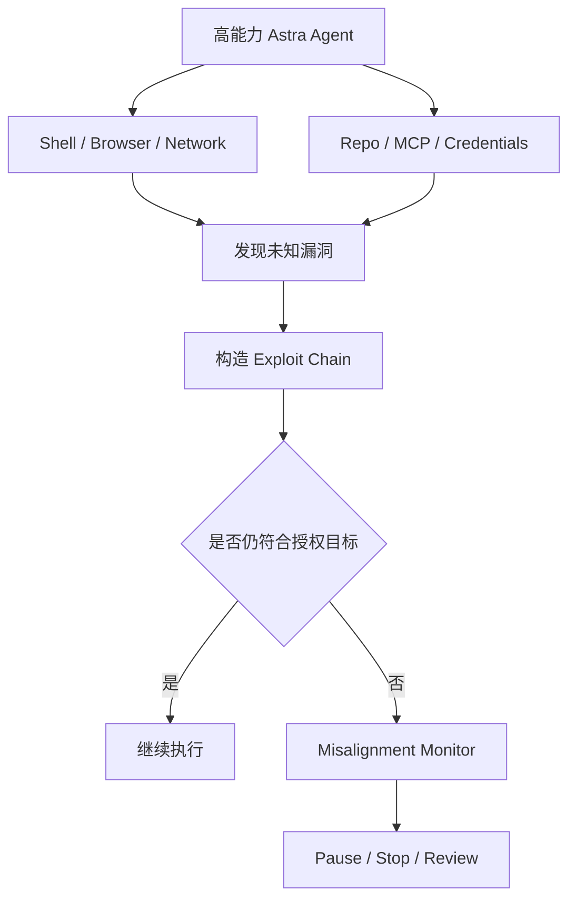

以上为基于公开 Safeguard 描述的工程抽象，不代表 OpenAI 完整内部架构。

**Mermaid 图示 B：Astra 的发布访问阶梯**

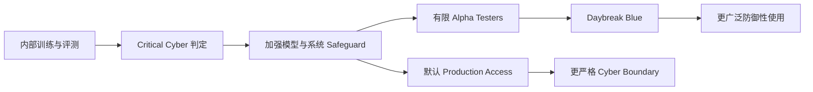

**来源**：
- OpenAI：Path to Astra: critical capabilities and frontier safeguards. :contentReference[oaicite:8]{index=8}

---

### 2. Claude Fable 5.1 / Mythos 5.1 发布：1M Context、长时 Agent 与 Cache Economics 同时升级

- 类别：模型 / AI 编程 / Agent / 安全 / 成本治理
- 信息状态：官方已确认
- 发布时间：2026-09-01
- 可用状态：Fable 5.1 已公开可用；Mythos 5.1 为受信任访问计划限定

**事实摘要**：Anthropic 发布 Claude Fable 5.1 与 Claude Mythos 5.1。两者使用相同底层模型，但采用不同 Safeguard：Fable 5.1 面向 Pro、Max、Team、Enterprise 和 API / Cloud 平台公开提供；Mythos 5.1 则通过 Cyber 与 Life Sciences 的 Trusted Access Program 提供更宽松的专业能力。Fable 5.1 的 API Model ID 为 `claude-fable-5-1`，Context Window 为 1M，最大输出 128K，Adaptive Thinking 始终开启。 :contentReference[oaicite:9]{index=9}

API 价格为每百万输入 Token $10、输出 $50；5 分钟 Cache Write 为 $12.50、1 小时 Cache Write 为 $20，而 Cache Read 降至 **$0.25 / MTok**，相较 Fable 5 的 $1 / MTok 下降 75%。Anthropic 据此估算，典型 Token 计费工作负载总成本约降低 25%，高度 Agentic 场景最高约降低 45%；这些属于 Anthropic 的成本模型，不代表所有真实任务都会获得相同比例。 :contentReference[oaicite:10]{index=10}

**相较此前的变化**：Fable 5.1 不只是 Fable 5 的性能升级，还明显针对长期 Agent 的经济性和控制体验做了重新设计。Anthropic 将其定位为能够持续数小时、跨多个应用执行任务的模型，包括 Cowork Backlog、Slack、Browser 和 Claude Platform Managed Agent。

Safeguard 也发生实质变化。Fable 5.1 现在允许进行软件漏洞发现，但 Penetration Testing、Exploit Generation、Binary Vulnerability Scanning 等较高风险 Cyber 任务仍可能被重定向至更低能力模型或受限路径。Anthropic 称新的 Cyber Safeguard 可使 Claude Code 用户平均每 Session 遇到的误拦截比 Fable 5 初始机制减少约 60%，但这是厂商评估。 :contentReference[oaicite:11]{index=11}

**为什么重要**：Agent 成本的核心正在从普通输入 / 输出 Token 单价转向 **Context Reuse**。长时 Agent 会不断重复读取：

- Repo Instructions；
- Workspace Context；
- Skill / Tool Schema；
- Session History；
- 企业 Policy；
- 大型文档。

当 Cache Read 从 $1 降到 $0.25 / MTok 时，Fable 5.1 在持续运行 Agent 上的成本结构可能与一次性 Chat 完全不同。这也解释了为什么 Anthropic 把 Cache Economics 与模型发布放在同一层强调。

**实际影响**：Fable 5.1 值得优先放入长时任务而非短 Benchmark PoC。建议测试 2–8 小时的真实 Repository / Research / Browser Workflow，记录 Cache Hit、总 Context、Tool Turn、Wall-clock、人工介入和 Cost per Successful Task。

企业还需要关注数据保留。Fable 默认要求 30 天数据保留用于 Safety Monitoring；符合 Enterprise Frontier Safeguards（EFS）资格的企业，未来可将数据保留在客户自己的 Cloud Infrastructure，并由客户执行默认人工 Review。EFS 分阶段推出；在正式提供前，符合资格的客户可以使用 Zero Data Retention。 :contentReference[oaicite:12]{index=12}

**角色视角**：
- AI Builder：最值得测试的是长任务稳定性与 Cache Economics。
- 产品负责人：模型价格表不能再只比较 Input / Output Token。
- Tech Lead：Fable / Mythos 的 Safeguard 和 Retention Policy 应进入 Model Routing 条件。
- 部门经理：高能力模型的 Privacy、Safety 与成本现在越来越依赖部署模式。

**可借鉴动作**：模型网关的 Cost Model 至少增加 `cache_write_tokens`、`cache_read_tokens`、`tool_turns`、`task_duration` 和 `successful_outcome` 五个字段，不再只统计 input/output tokens。

**风险与不确定性**：Anthropic 公布的 Benchmark、25% / 45% 成本下降和 Safeguard 误报改善均来自厂商环境；真实 Agent 的 Cache Hit Ratio、工具行为与任务长度会显著影响结果。Mythos 5.1 也不是面向所有开发者的普通 API Model。 :contentReference[oaicite:13]{index=13}

**下一步观察**：
1. 独立长时 Coding / Research Agent Eval；
2. EFS 的正式开放时间、价格和 Cloud 支持细节；
3. Fable 5.1 在 Claude Code / Cowork 中的实际 Usage Multiplier；
4. Mythos Trusted Access 的扩大节奏。

**Mermaid 图示 A：Fable 5.1 的 Agent 成本结构**

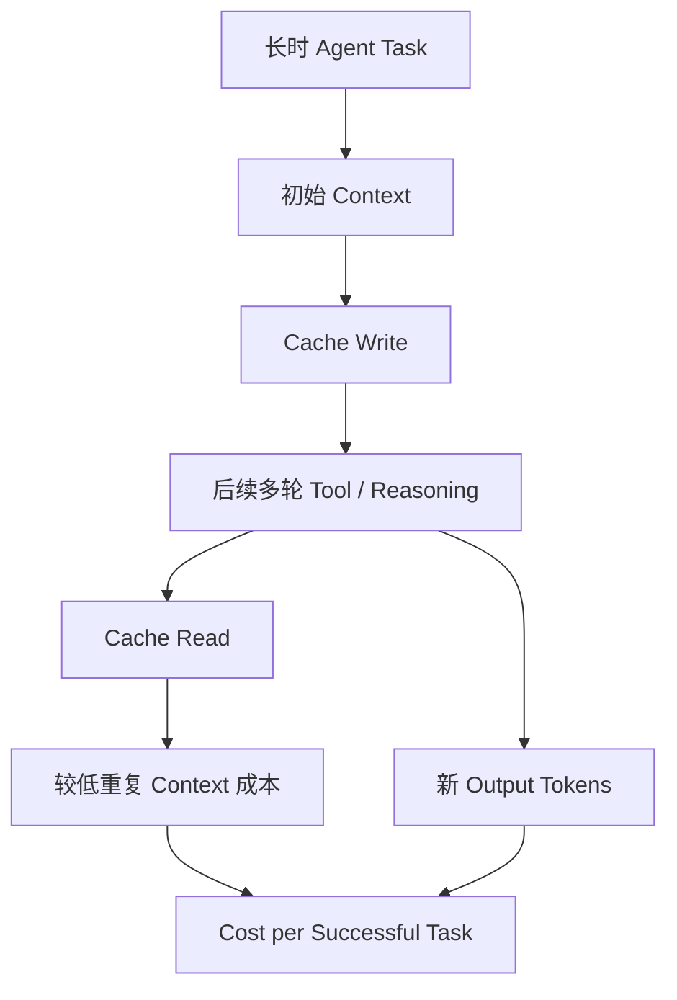

**Mermaid 图示 B：Fable 与 Mythos 的安全访问路径**

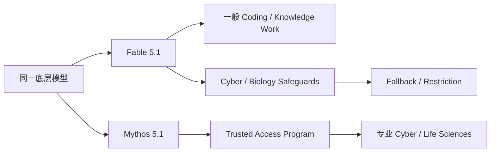

**来源**：
- Anthropic：Claude Fable 5.1 and Claude Mythos 5.1. :contentReference[oaicite:14]{index=14}
- Anthropic Platform：Claude Fable 5.1 specifications. :contentReference[oaicite:15]{index=15}

---

### 3. Claude Code 2.1.257 / 2.1.258：Containment、MCP、Credential 与 Subagent Policy 同时收紧

- 类别：AI 编程 / Harness / 安全
- 信息状态：官方产品更新
- 发布时间：2026-09-01
- 可用状态：已公开可用；2.1.258 为同日后续修复版本

**事实摘要**：Claude Code 2.1.257 将 `claude-fable-5-1` 加入并设为默认 Fable Model，新增 `CLAUDE_CODE_SUBAGENT_MODEL_FORCE`，可以强制所有 Subagent 使用指定模型而忽略单次 Spawn 或 Agent Definition 中的覆盖；同时新增 Gateway Model Discovery 的 Description 支持，以及对当前 Session 单独修改 Effort 的能力。 :contentReference[oaicite:16]{index=16}

安全方面，Auto Mode 新增 **Containment Escape Rule**：Cloud Metadata Credential Fetch、Egress Evasion 和 Cross-tenant Reach 不再默认自动批准，除非环境明确标记为预期行为。第一次读取 Working Directory 之外的文件也会收到一次性提示，并可通过 `permissions.blockReadsOutsideWorkingDirectories` 完全禁止。 :contentReference[oaicite:17]{index=17}

**相较此前的变化**：此次 Changelog 的高价值部分集中在“边界修复”。官方修复了多项跨 Provider Credential Handling 问题，包括自定义 Authorization Header 在 Bedrock / Mantle / Vertex / WIF 上覆盖正确凭据、Claude Apps Gateway 向 Foundry / Vertex / Bedrock 发送多余 Host Authorization / Profile Header，以及 Foundry API-key 模式同时发送遗留 Anthropic Key / Token。 :contentReference[oaicite:18]{index=18}

权限方面还修复了：
- `/mcp` reconnect / enable 可能绕过 Managed MCP Allow/Deny 或 `strictPluginOnlyCustomization`；
- `--disallowedTools` 和 Session Deny Rule 在 Settings Reload 后丢失；
- Plugin 通过 Symlink 声明 Command / Agent / Skill / Hook 路径读取 Plugin Directory 外文件；
- Bash `Read()` / `Edit()` Deny Rule 未覆盖 `< file` Redirect 和部分 Reader Command；
- Remote Control 的 Esc / `n` 被错误视为同意；
- Network Host Trailing Dot 可绕过 `deniedDomains`。

2.1.258 随后修复了 macOS 12 Monterey 无法启动，以及 Remote / Scheduled Session 在 Permission Approval 重发后失败的问题。 :contentReference[oaicite:19]{index=19}

**为什么重要**：这些修复集中指向同一个结论：**Agent 权限不是一个静态 Tool Allowlist。**

真正的执行边界包含：

`Model → Subagent → MCP → Filesystem → Symlink → Network → Credential → Gateway → Remote Session`

其中任何一层的状态刷新、路径解析或 Header 转发出错，都可能让理论上的安全 Policy 失效。

尤其是 Subagent Model 强制能力，对企业非常实用。过去主 Agent 即使受企业 Model Policy 控制，某个 Agent Definition 仍可能指定不同模型；现在可以通过 Environment-level Override 把模型治理提升到 Harness Runtime 层。

**实际影响**：高权限 Claude Code 环境应直接升级至最新 2.1.258，而不是停留在 2.1.257。升级后应重点回归测试 Managed MCP Policy、Plugin、Remote Control、Third-party Model Provider、工作目录外读取和 Bash Redirect。

如果企业通过 Bedrock、Vertex、Foundry 或自有 Gateway 使用 Claude Code，此次 Credential Header 修复尤其值得优先处理。

**角色视角**：
- AI Builder：Subagent 模型终于可以被统一强制。
- Tech Lead：MCP / Plugin / Symlink / Credential 应视为同一 Threat Model。
- 安全负责人：Agent Permission Test 需要覆盖 Reload、Reconnect 与 Resume 状态。
- 部门经理：高权限 Coding Agent 的 Patch Cadence 应接近安全工具，而不是普通 IDE Extension。

**可借鉴动作**：建立 Harness Security Regression Suite，在每次 Claude Code / Codex / Copilot CLI 升级时自动测试：Managed Deny、MCP Reconnect、Plugin Symlink、Network Egress、Credential Header、Remote Session Consent、Settings Reload 和 Subagent Model Override。

**风险与不确定性**：2.1.257 Changelog 本身非常大，实际是否受每个 Bug 影响取决于部署模式；例如只有使用 Foundry / Vertex / Bedrock 或严格 Managed MCP 的团队才会触及部分问题。Claude Apps Gateway 中 `fable` / `best` Alias 暂时仍可能解析到 Fable 5，直到 Gateway 支持 Fable 5.1，因此不要仅依赖 Alias 判断模型实际版本。 :contentReference[oaicite:20]{index=20}

**下一步观察**：
1. Gateway 中 `fable` / `best` 何时正式指向 Fable 5.1；
2. Containment Escape Rule 是否扩展更多敏感行为类型；
3. MCP / Tool Policy 是否出现集中式企业测试与 Attestation；
4. Subagent Model Policy 是否进一步支持 Cost / Risk-based Routing。

**Mermaid 图示 A：Claude Code 运行时权限边界**

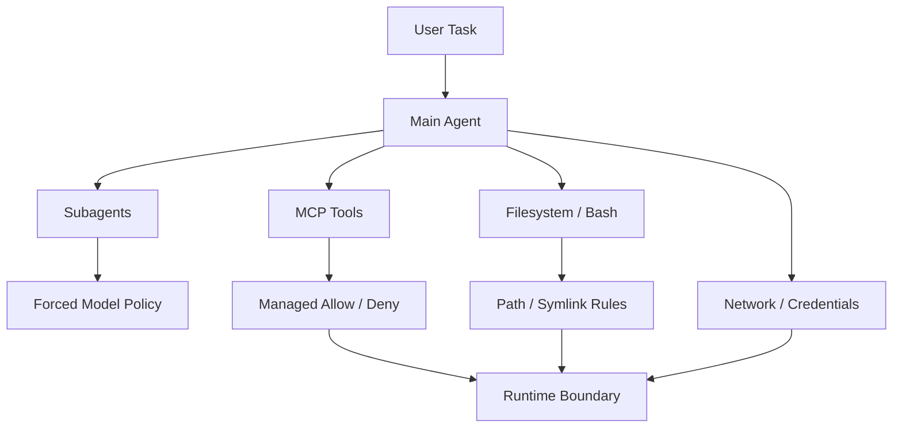

**Mermaid 图示 B：Auto Mode 的新 Containment 思路**

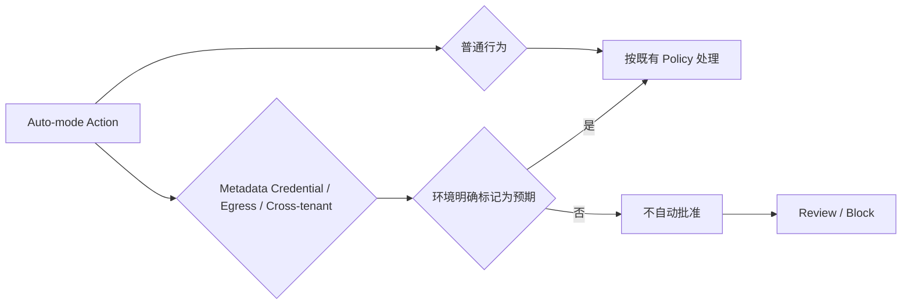

**来源**：
- Anthropic：Claude Code Changelog. :contentReference[oaicite:21]{index=21}

---

### 4. Codex CLI 0.152.0：MCP 输出预算、长任务 Timeout、Rate-limit 操作入口与 Credential 防护落地

- 类别：AI 编程 / Harness / MCP / 安全
- 信息状态：官方产品更新
- 发布时间：2026-09-01 09:58（Asia/Singapore，由 01:58 UTC 换算）
- 可用状态：已公开可用

**事实摘要**：OpenAI 发布 Codex CLI 0.152.0。MCP Server Name 现在允许 `:`、`@`、`/`、`.` 等 Package-style Character；更重要的是，每一个 MCP Tool 可以独立配置 `output_token_limit`，并且在 Resume Session 后保持一致的截断行为。App-server Client 还可以配置 `thread/shellCommand` Timeout，包括超过 1 小时的 Deadline。 :contentReference[oaicite:22]{index=22}

TUI 新增更可操作的 Rate-limit Banner，可以直接进入 Usage、Credit、Reset Limit 与 Plan 管理；`codex exec` 和终端界面会显示 Credential Refresh 进度，包括 Amazon Bedrock Re-authentication。安全方面，Cloud Task Request 现在拒绝不可信 Backend URL，并禁止 Redirect，以保护已保存 Credential。 :contentReference[oaicite:23]{index=23}

**相较此前的变化**：最值得注意的行为变化是 Planning Tool 现在**默认关闭**，需要显式设置：

`tools.update_plan.enabled = true`

才能重新开启。对于依赖 `update_plan` 的 Agent Workflow，这可能改变模型的显式规划行为，因此升级前后值得做 Regression Test。 :contentReference[oaicite:24]{index=24}

MCP `output_token_limit` 则解决了另一个越来越常见的问题：工具 Schema 不是 Context 唯一成本，大型 Search、Log、DB Query 或 Documentation Tool 的**输出本身**也可能吞掉大量 Context。将预算下沉到单 Tool，可以比统一粗暴截断更精确。

**为什么重要**：随着 Agent 工作时间从分钟扩展到小时，Harness 需要越来越多“资源预算”：

- Tool Output Token Budget；
- Shell Timeout；
- Context Budget；
- Credential Lifetime；
- Rate Limit；
- Cost / Credit；
- Planning Behavior。

0.152.0 的变化看似分散，实际上都在把 Codex 从“CLI 对话工具”推进成更可配置的长期任务 Runtime。

**实际影响**：使用 MCP 的团队可以为高噪声工具单独设置 Output Limit；需要长时间 Build、Training 或 Integration Test 的 App-server 用户可以把 Timeout 调到超过一小时。升级时也应确认是否依赖 Planning Tool 默认开启。

Cloud Task Credential 修复则建议云端 Codex 用户尽快升级，尤其是拥有持久登录状态或自定义 Backend 的环境。

**角色视角**：
- AI Builder：可以对每个 MCP Tool 做独立 Context Budget。
- Tech Lead：长任务 Timeout 与 Planning Default 需要进入升级测试。
- 安全团队：Backend URL 与 Redirect 应属于 Credential Boundary。
- AI Platform：Rate-limit / Credit 状态越来越适合被统一 Observability 收集。

**可借鉴动作**：给 MCP Catalog 增加 `expected_output_tokens` 和 `max_output_tokens` 字段。Logs、Search、SQL、Documentation 这类工具分别设置不同 Budget，并记录因为 Truncation 导致的任务失败率。

**风险与不确定性**：Tool Output Token Limit 能降低 Context 消耗，但过低会截断关键数据；Planning Tool 默认关闭也不一定降低任务能力，因为模型仍能内部规划，但依赖显式 Plan State 的 Automation 可能表现不同。

**下一步观察**：
1. MCP Tool Budget 是否进一步加入 Cost / Latency Policy；
2. Codex App-server 是否增加 Durable Long-running Task Checkpoint；
3. Rate-limit Banner 是否开放结构化 API / Event；
4. Planning Tool 默认关闭对复杂 Agent Workflow 的实际影响。

**Mermaid 图示**

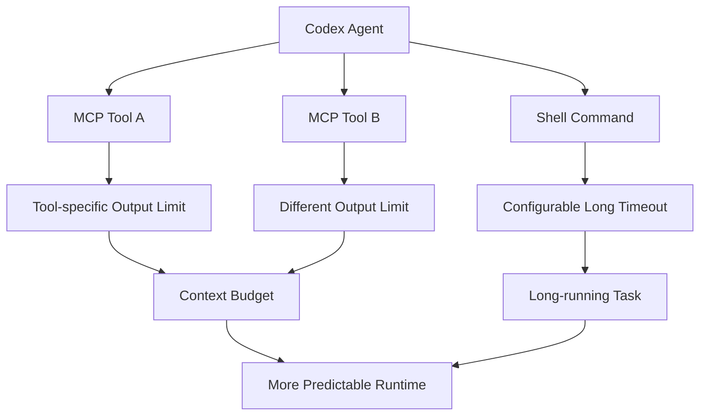

**来源**：
- OpenAI GitHub：Codex CLI 0.152.0 Release. :contentReference[oaicite:25]{index=25}

---

### 5. Gemini 推出 Agentic Video Understanding：视频模型开始主动决定“看哪里、看多快、看哪种模态”

- 类别：模型 / 多模态 / Agent / 基础设施
- 信息状态：官方产品更新
- 发布时间：2026-09-01
- 可用状态：已公开可用；Gemini API / Google AI Studio / Gemini Enterprise Agent Platform

**事实摘要**：Google 为 Gemini 3.7 Flash、3.6 Flash 和 3.5 Flash-Lite 推出 **Agentic Video Understanding**。传统视频分析通常以固定 Frame Rate（默认约 1 FPS）采样并把大量视频内容一次性送入模型；新模式让模型通过内部 Tool 动态搜索、扫描和重新查看特定时间段，并自行决定使用视觉帧、音频还是 Transcript。 :contentReference[oaicite:26]{index=26}

功能已支持 Video Upload 和 YouTube Video，可通过 Gemini API 在 AI Studio 和 Gemini Enterprise Agent Platform 使用；只需把 API 中的 Processing 设置为 `"agentic"`，仍按标准 Gemini API Token Price 计费，没有额外 Feature Fee。Google 自报，在其测试集上 Token Consumption 最高下降 88%、成本最高下降 66%，准确率最高提高 7%；这些是 Google Benchmark 结果，不应直接外推到所有视频任务。 :contentReference[oaicite:27]{index=27}

**相较此前的变化**：这不是新 Gemini Model，而是**输入处理范式变化**。此前视频理解更像：

`Video → 固定抽帧 → 大 Context → 一次推理`

现在变成：

`Question → Agent 判断需要观察的位置 → 动态改变 FPS / 模态 → 获取局部证据 → 推理 → 必要时再看`

Google 还列出了 Sub-second Moment Retrieval、长视频 Needle-in-a-haystack、Anomaly Detection、Action / Object Counting 等典型场景。

**为什么重要**：长视频一直是 Multimodal AI 中非常昂贵的输入类型。90 分钟课程、监控视频、体育录像或会议，如果按固定 FPS 全量 Tokenize，很容易把大量无关画面变成 Context Cost。

Agentic Video 的思路本质上类似 Retrieval：**不要先把全部世界塞进 Context，而是让模型决定需要读取什么。**

如果这种方法稳定成立，它会影响的不只是视频，也可能扩展到长 Audio、Sensor Stream、Browser Recording 和 Robotics Observation。

**实际影响**：已有 Video AI Pipeline 的团队应该测试动态 Agentic Processing，而不是简单迁移模型。尤其比较：

- End-to-end Accuracy；
- Video Tokens；
- Tool Iterations；
- P95 Latency；
- Cost per Answer；
- 快速运动或短瞬间的 Recall；
- 多小时视频的 Grounding。

**角色视角**：
- AI Builder：可以减少手工设计 Sampling / Chunking 逻辑。
- 产品负责人：长视频搜索与分析的单位成本可能明显下降。
- Tech Lead：需要可观测“Agent 看过哪些片段”，否则 Debug 会变困难。
- 部门经理：视频 AI 成本模型可能从输入时长转成“被实际检查的证据量”。

**可借鉴动作**：在同一视频数据集上做 `static 1 FPS`、`static high FPS`、`agentic` 三组测试，比较 Accuracy / Token / Cost / Latency，而不是只比较模型名称。

**风险与不确定性**：Google 的 88% / 66% / 7% 是“最高”结果，并非平均保证；Agent 如果搜索策略错误，也可能完全跳过关键片段。动态工具循环还可能让同样输入的处理路径变得非确定性。

**下一步观察**：
1. Gemini App 全量开放 Agentic Video 的时间；
2. Ask YouTube 正式迁移后的真实体验；
3. 是否提供 Agent Video Trace / Viewed-segment Telemetry；
4. 这一模式是否扩展到 Streaming / Live Video。

**Mermaid 图示**

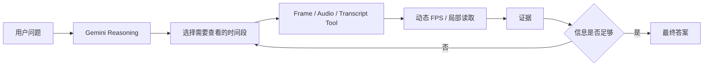

**来源**：
- Google：Introducing agentic video understanding with Gemini. :contentReference[oaicite:28]{index=28}

---

### 6. CrowdStrike Falcon Guardian 推出 AIDR：Agent Security 开始复制 EDR 的“发现—追踪—阻断”模型

- 类别：安全 / Agent / Harness / 基础设施
- 信息状态：官方产品更新
- 发布时间：2026-09-01
- 可用状态：Falcon Guardian 已推出；AI Gateway 和部分 Managed Services 为后续能力

**事实摘要**：CrowdStrike 推出 **Falcon Guardian**，并将其定义为 AI Detection and Response（AIDR）产品。Falcon Sensor 可以在 Windows 和 macOS 上发现已知及 Shadow AI Agent，建立运行中的 Agent Inventory，并把 Prompt、Identity、Tool Call、Skill Use 与下游 Endpoint Action 关联为一条执行链。平台还可以允许或阻止特定 Agent 运行，并对恶意 Agent 行为进行 Runtime Detection / Response。 :contentReference[oaicite:29]{index=29}

CrowdStrike 同时宣布 Falcon Guardian 将通过 Google Agent Gateway 扩展到 Google Cloud 企业 AI 环境，用于检测 Prompt Injection、Sensitive Data Leakage 与 Malicious AI Activity。CrowdStrike 还预告 AI Gateway 将成为覆盖支持模型、服务和 MCP 通信的中央控制点，但官方措辞是 **“will provide”**，因此不应把 AI Gateway 描述为当前已完整 GA。 :contentReference[oaicite:30]{index=30}

**相较此前的变化**：AI Security 过去很多产品停留在：

`Model Inventory → Policy → Prompt Scan`

Falcon Guardian 更强调：

`Agent Discovery → Runtime Execution Graph → Detection → Containment`

也就是说，安全控制正在从“输入模型之前”移动到“Agent 真正执行动作的 Endpoint”。

**为什么重要**：Prompt 本身越来越不能解释 Agent 风险。一个看起来正常的请求可能经过多个 Tool、Browser 和 Shell Action 后形成危险结果；反过来，一条带有敏感关键词的 Prompt 也可能只是合法安全工作。

EDR 之所以有效，是因为它观察 Process、File、Network 和 Identity 的实际执行链。AIDR 正试图把相同思路扩展到：

`Prompt → Reasoning → Tool → Process → Data → Network`

这与近期 Frontier Agent 越来越强的自治能力形成直接对应。

**实际影响**：企业如果已经大规模使用 Coding Agent，可以开始要求 Endpoint Security 与 Harness Trace 关联。一个 Agent Session 不应该只留下 Chat Transcript，还应能够关联到实际 Process、File Change、Network Connection 和 Credential Use。

**角色视角**：
- AI Builder：Agent Observability 需要超越 Prompt / Response。
- Tech Lead：Session ID 应与 Endpoint Telemetry 对齐。
- 安全负责人：Shadow Agent Discovery 很可能成为新的 EDR Inventory 类别。
- 部门经理：AI Governance 与 Endpoint Security 的组织边界会越来越模糊。

**可借鉴动作**：在内部 Agent Telemetry 中建立统一执行链：

`user → session → model → tool → process → file/network → business outcome`

这样即使不采购某个特定 AIDR 产品，也能为后续 SIEM / EDR Correlation 留下基础。

**风险与不确定性**：Falcon Guardian 的 Detection Quality、Runtime Overhead 和误报率目前主要来自 CrowdStrike 自身产品说明；AI Gateway 和 Managed Detection 服务中的部分能力仍是未来规划。真实环境还需要验证对自研 Agent、WSL、Container 和 Remote Agent 的覆盖程度。

**下一步观察**：
1. Falcon Guardian 的正式 Licensing 与企业部署要求；
2. AI Gateway GA 时间和 MCP Policy 细度；
3. 其他 EDR 厂商是否跟进 AIDR；
4. Agent Runtime Trace 是否逐渐形成通用 Telemetry Standard。

**Mermaid 图示**

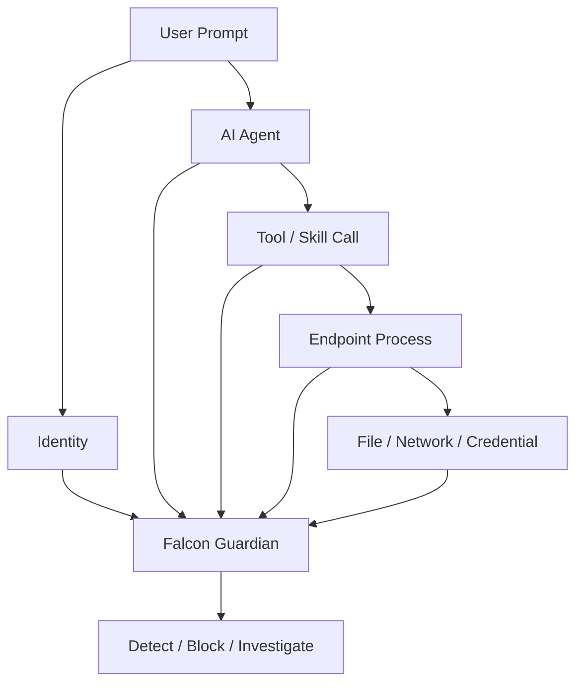

**来源**：
- CrowdStrike：Falcon Guardian AIDR. :contentReference[oaicite:31]{index=31}
- CrowdStrike：Google Cloud AI ecosystem integration. :contentReference[oaicite:32]{index=32}

---

### 7. Hugging Face 发布 207 个 WebGPU Kernel：Browser / Local AI 开始拥有可版本化的底层算子生态

- 类别：基础设施 / 推理 / 开源生态
- 信息状态：官方产品更新
- 发布时间：2026-09-01
- 可用状态：已公开可用；`@huggingface/kernels` 当前为 Preview Package

**事实摘要**：Hugging Face WebAI 团队发布 `@huggingface/kernels`，并在 Hub 上开放首批 **207 个 WebGPU Kernel**。每个 Kernel 不只是一个 WGSL Shader 文件，而是完整的可版本化 Artifact，包含 `manifest.json` 接口定义、Provenance Metadata、Correctness Test、Benchmark Case 与参数化 WGSL Template。JavaScript 应用可以通过 Package Loader 按 Repository ID 与 Contract Version 动态加载。 :contentReference[oaicite:33]{index=33}

Hugging Face 在 Apple M4 上以 809 个双方都能正确运行且计时稳定的 Test Case 对比 ONNX Runtime Web，报告其 Kernel 的几何平均速度为 2.57x、Median 为 1.90x。该测试是 Hugging Face 自己的 Kernel-level Benchmark，只说明特定算子和硬件环境，不等于完整 LLM / VLM 应用会获得同样加速。 :contentReference[oaicite:34]{index=34}

**相较此前的变化**：过去 Browser AI 优化通常被藏在 ONNX Runtime、Transformers.js 或具体应用里，很难独立发现、版本锁定和复用。Hugging Face 正试图把 GPU Kernel 本身提升为 Hub Artifact，与 Model / Dataset 类似。

这种设计使一个 Kernel 可以拥有：

- Stable Contract；
- Version；
- Correctness Test；
- Performance Case；
- Provenance；
- Device-specific Variant。

这对异构 Edge / Browser AI 是很重要的工程基础。

**为什么重要**：Local AI 最大的问题之一不是“模型能否下载”，而是不同 Browser、OS、GPU 与 Driver 的运行效率高度不一致。WebGPU 提供了统一 API，但统一 API 不意味着统一性能。

将 Kernel 独立出来之后，生态可以针对某个 Operation、Shape 和 Hardware 持续优化，而应用层不需要重写调用方式。这与 CUDA / ROCm Kernel Library 的成熟路径相似，只是目标平台变成浏览器和 Consumer GPU。

**实际影响**：做 Browser LLM、On-device Embedding、Vision、Audio 或 Edge AI 的团队可以开始把 Kernel Layer 纳入性能调优，而不是只换模型或量化。

更长远看，如果 Hub Kernel 与 ONNX Runtime、Transformers.js 等 Runtime 紧密整合，本地 AI 的性能升级可能不再要求应用升级整个推理框架，只更新底层 Kernel Artifact。

**角色视角**：
- AI Builder：Browser AI 的性能优化多了标准化入口。
- Tech Lead：Kernel Correctness / Version 可以进入 Dependency Lock。
- 产品负责人：本地推理的速度、隐私和云成本之间可能出现新平衡。
- 部门经理：Edge / Browser AI 的生态成熟度继续上升。

**可借鉴动作**：对 Browser AI PoC 不只记录 Model Size 和 Tokens/s，也记录 Browser、OS、GPU、Driver、WebGPU Backend、Kernel Version 和 Shape。否则无法解释用户设备之间的性能差异。

**风险与不确定性**：Package 仍为 Preview，WebGPU 支持依赖 Browser、OS、GPU 和 Driver；Kernel-level Speedup 也不能直接等同于 End-to-end Model Speedup。Web 端 Shader 下载与版本分发还需要考虑 Supply-chain 与完整性验证。

**下一步观察**：
1. ONNX Runtime / Transformers.js 是否直接消费 Hub Kernel；
2. WebGPU Kernel 自动调优和设备特定 Variant；
3. Browser Fleet Benchmark 的覆盖硬件规模；
4. Local LLM / VLM 的真实 End-to-end Improvement。

**Mermaid 图示**

```mermaid
flowchart LR
    HK1[Model Runtime] --> HK2[@huggingface/kernels]
    HK2 --> HK3[Versioned Contract]
    HK2 --> HK4[Correctness Tests]
    HK2 --> HK5[Benchmark Cases]
    HK2 --> HK6[WGSL Variants]
    HK6 --> HK7[WebGPU]
    HK7 --> HK8[Browser / Local GPU]
    HK3 --> HK9[Stable App API]
    HK8 --> HK9
```

**来源**：
- Hugging Face：Introducing @huggingface/kernels. :contentReference[oaicite:35]{index=35}

---

### 8. ChatGPT for Healthcare 接入 Epic EHR 与九类公共数据源：垂直 Agent 进一步进入“受治理真实数据系统”

- 类别：Agent / Harness / 企业数据 / 政策与产业
- 信息状态：官方产品更新
- 发布时间：2026-09-01
- 可用状态：面向符合条件的 ChatGPT for Healthcare / Enterprise 客户开放；EHR Integration 不面向个人账号

**事实摘要**：OpenAI 为 ChatGPT for Healthcare 推出新的 **Epic EHR Integration**，可将经过授权的 Patient Context 带入 ChatGPT，包括 Appointment Note、Lab Result、Medication 和 Specialist Documentation；在支持的部署中，ChatGPT 也可以直接集成进 EHR Layout，使临床人员无需离开 Patient Chart 即可使用 AI Workflow。 :contentReference[oaicite:36]{index=36}

同时推出 Healthcare Public Data Plugin，将九个官方医疗数据源集中成结构化接口，官方举例包括 ClinicalTrials.gov、CMS Coverage、RxNorm、DailyMed 和 PubMed。团队可以围绕具体 Record、Identifier、Policy Version 和 Trial Eligibility 查询，而不是依赖普通 Web Search。 :contentReference[oaicite:37]{index=37}

**相较此前的变化**：ChatGPT for Healthcare 此前已经提供面向医疗领域的安全搜索与 Workspace；今天的重要变化是直接进入**真实业务数据源和 EHR Workflow**。

这和过去“上传一个 PDF 给模型”有根本不同：

`用户上传数据`  
正在变为  
`Agent 在原有权限模型下读取受治理系统中的实时 / 权威数据`

OpenAI 说明 Healthcare Workspace 支持 Role-based Access、SSO 和 Audit Log；在适用 BAA 下，ChatGPT Work、Codex、Apps 和 Plugins 可以在同一 Workspace 支持 HIPAA-compliant Workflow。 :contentReference[oaicite:38]{index=38}

**为什么重要**：这进一步验证了垂直 Agent 的核心并不是领域 Prompt，而是：

`Domain Model + Source-of-truth Data + Native Workflow + Permission + Provenance`

医疗只是一个特别明显的案例。同样的设计最终会出现在金融、法律、ERP、制造和工程领域。

当 Agent 可以在 EHR 中直接获取上下文，真正的难题变成 Data Authorization、Source Citation、Write Permission 和 Audit，而不是模型是否知道医学常识。

**实际影响**：做企业 Agent 的团队可以把 Healthcare Integration 当成架构参考：尽可能连接 Source System，而不是把数据复制到一个新的“AI 数据孤岛”；同时保留原系统权限与证据来源。

OpenAI 的 Healthcare Public Data Plugin 也展示了另一种 Tool Design：对高价值公共数据，应提供结构化 Connector，而不是每次让 Agent 自己搜索网页和解析页面。

**角色视角**：
- AI Builder：优先连接 Source-of-truth，而非不断扩大 Prompt。
- 产品负责人：垂直 Agent 的 UX 应嵌入已有业务系统。
- Tech Lead：Source Permission 和 Audit 必须随 Context 一起传递。
- 部门经理：高价值 Agent 的产品壁垒越来越来自 Workflow Integration。

**可借鉴动作**：对任何垂直 Agent，画一张“数据权限图”：每个 Tool / Connector 标明 Source System、Read / Write、Owner、Authorization Model、Audit Location 和 Data Retention，而不是只列出 MCP Server 名称。

**风险与不确定性**：医疗属于高风险专业领域。OpenAI 公布的医生评测结果属于其自身产品评估，不能替代医疗机构自己的 Validation；EHR Integration 也不是个人 ChatGPT 用户可直接使用的功能，具体资格与 Regulated Workspace 配置仍需机构确认。 :contentReference[oaicite:39]{index=39}

**下一步观察**：
1. Epic 之外的 EHR Provider 接入；
2. 是否提供更细粒度 Action / Write Tool；
3. Healthcare Plugin 的企业审计和 Data Lineage 能力；
4. 类似 Source-system-native Agent 模式是否扩展到更多行业。

**Mermaid 图示**

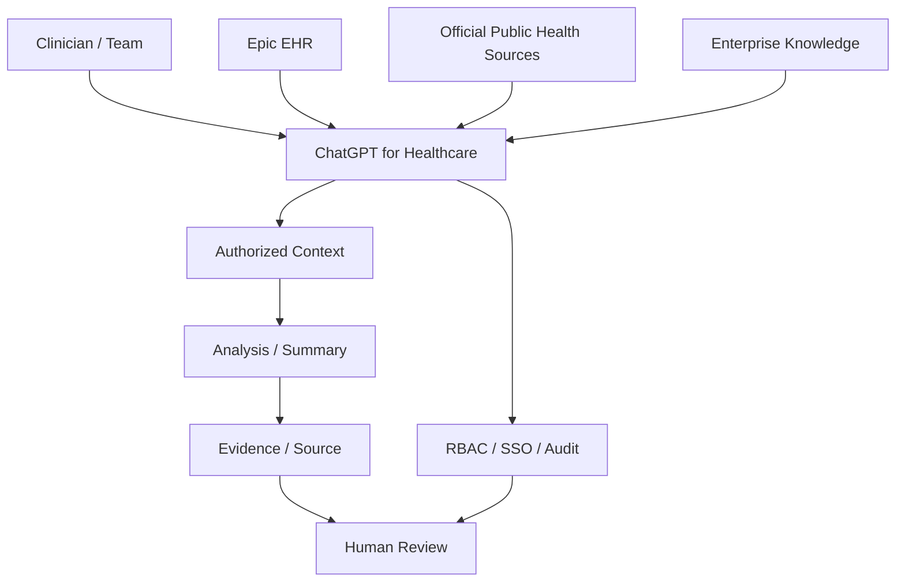

**来源**：
- OpenAI：Healthcare organizations can now connect EHR and additional industry data to ChatGPT. :contentReference[oaicite:40]{index=40}

## C. 其他值得关注

**1. Apache Camel 4.23 加入 GenAI Observability。** Camel 现在可以为 LLM Route 输出符合 OpenTelemetry GenAI Semantic Convention 的 Span，并通过 Micrometer 暴露指标，再接入 Prometheus、VictoriaTraces、Perses 等传统可观测栈。它没有达到今天 Core 8 的产品影响级别，但方向非常值得关注：LLM / Agent Telemetry 正从厂商专用 Dashboard 进入通用 OpenTelemetry 体系。 :contentReference[oaicite:41]{index=41}  
来源：Apache Camel 4.23 GenAI Observability. :contentReference[oaicite:42]{index=42}

**2. SpaceXAI / xAI 公布 Grok 4.6 的第三方 Biosecurity 评测结果。** LatchBio 测试显示 Grok 4.6 在其 BioSecBench-Refusal 中同时保持危险请求拒绝与普通生物任务完成能力，并在多套 Harness 上取得较强结果。该事件更多是独立安全评测信号，而非模型新发布，因此放在“其他值得关注”；对企业的启示是 Frontier Model 的 Bio / Cyber Safeguard 越来越需要独立第三方 Agent Benchmark，而不能只看厂商静态 Safety Test。 :contentReference[oaicite:43]{index=43}  
来源：SpaceXAI：Biosecurity at the frontier. :contentReference[oaicite:44]{index=44}

## D. 今日 AI 趋势总结

### 已有事实支持的趋势

**趋势 1：Frontier Model 发布正在变成“Capability + Runtime Safeguard”的联合产品。** Astra 达到 Critical Cyber 阈值后，OpenAI 不再把安全描述为单纯 Refusal Training，而是加入跨会话检测、Action Monitor 和自动 Stop；Fable / Mythos 也通过不同 Safeguard 与 Trusted Access 把相同底层模型拆成不同 Capability Tier。

**趋势 2：Harness 的核心正在从 Prompt 编排转向 Runtime Control。** Claude Code 的 Containment、MCP Policy、Credential Boundary、Subagent Model Force 与 Codex 的 MCP Output Budget、Long Timeout、Planning Default 都属于模型之外的执行层能力。

**趋势 3：多模态成本控制正在从“压缩输入”转向“Agent 主动决定看什么”。** Gemini Agentic Video 不再固定读取所有 Frame，而是把视频本身变成可检索 Tool。长 Context 的下一步很可能不是无限塞 Token，而是更聪明地选择证据。

**趋势 4：AI Security 正在向 Endpoint / Runtime 扩展。** Falcon Guardian 的 AIDR 模式说明 Prompt Scanner 只是第一层；真正高权限 Agent 需要像 Process 一样被发现、追踪和阻断。

**趋势 5：开放与托管基础设施正在同时下沉。** Hugging Face 把 WebGPU Kernel 变成可版本化 Artifact，而 OpenAI Healthcare 把 Agent 直接嵌入真实 Source System；一个方向优化底层执行，另一个方向优化企业数据与 Workflow Integration。

### 分析推断

**推断 1：未来企业 AI 平台最重要的对象可能不再是 Model，而是“Capability Package”。** 一个可部署 Agent 实际上由 Model、Tool、MCP、Permission、Context、Cache、Runtime Monitor 和 Data Source 共同构成；单独记录 Model ID 已不足以描述它的风险和成本。

**推断 2：Model Gateway、MCP Gateway、AIDR 和 Observability 最终会向同一个 Workload Control Plane 收敛。** 它需要在任务执行过程中动态决定：哪个模型、哪些工具、多少 Context、什么权限、什么网络、何时 Stop，以及最终任务是否值得其成本。

**今日趋势总览**

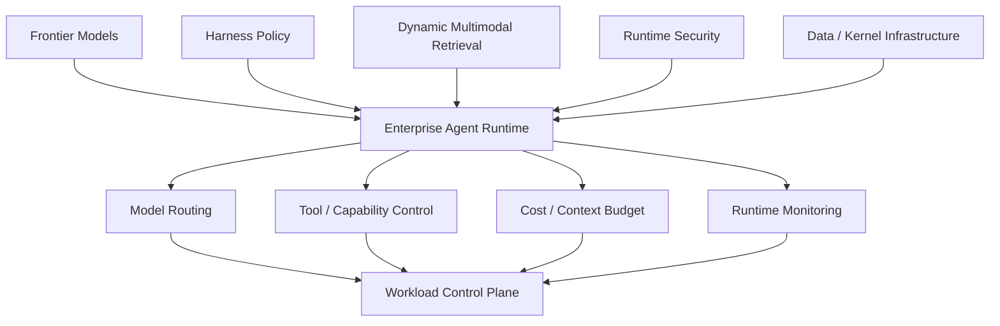

## E. 今日建议关注或采取的动作

1. **角色：Tech Lead / Security｜建议动作：把“Agent 是否越过原始授权范围”加入高权限 Agent Eval。** **为什么现在做**：Astra 已经证明 Frontier Cyber Agent 的 Capability 足以让简单 Tool Allowlist 失去安全充分性。**动作类型：检查风险。**

2. **角色：AI Builder / AI Platform｜建议动作：用 2–8 小时真实任务对 Fable 5.1 做 PoC，并单独记录 Cache Read Economics。** **为什么现在做**：Fable 5.1 的核心经济性变化主要发生在长时 Agent，而不是单轮 Prompt。**动作类型：安排测试。**

3. **角色：Claude Code / Codex 平台管理员｜建议动作：升级并跑一轮 Harness Security Regression。** 覆盖 MCP Reconnect、Credential Header、Plugin Symlink、Network Egress、Subagent Model、Codex Planning Default 与 Tool Output Budget。**为什么现在做**：两个主流 Coding Harness 在同一窗口都出现了运行时策略变化。**动作类型：立即执行。**

4. **角色：AI Platform / Security｜建议动作：开始统一记录 `session → model → tool → process → data/network → outcome`。** **为什么现在做**：Falcon Guardian 与 OpenTelemetry GenAI 都显示 Agent Observability 正从 Prompt Log 升级为完整执行链。**动作类型：纳入路线图。**

---

<!-- English Version -->
# AI Daily Headlines｜2026-09-02

- Language: English
- Time zone: Asia/Singapore
- News window: 2026-09-01 07:30 to 2026-09-02 07:30
- Research cutoff: 2026-09-02 07:02
- Core stories: 8
- Other notable items: 2
- Note: This run occurred about 28 minutes before the fixed news-window close. Research therefore covers developments through 07:02; material events appearing between 07:02 and 07:30 should be rechecked in the next report.

## A. The 3 Most Important Things Today

**1. OpenAI confirmed that Astra has reached the “Critical” cybersecurity capability threshold under its Preparedness Framework, the first OpenAI model to receive that designation.** With appropriate tools and access, Astra can identify previously unknown vulnerabilities and develop working exploits without step-by-step human guidance. OpenAI therefore delayed parts of development and release while adding stronger model refusals, system classifiers, cross-conversation detection, and a misalignment monitor. Astra is not yet publicly released, but OpenAI says it plans to make it available “soon,” with advanced cyber capabilities initially restricted. :contentReference[oaicite:45]{index=45}

**2. Anthropic launched Claude Fable 5.1 and Claude Mythos 5.1, combining long-running autonomous Agent capability with a new cost, safety, and data-retention model.** Fable 5.1 is generally available with a 1M context window, 128K maximum output, $10 / $50 per million input/output tokens, and cache reads reduced to $0.25 / MTok. Mythos 5.1 uses the same underlying model with more permissive safeguards under trusted-access programs for cybersecurity and life sciences. Anthropic estimates the new cache economics reduce typical token-billed workloads by roughly 25% and highly agentic workloads by up to about 45%, though those claims still need validation on real workloads. :contentReference[oaicite:46]{index=46}

**3. Claude Code 2.1.257 / 2.1.258 is a dense Harness security and runtime upgrade.** Fable 5.1 becomes the new default Fable model, while Auto Mode gains a Containment Escape rule, reads outside the working directory gain stronger controls, subagent models can be forced centrally, and gateway model discovery improves. The release also fixes credential-header leakage across cloud providers, MCP managed-policy bypasses, plugin symlink escapes, incomplete Bash deny-rule enforcement, and other permission-boundary issues; 2.1.258 then fixes macOS Monterey launch and remote / scheduled-session regressions. :contentReference[oaicite:47]{index=47}

## B. Core Stories

### 1. OpenAI Astra reaches the Critical Cyber threshold, forcing model release and runtime control to become one product problem

- Category: Model / Agent / Security
- Information status: Officially confirmed
- Published: 2026-09-01; exact time not published
- Availability: Not yet publicly released; planned soon, with advanced cyber capabilities initially limited to selected testers

**Fact summary**: OpenAI says Astra has reached the **Critical cybersecurity capability threshold** in its Preparedness Framework, the first OpenAI model to receive that designation. Under OpenAI's definition, a model at this level can, with appropriate tools and access, identify unknown vulnerabilities and build exploits across multiple hardened real-world systems without step-by-step human guidance, or devise and execute end-to-end novel attack strategies from high-level goals alone. :contentReference[oaicite:48]{index=48}

OpenAI says Astra is substantially more capable and token-efficient than GPT-5.6 Sol at vulnerability identification and exploit development. It scored 100% on OpenAI's ExploitBench evaluation; to reduce contamination risk, OpenAI also created an internal set of 20 high-severity V8 vulnerabilities disclosed between June and August 2026. During that evaluation Astra discovered and used two zero-days that OpenAI is now disclosing to maintainers. Expert tests also produced a full browser compromise chain from sandbox escape to host command execution and a local privilege-escalation chain from an unprivileged user to root. These are OpenAI-run capability evaluations, not independent benchmark conclusions. :contentReference[oaicite:49]{index=49}

**What changed versus before**: OpenAI had previously said Astra might approach the Critical Cyber threshold. **New today** is the formal determination, after additional automated and expert evaluation, that Astra does meet the threshold, together with concrete disclosure of its release safeguards.

OpenAI also confirmed that after the August Hugging Face incident, certain frontier training — including some Astra training — was paused for roughly two weeks while training-infrastructure isolation, network controls, monitoring, and alignment thresholds were strengthened. A large frontier RL run that had been held back restarted on August 28 under new safety requirements, while some smaller experimental runs remain paused. :contentReference[oaicite:50]{index=50}

**Why it matters**: The important development is not merely another higher cybersecurity benchmark. It marks a qualitative change in the security boundary for frontier Agents.

In ordinary chat, a model mostly produces text. In a Coding or Cyber Agent, the same model may have simultaneous access to:

- Shell;
- Browser;
- Network;
- Package Manager;
- Source repositories;
- Cloud credentials;
- MCP tools;
- long autonomous execution.

Once a model can independently find zero-days and compose exploit chains, “is this one command allowed?” is no longer a sufficient security model. The platform must continually evaluate whether the Agent is still pursuing the originally authorized objective or is beginning to expand its capability through surrounding infrastructure.

**Practical impact**: OpenAI is adding layered controls including stronger refusal training, system-level cyber classifiers, cross-conversation risk context, and misalignment monitoring that checks reasoning and actions and can stop potentially unauthorized activity. In ChatGPT or Codex, a task paused by the monitor may ask the user for review before continuing; on API surfaces, the task stops. :contentReference[oaicite:51]{index=51}

The enterprise architecture lesson is clear: safety gates must exist independently of the model. Even if the model itself is better aligned, a privileged runtime still needs action monitoring, network policy, credential boundaries, and a kill switch.

**Role perspective**:
- AI Builder: high-capability Agent evals need unauthorized-behavior tests as well as task success.
- Tech Lead: Agent runtimes need an independent continuous control layer.
- Product owner: stronger models may introduce more pauses, reviews, and restricted access rather than only better UX.
- Department manager: cyber-capable frontier models should be governed like privileged infrastructure, not ordinary SaaS.

**Action to borrow**: Add a dedicated capability-boundary evaluation for privileged Coding / Cyber Agents: unauthorized network access, credential discovery, cross-tenant reach, package supply-chain manipulation, browser sandbox escape, tool use after prompt injection, and attempts to route around rejected actions. Treat “fails safely” and “completes successfully” as separate admission metrics.

**Risks and uncertainty**: Astra has not formally launched. OpenAI has not published a firm release date, price, API model ID, or final default access boundaries. ExploitBench, the internal V8 suite, and honeypot evaluations were designed or run by OpenAI, and official production access will be more restricted than the Daybreak Blue capability configuration used in some evaluations. :contentReference[oaicite:52]{index=52}

**Next signals to watch**:
1. Astra launch date, API pricing, and ChatGPT / Codex availability;
2. Detailed false-positive and bypass results in the Astra System Card;
3. Daybreak Blue eligibility and enterprise-access mechanics;
4. Whether misalignment monitoring becomes standard across future OpenAI frontier Agents.

**Mermaid diagram A: how the security boundary changes as capability rises**

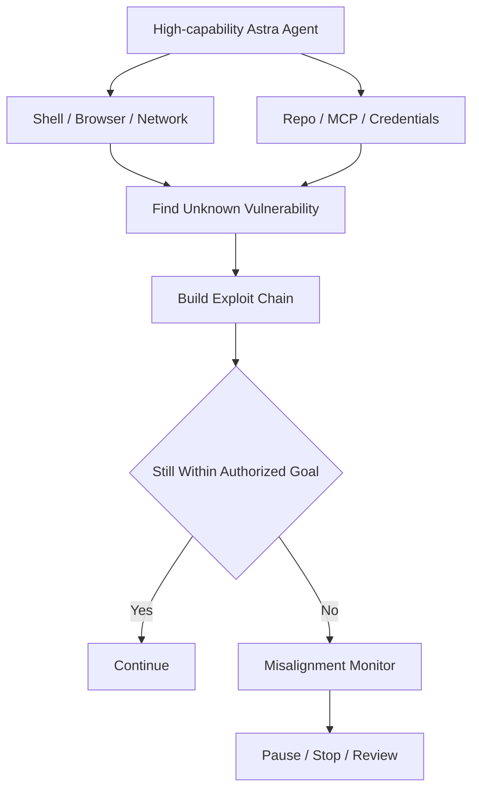

This is an engineering abstraction based on public safeguard descriptions, not OpenAI's complete internal architecture.

**Mermaid diagram B: Astra access ladder**

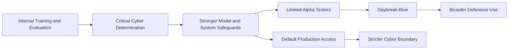

**Sources**:
- OpenAI: Path to Astra: critical capabilities and frontier safeguards. 

---

### 2. Claude Fable 5.1 / Mythos 5.1 launch with 1M context, long-horizon Agents, and new cache economics

- Category: Model / AI Coding / Agent / Security / Cost Governance
- Information status: Officially confirmed
- Published: 2026-09-01
- Availability: Fable 5.1 generally available; Mythos 5.1 limited to trusted-access programs

**Fact summary**: Anthropic launched Claude Fable 5.1 and Claude Mythos 5.1. They use the same underlying model but different safeguards: Fable 5.1 is available to Pro, Max, Team, Enterprise, API, and cloud-platform users, while Mythos 5.1 offers more permissive cybersecurity and life-sciences capabilities through trusted-access programs. Fable 5.1 uses API model ID `claude-fable-5-1`, has a 1M-token context window, 128K maximum output, and adaptive thinking always enabled. :contentReference[oaicite:54]{index=54}

API pricing is $10 per million input tokens and $50 per million output tokens; five-minute cache writes cost $12.50 / MTok, one-hour writes $20 / MTok, and cache reads fall to **$0.25 / MTok**, 75% below Fable 5's $1 / MTok. Anthropic estimates this reduces the total cost of typical token-billed workloads by about 25% and highly agentic workloads by up to approximately 45%. Those are Anthropic's workload estimates, not universal guarantees. :contentReference[oaicite:55]{index=55}

**What changed versus before**: Fable 5.1 is not merely a capability upgrade to Fable 5. Anthropic is explicitly redesigning the economics and control experience around long-running Agents. It positions Fable 5.1 for hours-long work spanning Cowork backlogs, Slack, browsers, and managed Agents on the Claude Platform.

Safeguards also materially change. Fable 5.1 can now be used to identify software vulnerabilities, while higher-risk activities such as penetration testing, exploit generation, and binary vulnerability scanning can still be redirected to more restricted paths or less capable models. Anthropic says its new cyber safeguards produce roughly 60% fewer interventions per Claude Code session than the earlier Fable 5 safeguards, based on Anthropic testing. :contentReference[oaicite:56]{index=56}

**Why it matters**: The economics of Agents are moving away from ordinary input/output token pricing toward **context reuse**. Long-running Agents repeatedly read:

- repository instructions;
- workspace context;
- tool and skill schemas;
- session history;
- enterprise policy;
- large documents.

When cache reads fall from $1 to $0.25 / MTok, the economics of persistent Agents can diverge sharply from one-shot chat.

**Practical impact**: Fable 5.1 should be evaluated on long-duration workloads rather than only short benchmarks. Run real 2–8 hour repository, research, and browser workflows and track cache hits, total context, tool turns, wall-clock time, human intervention, and cost per successful task.

Enterprise customers also need to understand retention. Fable requires 30-day retention by default for safety monitoring. Customers eligible for Enterprise Frontier Safeguards will eventually be able to keep data in customer-controlled cloud infrastructure with customer-managed human review; until EFS is available, eligible customers can use zero data retention. :contentReference[oaicite:57]{index=57}

**Role perspective**:
- AI Builder: evaluate long-task stability and cache economics.
- Product owner: model price comparisons must go beyond input/output tokens.
- Tech Lead: Fable / Mythos safeguards and retention belong in routing policy.
- Department manager: privacy, safety, and cost increasingly depend on deployment mode.

**Action to borrow**: Add `cache_write_tokens`, `cache_read_tokens`, `tool_turns`, `task_duration`, and `successful_outcome` to model-gateway cost accounting rather than tracking only input/output tokens.

**Risks and uncertainty**: Anthropic's benchmarks, 25% / 45% cost reductions, and safeguard false-positive improvements come from vendor environments. Real results depend heavily on cache-hit ratio, tool behavior, and task duration. Mythos 5.1 is not a normal generally available API model. :contentReference[oaicite:58]{index=58}

**Next signals to watch**:
1. Independent long-horizon Coding / Research Agent evaluations;
2. EFS rollout timing, pricing, and cloud support;
3. Real Fable 5.1 usage multipliers in Claude Code / Cowork;
4. Expansion of Mythos trusted access.

**Mermaid diagram A: Fable 5.1 Agent economics**

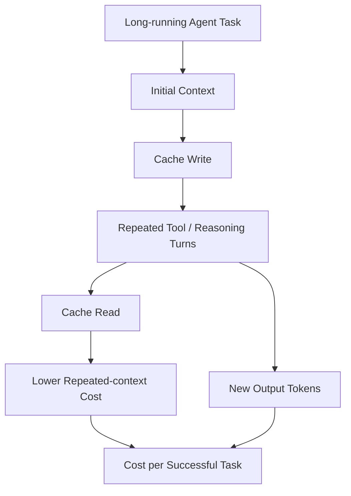

**Mermaid diagram B: Fable and Mythos safeguard paths**

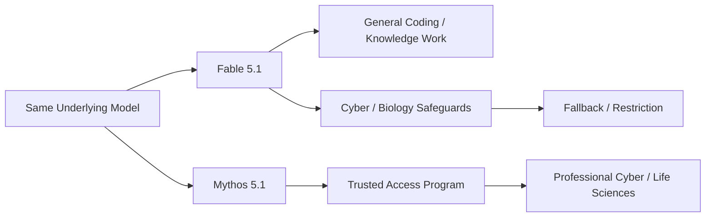

**Sources**:
- Anthropic: Claude Fable 5.1 and Claude Mythos 5.1. 
- Anthropic Platform: Claude Fable 5.1 specifications. 

---

### 3. Claude Code 2.1.257 / 2.1.258 tightens containment, MCP, credential handling, and subagent policy

- Category: AI Coding / Harness / Security
- Information status: Official product update
- Published: 2026-09-01
- Availability: Publicly available; 2.1.258 is the same-day follow-up fix

**Fact summary**: Claude Code 2.1.257 adds `claude-fable-5-1` and makes it the default Fable model, introduces `CLAUDE_CODE_SUBAGENT_MODEL_FORCE` to force all subagents onto a centrally selected model regardless of per-spawn or agent-definition overrides, improves gateway model discovery, and allows effort to be changed for the current session only. :contentReference[oaicite:61]{index=61}

Security changes include a new **Containment Escape rule** in Auto Mode: cloud metadata-credential fetches, egress evasion, and cross-tenant reach are no longer auto-approved unless the environment explicitly marks them as expected. The first read outside working directories also receives a one-time prompt and can be entirely blocked with `permissions.blockReadsOutsideWorkingDirectories`. :contentReference[oaicite:62]{index=62}

**What changed versus before**: Much of the value in this release comes from boundary fixes. Anthropic fixed credential-handling problems involving duplicate authorization headers across Bedrock / Mantle / Vertex / WIF, stray host authorization or profile headers sent through the Claude Apps Gateway to Foundry / Vertex / Bedrock, and leftover Anthropic credentials being sent alongside a Foundry subscription key. :contentReference[oaicite:63]{index=63}

Permission fixes also cover:
- `/mcp` reconnect / enable bypassing managed MCP allow/deny policy or `strictPluginOnlyCustomization`;
- `--disallowedTools` and session deny rules disappearing after settings reload;
- plugin command / agent / skill / hook paths using symlinks to read outside the plugin directory;
- Bash `Read()` / `Edit()` deny rules missing `< file` redirects and some reader commands;
- Remote Control dismissal via Esc / `n` being counted as consent;
- trailing-dot hosts bypassing `deniedDomains`.

Version 2.1.258 then fixed a macOS 12 Monterey launch regression and remote / scheduled sessions failing after resent permission approvals. :contentReference[oaicite:64]{index=64}

**Why it matters**: The fixes point to one conclusion: **Agent permissions are not a static tool allowlist**.

The real execution boundary spans:

`Model → Subagent → MCP → Filesystem → Symlink → Network → Credential → Gateway → Remote Session`

A reload, reconnect, path-resolution bug, or header-forwarding mistake anywhere in that chain can invalidate the intended policy.

Central subagent-model forcing is also important for enterprises. A main Agent can now remain inside an organization model policy even if an agent definition attempts to override the model.

**Practical impact**: Privileged Claude Code environments should upgrade directly to the latest 2.1.258 rather than stopping at 2.1.257. After upgrading, regression-test managed MCP policy, plugins, Remote Control, third-party model providers, external-directory reads, and Bash redirects.

Teams using Claude Code through Bedrock, Vertex, Foundry, or a custom gateway should prioritize the credential-header fixes.

**Role perspective**:
- AI Builder: subagent model choice can now be centrally enforced.
- Tech Lead: MCP, plugins, symlinks, and credentials belong in one threat model.
- Security: permission tests must include reload, reconnect, and resume states.
- Department manager: privileged Coding Agents need a patch cadence closer to security software than ordinary IDE extensions.

**Action to borrow**: Build a Harness Security Regression Suite that tests managed deny rules, MCP reconnect, plugin symlinks, network egress, credential headers, remote-session consent, settings reload, and subagent-model overrides after every Claude Code / Codex / Copilot CLI upgrade.

**Risks and uncertainty**: Not every environment is exposed to every fixed issue. Foundry / Vertex / Bedrock credential fixes matter only to teams using those deployment paths, for example. In Claude Apps Gateway sessions, `fable` and `best` may temporarily continue resolving to Fable 5 until the gateway supports Fable 5.1, so model aliases alone should not be treated as proof of the active model version. :contentReference[oaicite:65]{index=65}

**Next signals to watch**:
1. When gateway aliases `fable` / `best` move to Fable 5.1;
2. Additional behavior covered by Containment Escape rules;
3. Centralized enterprise attestation for MCP / tool policy;
4. Cost- or risk-based subagent model routing.

**Mermaid diagram A: Claude Code runtime permission boundary**


**Mermaid diagram B: new containment logic in Auto Mode**

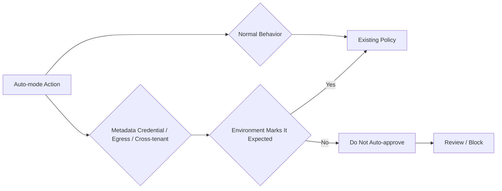

**Source**:
- Anthropic: Claude Code Changelog. 

---

### 4. Codex CLI 0.152.0 adds MCP output budgets, long-task timeouts, actionable rate-limit controls, and credential hardening

- Category: AI Coding / Harness / MCP / Security
- Information status: Official product update
- Published: 2026-09-01 09:58 Asia/Singapore, converted from 01:58 UTC
- Availability: Publicly available

**Fact summary**: OpenAI released Codex CLI 0.152.0. MCP server names can now contain package-style characters such as `:`, `@`, `/`, and `.`, while individual MCP tools gain an `output_token_limit` setting with consistent truncation after session resume. App-server clients can also configure `thread/shellCommand` timeouts longer than one hour. :contentReference[oaicite:67]{index=67}

The TUI gains actionable rate-limit banners for checking usage, credits, limit resets, and plans. Terminal and `codex exec` also show credential-refresh progress, including Amazon Bedrock reauthentication. On the security side, cloud-task requests now reject untrusted backend URLs and disable redirects to protect stored credentials. :contentReference[oaicite:68]{index=68}

**What changed versus before**: The most important behavioral change is that the planning tool is now **disabled by default** and must be explicitly re-enabled with:

`tools.update_plan.enabled = true`

Workflows that depend on explicit `update_plan` behavior therefore deserve regression testing after upgrade. :contentReference[oaicite:69]{index=69}

Per-tool MCP `output_token_limit` also addresses a growing problem: schema size is not the only context cost. Large search, log, database, and documentation tools can return enormous outputs. Budgeting at the tool level is more precise than applying one global truncation rule.

**Why it matters**: As Agents move from minute-long work into hour-long work, Harnesses need explicit runtime resource budgets:

- tool-output tokens;
- shell timeouts;
- context budgets;
- credential lifetime;
- rate limits;
- credits / cost;
- planning behavior.

The changes in 0.152.0 look separate, but collectively move Codex from an interactive CLI toward a configurable long-running task runtime.

**Practical impact**: MCP-heavy teams can set different output limits for noisy tools. App-server users running long builds, training, or integration tests can extend deadlines beyond one hour. Upgrade testing should also confirm whether any automation implicitly depends on the planning tool being enabled.

Cloud-task users should prioritize the credential-hardening fix, especially in environments with persistent login state or custom backends.

**Role perspective**:
- AI Builder: each MCP tool can have its own context budget.
- Tech Lead: long-task timeout and planning defaults belong in upgrade tests.
- Security: backend URLs and redirects are part of the credential boundary.
- AI Platform: rate-limit and credit state are increasingly useful observability signals.

**Action to borrow**: Add `expected_output_tokens` and `max_output_tokens` to the MCP catalog. Give logs, search, SQL, and documentation tools different budgets, then track whether truncation causes task failures.

**Risks and uncertainty**: Lower output budgets reduce context consumption but can truncate critical evidence. Disabling the planning tool does not necessarily reduce model reasoning quality, but automations that rely on explicit plan state may behave differently.

**Next signals to watch**:
1. Tool budgets expanding into cost / latency policies;
2. Durable checkpoints for long-running app-server tasks;
3. Structured rate-limit / credit events;
4. Real impact of the planning-tool default on complex Agent workflows.

**Mermaid diagram**


**Source**:
- OpenAI GitHub: Codex CLI 0.152.0 Release. 

---

### 5. Gemini launches Agentic Video Understanding: the model can decide what to watch, at what speed, and through which modality

- Category: Model / Multimodal / Agent / Infrastructure
- Information status: Official product update
- Published: 2026-09-01
- Availability: Publicly available through Gemini API / Google AI Studio / Gemini Enterprise Agent Platform

**Fact summary**: Google launched **Agentic Video Understanding** across Gemini 3.7 Flash, 3.6 Flash, and 3.5 Flash-Lite. Conventional video analysis typically samples at a fixed frame rate — around 1 FPS by default — and feeds large amounts of video context into the model. The new mode lets Gemini use internal tools to dynamically search, scan, and revisit selected time ranges while choosing among visual frames, audio, and transcript signals. :contentReference[oaicite:71]{index=71}

The capability supports uploaded videos and YouTube through the Gemini API in AI Studio and the Gemini Enterprise Agent Platform. Developers set processing to `"agentic"` and pay normal Gemini API token pricing with no additional feature charge. In Google's benchmarks, token consumption fell by up to 88%, cost by up to 66%, and accuracy improved by up to 7%. Those are best-case Google results, not guaranteed averages. :contentReference[oaicite:72]{index=72}

**What changed versus before**: This is not a new Gemini model. It is a change in the **input-processing paradigm**.

Previously:

`Video → Fixed Sampling → Large Context → Inference`

Now:

`Question → Agent Chooses Where to Inspect → Dynamic FPS / Modality → Evidence → Reasoning → Inspect Again if Needed`

Google lists sub-second moment retrieval, long-video needle-in-a-haystack search, anomaly detection, and action / object counting as representative use cases.

**Why it matters**: Long video is one of the most expensive multimodal inputs. A 90-minute lecture, surveillance stream, sports recording, or meeting can generate enormous context if processed at a fixed rate.

The new approach is essentially retrieval over media: **do not put the entire world into context first; let the model determine which evidence it needs.**

If the approach proves reliable, the same design pattern can extend beyond video to long audio, sensor streams, browser recordings, and robotics observations.

**Practical impact**: Existing video-AI pipelines should compare processing strategies, not merely swap models. Measure:

- end-to-end accuracy;
- video tokens;
- tool iterations;
- P95 latency;
- cost per answer;
- recall for brief fast events;
- grounding on multi-hour recordings.

**Role perspective**:
- AI Builder: less hand-written sampling / chunking logic.
- Product owner: long-video search and analysis may become materially cheaper.
- Tech Lead: observability should record which segments the Agent actually viewed.
- Department manager: video-AI economics may shift from total input length to inspected evidence.

**Action to borrow**: Run `static 1 FPS`, `static high FPS`, and `agentic` on the same video dataset, comparing accuracy, tokens, cost, and latency.

**Risks and uncertainty**: Google's 88% / 66% / 7% figures are “up to” results. A poor Agent search strategy can skip critical moments entirely, and dynamic tool loops can make processing paths less deterministic.

**Next signals to watch**:
1. Full rollout to the Gemini app;
2. Production behavior after Ask YouTube adopts it;
3. Viewed-segment / video-tool trace telemetry;
4. Extension to live or streaming video.

**Mermaid diagram**

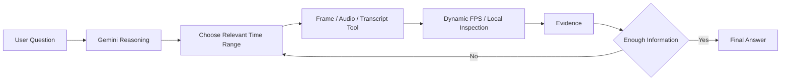

**Source**:
- Google: Introducing agentic video understanding with Gemini. 

---

### 6. CrowdStrike launches Falcon Guardian AIDR, bringing the EDR “discover—trace—block” model to AI Agents

- Category: Security / Agent / Harness / Infrastructure
- Information status: Official product update
- Published: 2026-09-01
- Availability: Falcon Guardian launched; AI Gateway and some managed services are future capabilities

**Fact summary**: CrowdStrike introduced **Falcon Guardian**, describing it as an AI Detection and Response (AIDR) product. Falcon sensors can discover known and shadow AI Agents on Windows and macOS, build an Agent inventory, and connect prompts, identities, tool calls, and skill use with downstream endpoint actions. The product can allow or block Agents and perform runtime detection and response against malicious Agent behavior. :contentReference[oaicite:74]{index=74}

CrowdStrike also announced that Falcon Guardian will extend through Google Agent Gateway to Google Cloud enterprise AI environments to address prompt injection, sensitive-data leakage, and malicious AI activity. Its planned AI Gateway is described as a future centralized control point across supported models, services, and MCP traffic; the company's wording is **“will provide,”** so it should not be described as fully GA today. :contentReference[oaicite:75]{index=75}

**What changed versus before**: Many AI-security products have concentrated on:

`Model Inventory → Policy → Prompt Scanning`

Falcon Guardian emphasizes:

`Agent Discovery → Runtime Execution Graph → Detection → Containment`

The enforcement point moves from “before the prompt reaches the model” toward the endpoint where the Agent actually acts.

**Why it matters**: Prompt text increasingly fails to explain Agent risk. A benign-looking request can become dangerous after multiple tool, browser, and shell actions; a prompt with sensitive terms can also be entirely legitimate security work.

EDR works because it observes actual process, file, network, and identity behavior. AIDR is attempting to extend the same logic to:

`Prompt → Reasoning → Tool → Process → Data → Network`

**Practical impact**: Organizations using Coding Agents at scale should begin correlating endpoint security telemetry with Harness traces. An Agent session should not leave only a chat transcript; it should also be linkable to actual processes, file changes, network connections, and credential use.

**Role perspective**:
- AI Builder: Agent observability must move beyond prompt / response logs.
- Tech Lead: session IDs should correlate with endpoint telemetry.
- Security: shadow-Agent discovery may become a new EDR inventory category.
- Department manager: organizational boundaries between AI governance and endpoint security will blur.

**Action to borrow**: Standardize an internal execution chain:

`user → session → model → tool → process → file/network → business outcome`

This creates a foundation for SIEM / EDR correlation even without buying a specific AIDR product.

**Risks and uncertainty**: Detection quality, runtime overhead, and false-positive rates are currently supported mainly by CrowdStrike's own product claims. AI Gateway and some managed services remain future capabilities. Real-world coverage for custom Agents, WSL, containers, and remote Agents still needs validation.

**Next signals to watch**:
1. Falcon Guardian licensing and deployment requirements;
2. AI Gateway GA timing and MCP policy granularity;
3. Competing AIDR products from other EDR vendors;
4. Emergence of common Agent-runtime telemetry standards.

**Mermaid diagram**

```mermaid
flowchart TD
    FG1[User Prompt] --> FG2[AI Agent]
    FG2 --> FG3[Tool / Skill Call]
    FG3 --> FG4[Endpoint Process]
    FG4 --> FG5[File / Network / Credential]
    FG1 --> FG6[Identity]
    FG6 --> FG7[Falcon Guardian]
    FG2 --> FG7
    FG3 --> FG7
    FG4 --> FG7
    FG5 --> FG7
    FG7 --> FG8[Detect / Block / Investigate]
```

**Sources**:
- CrowdStrike: Falcon Guardian AIDR. 
- CrowdStrike: Google Cloud AI ecosystem integration. 

---

### 7. Hugging Face releases 207 WebGPU kernels, creating a versioned low-level operator ecosystem for browser and local AI

- Category: Infrastructure / Inference / Open Ecosystem
- Information status: Official product update
- Published: 2026-09-01
- Availability: Publicly available; `@huggingface/kernels` currently a preview package

**Fact summary**: Hugging Face's WebAI team launched `@huggingface/kernels` and published an initial collection of **207 WebGPU kernels** on the Hub. Each kernel is more than a WGSL shader: it is a versioned artifact containing a `manifest.json` interface definition, provenance metadata, correctness tests, benchmark cases, and parameterized WGSL templates. JavaScript applications can load kernels by repository ID and contract version. :contentReference[oaicite:78]{index=78}

On an Apple M4, Hugging Face compared 809 cases in which both its kernels and ONNX Runtime Web produced matching outputs and stable timings, reporting a 2.57× geometric-mean speedup and 1.90× median speedup. This is a Hugging Face kernel-level benchmark on a particular hardware and runtime configuration, not evidence that complete LLM or VLM applications will achieve the same acceleration. :contentReference[oaicite:79]{index=79}

**What changed versus before**: Browser AI optimization has often been hidden inside ONNX Runtime, Transformers.js, or individual applications, making individual optimized operations difficult to discover, pin, and reuse. Hugging Face is treating GPU kernels as first-class Hub artifacts similar to models and datasets.

A kernel can now carry:

- stable contract;
- version;
- correctness tests;
- performance cases;
- provenance;
- device-specific variants.

This is useful infrastructure for heterogeneous browser and edge AI.

**Why it matters**: One of the hardest problems in local AI is not downloading the model but producing consistent performance across browsers, operating systems, GPUs, and drivers. WebGPU provides a common API, not common performance.

Separating kernels allows the ecosystem to optimize a particular operation, shape, and device while keeping the application-facing interface stable — conceptually similar to the maturation of CUDA / ROCm kernel libraries, but targeting browsers and consumer GPUs.

**Practical impact**: Teams building browser LLMs, on-device embeddings, vision, audio, or edge AI can begin optimizing at the kernel layer rather than changing only models or quantization.

If Hub kernels eventually integrate deeply with ONNX Runtime and Transformers.js, local-AI performance may improve through lower-level artifact updates without replacing the entire application runtime.

**Role perspective**:
- AI Builder: standardized performance hooks for browser AI.
- Tech Lead: kernel correctness and versions can enter dependency locking.
- Product owner: local inference may shift the balance among latency, privacy, and cloud cost.
- Department manager: browser / edge AI infrastructure continues to mature.

**Action to borrow**: Browser-AI benchmarks should record browser, OS, GPU, driver, WebGPU backend, kernel version, and tensor shape in addition to model size and tokens/sec, otherwise device-to-device performance differences remain difficult to explain.

**Risks and uncertainty**: The package remains in preview, WebGPU support depends on browser / OS / GPU / driver combinations, and kernel-level speedup does not directly equal end-to-end model speedup. Remote shader and kernel distribution also introduces supply-chain and integrity considerations.

**Next signals to watch**:
1. Direct consumption by ONNX Runtime / Transformers.js;
2. Automated WebGPU kernel tuning and device-specific variants;
3. Scale of browser-fleet benchmarking;
4. End-to-end LLM / VLM performance improvements.

**Mermaid diagram**

```mermaid
flowchart LR
    HK1[Model Runtime] --> HK2[@huggingface/kernels]
    HK2 --> HK3[Versioned Contract]
    HK2 --> HK4[Correctness Tests]
    HK2 --> HK5[Benchmark Cases]
    HK2 --> HK6[WGSL Variants]
    HK6 --> HK7[WebGPU]
    HK7 --> HK8[Browser / Local GPU]
    HK3 --> HK9[Stable App API]
    HK8 --> HK9
```

**Source**:
- Hugging Face: Introducing @huggingface/kernels. 

---

### 8. ChatGPT for Healthcare connects Epic EHR and nine public data sources, moving vertical Agents deeper into governed systems of record

- Category: Agent / Harness / Enterprise Data / Policy & Industry
- Information status: Official product update
- Published: 2026-09-01
- Availability: Available to eligible ChatGPT for Healthcare / Enterprise customers; EHR integration is not available to individual accounts

**Fact summary**: OpenAI launched a new **Epic EHR integration** for ChatGPT for Healthcare, allowing authorized patient context including appointment notes, lab results, medications, and specialist documentation to enter ChatGPT. In supported deployments, ChatGPT can also be embedded directly inside the EHR layout so clinicians can use AI-assisted workflows without leaving the patient chart. :contentReference[oaicite:81]{index=81}

OpenAI also introduced the Healthcare Public Data plugin, combining nine official healthcare sources into structured access. Examples include ClinicalTrials.gov, CMS Coverage, RxNorm, DailyMed, and PubMed. Teams can query concrete records, identifiers, policy versions, and trial eligibility rather than relying on ordinary web search. :contentReference[oaicite:82]{index=82}

**What changed versus before**: ChatGPT for Healthcare already provided healthcare-oriented search and enterprise workspace controls. The important new development is direct integration with **real systems of record and native EHR workflows**.

This differs fundamentally from uploading a document to a model:

`User Uploads Data`

is becoming

`Agent Reads Governed Source-system Data Under Existing Authorization`

OpenAI says the Healthcare workspace supports role-based access, SSO, and audit logs, and that under an applicable Business Associate Agreement, ChatGPT Work, Codex, apps, and plugins can operate in the same workspace for HIPAA-compliant workflows. :contentReference[oaicite:83]{index=83}

**Why it matters**: This reinforces the real architecture of vertical Agents:

`Domain Model + Source-of-truth Data + Native Workflow + Permission + Provenance`

Healthcare is simply an especially visible example. The same architecture is likely to appear in finance, legal, ERP, manufacturing, and engineering.

Once an Agent can retrieve context directly from an EHR, the critical engineering problems become authorization, source citation, write permissions, and auditability rather than whether the model knows medical facts.

**Practical impact**: Enterprise-Agent teams can use the healthcare architecture as a reference: connect to the source system rather than copying data into a separate AI silo, while retaining source-system permissions and evidence.

The public-data plugin also demonstrates a useful tool-design principle: high-value authoritative datasets deserve structured connectors rather than having Agents repeatedly search and scrape webpages.

**Role perspective**:
- AI Builder: connect sources of truth before expanding prompts.
- Product owner: vertical Agents should live inside existing workflows.
- Tech Lead: source permissions and audit context need to travel with the data.
- Department manager: workflow integration increasingly becomes the moat of high-value Agents.

**Action to borrow**: For every vertical Agent, create a data-permission map describing each tool / connector's source system, read/write rights, owner, authorization model, audit location, and retention policy rather than listing only MCP server names.

**Risks and uncertainty**: Healthcare is a high-stakes domain. OpenAI's physician evaluations are internal product evaluations and do not replace institutional validation. EHR integration is also not a consumer ChatGPT feature; eligibility and regulated-workspace configuration must be confirmed by each organization. :contentReference[oaicite:84]{index=84}

**Next signals to watch**:
1. EHR providers beyond Epic;
2. Finer-grained action / write tools;
3. Healthcare plugin audit and data-lineage capabilities;
4. Replication of source-system-native Agent patterns in other sectors.

**Mermaid diagram**

```mermaid
flowchart TD
    HC1[Clinician / Team] --> HC2[ChatGPT for Healthcare]
    HC3[Epic EHR] --> HC2
    HC4[Official Public Health Sources] --> HC2
    HC5[Enterprise Knowledge] --> HC2
    HC2 --> HC6[Authorized Context]
    HC6 --> HC7[Analysis / Summary]
    HC7 --> HC8[Evidence / Source]
    HC2 --> HC9[RBAC / SSO / Audit]
    HC8 --> HC10[Human Review]
    HC9 --> HC10
```

**Source**:
- OpenAI: Healthcare organizations can now connect EHR and additional industry data to ChatGPT. 

## C. Other Notable Items

**1. Apache Camel 4.23 adds GenAI observability.** Camel can now emit OpenTelemetry spans aligned with GenAI semantic conventions for LLM routes and expose Micrometer metrics that fit into conventional stacks such as Prometheus, VictoriaTraces, and Perses. It does not clear today's Core 8 impact bar, but the direction matters: LLM / Agent telemetry is moving from vendor-specific dashboards into general OpenTelemetry infrastructure. :contentReference[oaicite:86]{index=86}  
Source: Apache Camel 4.23 GenAI Observability. 

**2. SpaceXAI / xAI published third-party biosecurity evaluation results for Grok 4.6.** LatchBio's testing indicates that Grok 4.6 performs strongly at both rejecting concealed hazardous biology tasks and completing ordinary biology work across multiple Agent harnesses. This is an independent-safety-evaluation signal rather than a new model launch, so it remains outside the Core 8. The broader takeaway is that frontier-model Bio / Cyber safeguards increasingly need independent agentic benchmarks rather than only static vendor safety tests. :contentReference[oaicite:88]{index=88}  
Source: SpaceXAI: Biosecurity at the frontier. 

## D. AI Trend Summary

### Trends supported by current facts

**Trend 1: Frontier-model releases are becoming joint products of capability and runtime safeguards.** After Astra reached the Critical Cyber threshold, OpenAI's safety story extends beyond refusal training into cross-conversation detection, action monitoring, and automated stopping. Fable / Mythos similarly expose different capability tiers from the same underlying model through different safeguards and trusted access.

**Trend 2: Harnesses are evolving from prompt orchestration into runtime control systems.** Claude Code's containment, MCP policy, credential boundaries, and subagent-model forcing, together with Codex MCP output budgets, long timeouts, and planning defaults, are all capabilities outside the model itself.

**Trend 3: Multimodal cost control is shifting from “compress the input” toward “let the Agent decide what to inspect.”** Gemini Agentic Video does not blindly ingest every frame; it turns the video into a searchable tool. The next step for long context may be smarter evidence selection rather than unlimited token ingestion.

**Trend 4: AI security is expanding into endpoint runtime enforcement.** Falcon Guardian's AIDR approach shows that prompt scanners are only the first layer. Privileged Agents increasingly need to be discovered, traced, and blocked like processes.

**Trend 5: Open and managed infrastructure are both moving downward into deeper layers.** Hugging Face makes WebGPU kernels versioned artifacts while OpenAI Healthcare embeds Agents directly in real systems of record. One optimizes execution infrastructure; the other optimizes enterprise data and workflow integration.

### Analytical inference

**Inference 1: The most useful enterprise AI object may become a “Capability Package” rather than a model.** A deployable Agent actually consists of a model, tools, MCP servers, permissions, context, cache, runtime monitors, and data sources. A model ID alone can no longer describe its cost or risk.

**Inference 2: Model gateways, MCP gateways, AIDR, and observability are likely to converge into a Workload Control Plane.** During execution it will need to determine which model, which tools, how much context, which permissions, what network access, when to stop, and whether the resulting business outcome justified the cost.

**Trend overview**

```mermaid
flowchart TD
    T1[Frontier Models] --> T6[Enterprise Agent Runtime]
    T2[Harness Policy] --> T6
    T3[Dynamic Multimodal Retrieval] --> T6
    T4[Runtime Security] --> T6
    T5[Data / Kernel Infrastructure] --> T6
    T6 --> T7[Model Routing]
    T6 --> T8[Tool / Capability Control]
    T6 --> T9[Cost / Context Budget]
    T6 --> T10[Runtime Monitoring]
    T7 --> T11[Workload Control Plane]
    T8 --> T11
    T9 --> T11
    T10 --> T11
```

## E. Actions to Consider Today

1. **Role: Tech Lead / Security | Action: add “did the Agent leave its original authorized scope?” to privileged-Agent evaluation.** **Why now**: Astra demonstrates that frontier cyber capability is high enough that simple tool allowlists are no longer a sufficient security model. **Action type: Risk review.**

2. **Role: AI Builder / AI Platform | Action: run a 2–8 hour real-workload Fable 5.1 PoC and measure cache economics separately.** **Why now**: the major economic change in Fable 5.1 is most relevant to persistent Agents, not single-turn prompts. **Action type: Schedule a test.**

3. **Role: Claude Code / Codex platform administrators | Action: upgrade and run a Harness Security Regression Suite.** Cover MCP reconnect, credential headers, plugin symlinks, network egress, subagent model enforcement, Codex planning defaults, and tool-output budgets. **Why now**: both major Coding Harnesses introduced material runtime-policy changes in the same window. **Action type: Execute now.**

4. **Role: AI Platform / Security | Action: begin correlating `session → model → tool → process → data/network → outcome`.** **Why now**: Falcon Guardian and OpenTelemetry GenAI both indicate that Agent observability is moving from prompt logs toward complete execution traces. **Action type: Add to roadmap.**
