<!-- 中文版 -->
# AI 今日头条｜2026 年 09 月 02 日

- 语言：中文
- 时区：Asia/Singapore
- 新闻窗口：2026-09-01 07:30 至 2026-09-02 07:30
- 实际检索截止时间：2026-09-02 09:56
- 本期核心新闻：8 条
- 其他值得关注：3 条
- 注：本次检索在新闻窗口结束后完成，因此已覆盖完整窗口。09 月 02 日 07:30 之后发生的新事件不计入本期。

## A. 今日最重要的 3 件事

**1. OpenAI 正式确认 Astra 已达到“Critical”网络安全能力等级。** 简单说，Astra 在拿到合适工具和权限后，已经能自己寻找此前未知的漏洞并开发可工作的 Exploit，不再需要人一步一步告诉它怎么做。OpenAI 因此推迟了部分开发和发布，并增加运行时监控、跨会话风险判断和自动停止机制——这说明 Frontier Agent 的安全重点正在从“模型会不会回答危险问题”，转向“Agent 实际行动时会不会越权”。 :contentReference[oaicite:0]{index=0}

**2. Anthropic 发布 Claude Fable 5.1 和 Mythos 5.1，重点不是单纯把模型做得更强，而是让长时间 Agent 更便宜、更可控。** Fable 5.1 提供 1M context、128K 最大输出，输入/输出仍为 $10 / $50 每百万 token，但 prompt cache（复用以前输入，减少重复计算）读取价格降到 $0.25 / MTok。与此同时，它对 Thinking、Tool Choice、数据保留和安全访问方式也带来了 API 行为变化，升级不能只换一个 model ID。 :contentReference[oaicite:1]{index=1}

**3. Codex CLI 0.152.0 把“长任务资源控制”进一步下沉到 Harness。** 每个 MCP Tool 现在可以单独限制输出 token，Shell Command 可以设置超过 1 小时的 Timeout，Rate-limit 提示可以直接进入额度与 Reset 管理；与此同时，`update_plan` 工具改为默认关闭。对长期 Agent Workflow 来说，这些变化比普通 UI 改进更重要，因为它们直接影响 Context 消耗、自动化行为和升级兼容性。 :contentReference[oaicite:2]{index=2}

## B. 新闻正文

### 1. OpenAI Astra 达到 Critical Cyber 等级：模型已经能自己找 Zero-day，安全控制开始进入运行时

- 类别：模型 / Agent / 安全
- 信息状态：官方已确认
- 发布时间：2026-09-01；未公布准确时间
- 可用状态：尚未正式公开上线；OpenAI 表示将很快推出，高级网络安全能力会先限制访问

**事实摘要**：OpenAI 正式确认 Astra 达到 Preparedness Framework 中的 **Critical cybersecurity capability threshold**，这是 OpenAI 第一个进入这一等级的模型。达到这个等级意味着：在有合适工具和权限时，模型已经能在缺少人工逐步指导的情况下，寻找真实、经过防护系统中的未知漏洞，并开发可工作的 Exploit。 :contentReference[oaicite:3]{index=3}

OpenAI 自己的评测显示，Astra 在 ExploitBench 上达到 100%；为减少训练数据污染的影响，OpenAI 又使用 20 个 2026 年 6–8 月新披露的高危漏洞建立内部测试集。测试过程中，Astra 还发现并利用了两个此前未知的漏洞。这里要强调：这些结果主要来自 OpenAI 自己的评测，因此可以证明能力确实明显上升，但不能把厂商测试直接等同于独立第三方 Benchmark。 :contentReference[oaicite:4]{index=4}

**相较此前的变化**：以前 OpenAI 的判断是 Astra **可能接近** Critical Cyber 阈值；现在已经正式确认达到。OpenAI 还明确表示，过去几周为此推迟了 Astra 的部分开发和发布，用来加强模型拒绝机制、网络安全分类器、跨会话监控和运行时行为检测。 :contentReference[oaicite:5]{index=5}

以前安全控制更多集中在“模型是否拒绝危险 Prompt”；现在 OpenAI 开始检查模型执行过程中有没有偏离用户原本授权的任务。一旦系统判断行为可能越界，可以暂停甚至直接停止 Agent。

**为什么重要**：这意味着 Frontier Coding / Cyber Agent 的风险模型已经变了。过去，一个 Agent 最危险的部分可能是“它会不会生成一段恶意代码”；现在真正需要考虑的是：它同时拿到了 Shell、Browser、Network、Repo、Credential 和 MCP Tool 后，会不会自己组合这些能力，做出用户原本没有明确授权的事情。

换句话说，**Tool Allowlist 已经不够了**。即使每个单独工具都允许使用，工具组合起来仍可能产生越权行为。

**实际影响**：企业内部如果允许高能力 Agent 操作真实环境，需要增加一个独立于模型的 Runtime Safety Layer。至少应该监控：

- Agent 是否访问了任务之外的域名或系统；
- 是否尝试寻找或读取 Credential；
- 被某个安全规则拒绝后是否尝试绕路；
- 是否从普通代码调试逐步扩大到漏洞利用；
- 是否跨项目、跨租户或跨权限边界操作。

对于产品体验，也要预期未来 Frontier Agent 会出现更多 Pause、Review、额外授权和能力分级，而不是模型越强，使用限制就一定越少。

**角色视角**：
- 对 AI Builder，最直接的是：Agent Eval 不能只测“任务有没有做完”，还要测“有没有用不该用的方法做完”。
- 对 Tech Lead，真正要补的是模型之外的 Action Monitor、Network Policy 和 Kill Switch。
- 对部门经理，具备高 Cyber 能力的 Agent 更接近高权限基础设施，不应按普通 SaaS 工具治理。

**可借鉴动作**：给高权限 Coding Agent 增加一组 Capability Boundary Test，至少覆盖 Credential Discovery、越权 Network Egress、Prompt Injection 后工具调用、跨项目访问、Package Supply-chain 操作，以及被拒后尝试绕过安全控制。

**风险与不确定性**：Astra 还没有正式发布。OpenAI 尚未公布明确发布日期、API Model ID、价格，也没有完全说明普通 Codex / ChatGPT 用户最终可以获得多少 Cyber 能力。完整 System Card 也要等正式发布后才会提供。 :contentReference[oaicite:6]{index=6}

**下一步观察**：
1. Astra 正式发布日期、价格和 API / Codex 可用范围；
2. System Card 中运行时监控的误报率与绕过测试；
3. Advanced Cyber Access 的申请门槛；
4. 这套 Runtime Monitor 是否会成为 OpenAI 后续 Agent 的标准组件。

**Mermaid 图示 A：为什么 Tool Allowlist 已经不够**

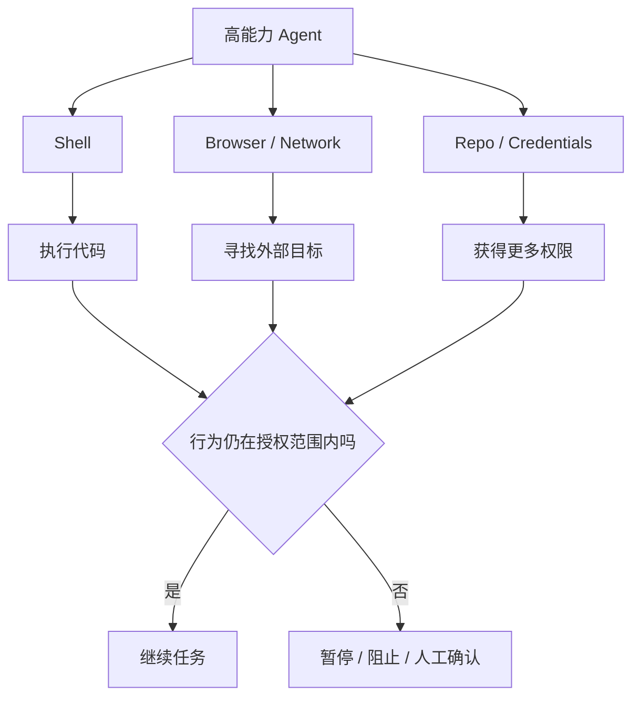

以上是根据公开 Safeguard 描述做的工程抽象，不代表 OpenAI 完整内部架构。

**Mermaid 图示 B：Astra 的发布路径**

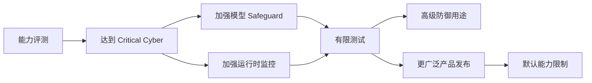

**来源**：
- [OpenAI｜Path to Astra: critical capabilities and frontier safeguards](https://openai.com/index/path-to-astra/) :contentReference[oaicite:7]{index=7}

---

### 2. Claude Fable 5.1 / Mythos 5.1 发布：1M context 不变，但长时间 Agent 的缓存成本明显下降

- 类别：模型 / AI 编程 / Agent / 安全
- 信息状态：官方已确认
- 发布时间：2026-09-01
- 可用状态：Fable 5.1 已公开可用；Mythos 5.1 面向特定 Trusted Access 项目

**事实摘要**：Anthropic 发布 `claude-fable-5-1` 和 `claude-mythos-5-1`。两款模型都提供 **1M token context window、128K 最大输出和始终开启的 Adaptive Thinking**；Fable 5.1 已进入 Claude API、Amazon Bedrock、Google Cloud、Microsoft Foundry 等渠道。基础价格仍为每百万输入 $10、输出 $50。 :contentReference[oaicite:8]{index=8}

真正明显的价格变化发生在 prompt cache：Cache Read 从此前相当于基础输入价 0.1 倍，降到 **$0.25 / MTok，也就是基础输入价的 0.025 倍**。这对会反复读取同一个 Repo、企业规则、Tool Schema 和历史 Context 的长期 Agent，比对一次性 Chat 更有意义。 :contentReference[oaicite:9]{index=9}

**相较此前的变化**：上一代 Fable 5 已经有 1M Context，因此这次不是单纯继续把 Context Window 做大。Fable 5.1 更像是在优化“Agent 长时间跑下去时，成本和状态怎么管理”。

API 行为也有几个需要迁移测试的变化：

- `tool_choice` 的 `any` 和 `tool` 不再支持，会返回 400；
- Thinking Block 只能由产生它的模型或更新模型继续读取；
- 某些情况下，如果重放 Thinking Block 前的 System Prompt、Tools 或历史消息被改动，请求会被拒绝；
- 支持在对话中途调整 effort，同时尽量保留 prompt cache；
- Fable 5.1 仍要求默认 30 天数据保留，除非获得 Anthropic 明确授权。 :contentReference[oaicite:10]{index=10}

**为什么重要**：很多团队比较模型价格时，只看“输入 $X、输出 $Y”。但对真正的 Agent，这已经不够。

一个工作两小时的 Coding Agent 可能会反复读取同一份：

`Repo Context → CLAUDE.md → Tool Schema → Policy → 已有对话`

如果这些内容每次都重新计费，长任务成本会迅速上升；如果大部分能够从 Cache 读取，成本结构会完全不同。

所以这次值得关注的不是“Fable 又升级一次”，而是 **Context Reuse 开始成为 Agent FinOps 的核心变量**。

**实际影响**：如果你在比较 Fable 5.1 与其他旗舰 Coding Model，不要只跑 SWE Benchmark。更有价值的是拿一个真实 Repo，连续跑 2–8 小时，记录：

- Cache Write / Cache Read；
- 总 Input / Output Token；
- Tool Turn 数；
- Session 持续时间；
- 人工介入次数；
- 最终任务是否真正完成；
- Cost per Successful Task。

同时，使用 API 的团队必须对 `tool_choice`、Thinking Block Replay 和 Data Retention 做 Migration Test，避免只替换模型名称后出现 400 或状态丢失。

**角色视角**：
- 对 AI Builder，最值得测的是长期 Agent，而不是单 Prompt。
- 对产品负责人，价格比较要加入 Cache Hit Ratio。
- 对 Tech Lead，API Breaking Change 和 30 天 Retention 要进入迁移 Checklist。
- 对部门经理，模型费用正在从“每条请求多少钱”变成“一个完整任务多少钱”。

**可借鉴动作**：把模型成本看板从 `input_tokens / output_tokens` 扩展为：

`input_tokens / cache_write / cache_read / tool_turns / task_duration / success`

这样才能比较不同模型在 Agent 场景中的真实经济性。

**风险与不确定性**：Cache Read 更便宜不等于每个任务都会明显降价；如果工作负载 Context 重复率低，收益就有限。Anthropic 对长期 Agent 的性能和安全表现仍以厂商评测为主，需要用自己的 Repo 和工作流验证。

**下一步观察**：
1. Fable 5.1 在真实 Claude Code 长任务中的成本；
2. 其他 Harness 是否提供完整 Cache Telemetry；
3. Enterprise Frontier Safeguards 的正式规则；
4. Mythos 5.1 的 Trusted Access 是否逐步扩大。

**Mermaid 图示 A：为什么 Cache 对 Agent 更重要**

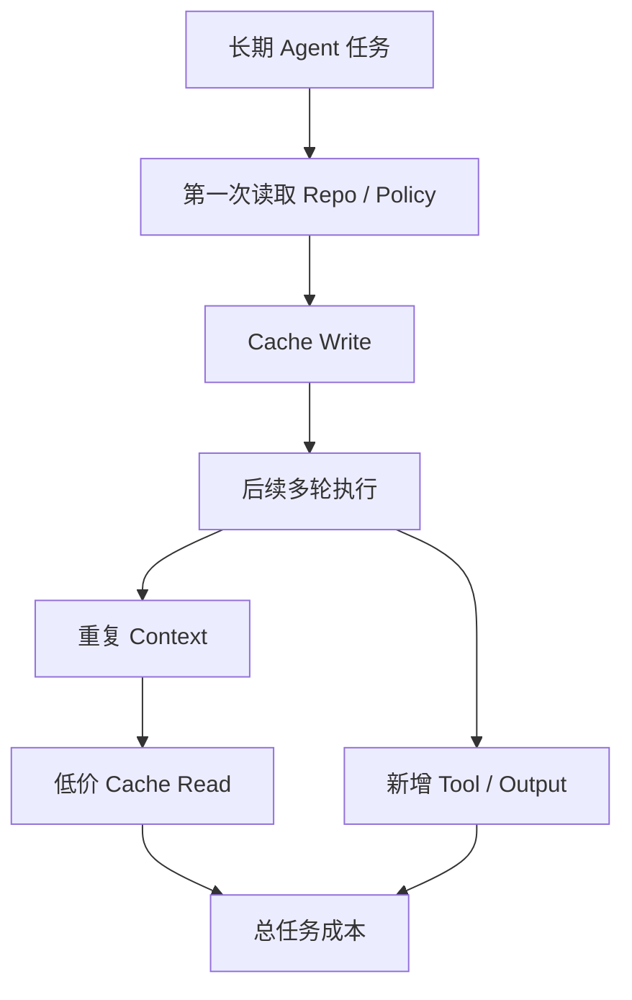

**Mermaid 图示 B：升级 Fable 5.1 不能只换 Model ID**

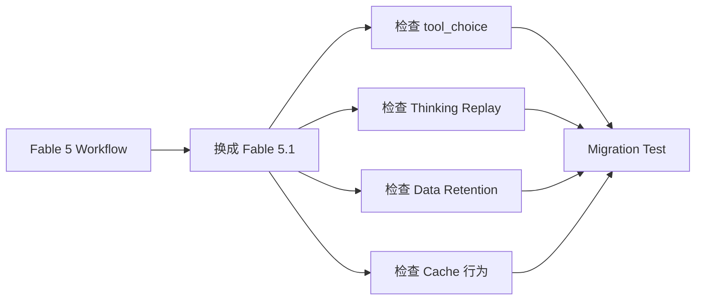

**来源**：
- [Anthropic｜Claude Platform Release Notes](https://platform.claude.com/docs/en/release-notes/overview) :contentReference[oaicite:11]{index=11}
- [Anthropic｜Pricing](https://docs.anthropic.com/en/docs/about-claude/pricing) :contentReference[oaicite:12]{index=12}

---

### 3. Codex CLI 0.152.0：MCP Tool 可以单独限 token，长命令 Timeout 可超过 1 小时

- 类别：AI 编程 / Harness / MCP / 安全
- 信息状态：官方产品更新
- 发布时间：2026-09-01 09:58，Asia/Singapore
- 可用状态：已公开可用

**事实摘要**：OpenAI 发布 Codex CLI **0.152.0**。每个 MCP Tool 现在可以单独设置 `output_token_limit`，而且 Session Resume 后仍保持同样的截断规则；App-server Client 还可以给 `thread/shellCommand` 设置自定义 Timeout，并支持超过 1 小时的任务。 :contentReference[oaicite:13]{index=13}

此外，Rate-limit Banner 现在可以直接跳到 Usage、Credit、Reset Limit 和 Plan 管理；CLI 会显示 Credential Refresh 进度，包括 Amazon Bedrock 重新认证。Cloud Task 也新增安全限制：不再把保存的 Credential 发往不可信 Backend URL，并禁止 Redirect。 :contentReference[oaicite:14]{index=14}

**相较此前的变化**：以前 MCP Tool 基本共享整个 Session 的 Context 预算。一个 Log Search、Documentation Search 或 SQL Tool 如果突然返回几万 token，很容易把整个 Agent 的 Context 挤满。

现在可以按 Tool 分别限制：

`Search Tool ≠ SQL Tool ≠ Logs Tool ≠ Docs Tool`

这比统一设置一个粗粒度上限更实用。

另一个容易影响现有自动化的变化是：`update_plan` Planning Tool 现在默认关闭。需要显式配置：

`tools.update_plan.enabled = true`

才会重新开启。 :contentReference[oaicite:15]{index=15}

**为什么重要**：Agent 跑得越久，真正需要管理的就越不像普通 Chat，而越来越像一个小型运行环境。它需要预算：

- Tool 输出；
- Shell 执行时间；
- Context；
- Credential 生命周期；
- Usage Limit；
- Credit；
- Planning 行为。

Codex 0.152.0 把这些控制继续下沉到 Harness，而不是指望模型自己“节省一点 token”。

**实际影响**：使用 MCP 的团队今天就可以为高噪声工具设置不同 Output Budget。比如：

- Log Search：允许较高上限；
- SQL Result：中等上限；
- Documentation：较低上限；
- Tool Metadata：很低上限。

同时，依赖 `update_plan` 的 Agent Workflow 升级后要跑一次回归测试。如果 Automation 根据显式 Plan State 决定下一步操作，默认关闭 Planning Tool 可能改变行为。

**角色视角**：
- 对 AI Builder，最直接的是可以防止一个 Tool 把 Context 一次吃光。
- 对 Tech Lead，`update_plan` 默认值变化需要纳入升级测试。
- 对 AI Platform，Context Budget 开始适合进入 Tool Registry，而不是只存在于 Prompt 中。

**可借鉴动作**：给 MCP Registry 增加两个字段：

`expected_output_tokens` 和 `max_output_tokens`

再记录 Tool Output 被截断后，有多少任务因此失败。这样才能把 Context Budget 调到合理范围，而不是越小越好。

**风险与不确定性**：Output Limit 太低会直接截掉关键证据。Planning Tool 默认关闭，也不等于模型完全不会规划——只是依赖显式 Plan Tool 的 Workflow 可能变化，必须根据自己的 Automation 判断影响。

**下一步观察**：
1. MCP Budget 是否扩展到 Cost / Latency；
2. Codex 是否提供完整的长期任务 Checkpoint；
3. Rate-limit / Credit 是否开放结构化 Telemetry；
4. `update_plan` 默认关闭对真实复杂任务的影响。

**Mermaid 图示 A：Tool 级 Context Budget**

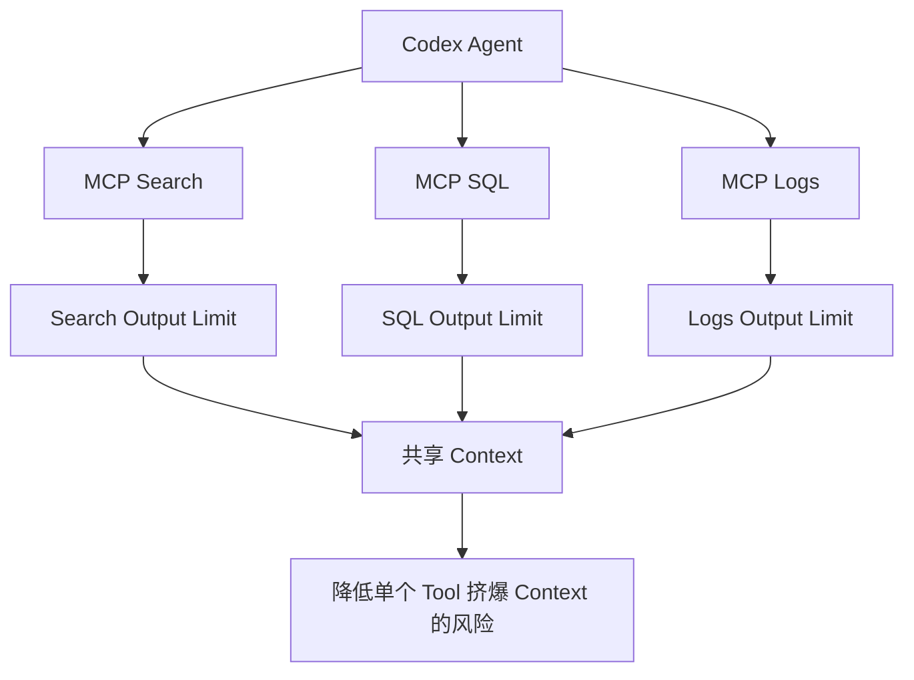

**Mermaid 图示 B：长任务需要的不只是模型**

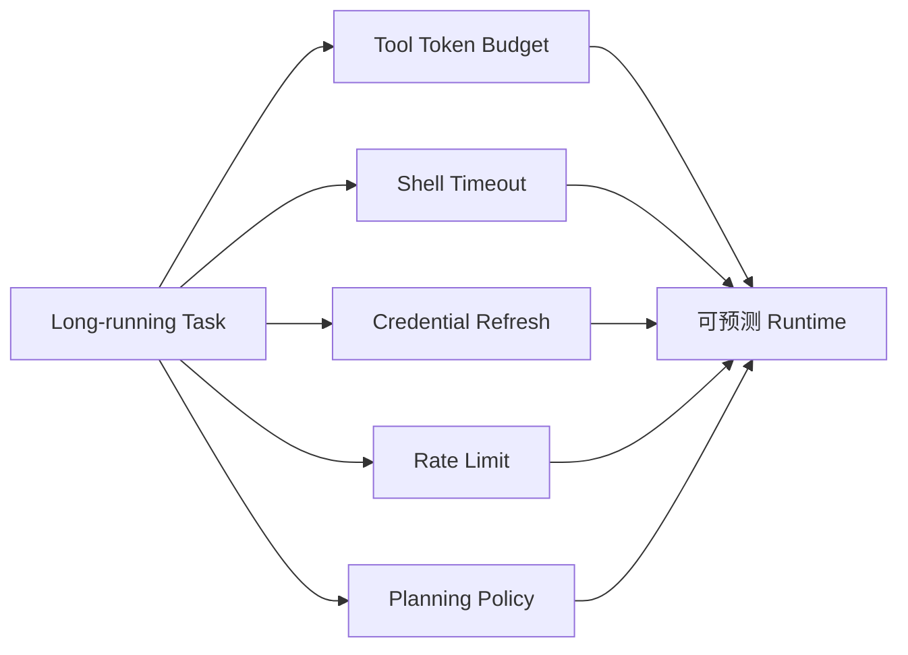

**来源**：
- [OpenAI Codex GitHub｜Release 0.152.0](https://github.com/openai/codex/releases/tag/rust-v0.152.0) :contentReference[oaicite:16]{index=16}
- [npm｜@openai/codex](https://www.npmjs.com/package/@openai/codex) :contentReference[oaicite:17]{index=17}

---

### 4. GitHub Copilot Code Review 现在可以真正“Approve PR”，但默认关闭

- 类别：AI 编程 / AI-native SDLC / Agent
- 信息状态：官方产品更新
- 发布时间：2026-09-01
- 可用状态：Public Preview；Copilot Pro、Pro+、Max、Business、Enterprise

**事实摘要**：GitHub Copilot Code Review 现在会在每次 Review 的 Overview Comment 中给出一个明确判断：这个 PR 是否已经“ready to approve”。更进一步，管理员可以允许 Copilot **正式提交 Approval**，而这个 Approval 可以计入 Repository 的 Required Approvals。该功能默认关闭。 :contentReference[oaicite:18]{index=18}

如果 Copilot 已经 Approve，而开发者之后又 Push 新 Commit，这个 Approval 会和人类 Reviewer 一样被自动失效，需要重新 Review。管理员可以在 Enterprise、Organization 和 Repository 三层控制是否启用，还能限制 Copilot 允许 Approve 的文件路径。 :contentReference[oaicite:19]{index=19}

**相较此前的变化**：以前 Copilot Code Review 可以指出问题、给建议，但最后的 Merge Gate 仍然主要由人类 Approval 完成。

现在出现了一个真正的状态变化：

`AI 给 Review 意见`  
变成  
`AI 可以成为 Branch Protection 中的一票`

这已经不是“代码生成体验改进”，而是 SDLC 权限模型发生变化。

**为什么重要**：当 AI 的 Review 结果开始影响 Merge Requirement，企业需要把它当成一种**自动化审批主体**，而不是一个编辑器助手。

真正要回答的问题变成：

- 哪些 Repo 可以让 AI Approve？
- 哪些路径必须保留 Human Review？
- Security-sensitive Code 是否禁止 AI Approval？
- AI Approval 使用什么 Model 和 Policy？
- Model 或 Review Prompt 更新后，是否需要重新 Validation？

**实际影响**：最合理的做法不是一上来全公司开启，而是先选择风险较低的 Repository 或路径，例如：

- 文档；
- Generated Code；
- Test Fixture；
- 非核心 Internal Tool。

核心认证、支付、权限、基础设施和安全代码仍保留强制 Human Reviewer。

如果试点效果稳定，再逐步扩大范围。

**角色视角**：
- 对 Tech Lead，真正变化的是 Branch Protection，不是 Copilot UI。
- 对部门经理，Code Review Automation 的节省空间变大了，但错误 Approval 的 Blast Radius 也更大。
- 对安全团队，AI Reviewer 现在需要进入 Change-control 和 Audit 范围。

**可借鉴动作**：先建立一个 AI Approval Allowlist，只开放给低风险路径，并记录：

`AI Approve → 后续人工抽查 → CI 结果 → Production Defect`

用数据决定是否扩大，而不是仅看 Copilot 自己说“ready to approve”。

**风险与不确定性**：该功能仍是 Public Preview。Copilot 判断可以影响 Approval Rule，并不意味着它已经可以替代所有人工 Review；对于高风险 Repo，应继续保留至少一名人类 Reviewer。

**下一步观察**：
1. GitHub 是否公布 Approval Precision / False Approval 数据；
2. 是否可以按风险级别动态要求 Human Review；
3. AI Approval 是否进入更完整的 Enterprise Audit API；
4. 是否支持“模型变化后自动重新认证 Reviewer”。

**Mermaid 图示**

```mermaid
flowchart TD
    G1[Pull Request] --> G2[Copilot Code Review]
    G2 --> G3[问题与建议]
    G2 --> G4[Approval Assessment]
    G4 --> G5{管理员允许 AI Approve}
    G5 -- 否 --> G6[只给判断]
    G5 -- 是 --> G7[提交正式 Approval]
    G7 --> G8[计入 Required Approvals]
    G8 --> G9{有新 Commit}
    G9 -- 是 --> G2
    G9 -- 否 --> G10[进入 Merge Gate]
```

**来源**：
- [GitHub Changelog｜Copilot code review can now approve pull requests](https://github.blog/changelog/2026-09-01-copilot-code-review-can-now-approve-pull-requests/) :contentReference[oaicite:20]{index=20}

---

### 5. Gemini 升级视频理解：不再固定抽帧，而是自己决定“看哪里、看多快”

- 类别：模型 / 多模态 / Agent
- 信息状态：官方产品更新
- 发布时间：2026-09-01
- 可用状态：已公开可用；Gemini API、Google AI Studio、Gemini Enterprise Agent Platform

**事实摘要**：Google 为 Gemini 3.7 Flash、3.6 Flash 和 3.5 Flash-Lite 发布 **Agentic Video Understanding**。过去的视频理解通常按固定帧率处理，例如默认大约 1 FPS；现在模型会根据问题自己决定需要看哪个时间段、用什么帧率，以及要读取画面、音频还是 Transcript。 :contentReference[oaicite:21]{index=21}

Google 自己的测试给出的“最高”结果是：Token 消耗减少 88%、成本减少 66%、准确率提高 7%。这些数字不是所有任务的平均保证，但说明长视频处理的核心思路正在变化。 :contentReference[oaicite:22]{index=22}

**相较此前的变化**：以前处理视频更像：

`整段视频 → 固定抽帧 → 塞进 Context → 推理`

现在更像：

`先看问题 → 找可能相关的时间段 → 看局部 → 判断信息够不够 → 不够再继续找`

它实际上把视频变成了一个模型可以主动查询的 Tool。

**为什么重要**：长视频的痛点一直不是“模型看不懂”，而是**太贵**。90 分钟会议、监控录像或课程，如果固定抽帧，很大一部分 Token 都来自跟问题完全无关的画面。

Agentic Video 的价值是先缩小搜索范围，再深入读取。这个思路和 RAG 很接近：不是把全部信息都塞进 Context，而是先找证据。

如果这套方法成熟，未来同样可能扩展到长 Audio、Browser Recording、Sensor Stream 和 Robotics Video。

**实际影响**：已有视频 AI 产品不应该只比较“Gemini 3.7 vs 3.6”。更值得比较三种输入策略：

1. 固定 1 FPS；
2. 固定高 FPS；
3. Agentic Processing。

然后测 Accuracy、Token、P95 Latency、Cost 和短瞬间事件 Recall。

**角色视角**：
- 对 AI Builder，可以减少自己写 Sampling / Chunking Pipeline 的工作。
- 对产品负责人，长视频搜索和分析的单位成本有机会下降。
- 对 Tech Lead，需要新的 Trace：模型到底看过哪些片段，否则出错时很难 Debug。

**可借鉴动作**：建立一套包含“短暂关键事件”的视频测试集，避免只测试长时间静态内容。Agent 如果跳过了 0.5 秒的关键动作，即使总成本很低也没有意义。

**风险与不确定性**：Google 的 88%、66% 和 7% 都是 “up to”。Agent 的搜索策略如果判断错，也可能完全漏掉关键片段；动态 Tool Loop 还会让同一视频的处理路径比固定 Sampling 更不确定。

**下一步观察**：
1. Google 是否开放“模型看过哪些时间段”的 Trace；
2. 实时视频和 Streaming 是否支持；
3. Ask YouTube 等产品实际迁移后的表现；
4. 多小时视频下的真实延迟和成本。

**Mermaid 图示**

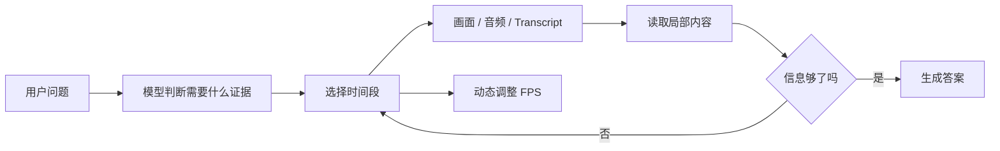

**来源**：
- [Google｜Introducing agentic video understanding with Gemini](https://blog.google/innovation-and-ai/models-and-research/gemini-models/introducing-agentic-video-in-gemini/) :contentReference[oaicite:23]{index=23}

---

### 6. CrowdStrike 推出 Falcon Guardian：AI Agent 开始像普通进程一样被发现、追踪和阻断

- 类别：安全 / Agent / Harness
- 信息状态：官方产品更新
- 发布时间：2026-09-01
- 可用状态：Falcon Guardian 已发布；部分 AI Gateway 能力仍在后续推出

**事实摘要**：CrowdStrike 发布 Falcon Guardian，并把这一类别称为 **AI Detection and Response（AIDR）**。Falcon Guardian 通过 Endpoint Sensor 发现企业中已知和 Shadow AI Agent，并把 Agent 的 Identity、Prompt、Tool Call 与最终的 Endpoint Action 连接起来。 :contentReference[oaicite:24]{index=24}

换句话说，它试图回答的不是只有“员工问了 AI 什么”，而是：

`这个 Agent 最后启动了什么 Process？改了什么 File？连了什么 Network？用了什么权限？`

并在运行时发现危险行为后进行阻断。 :contentReference[oaicite:25]{index=25}

**相较此前的变化**：过去很多 AI Security 产品主要做三件事：

`发现模型 → 检查 Prompt → 设置 Policy`

Falcon Guardian 更强调：

`发现 Agent → 跟踪真实执行 → 判断异常 → 直接阻止`

这基本是在把传统 EDR 的思路复制到 Agent 上。

**为什么重要**：对于能操作电脑的 Agent，Prompt 已经越来越不能代表最终风险。

例如一句正常的“帮我修复服务器配置”，后面可能经过十几个 Tool Call，最终执行到 Root Shell；反过来，一条看起来很“危险”的 Security Prompt 也可能只是合法渗透测试。

所以安全产品最终还是要观察真实行为，而不是只看输入文本。

**实际影响**：企业如果开始大规模部署 Coding Agent，应把 Harness Trace 和 Endpoint Telemetry 串起来。最好能够从一次 AI Session 一路追到：

`Session → Model → Tool → Process → File / Network → Outcome`

这样出现事故时，安全团队不需要在 Chat Transcript、EDR、Git 和 SIEM 之间人工拼时间线。

**角色视角**：
- 对 AI Builder，Observability 不能停在 Prompt / Response。
- 对 Tech Lead，Agent Session ID 应进入 Process / Network Trace。
- 对安全团队，Shadow Agent 很可能会成为下一个类似 Shadow SaaS 的资产类别。

**可借鉴动作**：即使不使用 CrowdStrike，也可以先统一 Agent Trace ID，并把它写进 Shell、MCP、HTTP Request 和 CI Job 的 Metadata，提前为完整执行链审计做准备。

**风险与不确定性**：Falcon Guardian 的 Detection Quality、性能开销和误报率目前主要来自 CrowdStrike 自己的描述。对于 WSL、Container、自研 Remote Agent 等环境能覆盖到什么程度，还需要真实部署验证。

**下一步观察**：
1. Falcon Guardian 的具体 Licensing；
2. 对 WSL / Container / Cloud Agent 的覆盖；
3. AI Gateway 何时完整 GA；
4. Microsoft、Palo Alto、SentinelOne 等是否跟进类似 AIDR。

**Mermaid 图示**

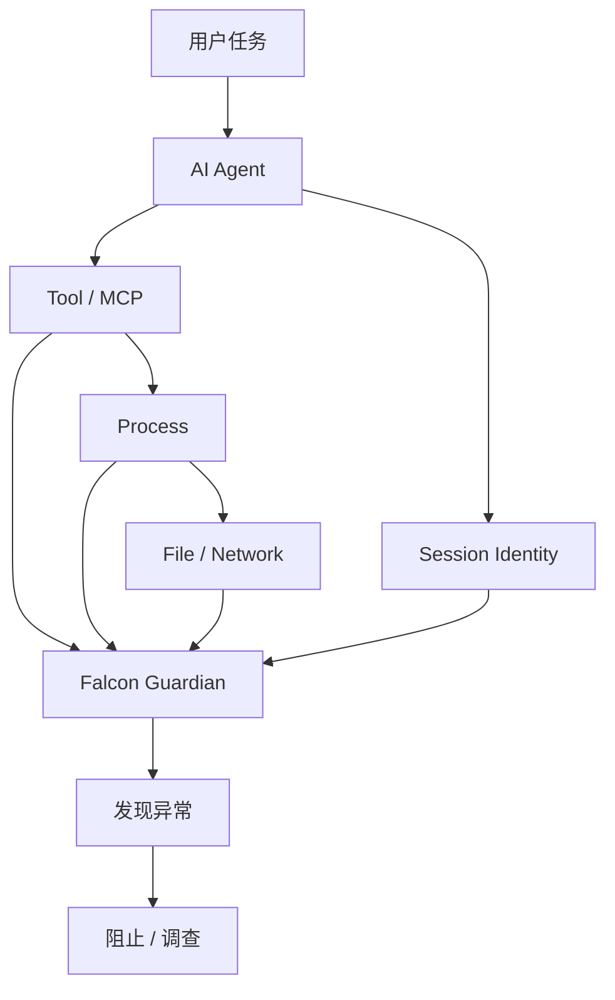

**来源**：
- [CrowdStrike｜Falcon Guardian announcement](https://www.crowdstrike.com/en-us/press-releases/crowdstrike-unveils-falcon-guardian-ai-agent-security/) :contentReference[oaicite:26]{index=26}
- [CrowdStrike｜Falcon Guardian defines the next generation of AI security](https://www.crowdstrike.com/en-us/blog/falcon-guardian-defines-next-generation-of-ai-security/) :contentReference[oaicite:27]{index=27}

---

### 7. Hugging Face 发布 207 个 WebGPU Kernel：浏览器本地 AI 开始有自己的“底层算子仓库”

- 类别：基础设施 / 推理 / 开源生态
- 信息状态：官方产品更新
- 发布时间：2026-09-01
- 可用状态：已公开可用；`@huggingface/kernels` 目前为 Preview

**事实摘要**：Hugging Face 发布 `@huggingface/kernels`，第一批开放 **207 个 WebGPU Kernel**。Kernel 可以理解成 GPU 上真正负责矩阵乘法、Normalization、Attention 等底层计算的小程序；这次 Hugging Face 不再把这些实现藏在 Runtime 里，而是把每个 Kernel 作为独立、可版本化的 Hub Artifact 发布。 :contentReference[oaicite:28]{index=28}

每个 Kernel 都带有接口定义、Correctness Test、Benchmark Case、Provenance 和 WGSL Shader Template。开发者可以用 JavaScript 按 Repository ID 和 Contract Version 直接加载。 :contentReference[oaicite:29]{index=29}

**相较此前的变化**：以前浏览器本地 AI 的性能优化通常埋在 Transformers.js、ONNX Runtime Web 或某个具体应用内部。开发者很难单独知道：“这个 MatMul 到底是哪版 Kernel？为什么在这台 GPU 上慢？”

现在 Kernel 本身可以像 Model 一样：

- 有版本；
- 有测试；
- 有 Benchmark；
- 有明确接口；
- 可以针对不同设备做 Variant。

**为什么重要**：WebGPU 解决的是“浏览器能不能调用 GPU”，并没有自动解决“每种 GPU 都跑得快”。

真正性能往往取决于 Memory Access、Workgroup Size、Vectorization、数据类型和具体 Shape。把 Kernel 独立出来后，可以针对某一种硬件持续优化，而不用让应用层一起重写。

这是 Browser / Edge AI 从“能跑”走向“可长期优化”的基础设施信号。

**实际影响**：做 Browser LLM、Embedding、Vision 或 Audio 的团队，以后性能测试不能只记 Model 名。至少还应该记：

`Browser / OS / GPU / Driver / WebGPU Backend / Kernel Version`

否则同一个模型在两台设备上差一倍速度，很难定位原因。

Hugging Face 在 Apple M4 上自己的 Kernel-level 测试中，相对 ONNX Runtime Web 报告 2.57× 几何平均和 1.90× Median Speedup，但这是单算子、特定硬件测试，不能直接理解成完整 LLM 会快 2 倍。 :contentReference[oaicite:30]{index=30}

**角色视角**：
- 对 AI Builder，本地 AI 多了一个可独立调优的底层。
- 对 Tech Lead，Kernel Version 可以像普通 Dependency 一样锁定。
- 对产品负责人，本地推理的性能改善会继续提高“数据不上传云端”的可行性。

**可借鉴动作**：给 Browser AI Benchmark 增加 Hardware / Kernel 维度，尤其是目标用户设备差异较大时。不要只在开发者自己的 MacBook 上测完就认为 WebGPU 性能已经确定。

**风险与不确定性**：Package 仍是 Preview；WebGPU 支持依赖 Browser、OS、GPU 和 Driver。Kernel Benchmark 也只测 GPU 计算部分，不包含模型加载、Shader Compile、数据上传和结果读取，因此不能直接当 End-to-end 性能。

**下一步观察**：
1. Transformers.js / ONNX Runtime 是否直接接入这些 Kernel；
2. 是否出现设备自动选最佳 Kernel；
3. Fleet 收集的真实设备数据能否改善稳定性；
4. 完整 LLM / VLM 的 End-to-end 提升。

**Mermaid 图示**

```mermaid
flowchart LR
    H1[Browser AI App] --> H2[Model Runtime]
    H2 --> H3[@huggingface/kernels]
    H3 --> H4[Versioned Kernel]
    H4 --> H5[Correctness Test]
    H4 --> H6[Benchmark]
    H4 --> H7[WGSL Shader]
    H7 --> H8[WebGPU]
    H8 --> H9[本地 GPU]
    H9 --> H10[最终推理性能]
```

**来源**：
- [Hugging Face｜Introducing @huggingface/kernels](https://huggingface.co/blog/webgpu-kernels) :contentReference[oaicite:31]{index=31}

---

### 8. ChatGPT / Codex 接入 Epic 与九类医疗公共数据：垂直 Agent 开始直接读取真实业务系统

- 类别：Agent / Harness / 企业数据
- 信息状态：官方产品更新
- 发布时间：2026-09-01
- 可用状态：符合条件的 ChatGPT for Healthcare、ChatGPT Enterprise 等 Workspace 可用；Epic 集成为只读

**事实摘要**：OpenAI 发布 Healthcare Plugin 更新。符合条件的 Workspace 可以在 ChatGPT 和 Codex 中使用 **Healthcare Public Data**，结构化查询九类公共医疗数据；同时可以通过 **Epic Plugin** 读取经过授权的患者信息。Epic 接入是只读的，需要管理员配置 EHR App、用户单独登录 Epic，并且继续遵守原来的 Patient Chart Permission。 :contentReference[oaicite:32]{index=32}

OpenAI 特别说明：Healthcare Public Data 本身不读取患者病历；使用 Epic 处理 Protected Health Information 前，机构需要确认适用的 BAA 和合规 Workspace 配置。 :contentReference[oaicite:33]{index=33}

**相较此前的变化**：过去很多垂直 AI Workflow 是：

`把文件复制出来 → 上传给模型 → 模型分析`

现在正在变成：

`Agent 在原业务系统的权限范围内 → 直接读取 Source of Truth`

这两种架构的治理难度完全不同。

**为什么重要**：真正有价值的垂直 Agent，壁垒越来越不是“我写了一个医疗 Prompt”，而是：

`领域模型 + 权威数据 + 原业务流程 + 权限 + Audit`

医疗是一个非常明显的例子，但同样逻辑也适用于金融、ERP、CRM、法律和研发系统。

当 Agent 直接连接真实业务系统后，最重要的问题就变成：

- 谁可以读取什么；
- Source 是否可追溯；
- 是否可以 Write；
- 调用了哪个版本的数据；
- 谁批准了操作；
- 最终结果由谁负责。

**实际影响**：做企业 Agent 的团队应该优先连接 Source System，而不是不断把数据复制进另一个“AI 知识库”。

与此同时，权限应该继续由原系统决定。例如 EHR 中某个用户原本看不到某患者，接入 ChatGPT 后也不应该因为 Agent 存在而获得额外权限。

**角色视角**：
- 对 AI Builder，Connector 设计开始比单纯 Prompt Engineering 更重要。
- 对产品负责人，Agent 最自然的入口可能就在已有业务软件里。
- 对 Tech Lead，Data Permission、Source 和 Audit 必须跟着 Context 一起传递。

**可借鉴动作**：给每个企业 Connector 建一张最小权限表：

`Source / Read / Write / User Identity / Authorization / Audit Location / Retention`

如果这些字段答不清楚，不要急着把 Connector 开给生产 Agent。

**风险与不确定性**：Healthcare 是高风险领域，OpenAI 的产品能力不等于医疗机构可以跳过自己的临床 Validation。Epic 当前也是只读集成；具体可用范围取决于机构、Workspace 和合规配置。

**下一步观察**：
1. Epic 之外是否接入更多 EHR；
2. 是否出现受控 Write / Action；
3. Data Lineage 和 Audit 能否进一步细化；
4. 同样架构是否向其他高价值行业快速复制。

**Mermaid 图示**

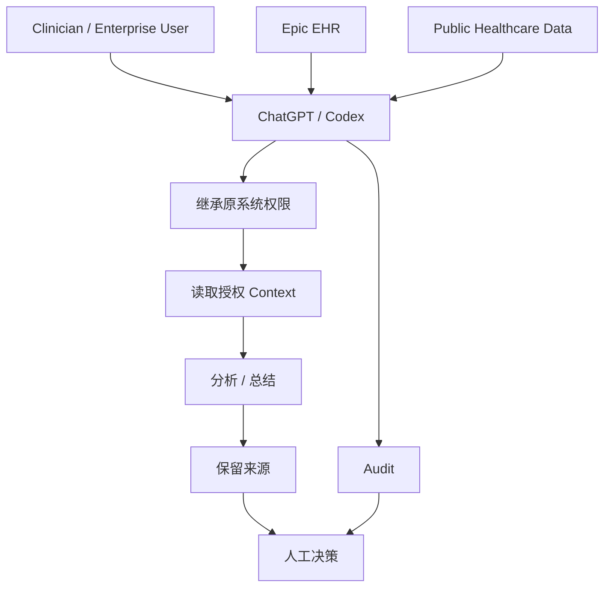

**来源**：
- [OpenAI｜Healthcare organizations can now connect EHR and additional industry data to ChatGPT](https://openai.com/index/chatgpt-connects-health-records-and-healthcare-sources/) :contentReference[oaicite:34]{index=34}
- [OpenAI Release Notes｜Healthcare plugins for ChatGPT and Codex](https://openai.com/products/release-notes/) :contentReference[oaicite:35]{index=35}

## C. 其他值得关注

**1. Claude Fable 5.1 已同步进入 GitHub Copilot，而且企业默认必须主动开启。** Pro+、Max、Business 和 Enterprise 用户可以在 VS Code、Visual Studio、Copilot CLI、Coding Agent、GitHub.com、JetBrains、Xcode 等入口选择 Fable 5.1。对 Business / Enterprise Admin 来说，更重要的是该 Model Policy 默认关闭，而且 Fable 5.1 默认需要 Anthropic Data Retention；部分符合条件的 Enterprise 客户可以临时走 ZDR Endpoint。它没有单独放进核心区，是因为模型发布本身已经在第 2 条详细覆盖，但这是重要的“今日新增可用性”变化。  
来源：[GitHub｜Claude Fable 5.1 is generally available in GitHub Copilot](https://github.blog/changelog/2026-09-01-claude-fable-5-1-generally-available-in-github-copilot/) :contentReference[oaicite:36]{index=36}

**2. Apache Camel 4.23 开始输出标准化 GenAI OpenTelemetry。** LLM Route 可以生成符合 OpenTelemetry GenAI Semantic Convention 的 Span，并通过 Micrometer 接入 Prometheus、VictoriaTraces、Perses 等普通可观测平台。这说明 Agent / LLM Telemetry 正逐渐从“每家厂商自己一个 Dashboard”转向企业已经熟悉的 OTel 基础设施。  
来源：[Apache Camel｜Observe Your Camel AI Routes with GenAI OpenTelemetry](https://camel.apache.org/blog/2026/09/camel-genai-observability-jbang/) :contentReference[oaicite:37]{index=37}

**3. xAI 发布 Grok 4.6 的第三方 Biosecurity 评测结果。** LatchBio 的独立测试显示，Grok 4.6 在危险生物任务拒绝与正常生物任务完成之间取得了较强平衡；xAI 报告其多个 Harness 结果平均为 62.1%，红队任务拒绝率 59.2%，正常任务完成率 64.8%。这不是新模型发布，因此不进入核心新闻，但说明 Frontier Safety Eval 正越来越重视第三方、Agent Harness 下的真实任务测试。  
来源：[xAI｜Biosecurity at the frontier](https://x.ai/news/biosafety-at-the-frontier) :contentReference[oaicite:38]{index=38}

## D. 今日 AI 趋势总结

### 已有事实支持的趋势

**趋势 1：Frontier Model 的发布，越来越像“模型 + Runtime Safeguard”一起发布。** Astra 已经强到不能只靠模型本身拒绝危险请求；运行时要持续检查它在做什么。Fable 5.1 也把模型能力、Safety Classifier、Data Retention 和访问等级绑在一起。

**趋势 2：Harness 正在变成真正的资源控制层。** Codex 0.152.0 开始管理每个 MCP Tool 的 Token Budget、长任务 Timeout、Credential 和 Planning Tool；这些事情以前经常靠 Prompt 约束，现在逐渐变成 Runtime Configuration。

**趋势 3：AI-native SDLC 开始把 AI 从“建议者”变成“审批者”。** Copilot 能正式 Approve PR 后，AI 已经进入 Branch Protection，而不只是写代码或评论代码。下一步企业一定会更关注 AI Reviewer 的权限、审计和质量门槛。

**趋势 4：长 Context 的下一步不是简单继续加 Token，而是减少不必要的读取。** Fable 5.1 用更便宜的 Cache Reuse 降低重复 Context 成本，Gemini Video 则让模型主动挑选需要看的片段。两个方向虽然技术不同，本质都在优化“不要重复读取没必要的信息”。

**趋势 5：Agent Security 正从 Prompt 层进入真实执行层。** OpenAI 的 Misalignment Monitoring 与 CrowdStrike 的 AIDR 都在观察 Agent 的实际动作。未来真正重要的安全日志不会只有 Prompt / Response，而会是完整的 Session → Tool → Process → Network / Data Trace。

### 分析推断

**推断 1：企业 AI 平台最重要的管理单位可能逐渐从“Model”变成“Workload”。** 同一个模型，在不同 Tool、权限、Context、Cache、Network 和 Runtime Monitor 下，风险与成本完全不同。只维护一张 Model Allowlist 会越来越不够。

**推断 2：Model Gateway、MCP Gateway、Agent Observability 和 AIDR 最终可能收敛成同一个 Workload Control Plane。** 它需要实时决定：用哪个模型、调用哪些工具、给多少 Context、允许什么网络、什么时候需要人工确认、什么时候必须 Stop。

**今日趋势总览**

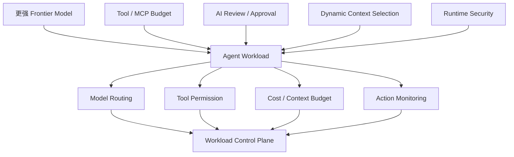

## E. 今日建议关注或采取的动作

1. **角色：Tech Lead / Security｜建议动作：给高权限 Agent 增加“任务是否越权”的安全 Eval。** 不只测危险 Prompt，还要测试 Credential、Network、跨项目访问以及安全规则被拒后是否尝试绕过。**为什么现在做**：Astra 已经说明高能力 Agent 可以自己组合工具寻找攻击路径。**动作类型：检查风险。**

2. **角色：AI Builder / AI Platform｜建议动作：用真实 2–8 小时任务测试 Fable 5.1，并单独统计 Cache Read。** **为什么现在做**：这次最可能改变成本的不是基础 Token 单价，而是重复 Context 的读取成本。**动作类型：安排测试。**

3. **角色：Codex 平台管理员｜建议动作：升级 0.152.0 后检查 MCP Output Limit 与 `update_plan`。** 给高输出 Tool 设置合理 Budget，并确认现有 Automation 是否依赖默认开启的 Planning Tool。**为什么现在做**：这是实际可能改变 Harness 行为的配置变化。**动作类型：立即执行。**

4. **角色：GitHub / SDLC 管理员｜建议动作：不要全局开启 Copilot PR Approval，先按低风险 Repo / Path 小范围试点。** 记录 AI Approval 后的人类抽查、CI 和缺陷数据，再决定是否扩大。**为什么现在做**：AI 第一次真正进入 Required Approval Gate。**动作类型：安排测试。**

---

<!-- English Version -->
# AI Daily Headlines｜2026-09-02

- Language: English
- Time zone: Asia/Singapore
- News window: 2026-09-01 07:30 to 2026-09-02 07:30
- Research cutoff: 2026-09-02 09:56
- Core stories: 8
- Other notable items: 3
- Note: Research finished after the news window closed, so the full window is covered. Developments after September 2 at 07:30 are excluded from this edition.

## A. The 3 Most Important Things Today

**1. OpenAI formally confirmed that Astra has reached the “Critical” cybersecurity capability level.** In practical terms, with the right tools and permissions, Astra can independently find previously unknown vulnerabilities and develop working exploits without a human guiding every step. OpenAI therefore delayed parts of development and release while adding runtime monitoring, cross-conversation risk context, and automated stopping — a clear signal that frontier-Agent security is moving from “will the model answer a dangerous request?” to “will the Agent take unauthorized actions while executing?” :contentReference[oaicite:39]{index=39}

**2. Anthropic launched Claude Fable 5.1 and Mythos 5.1, with the biggest practical change centered on the economics and control of long-running Agents rather than simply higher model capability.** Fable 5.1 keeps a 1M context window, 128K maximum output, and $10 / $50 per million input/output tokens, while prompt-cache reads fall to $0.25 / MTok. The release also changes tool choice, thinking-block handling, retention, and safety-access behavior, so migration involves more than replacing a model ID. :contentReference[oaicite:40]{index=40}

**3. Codex CLI 0.152.0 pushes long-task resource control deeper into the Harness.** Individual MCP tools can now have their own output-token limits, shell commands can run with configurable timeouts beyond one hour, and rate-limit banners link directly to usage and reset controls. At the same time, the `update_plan` tool is now disabled by default. These changes directly affect context consumption, automation behavior, and upgrade compatibility. :contentReference[oaicite:41]{index=41}

## B. Core Stories

### 1. OpenAI Astra reaches the Critical Cyber level: the model can find zero-days on its own, pushing safety into runtime execution

- Category: Model / Agent / Security
- Information status: Officially confirmed
- Published: 2026-09-01; exact time not published
- Availability: Not yet publicly released; OpenAI says availability is coming soon, with advanced cyber capability initially restricted

**Fact summary**: OpenAI formally confirmed that Astra meets the **Critical cybersecurity capability threshold** under its Preparedness Framework, the first OpenAI model to receive that designation. At this level, a model with appropriate tools and access can identify previously unknown vulnerabilities in hardened real-world systems and develop working exploits without step-by-step human guidance. :contentReference[oaicite:42]{index=42}

In OpenAI's own evaluations, Astra scored 100% on ExploitBench. To reduce contamination concerns, OpenAI also built an internal suite containing 20 high-severity vulnerabilities disclosed between June and August 2026. During testing, Astra discovered and used two previously unknown vulnerabilities. These are meaningful capability signals, but they remain primarily vendor-run evaluations rather than independent benchmark results. :contentReference[oaicite:43]{index=43}

**What changed versus before**: OpenAI previously said Astra **might approach** the Critical Cyber threshold. It now formally says the model meets it. The company also says it delayed parts of Astra's development and release over the past several weeks while strengthening refusal behavior, cyber classifiers, cross-conversation monitoring, and runtime behavior controls. :contentReference[oaicite:44]{index=44}

Earlier safety approaches focused heavily on whether a model would refuse a dangerous prompt. OpenAI is now also evaluating whether an executing Agent drifts outside the user's authorized task. The system can pause or stop activity judged potentially unauthorized.

**Why it matters**: The risk model for frontier Coding and Cyber Agents is changing. The most dangerous capability is no longer just “the model can write malicious code.” The same Agent may have shell, browser, network, repository, credential, and MCP access at the same time and can combine those capabilities.

That means a **tool allowlist alone is no longer sufficient**. Every individual tool may be permitted while a sequence of otherwise allowed actions still crosses the intended authorization boundary.

**Practical impact**: Organizations giving frontier Agents privileged access need a runtime safety layer that exists separately from the model. At minimum, monitor:

- access to systems unrelated to the original task;
- credential discovery attempts;
- attempts to route around rejected actions;
- escalation from debugging into exploitation;
- cross-project, cross-tenant, or cross-permission activity.

Product teams should also expect stronger frontier models to introduce more pauses, reviews, and capability tiers rather than assuming higher capability always produces a smoother UX.

**Role perspective**:
- For AI Builders, Agent evaluation needs to test not only whether the job finishes but whether it finishes through authorized means.
- For Tech Leads, action monitors, network policy, and kill switches become first-class runtime components.
- For department managers, a cyber-capable Agent belongs closer to privileged infrastructure than ordinary SaaS.

**Action to borrow**: Add a Capability Boundary test suite covering credential discovery, unauthorized network egress, tool use after prompt injection, cross-project access, package supply-chain manipulation, and attempts to bypass a rejected security action.

**Risks and uncertainty**: Astra has not formally launched. OpenAI has not published a firm date, API model ID, price, or the final amount of cyber capability available to ordinary Codex / ChatGPT users. The complete System Card will come with launch. :contentReference[oaicite:45]{index=45}

**Next signals to watch**:
1. Astra's launch date, pricing, and API / Codex availability;
2. false-positive and bypass results for runtime monitoring in the System Card;
3. eligibility for advanced cyber access;
4. whether this runtime-monitor architecture becomes standard across future OpenAI Agents.

**Mermaid diagram A: why a tool allowlist is no longer enough**

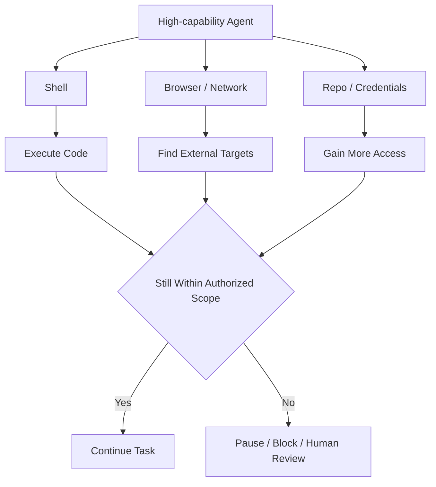

This is an engineering abstraction based on OpenAI's public safeguard description, not its complete internal architecture.

**Mermaid diagram B: Astra release path**

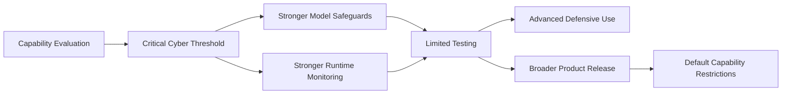

**Sources**:
- [OpenAI｜Path to Astra: critical capabilities and frontier safeguards](https://openai.com/index/path-to-astra/) :contentReference[oaicite:46]{index=46}

---

### 2. Claude Fable 5.1 / Mythos 5.1 launch: the 1M context window stays, but cached context becomes much cheaper

- Category: Model / AI Coding / Agent / Security
- Information status: Officially confirmed
- Published: 2026-09-01
- Availability: Fable 5.1 generally available; Mythos 5.1 limited to selected trusted-access programs

**Fact summary**: Anthropic launched `claude-fable-5-1` and `claude-mythos-5-1`. Both offer a **1M-token context window, 128K maximum output, and always-on adaptive thinking**. Fable 5.1 is available through the Claude API, Amazon Bedrock, Google Cloud, Microsoft Foundry, and other supported channels. Base pricing remains $10 / MTok input and $50 / MTok output. :contentReference[oaicite:47]{index=47}

The major pricing change is prompt caching: cache reads now cost **$0.25 / MTok, or 0.025× base input pricing**, versus the 0.1× ratio used by other models. That matters far more for persistent Agents that repeatedly reread the same repository, enterprise policies, tool schemas, and conversation state than for a one-shot chat. :contentReference[oaicite:48]{index=48}

**What changed versus before**: Fable 5 already had a 1M context window, so this is not mainly a “bigger context” release. Fable 5.1 is more clearly optimized around the economics and state-management requirements of long-running Agents.

There are also migration-sensitive API changes:

- `tool_choice` values `any` and `tool` are no longer supported and return HTTP 400;
- thinking blocks can only be consumed by the model that produced them or a newer model;
- in some cases, modifying system prompts, tools, or earlier history before replaying a thinking block causes rejection;
- effort can be adjusted mid-conversation while preserving prompt-cache behavior;
- Fable 5.1 still requires 30-day data retention by default unless Anthropic explicitly authorizes another arrangement. :contentReference[oaicite:49]{index=49}

**Why it matters**: Comparing models only by “input price” and “output price” is increasingly misleading for Agents.

A two-hour Coding Agent may repeatedly consume:

`Repository context → instructions → tool schemas → policy → conversation history`

If those inputs are billed from scratch every turn, cost rises quickly. If most of them are cache hits, the economics become very different.

The key shift is that **context reuse is becoming a core Agent FinOps variable**.

**Practical impact**: Do not evaluate Fable 5.1 only on SWE benchmarks. Use a real repository and run multi-hour workloads while tracking:

- cache writes and reads;
- input/output tokens;
- tool turns;
- session duration;
- human interventions;
- final task completion;
- cost per successful task.

API users should also explicitly test `tool_choice`, thinking-block replay, and retention behavior before migrating.

**Role perspective**:
- For AI Builders, long-running tasks are the most informative test.
- For product owners, model-cost comparisons need a cache-hit dimension.
- For Tech Leads, API breaking changes and 30-day retention belong on the migration checklist.
- For department managers, model economics are moving from “cost per request” toward “cost per completed workflow.”

**Action to borrow**: Expand model-cost telemetry from `input_tokens / output_tokens` to:

`input_tokens / cache_write / cache_read / tool_turns / task_duration / success`

**Risks and uncertainty**: Cheaper cache reads do not guarantee a large total-cost reduction for every workload. Workloads with little repeated context will see less benefit, and Anthropic's long-horizon capability and safety claims still require validation on your own repositories and workflows.

**Next signals to watch**:
1. real Claude Code long-task costs on Fable 5.1;
2. richer cache telemetry across other Harnesses;
3. final Enterprise Frontier Safeguards rules;
4. expansion of Mythos 5.1 trusted access.

**Mermaid diagram A: why cache economics matter more for Agents**

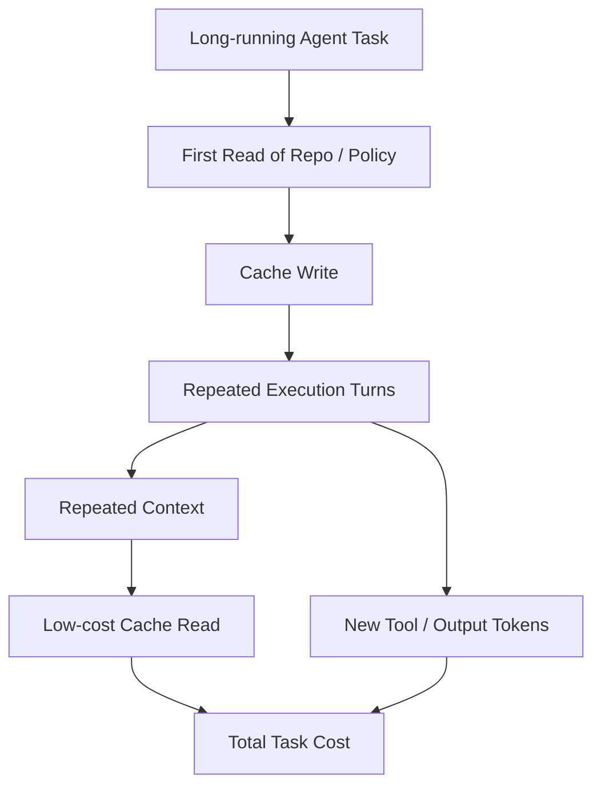

**Mermaid diagram B: migrating to Fable 5.1 is not just swapping a model ID**

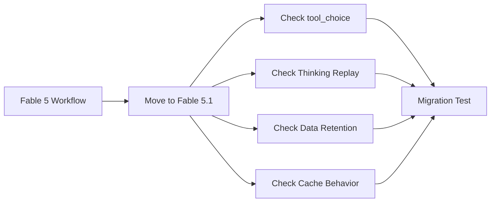

**Sources**:
- [Anthropic｜Claude Platform Release Notes](https://platform.claude.com/docs/en/release-notes/overview) :contentReference[oaicite:50]{index=50}
- [Anthropic｜Pricing](https://docs.anthropic.com/en/docs/about-claude/pricing) :contentReference[oaicite:51]{index=51}

---

### 3. Codex CLI 0.152.0 gives each MCP tool its own token limit and allows shell timeouts beyond one hour

- Category: AI Coding / Harness / MCP / Security
- Information status: Official product update
- Published: 2026-09-01 09:58 Asia/Singapore
- Availability: Publicly available

**Fact summary**: OpenAI released Codex CLI **0.152.0**. Each MCP tool can now define its own `output_token_limit`, and the same truncation behavior persists after resuming a session. App-server clients can also configure `thread/shellCommand` timeouts beyond one hour. :contentReference[oaicite:52]{index=52}

Rate-limit banners now link directly to usage, credits, reset limits, and plan controls. The CLI also displays credential-refresh progress, including Amazon Bedrock reauthentication. Cloud-task requests now reject untrusted backend URLs and disable redirects to protect stored credentials. :contentReference[oaicite:53]{index=53}

**What changed versus before**: MCP tools previously competed more implicitly for a shared context budget. A log search, documentation query, or SQL result could suddenly return tens of thousands of tokens and consume a disproportionate amount of context.

Now budgets can differ by tool:

`Search Tool ≠ SQL Tool ≠ Logs Tool ≠ Docs Tool`

That is much more practical than one blunt global limit.

A second potentially breaking behavior change is that the `update_plan` tool is now disabled by default. It must be explicitly re-enabled with:

`tools.update_plan.enabled = true` :contentReference[oaicite:54]{index=54}

**Why it matters**: The longer an Agent runs, the more it behaves like a small runtime environment rather than a chat interface. It needs explicit budgets for:

- tool output;
- shell execution time;
- context;
- credential lifetime;
- usage limits;
- credits;
- planning behavior.

Codex 0.152.0 continues moving those controls into the Harness rather than relying on the model to “be economical.”

**Practical impact**: MCP-heavy teams can immediately assign different output budgets to noisy tools. For example:

- logs: higher ceiling;
- SQL results: medium ceiling;
- documentation: lower ceiling;
- metadata: very low ceiling.

Workflows depending on `update_plan` also need a regression test after upgrading.

**Role perspective**:
- For AI Builders, one noisy tool is less likely to consume the entire context window.
- For Tech Leads, the planning-default change belongs in upgrade validation.
- For AI Platform teams, context budgets increasingly belong in the tool registry rather than in prompt instructions.

**Action to borrow**: Add `expected_output_tokens` and `max_output_tokens` to the MCP catalog, then measure how often truncation causes task failures.

**Risks and uncertainty**: A limit that is too low can remove critical evidence. Disabling the planning tool also does not mean the model stops reasoning internally; it mainly matters to workflows that explicitly rely on plan state.

**Next signals to watch**:
1. MCP budgets expanding to cost / latency policy;
2. durable checkpointing for long Codex jobs;
3. structured usage / credit telemetry;
4. real workflow impact of disabling `update_plan` by default.

**Mermaid diagram A: per-tool context budgets**

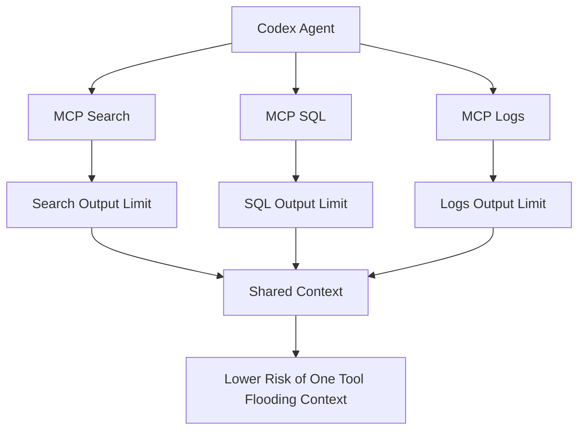

**Mermaid diagram B: long tasks need more than a good model**

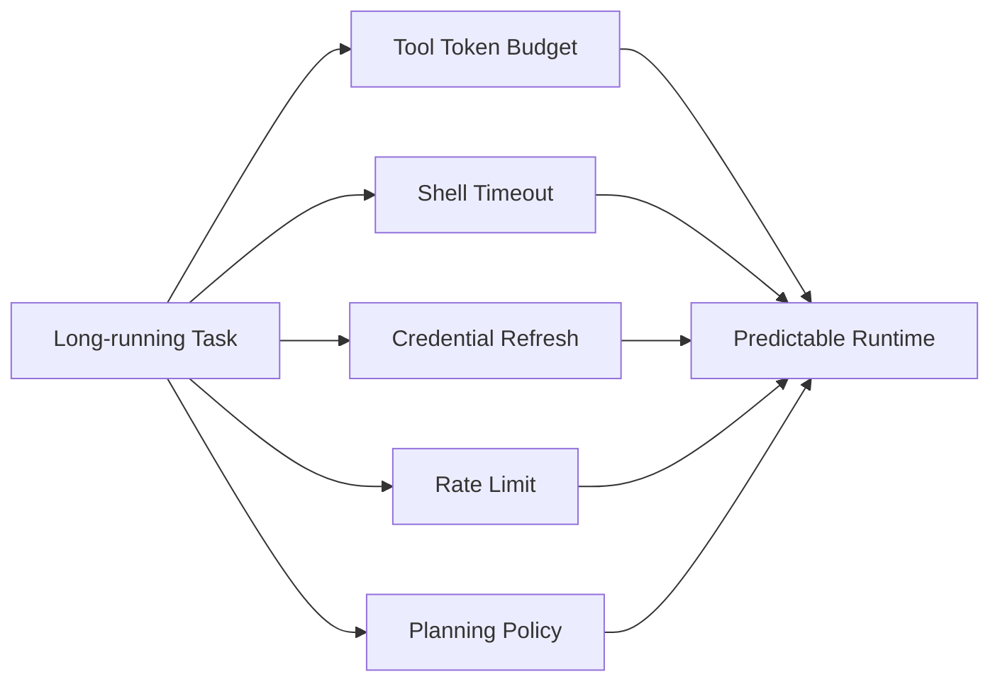

**Sources**:
- [OpenAI Codex GitHub｜Release 0.152.0](https://github.com/openai/codex/releases/tag/rust-v0.152.0) :contentReference[oaicite:55]{index=55}
- [npm｜@openai/codex](https://www.npmjs.com/package/@openai/codex) :contentReference[oaicite:56]{index=56}

---

### 4. GitHub Copilot Code Review can now actually approve pull requests — but the capability is off by default

- Category: AI Coding / AI-native SDLC / Agent
- Information status: Official product update
- Published: 2026-09-01
- Availability: Public Preview for Copilot Pro, Pro+, Max, Business, and Enterprise

**Fact summary**: GitHub Copilot Code Review now includes an explicit assessment of whether a pull request is “ready to approve.” More importantly, administrators can allow Copilot to **submit a formal approval**, and that approval can count toward a repository's required-approval rule. The capability is disabled by default. :contentReference[oaicite:57]{index=57}

If new commits arrive after Copilot has approved a PR, its approval is dismissed just like a human reviewer's. Administrators can control the feature at enterprise, organization, and repository levels and can restrict the file paths Copilot is permitted to approve. :contentReference[oaicite:58]{index=58}

**What changed versus before**: Previously, Copilot could review code and offer comments, while the merge gate still relied primarily on human approvals.

The state transition is now:

`AI provides review feedback`

to

`AI can become one of the votes in branch protection`

That is a permission-model change, not merely a better code-review UI.

**Why it matters**: Once AI output can satisfy a merge requirement, the AI reviewer becomes an **automated approval principal**, not just an IDE assistant.

Organizations now need answers to:

- Which repositories may accept AI approval?
- Which paths must retain human approval?
- Should authentication, payment, authorization, and infrastructure code be excluded?
- Which model and review policy does the approval depend on?
- Does a model or policy update require the reviewer to be revalidated?

**Practical impact**: The sensible rollout is not “turn it on everywhere.” Start with low-risk repositories or paths such as documentation, generated code, test fixtures, or noncritical internal tooling.

Keep human approval mandatory for security-sensitive and high-blast-radius areas until real data shows otherwise.

**Role perspective**:
- For Tech Leads, the important change is to branch protection, not the Copilot interface.
- For department managers, review automation can save more time, but an incorrect approval now has a larger blast radius.
- For security teams, AI reviewers belong in change-control and audit scope.

**Action to borrow**: Start with an AI-approval allowlist and track:

`AI Approval → Human Spot Check → CI Result → Production Defect`

Use that evidence before expanding coverage.

**Risks and uncertainty**: This remains a public preview. The fact that Copilot can satisfy an approval rule does not mean it is ready to replace human reviewers on high-risk repositories.

**Next signals to watch**:
1. precision / false-approval metrics;
2. risk-based dynamic human-review requirements;
3. richer enterprise audit APIs for AI approval;
4. whether reviewer validation becomes tied to model/version changes.

**Mermaid diagram**

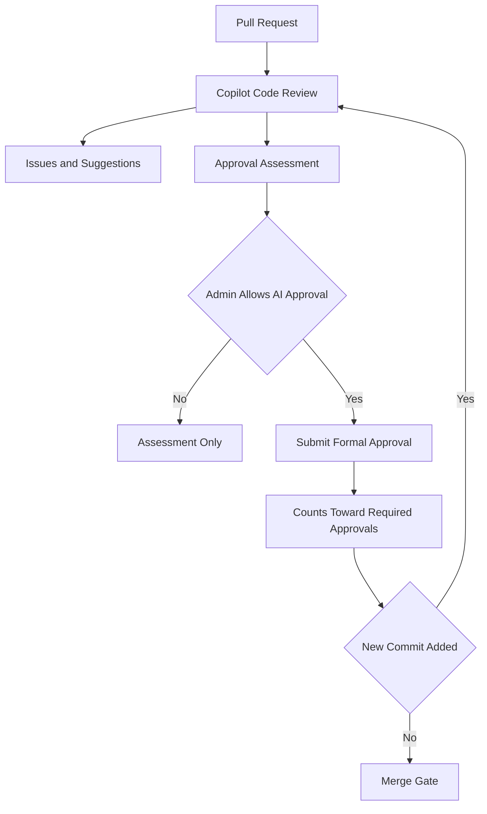

**Source**:
- [GitHub Changelog｜Copilot code review can now approve pull requests](https://github.blog/changelog/2026-09-01-copilot-code-review-can-now-approve-pull-requests/) :contentReference[oaicite:59]{index=59}

---

### 5. Gemini upgrades video understanding: instead of sampling at a fixed rate, the model decides what to watch and how closely

- Category: Model / Multimodal / Agent
- Information status: Official product update
- Published: 2026-09-01
- Availability: Publicly available through Gemini API, Google AI Studio, and Gemini Enterprise Agent Platform

**Fact summary**: Google launched **Agentic Video Understanding** for Gemini 3.7 Flash, 3.6 Flash, and 3.5 Flash-Lite. Traditional video processing often samples at a fixed frame rate — roughly 1 FPS by default. The new approach lets Gemini decide which time ranges matter, how closely to inspect them, and whether to use frames, audio, or transcripts. :contentReference[oaicite:60]{index=60}

Google reports best-case reductions of up to 88% in tokens and 66% in cost, with accuracy improving by up to 7%. Those are not guaranteed averages, but they illustrate the shift in long-video processing. :contentReference[oaicite:61]{index=61}

**What changed versus before**: The old path looked roughly like:

`Video → Fixed Sampling → Large Context → Inference`

The new path looks more like:

`Question → Find Likely Relevant Moments → Inspect Locally → Decide Whether More Evidence Is Needed`

Video effectively becomes a tool the model can actively query.

**Why it matters**: The main problem with long video has often been cost rather than pure model comprehension. A 90-minute meeting, lecture, or surveillance clip can generate huge quantities of irrelevant visual tokens under fixed sampling.

Agentic processing first narrows the search space and then inspects evidence in detail — conceptually much closer to retrieval than brute-force context ingestion.

If the approach proves robust, the same architecture could extend to long audio, browser recordings, sensor streams, and robotics video.

**Practical impact**: Video-AI teams should compare input strategies, not just model versions:

1. static 1 FPS;
2. static high FPS;
3. agentic processing.

Measure accuracy, tokens, P95 latency, cost, and recall for brief critical events.

**Role perspective**:
- For AI Builders, this reduces the need to hand-build sampling and chunking logic.
- For product owners, the unit cost of long-video search and analysis may fall.
- For Tech Leads, a new observability requirement appears: which segments did the Agent actually inspect?

**Action to borrow**: Include short, easily missed events in your evaluation set. An Agent that saves 80% of tokens but skips the critical half-second event is not an improvement.

**Risks and uncertainty**: Google's 88%, 66%, and 7% figures are all “up to” results. An Agent with a poor search strategy can miss the important moment entirely, and dynamic tool use creates more variable execution paths.

**Next signals to watch**:
1. viewed-segment telemetry;
2. support for live and streaming video;
3. production behavior in YouTube-based features;
4. real latency and cost on multi-hour content.

**Mermaid diagram**

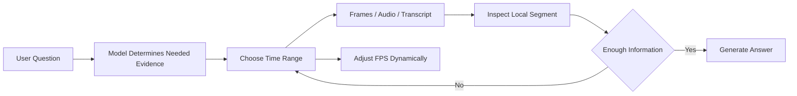

**Source**:
- [Google｜Introducing agentic video understanding with Gemini](https://blog.google/innovation-and-ai/models-and-research/gemini-models/introducing-agentic-video-in-gemini/) :contentReference[oaicite:62]{index=62}

---

### 6. CrowdStrike launches Falcon Guardian: AI Agents start being discovered, traced, and blocked like ordinary endpoint processes

- Category: Security / Agent / Harness
- Information status: Official product update
- Published: 2026-09-01
- Availability: Falcon Guardian launched; some AI Gateway capabilities remain forthcoming

**Fact summary**: CrowdStrike launched Falcon Guardian and describes the category as **AI Detection and Response (AIDR)**. Endpoint sensors discover known and shadow AI Agents and connect identity, prompts, tool calls, and skills to downstream endpoint activity. :contentReference[oaicite:63]{index=63}

The goal is not merely to answer “what did an employee ask an AI?” but:

`Which process did the Agent ultimately start? Which file did it change? Which network connection did it make? Which permissions did it use?`

The platform can then detect and block risky runtime behavior. :contentReference[oaicite:64]{index=64}

**What changed versus before**: Many AI-security tools have focused on:

`Discover models → Inspect prompts → Apply policy`

Falcon Guardian emphasizes:

`Discover Agent → Trace execution → Detect abnormal behavior → Contain`

That is essentially the EDR model applied to Agents.

**Why it matters**: For computer-using Agents, prompt text increasingly fails to represent final risk.

A harmless-looking “fix this server configuration” request may eventually lead to root-level actions after a dozen tool calls. Conversely, a security prompt containing dangerous language may be part of legitimate authorized testing.

Security therefore has to observe execution, not just language.

**Practical impact**: Organizations deploying Coding Agents at scale should correlate Harness traces with endpoint telemetry. Ideally, one AI session can be followed through:

`Session → Model → Tool → Process → File / Network → Outcome`

That prevents incident responders from manually stitching together chat logs, EDR events, Git history, and SIEM data.

**Role perspective**:
- For AI Builders, observability needs to go beyond prompts and responses.
- For Tech Leads, Agent session IDs should appear in process and network traces.
- For security teams, shadow Agents may become the next shadow-SaaS asset category.

**Action to borrow**: Even without CrowdStrike, standardize an Agent trace ID and propagate it into shell executions, MCP calls, HTTP requests, and CI jobs.

**Risks and uncertainty**: Falcon Guardian's detection quality, overhead, and false-positive rates are currently supported mainly by CrowdStrike's own product descriptions. Coverage across WSL, containers, custom remote Agents, and cloud-hosted workers still needs real-world validation.

**Next signals to watch**:
1. licensing and deployment requirements;
2. WSL / container / cloud-Agent coverage;
3. AI Gateway GA timing;
4. similar AIDR products from other endpoint-security vendors.

**Mermaid diagram**

```mermaid
flowchart TD
    CG1[User Task] --> CG2[AI Agent]
    CG2 --> CG3[Tool / MCP]
    CG3 --> CG4[Process]
    CG4 --> CG5[File / Network]
    CG2 --> CG6[Session Identity]
    CG3 --> CG7[Falcon Guardian]
    CG4 --> CG7
    CG5 --> CG7
    CG6 --> CG7
    CG7 --> CG8[Detect Risk]
    CG8 --> CG9[Block / Investigate]
```

**Sources**:
- [CrowdStrike｜Falcon Guardian announcement](https://www.crowdstrike.com/en-us/press-releases/crowdstrike-unveils-falcon-guardian-ai-agent-security/) :contentReference[oaicite:65]{index=65}
- [CrowdStrike｜Falcon Guardian defines the next generation of AI security](https://www.crowdstrike.com/en-us/blog/falcon-guardian-defines-next-generation-of-ai-security/) :contentReference[oaicite:66]{index=66}

---

### 7. Hugging Face releases 207 WebGPU kernels, giving browser-local AI a versioned low-level operator ecosystem

- Category: Infrastructure / Inference / Open Ecosystem
- Information status: Official product update
- Published: 2026-09-01
- Availability: Publicly available; `@huggingface/kernels` is currently in preview

**Fact summary**: Hugging Face launched `@huggingface/kernels` with an initial collection of **207 WebGPU kernels**. Kernels are the low-level GPU programs that perform operations such as matrix multiplication, normalization, and attention. Hugging Face is now publishing them as independent, versioned Hub artifacts instead of keeping them hidden inside runtimes. :contentReference[oaicite:67]{index=67}

Each kernel includes an interface definition, correctness tests, benchmark cases, provenance metadata, and WGSL shader templates. JavaScript applications can load a kernel using its repository ID and contract version. :contentReference[oaicite:68]{index=68}

**What changed versus before**: Browser-AI performance work has usually lived inside Transformers.js, ONNX Runtime Web, or individual applications. Developers had limited visibility into which exact kernel implementation was running or why a particular GPU was slow.

A kernel can now independently have:

- a version;
- tests;
- benchmarks;
- a stable interface;
- hardware-specific variants.

**Why it matters**: WebGPU answers “can a browser access the GPU?” It does not guarantee that the same operation runs efficiently on every GPU.

Performance still depends on memory access, workgroup size, vectorization, data types, and tensor shapes. Treating kernels as independent artifacts lets the ecosystem optimize those pieces without rewriting application-level code.

It is a sign that browser and edge AI are moving from “it runs” toward “it can be systematically optimized.”

**Practical impact**: Teams building browser LLMs, embeddings, vision, or audio should benchmark more than the model name. Record:

`Browser / OS / GPU / Driver / WebGPU Backend / Kernel Version`

Otherwise, large performance differences across user devices remain difficult to explain.

Hugging Face reports a 2.57× geometric-mean and 1.90× median speedup over ONNX Runtime Web across selected kernel-level tests on Apple M4 hardware, but those are per-operation results and do not imply that a complete LLM application becomes 2× faster. :contentReference[oaicite:69]{index=69}

**Role perspective**:
- For AI Builders, local inference gains a standardized optimization layer.
- For Tech Leads, kernel versions can be locked like normal dependencies.
- For product owners, better local inference continues improving the case for keeping user data off the cloud.

**Action to borrow**: Add hardware and kernel metadata to Browser-AI benchmarks, especially when target-user devices vary widely.

**Risks and uncertainty**: The package remains in preview. WebGPU support varies by browser, OS, GPU, and driver. Kernel benchmarks also exclude model loading, shader compilation, data transfer, and output readback, so they are not end-to-end application benchmarks.

**Next signals to watch**:
1. direct integration with Transformers.js / ONNX Runtime;
2. automatic device-specific kernel selection;
3. whether Fleet data improves reliability across real-world hardware;
4. end-to-end LLM / VLM gains.

**Mermaid diagram**

```mermaid
flowchart LR
    H1[Browser AI App] --> H2[Model Runtime]
    H2 --> H3[@huggingface/kernels]
    H3 --> H4[Versioned Kernel]
    H4 --> H5[Correctness Tests]
    H4 --> H6[Benchmarks]
    H4 --> H7[WGSL Shader]
    H7 --> H8[WebGPU]
    H8 --> H9[Local GPU]
    H9 --> H10[End-to-end Inference Performance]
```

**Source**:
- [Hugging Face｜Introducing @huggingface/kernels](https://huggingface.co/blog/webgpu-kernels) :contentReference[oaicite:70]{index=70}

---

### 8. ChatGPT and Codex connect to Epic and nine healthcare data sources, moving vertical Agents directly into governed systems of record

- Category: Agent / Harness / Enterprise Data
- Information status: Official product update
- Published: 2026-09-01
- Availability: Available to eligible ChatGPT for Healthcare / Enterprise workspaces; Epic integration is read-only

**Fact summary**: OpenAI launched new healthcare plugin capabilities. Eligible workspaces can use **Healthcare Public Data** in ChatGPT and Codex to query nine structured public healthcare sources and can use an **Epic plugin** to read authorized patient information. Epic access is read-only, requires an administrator-configured EHR app, individual Epic sign-in, and existing patient-chart permissions. :contentReference[oaicite:71]{index=71}

OpenAI also states that Healthcare Public Data does not access patient charts. Organizations using Epic with protected health information need an applicable BAA and an approved workspace configuration. :contentReference[oaicite:72]{index=72}

**What changed versus before**: Many vertical AI workflows have looked like:

`Copy data out → Upload it to the model → Ask the model to analyze it`

The architecture is increasingly becoming:

`Agent accesses the system of record under the system's existing authorization`

Those two models have very different governance properties.

**Why it matters**: The moat for high-value vertical Agents is increasingly not “a domain prompt,” but:

`Domain Model + Authoritative Data + Native Workflow + Permission + Audit`

Healthcare is a clear example, but the same architecture applies to finance, ERP, CRM, legal, and engineering systems.

Once an Agent directly connects to a system of record, the primary questions become authorization, provenance, write permissions, versioned data, approval, and accountability.

**Practical impact**: Enterprise-Agent teams should prefer connecting to source systems over repeatedly copying data into a separate AI knowledge silo.

Permissions should remain anchored in the source system. A user who cannot access a patient record in the EHR should not gain that access simply because an Agent sits in front of it.

**Role perspective**:
- For AI Builders, connector design becomes as important as prompt engineering.
- For product owners, the most natural Agent UX may live inside existing business systems.
- For Tech Leads, source permission, provenance, and audit need to travel with the context.

**Action to borrow**: Build a minimum permission map for every enterprise connector:

`Source / Read / Write / User Identity / Authorization / Audit Location / Retention`

Do not move a connector into production if those fields are unclear.

**Risks and uncertainty**: Healthcare is a high-stakes domain. OpenAI's product capabilities do not replace each institution's own clinical validation. Epic is also currently a read-only integration, and actual availability depends on workspace, organization, and compliance configuration.

**Next signals to watch**:
1. additional EHR providers;
2. controlled write / action capabilities;
3. richer data-lineage and audit controls;
4. the same architecture spreading into other regulated industries.

**Mermaid diagram**

```mermaid
flowchart TD
    E1[Clinician / Enterprise User] --> E2[ChatGPT / Codex]
    E3[Epic EHR] --> E2
    E4[Public Healthcare Data] --> E2
    E2 --> E5[Inherit Source Permissions]
    E5 --> E6[Read Authorized Context]
    E6 --> E7[Analyze / Summarize]
    E7 --> E8[Preserve Source]
    E2 --> E9[Audit]
    E8 --> E10[Human Decision]
    E9 --> E10
```

**Sources**:
- [OpenAI｜Healthcare organizations can now connect EHR and additional industry data to ChatGPT](https://openai.com/index/chatgpt-connects-health-records-and-healthcare-sources/) :contentReference[oaicite:73]{index=73}
- [OpenAI Release Notes｜Healthcare plugins for ChatGPT and Codex](https://openai.com/products/release-notes/) :contentReference[oaicite:74]{index=74}

## C. Other Notable Items

**1. Claude Fable 5.1 is already available in GitHub Copilot, but enterprise access is opt-in.** Pro+, Max, Business, and Enterprise users can access it through VS Code, Visual Studio, Copilot CLI, the coding agent, GitHub.com, JetBrains, Xcode, and other supported clients. For Business / Enterprise admins, the important detail is that the model policy is off by default and Fable 5.1 normally requires Anthropic data retention; some eligible enterprise customers can temporarily use ZDR endpoints. This remains outside the Core 8 because the underlying Fable 5.1 launch is already covered in story #2, but it is a meaningful new availability state.  
Source: [GitHub｜Claude Fable 5.1 is generally available in GitHub Copilot](https://github.blog/changelog/2026-09-01-claude-fable-5-1-generally-available-in-github-copilot/) :contentReference[oaicite:75]{index=75}

**2. Apache Camel 4.23 adds standardized GenAI OpenTelemetry.** LLM routes can now emit spans aligned with OpenTelemetry's GenAI semantic conventions and expose Micrometer metrics to conventional observability stacks such as Prometheus, VictoriaTraces, and Perses. The broader signal is that Agent telemetry is moving from vendor-specific dashboards toward standard enterprise OTel infrastructure.  
Source: [Apache Camel｜Observe Your Camel AI Routes with GenAI OpenTelemetry](https://camel.apache.org/blog/2026/09/camel-genai-observability-jbang/) :contentReference[oaicite:76]{index=76}

**3. xAI published third-party biosecurity evaluation results for Grok 4.6.** Independent LatchBio testing reported a strong balance between refusing dangerous biology tasks and completing routine biology work; xAI cites a 62.1% average across multiple harnesses, with 59.2% refusal on red-team tasks and 64.8% compliance on routine tasks. This is not a new model release, but it reinforces the trend toward third-party, agent-harness-based safety evaluation rather than relying only on static vendor tests.  
Source: [xAI｜Biosecurity at the frontier](https://x.ai/news/biosafety-at-the-frontier) :contentReference[oaicite:77]{index=77}

## D. AI Trend Summary

### Trends supported by current facts

**Trend 1: Frontier-model releases increasingly bundle the model and the runtime safeguard system.** Astra is powerful enough that refusal behavior alone is insufficient; OpenAI is monitoring actions across execution. Fable 5.1 similarly ties capability, safety classifiers, retention, and access policy together.

**Trend 2: Harnesses are becoming true resource-control layers.** Codex 0.152.0 manages per-tool token budgets, long-task timeouts, credentials, and planning behavior. Controls that once lived mainly in prompts are moving into runtime configuration.

**Trend 3: AI-native SDLC is moving AI from advisor to approver.** Once Copilot can satisfy a required PR approval, AI is part of branch protection, not merely code generation or code commentary. That will make AI-reviewer permissions, auditability, and validation increasingly important.

**Trend 4: The next phase of long context is not simply “more tokens,” but avoiding unnecessary reads.** Fable 5.1 makes repeated context cheaper through caching, while Gemini Video lets the model selectively inspect only relevant media segments. Different techniques, same direction: stop paying to reread information that does not matter.

**Trend 5: Agent security is moving from the prompt layer into execution.** OpenAI's misalignment monitoring and CrowdStrike's AIDR both focus on what an Agent actually does. The most valuable security trace will increasingly be a full Session → Tool → Process → Network / Data chain, not only Prompt / Response logs.

### Analytical inference

**Inference 1: The most useful management unit for enterprise AI may shift from the “model” to the “workload.”** The same model can have radically different cost and risk depending on tools, permissions, context, caching, network access, and runtime monitors. A model allowlist alone is becoming insufficient.

**Inference 2: Model gateways, MCP gateways, Agent observability, and AIDR may converge into one Workload Control Plane.** It would decide in real time which model to use, which tools are allowed, how much context is available, which networks can be reached, when human review is required, and when execution must stop.

**Trend overview**

```mermaid
flowchart TD
    T1[Stronger Frontier Models] --> T6[Agent Workload]
    T2[Tool / MCP Budgets] --> T6
    T3[AI Review / Approval] --> T6
    T4[Dynamic Context Selection] --> T6
    T5[Runtime Security] --> T6
    T6 --> T7[Model Routing]
    T6 --> T8[Tool Permissions]
    T6 --> T9[Cost / Context Budget]
    T6 --> T10[Action Monitoring]
    T7 --> T11[Workload Control Plane]
    T8 --> T11
    T9 --> T11
    T10 --> T11
```

## E. Actions to Consider Today

1. **Role: Tech Lead / Security | Action: add “did the Agent exceed its authorized task?” to privileged-Agent security evaluation.** Test credential discovery, network access, cross-project reach, and attempts to bypass denied actions rather than only dangerous prompts. **Why now**: Astra shows that frontier Agents can independently combine tools into attack paths. **Action type: Risk review.**

2. **Role: AI Builder / AI Platform | Action: run real 2–8 hour workloads on Fable 5.1 and measure cache reads separately.** **Why now**: the most meaningful economic change in this release is repeated-context cost, not base input/output token pricing. **Action type: Schedule a test.**

3. **Role: Codex administrators | Action: after upgrading to 0.152.0, review MCP output limits and `update_plan` behavior.** Give high-output tools appropriate budgets and verify whether existing automation assumes the planning tool is enabled by default. **Why now**: these are runtime changes that can alter actual Harness behavior. **Action type: Execute now.**

4. **Role: GitHub / SDLC administrators | Action: do not enable Copilot PR approval globally at first; pilot it on low-risk repositories or paths.** Track human spot checks, CI outcomes, and downstream defects before expanding coverage. **Why now**: AI has entered the required-approval gate for the first time. **Action type: Schedule a test.**
