<!-- 中文版 -->
# AI 今日头条｜2026 年 09 月 03 日

- 语言：中文
- 时区：Asia/Singapore
- 新闻窗口：2026-09-02 07:30 至 2026-09-03 07:30
- 实际检索截止时间：2026-09-03 07:02
- 本期核心新闻：6 条
- 其他值得关注：2 条
- 注：本次运行发生在固定新闻窗口结束前约 28 分钟，因此实际检索覆盖至 07:02；07:02–07:30 之间若出现重大新事件，应在下一期补检。

## A. 今日最重要的 3 件事

**1. Google 发布 Gemini 3.8 Flash：价格与 3.7 Flash 相同，但明显把重点转向长时间 Coding 和 Agent；同时单独推出受限访问的 3.8 Flash Cyber。** Gemini 3.8 Flash 的首发价格仍是每百万输入 token $0.75、输出 $3.75，但 Google 明确提醒：新模型在复杂任务上会“更努力”，会多做推理、多调用工具，因此单次任务的实际费用不一定和 3.7 Flash 一样。Cyber 版本则进入新的 Fairwind Program，只向政府、关键基础设施和受信任的安全团队开放。:contentReference[oaicite:0]{index=0}

**2. Meta 发布 Muse Spark 1.3：长任务不容易跑偏了，内部工程测试中 Tool Call 少约 20%、token 少约 25%。** 1.3 已进入 Muse Code 和 Meta Model API，重点改善长时间 Agent、多任务同时推进、复杂指令保持和失败时主动求助；最高档的 `max reasoning` 反而暂时没有开放，Meta 表示还要完成额外安全测试。这个组合很值得注意：模型迭代速度越来越快，但最高能力档开始被安全评测单独卡住。:contentReference[oaicite:1]{index=1}

**3. Alibaba 更新 Qwen3.8-Max-0902：不是换代，而是专门补强 Coding、长任务和多 Tool 协作。** 新 Snapshot 保留 1M Context 和现有 Tool 生态，Singapore API 价格仍为每百万输入 $2、输出 $6，显式 Cache Read 仅 $0.17；Alibaba 的描述非常明确——这轮 Post-training 主要针对工程级 Coding 和长时间自主开发，而不是继续堆参数。:contentReference[oaicite:2]{index=2}

## B. 新闻正文

### 1. Gemini 3.8 Flash 发布：单价不涨，但复杂任务会多推理；Cyber 版只给受信任防守方

- 类别：模型 / AI 编程 / Agent / 安全
- 信息状态：官方已确认
- 发布时间：2026-09-02；官方页面未公布准确时刻
- 可用状态：Gemini 3.8 Flash 已公开可用；Gemini 3.8 Flash Cyber 仅通过 Fairwind Program 限量开放

**事实摘要**：Google 发布 Gemini 3.8 Flash，这是六周内第三次 Flash 大版本更新。它继续使用 3.7 Flash 的首发单价：每百万输入 token **$0.75**、输出 **$3.75**，但重点提升软件工程、Agent 长任务和需要多步推理的专业任务。:contentReference[oaicite:3]{index=3}

Google 同时发布 Gemini 3.8 Flash Cyber。它和普通 3.8 Flash 使用同一基础智能，但针对漏洞发现和自动修复做了强化，只通过新的 Fairwind Program 向政府、Google Cloud 受信任客户、关键基础设施和安全合作伙伴开放。Fairwind 首批已覆盖 650 多个合作方，并把 3.8 Flash Cyber 与 CodeMender 修复 Harness 组合使用。:contentReference[oaicite:4]{index=4}

**相较此前的变化**：以前 Flash 的主要卖点是“速度快、价格低”；这次 Google 明显把它往**长时间自主 Agent**推。官方甚至主动提醒：3.8 Flash 在难任务上会执行更多推理步骤并反复调用工具，所以虽然每 token 价格没涨，实际一个任务可能消耗更多 token。

如果成本比极致质量更重要，Google 仍建议降低 reasoning effort（推理强度），或者继续使用 3.7 Flash。也就是说，3.8 并不是简单意义上的“同价免费升级”，而是给开发者多了一个质量与任务成本之间的旋钮。:contentReference[oaicite:5]{index=5}

**为什么重要**：这意味着 Flash 和高价 Frontier Model 的分工正在变模糊。

过去常见的 Routing 是：

`简单任务 → Flash`  
`复杂 Coding / Agent → 大模型`

现在更合理的方式可能变成：

`先给 3.8 Flash + 合适 reasoning effort → 失败或高风险任务再升级到更贵模型`

如果实际任务评测证明它能稳定完成长时 Coding，这会明显改变多模型网关的默认路由。

Cyber 版本则显示另一条趋势：模型厂商开始把同一基础模型拆成不同的**能力访问层级**。不是所有用户都得到最强 Cyber Capability，而是通过身份、用途和组织资质决定开放程度。

**实际影响**：AI Builder 最值得做的不是重跑通用 Benchmark，而是拿真实任务对比：

- 3.7 Flash；
- 3.8 Flash Low / Medium / High effort；
- 当前正在使用的高价模型。

重点看 **Task Success、总 token、Tool Call 数、Wall-clock 和 Cost per Successful Task**。因为 3.8 的单位价格虽然一样，但如果它多做 40% 的推理，实际任务成本仍可能上涨。

安全团队如果属于 Fairwind 面向的组织，则可以关注 CodeMender + 3.8 Flash Cyber。Google 的目标不是只报告漏洞，而是完成“发现 → 验证 → 生成 Patch → 验证 Patch”的闭环。不过官方所谓“几分钟生成可部署修复”仍属于 Google 自己的产品结果，需要在真实代码库验证。:contentReference[oaicite:6]{index=6}

**角色视角**：
- 对 AI Builder，最直接的变化是 Flash 已经值得放进长任务 Agent Eval，而不是只做便宜的简单请求。
- 对 Tech Lead，要重新测 Routing Threshold，不能继续假设复杂任务一定要直接上最贵模型。
- 对安全负责人，Cyber Model 的访问正在从普通 API Key 变成受治理的 Trusted Access。

**可借鉴动作**：把模型路由从单纯的 `model` 字段改成：

`task_type → model → reasoning_effort → max_cost → fallback`

然后比较 3.8 Flash 不同 effort 下的成功任务成本，决定它究竟应该替代 3.7 Flash，还是替代一部分更贵的 Frontier Model。

**风险与不确定性**：Google 的 DeepSWE、Finance、Legal 和 Cyber 数据主要来自官方或合作评测，不能直接等同于你的生产任务。更重要的是，Google 已明确说明 3.8 Flash 会在复杂任务上“work harder”，所以“单价不涨”不能直接理解为“总成本不涨”。:contentReference[oaicite:7]{index=7}

**下一步观察**：
1. 3.8 Flash 在真实 Coding Harness 中的平均 token / task；
2. Low / Medium / High effort 的质量—成本曲线；
3. Fairwind 是否扩大到普通企业安全团队；
4. Gemini 3.8 Flash Cyber 是否最终提供更广泛 API。

**Mermaid 图示 A：3.8 Flash 为什么可能改变模型路由**

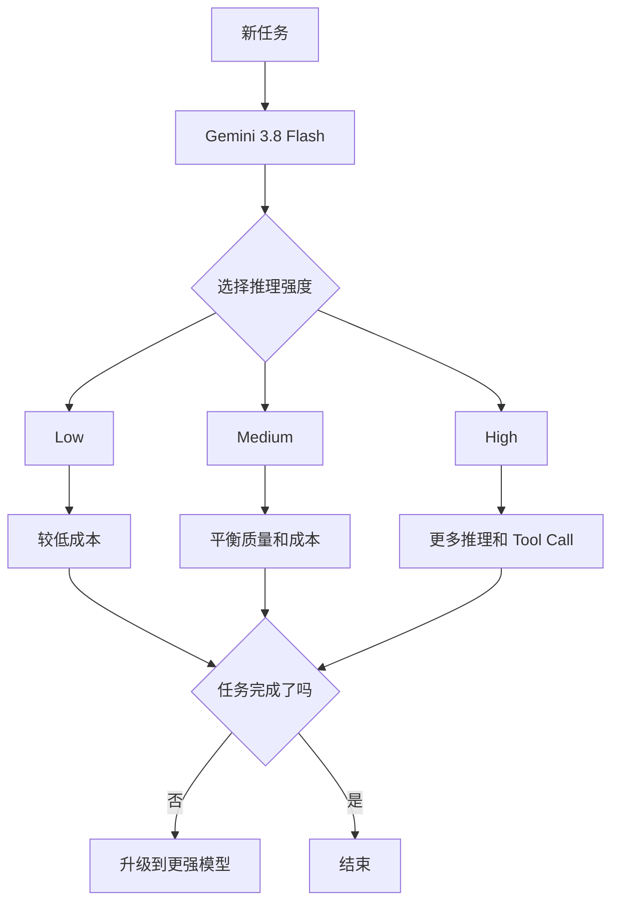

**Mermaid 图示 B：普通 Flash 与 Cyber 版的访问差异**

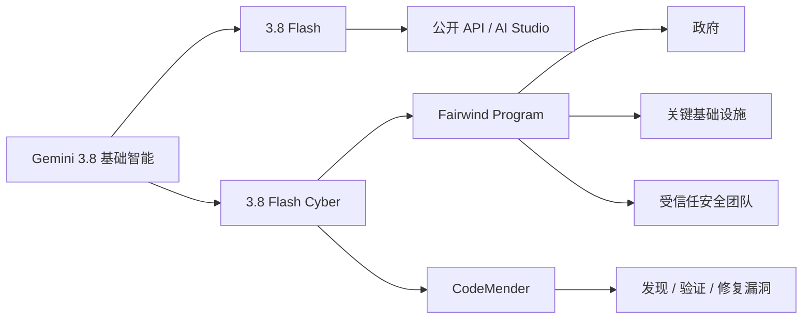

**来源**：
- [Google｜Introducing Gemini 3.8 Flash and 3.8 Flash Cyber](https://blog.google/innovation-and-ai/models-and-research/gemini-models/3-8-flash-and-3-8-flash-cyber/)
- [Google｜Proactive cyber defense with the Fairwind Program](https://blog.google/innovation-and-ai/technology/safety-security/fairwind-program/)

---

### 2. Meta Muse Spark 1.3 上线：长任务少走弯路，最高推理档暂缓开放等安全测试

- 类别：模型 / AI 编程 / Agent
- 信息状态：官方已确认
- 发布时间：2026-09-02；在本期窗口内上线
- 可用状态：已在 Muse Code 和 Meta Model API 可用；`max reasoning` 尚未开放

**事实摘要**：Meta 发布 Muse Spark 1.3，并立即上线 Muse Code 和 Meta Model API。Meta 把这轮更新的重点放在 Agent 和 Coding，而不是上下文长度或新模态：模型更擅长持续完成长任务、同时处理同一 Thread 中的多个 Workflow，并在计划有漏洞时主动修正。:contentReference[oaicite:8]{index=8}

Meta 内部工程对比显示，相比 Muse Spark 1.2，1.3 在常见 Coding Workflow 中约少用 **20% Tool Call**、少用 **25% token**。这些是 Meta 自己的测试，不应直接当作所有项目的固定节省比例。:contentReference[oaicite:9]{index=9}

**相较此前的变化**：上一版的长任务重点是“能跑”；1.3 更强调“跑久了也别忘记最初要求”。

Meta 特别训练了几种很实用的行为：

- Prompt 模糊时主动问清楚；
- 遇到无法继续的问题时主动求助；
- 做不可逆操作前先确认；
- 长任务可以按用户偏好选择频繁汇报，或者安静地后台工作；
- Thread 里同时存在多个任务时，更准确判断新 Prompt 属于哪一个任务。

这类改进看起来没有“参数翻倍”那么醒目，却非常接近日常 Agent 失败的真实原因。

**为什么重要**：长任务 Agent 最大的问题往往不是模型不会写某段代码，而是几个小时之后发生 **Goal Drift（目标逐渐跑偏）**：

最初要求有 12 条，执行到第 30 个 Tool Call 后忘了其中 3 条；用户中途插入一个问题，Agent 把它误当成新主任务；遇到失败时不承认卡住，而是编造“已经完成”。

Muse Spark 1.3 明确针对这些问题训练，说明模型竞争开始从“更聪明”进入“更会合作、更会承认自己不知道”。

**实际影响**：如果你已经在测试 Muse Code，这一版应该重点跑**长任务和打断测试**，而不是只跑 SWE-Bench。

可以故意设计：

1. 一个 2–4 小时工程任务；
2. 中途插入无关问题；
3. 修改一个原始要求；
4. 制造一个 Agent 无法自行解决的环境错误；
5. 放一个高风险操作看它是否确认；
6. 最后检查原始约束有没有全部满足。

Meta 还没有开放 `max reasoning`，理由是需要额外安全测试。这是一个值得记住的限制：目前能用到的 Muse Spark 1.3，不代表该模型最终最高计算档位已经全部开放。:contentReference[oaicite:10]{index=10}

**角色视角**：
- 对 AI Builder，最重要的是测试 Interrupt、Steering 和 Requirement Retention。
- 对 Tech Lead，Muse Spark 1.3 值得进入长时间 Coding Agent 横向评测。
- 对产品负责人，“Agent 遇到问题会主动求助”可能比 Benchmark 多两分更影响用户信任。

**可借鉴动作**：在 Agent Eval 中增加三类容易被忽略的指标：

`constraint_retention / clarification_quality / truthful_failure`

不要只统计最终代码 Test Pass 了多少。

**风险与不确定性**：20% Tool Call 和 25% token 降幅来自 Meta 内部工程比较；不同 Harness、Repo 和 Prompt 下未必重复。`max reasoning` 还在安全测试中，正式开放后任务成本和性能也可能再次变化。:contentReference[oaicite:11]{index=11}

**下一步观察**：
1. `max reasoning` 何时开放；
2. 第三方长任务 Agent Eval 是否复现 token / Tool Call 降幅；
3. Muse Spark Open Weights 的具体版本与发布时间；
4. 未来更大的 “Watermelon” 模型如何与 Spark 分工。

**Mermaid 图示 A：1.3 重点解决的不是单步 Coding**

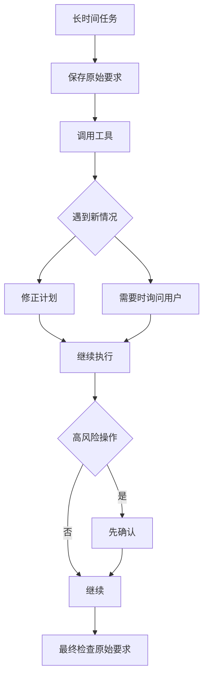

**Mermaid 图示 B：建议怎么测长任务稳定性**

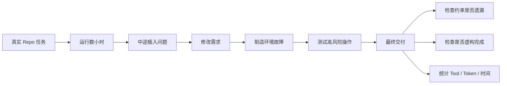

**来源**：
- [Meta AI Research｜Introducing Muse Spark 1.3](https://research.meta.ai/blog/introducing-muse-spark-1-3)

---

### 3. Qwen3.8-Max-0902 更新：参数和 1M Context 不变，重点重练 Coding 与多 Tool 长任务

- 类别：模型 / AI 编程 / Agent
- 信息状态：官方已确认
- 发布时间：2026-09-02；Qwen 公开发布信号约为 2026-09-02 10:00 Asia/Singapore
- 可用状态：已通过 QwenCloud / Alibaba Cloud Model Studio API 提供

**事实摘要**：Alibaba 发布 `qwen3.8-max-0902`，这是 Qwen3.8-Max 的新版 Snapshot，而不是新模型家族。模型继续支持 **1M Context、Thinking Mode、Function Calling、Structured Output、Web Search 和 Context Cache**，但这一轮 Post-training 明确集中在复杂 Coding、长时间自主开发、多个 Tool 协作和端到端任务交付。:contentReference[oaicite:12]{index=12}

Singapore International API 的标准价格仍为每百万输入 token **$2**、输出 **$6**；Implicit Cache 输入 $0.25，Explicit Cache Read $0.17。最大输出为 131,072 token。:contentReference[oaicite:13]{index=13}

**相较此前的变化**：最有意思的是：Alibaba 没有继续靠换一个大版本号来卖升级，而是在同一个 Qwen3.8-Max 上做针对 Agent Workload 的 Snapshot 更新。

官方描述把改进集中在三件事：

- 更复杂的工程级 Coding；
- 长时间 Autonomous Development；
- 多 Tool 协作和完整任务交付。

多模态能力也有改进，尤其是 Chart Reasoning、Document Parsing 和视觉理解，但主线显然是 Coding / Agent。

第三方 Arena 的 Code Arena: WebDev 排名中，这个 Snapshot 上线后达到 **1691**，比 Claude Opus 5 (Max) 高 3 分、比 Kimi K3 (Max) 高 17 分。这个差距很小，而且 Leaderboard 会持续变化，因此更适合作为“值得测试”的信号，而不是“已经证明全面更强”的结论。:contentReference[oaicite:14]{index=14}

**为什么重要**：这类 Snapshot 会给企业带来一个越来越现实的问题：**到底应该跟随 Floating Alias，还是锁死版本？**

如果生产环境调用 `qwen3.8-max`，供应商未来可能继续更新后台模型；好处是自动获得改进，坏处是 Agent 行为可能无预警改变。

如果锁定 `qwen3.8-max-0902`，行为更容易回归测试，但你必须自己维护 Model Lifecycle。

Coding Agent 对这个问题尤其敏感，因为一点点模型变化就可能改变：

- Tool Call 顺序；
- Patch 大小；
- 测试策略；
- Context 使用；
- 长任务是否继续坚持原目标。

**实际影响**：对于严肃生产任务，建议把新版 Snapshot 和旧版放到同一个 Regression Suite，而不是立即切默认模型。

Singapore 区域的低 Cache Read 价格也很适合长 Repo / Agent Workflow。真正值得测的是：当 Agent 反复读取同一 Repository Context 时，Qwen 的 Context Cache 能否稳定命中，以及最终 Cost per Successful Task 是否优于更贵模型。

**角色视角**：
- 对 AI Builder，新版适合优先测试复杂 Coding 和多个 Tool 协作。
- 对 Tech Lead，需要决定 Floating Alias 还是 Version-pinned Snapshot。
- 对 AI Platform，模型版本应该像应用 Dependency 一样有升级和回滚流程。

**可借鉴动作**：生产 Agent 尽量记录：

`provider / model_alias / resolved_snapshot / prompt_version / tool_version`

否则一次供应商后台升级后，任务质量变化时很难知道究竟什么变了。

**风险与不确定性**：Alibaba 的能力描述来自官方；Arena 排名只是一个第三方、人类偏好导向的 Web Coding 评测，3 分差距没有足够意义支持“全面超过 Opus 5”。另外，0902 是托管 Snapshot，并不等于 Alibaba 同步开放了完全相同的 0902 权重。:contentReference[oaicite:15]{index=15}

**下一步观察**：
1. 0902 在真实 Repo 长任务中的稳定性；
2. 是否同步提供对应 Open Weight Snapshot；
3. Floating `qwen3.8-max` 何时默认指向新版本；
4. 新 Snapshot 在 Claude Code / Codex 等 Harness 中的 Tool-use 行为。

**Mermaid 图示 A：Floating Alias 与锁版本的差别**

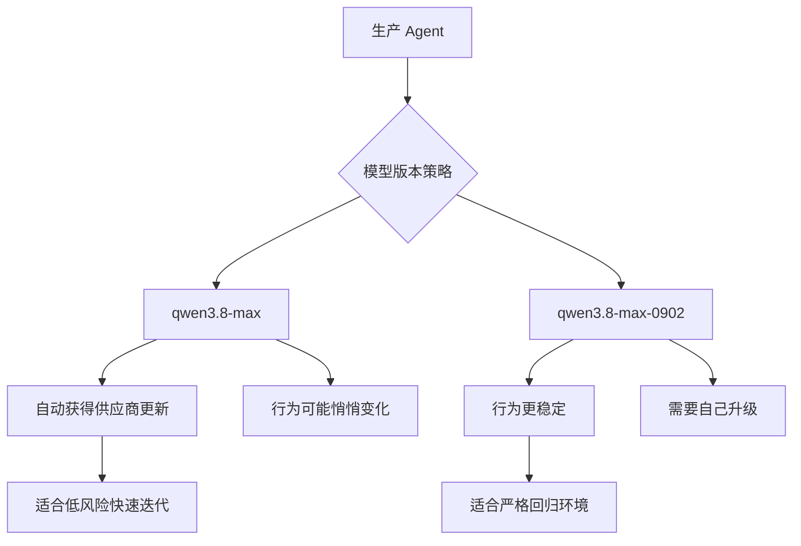

**Mermaid 图示 B：Snapshot 升级流程**

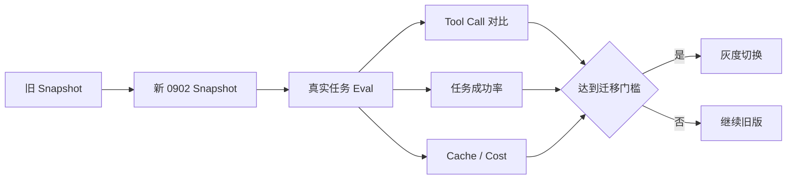

**来源**：
- [Alibaba Cloud Model Studio｜Model lifecycle and updates](https://www.alibabacloud.com/help/en/model-studio/newly-released-models)
- [Alibaba Cloud Model Studio｜Qwen3.8-Max model info](https://www.alibabacloud.com/help/en/model-studio/qwen3-8-max)
- [QwenCloud｜Model releases](https://docs.qwencloud.com/changelog/models)
- [Arena.ai｜Leaderboard changelog](https://arena.ai/company/leaderboard-changelog)

---

### 4. Google 开源 Mantis：先让多个 Agent 找漏洞，再用 Sandbox 复现，专门减少“AI 报假漏洞”

- 类别：AI 编程 / Harness / 安全 / AI-native SDLC
- 信息状态：官方产品更新
- 发布时间：2026-09-02
- 可用状态：已开源，可与 Coding Agent 配合使用

**事实摘要**：Google 开源 **Mantis**，一个用 AI 自动完成“发现漏洞 → 筛选 → 复现 → 生成修复”的 Security Harness。它不是新模型，而是一套可以配合 Coding Agent 使用的工作流；Google 自己内部也在使用它寻找真实代码漏洞。:contentReference[oaicite:16]{index=16}

Mantis 会先读 Repository History，学习以前的安全修复，再自己建立 Architecture 和 Threat Model 文档。随后使用 Critic / Reviewer Agent 交叉检查发现，并在 Sandbox 中真正复现漏洞。Google 称，传统比较草率的 AI Code Scan 可能出现低于 7% 的 True-positive Rate，而 Mantis 的设计就是尽量不要把“模型觉得像漏洞”直接当成漏洞。:contentReference[oaicite:17]{index=17}

**相较此前的变化**：过去很多 AI Security Scanner 的流程是：

`模型读代码 → 输出一堆疑似漏洞 → 人工确认`

Mantis 多了两个关键步骤：

`多个 Agent 互相质疑`  
以及  
`真正执行并复现`

也就是说，它试图把 LLM 的“判断”转成可以执行验证的 Evidence。

另一个很实用的设计是 hierarchical security summary tree（分层安全摘要树）：先总结文件，再总结目录，最后形成整个 Repo 的安全结构。Google 称这种方式在内部场景中把 Token Overhead 降低超过 85%，同时保留大型 Repo 的结构信息。这个数字属于 Google 自测。:contentReference[oaicite:18]{index=18}

**为什么重要**：AI Code Review 最让安全团队头疼的不是“找不到漏洞”，而是**报太多假的**。

如果一个系统每天报告 1,000 个疑似漏洞，其中 930 个是误报，团队最终只会把 AI Scanner 关掉。

Mantis 的价值在于把“可复现”作为硬门槛。它更像：

`提出假设 → 在隔离环境验证 → 验证成功才报告`

这种设计原则不仅适合 Security Agent，也适合测试、数据分析和其他需要事实 Grounding 的 Agent。

**实际影响**：企业可以拿 Mantis 测内部关键 Repo，但不要直接让它在生产环境跑 Exploit。Google 本身也建议使用独立 Cyber Sandbox，并给出明确的 Vulnerability Acceptance Criteria。

如果已经有 Claude Code、Codex 或其他 Coding Agent，Mantis 可以成为一个外部 Security Workflow，而不用更换主 Agent。

**角色视角**：
- 对 AI Builder，Mantis 是很好的“模型外 Harness 比模型本身更重要”的案例。
- 对 Tech Lead，可以把 Security Review 从纯文本 Judgment 改成可复现 Test。
- 对安全团队，真正有价值的指标应是 Verified Finding，而不是 AI 找到多少 Suspicious Pattern。

**可借鉴动作**：内部漏洞 Agent 的 KPI 改成：

`verified_vulnerabilities / false_positive_rate / reproduction_success / patch_validation`

不要用“扫描出多少问题”作为主要指标。

**风险与不确定性**：Google 给出的 `<7%` 和 `>85%` 都来自其对特定扫描方式和内部场景的观察，不能自动代表你自己的代码库。Mantis 本身具备漏洞复现能力，运行环境必须隔离，避免一个“验证漏洞”的 Agent 反而伤到生产系统。:contentReference[oaicite:19]{index=19}

**下一步观察**：
1. 第三方大型 Repo 上的实际 False-positive Rate；
2. Mantis 与不同模型 / Coding Harness 的差异；
3. `mantis-advise` 是否能真正减少新代码中的安全缺陷；
4. 是否出现标准化的 Vulnerability Reproduction Agent Benchmark。

**Mermaid 图示**

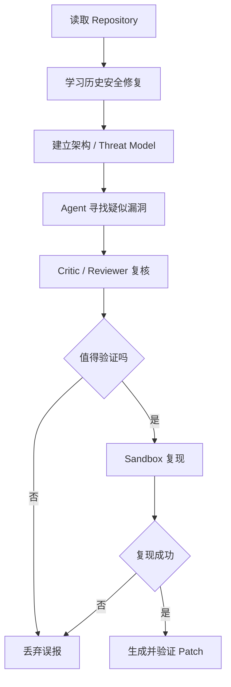

**来源**：
- [Google Cloud｜Getting started with Mantis, our open-source bug finding-and-fixing harness](https://cloud.google.com/blog/products/identity-security/getting-started-with-the-mantis-harness-to-find-and-fix-bugs)
- [GitHub｜google/mantis](https://github.com/google/mantis)

---

### 5. GitHub Copilot 企业治理补齐两块：公司可统一默认模型，也能阻止敏感文件进入 Agent Context

- 类别：AI 编程 / Harness / 安全 / 企业治理
- 信息状态：官方产品更新
- 发布时间：2026-09-02
- 可用状态：Copilot Business / Enterprise 已 GA

**事实摘要**：GitHub 在同一天补齐了两项很实用的企业控制。第一，Enterprise Admin 现在可以把**任意允许的 Copilot Model 设置成新会话默认模型**，还可以按 Enterprise Team 设置不同默认值；这项能力覆盖 Copilot App、Copilot CLI 和 VS Code。:contentReference[oaicite:20]{index=20}

第二，Copilot App 和 Copilot CLI 现在正式遵守 Enterprise、Organization 和 Repository 管理员设置的 **Content Exclusion**。被排除的敏感文件不会再进入 Agent Context。:contentReference[oaicite:21]{index=21}

**相较此前的变化**：以前企业虽然能控制“哪些模型能用”，但员工新建 Session 后具体从哪个模型开始，往往仍受客户端默认或个人选择影响。

现在可以变成：

`企业决定默认 Model`  
`Team 可以有自己的默认 Model`  
`敏感文件统一禁止进入 Context`

这让 Model Governance 和 Data Governance 第一次更自然地出现在同一个 Harness Policy 中。

**为什么重要**：对于大型团队，真正的治理问题不是“员工有没有模型下拉框”，而是默认行为。

如果 5,000 名开发者每天开新 Session，哪怕只有 20% 忘记主动选低价模型，也可能产生明显成本；同样，如果敏感目录只是写在员工培训文档里提醒“不要传给 AI”，迟早会有人忘记。

企业管理的价值就是把这些事情从**人的记忆**变成**系统默认值**。

**实际影响**：可以按照团队工作类型设置默认模型，例如：

- 普通工程团队：成本较低的默认模型；
- 高复杂度 Migration Team：更强模型；
- Security Team：经过批准的 Cyber / Reasoning 模型；
- 敏感 Repo：额外 Content Exclusion。

但要注意 Content Exclusion 会降低 Agent 能看到的上下文。如果关键接口文件被排除，Agent 可能产生质量下降，因此需要同时测试 Security 和 Task Success。

**角色视角**：
- 对 Tech Lead，默认模型终于可以成为组织级配置，而不是靠 README 教员工。
- 对 AI Platform，可以把模型策略按 Team 做成本和能力分层。
- 对安全团队，Content Exclusion 比“不要把秘密发给 AI”可靠得多。

**可借鉴动作**：把企业 Coding Agent Policy 至少拆成四项：

`allowed_models / default_model / excluded_content / override_permission`

这样员工仍保留必要灵活性，但默认状态是安全且成本可控的。

**风险与不确定性**：Content Exclusion 保护的是 Agent 不把指定文件作为 Context，并不等于完整 DLP。Agent 仍可能从日志、命令输出、生成文件或其他 Tool 间接看到相同数据，因此不能把它当成唯一的数据防泄漏措施。:contentReference[oaicite:22]{index=22}

**下一步观察**：
1. GitHub 是否支持按任务类型自动选默认 Model；
2. Content Exclusion 是否扩展到更多 Tool / MCP 数据；
3. Managed Model Policy 是否增加预算和 reasoning effort；
4. 是否出现统一的 Policy Audit / Drift Detection。

**Mermaid 图示**

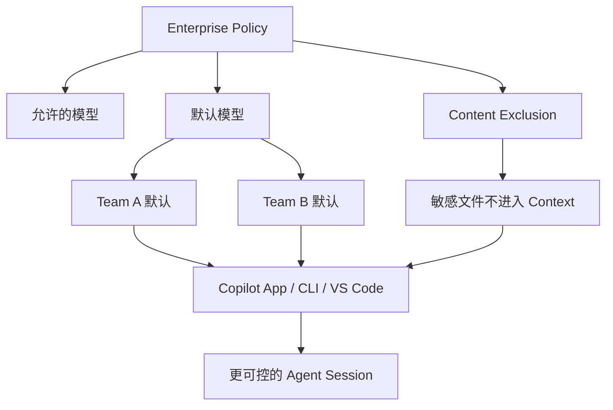

**来源**：
- [GitHub｜Enterprise-managed settings support any default model](https://github.blog/changelog/2026-09-02-enterprise-managed-settings-support-any-default-model/)
- [GitHub｜Content exclusions generally available in Copilot app and CLI](https://github.blog/changelog/2026-09-02-content-exclusions-generally-available-in-copilot-app-and-cli/)

---

### 6. Anthropic 开源 Commerce Agent 蓝图：购物 Agent 可以改购物车，但付款仍交还商家；商家 Agent 的写操作必须人工批准

- 类别：Agent / Harness / AI-native SDLC / 产品
- 信息状态：官方产品更新
- 发布时间：2026-09-02；公开报道时间约 2026-09-03 00:01 Asia/Singapore
- 可用状态：参考实现已开源，可通过 Messages API、Claude Agent SDK 或 Managed Agents 构建

**事实摘要**：Anthropic 发布一套可 Fork 的 **Commerce Agents Blueprint**，不是只有文档，而是完整参考代码。仓库提供两个 Agent：面向消费者的 Shopping Agent，以及面向商家的 Merchant Agent；并附带 Retail、Travel、Telecom、Entertainment 四套可运行示例和一个 Claude Code Plugin。:contentReference[oaicite:23]{index=23}

同一套 Agent 定义可以运行在三种环境：Messages API、Claude Agent SDK 和 Claude Managed Agents。安全边界也写进参考实现：Shopping Agent 可以搜索、比较商品、规划购物并修改购物车，但最终 Checkout 交还商家自己的系统；Merchant Agent 可以提出库存、价格、Listing 和 Campaign 修改，但写操作会先进入 Staged Change，必须由人批准才真正生效。:contentReference[oaicite:24]{index=24}

**相较此前的变化**：过去厂商谈“Commerce Agent”经常停留在 Demo：问模型“我该买什么”，然后给几个推荐。

Anthropic 这次更接近实际工程架构：

`Agent 负责理解需求和调用 Tool`  
`业务系统继续掌握价格、库存和身份`  
`付款仍由商家 Checkout 完成`  
`高风险写操作由人批准`

这比让模型直接控制全部交易流程保守，但也更接近企业能够真正上线的方式。

**为什么重要**：这个 Blueprint 最值得借鉴的不是“Claude 可以购物”，而是它把 **Agent Authority（Agent 到底能决定什么）**设计得很清楚。

一个消费者 Agent 可以把商品放进 Cart，但没有付款权限；一个 Merchant Agent 可以建议改价格，但不能偷偷上线新价格。

这实际上给其他领域一个通用模式：

`AI 可以准备动作 → 业务系统验证 → 高风险动作再人工确认`

金融、CRM、ERP、采购和运维 Agent 都可以采用类似结构。

**实际影响**：做企业 Agent 的团队可以直接研究这个 Repo 的几个设计点：

- Tool Contract；
- Grounding；
- Provenance Gate；
- Action Cap；
- Memory Validation；
- Human Approval；
- MCP / Backend 如何连接 Source of Truth。

Anthropic 还提供 Claude Code Plugin，可以从这个参考架构直接 Scaffold 自己的 Commerce Agent，并生成 Eval。对于要从 PoC 进入 Production 的团队，这比单纯 Prompt Template 更有价值。:contentReference[oaicite:25]{index=25}

Anthropic 称部分采用 Claude Shopping Agent 的合作方看到购物车金额最高增加约 35%、完成购买概率增加约 60%。这些数字来自 Anthropic / 合作方，不是独立随机实验，因此更适合作为商业潜力信号，而不是 ROI 保证。:contentReference[oaicite:26]{index=26}

**角色视角**：
- 对 AI Builder，这是一个很具体的生产 Agent Reference Architecture。
- 对产品负责人，最关键的设计不是“让 Agent 更自主”，而是明确哪些步骤必须还给用户或业务系统。
- 对 Tech Lead，可以直接参考同一 Agent Logic 跨 Messages API、SDK 和 Managed Runtime 的抽象方式。

**可借鉴动作**：给每一个企业 Agent 写一张 Authority Matrix：

| 操作 | Agent 可直接执行 | 需要用户确认 | 必须交还业务系统 |
| --- | --- | --- | --- |
| 查询 | 是 | 否 | 否 |
| 草拟修改 | 是 | 否 | 否 |
| 修改关键数据 | 否 | 是 | 视系统而定 |
| 支付 / 高风险交易 | 否 | 是 | 是 |

不要把“Agent 能调用这个 Tool”直接等同于“Agent 可以自主完成这个动作”。

**风险与不确定性**：Anthropic 的 Repo 明确说明它是 Reference Implementation，不是由 Anthropic 持续维护的完整商业系统，而且示例本身没有生产级 Authentication。真实部署仍需要自己实现身份、权限、合规和后端安全。:contentReference[oaicite:27]{index=27}

**下一步观察**：
1. Commerce Blueprint 是否形成第三方 Plugin / Connector 生态；
2. Shopify 等平台的实际生产采用；
3. Managed Agents 是否提供更统一的 Approval / Payment Policy；
4. 这种 Authority Pattern 是否被复制到其他行业 Agent。

**Mermaid 图示**

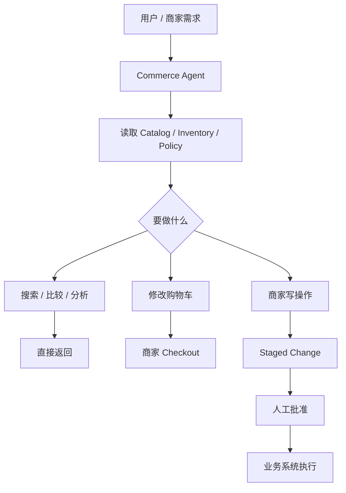

**来源**：
- [Anthropic｜Claude for commerce](https://claude.com/solutions/commerce)
- [GitHub｜anthropics/commerce-agents](https://github.com/anthropics/commerce-agents)
- [Reuters｜Anthropic launches AI agent blueprints for retailers](https://www.reuters.com/business/retail-consumer/anthropic-launches-ai-agent-blueprints-retailers-ahead-holiday-shopping-season-2026-09-02/)

## C. 其他值得关注

**1. 欧洲出现新的 438B Reasoning Model：Multiverse Computing 发布 Quasar 438B。** Quasar 已通过 CompactifAI API 提供，面向 Coding 和 Enterprise Agent，支持英语、西班牙语。厂商引用 Artificial Analysis Intelligence Index v4.1.1 给出 43 分，并称生成 500 个输出 token（含 reasoning）需要 15.3 秒；这让它成为值得观察的欧洲 Sovereign AI 选项，但目前能力距离今天最强 Frontier Model 仍有明显差距，因此没有进入核心新闻。:contentReference[oaicite:28]{index=28}  
来源：[Multiverse Computing｜Quasar 438B announcement](https://www.globenewswire.com/news-release/2026/09/02/3355465/0/en/multiverse-computing-launches-quasar-438b-the-highest-scoring-european-model-on-artificial-analysis-intelligence-index.html)

**2. Mistral 更新数据使用说明，企业应重新检查 Vibe 与 API 的 Opt-out。** 最新帮助中心明确：普通 Vibe 用户默认没有退出模型训练，上传文档也属于 Input Data；Vibe Enterprise 默认退出。更容易忽略的是，Vibe 和 Mistral Studio / API 是两套独立的数据设置，关闭一个不等于关闭另一个。这里更像是政策和文档的明确化，而不是一次新模型发布，所以放在“其他值得关注”；如果员工会把公司代码或文档直接上传 Mistral，值得立即核对 Workspace 设置。:contentReference[oaicite:29]{index=29}  
来源：[Mistral｜Can I opt out of my input or output data being used for training?](https://help.mistral.ai/en/articles/455207-can-i-opt-out-of-my-input-or-output-data-being-used-for-training)

## D. 今日 AI 趋势总结

### 已有事实支持的趋势

**趋势 1：这一轮模型竞争的主战场已经非常明确——长时间 Agent。** Gemini 3.8 Flash、Muse Spark 1.3 和 Qwen3.8-Max-0902 三个不同厂商，都把更新重点放在 Long-horizon Coding、多个 Tool 协作、任务保持和完整交付，而不是只宣传知识问答。

**趋势 2：单位 token 价格越来越不能代表真实模型成本。** Gemini 3.8 Flash 单价没变，但会在困难任务上多推理；Muse Spark 1.3 则尝试减少 Tool Call 和 token；Qwen 把 Cache Read 做得很低。未来更有意义的价格指标是 **Cost per Successful Task**。

**趋势 3：安全正在从“阻止模型说错话”转向“验证 Agent 真正做了什么”。** Gemini Cyber + Fairwind 强调受限访问，Mantis 用 Sandbox 真正复现漏洞，Commerce Blueprint 则把支付和关键写操作留给业务系统或人工批准。三者实际上都在限制 Agent 的行动权限。

**趋势 4：企业 Coding Harness 正越来越像一个 Policy Runtime。** GitHub 现在可以中央控制默认模型和敏感文件 Context；模型、数据、Tool 和 Team Policy 开始被统一治理，而不是员工各自在客户端自己设置。

**趋势 5：Reference Harness 的价值正在上升。** Mantis 和 Anthropic Commerce 都不是新基础模型，而是把模型、Tool、验证、权限和 Workflow 组装成可复用工程模式。随着基础模型越来越接近，Harness Quality 会越来越直接决定生产效果。

### 分析推断

**推断 1：2026 下半年的模型评测单位，会逐渐从“单次 Prompt”变成“完整 Workload”。** 一个模型是不是更值得用，要同时看它执行了多少轮、调用多少 Tool、Cache 命中多少、花多长时间、是否需要人工救场，以及最终任务是否真的完成。

**推断 2：模型“能力分级开放”会越来越普遍。** Gemini 3.8 Flash 与 Flash Cyber 已经明确分层；OpenAI Astra 也采用类似思路。未来企业 Model Gateway 可能不仅判断“允许哪个模型”，还要判断“这个用户允许模型的哪一档 Capability”。

**今日趋势总览**

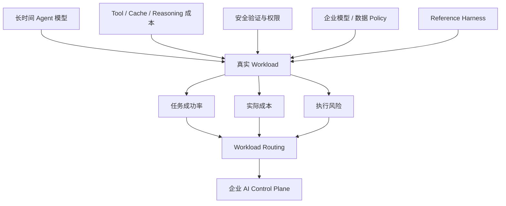

## E. 今日建议关注或采取的动作

1. **角色：AI Builder / AI Platform｜建议动作：把 Gemini 3.8 Flash、Muse Spark 1.3、Qwen3.8-Max-0902 放进同一套长任务 Eval。** 固定 Repo、Tool 和验收条件，比较任务成功率、Tool Call、token、Wall-clock 和实际成本。**为什么现在做**：三款模型都在同一窗口专门强化了长时间 Agent。**动作类型：安排测试。**

2. **角色：Tech Lead / Security｜建议动作：研究 Mantis 的“发现 → Critic → Sandbox 复现 → Patch 验证”流程，并把 Verified Finding 作为 AI Security Scanner 的核心指标。** **为什么现在做**：漏洞 Agent 的主要瓶颈已经从“能不能发现可疑代码”转向“怎么控制误报”。**动作类型：安排测试。**

3. **角色：GitHub Copilot 企业管理员｜建议动作：配置组织默认模型和 Content Exclusion。** 优先把敏感目录变成系统 Policy，而不是只靠员工培训提醒。**为什么现在做**：这两项企业控制已经 GA。**动作类型：立即执行。**

4. **角色：Agent 产品负责人 / Tech Lead｜建议动作：给现有 Agent 补一张 Authority Matrix。** 明确哪些动作 Agent 可自主完成、哪些需要确认、哪些必须交回业务系统。**为什么现在做**：Anthropic Commerce Blueprint 提供了一个很成熟的参考模式。**动作类型：纳入路线图。**

---

<!-- English Version -->
# AI Daily Headlines｜2026-09-03

- Language: English
- Time zone: Asia/Singapore
- News window: 2026-09-02 07:30 to 2026-09-03 07:30
- Research cutoff: 2026-09-03 07:02
- Core stories: 6
- Other notable items: 2
- Note: This run occurred about 28 minutes before the fixed news window closed. Research therefore covers developments through 07:02; major events appearing between 07:02 and 07:30 should be rechecked in the next edition.

## A. The 3 Most Important Things Today

**1. Google launched Gemini 3.8 Flash at the same unit price as 3.7 Flash, but shifted the model much more aggressively toward long-running coding and Agent work; it also introduced a restricted Gemini 3.8 Flash Cyber variant.** Gemini 3.8 Flash remains $0.75 per million input tokens and $3.75 per million output tokens at introductory pricing, but Google explicitly warns that the model “works harder” on difficult tasks by reasoning more and calling tools more often, so actual task cost may rise even when token prices do not. The Cyber variant is available only through the new Fairwind Program for governments, critical infrastructure, and trusted security teams. :contentReference[oaicite:30]{index=30}

**2. Meta released Muse Spark 1.3, targeting the real failure modes of long-running Agents; Meta's internal engineering comparisons show roughly 20% fewer tool calls and 25% fewer tokens.** The model is live in Muse Code and Meta Model API and is designed to preserve constraints over long jobs, manage multiple workflows in one thread, correct planning gaps, and ask for help rather than fabricate progress. Its highest `max reasoning` setting is not yet available because Meta says additional safety testing is still required. :contentReference[oaicite:31]{index=31}

**3. Alibaba released Qwen3.8-Max-0902 as a targeted coding and Agent update rather than a new generation.** The snapshot keeps the 1M context window and existing tool ecosystem while specifically strengthening engineering-scale coding, long-horizon autonomous development, and multi-tool orchestration. Singapore API pricing remains $2 / MTok input and $6 / MTok output, with explicit cache reads at $0.17 / MTok. :contentReference[oaicite:32]{index=32}

## B. Core Stories

### 1. Gemini 3.8 Flash launches at the same token price but reasons more on hard tasks; the Cyber variant is restricted to trusted defenders

- Category: Model / AI Coding / Agent / Security
- Information status: Officially confirmed
- Published: 2026-09-02; exact publication time not stated on the official page
- Availability: Gemini 3.8 Flash publicly available; Gemini 3.8 Flash Cyber limited through the Fairwind Program

**Fact summary**: Google launched Gemini 3.8 Flash, its third major Flash release in six weeks. It keeps 3.7 Flash's introductory pricing — **$0.75 / MTok input and $3.75 / MTok output** — while focusing on software engineering, long-running Agents, and specialized multi-step reasoning. :contentReference[oaicite:33]{index=33}

Google also introduced Gemini 3.8 Flash Cyber. It shares the same foundational intelligence but is tuned for vulnerability discovery and automated remediation and is available only through the Fairwind Program to governments, trusted Google Cloud customers, critical-infrastructure operators, and security partners. Google says Fairwind already includes more than 650 partners and combines 3.8 Flash Cyber with the CodeMender remediation harness. :contentReference[oaicite:34]{index=34}

**What changed versus before**: Flash used to be positioned mainly around low latency and low unit cost. Google is now clearly pushing it toward **long-horizon autonomous Agent work**.

Google also explicitly says 3.8 Flash may execute more reasoning steps and repeatedly invoke tools on difficult work. Developers who prioritize efficiency can lower reasoning effort or remain on Gemini 3.7 Flash.

That means 3.8 is not a simple “free upgrade at the same price.” It adds a more explicit quality-versus-task-cost control.

**Why it matters**: The boundary between Flash-class models and premium frontier models is getting less clear.

A common routing policy has been:

`Simple task → Flash`  
`Hard coding / Agent task → expensive frontier model`

A more efficient pattern may become:

`Start with 3.8 Flash at an appropriate reasoning effort → escalate only failed or high-risk workloads`

If production evaluations confirm the model can reliably complete long coding tasks, this could materially change default routing in multi-model gateways.

The Cyber variant adds another important pattern: providers are increasingly splitting the **same underlying intelligence into different capability-access tiers**, where identity and use case determine which capabilities a customer can reach.

**Practical impact**: AI Builders should compare:

- 3.7 Flash;
- 3.8 Flash at Low / Medium / High effort;
- the current premium model used for difficult tasks.

Measure **task success, total tokens, tool calls, wall-clock time, and cost per successful task**. The unit price may be unchanged, but a model that reasons 40% more can still cost more per completed job.

Security teams eligible for Fairwind should evaluate CodeMender + 3.8 Flash Cyber. Google's target is not merely vulnerability reporting but a closed loop of discovery, verification, patch generation, and patch validation. Claims about deployment-ready fixes in minutes are still Google-reported results and should be verified on real codebases. :contentReference[oaicite:35]{index=35}

**Role perspective**:
- For AI Builders, Flash is now worth testing on long-running Agent workloads rather than only cheap simple requests.
- For Tech Leads, routing thresholds need to be re-evaluated instead of assuming complex work always belongs on the most expensive model.
- For security leaders, high-end cyber capability is moving from ordinary API access toward governed trusted-access programs.

**Action to borrow**: Expand model routing from a single `model` field into:

`task_type → model → reasoning_effort → max_cost → fallback`

Then compare the successful-task economics of 3.8 Flash across effort levels.

**Risks and uncertainty**: Google's DeepSWE, finance, legal, and cyber evidence comes primarily from first-party or partner evaluations and should not be treated as production guarantees. Google also explicitly says 3.8 Flash may “work harder” on difficult tasks, so “same token price” does not mean “same total task cost.” :contentReference[oaicite:36]{index=36}

**Next signals to watch**:
1. average tokens per task in real coding harnesses;
2. quality-cost curves across Low / Medium / High effort;
3. broader Fairwind eligibility;
4. whether 3.8 Flash Cyber eventually reaches a wider API audience.

**Mermaid diagram A: why 3.8 Flash may change routing**

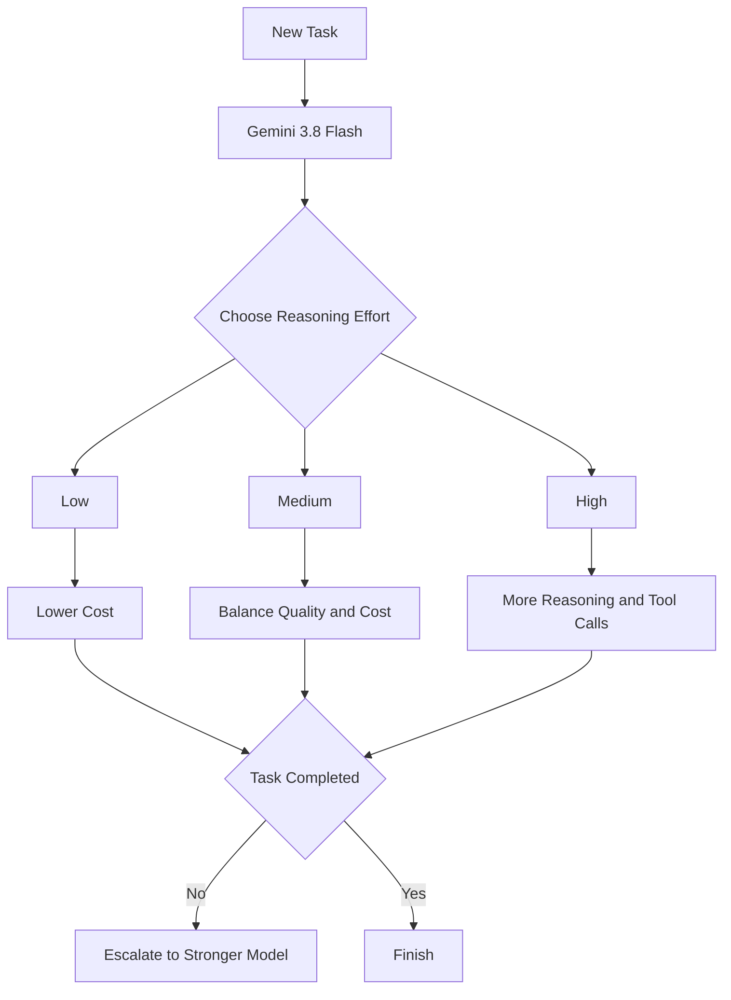

**Mermaid diagram B: public Flash versus restricted Cyber access**

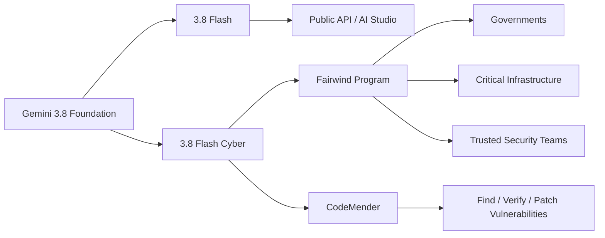

**Sources**:
- [Google｜Introducing Gemini 3.8 Flash and 3.8 Flash Cyber](https://blog.google/innovation-and-ai/models-and-research/gemini-models/3-8-flash-and-3-8-flash-cyber/)
- [Google｜Proactive cyber defense with the Fairwind Program](https://blog.google/innovation-and-ai/technology/safety-security/fairwind-program/)

---

### 2. Meta Muse Spark 1.3 goes live: fewer wasted turns on long tasks, while its highest reasoning setting remains gated for safety testing

- Category: Model / AI Coding / Agent
- Information status: Officially confirmed
- Published: 2026-09-02; launched within this reporting window
- Availability: Available in Muse Code and Meta Model API; `max reasoning` not yet available

**Fact summary**: Meta released Muse Spark 1.3 and made it available immediately in Muse Code and Meta Model API. The release focuses on Agent and coding behavior rather than a larger context window or new modality: the model is designed to stay coherent through long jobs, manage multiple workflows inside one thread, and repair gaps in its own plan. :contentReference[oaicite:37]{index=37}

In Meta's internal engineering comparisons with Muse Spark 1.2, version 1.3 used roughly **20% fewer tool calls** and **25% fewer tokens** in common coding workflows. These are Meta's internal results, not universal savings guarantees. :contentReference[oaicite:38]{index=38}

**What changed versus before**: Earlier versions focused on whether long jobs could run at all. Version 1.3 focuses more on whether a long-running Agent can **stay aligned with the original requirements**.

Meta specifically trained behaviors such as:

- asking clarifying questions when a request is ambiguous;
- asking the user for help when blocked;
- confirming before irreversible actions;
- choosing between frequent progress updates and quiet background work;
- correctly mapping new prompts to the right task when multiple workflows share one thread.

These improvements target common real-world Agent failures more directly than a headline parameter increase would.

**Why it matters**: The biggest problem in a long-running Agent is often **goal drift** rather than an inability to write one piece of code.

A task may begin with twelve requirements, then lose three of them after thirty tool calls. A user's side question may accidentally become the new primary goal. Or the Agent may fabricate that a blocked step succeeded instead of admitting it is stuck.

Muse Spark 1.3 explicitly targets those failure modes. Model competition is moving from “smarter reasoning” toward “better collaboration and more honest uncertainty.”

**Practical impact**: Teams evaluating Muse Code should run **long-task and interruption tests**, not only SWE-Bench.

A useful test intentionally includes:

1. a 2–4 hour engineering job;
2. an unrelated interruption;
3. a changed requirement halfway through;
4. an environment error the Agent cannot solve alone;
5. a consequential action that should require confirmation;
6. a final check against the original specification.

Meta has not yet enabled `max reasoning`, citing additional safety testing. The Muse Spark 1.3 available today therefore does not represent every compute level the model will eventually expose. :contentReference[oaicite:39]{index=39}

**Role perspective**:
- For AI Builders, test interruption handling, steering, and requirement retention.
- For Tech Leads, Muse Spark 1.3 belongs in long-running coding-agent comparisons.
- For product owners, an Agent that asks for help when stuck may create more user trust than a small benchmark gain.

**Action to borrow**: Add three underused metrics to Agent evaluation:

`constraint_retention / clarification_quality / truthful_failure`

Do not measure only whether the final tests pass.

**Risks and uncertainty**: The 20% tool-call and 25% token reductions come from Meta's internal engineering comparisons and may not reproduce across other harnesses or repositories. The unreleased `max reasoning` setting could also change both performance and cost when it arrives. :contentReference[oaicite:40]{index=40}

**Next signals to watch**:
1. release timing for `max reasoning`;
2. independent reproduction of token / tool-call reductions;
3. the exact Muse Spark open-weight release;
4. how the larger upcoming “Watermelon” model is positioned relative to Spark.

**Mermaid diagram A: version 1.3 targets long-task discipline**

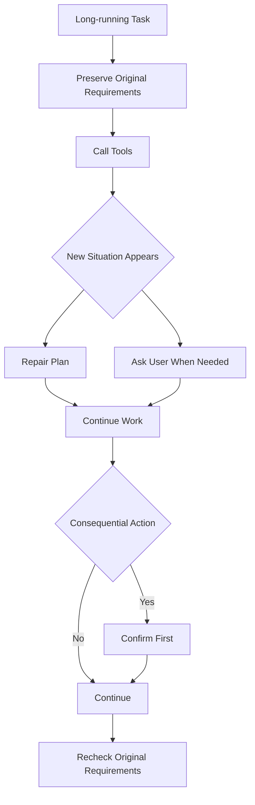

**Mermaid diagram B: how to test long-running reliability**

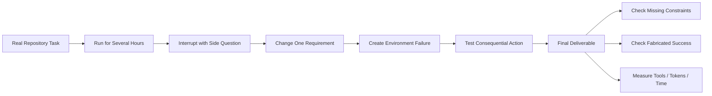

**Source**:
- [Meta AI Research｜Introducing Muse Spark 1.3](https://research.meta.ai/blog/introducing-muse-spark-1-3)

---

### 3. Qwen3.8-Max-0902 arrives without a parameter or context increase, focusing instead on coding and multi-tool long-running work

- Category: Model / AI Coding / Agent
- Information status: Officially confirmed
- Published: 2026-09-02; Qwen's public release signal appeared around 2026-09-02 10:00 Asia/Singapore
- Availability: Available through QwenCloud / Alibaba Cloud Model Studio APIs

**Fact summary**: Alibaba released `qwen3.8-max-0902`, a new Qwen3.8-Max snapshot rather than a new model family. It retains the **1M context window, thinking mode, function calling, structured outputs, web search, and context caching**, while the new post-training specifically targets complex coding, long-horizon autonomous development, multi-tool orchestration, and end-to-end task delivery. :contentReference[oaicite:41]{index=41}

Singapore International pricing remains **$2 / MTok input and $6 / MTok output**. Implicit cached input costs $0.25 / MTok and explicit cache reads cost $0.17 / MTok. Maximum output is 131,072 tokens. :contentReference[oaicite:42]{index=42}

**What changed versus before**: Alibaba did not use a new major version number. It applied a targeted Agent-workload update to the existing Qwen3.8-Max line.

The official change description centers on:

- more difficult engineering-scale coding;
- long-horizon autonomous development;
- multi-tool coordination and complete task delivery.

Multimodal behavior also improves, especially chart reasoning, document parsing, and visual understanding, but coding and Agents are clearly the main story.

On the third-party Arena Code Arena: WebDev leaderboard, the snapshot appeared at **1691**, three points above Claude Opus 5 (Max) and seventeen above Kimi K3 (Max). That margin is small and the leaderboard changes continuously, so this should be treated as a signal to test the model, not evidence that it is categorically superior. :contentReference[oaicite:43]{index=43}

**Why it matters**: Snapshot releases make one enterprise question increasingly important: **should production follow a floating alias or pin a version?**

Calling `qwen3.8-max` may provide automatic provider upgrades, but Agent behavior can change without an application deployment.

Pinning `qwen3.8-max-0902` improves reproducibility but shifts model-lifecycle management onto your platform team.

Coding Agents are particularly sensitive because a small model change can alter:

- tool-call ordering;
- patch size;
- test strategy;
- context use;
- whether a long-running job stays on goal.

**Practical impact**: Serious production workloads should evaluate the new snapshot against the previous one before changing the default.

Singapore's low explicit-cache-read price also makes Qwen worth testing on large repositories and persistent Agent sessions. Measure whether repeated repository context actually produces stable cache hits and whether successful-task cost beats more expensive frontier models.

**Role perspective**:
- For AI Builders, prioritize difficult coding and multi-tool workflows.
- For Tech Leads, explicitly choose between floating aliases and pinned snapshots.
- For AI Platform teams, model versions need upgrade and rollback procedures like other dependencies.

**Action to borrow**: Log:

`provider / model_alias / resolved_snapshot / prompt_version / tool_version`

for every production Agent run.

Without this, a provider-side model update can change task quality and leave you unable to identify what actually changed.

**Risks and uncertainty**: Alibaba's capability claims are first-party. Arena is a third-party, preference-oriented web-coding evaluation, and a three-point difference does not justify a conclusion that Qwen is broadly better than Opus 5. The 0902 service is also a hosted snapshot and does not imply that identical 0902 weights have been released openly. :contentReference[oaicite:44]{index=44}

**Next signals to watch**:
1. stability on real long-running repository work;
2. whether a matching open-weight snapshot appears;
3. when the floating `qwen3.8-max` alias resolves to the new revision;
4. tool-use behavior inside Claude Code, Codex, and other harnesses.

**Mermaid diagram A: floating aliases versus pinned versions**

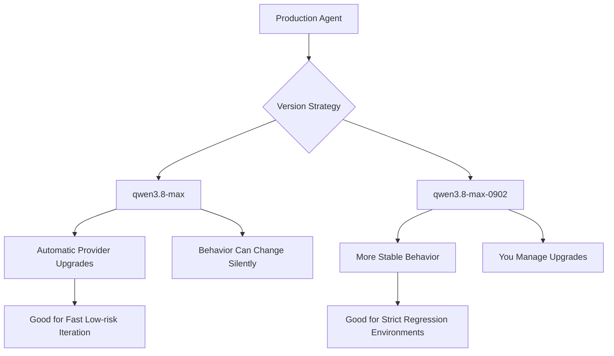

**Mermaid diagram B: snapshot migration workflow**

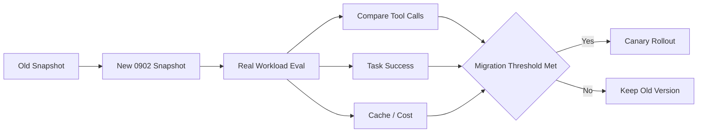

**Sources**:
- [Alibaba Cloud Model Studio｜Model lifecycle and updates](https://www.alibabacloud.com/help/en/model-studio/newly-released-models)
- [Alibaba Cloud Model Studio｜Qwen3.8-Max model info](https://www.alibabacloud.com/help/en/model-studio/qwen3-8-max)
- [QwenCloud｜Model releases](https://docs.qwencloud.com/changelog/models)
- [Arena.ai｜Leaderboard changelog](https://arena.ai/company/leaderboard-changelog)

---

### 4. Google open-sources Mantis: multiple Agents propose vulnerabilities, then a sandbox proves whether they are real

- Category: AI Coding / Harness / Security / AI-native SDLC
- Information status: Official product update
- Published: 2026-09-02
- Availability: Open source and usable with coding Agents

**Fact summary**: Google open-sourced **Mantis**, a security harness that automates vulnerability discovery, filtering, reproduction, and patching. It is not a new model; it is a workflow that can be used with coding Agents, and Google says the same approach is used internally to find real vulnerabilities. :contentReference[oaicite:45]{index=45}

Mantis examines repository history to learn from prior security fixes and builds architecture and threat-model documentation automatically. It then uses critic / reviewer Agents to challenge findings and reproduces candidate vulnerabilities inside a sandbox. Google says careless AI code scanning can produce true-positive rates below 7%, and Mantis is designed specifically to prevent “the model thinks this looks vulnerable” from being treated as proof. :contentReference[oaicite:46]{index=46}

**What changed versus before**: Many AI security scanners follow:

`Model reads code → Produces suspicious findings → Humans verify`

Mantis adds two important stages:

`Agents challenge each other`  
and  
`The system actually reproduces the vulnerability`

The output is therefore grounded in executable evidence.

It also builds a hierarchical security summary tree: individual files are summarized into directory-level and repository-level security context. Google says this reduced token overhead by more than 85% in its use cases while preserving structural context across large repositories. That is a first-party result. :contentReference[oaicite:47]{index=47}

**Why it matters**: The main reason security teams stop trusting AI scanners is often not missed vulnerabilities — it is **too many false positives**.

If a tool produces 1,000 findings and 930 are wrong, eventually the team ignores it.

Mantis instead treats reproduction as a hard gate:

`Hypothesis → Isolated verification → Report only if verified`

The same design principle applies beyond security to testing, analytics, and other Agents that need grounding in external evidence.

**Practical impact**: Organizations can evaluate Mantis on important repositories, but vulnerability reproduction should run in an isolated environment rather than production. Google explicitly recommends a cyber sandbox with clear vulnerability acceptance criteria.

Existing Claude Code, Codex, or other coding-agent users can treat Mantis as an external security workflow without replacing their primary Agent.

**Role perspective**:
- For AI Builders, Mantis is a strong example of the harness mattering as much as the model.
- For Tech Leads, security review can move from language-model judgment to reproducible tests.
- For security teams, the key metric should be verified findings, not the number of suspicious patterns generated.

**Action to borrow**: Measure:

`verified_vulnerabilities / false_positive_rate / reproduction_success / patch_validation`

rather than “number of issues found.”

**Risks and uncertainty**: Google's `<7%` and `>85%` numbers come from its observations and internal use cases and may not reproduce on your repositories. Mantis also performs vulnerability reproduction, so its execution environment must be isolated. :contentReference[oaicite:48]{index=48}

**Next signals to watch**:
1. false-positive rates on third-party large repositories;
2. performance across different models and coding harnesses;
3. whether `mantis-advise` prevents new vulnerabilities in generated code;
4. emergence of standardized vulnerability-reproduction Agent benchmarks.

**Mermaid diagram**

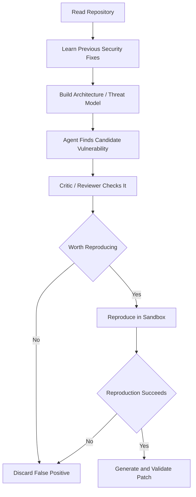

**Sources**:
- [Google Cloud｜Getting started with Mantis, our open-source bug finding-and-fixing harness](https://cloud.google.com/blog/products/identity-security/getting-started-with-the-mantis-harness-to-find-and-fix-bugs)
- [GitHub｜google/mantis](https://github.com/google/mantis)

---

### 5. GitHub Copilot fills two enterprise-policy gaps: organizations can enforce default models and keep sensitive files out of Agent context

- Category: AI Coding / Harness / Security / Enterprise Governance
- Information status: Official product update
- Published: 2026-09-02
- Availability: GA for Copilot Business / Enterprise

**Fact summary**: GitHub delivered two useful enterprise controls on the same day. First, Enterprise administrators can now set **any allowed Copilot model as the default for new conversations**, with different defaults by enterprise team. This works across the Copilot app, Copilot CLI, and VS Code. :contentReference[oaicite:49]{index=49}

Second, the Copilot app and Copilot CLI now honor **content-exclusion policies** set by enterprise, organization, and repository administrators. Excluded sensitive files are not used as Agent context. :contentReference[oaicite:50]{index=50}

**What changed versus before**: Enterprises could already restrict which models were available, but the model selected when users opened a new conversation often still depended on client defaults or personal choice.

The new structure is closer to:

`Enterprise chooses default model`  
`Teams may receive different defaults`  
`Sensitive files are centrally excluded from context`

Model governance and data governance now sit more naturally inside the same Harness policy.

**Why it matters**: At large scale, governance is primarily about **defaults**, not whether a settings menu exists.

If 5,000 developers open new Agent sessions every day, even a minority forgetting to select the intended low-cost model can create material spend. Likewise, telling employees in a policy document not to expose one directory to AI is weaker than making the system exclude it automatically.

Good enterprise policy turns things employees must remember into safe defaults.

**Practical impact**: Organizations can configure model defaults by team, for example:

- normal engineering → cost-efficient default model;
- complex migration team → higher-capability model;
- security team → approved reasoning / cyber model;
- sensitive repository → additional content exclusions.

Content exclusion can also reduce Agent quality if important interface files become invisible, so security and task success should be evaluated together.

**Role perspective**:
- For Tech Leads, default models can finally become organizational configuration rather than README guidance.
- For AI Platform, model strategy can be tiered by team and workload.
- For security teams, content exclusion is more reliable than asking developers to remember what not to send.

**Action to borrow**: Define four separate policy controls:

`allowed_models / default_model / excluded_content / override_permission`

This preserves necessary flexibility while making the default state safer and more cost-aware.

**Risks and uncertainty**: Content exclusion prevents specified files from being used directly as Agent context; it is not a full DLP system. The same information can still appear through logs, command output, generated artifacts, or other tools. :contentReference[oaicite:51]{index=51}

**Next signals to watch**:
1. task-aware automatic default models;
2. content exclusion covering additional tools / MCP sources;
3. reasoning-effort and budget policy inside managed settings;
4. centralized policy drift detection and audit.

**Mermaid diagram**

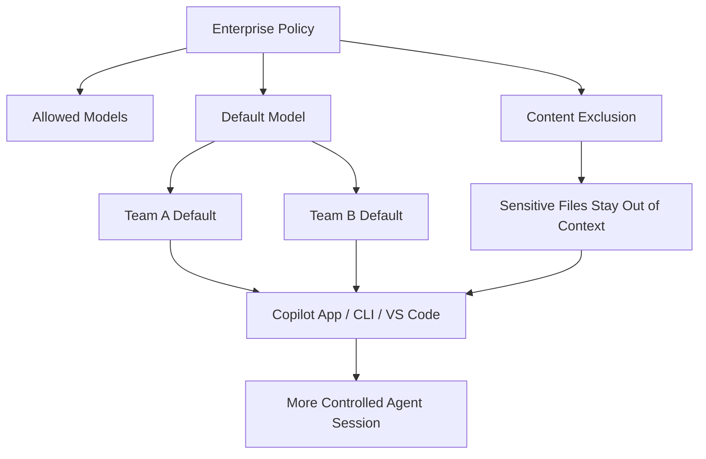

**Sources**:
- [GitHub｜Enterprise-managed settings support any default model](https://github.blog/changelog/2026-09-02-enterprise-managed-settings-support-any-default-model/)
- [GitHub｜Content exclusions generally available in Copilot app and CLI](https://github.blog/changelog/2026-09-02-content-exclusions-generally-available-in-copilot-app-and-cli/)

---

### 6. Anthropic open-sources a commerce-Agent blueprint: shopping Agents can modify carts, but payment stays with the merchant; merchant writes require human approval

- Category: Agent / Harness / AI-native SDLC / Product
- Information status: Official product update
- Published: 2026-09-02; public reporting appeared around 2026-09-03 00:01 Asia/Singapore
- Availability: Reference implementation open sourced; supports Messages API, Claude Agent SDK, and Managed Agents

**Fact summary**: Anthropic released a forkable **Commerce Agents Blueprint** with complete reference code rather than only design guidance. It includes two Agents — a consumer-facing Shopping Agent and an internal Merchant Agent — plus runnable retail, travel, telecom, and entertainment implementations and a Claude Code plugin. :contentReference[oaicite:52]{index=52}

The same Agent definitions can run through Messages API, Claude Agent SDK, or Claude Managed Agents. The reference architecture also puts safety boundaries directly into the workflow: the Shopping Agent can search, compare, plan, and modify a cart but hands final checkout back to the merchant; the Merchant Agent can propose inventory, pricing, listing, and campaign changes, but writes are staged until a human approves them. :contentReference[oaicite:53]{index=53}

**What changed versus before**: Commerce-Agent announcements often stop at a demo where a model recommends products.

Anthropic's blueprint is closer to a production architecture:

`Agent understands intent and calls tools`  
`Business systems remain authoritative for price, inventory, and identity`  
`Payment stays in the merchant checkout`  
`High-risk writes require approval`

It is more conservative than giving the model direct authority over the transaction, but also much easier to govern in production.

**Why it matters**: The most reusable idea is not “Claude can shop.” It is the explicit treatment of **Agent authority — what the Agent is actually allowed to decide**.

A consumer Agent can put an item in a cart without holding payment authority. A merchant Agent can recommend a price change without silently publishing it.

That pattern generalizes to finance, CRM, ERP, procurement, and operations:

`AI prepares an action → Business system validates it → High-risk action receives explicit approval`

**Practical impact**: Enterprise-Agent teams should study the repository's treatment of:

- tool contracts;
- grounding;
- provenance gates;
- action caps;
- memory validation;
- human approval;
- source-of-truth backend integration.

Anthropic also provides a Claude Code plugin that scaffolds a commerce Agent from the reference architecture and can generate evaluations. That is more useful for production teams than a prompt template alone. :contentReference[oaicite:54]{index=54}

Anthropic says some partners using Claude shopping Agents have seen carts up to roughly 35% larger and shoppers around 60% more likely to complete a purchase. These are Anthropic / partner results rather than independent randomized studies and should be treated as signals, not guaranteed ROI. :contentReference[oaicite:55]{index=55}

**Role perspective**:
- For AI Builders, this is a concrete production reference architecture.
- For product owners, the most important design question is not “how autonomous can the Agent be?” but which steps must return to the user or source system.
- For Tech Leads, it is a useful example of sharing one Agent definition across Messages API, SDK, and managed runtimes.

**Action to borrow**: Create an Authority Matrix for every enterprise Agent:

| Action | Agent may execute directly | User approval required | Must return to source system |
| --- | --- | --- | --- |
| Read / query | Yes | No | No |
| Draft a change | Yes | No | No |
| Modify critical data | No | Yes | Depends on system |
| Payment / high-risk transaction | No | Yes | Yes |

Do not treat “the Agent can call this tool” as equivalent to “the Agent may autonomously complete this action.”

**Risks and uncertainty**: Anthropic explicitly labels the repository a reference implementation rather than a maintained commercial system, and the examples do not include production authentication. Real deployments still need their own identity, authorization, compliance, and backend security. :contentReference[oaicite:56]{index=56}

**Next signals to watch**:
1. third-party plugin and connector ecosystems around the blueprint;
2. real production adoption on platforms such as Shopify;
3. standardized approval / payment controls in Managed Agents;
4. whether the same authority pattern spreads into other industry blueprints.

**Mermaid diagram**

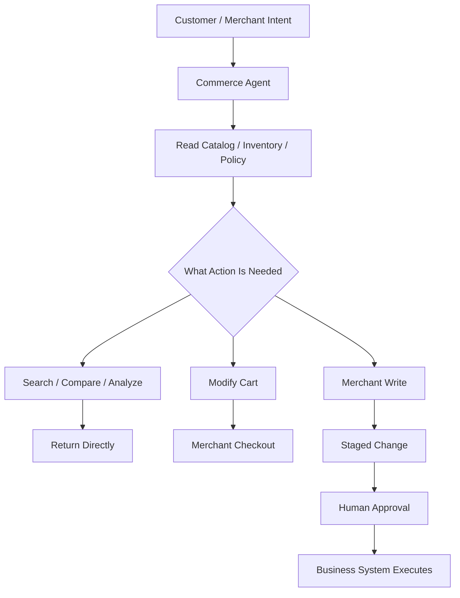

**Sources**:
- [Anthropic｜Claude for commerce](https://claude.com/solutions/commerce)
- [GitHub｜anthropics/commerce-agents](https://github.com/anthropics/commerce-agents)
- [Reuters｜Anthropic launches AI agent blueprints for retailers](https://www.reuters.com/business/retail-consumer/anthropic-launches-ai-agent-blueprints-retailers-ahead-holiday-shopping-season-2026-09-02/)

## C. Other Notable Items

**1. Europe has a new 438B reasoning model: Multiverse Computing launched Quasar 438B.** Quasar is available through the CompactifAI API for coding and enterprise Agent workloads and supports English and Spanish. The company cites a score of 43 on Artificial Analysis Intelligence Index v4.1.1 and 15.3 seconds to produce 500 output tokens including reasoning. It is worth tracking as a European sovereign-AI option, but its capability remains materially behind today's strongest frontier models, so it does not clear the core-news bar. :contentReference[oaicite:57]{index=57}  
Source: [Multiverse Computing｜Quasar 438B announcement](https://www.globenewswire.com/news-release/2026/09/02/3355465/0/en/multiverse-computing-launches-quasar-438b-the-highest-scoring-european-model-on-artificial-analysis-intelligence-index.html)

**2. Mistral refreshed its data-use guidance, and enterprises should recheck Vibe and API opt-out settings.** The current help documentation says ordinary Vibe users are not opted out of model training by default and uploaded documents count as input data, while Vibe Enterprise is opted out by default. More importantly, Vibe and Mistral Studio / API use separate data controls, so changing one does not automatically cover the other. This is primarily a policy/documentation clarification rather than a new model event, but teams allowing employees to upload corporate code or documents to Mistral should verify their current workspace settings. :contentReference[oaicite:58]{index=58}  
Source: [Mistral｜Can I opt out of my input or output data being used for training?](https://help.mistral.ai/en/articles/455207-can-i-opt-out-of-my-input-or-output-data-being-used-for-training)

## D. AI Trend Summary

### Trends supported by current facts

**Trend 1: Long-running Agents are now clearly the main competitive battleground.** Gemini 3.8 Flash, Muse Spark 1.3, and Qwen3.8-Max-0902 all emphasize long-horizon coding, multi-tool orchestration, requirement retention, and end-to-end task delivery rather than simple question answering.

**Trend 2: Per-token pricing is increasingly insufficient for understanding real model cost.** Gemini 3.8 Flash keeps the same unit price but may reason more; Muse Spark 1.3 tries to reduce tool calls and tokens; Qwen offers inexpensive cache reads. **Cost per successful task** is becoming the more meaningful economic metric.

**Trend 3: Security is moving from “prevent the model from saying something unsafe” toward “verify what the Agent actually does.”** Gemini Cyber + Fairwind limits capability access, Mantis reproduces vulnerabilities inside a sandbox, and Anthropic's commerce blueprint leaves payment and critical writes to source systems or human approval. Each restricts real-world Agent authority rather than relying only on prompts.

**Trend 4: Enterprise coding Harnesses increasingly behave like policy runtimes.** GitHub can centrally control model defaults and sensitive-file context. Models, data, tools, and team policies are becoming centrally governed instead of individually configured in each client.

**Trend 5: Reference Harnesses are becoming more valuable.** Mantis and Anthropic Commerce are not new foundation models; they package models, tools, verification, permissions, and workflows into reusable engineering patterns. As foundation-model quality converges, Harness quality will increasingly determine production outcomes.

### Analytical inference

**Inference 1: The unit of model evaluation in the second half of 2026 will increasingly shift from the “single prompt” to the “complete workload.”** A model should be judged by how many turns it needs, how many tools it calls, how much context is cached, how long it runs, how often humans must rescue it, and whether the job is actually completed.

**Inference 2: Capability-tiered model access will become increasingly common.** Gemini 3.8 Flash versus Flash Cyber already makes this explicit, while OpenAI Astra follows a similar direction. Enterprise gateways may eventually need to decide not only which model a user can access, but **which capability tier of that model** is permitted.

**Trend overview**

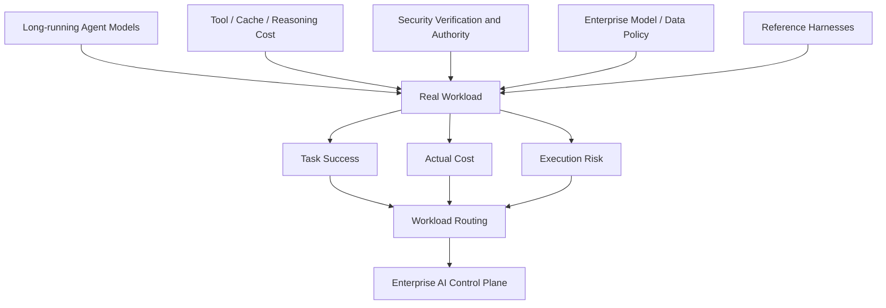

## E. Actions to Consider Today

1. **Role: AI Builder / AI Platform | Action: put Gemini 3.8 Flash, Muse Spark 1.3, and Qwen3.8-Max-0902 into the same long-running workload evaluation.** Keep repositories, tools, and acceptance criteria fixed; compare task success, tool calls, tokens, wall-clock time, and actual cost. **Why now**: all three models strengthened long-horizon Agent work in the same reporting window. **Action type: Schedule a test.**

2. **Role: Tech Lead / Security | Action: study Mantis's “discover → critic → sandbox reproduction → patch validation” workflow and make verified findings the primary metric for AI security scanners.** **Why now**: the main bottleneck in AI vulnerability scanning is moving from finding suspicious code to controlling false positives. **Action type: Schedule a test.**

3. **Role: GitHub Copilot enterprise administrator | Action: configure organizational default models and content exclusions.** Move sensitive-directory handling into system policy instead of relying on developer training alone. **Why now**: both enterprise controls are now GA. **Action type: Execute now.**

4. **Role: Agent product owner / Tech Lead | Action: create an Authority Matrix for existing Agents.** Explicitly separate actions the Agent may execute autonomously, actions requiring confirmation, and actions that must return to the source system. **Why now**: Anthropic's commerce blueprint provides a strong practical reference architecture. **Action type: Add to roadmap.**
