<!-- 中文版 -->
# AI 今日头条｜2026 年 09 月 04 日

- 语言：中文
- 时区：Asia/Singapore
- 新闻窗口：2026-09-03 07:30 至 2026-09-04 07:30
- 实际检索截止时间：2026-09-04 06:58
- 本期核心新闻：7 条
- 其他值得关注：2 条
- 注：本次检索早于固定新闻窗口结束约 32 分钟，因此实际覆盖至 06:58；06:58–07:30 之间若出现重大事件，应在下一期补检。

## A. 今日最重要的 3 件事

**1. GPT-6 Astra 正式发布：1.05M context、$10 / $50 API 定价，并把 Codex 长任务上下文机制一起升级。** 9 月 1 日我们关注的是 Astra 已达到 Critical Cyber 能力阈值；**今日新增**是它从“安全预告中的未来模型”正式变成产品：首批向有限组织开放，未来几天扩展到 ChatGPT Plus、Pro、Business、Enterprise 和 API。对 Coding / Agent 团队而言，更重要的是 Astra 不只是换模型——Codex 同时加入“跨 context window 保存笔记 + 搜索旧历史”的新长任务机制。:contentReference[oaicite:0]{index=0}

**2. NVIDIA 宣布以 129.303 亿美元收购 Hugging Face，AI 开源生态最重要的平台之一将进入 NVIDIA 体系。** NVIDIA 明确承诺 Hugging Face 继续保持多模型、多云、多 Accelerator，使用 Hugging Face 不要求 NVIDIA GPU；但交易如果完成，全球最重要的模型、Dataset、Demo 与部署入口之一，将和占主导地位的 AI 芯片供应商处在同一家集团。真正需要关注的不是今天马上“站队 NVIDIA”，而是未来默认 Runtime、Benchmark、Inference、推荐排序和多硬件中立性能否长期保持。:contentReference[oaicite:1]{index=1}

**3. OpenAI 再投 10 亿美元推进 Daybreak Cyber：目标是在未来 6 个月把 Frontier Cyber AI 大规模送到水务、电网、地方政府、银行和开源维护者手里。** Daybreak 已覆盖约 2,000 个批准组织 / Workspace，这次又增加 MS-ISAC 公共部门和水务试点，以及 35+ 合作伙伴产品。Cyber Frontier Model 正从“少数安全专家可以试用”走向“关键基础设施的日常防守工具”，这会直接推动企业重新思考安全团队的 Agent 权限、验证流程和模型准入。:contentReference[oaicite:2]{index=2}

## B. 新闻正文

### 1. GPT-6 Astra 正式上线：1.05M context，Codex 长任务不再只靠 compaction“压缩记忆”

- 类别：模型 / AI 编程 / Agent / 安全
- 信息状态：官方已确认
- 发布时间：2026-09-03
- 可用状态：有限组织 / Trusted Access 先行；未来几天扩展到 Plus、Pro、Business、Enterprise 与 API

**事实摘要**：OpenAI 正式发布 GPT-6 Astra。模型面向复杂推理、Coding、Computer Use、Research 和端到端专业工作，API Model ID 为 `gpt-6-astra`，Context Window 为 **1,050,000 token**，最大输出 **128,000 token**。标准 API 价格为每百万输入 token **$10**、输出 **$50**；官方 Model Page 还列出 $1 / MTok Cached Input 和 $12.50 / MTok Cache Write。:contentReference[oaicite:3]{index=3}

OpenAI 报告，Astra 在 OSWorld 2.0 上取得 72.6%，GPT-5.6 Sol 为 65.7%；更有实际意义的是模拟任务时间约从 75 分钟降到 40 分钟。Astra 配合更新后的 Codex Harness，在 Mind2Web 上的任务完成速度达到当前 GPT-5.6 Sol 体验的 1.9 倍。上述均为 OpenAI 评测，不能直接当成所有企业工作流的真实加速比。:contentReference[oaicite:4]{index=4}

**相较此前的变化**：**此前已知**：9 月 1 日 OpenAI 已确认 Astra 达到 Critical Cyber 能力阈值，因此正式发布前需要更强 Safeguard。**今日新增**：模型正式进入产品发布阶段，API 定价、Context、Codex 行为和访问路线已经明确。:contentReference[oaicite:5]{index=5}

Codex 还有一个很值得单独关注的新机制。以前长任务 Context 填满后，主要依赖 compaction（把历史压缩成摘要再继续）；压缩几次后，某次失败为什么发生、某个测试结果来自哪里，很容易被摘要丢掉。Astra 可以跨多个 Context Window 保存自己的 Notes，同时旧 Window 仍可搜索，即使某条信息没有被写进 Notes，也可以重新找回来。这个功能目前仍是 Experimental，未来几周会成为 Astra 的默认机制。:contentReference[oaicite:6]{index=6}

**为什么重要**：这意味着“1M Context”本身已经不是长任务最重要的数字。真正难的是一个任务跑几个小时甚至几天之后，模型能不能记住早期约束、失败路径和测试证据。

传统办法像是每当笔记本写满，就把前面 100 页压缩成一页摘要；新的机制更像是“保留摘要，同时旧笔记仍可全文检索”。对于大型 Refactor、Migration、Research 和多阶段 Agent，这比单纯把 Context 从 512K 增加到 1M 更可能影响稳定性。

**实际影响**：如果团队准备评估 Astra，建议把测试重点从单次 Coding Benchmark 转成真正的 End-to-end Workload。至少比较 Astra 与现有模型在 2–8 小时任务中的 Requirement Retention、工具调用、人工打断次数、Context 重建次数、最终 Test Pass 和 Cost per Successful Task。

另外要注意长 Context 的价格阶梯。OpenAI Model Page 显示，当单次输入超过 272K token 后，整个请求的 Input / Cached Input 按 2 倍价格计费，Output 按 1.5 倍价格计费。因此“有 1M Context”不等于“应该经常塞满 1M”。:contentReference[oaicite:7]{index=7}

**角色视角**：
- 对 AI Builder，Astra 最值得测试的是多小时 Agent，而不是再跑一套简单 Prompt。
- 对 Tech Lead，新 Context Mechanism 可能比 Model Benchmark 更影响大型 Repo 的稳定性。
- 对 AI Platform，需要把 `model + reasoning_effort + context_strategy + cost` 一起纳入 Routing。
- 对安全团队，Astra 的 Critical Cyber 能力意味着高权限 Tool / Network Access 必须更加严格。

**可借鉴动作**：建立一个固定“长任务耐久度”评测：开局给 10–15 条约束，任务中途修改其中两条，故意制造一次失败和一次用户打断，最后检查模型是否仍能解释最初约束、失败原因和最终验证结果。

**风险与不确定性**：Astra 目前仍是分阶段 Rollout，普通用户不一定已经看到。官方 Benchmark 主要来自 OpenAI 自己的 Harness；生产 ChatGPT、Codex 与 API System Prompt、Tool 和 Safety Stack 不完全相同。OpenAI 也明确表示，Astra 的额外 Safety Check 偶尔会暂停或停止合法任务。:contentReference[oaicite:8]{index=8}

**下一步观察**：
1. Astra 对 Plus / Pro / Business / Enterprise 的实际 Rollout 完成时间；
2. Codex 新 Context Management 成为默认后的实际长任务表现；
3. Astra 在真实 Coding Agent 中每成功任务的 token 与 Wall-clock；
4. Critical Cyber Safeguard 的误报率是否影响正常安全开发。

**Mermaid 图示 A：Codex 长任务记忆方式的变化**

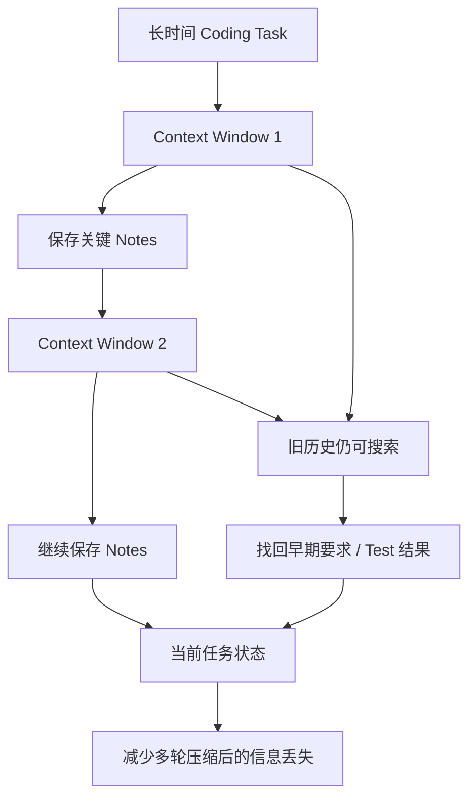

**Mermaid 图示 B：1M Context 不代表应该全部塞满**

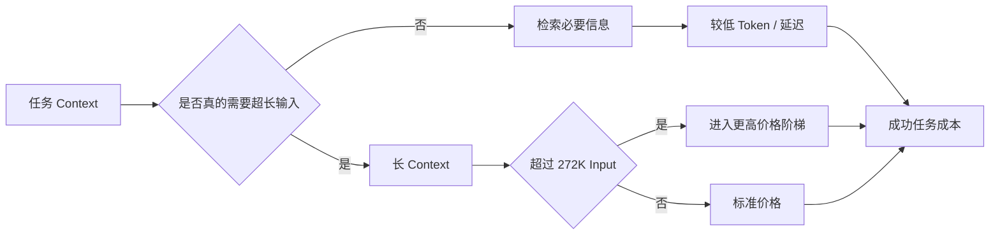

**来源**：
- :contentReference[oaicite:9]{index=9}
- :contentReference[oaicite:10]{index=10}
- :contentReference[oaicite:11]{index=11}

---

### 2. NVIDIA 以 129.303 亿美元收购 Hugging Face：开源模型“主入口”将和最大 AI GPU 厂商合并

- 类别：政策与产业 / 基础设施 / 模型生态
- 信息状态：官方已确认交易协议；交易完成状态需继续观察
- 发布时间：2026-09-03
- 可用状态：NVIDIA 已宣布同意收购，Hugging Face 当前继续正常运营

**事实摘要**：NVIDIA 宣布已同意以 **$12,930,300,000** 收购 Hugging Face。NVIDIA 给出的平台规模是：超过 **1,800 万开发者**、**300 万模型**、**50 万 Dataset**、**100 万应用**，以及超过 **20 万家公司**在平台上发现、评测、定制和部署 AI。:contentReference[oaicite:12]{index=12}

NVIDIA 明确承诺 Hugging Face 将继续是开放平台，开发者仍可自由选择模型、Framework、Cloud、Inference Provider 和计算平台，使用 Hugging Face **不会要求 NVIDIA Compute**；平台也会继续支持多云、多 Accelerator 和来自不同模型厂商的 Open Source / Open Weight Model。:contentReference[oaicite:13]{index=13}

**相较此前的变化**：此前市场已有 NVIDIA 可能收购 Hugging Face 的报道；**今日新增**是 NVIDIA 正式确认双方已经达成收购协议。Reuters 报道交易价值同样为 129.3 亿美元，并指出市场关注焦点之一，就是 NVIDIA 在掌握 AI 芯片优势之后进一步向开发者平台和模型生态延伸。:contentReference[oaicite:14]{index=14}

这不是普通模型公司的并购。Hugging Face 同时承担 Model Registry、Dataset Hub、Demo / Space、Benchmark、Library 集成和开源社区入口等多种角色。它对很多企业来说，实际上已经接近 AI 世界的“软件供应链基础设施”。

**为什么重要**：从 NVIDIA 的角度，这是一种很自然的纵向延伸：GPU → Inference Runtime → Model → Developer Platform。即使 Hugging Face 保持完全硬件中立，NVIDIA 也能更靠近模型开发者每天使用的入口。

从企业和开源社区角度，关键问题不是今天会不会立刻“强推 CUDA”，因为 NVIDIA 已明确承诺不会这么做。更值得长期验证的是那些更细的默认行为：新模型首先为哪些硬件提供 Day-0 Optimization？默认 Benchmark 是否保持中立？Inference 推荐是否同样覆盖 AMD、Intel、Apple、Cloud TPU 和其他 Accelerator？这些变化即使不违反“开放平台”承诺，也可能慢慢影响生态方向。

**实际影响**：现在没有理由因为并购立即迁离 Hugging Face，但生产系统不应把 Hub 当成唯一不可替代的数据源。对于关键模型和 Dataset，应保留 Revision Pin、Checksum、本地或对象存储 Mirror，以及清楚的 License / Provenance 记录。

企业也应把“模型在哪里托管”和“模型运行在哪种硬件”继续解耦。Hugging Face 属于 NVIDIA 后，并不意味着所有生产 Serving 都应该随之迁往 NVIDIA；最终仍应按 Cost、Performance、Availability 和 Portability 做决策。

**角色视角**：
- 对 AI Builder，短期开发体验预计不会突然改变。
- 对 Tech Lead，应重新审视 Hugging Face 是否成为了单点供应链依赖。
- 对 AI Platform，需要持续测试多 Accelerator 和多 Inference Provider 的可移植性。
- 对部门经理，这笔交易说明 Open-model Infrastructure 已经成为战略级资产，而不是免费的社区附属品。

**可借鉴动作**：给生产模型建立最小“可脱离 Hub 恢复”能力：锁定 Revision、保存模型和 Tokenizer Hash、Mirror 关键 Artifact，并在 CI 中确认从内部存储恢复时仍能部署。

**风险与不确定性**：NVIDIA 公布的是“agreed to acquire”，不能把今天写成交易所有法律与监管流程都已结束。另一个不确定性是中立性承诺的长期执行方式；目前没有证据表明 Hugging Face 会取消 AMD、Intel 或其他平台支持，因此不应提前下结论。:contentReference[oaicite:15]{index=15}

**下一步观察**：
1. 交易完成所需的监管和时间表；
2. Hugging Face Governance、Management 和产品路线是否调整；
3. 多 Accelerator Benchmark / Inference 支持是否保持同等优先级；
4. Hugging Face Enterprise Inference 与 NVIDIA Infrastructure 的整合方式。

**Mermaid 图示 A：为什么这不是普通模型公司并购**

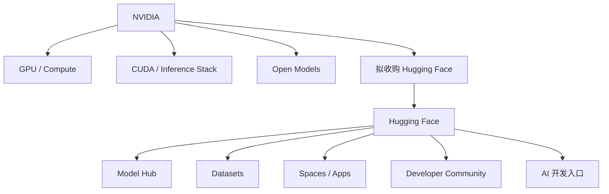

**Mermaid 图示 B：企业该关注什么**

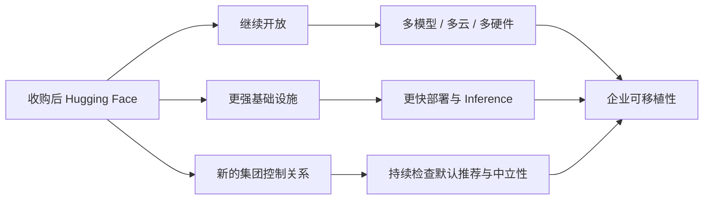

**来源**：
- :contentReference[oaicite:16]{index=16}
- :contentReference[oaicite:17]{index=17}

---

### 3. OpenAI 投入 10 亿美元扩大 Daybreak：Frontier Cyber AI 开始进入水务、电网、地方政府和银行

- 类别：安全 / Agent / 政策与产业
- 信息状态：官方已确认
- 发布时间：2026-09-03
- 可用状态：Daybreak 已运行；新增补贴、培训与合作计划将在未来数月扩大

**事实摘要**：OpenAI 发布 **Daybreak for Frontline Defenders**，承诺投入 **10 亿美元**的补贴访问、培训、技术支持和合作资源，并计划让这些资源主要在未来 **6 个月**被使用。首批重点是水务和污水处理、电网、州和地方政府、社区 / 地区银行、非营利组织与开源项目维护者。:contentReference[oaicite:18]{index=18}

OpenAI 表示，目前已有数千名防守人员分布在约 **2,000 个批准组织和 Workspace** 使用 Daybreak。新计划还包括与 MS-ISAC 建立公共部门 / 水务试点，以及通过 Daybreak Defense Network 提供 **35+ 企业产品和合作伙伴服务**。:contentReference[oaicite:19]{index=19}

**相较此前的变化**：以前 Daybreak 主要回答“谁可以获得更强 Cyber Model”。今天的变化是它开始回答另一个更实际的问题：**能力怎样真正进入缺人、缺预算的安全团队。**

OpenAI 不只给 Model Access，还加入 Training、Hands-on Support 和 Partner Product。Daybreak Blue 继续覆盖普通防御任务，Daybreak Red 则让批准组织获得更敏感、更高能力的 Cyber Model。:contentReference[oaicite:20]{index=20}

**为什么重要**：Frontier Cyber AI 很快会形成一个现实的不对称：大型科技公司本来就有顶尖 Red Team 和自动化，而地方水务、医院、小银行和开源项目往往只有几名安全人员。

如果高能力 Agent 能帮这些团队读取 Legacy Code、分析异常、验证漏洞、写 Patch 并确认修复，真正产生的价值可能不是“一个分析师快 30%”，而是让原本根本没有能力完成的防御工作变得可执行。

与此同时，这也意味着更强 Cyber Agent 会进入更多真实基础设施。企业安全治理不能只问模型是否“用于防守”，还需要保证扫描范围、Credential、Network 和 Exploit Validation 都有明确授权。

**实际影响**：关键基础设施或安全团队可以把 Daybreak 看成一个潜在的“Cyber Capability Tier”，而不是普通 ChatGPT Model。平台层要区分谁可以使用 Blue、谁可以使用 Red、哪些网络允许被 Agent 扫描、哪些 Exploit 只能在 Sandbox 中验证。

对不属于 Daybreak 资格的普通企业，仍可以借鉴其思路：模型访问只是第一步，真正提高安全生产力还需要固定的 Workflow、Sandbox、Validation Criteria 和 Human Approval。

**角色视角**：
- 对安全团队，这是高能力 Cyber Agent 正式规模化分发的重要信号。
- 对 Tech Lead，应提前定义 Cyber Agent 的授权边界，而不是工具上线后再补规则。
- 对部门经理，安全 AI 的 ROI 可能首先出现在“资源不足的防守工作”而不是普通办公室自动化。

**可借鉴动作**：把 Cyber Agent 权限单独分层，例如：

`普通代码审查 → 漏洞验证 → Exploit PoC → 真实网络测试`

每往后一层，都要求更严格的身份、审批、Sandbox 和审计。

**风险与不确定性**：10 亿美元是 OpenAI 的全球 Commitment，不等于现金一次性发放；官方目标是通过补贴访问、培训、支持与合作在未来 6 个月逐步使用。Daybreak 也不能消除误报、错误 Patch 或 Agent 越权风险。:contentReference[oaicite:21]{index=21}

**下一步观察**：
1. Daybreak Red / Astra 的实际资格门槛；
2. MS-ISAC Pilot 的真实漏洞发现与修复效果；
3. Daybreak 是否扩展到更多国家；
4. Cyber Agent 的标准审计 / Sandbox 规范是否开始形成。

**Mermaid 图示 A：Daybreak 从模型访问走向完整防守能力**

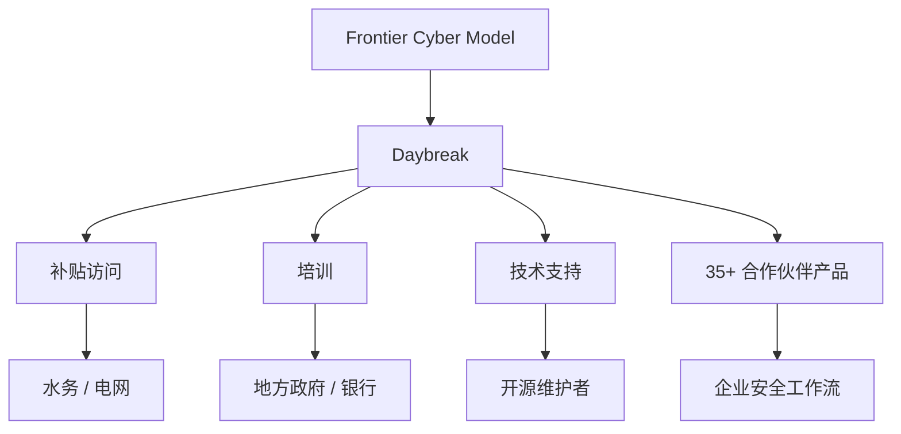

**Mermaid 图示 B：Cyber Agent 权限不能只有“允许 / 禁止”**

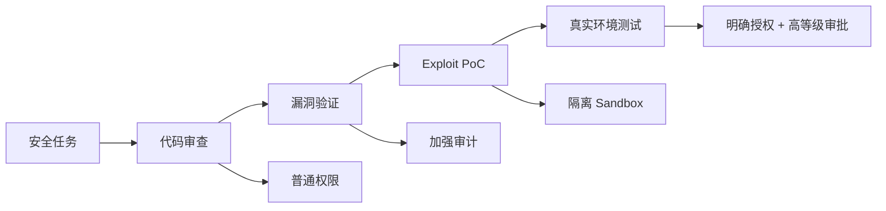

**来源**：
- :contentReference[oaicite:22]{index=22}

---

### 4. Codex CLI 0.153.0：Plugin Marketplace、断线恢复和新 Context Management 同时推进

- 类别：AI 编程 / Harness / MCP / Agent
- 信息状态：官方产品更新
- 发布时间：2026-09-03；GitHub Release 页面显示 03 Sep 01:37，但抓取文本未标明时区，因此不强行换算
- 可用状态：0.153.0 已公开发布；新 Context Management 为默认关闭的 Experimental Feature

**事实摘要**：Codex CLI 0.153.0 让 Plugin CLI 可以直接从 Remote Marketplace **列出、安装和删除 Plugin**；Plus 和 Team 用户在约 5 小时 Usage Window 剩余不到一半额度时会更早看到提醒。TUI 在外部 App-server 断线后也能自动重连，保留 Draft 和 Transcript，同时把状态不确定的提交暂停下来让用户确认。:contentReference[oaicite:23]{index=23}

另一个重要变化是新的 `features.context_management.experimental_mode`。符合条件、使用 Codex Backend 的 ChatGPT Plus、Pro、Pro Lite Session 可以启用 Token-budget Context、History Notes 和 `new_context` Tool；API Key、自定义 Provider 和临时 Structured Thread 暂不支持。:contentReference[oaicite:24]{index=24}

**相较此前的变化**：0.152.0 主要在 Tool Output Budget、长 Shell Timeout 等单个运行资源上加强控制；0.153.0 更明显地向“长期 Session Runtime”推进：断线后怎么恢复、历史怎么保留、Plugin 怎么从远端分发、安全 Review 如何跨 Compaction 继续存在。

Guardian Review History 现在会跨 Compaction、Restart 和用户创建的 Fork 保留；记住的 MCP Tool Approval 也会绑定到选中的 App Account，降低“一个账号批准后另一个账号顺带继承”的风险。:contentReference[oaicite:25]{index=25}

**为什么重要**：一个真正长期运行的 Coding Agent，不能因为 UI 与 App Server 临时掉线就把状态弄丢，也不能每次 Context 压缩都忘掉之前的 Safety Review。

0.153.0 这些变化看起来零散，但其实都在解决“Session 能不能成为可靠的工作对象”。这和普通 CLI 工具的产品要求完全不同。

**实际影响**：如果团队使用 Codex 做多小时或远程 Agent，0.153.0 值得安排升级回归。重点测试：

- App-server 掉线 / 重连；
- Draft 是否保存；
- Resume 后 Tool / Guardian 状态是否一致；
- Plugin Marketplace Source Policy；
- MCP 多账号 Approval；
- Experimental Context Management 在长任务中是否真的减少信息丢失。

OpenAI 还开始记录 ChatGPT Session 的 **Turn Cost Telemetry**，并强化 Curated Plugin 的 Marketplace Source Policy，这两个信号说明成本与 Plugin Supply-chain 正进一步进入 Codex Runtime。:contentReference[oaicite:26]{index=26}

**角色视角**：
- 对 AI Builder，长 Session 更不容易因为连接问题直接废掉。
- 对 Tech Lead，新 Context Management 值得和 Astra 的长任务能力一起评估。
- 对 AI Platform，Plugin Marketplace 已开始成为真正的软件供应链入口。
- 对安全团队，Guardian 与 MCP Approval 能否跨 Resume / Fork 保持正确状态很关键。

**可借鉴动作**：建立一个 Harness Resilience Test：Agent 正在执行时强制断开 App-server、Resume Session、切换 App Account、触发 Context 压缩，再检查 Draft、Tool Approval、Safety Review 和任务状态是否一致。

**风险与不确定性**：Experimental Context Management 默认关闭，而且只覆盖特定 ChatGPT Codex Backend Session，不能据此认为 API Key / 自定义模型已经获得同样能力。新 Plugin Marketplace 也意味着企业要更关注远程 Plugin 来源和更新策略。:contentReference[oaicite:27]{index=27}

**下一步观察**：
1. Context Management 何时变为默认；
2. 是否扩展到 API Key / Custom Provider；
3. Plugin Marketplace 是否加入更细的 Version Pin / Approval Gate；
4. Turn Cost Telemetry 是否开放给企业 Usage API。

**Mermaid 图示**

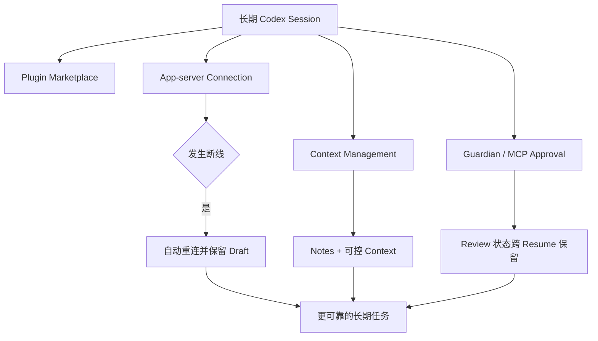

**来源**：
- :contentReference[oaicite:28]{index=28}

---

### 5. GLM-5.3-Flash 开启 18 天 Coding 额度活动：ZCode 夜间无限用，其他 Agent 配额翻倍

- 类别：AI 编程 / 模型 / 成本治理
- 信息状态：官方已确认
- 发布时间：2026-09-03
- 可用状态：已自动生效；活动持续至 2026-09-20

**事实摘要**：Z.ai 为 GLM-5.3-Flash 开启限时 Usage Campaign。**2026-09-03 至 09-20**，每天 Singapore Time **23:00–次日 09:00**，所有付费 GLM Coding Plan 用户自动享受优惠，无需手工领取。:contentReference[oaicite:29]{index=29}

规则很直接：通过 **ZCode** 使用 GLM-5.3-Flash 时，**不消耗 Quota，可以不限量使用**；通过其他受支持 Agent 使用时，则按套餐原本规则获得 **2 倍可用 Quota**。活动只针对 GLM-5.3-Flash，选择 GLM-5.3 仍按正常额度扣除。:contentReference[oaicite:30]{index=30}

**相较此前的变化**：GLM-5.3-Flash 模型本身并不是今天发布；今天变的是它的**实际使用成本和 Capacity**。

GLM Coding Plan 原本仍有 5 小时和 Weekly Credit 两层限制，现在活动期间每天有 10 个小时的特殊窗口。对于可以把长时间 Coding / Batch Task 安排在夜间运行的团队，这会明显改变 GLM-5.3-Flash 与其他 Coding Model 的有效成本比较。:contentReference[oaicite:31]{index=31}

**为什么重要**：模型选型不能只比较 API List Price。订阅额度、Off-peak Discount、临时 Campaign 和 Cache Hit 都会改变实际 Cost per Task。

尤其 Agent 工作负载天然适合异步运行：代码重构、Test Generation、Repo Scan、文档同步等任务未必需要白天立即完成。如果能够移动到 23:00–09:00，ZCode 下的边际模型额度成本暂时接近零。

**实际影响**：使用 GLM Coding Plan 的团队可以把低风险、长时间后台任务集中到夜间窗口，但不要因为“Unlimited”就取消自己的 Rate / Cost / Tool Safety 控制。真正限制系统的仍然可能是 Harness、Tool、并发、上下文和运行时间。

如果用 Claude Code、Cline、OpenCode 等第三方 Agent 接 GLM Coding Plan，要确认自己属于“其他受支持 Agent”路径，得到的是 Quota ×2，而不是 ZCode 的 Zero Quota。:contentReference[oaicite:32]{index=32}

**角色视角**：
- 对 AI Builder，夜间长任务可以显著降低额度压力。
- 对 Tech Lead，可以考虑把非交互式 Coding Job 调度到 Off-peak。
- 对部门经理，这是提醒：订阅型 Coding AI 的“有效价格”可能每天都随规则变化。

**可借鉴动作**：把 Agent Scheduler 增加 `deadline` 与 `cost_window` 两个字段。非实时任务在满足 SLA 的前提下自动移到更便宜或免费额度窗口执行。

**风险与不确定性**：这是明确有结束日期的促销活动，不应据此调整长期架构或年度预算。Unlimited 也只代表活动规则下不扣 ZCode Quota，不等于所有资源、并发和服务容量无限。:contentReference[oaicite:33]{index=33}

**下一步观察**：
1. 9 月 20 日后是否延期；
2. 活动期间是否出现并发 / Rate-limit 变化；
3. GLM-5.3-Flash 夜间高负载时延迟是否变化；
4. Z.ai 是否把类似 Time-based Pricing 变成长期机制。

**来源**：
- :contentReference[oaicite:34]{index=34}
- :contentReference[oaicite:35]{index=35}

---

### 6. NVIDIA PAIR 把家里多台电脑变成一个本地 AI 计算池：Agent 不必全挤在同一张 GPU 上

- 类别：基础设施 / Agent / 本地 AI
- 信息状态：官方产品更新
- 发布时间：2026-09-03
- 可用状态：PAIR Beta 已公开；支持 Windows、macOS、Linux

**事实摘要**：NVIDIA 发布免费的开源工具 **PAIR（Personal AI Router）**。它会自动发现局域网中的兼容电脑，并把相互独立的推理请求分发给当前有空闲能力的设备；目前支持 Ollama 与 LM Studio，也能随着设备加入或离开网络动态调整。:contentReference[oaicite:36]{index=36}

PAIR 支持 GeForce RTX 20 系列及以上、RTX PRO Turing 及以上、DGX Spark，以及 Apple M4 及更新芯片。NVIDIA 同时宣布 llama.cpp 在 RTX 5090 上通过新 Kernel、Speculative Decoding 和 Prefill 优化最高达到 **1.9× Throughput**；vLLM 在 RTX PRO 6000 Blackwell 上为 1.2×，两个 DGX Spark Cluster 上最高 1.4×。这些性能数字都有明确硬件和配置条件，并非所有本地模型都会普遍提速。:contentReference[oaicite:37]{index=37}

**相较此前的变化**：本地 Agent 过去一个很常见的问题是：一台机器里即使模型能跑，多个 Subagent 同时工作还是会在同一张 GPU 前排队。

PAIR 的思路不是把一个超大模型横向切到很多消费级 PC 上，而是把**相互独立的推理 Job**分给不同机器。例如一个 Agent 同时派出 5 个 Subagent，五个请求可以落到不同 PC，而不是全挤在主工作站。

NVIDIA 还在降低本地 Agent 的安装门槛：Hermes Agent 提供 Windows 一键本地模型配置；OpenClaw Windows App 可以在至少 24GB VRAM 的 RTX GPU 上自动配置优化模型；Perplexity Portable Computer 则支持本地执行，并在用户允许后把部分任务升级到 15+ Cloud Frontier Model。:contentReference[oaicite:38]{index=38}

**为什么重要**：本地 AI 过去的价值主要是“隐私”和“没有 API Token 费用”，缺点是部署麻烦、性能有限、硬件经常闲置。

PAIR 把问题改成局域网资源调度。如果家里或办公室已经有 Gaming PC、Workstation、Mac 和小型 AI Box，Agent 可以把它们看成一组可利用的 Inference Worker。对于并行 Agent，这比单纯追求一张更大的 GPU 更有现实意义。

**实际影响**：适合本地处理的任务包括代码分析、内部文档、个人财务文件和不希望上传 Cloud 的数据。需要更强推理时，再把特定子任务升级到 Cloud Model，这会形成新的 Hybrid Agent 架构。

平台团队需要额外解决的是 Device Trust、模型版本一致性、任务路由、机器突然离线和不同 GPU 输出性能差异。局域网不等于天然安全。

**角色视角**：
- 对 AI Builder，本地 Multi-agent 第一次更像一个小型计算集群，而不是单 PC Demo。
- 对 Tech Lead，要开始考虑局域网 Inference Scheduler 和 Device Trust。
- 对产品负责人，可以设计“默认 Local，必要时经确认升级 Cloud”的隐私体验。

**可借鉴动作**：用一个 3–5 Subagent 工作流测试 PAIR，比较单 GPU 与多设备情况下的 Total Wall-clock、每台设备利用率、失败重试，以及设备中途离线是否会导致整个任务丢失。

**风险与不确定性**：PAIR 仍是 Beta；它主要分发独立请求，不应误解为可以把任意超大模型自动拆到多台普通 PC 上共同推理。NVIDIA 的 1.9× / 1.4× 性能数据也只对应特定硬件和 Backend。:contentReference[oaicite:39]{index=39}

**下一步观察**：
1. PAIR 是否支持更多 OpenAI-compatible Local Server；
2. 是否出现模型和 KV Cache 感知的调度；
3. Windows / macOS / Linux 混合网络的稳定性；
4. Local / Cloud 自动 Routing 是否逐步标准化。

**Mermaid 图示**

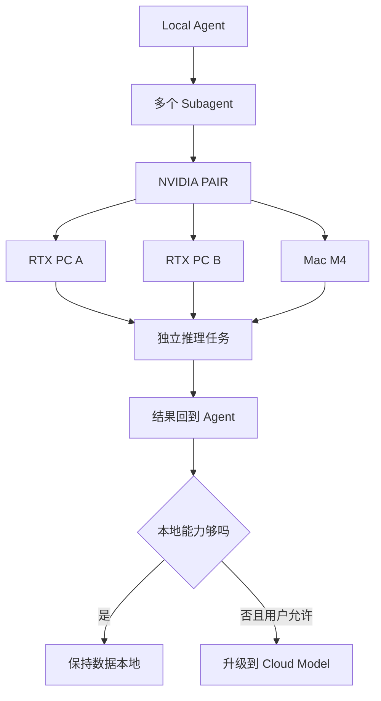

**来源**：
- :contentReference[oaicite:40]{index=40}

---

### 7. NeoMME 发布：260M 模型每秒索引约 51 页，视觉 RAG Index 可从 1.5MB / 页压到 6KB

- 类别：研究 / 基础设施 / RAG
- 信息状态：官方项目发布 / 技术报告
- 发布时间：2026-09-03
- 可用状态：260M / 800M 模型已开放，Apache 2.0，支持 Hugging Face Transformers

**事实摘要**：Hcompany 发布 NeoMME，一组 **260M 和 800M** 的多语言、多模态 Encoder。它不使用独立 Vision Tower 再接 Language Model，而是让文字 token 和原始图片 Patch 进入同一个 Bidirectional Transformer；Retriever 版本一次 Forward 就能同时生成 Dense Embedding 和 Late-interaction Embedding。:contentReference[oaicite:41]{index=41}

在 NVIDIA L40S、2048×2048 页面条件下，260M Retriever 官方测得约 **51 页 / 秒**，接近 ColModernVBERT 的两倍。更有工程价值的是 Index Storage：通过 Hierarchical Token Pooling 和 Quantization，Late-interaction Index 可以从平均约 **1.5MB / 页降到 6KB / 页，缩小 255 倍**，同时保留超过 95% 的基线 nDCG@10。:contentReference[oaicite:42]{index=42}

**相较此前的变化**：视觉 RAG 常见方案是先把 PDF 做 OCR，再按文本 Chunk 检索；另一条路线是直接检索整页图片，这样图表、布局、公式和视觉关系不会在 OCR 中丢掉，但代价通常是 Index 大、GPU 编码慢。

NeoMME 主要在解决后者的工程成本。它不是新一代聊天模型，而是让“直接按页面图片做 Retrieval”更接近可以大规模上线的基础组件。

**为什么重要**：企业文件里真正难处理的内容往往正是 Text RAG 最容易破坏的内容：财报表格、Dashboard 截图、技术图纸、发票、Slide、表单和复杂排版。

如果视觉 Retrieval 的 Index 从 1.5MB / 页降到 KB 级，百万页文档库的 Storage 和 RAM 压力会完全不同。对大型企业 RAG 来说，这可能比 Generator Benchmark 再提高几分更能改变系统设计。

**实际影响**：适合测试 NeoMME 的场景，不是普通纯文本 Wiki，而是 OCR 容易损失结构的文件。建议用相同 PDF Corpus 对比：

`OCR + Text Embedding`  
vs  
`Page Image + NeoMME`

分别测 Retrieval nDCG / Recall、Index Storage、Index Build Time，以及最终 VLM Answer Groundedness。

260M 模型的 ViDoRe v3 nDCG@10 为 0.523，与 3.75B 的 ColQwen2.5 相差 0.002，但参数少约 14 倍；不过表中部分结果来自项目方自己的评测，因此仍需要自己复现。:contentReference[oaicite:43]{index=43}

**角色视角**：
- 对 AI Builder，视觉 RAG 多了一个小得多的 Retriever 选择。
- 对 Tech Lead，真正值得关注的是 Index Storage 与 Corpus Build Cost。
- 对产品负责人，复杂 PDF 的检索质量可能不再必须依赖 OCR 后的纯文本。

**可借鉴动作**：挑一批“有表格、图、复杂布局”的真实文档做 200–500 条 Query Eval。只有当视觉 Retrieval 明显改善最终回答，而 Index / GPU 成本也可控，才值得替换现有 Text RAG。

**风险与不确定性**：NeoMME 是 Retriever / Encoder，不是回答问题的生成模型；最终 RAG 质量仍取决于 Top-k、VLM 和 Prompt。51 页 / 秒与 255× 压缩也对应官方指定硬件和压缩配置，实际环境必须复测。:contentReference[oaicite:44]{index=44}

**下一步观察**：
1. 第三方 ViDoRe 与企业 PDF Eval；
2. NeoMME 与 OCR + Text RAG 的端到端成本；
3. 量化到 6KB / 页后不同文档类型的 Recall；
4. Vector DB 对这种 Late-interaction Index 的原生支持。

**来源**：
- :contentReference[oaicite:45]{index=45}
- :contentReference[oaicite:46]{index=46}

## C. 其他值得关注

**1. OpenAI 和 Anthropic 在同一天都出现了明显服务故障，提醒企业 Agent 不要把 Provider Failover 只停留在架构图上。** OpenAI 官方状态页记录 ChatGPT 和 Codex 出现 Elevated Errors，最终恢复；部分 Codex Remote Control 用户可能需要重新 Pair 手机。Anthropic 同日出现跨 Mythos、Fable、Opus 多个模型的错误，Claude.ai、API、Claude Code 和 Cowork 均受影响，并在 16:16 UTC 宣布影响结束。没有可靠证据说明两家公司故障有共同原因，因此不能把时间接近写成关联事件。:contentReference[oaicite:47]{index=47}  
来源：:contentReference[oaicite:48]{index=48}；:contentReference[oaicite:49]{index=49}

**2. Amazon Quick 推出 Max 计划：容量直接提升到 Plus 的 5 倍 Usage + 5 倍 Storage。** AWS 表示 Quick Max 面向需要整月持续运行大型并发 Agent / Workflow 的重度用户，提供月付和年付。它没有改变 Agent 架构本身，因此未进入核心新闻，但再次说明 AI Workspace 的订阅分层越来越围绕“能跑多少 Agent 工作量”，而不是传统的功能开关。:contentReference[oaicite:50]{index=50}  
来源：:contentReference[oaicite:51]{index=51}

## D. 今日 AI 趋势总结

### 已有事实支持的趋势

**趋势 1：Frontier Model 和 Harness 越来越难分开评价。** GPT-6 Astra 的实际价值不只来自模型分数，还来自 Codex 的新 Context Mechanism；Codex 0.153.0 又继续补 Session Recovery、Plugin、Guardian 和 Context Runtime。以后比较模型时，“在哪个 Harness 里跑”会越来越影响结果。

**趋势 2：AI 基础设施正在快速集中，但“开放”仍是竞争核心。** NVIDIA 收购 Hugging Face 的同时明确承诺多硬件、多云、开放模型；这说明开放生态不是 GPU 厂商想绕开的东西，反而已经变成必须争夺的战略入口。

**趋势 3：Cyber Frontier AI 从少量受控试验开始走向真实基础设施防守。** Astra 正式上线，Daybreak 又投入 10 亿美元扩大到水务、电网和地方政府。接下来安全治理的核心会从“模型能不能做漏洞分析”转向“谁有权让模型在哪些真实系统上做什么”。

**趋势 4：Agent 成本正在变成一个调度问题。** GLM 直接用夜间免费 / 双倍 Quota 鼓励 Off-peak Coding；PAIR 则把任务调度到局域网中的空闲 GPU。两者一个调时间，一个调硬件，本质上都是把工作负载放到更便宜的 Capacity 上。

**趋势 5：小型专用模型仍然有明确价值。** 在所有注意力都集中到 GPT-6 这样的 Frontier Model 时，NeoMME 展示了另一条路线：一个 260M Retriever 通过正确的架构和压缩，可以显著降低大型视觉 RAG 的 Storage 与 Indexing 成本。

### 分析推断

**推断 1：未来企业 AI 平台的核心对象会从“Model”进一步转向“Workload”。** 一个任务应该根据所需能力、Deadline、Cost Window、数据敏感度、可用本地 Hardware 和 Provider 状态决定在哪里跑，而不是先固定一个默认模型。

**推断 2：模型供应链的“中立性”和“可恢复性”会成为新的平台指标。** Hugging Face 进入 NVIDIA 体系并不自动意味着中立性消失，但会让企业更重视 Artifact Mirror、Revision Pin、Multi-accelerator Portability 和多 Provider Failover。

**今日趋势总览**

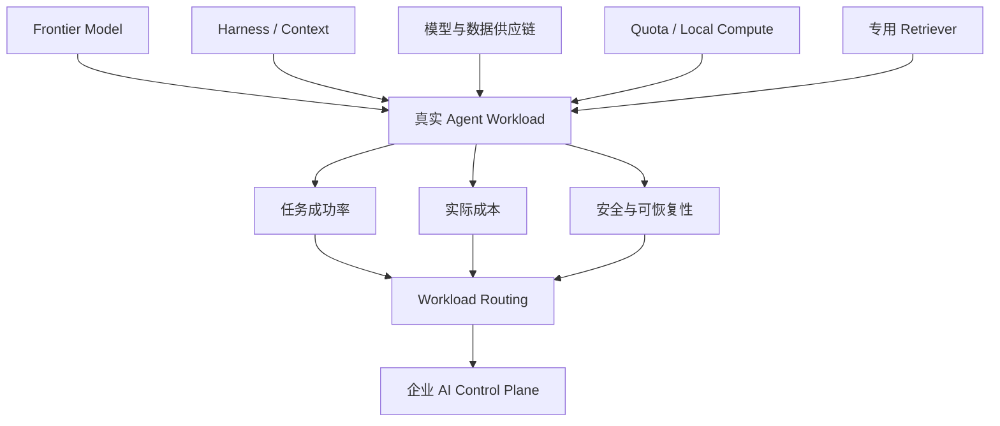

## E. 今日建议关注或采取的动作

1. **角色：AI Builder / Tech Lead｜建议动作：给 GPT-6 Astra 建立一套真正的 2–8 小时长任务 Eval。** 同时测旧 History Search / Notes、新 Context Management、Tool Call、人工打断和 Cost per Successful Task。**为什么现在做**：Astra 今天真正进入产品阶段，而它最值得验证的变化并不是单个 Benchmark。**动作类型：安排测试。**

2. **角色：AI Platform｜建议动作：检查生产模型是否具备“脱离 Hugging Face Hub 恢复”的能力。** 对关键 Artifact 做 Revision Pin、Checksum 和 Mirror，同时继续跑 AMD / NVIDIA / 其他 Backend 的 Portability Test。**为什么现在做**：Hugging Face 的控制权正在进入 NVIDIA 体系。**动作类型：检查风险。**

3. **角色：Codex / Platform 管理员｜建议动作：升级 0.153.0 后跑一次 Session Resilience Test。** 测断线恢复、Resume、Guardian、MCP 多账号 Approval、Plugin Marketplace 和 Experimental Context。**为什么现在做**：本轮变化直接影响长期 Agent 状态一致性。**动作类型：立即执行。**

4. **角色：AI Platform / FinOps｜建议动作：把 Agent 调度从“选哪个模型”升级到“什么时候、在哪个 Compute 上跑”。** 对非实时任务加入 Deadline、Cost Window、Local / Cloud Preference；可以用 GLM 夜间活动和 PAIR 作为两个实际实验。**为什么现在做**：今天两个完全不同的产品都在用调度降低 Agent 成本。**动作类型：纳入路线图。**

---

<!-- English Version -->
# AI Daily Headlines｜2026-09-04

- Language: English
- Time zone: Asia/Singapore
- News window: 2026-09-03 07:30 to 2026-09-04 07:30
- Research cutoff: 2026-09-04 06:58
- Core stories: 7
- Other notable items: 2
- Note: Research ended about 32 minutes before the fixed news window closed, so this edition covers developments through 06:58. Material events between 06:58 and 07:30 should be rechecked in the next edition.

## A. The 3 Most Important Things Today

**1. GPT-6 Astra officially launched with a 1.05M context window, $10 / $50 API pricing, and a new Codex approach to long-running context.** On September 1, the important news was that Astra had reached the Critical Cyber capability threshold. **New today** is the product launch: limited organizations get access first, with ChatGPT Plus, Pro, Business, Enterprise, and broader API access rolling out over the coming days. For coding and Agent teams, the bigger story is that Astra arrives with a new Codex context mechanism that keeps notes across context windows while preserving search over older history. :contentReference[oaicite:52]{index=52}

**2. NVIDIA agreed to acquire Hugging Face for $12.9303 billion, bringing one of the most important open-AI platforms into NVIDIA's corporate structure.** NVIDIA explicitly says Hugging Face will remain multi-model, multi-cloud, and multi-accelerator, and that using the platform will not require NVIDIA hardware. But if the transaction closes, one of the world's central model, dataset, demo, and deployment hubs will sit inside the company that already dominates AI accelerators. The key question is not whether developers should leave Hugging Face today, but whether long-term defaults around runtimes, benchmarks, inference, recommendations, and accelerator neutrality remain genuinely balanced. :contentReference[oaicite:53]{index=53}

**3. OpenAI committed another $1 billion to expand Daybreak cyber access, aiming to put frontier defensive AI into water systems, power grids, local governments, banks, and open-source projects over the next six months.** Daybreak already spans roughly 2,000 approved organizations and workspaces; the new initiative adds an MS-ISAC public-sector and water pilot plus more than 35 partner products and services. Frontier cyber AI is moving from limited security testing toward everyday critical-infrastructure defense, which will force enterprises to rethink Agent permissions, validation, and model access tiers. :contentReference[oaicite:54]{index=54}

## B. Core Stories

### 1. GPT-6 Astra launches with a 1.05M context window, while Codex stops relying only on compaction for long-task memory

- Category: Model / AI Coding / Agent / Security
- Information status: Officially confirmed
- Published: 2026-09-03
- Availability: Limited organizations / Trusted Access first; broader Plus, Pro, Business, Enterprise, and API access over the coming days

**Fact summary**: OpenAI officially launched GPT-6 Astra for complex reasoning, coding, computer use, research, and end-to-end professional workflows. The API model ID is `gpt-6-astra`, with a **1,050,000-token context window** and **128,000-token maximum output**. Standard API pricing is **$10 / MTok input and $50 / MTok output**; OpenAI's model reference also lists cached input at $1 / MTok and cache writes at $12.50 / MTok. :contentReference[oaicite:55]{index=55}

OpenAI reports 72.6% on OSWorld 2.0 versus 65.7% for GPT-5.6 Sol, but the more operationally interesting comparison is simulated task time: roughly 40 minutes versus 75 minutes. With an updated Codex harness, Astra completes Mind2Web tasks 1.9× faster than the current GPT-5.6 Sol experience. These remain OpenAI evaluations rather than guarantees for every enterprise workflow. :contentReference[oaicite:56]{index=56}

**What changed versus before**: **Previously known**: on September 1, OpenAI confirmed that Astra had reached the Critical Cyber capability threshold and therefore required stronger safeguards before release. **New today**: Astra is now entering production, with pricing, context size, Codex behavior, and rollout plans made concrete. :contentReference[oaicite:57]{index=57}

Codex also gains a particularly important long-task mechanism. Historically, once a context window filled up, the system relied heavily on compaction — summarizing prior work so the session could continue. Repeated compaction can lose why a fix failed or what a test proved. Astra can keep notes across context windows while earlier windows remain searchable, so requirements and test results can be retrieved even if they were never captured in the notes. The feature is currently experimental and is expected to become the default for Astra in the coming weeks. :contentReference[oaicite:58]{index=58}

**Why it matters**: This makes the raw “1M context” number less important than long-task memory quality.

Traditional compaction is like turning every hundred pages of a notebook into a one-page summary and discarding the original details. The new design keeps a working summary while allowing older notes to remain searchable. For large refactors, migrations, research jobs, and multi-stage Agents, that may matter more than simply doubling a context window.

**Practical impact**: Teams evaluating Astra should move beyond short coding benchmarks and run real end-to-end jobs lasting 2–8 hours. Measure requirement retention, tool calls, human interruptions, context rebuilds, final test results, and cost per successful task.

Long context also has a pricing caveat. OpenAI's model page says that once a request exceeds 272K input tokens, the entire request moves to a higher pricing tier: input and cached input are charged at 2×, and output at 1.5×. Having a 1M context window therefore does not mean it is economically sensible to fill it routinely. :contentReference[oaicite:59]{index=59}

**Role perspective**:
- For AI Builders, Astra is most interesting on multi-hour Agents, not another set of simple prompts.
- For Tech Leads, the new context mechanism may affect large-repository stability more than benchmark gains.
- For AI Platform teams, routing increasingly needs to consider `model + reasoning_effort + context_strategy + cost`.
- For security teams, Astra's Critical Cyber capability makes privileged tool and network access more sensitive.

**Action to borrow**: Build a fixed long-task durability test. Start with 10–15 requirements, change two halfway through, intentionally create one failure and one user interruption, then check whether the model can still explain the original constraints, the failure, and the final validation evidence.

**Risks and uncertainty**: Astra remains in phased rollout. Official benchmarks largely use OpenAI's own harnesses, while production ChatGPT, Codex, and API configurations differ in prompts, tools, and safety layers. OpenAI also says additional Astra safety checks can sometimes pause or stop legitimate work. :contentReference[oaicite:60]{index=60}

**Next signals to watch**:
1. Full Plus / Pro / Business / Enterprise rollout timing;
2. real long-task performance after the new Codex context mechanism becomes default;
3. tokens and wall-clock time per successful coding task;
4. false-positive friction from Critical Cyber safeguards.

**Mermaid diagram A: how Codex long-task memory changes**

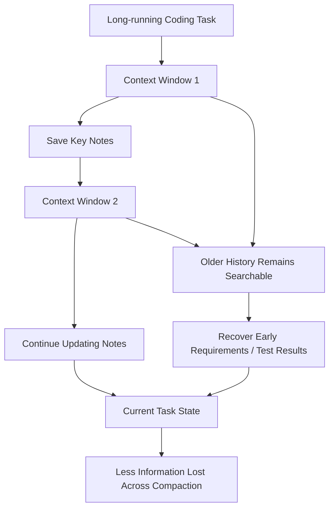

**Mermaid diagram B: a 1M context window does not mean you should fill it**

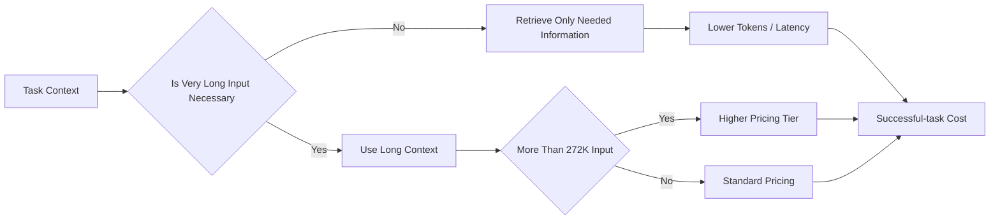

**Sources**:
- :contentReference[oaicite:61]{index=61}
- :contentReference[oaicite:62]{index=62}
- :contentReference[oaicite:63]{index=63}

---

### 2. NVIDIA agrees to acquire Hugging Face for $12.9303B, combining the largest AI-GPU vendor with a central open-model platform

- Category: Policy & Industry / Infrastructure / Model Ecosystem
- Information status: Acquisition agreement officially confirmed; closing status still needs monitoring
- Published: 2026-09-03
- Availability: Agreement announced; Hugging Face continues operating normally today

**Fact summary**: NVIDIA announced that it has agreed to acquire Hugging Face for **$12,930,300,000**. NVIDIA says the platform has more than **18 million developers**, **3 million models**, **500,000 datasets**, **1 million applications**, and more than **200,000 companies** using it for AI discovery, evaluation, customization, and deployment. :contentReference[oaicite:64]{index=64}

NVIDIA explicitly says Hugging Face will remain an open platform where developers can choose models, frameworks, clouds, inference providers, and computing platforms. NVIDIA compute will **not** be required, and Hugging Face will continue supporting multi-cloud and multi-accelerator development and deployment. :contentReference[oaicite:65]{index=65}

**What changed versus before**: Reports of a potential NVIDIA-Hugging Face deal had already circulated. **New today** is NVIDIA's official confirmation that the companies have reached an acquisition agreement. Reuters independently reports the same $12.93B valuation and highlights NVIDIA's expansion from accelerator dominance into the developer and model ecosystem. :contentReference[oaicite:66]{index=66}

This is not an ordinary model-company acquisition. Hugging Face functions simultaneously as a model registry, dataset hub, app/demo platform, benchmark surface, library integration point, and open-source community. For many enterprises it is effectively part of the AI software supply chain.

**Why it matters**: For NVIDIA, the vertical logic is clear: GPU → inference runtime → models → developer platform.

For enterprises and the open community, the question is subtler. NVIDIA has explicitly promised neutrality, so there is no basis today for claiming Hugging Face will suddenly favor CUDA-only deployment. What matters is how subtle defaults evolve over time: which accelerators receive day-zero optimization, whether benchmark surfaces stay balanced, and whether inference recommendations remain equally strong for AMD, Intel, Apple, TPUs, and other infrastructure.

**Practical impact**: There is no reason to leave Hugging Face merely because of this announcement, but production systems should not treat a public Hub as an irreplaceable single source. Critical models and datasets should have pinned revisions, checksums, internal or object-storage mirrors, and clear license / provenance records.

Enterprises should also continue separating model hosting from model serving. Hugging Face becoming part of NVIDIA does not mean every production workload should migrate to NVIDIA; cost, performance, availability, and portability should still decide the runtime.

**Role perspective**:
- For AI Builders, short-term development workflows are unlikely to change abruptly.
- For Tech Leads, Hugging Face should be reviewed as a possible supply-chain dependency.
- For AI Platform teams, multi-accelerator and multi-provider portability becomes more valuable.
- For department managers, open-model infrastructure has clearly become a strategic asset, not a free community side project.

**Action to borrow**: Ensure production models can be restored without a live Hugging Face dependency: pin revisions, retain model and tokenizer hashes, mirror critical artifacts, and test CI deployment from internal storage.

**Risks and uncertainty**: NVIDIA said it has “agreed to acquire” Hugging Face; this should not be described as every legal and regulatory step already completed. There is also no evidence today that non-NVIDIA hardware support is being removed, so neutrality concerns should remain a monitoring question rather than a factual claim. :contentReference[oaicite:67]{index=67}

**Next signals to watch**:
1. regulatory and closing timeline;
2. Hugging Face governance, management, and roadmap changes;
3. whether multi-accelerator benchmarks and inference support retain equal priority;
4. integration between Hugging Face enterprise inference and NVIDIA infrastructure.

**Mermaid diagram A: why this is more than a model-company acquisition**

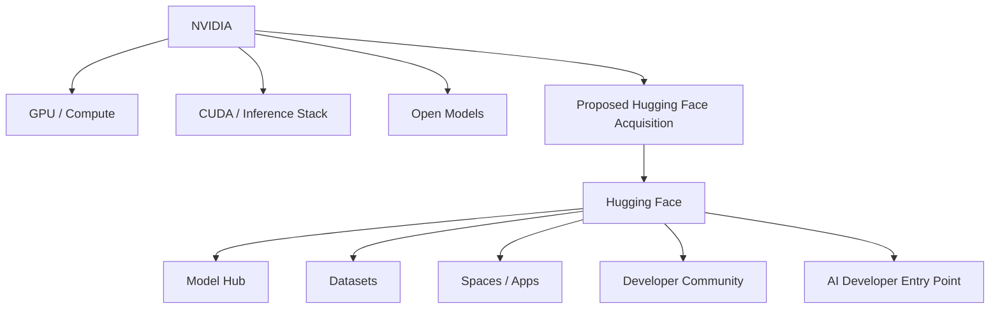

**Mermaid diagram B: what enterprises should monitor**

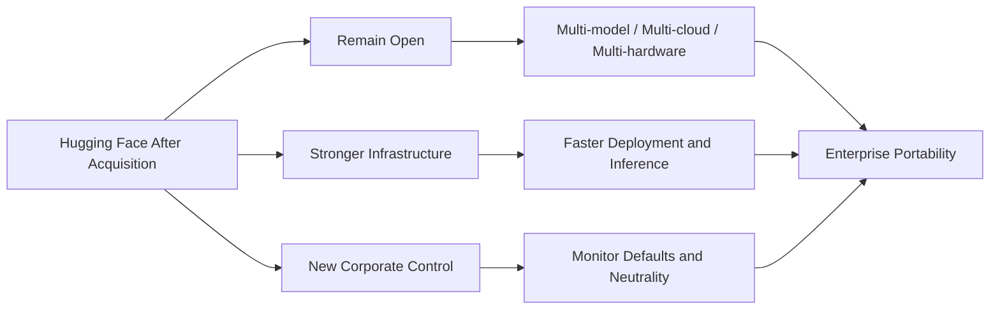

**Sources**:
- :contentReference[oaicite:68]{index=68}
- :contentReference[oaicite:69]{index=69}

---

### 3. OpenAI commits $1B to expand Daybreak, pushing frontier cyber AI into utilities, governments, banks, and open source

- Category: Security / Agent / Policy & Industry
- Information status: Officially confirmed
- Published: 2026-09-03
- Availability: Daybreak already operating; new subsidies, training, and partner programs will expand over coming months

**Fact summary**: OpenAI launched **Daybreak for Frontline Defenders**, committing **$1 billion** in subsidized access, training, technical support, and partnerships, with the resources targeted for use over roughly the next **six months**. Priority groups include water and wastewater operators, electric grids, state and local governments, community and regional banks, nonprofits, and open-source maintainers. :contentReference[oaicite:70]{index=70}

OpenAI says thousands of defenders across roughly **2,000 approved organizations and workspaces** already use Daybreak. The new initiative adds an MS-ISAC public-sector and water pilot plus more than **35 enterprise products and partner-operated services** through the Daybreak Defense Network. :contentReference[oaicite:71]{index=71}

**What changed versus before**: Earlier Daybreak access mostly answered “who can use stronger cyber models?” Today's expansion tackles the more operational question: **how do those capabilities reach under-resourced defenders?**

The program combines model access with training, hands-on support, and partner products. Daybreak Blue covers common defensive work, while approved organizations can reach more sensitive capabilities through Daybreak Red. :contentReference[oaicite:72]{index=72}

**Why it matters**: Frontier cyber AI can create a major asymmetry. Large technology companies already have sophisticated red teams and automation, while local utilities, hospitals, regional banks, and open-source maintainers often operate with tiny security teams.

If Agents can review legacy code, analyze suspicious activity, validate vulnerabilities, develop patches, and verify fixes, the value is not merely “one analyst is 30% faster.” It may make defensive work possible that previously never happened at all.

But wider distribution also means high-capability cyber Agents will operate in more real infrastructure. Governance still needs explicit scan scopes, credentials, network boundaries, and exploit-validation rules.

**Practical impact**: Critical-infrastructure teams should treat Daybreak as a separate cyber capability tier rather than a normal chat model. Platform policy needs to distinguish who may use Blue or Red, which networks Agents may inspect, and which exploit-validation activities must remain inside sandboxes.

Even teams that never receive Daybreak access can borrow the design principle: model access alone is not a security program. Production value requires repeatable workflows, sandboxes, validation criteria, and human approval.

**Role perspective**:
- For security teams, this is an important step toward broad distribution of frontier cyber Agents.
- For Tech Leads, cyber-Agent authorization boundaries should be defined before deployment.
- For department managers, security AI may produce its highest ROI first in defense work that is currently understaffed.

**Action to borrow**: Create separate cyber-Agent authorization levels:

`routine code review → vulnerability validation → exploit PoC → real-environment testing`

Each level should require progressively stronger identity, approval, sandboxing, and audit.

**Risks and uncertainty**: The $1B figure is a global commitment spanning subsidized access, training, technical assistance, and partnerships; it is not a one-time cash distribution. Daybreak also does not eliminate false positives, bad patches, or unauthorized Agent behavior. :contentReference[oaicite:73]{index=73}

**Next signals to watch**:
1. actual qualification criteria for Daybreak Red / Astra access;
2. results from the MS-ISAC pilot;
3. expansion to additional countries;
4. emergence of common audit and sandbox standards for cyber Agents.

**Mermaid diagram A: Daybreak expands from model access into an operating program**

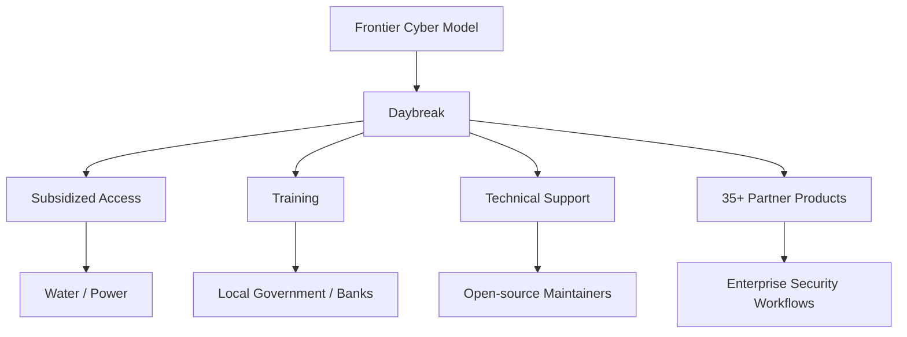

**Mermaid diagram B: cyber-Agent permissions need more than allow / deny**

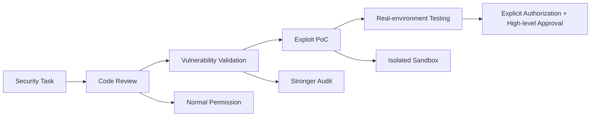

**Source**:
- :contentReference[oaicite:74]{index=74}

---

### 4. Codex CLI 0.153.0 advances plugin distribution, session recovery, and long-context management at the same time

- Category: AI Coding / Harness / MCP / Agent
- Information status: Official product update
- Published: 2026-09-03; GitHub shows “03 Sep 01:37” but the retrieved text does not state a timezone, so no forced conversion is applied
- Availability: 0.153.0 publicly available; new context management is experimental and disabled by default

**Fact summary**: Codex CLI 0.153.0 lets the plugin CLI **list, install, and remove plugins from remote marketplaces**. Plus and Team users also get earlier warnings when less than half of their allowance remains in an approximately five-hour usage window. TUI sessions can automatically reconnect after an external app-server connection drops while retaining drafts and transcripts and pausing submissions whose state is uncertain. :contentReference[oaicite:75]{index=75}

The release also introduces `features.context_management.experimental_mode`. Eligible ChatGPT Plus, Pro, and Pro Lite sessions using the Codex backend can enable token-budget context, history notes, and a `new_context` tool. API-key sessions, custom providers, and temporary structured threads are currently excluded. :contentReference[oaicite:76]{index=76}

**What changed versus before**: Version 0.152.0 strengthened individual runtime budgets such as MCP tool output and long shell timeouts. Version 0.153.0 moves more directly toward the long-lived **session runtime** itself: how to recover from disconnects, preserve history, distribute plugins, and keep safety review state through compaction.

Guardian review history now survives compaction, restarts, and user-created forks. Remembered MCP approvals are scoped to the selected app account, reducing the risk that an approval made under one account silently carries into another. :contentReference[oaicite:77]{index=77}

**Why it matters**: A truly long-running Coding Agent cannot lose its state simply because the UI temporarily loses its app-server connection, nor can safety history disappear every time context is compressed.

These changes look fragmented, but they all answer one question: can a session become a reliable unit of work rather than a disposable CLI conversation?

**Practical impact**: Teams using Codex for multi-hour or remote Agents should run an upgrade regression focused on:

- app-server disconnect / reconnect;
- retained drafts;
- tool and Guardian state after resume;
- plugin marketplace source policy;
- multi-account MCP approvals;
- whether experimental context management materially improves long-running work.

OpenAI is also emitting **turn cost telemetry for ChatGPT sessions** and enforcing marketplace source policy for curated plugins, further pulling cost and plugin supply-chain governance into the runtime. :contentReference[oaicite:78]{index=78}

**Role perspective**:
- For AI Builders, long sessions become more resilient to connection failures.
- For Tech Leads, new context management should be evaluated alongside Astra.
- For AI Platform teams, plugin marketplaces are becoming real software-supply-chain surfaces.
- For security teams, Guardian and MCP approvals need to remain correct across resume and fork operations.

**Action to borrow**: Build a Harness Resilience Test: disconnect the app server mid-task, resume the session, switch app accounts, trigger context compression, then verify that drafts, tool approvals, safety reviews, and task state remain consistent.

**Risks and uncertainty**: Experimental context management is disabled by default and applies only to specific ChatGPT Codex-backend sessions; API-key and custom-provider users should not assume equivalent behavior. Remote plugin marketplaces also make source policy and upgrade control more important. :contentReference[oaicite:79]{index=79}

**Next signals to watch**:
1. when context management becomes default;
2. expansion to API-key and custom-provider sessions;
3. version pinning and approval gates for plugin marketplaces;
4. enterprise exposure of turn-cost telemetry.

**Mermaid diagram**

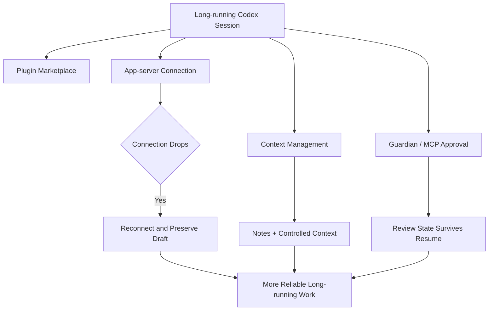

**Source**:
- :contentReference[oaicite:80]{index=80}

---

### 5. GLM-5.3-Flash starts an 18-day coding quota campaign: unlimited overnight in ZCode, double quota in other Agents

- Category: AI Coding / Model / Cost Governance
- Information status: Officially confirmed
- Published: 2026-09-03
- Availability: Automatically active through 2026-09-20

**Fact summary**: Z.ai launched a time-limited usage campaign for GLM-5.3-Flash. From **September 3 through September 20**, every day from **23:00 to 09:00 Singapore Time**, all paid GLM Coding Plan users receive the benefit automatically. :contentReference[oaicite:81]{index=81}

The rule is unusually simple: GLM-5.3-Flash through **ZCode consumes zero quota and is unlimited** during the campaign window; supported third-party Agents receive **2× available quota** under their normal plan rules. The campaign applies only to GLM-5.3-Flash; GLM-5.3 continues consuming quota normally. :contentReference[oaicite:82]{index=82}

**What changed versus before**: GLM-5.3-Flash itself did not launch today. What changed is its **effective capacity and cost**.

GLM Coding Plan normally has both five-hour and weekly credit limits. For eighteen days, users effectively receive a ten-hour special window every day. Teams that can move long coding or batch tasks into overnight execution may therefore see a materially different cost comparison between GLM-5.3-Flash and competing coding models. :contentReference[oaicite:83]{index=83}

**Why it matters**: Model selection cannot be based on API list price alone. Subscription quotas, off-peak discounts, temporary promotions, and cache behavior all alter cost per completed task.

Agent workloads are naturally schedulable. Repository refactors, test generation, code scanning, and documentation synchronization often do not need to finish immediately. If they can run between 23:00 and 09:00, ZCode's marginal quota cost is temporarily close to zero.

**Practical impact**: GLM Coding Plan users can move low-risk long-running work into the overnight window, but “unlimited” should not be interpreted as removing internal safety, concurrency, or tool controls.

Teams using Claude Code, Cline, OpenCode, or other supported third-party Agents should note the distinction: those paths get doubled quota, not ZCode's zero-quota treatment. :contentReference[oaicite:84]{index=84}

**Role perspective**:
- For AI Builders, overnight long jobs can reduce quota pressure significantly.
- For Tech Leads, noninteractive coding jobs can be scheduled around lower-cost windows.
- For department managers, subscription AI has increasingly dynamic effective pricing.

**Action to borrow**: Add `deadline` and `cost_window` fields to Agent scheduling. Move non-real-time tasks automatically into cheaper or promotional capacity windows when SLA permits.

**Risks and uncertainty**: This is explicitly a promotion with an end date. It should not drive long-term architecture or annual budgeting. “Unlimited” means no ZCode quota consumption under the campaign rules, not infinite infrastructure capacity. :contentReference[oaicite:85]{index=85}

**Next signals to watch**:
1. whether the campaign extends beyond September 20;
2. concurrency or rate-limit behavior under heavy use;
3. overnight latency during campaign demand;
4. whether time-based pricing becomes a permanent Z.ai mechanism.

**Sources**:
- :contentReference[oaicite:86]{index=86}
- :contentReference[oaicite:87]{index=87}

---

### 6. NVIDIA PAIR turns multiple household or office PCs into one local-AI capacity pool for parallel Agents

- Category: Infrastructure / Agent / Local AI
- Information status: Official product update
- Published: 2026-09-03
- Availability: PAIR beta available on Windows, macOS, and Linux

**Fact summary**: NVIDIA released **PAIR (Personal AI Router)**, a free open-source tool that automatically discovers compatible machines on a local network and routes independent inference requests to whichever device has available capacity. It currently works with Ollama and LM Studio and adapts as machines join or leave the network. :contentReference[oaicite:88]{index=88}

PAIR supports GeForce RTX 20-series and newer GPUs, RTX PRO Turing and newer, DGX Spark, and Apple M4 or newer. NVIDIA also reports llama.cpp throughput gains of up to **1.9× on an RTX 5090**, while vLLM reaches 1.2× on an RTX PRO 6000 Blackwell workstation and up to 1.4× across two DGX Spark systems. Those results are hardware- and configuration-specific rather than general claims for every local model. :contentReference[oaicite:89]{index=89}

**What changed versus before**: A common local-Agent limitation is that one machine may be capable of running a model, but several subagents still queue behind the same GPU.

PAIR does not magically shard an arbitrary giant model across consumer PCs. Instead, it distributes **independent inference jobs**. If an Agent launches five subagents, those requests can land on different machines instead of competing for one workstation.

NVIDIA is also lowering setup friction. Hermes Agent gains one-click local-model setup on Windows; OpenClaw's Windows app can configure optimized local models on RTX GPUs with at least 24GB VRAM; Perplexity Portable Computer can execute locally and, with user permission, escalate selected work to more than 15 cloud frontier models. :contentReference[oaicite:90]{index=90}

**Why it matters**: Local AI has traditionally offered privacy and freedom from token charges but suffered from setup friction, limited capacity, and idle hardware.

PAIR reframes the problem as local-network scheduling. If a home or office already has gaming PCs, workstations, Macs, and small AI boxes, an Agent can treat them as a pool of inference workers. For parallel Agents, this may be more practical than continually buying one larger GPU.

**Practical impact**: Strong candidates for local execution include code analysis, private documents, financial files, and other data that users do not want sent to the cloud. Harder reasoning tasks can then be escalated selectively, creating a hybrid Agent architecture.

Platform teams still need device trust, consistent model versions, task routing, failure recovery when a PC disappears, and observability across heterogeneous hardware. A LAN is not automatically a trusted compute environment.

**Role perspective**:
- For AI Builders, local multi-agent work begins to resemble a small cluster rather than a single-PC demo.
- For Tech Leads, local inference scheduling and device trust become real platform concerns.
- For product owners, “local by default, cloud by explicit permission” becomes a more practical privacy UX.

**Action to borrow**: Run a 3–5 subagent workflow through PAIR and compare single-GPU versus multi-device total wall-clock time, utilization, retry behavior, and what happens when one device disconnects during execution.

**Risks and uncertainty**: PAIR remains a beta. It routes independent requests; it should not be described as automatically distributing one oversized model across arbitrary consumer PCs. NVIDIA's 1.9× and 1.4× performance figures also apply only to specific hardware and backends. :contentReference[oaicite:91]{index=91}

**Next signals to watch**:
1. support for more OpenAI-compatible local servers;
2. model- and KV-cache-aware scheduling;
3. mixed Windows / macOS / Linux reliability;
4. standardized local-to-cloud routing.

**Mermaid diagram**

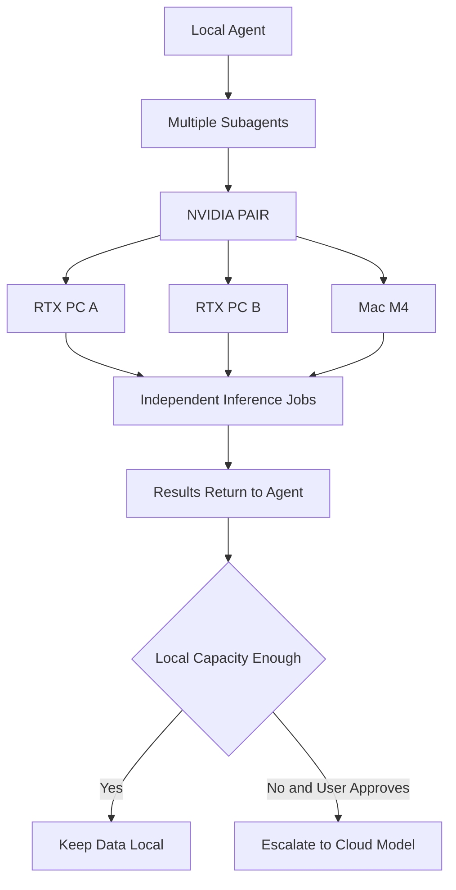

**Source**:
- :contentReference[oaicite:92]{index=92}

---

### 7. NeoMME launches with roughly 51 pages/sec indexing and compression from 1.5MB to 6KB per page for visual RAG

- Category: Research / Infrastructure / RAG
- Information status: Official project release / technical report
- Published: 2026-09-03
- Availability: 260M and 800M checkpoints released under Apache 2.0 with Hugging Face Transformers support

**Fact summary**: Hcompany released NeoMME, a family of **260M and 800M** multilingual multimodal encoders. Instead of a separate vision tower connected to a language model, text tokens and raw image patches enter a single bidirectional Transformer. The Retriever version produces dense and late-interaction embeddings in one forward pass. :contentReference[oaicite:93]{index=93}

On an NVIDIA L40S at 2048×2048 page resolution, the 260M Retriever encodes roughly **51 pages per second**, nearly twice ColModernVBERT. More importantly for production scale, hierarchical token pooling and quantization can shrink the late-interaction index from roughly **1.5MB per page to 6KB per page — 255× smaller — while retaining more than 95% of baseline nDCG@10**. :contentReference[oaicite:94]{index=94}

**What changed versus before**: A common enterprise RAG architecture OCRs PDFs and retrieves text chunks. Another approach retrieves original page images so charts, tables, formulas, and layout are preserved, but visual retrieval often has a much larger indexing footprint.

NeoMME focuses on making that second architecture cheaper enough to deploy at scale. It is not another chat model; it is a specialized infrastructure component for visual retrieval.

**Why it matters**: Enterprise documents are often hardest exactly where text RAG is weakest: financial tables, dashboards, engineering drawings, invoices, slides, forms, and complex page layout.

If visual retrieval storage drops from megabytes per page to kilobytes, the storage and memory profile of a million-page corpus changes dramatically. That can matter more to a large enterprise RAG system than a few benchmark points on the final generator.

**Practical impact**: NeoMME should be tested on documents where OCR loses structure, not plain text wikis. Compare:

`OCR + text embedding`  
versus  
`page image + NeoMME`

Measure retrieval nDCG / recall, index storage, indexing time, and downstream VLM answer groundedness.

The 260M model reports ViDoRe v3 nDCG@10 of 0.523, only 0.002 behind 3.75B ColQwen2.5 while using roughly 14× fewer parameters. Some entries in the comparison table come from the project team's own evaluations, so independent reproduction still matters. :contentReference[oaicite:95]{index=95}

**Role perspective**:
- For AI Builders, visual RAG gains a much smaller retriever option.
- For Tech Leads, index storage and corpus build cost are the most practical metrics.
- For product owners, complex PDF retrieval no longer has to depend entirely on OCR text.

**Action to borrow**: Create a 200–500 query evaluation set from real documents rich in tables, charts, and layout. Move away from text RAG only if visual retrieval improves end answers while keeping indexing cost manageable.

**Risks and uncertainty**: NeoMME is a retriever / encoder, not a generative answering model. Final quality still depends on top-k selection, the downstream VLM, and prompting. The 51 pages/sec and 255× compression figures also rely on specific hardware and compression settings and need local validation. :contentReference[oaicite:96]{index=96}

**Next signals to watch**:
1. independent ViDoRe and enterprise-PDF evaluations;
2. end-to-end cost versus OCR + text RAG;
3. recall after aggressive 6KB/page compression across different document types;
4. native support for late-interaction indexes in vector databases.

**Sources**:
- :contentReference[oaicite:97]{index=97}
- :contentReference[oaicite:98]{index=98}

## C. Other Notable Items

**1. OpenAI and Anthropic both experienced material service incidents on September 3, reinforcing that provider failover needs to exist in production rather than only in architecture diagrams.** OpenAI reported elevated errors across ChatGPT and Codex before resolving the incident; some Codex Remote Control users may need to pair their mobile devices again. Anthropic separately reported elevated errors across Mythos, Fable, and Opus models affecting Claude.ai, the API, Claude Code, and Cowork, with impact ending at 16:16 UTC. There is no reliable evidence that the incidents shared a cause, so temporal overlap should not be presented as a common failure. :contentReference[oaicite:99]{index=99}  
Sources: :contentReference[oaicite:100]{index=100}; :contentReference[oaicite:101]{index=101}

**2. Amazon Quick launched a Max plan with 5× the usage and 5× the storage of Plus.** AWS positions Quick Max for power users running large concurrent Agent and workflow workloads throughout the month, with monthly and annual billing. It does not materially change Agent architecture, so it remains outside the core stories, but it reinforces how AI-workspace subscription tiers increasingly differentiate by workload capacity rather than traditional feature flags. :contentReference[oaicite:102]{index=102}  
Source: :contentReference[oaicite:103]{index=103}

## D. AI Trend Summary

### Trends supported by current facts

**Trend 1: Frontier models and Harnesses are becoming inseparable evaluation units.** GPT-6 Astra's practical value comes partly from Codex's new context behavior, while Codex 0.153.0 continues strengthening session recovery, plugins, Guardian state, and runtime context. “Which harness is this model running inside?” increasingly changes the result.

**Trend 2: AI infrastructure is consolidating rapidly, while openness remains strategically important.** NVIDIA's Hugging Face acquisition announcement comes with explicit commitments to multi-hardware, multi-cloud, and open models. Open ecosystems are not something accelerator vendors can ignore; they are becoming strategic distribution layers worth owning.

**Trend 3: Frontier cyber AI is moving from limited testing into real critical-infrastructure defense.** Astra is now launching while Daybreak expands through a $1B program for utilities and public-sector defenders. Governance will increasingly focus not on whether a model can perform cyber analysis, but on who can authorize which actions against which real systems.

**Trend 4: Agent cost is becoming a scheduling problem.** GLM uses overnight free / doubled quota to shift demand across time, while PAIR shifts work across idle local hardware. One schedules by time, the other by compute location; both move workloads toward cheaper capacity.

**Trend 5: Small specialized models still have a clear role.** While attention centers on GPT-6-class frontier systems, NeoMME shows that a 260M retriever with the right architecture and compression can materially reduce the cost of large visual-RAG systems.

### Analytical inference

**Inference 1: Enterprise AI platforms will increasingly manage workloads rather than models.** A task should be placed according to required capability, deadline, cost window, data sensitivity, available local hardware, and provider health rather than starting with a fixed default model.

**Inference 2: Supply-chain neutrality and recoverability will become explicit platform metrics.** Hugging Face joining NVIDIA does not automatically end neutrality, but it makes artifact mirroring, revision pinning, multi-accelerator portability, and provider failover more important enterprise practices.

**Trend overview**

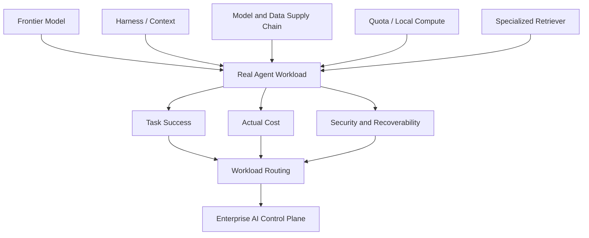

## E. Actions to Consider Today

1. **Role: AI Builder / Tech Lead | Action: build a real 2–8 hour GPT-6 Astra evaluation.** Measure the new history-search / notes behavior, context management, tool calls, interruptions, and cost per successful task. **Why now**: Astra has moved into actual product rollout, and its most interesting change is not a single benchmark score. **Action type: Schedule a test.**

2. **Role: AI Platform | Action: verify that production models can be restored without depending on a live Hugging Face Hub.** Pin revisions, retain checksums and mirrors, and keep portability tests running across NVIDIA, AMD, and other backends. **Why now**: Hugging Face's control structure is moving inside NVIDIA. **Action type: Risk review.**

3. **Role: Codex / Platform administrators | Action: after upgrading to 0.153.0, run a session-resilience test.** Exercise disconnect/reconnect, resume, Guardian state, multi-account MCP approvals, plugin marketplaces, and experimental context management. **Why now**: this release directly changes long-running session consistency. **Action type: Execute now.**

4. **Role: AI Platform / FinOps | Action: expand Agent scheduling from “which model?” to “when and on what compute should this run?”** Add deadline, cost-window, and local/cloud preferences for non-real-time jobs; GLM's overnight campaign and PAIR provide two concrete experiments. **Why now**: two very different products are using scheduling to reduce Agent cost in the same reporting window. **Action type: Add to roadmap.**
